# Brunel-Project

RNA structure in health and disease - investigation of snoRNA cluster in the imprinted Dlk1-Dio3 region

Russell Hamilton & Anne Ferguson-Smith
Department of Genetics, University of Cambridge, Downing Street, Cambridge, CB2 3EH

The epigenetic phenomenon of genomic imprinting leads to specific genes being expressed in a parent-specific manner. Imprinted genes have key roles in placenta and embryo development, as well as an emerging role in brain development and function. The Dlk1-Dio3 imprinted region contains two maternally expressed small nucleolar RNA (snoRNA) clusters, SNORD113 & SNORD114, containing 9 and 31 copies respectively (10.1016/j.tig.2008.03.011). Human patients with disruptions in this conserved region display growth retardation and facial dysmorphism (10.1038/ng.2007.56). However little is known about the mechanism of action of the snoRNAs in this region. Deletion of the related SNORD116 cluster (paternally expressed) in the SNRPN imprinted region has been shown to be a direct cause of Prader-Willi syndrome and postnatal growth retardation (10.1038/ng.158; 10.1371/journal.pgen.0030235). 

Using open source computational tools we will model the snoRNA 2D and 3D structures of the Dlk1-Dio3 region (10.7490/f1000research.1117078.1). Transcribed as a precursor long non-coding RNA, Rian/MEG8, the C/D box motif containing snoRNAs have been shown to be directed by genomic imprinting and, unusually for snoRNAs, to have brain specific expression. snoRNA have previously been shown to contain Ca2+ sensitive kink-turn (KT) motifs. In low Ca2+, the KTs are in an extended confirmation, but with increased Ca2+ develop a pronounced 60o kink, opening up the nucleotide bases for sequence specific recognition. KT motifs can therefore act as a Ca2+ sensitive switch for mediating protein or tertiary RNA interactions. The brain specific expression of these C/D snoRNAs and demonstration of the existence of calcium sensitive KT motifs would provide valuable insight into these enigmatic snoRNAs and their role in the nervous system. 

## Infernal search

In order to locate the snoRNAs in the regions of interest, Infernal ("INFERence of RNA ALignment") was employed. This program allows the user to access DNA sequence databases to study and analyse RNA structure and sequence similarities.  Infernal requires an MSA file in Stockholm format to conduct the search. Rfam was used to obatin the sto file for Small nucleolar RNA SNORD113/SNORD114 family (RF00181).
File obtained: RF00181.stockholm.txt
#The name of the sto file was changed to SNO.sto to simplify the process:

```phython
mv RF00181.stockholm.txt SNO.sto
```
From the sto file a CM is build.

```phython
cmbuild SNO.cm SNO.sto
INFERNAL1/a [1.1.1 | July 2014]
NAME     SNORD113
ACC      RF00181
DESC     Small nucleolar RNA SNORD113/SNORD114 family
STATES   229
NODES    72
CLEN     75
W        178
ALPH     RNA
RF       no
CONS     yes
MAP      yes
DATE     Tue Jul 14 16:46:28 2020
COM      [1] /usr/lib/infernal/cmbuild SNO.cm SNO.sto
COM      [2] /usr/lib/infernal/cmcalibrate SNO.cm
PBEGIN   0.05
PEND     0.05
WBETA    1e-07
QDBBETA1 1e-07
QDBBETA2 1e-15
N2OMEGA  1.52588e-05
N3OMEGA  1.52588e-05
ELSELF   -0.08926734
NSEQ     59
EFFN     9.315979
CKSUM    823253948
NULL     0.000  0.000  0.000  0.000 
GA       36.00
TC       36.00
NC       35.90
EFP7GF   -12.3635 0.71868
ECMLC    0.64608    -5.70987     3.21223     1600000      382510  0.003137
ECMGC    0.36761   -18.65720    -3.78769     1600000       94621  0.004227
ECMLI    0.60854    -4.00500     4.77592     1600000      251093  0.004779
ECMGI    0.39968   -13.69947    -0.69710     1600000       72278  0.005534
CM
                                             [ ROOT    0 ]      -      - - - - -
     S     0    -1 0     1     4     1     1   178   306  -8.579  -8.786  -0.051  -5.081                 
    IL     1     1 2     1     4     1    34   180   308  -1.686  -2.369  -1.117  -4.855                  0.000  0.000  0.000  0.000 
    IR     2     2 3     2     3     1    33   180   308  -1.442  -0.798  -4.142                          0.000  0.000  0.000  0.000 
                                             [ MATL    1 ]      1      - U - - -
    ML     3     2 3     5     3     1    34   178   307  -9.819  -0.007  -8.137                         -1.002 -1.728 -2.167  1.573 
     D     4     2 3     5     3     0    27   176   305  -6.072  -0.497  -1.855                         
    IL     5     5 3     5     3     1    31   178   307  -1.925  -0.554  -4.164                          0.000  0.000  0.000  0.000 
                                             [ MATR    2 ]      -    109 - a - -
    MR     6     5 3     8     3     1    33   177   306  -9.851  -0.007  -8.168                          0.419 -0.214 -1.036  0.393 
     D     7     5 3     8     3     0    24   175   303  -6.390  -1.568  -0.620                         
    IR     8     8 3     8     3     1    30   177   306  -1.925  -0.554  -4.164                          0.000  0.000  0.000  0.000 
                                             [ MATR    3 ]      -    108 - A - -
    MR     9     8 3    11     5     1    33   176   305  -8.526  -0.014  -8.342  -8.554  -9.446          1.572 -2.980 -0.541 -2.236 
     D    10     8 3    11     5     0    23   174   302  -5.352  -0.707  -2.978  -4.409  -2.404         
    IR    11    11 3    11     5     1    28   176   304  -2.408  -0.496  -5.920  -4.087  -5.193          0.000  0.000  0.000  0.000 
                                             [ MATP    4 ]      2    107 G C - -
    MP    12    11 3    16     6     2    32   175   304  -9.956  -9.895  -0.012  -8.672  -8.951  -9.346 -1.714 -1.037 -3.478  0.720 -3.971 -4.183  0.056 -3.999 -0.058  3.037 -4.137  0.328 -0.155 -1.862 -1.705 -1.789 
    ML    13    11 3    16     6     1    25   173   301  -6.250  -6.596  -1.310  -1.005  -6.446  -3.975  0.368 -0.385 -0.191  0.094 
    MR    14    11 3    16     6     1    25   172   301  -6.988  -5.717  -1.625  -5.695  -0.829  -3.908  0.368 -0.385 -0.191  0.094 
     D    15    11 3    16     6     0    20   168   296  -9.049  -7.747  -3.544  -4.226  -4.244  -0.319 
    IL    16    16 5    16     6     1    27   174   303  -2.579  -2.842  -0.760  -4.497  -5.274  -4.934  0.000  0.000  0.000  0.000 
    IR    17    17 6    17     5     1    27   174   302  -2.408  -0.496  -5.920  -4.087  -5.193          0.000  0.000  0.000  0.000 
                                             [ MATP    5 ]      3    106 G C - -
    MP    18    17 6    22     6     2    31   173   302  -9.956  -9.895  -0.023  -6.614  -8.951  -9.346 -4.275 -2.958 -4.119  0.986 -1.301 -4.700 -0.294 -4.772 -4.504  3.366 -4.771 -0.158 -0.563 -2.348 -2.290 -3.091 
    ML    19    17 6    22     6     1    25   171   299  -6.250  -6.596  -1.310  -1.005  -6.446  -3.975  0.368 -0.385 -0.191  0.094 
    MR    20    17 6    22     6     1    24   170   299  -6.988  -5.717  -1.625  -5.695  -0.829  -3.908  0.368 -0.385 -0.191  0.094 
     D    21    17 6    22     6     0    19   166   295  -9.049  -7.747  -3.544  -4.226  -4.244  -0.319 
    IL    22    22 5    22     6     1    26   172   301  -2.579  -2.842  -0.760  -4.497  -5.274  -4.934  0.000  0.000  0.000  0.000 
    IR    23    23 6    23     5     1    27   172   301  -2.408  -0.496  -5.920  -4.087  -5.193          0.000  0.000  0.000  0.000 
                                             [ MATP    6 ]      4    105 A U - -
    MP    24    23 6    28     6     2    30   171   300  -9.945  -9.884  -0.012  -8.660  -8.940  -9.335 -2.556 -4.570 -5.175  3.771 -6.464 -7.100 -2.463 -5.271 -5.508 -0.767 -6.081 -0.201 -2.612 -3.055 -4.222 -4.278 
    ML    25    23 6    28     6     1    24   169   298  -6.496  -6.842  -1.010  -1.251  -6.692  -4.221  0.770 -0.664 -0.381 -0.158 
    MR    26    23 6    28     6     1    23   169   297  -6.988  -5.717  -1.625  -5.695  -0.829  -3.908  0.368 -0.385 -0.191  0.094 
     D    27    23 6    28     6     0    19   165   294  -9.049  -7.747  -3.544  -4.226  -4.244  -0.319 
    IL    28    28 5    28     6     1    26   170   299  -2.579  -2.842  -0.760  -4.497  -5.274  -4.934  0.000  0.000  0.000  0.000 
    IR    29    29 6    29     5     1    26   170   299  -2.408  -0.496  -5.920  -4.087  -5.193          0.000  0.000  0.000  0.000 
                                             [ MATP    7 ]      5    104 c g - -
    MP    30    29 6    34     6     2    28   169   298  -9.956  -9.895  -0.012  -8.672  -8.951  -9.346 -2.790 -1.833 -1.545  0.383 -2.650 -3.798  2.304 -3.102 -2.977  0.744 -3.536 -1.249  1.208 -3.099  1.837 -1.579 
    ML    31    29 6    34     6     1    23   167   296  -6.250  -6.596  -1.310  -1.005  -6.446  -3.975  0.368 -0.385 -0.191  0.094 
    MR    32    29 6    34     6     1    21   167   295  -6.988  -5.717  -1.625  -5.695  -0.829  -3.908  0.368 -0.385 -0.191  0.094 
     D    33    29 6    34     6     0    18   164   293  -9.049  -7.747  -3.544  -4.226  -4.244  -0.319 
    IL    34    34 5    34     6     1    25   168   297  -2.579  -2.842  -0.760  -4.497  -5.274  -4.934  0.000  0.000  0.000  0.000 
    IR    35    35 6    35     5     1    24   168   297  -2.408  -0.496  -5.920  -4.087  -5.193          0.000  0.000  0.000  0.000 
                                             [ MATP    8 ]      6    103 c g - -
    MP    36    35 6    40     4     2    26   167   296  -8.579  -8.786  -0.017  -7.200                 -2.608 -2.760 -1.948  0.391 -1.368 -3.619  2.728 -0.788 -2.819  0.341 -2.191 -1.227  1.029 -2.927  0.968 -1.943 
    ML    37    35 6    40     4     1    22   166   295  -3.758  -3.940  -0.507  -2.670                  0.368 -0.385 -0.191  0.094 
    MR    38    35 6    40     4     1    19   165   293  -4.809  -3.838  -1.706  -0.766                  0.368 -0.385 -0.191  0.094 
     D    39    35 6    40     4     0    18   163   292  -4.568  -4.250  -2.265  -0.520                 
    IL    40    40 5    40     4     1    24   167   295  -1.686  -2.369  -1.117  -4.855                  0.000  0.000  0.000  0.000 
    IR    41    41 6    41     3     1    23   167   295  -1.442  -0.798  -4.142                          0.000  0.000  0.000  0.000 
                                             [ MATL    9 ]      7      - A - - -
    ML    42    41 6    44     3     1    24   165   294  -4.064  -0.094  -8.178                          1.290 -2.381 -0.114 -1.188 
     D    43    41 6    44     3     0    17   162   291  -6.174  -1.687  -0.566                         
    IL    44    44 3    44     3     1    23   165   294  -1.927  -0.522  -4.627                          0.000  0.000  0.000  0.000 
                                             [ MATL   10 ]      9      - a - - -
    ML    45    44 3    47     3     1    24   164   293  -9.524  -0.007  -8.178                          0.743 -1.116 -0.449  0.180 
     D    46    44 3    47     3     0    16   161   290  -6.174  -1.687  -0.566                         
    IL    47    47 3    47     3     1    22   164   293  -1.442  -0.798  -4.142                          0.000  0.000  0.000  0.000 
                                             [ MATL   11 ]     10      - U - - -
    ML    48    47 3    50     3     1    23   163   292  -9.524  -0.007  -8.178                         -3.225 -2.114 -3.965  1.847 
     D    49    47 3    50     3     0    16   160   289  -6.174  -1.687  -0.566                         
    IL    50    50 3    50     3     1    21   163   292  -1.442  -0.798  -4.142                          0.000  0.000  0.000  0.000 
                                             [ MATL   12 ]     11      - G - - -
    ML    51    50 3    53     3     1    22   162   291  -9.524  -0.007  -8.178                         -2.580 -2.386  1.809 -2.857 
     D    52    50 3    53     3     0    15   159   288  -6.174  -1.687  -0.566                         
    IL    53    53 3    53     3     1    20   162   291  -1.442  -0.798  -4.142                          0.000  0.000  0.000  0.000 
                                             [ MATL   13 ]     12      - A - - -
    ML    54    53 3    56     3     1    21   161   290  -9.524  -0.007  -8.178                          1.754 -2.967 -2.070 -1.937 
     D    55    53 3    56     3     0    14   158   287  -6.174  -1.687  -0.566                         
    IL    56    56 3    56     3     1    19   161   290  -1.442  -0.798  -4.142                          0.000  0.000  0.000  0.000 
                                             [ MATL   14 ]     13      - U - - -
    ML    57    56 3    59     3     1    20   160   289  -9.524  -0.007  -8.178                         -4.201 -3.826 -5.002  1.943 
     D    58    56 3    59     3     0    13   157   286  -6.174  -1.687  -0.566                         
    IL    59    59 3    59     3     1    18   160   289  -1.442  -0.798  -4.142                          0.000  0.000  0.000  0.000 
                                             [ MATL   15 ]     14      - G - - -
    ML    60    59 3    62     3     1    19   159   288  -9.524  -0.007  -8.178                         -1.952 -4.505  1.861 -3.943 
     D    61    59 3    62     3     0    13   156   284  -6.174  -1.687  -0.566                         
    IL    62    62 3    62     3     1    18   159   288  -1.442  -0.798  -4.142                          0.000  0.000  0.000  0.000 
                                             [ MATL   16 ]     15      - A - - -
    ML    63    62 3    65     3     1    19   158   287  -9.524  -0.007  -8.178                          1.735 -1.907 -2.252 -2.362 
     D    64    62 3    65     3     0    12   155   283  -6.174  -1.687  -0.566                         
    IL    65    65 3    65     3     1    17   158   287  -1.442  -0.798  -4.142                          0.000  0.000  0.000  0.000 
                                             [ MATL   17 ]     16      - C - - -
    ML    66    65 3    68     3     1    18   157   286  -9.524  -0.023  -6.092                         -0.907  1.046 -0.566 -0.460 
     D    67    65 3    68     3     0    12   153   281  -6.174  -1.687  -0.566                         
    IL    68    68 3    68     3     1    16   157   286  -1.442  -0.798  -4.142                          0.000  0.000  0.000  0.000 
                                             [ MATL   18 ]     17      - c - - -
    ML    69    68 3    71     3     1    18   156   285  -9.508  -0.007  -8.162                          0.268  0.361 -1.062  0.046 
     D    70    68 3    71     3     0    11   151   279  -6.559  -1.084  -0.950                         
    IL    71    71 3    71     3     1    15   156   285  -1.442  -0.798  -4.142                          0.000  0.000  0.000  0.000 
                                             [ MATL   19 ]     18      - A - - -
    ML    72    71 3    74     3     1    17   155   284  -2.464  -0.294  -8.178                          1.287 -1.250 -1.261 -0.470 
     D    73    71 3    74     3     0    10   137   265  -6.174  -1.687  -0.566                         
    IL    74    74 3    74     3     1    18   166   295  -0.207  -2.950  -7.945                          0.000  0.000  0.000  0.000 
                                             [ MATL   20 ]     34      - C - - -
    ML    75    74 3    77     3     1    16   124   218  -9.524  -0.007  -8.178                         -0.802  1.032 -0.679 -0.402 
     D    76    74 3    77     3     0     9   122   215  -6.174  -1.687  -0.566                         
    IL    77    77 3    77     3     1    14   125   218  -1.442  -0.798  -4.142                          0.000  0.000  0.000  0.000 
                                             [ MATL   21 ]     35      - U - - -
    ML    78    77 3    80     3     1    15   123   217  -9.524  -0.007  -8.178                         -2.317 -0.762 -2.455  1.598 
     D    79    77 3    80     3     0     8   120   214  -6.174  -1.687  -0.566                         
    IL    80    80 3    80     3     1    13   124   217  -1.442  -0.798  -4.142                          0.000  0.000  0.000  0.000 
                                             [ MATL   22 ]     36      - G - - -
    ML    81    80 3    83     3     1    14   122   216  -9.524  -0.020  -6.339                         -1.170 -1.994  1.534 -1.290 
     D    82    80 3    83     3     0     8   119   213  -6.174  -1.687  -0.566                         
    IL    83    83 3    83     3     1    12   123   216  -1.442  -0.798  -4.142                          0.000  0.000  0.000  0.000 
                                             [ MATL   23 ]     37      - G - - -
    ML    84    83 3    86     3     1    14   121   215  -9.511  -0.007  -8.165                         -1.383 -2.073  1.522 -0.978 
     D    85    83 3    86     3     0     7   118   212  -6.487  -2.000  -0.437                         
    IL    86    86 3    86     3     1    12   122   215  -1.442  -0.798  -4.142                          0.000  0.000  0.000  0.000 
                                             [ MATL   24 ]     38      - U - - -
    ML    87    86 3    89     3     1    14   120   214  -9.511  -0.007  -8.165                         -1.669 -1.856 -0.593  1.458 
     D    88    86 3    89     3     0     6   117   211  -6.487  -2.000  -0.437                         
    IL    89    89 3    89     3     1    11   121   214  -1.442  -0.798  -4.142                          0.000  0.000  0.000  0.000 
                                             [ MATL   25 ]     39      - G - - -
    ML    90    89 3    92     3     1    13   119   213  -9.511  -0.007  -8.165                         -0.138 -3.463  1.524 -3.005 
     D    91    89 3    92     3     0     6   116   210  -6.487  -2.000  -0.437                         
    IL    92    92 3    92     3     1    11   120   213  -1.442  -0.798  -4.142                          0.000  0.000  0.000  0.000 
                                             [ MATL   26 ]     40      - G - - -
    ML    93    92 3    95     3     1    12   118   212  -2.066  -0.400  -8.165                         -2.440 -2.670  1.793 -2.365 
     D    94    92 3    95     3     0     5   115   209  -6.487  -2.000  -0.437                         
    IL    95    95 3    95     3     1    11   118   212  -1.650  -0.590  -5.861                          0.000  0.000  0.000  0.000 
                                             [ MATL   27 ]     44      - C - - -
    ML    96    95 3    98     3     1    11   117   210  -9.511  -0.016  -6.703                         -1.966  1.435 -2.418 -0.229 
     D    97    95 3    98     3     0     5   115   208  -6.487  -1.168  -0.879                         
    IL    98    98 3    98     3     1     9   117   211  -1.442  -0.798  -4.142                          0.000  0.000  0.000  0.000 
                                             [ MATL   28 ]     45      - g - - -
    ML    99    98 3   101     3     1    11   116   209  -9.515  -0.007  -8.169                          0.259 -0.771  0.408 -0.167 
     D   100    98 3   101     3     0     3   113   207  -6.395  -1.908  -0.471                         
    IL   101   101 3   101     3     1     8   116   210  -1.442  -0.798  -4.142                          0.000  0.000  0.000  0.000 
                                             [ MATL   29 ]     46      - U - - -
    ML   102   101 3   104     3     1    10   115   208  -9.515  -0.007  -8.169                         -2.551 -1.672 -2.492  1.739 
     D   103   101 3   104     3     0     3   113   206  -6.395  -1.292  -0.786                         
    IL   104   104 3   104     3     1     8   115   209  -1.442  -0.798  -4.142                          0.000  0.000  0.000  0.000 
                                             [ MATL   30 ]     47      - a - - -
    ML   105   104 3   107     3     1     9   114   207  -9.524  -0.007  -8.178                          0.765  0.125 -0.898 -0.571 
     D   106   104 3   107     3     0     2   111   205  -6.174  -1.687  -0.566                         
    IL   107   107 3   107     3     1     7   114   208  -1.442  -0.798  -4.142                          0.000  0.000  0.000  0.000 
                                             [ MATL   31 ]     48      - U - - -
    ML   108   107 3   110     3     1     8   113   206  -9.524  -0.007  -8.178                         -2.579 -1.960 -2.306  1.754 
     D   109   107 3   110     3     0     1   110   204  -6.174  -1.687  -0.566                         
    IL   110   110 3   110     3     1     6   113   207  -1.442  -0.798  -4.142                          0.000  0.000  0.000  0.000 
                                             [ MATL   32 ]     49      - G - - -
    ML   111   110 3   113     3     1     8   112   205  -3.128  -0.181  -8.178                         -1.996 -3.796  1.813 -2.615 
     D   112   110 3   113     3     0     1   109   203  -6.174  -1.687  -0.566                         
    IL   113   113 3   113     3     1     6   112   205  -2.269  -0.395  -4.969                          0.000  0.000  0.000  0.000 
                                             [ MATL   33 ]     51      - A - - -
    ML   114   113 3   116     3     1     7   111   204  -9.524  -0.007  -8.178                          1.734 -3.618 -1.010 -3.400 
     D   115   113 3   116     3     0     0   108   202  -6.174  -1.687  -0.566                         
    IL   116   116 3   116     3     1     5   111   205  -1.442  -0.798  -4.142                          0.000  0.000  0.000  0.000 
                                             [ MATL   34 ]     52      - G - - -
    ML   117   116 3   119     3     1     6   110   203  -9.524  -0.007  -8.178                         -0.350 -1.633  1.324 -1.362 
     D   118   116 3   119     3     0     0   107   201  -6.174  -1.687  -0.566                         
    IL   119   119 3   119     3     1     4   110   204  -1.442  -0.798  -4.142                          0.000  0.000  0.000  0.000 
                                             [ MATL   35 ]     53      - U - - -
    ML   120   119 3   122     3     1     6   109   202  -9.524  -0.007  -8.178                         -0.401 -1.978 -1.662  1.419 
     D   121   119 3   122     3     0     0   106   200  -6.174  -1.687  -0.566                         
    IL   122   122 3   122     3     1     3   109   203  -1.442  -0.798  -4.142                          0.000  0.000  0.000  0.000 
                                             [ MATL   36 ]     54      - C - - -
    ML   123   122 3   125     3     1     5   108   201  -9.524  -0.007  -8.178                         -1.885  1.291 -1.695 -0.038 
     D   124   122 3   125     3     0     0   105   199  -6.174  -1.687  -0.566                         
    IL   125   125 3   125     3     1     3   108   202  -1.442  -0.798  -4.142                          0.000  0.000  0.000  0.000 
                                             [ MATL   37 ]     55      - A - - -
    ML   126   125 3   128     3     1     4   107   200  -9.524  -0.007  -8.178                          1.223 -1.985 -0.569 -0.437 
     D   127   125 3   128     3     0     0   104   198  -6.174  -1.687  -0.566                         
    IL   128   128 3   128     3     1     2   107   201  -1.442  -0.798  -4.142                          0.000  0.000  0.000  0.000 
                                             [ MATL   38 ]     56      - U - - -
    ML   129   128 3   131     3     1     3   106   199  -9.524  -0.034  -5.495                         -0.783 -1.238 -1.631  1.418 
     D   130   128 3   131     3     0     0   103   197  -6.174  -1.687  -0.566                         
    IL   131   131 3   131     3     1     2   106   200  -1.442  -0.798  -4.142                          0.000  0.000  0.000  0.000 
                                             [ MATL   39 ]     57      - a - - -
    ML   132   131 3   134     3     1     4   105   198  -9.497  -0.007  -8.151                          0.447 -0.365  0.019 -0.240 
     D   133   131 3   134     3     0     0   102   196  -6.769  -2.282  -0.349                         
    IL   134   134 3   134     3     1     1   105   199  -1.442  -0.798  -4.142                          0.000  0.000  0.000  0.000 
                                             [ MATL   40 ]     58      - c - - -
    ML   135   134 3   137     3     1     3   104   197  -9.497  -0.007  -8.151                         -0.528  0.563 -0.167 -0.091 
     D   136   134 3   137     3     0     0   102   195  -6.769  -0.880  -1.160                         
    IL   137   137 3   137     3     1     1   104   198  -1.442  -0.798  -4.142                          0.000  0.000  0.000  0.000 
                                             [ MATL   41 ]     59      - A - - -
    ML   138   137 3   140     3     1     3   103   196  -9.524  -0.007  -8.178                          1.472 -1.817 -1.767 -0.624 
     D   139   137 3   140     3     0     0   100   194  -6.174  -1.687  -0.566                         
    IL   140   140 3   140     3     1     1   103   197  -1.442  -0.798  -4.142                          0.000  0.000  0.000  0.000 
                                             [ MATL   42 ]     60      - U - - -
    ML   141   140 3   143     3     1     2   102   195  -9.524  -0.007  -8.178                         -1.982 -0.226 -1.995  1.401 
     D   142   140 3   143     3     0     0    99   193  -6.174  -1.687  -0.566                         
    IL   143   143 3   143     3     1     1   102   196  -1.442  -0.798  -4.142                          0.000  0.000  0.000  0.000 
                                             [ MATL   43 ]     61      - G - - -
    ML   144   143 3   146     3     1     1   101   194  -9.524  -0.018  -6.468                         -0.604 -1.317  1.218 -0.703 
     D   145   143 3   146     3     0     0    98   192  -6.174  -1.687  -0.566                         
    IL   146   146 3   146     3     1     1   101   195  -1.442  -0.798  -4.142                          0.000  0.000  0.000  0.000 
                                             [ MATL   44 ]     62      - A - - -
    ML   147   146 3   149     3     1     2   100   193  -9.513  -0.007  -8.167                          1.010 -0.667 -1.072 -0.184 
     D   148   146 3   149     3     0     0    98   191  -6.454  -1.211  -0.845                         
    IL   149   149 3   149     3     1     1   100   194  -1.442  -0.798  -4.142                          0.000  0.000  0.000  0.000 
                                             [ MATL   45 ]     63      - U - - -
    ML   150   149 3   152     3     1     1    99   192  -9.524  -0.007  -8.178                         -4.201 -3.826 -5.002  1.943 
     D   151   149 3   152     3     0     0    96   190  -6.174  -1.687  -0.566                         
    IL   152   152 3   152     3     1     1    99   193  -1.442  -0.798  -4.142                          0.000  0.000  0.000  0.000 
                                             [ MATL   46 ]     64      - G - - -
    ML   153   152 3   155     3     1     1    98   191  -9.524  -0.007  -8.178                         -4.174 -5.696  1.960 -4.907 
     D   154   152 3   155     3     0     0    95   189  -6.174  -1.687  -0.566                         
    IL   155   155 3   155     3     1     1    98   192  -1.442  -0.798  -4.142                          0.000  0.000  0.000  0.000 
                                             [ MATL   47 ]     65      - A - - -
    ML   156   155 3   158     3     1     1    97   190  -4.505  -0.070  -8.178                          1.588 -3.513 -0.320 -3.242 
     D   157   155 3   158     3     0     0    94   188  -6.174  -1.687  -0.566                         
    IL   158   158 3   158     3     1     1    97   190  -1.812  -0.575  -4.512                          0.000  0.000  0.000  0.000 
                                             [ MATL   48 ]     67      - a - - -
    ML   159   158 3   161     3     1     1    96   189  -9.524  -0.007  -8.178                          0.640 -0.237 -0.980  0.119 
     D   160   158 3   161     3     0     0    93   186  -6.174  -1.687  -0.566                         
    IL   161   161 3   161     3     1     1    96   190  -1.442  -0.798  -4.142                          0.000  0.000  0.000  0.000 
                                             [ MATL   49 ]     68      - U - - -
    ML   162   161 3   164     3     1     1    95   188  -9.524  -0.007  -8.178                         -1.957 -0.224 -3.031  1.467 
     D   163   161 3   164     3     0     0    92   185  -6.174  -1.687  -0.566                         
    IL   164   164 3   164     3     1     1    95   189  -1.442  -0.798  -4.142                          0.000  0.000  0.000  0.000 
                                             [ MATL   50 ]     69      - A - - -
    ML   165   164 3   167     3     1     1    94   187  -9.524  -0.007  -8.178                          1.395 -1.887 -0.387 -1.576 
     D   166   164 3   167     3     0     0    91   184  -6.174  -1.687  -0.566                         
    IL   167   167 3   167     3     1     1    94   188  -1.442  -0.798  -4.142                          0.000  0.000  0.000  0.000 
                                             [ MATL   51 ]     70      - c - - -
    ML   168   167 3   170     3     1     1    93   186  -9.524  -0.146  -3.398                         -0.085  0.840 -2.237  0.076 
     D   169   167 3   170     3     0     0    89   182  -6.174  -1.687  -0.566                         
    IL   170   170 3   170     3     1     1    93   187  -1.442  -0.798  -4.142                          0.000  0.000  0.000  0.000 
                                             [ MATL   52 ]     71      - A - - -
    ML   171   170 3   173     3     1     1    92   186  -9.386  -0.354  -2.211                          1.174 -0.467 -1.587 -0.540 
     D   172   170 3   173     3     0     0    86   180  -7.978  -3.491  -0.141                         
    IL   173   173 3   173     3     1     1    93   187  -1.442  -0.798  -4.142                          0.000  0.000  0.000  0.000 
                                             [ MATL   53 ]     72      - a - - -
    ML   174   173 3   176     3     1     1    92   185  -9.042  -0.121  -3.666                          0.952 -0.615 -1.192 -0.036 
     D   175   173 3   176     3     0     0    85   179  -9.303  -4.816  -0.055                         
    IL   176   176 3   176     3     1     1    93   186  -1.442  -0.798  -4.142                          0.000  0.000  0.000  0.000 
                                             [ MATL   54 ]     73      - c - - -
    ML   177   176 3   179     3     1     1    91   185  -2.253  -0.787  -2.246                          0.209  0.361 -1.131  0.142 
     D   178   176 3   179     3     0     0    85   178  -3.797  -1.446  -0.834                         
    IL   179   179 3   179     3     1     1    98   192  -0.284  -2.530  -7.436                          0.000  0.000  0.000  0.000 
                                             [ MATL   55 ]     87      - g - - -
    ML   180   179 3   182     3     1     1    29    48  -8.965  -0.010  -7.619                          0.254 -0.911  0.868 -1.148 
     D   181   179 3   182     3     0     0    27    46  -9.460  -1.148  -0.869                         
    IL   182   182 3   182     3     1     1    32    51  -1.442  -0.798  -4.142                          0.000  0.000  0.000  0.000 
                                             [ MATL   56 ]     88      - U - - -
    ML   183   182 3   185     3     1     1    28    46  -9.253  -0.008  -7.907                         -1.044 -1.303 -1.181  1.416 
     D   184   182 3   185     3     0     0    26    45  -8.676  -4.189  -0.085                         
    IL   185   185 3   185     3     1     1    31    50  -1.442  -0.798  -4.142                          0.000  0.000  0.000  0.000 
                                             [ MATL   57 ]     89      - G - - -
    ML   186   185 3   188     3     1     1    27    45  -9.253  -0.008  -7.907                          0.201 -1.321  1.049 -1.396 
     D   187   185 3   188     3     0     0    26    44  -8.676  -0.322  -2.338                         
    IL   188   188 3   188     3     1     1    30    49  -1.442  -0.798  -4.142                          0.000  0.000  0.000  0.000 
                                             [ MATL   58 ]     90      - U - - -
    ML   189   188 3   191     3     1     1    26    44  -9.500  -0.007  -8.154                         -0.284 -1.213 -2.332  1.350 
     D   190   188 3   191     3     0     0    25    44  -6.705  -2.218  -0.367                         
    IL   191   191 3   191     3     1     1    29    48  -1.442  -0.798  -4.142                          0.000  0.000  0.000  0.000 
                                             [ MATL   59 ]     91      - C - - -
    ML   192   191 3   194     3     1     1    24    43  -9.500  -0.007  -8.154                         -1.040  1.169 -1.661 -0.076 
     D   193   191 3   194     3     0     0    24    43  -6.705  -0.936  -1.096                         
    IL   194   194 3   194     3     1     1    28    47  -1.442  -0.798  -4.142                          0.000  0.000  0.000  0.000 
                                             [ MATL   60 ]     92      - U - - -
    ML   195   194 3   197     3     1     1    23    42  -9.524  -0.007  -8.178                         -2.547 -1.595 -2.513  1.732 
     D   196   194 3   197     3     0     0    23    42  -6.174  -1.687  -0.566                         
    IL   197   197 3   197     3     1     1    27    46  -1.442  -0.798  -4.142                          0.000  0.000  0.000  0.000 
                                             [ MATL   61 ]     93      - G - - -
    ML   198   197 3   200     3     1     1    22    41  -9.524  -0.007  -8.178                         -0.329 -3.549  1.585 -3.086 
     D   199   197 3   200     3     0     0    22    41  -6.174  -1.687  -0.566                         
    IL   200   200 3   200     3     1     1    26    45  -1.442  -0.798  -4.142                          0.000  0.000  0.000  0.000 
                                             [ MATL   62 ]     94      - G - - -
    ML   201   200 3   203     3     1     1    21    40  -9.524  -0.007  -8.178                         -0.175 -1.369  1.147 -0.966 
     D   202   200 3   203     3     0     0    21    40  -6.174  -1.687  -0.566                         
    IL   203   203 3   203     3     1     1    25    43  -1.442  -0.798  -4.142                          0.000  0.000  0.000  0.000 
                                             [ MATL   63 ]     95      - A - - -
    ML   204   203 3   206     3     1     1    20    39  -9.524  -0.007  -8.178                          1.535 -3.502 -0.143 -3.212 
     D   205   203 3   206     3     0     0    20    38  -6.174  -1.687  -0.566                         
    IL   206   206 3   206     3     1     1    24    42  -1.442  -0.798  -4.142                          0.000  0.000  0.000  0.000 
                                             [ MATL   64 ]     96      - A - - -
    ML   207   206 3   209     3     1     1    19    37  -9.524  -0.007  -8.178                          1.859 -3.590 -3.598 -2.278 
     D   208   206 3   209     3     0     0    19    37  -6.174  -1.687  -0.566                         
    IL   209   209 3   209     3     1     1    23    41  -1.442  -0.798  -4.142                          0.000  0.000  0.000  0.000 
                                             [ MATL   65 ]     97      - c - - -
    ML   210   209 3   212     3     1     1    18    36  -9.524  -0.007  -8.178                         -0.582  0.866 -0.055 -0.870 
     D   211   209 3   212     3     0     0    18    36  -6.174  -1.687  -0.566                         
    IL   212   212 3   212     3     1     1    22    40  -1.442  -0.798  -4.142                          0.000  0.000  0.000  0.000 
                                             [ MATL   66 ]     98      - U - - -
    ML   213   212 3   215     3     1     1    16    35  -9.524  -0.007  -8.178                         -2.361 -2.854 -3.732  1.845 
     D   214   212 3   215     3     0     0    17    35  -6.174  -1.687  -0.566                         
    IL   215   215 3   215     3     1     1    21    39  -1.442  -0.798  -4.142                          0.000  0.000  0.000  0.000 
                                             [ MATL   67 ]     99      - C - - -
    ML   216   215 3   218     3     1     1    15    34  -9.524  -0.007  -8.178                         -3.437  1.766 -4.295 -1.130 
     D   217   215 3   218     3     0     0    16    34  -6.174  -1.687  -0.566                         
    IL   218   218 3   218     3     1     1    20    38  -1.442  -0.798  -4.142                          0.000  0.000  0.000  0.000 
                                             [ MATL   68 ]    100      - U - - -
    ML   219   218 3   221     3     1     1    14    32  -9.524  -0.007  -8.178                         -3.180 -1.979 -3.919  1.836 
     D   220   218 3   221     3     0     0    15    33  -6.174  -1.687  -0.566                         
    IL   221   221 3   221     3     1     1    19    37  -1.442  -0.798  -4.142                          0.000  0.000  0.000  0.000 
                                             [ MATL   69 ]    101      - G - - -
    ML   222   221 3   224     3     1     1    12    30  -9.524  -0.007  -8.178                         -2.834 -5.062  1.919 -4.413 
     D   223   221 3   224     3     0     0    13    32  -6.174  -1.687  -0.566                         
    IL   224   224 3   224     3     1     1    18    36  -1.442  -0.798  -4.142                          0.000  0.000  0.000  0.000 
                                             [ MATL   70 ]    102      - A - - -
    ML   225   224 3   227     2     1     1     1     1       *   0.000                                  1.962 -5.171 -4.613 -4.874 
     D   226   224 3   227     2     0     0     0     0       *   0.000                                 
    IL   227   227 3   227     2     1     1    13    28  -1.823  -0.479                                  0.000  0.000  0.000  0.000 
                                             [ END    71 ]      -      - - - - -
     E   228   227 3    -1     0     0     0     0     0                                                 
//
HMMER3/f [i1.1.1 | July 2014]
NAME  SNORD113
ACC   RF00181
DESC  Small nucleolar RNA SNORD113/SNORD114 family
LENG  75
MAXL  228
ALPH  RNA
RF    no
MM    no
CONS  yes
CS    yes
MAP   yes
DATE  Tue Jul 14 16:46:29 2020
COM   [1] /usr/lib/infernal/cmbuild SNO.cm SNO.sto
NSEQ  59
EFFN  11.015686
CKSUM 823253948
STATS LOCAL MSV       -8.4216  0.71868
STATS LOCAL VITERBI   -9.4384  0.71868
STATS LOCAL FORWARD   -3.5659  0.71868
HMM          A        C        G        U   
            m->m     m->i     m->d     i->m     i->i     d->m     d->d
  COMPO   1.30528  1.74163  1.34747  1.22495
          1.38629  1.38629  1.38629  1.38629
          0.03693  4.98892  3.52519  1.46634  0.26236  0.00000        *
      1   2.11643  2.66678  2.96442  0.27645      1 U - - :
          1.38629  1.38629  1.38629  1.38629
          0.01404  4.96602  4.96602  1.46634  0.26236  0.38032  1.15089
      2   1.88488  2.72251  0.38132  2.30773      2 G - - <
          1.38629  1.38629  1.38629  1.38629
          0.01372  4.98892  4.98892  1.46634  0.26236  1.09861  0.40547
      3   2.01980  2.55068  0.32918  2.66251      3 G - - <
          1.38629  1.38629  1.38629  1.38629
          0.01372  4.98892  4.98892  1.46634  0.26236  1.09861  0.40547
      4   0.14954  4.38986  2.28733  3.69071      4 A - - <
          1.38629  1.38629  1.38629  1.38629
          0.01372  4.98892  4.98892  1.46634  0.26236  1.09861  0.40547
      5   2.09564  1.09055  1.99337  0.90451      5 u - - <
          1.38629  1.38629  1.38629  1.38629
          0.01372  4.98892  4.98892  1.46634  0.26236  1.09861  0.40547
      6   2.24395  0.67642  2.15375  1.31126      6 C - - <
          1.38629  1.38629  1.38629  1.38629
          0.01372  4.98892  4.98892  1.46634  0.26236  1.09861  0.40547
      7   0.47150  3.19306  1.45700  2.28325      7 A - - _
          1.38629  1.38629  1.38629  1.38629
          0.07608  2.71145  4.98892  0.19381  1.73624  1.09861  0.40547
      8   0.85700  2.20479  1.69988  1.26376      9 a - - _
          1.38629  1.38629  1.38629  1.38629
          0.01372  4.98892  4.98892  1.46634  0.26236  1.09861  0.40547
      9   3.76746  2.90215  4.27858  0.09638     10 U - - _
          1.38629  1.38629  1.38629  1.38629
          0.01372  4.98892  4.98892  1.46634  0.26236  1.09861  0.40547
     10   3.31372  3.05471  0.12186  3.46710     11 G - - _
          1.38629  1.38629  1.38629  1.38629
          0.01372  4.98892  4.98892  1.46634  0.26236  1.09861  0.40547
     11   0.15892  3.57004  2.87191  2.77752     12 A - - _
          1.38629  1.38629  1.38629  1.38629
          0.01372  4.98892  4.98892  1.46634  0.26236  1.09861  0.40547
     12   4.51131  4.23452  5.07190  0.03226     13 U - - _
          1.38629  1.38629  1.38629  1.38629
          0.01372  4.98892  4.98892  1.46634  0.26236  1.09861  0.40547
     13   2.77310  4.68498  0.08932  4.28694     14 G - - _
          1.38629  1.38629  1.38629  1.38629
          0.01372  4.98892  4.98892  1.46634  0.26236  1.09861  0.40547
     14   0.17122  2.73590  3.01797  3.13205     15 A - - _
          1.38629  1.38629  1.38629  1.38629
          0.01372  4.98892  4.98892  1.46634  0.26236  1.09861  0.40547
     15   2.08024  0.63114  1.77355  1.75224     16 C - - _
          1.38629  1.38629  1.38629  1.38629
          0.02538  4.98892  4.00387  1.46634  0.26236  1.09861  0.40547
     16   1.19814  1.11594  2.15174  1.36902     17 c - - _
          1.38629  1.38629  1.38629  1.38629
          0.01388  4.97742  4.97742  1.46634  0.26236  0.55781  0.84971
     17   0.47295  2.29453  2.29977  1.73871     18 A - - _
          1.38629  1.38629  1.38629  1.38629
          0.21949  1.65936  4.98892  2.34093  0.10119  1.09861  0.40547
     18   1.99745  0.64081  1.85649  1.70797     34 C - - _
          1.38629  1.38629  1.38629  1.38629
          0.01372  4.98892  4.98892  1.46634  0.26236  1.09861  0.40547
     19   3.15359  1.92521  3.16233  0.26250     35 U - - _
          1.38629  1.38629  1.38629  1.38629
          0.01372  4.98892  4.98892  1.46634  0.26236  1.09861  0.40547
     20   2.25344  2.81705  0.30589  2.31550     36 G - - _
          1.38629  1.38629  1.38629  1.38629
          0.02296  4.98892  4.14210  1.46634  0.26236  1.09861  0.40547
     21   2.42219  2.88220  0.31411  2.08088     37 G - - _
          1.38629  1.38629  1.38629  1.38629
          0.01385  4.97980  4.97980  1.46634  0.26236  1.46608  0.26244
     22   2.68647  2.78287  1.78789  0.35282     38 U - - _
          1.38629  1.38629  1.38629  1.38629
          0.01385  4.97980  4.97980  1.46634  0.26236  1.46608  0.26244
     23   1.48173  3.94734  0.31865  3.63754     39 G - - _
          1.38629  1.38629  1.38629  1.38629
          0.01385  4.97980  4.97980  1.46634  0.26236  1.46608  0.26244
     24   3.20101  3.27460  0.13303  3.07900     40 G - - _
          1.38629  1.38629  1.38629  1.38629
          0.29582  1.38949  4.97980  0.38605  1.13861  1.46608  0.26244
     25   2.86075  0.37269  3.12265  1.56134     44 C - - _
          1.38629  1.38629  1.38629  1.38629
          0.02019  4.97980  4.33416  1.46634  0.26236  0.61926  0.77293
     26   1.20692  1.93674  1.08374  1.52150     45 g - - _
          1.38629  1.38629  1.38629  1.38629
          0.01381  4.98272  4.98272  1.46634  0.26236  1.36282  0.29563
     27   3.30053  2.59154  3.16390  0.16727     46 U - - _
          1.38629  1.38629  1.38629  1.38629
          0.01381  4.98272  4.98272  1.46634  0.26236  0.71718  0.66968
     28   0.84181  1.27966  2.03011  1.83497     47 a - - _
          1.38629  1.38629  1.38629  1.38629
          0.01372  4.98892  4.98892  1.46634  0.26236  1.09861  0.40547
     29   3.31933  2.81102  3.01810  0.15690     48 U - - _
          1.38629  1.38629  1.38629  1.38629
          0.01372  4.98892  4.98892  1.46634  0.26236  1.09861  0.40547
     30   2.82103  4.13973  0.12159  3.24372     49 G - - _
          1.38629  1.38629  1.38629  1.38629
          0.13807  2.10248  4.98892  0.10804  2.27877  1.09861  0.40547
     31   0.17512  4.07017  2.08630  3.94117     51 A - - _
          1.38629  1.38629  1.38629  1.38629
          0.01372  4.98892  4.98892  1.46634  0.26236  1.09861  0.40547
     32   1.64676  2.56051  0.44688  2.40306     52 G - - _
          1.38629  1.38629  1.38629  1.38629
          0.01372  4.98892  4.98892  1.46634  0.26236  1.09861  0.40547
     33   1.68098  2.88861  2.59575  0.38043     53 U - - _
          1.38629  1.38629  1.38629  1.38629
          0.01372  4.98892  4.98892  1.46634  0.26236  1.09861  0.40547
     34   2.83205  0.46864  2.58821  1.42669     54 C - - _
          1.38629  1.38629  1.38629  1.38629
          0.01372  4.98892  4.98892  1.46634  0.26236  1.09861  0.40547
     35   0.51586  2.88685  1.78740  1.71555     55 A - - _
          1.38629  1.38629  1.38629  1.38629
          0.01372  4.98892  4.98892  1.46634  0.26236  1.09861  0.40547
     36   1.96401  2.29342  2.56142  0.38333     56 U - - _
          1.38629  1.38629  1.38629  1.38629
          0.03327  4.98892  3.65331  1.46634  0.26236  1.09861  0.40547
     37   1.07003  1.63598  1.36063  1.58113     57 a - - _
          1.38629  1.38629  1.38629  1.38629
          0.01399  4.96964  4.96964  1.46634  0.26236  1.75825  0.18916
     38   1.79718  0.96868  1.48991  1.47291     58 c - - _
          1.38629  1.38629  1.38629  1.38629
          0.01399  4.96964  4.96964  1.46634  0.26236  0.42265  1.06511
     39   0.34522  2.72868  2.68377  1.84313     59 A - - _
          1.38629  1.38629  1.38629  1.38629
          0.01372  4.98892  4.98892  1.46634  0.26236  1.09861  0.40547
     40   2.92097  1.54127  2.82940  0.39607     60 U - - _
          1.38629  1.38629  1.38629  1.38629
          0.01372  4.98892  4.98892  1.46634  0.26236  1.09861  0.40547
     41   1.84355  2.33250  0.51730  1.90674     61 G - - _
          1.38629  1.38629  1.38629  1.38629
          0.02186  4.98892  4.21239  1.46634  0.26236  1.09861  0.40547
     42   0.66756  1.86027  2.16086  1.53161     62 A - - _
          1.38629  1.38629  1.38629  1.38629
          0.01383  4.98089  4.98089  1.46634  0.26236  0.65233  0.73571
     43   4.51131  4.23452  5.07190  0.03226     63 U - - _
          1.38629  1.38629  1.38629  1.38629
          0.01372  4.98892  4.98892  1.46634  0.26236  1.09861  0.40547
     44   4.44621  5.52682  0.02302  4.95428     64 G - - _
          1.38629  1.38629  1.38629  1.38629
          0.01372  4.98892  4.98892  1.46634  0.26236  1.09861  0.40547
     45   0.27583  4.02221  1.59873  3.86364     65 A - - _
          1.38629  1.38629  1.38629  1.38629
          0.05888  2.98837  4.98892  0.25153  1.50331  1.09861  0.40547
     46   0.93025  1.54694  2.09322  1.31172     67 a - - _
          1.38629  1.38629  1.38629  1.38629
          0.01372  4.98892  4.98892  1.46634  0.26236  1.09861  0.40547
     47   2.85915  1.53942  3.64947  0.35358     68 U - - _
          1.38629  1.38629  1.38629  1.38629
          0.01372  4.98892  4.98892  1.46634  0.26236  1.09861  0.40547
     48   0.39917  2.77013  1.65469  2.58598     69 A - - _
          1.38629  1.38629  1.38629  1.38629
          0.01372  4.98892  4.98892  1.46634  0.26236  1.09861  0.40547
     49   1.45278  0.77713  3.07067  1.34720     70 c - - _
          1.38629  1.38629  1.38629  1.38629
          0.11300  4.98892  2.30223  1.46634  0.26236  1.09861  0.40547
     50   0.55042  1.70995  2.55864  1.80175     71 A - - _
          1.38629  1.38629  1.38629  1.38629
          0.26380  4.89106  1.49450  1.46634  0.26236  2.81439  0.06181
     51   0.70570  1.82648  2.25916  1.42371     72 a - - _
          1.38629  1.38629  1.38629  1.38629
          0.10007  4.64663  2.45771  1.46634  0.26236  2.21907  0.11509
     52   1.24182  1.11248  2.20885  1.29985     73 c - - _
          1.38629  1.38629  1.38629  1.38629
          0.56064  1.53427  1.54392  2.19927  0.11753  0.91491  0.51175
     53   1.21534  2.03578  0.74955  2.30028     87 g - - _
          1.38629  1.38629  1.38629  1.38629
          0.02047  4.59192  4.59192  1.46634  0.26236  0.77802  0.61492
     54   2.17991  2.35368  2.22463  0.38006     88 U - - _
          1.38629  1.38629  1.38629  1.38629
          0.01665  4.79704  4.79704  1.46634  0.26236  3.35430  0.03556
     55   1.25203  2.33791  0.62919  2.47073     89 G - - _
          1.38629  1.38629  1.38629  1.38629
          0.01665  4.79704  4.79704  1.46634  0.26236  0.16863  1.86318
     56   1.59327  2.28166  3.14142  0.42862     90 U - - _
          1.38629  1.38629  1.38629  1.38629
          0.01395  4.97214  4.97214  1.46634  0.26236  1.69415  0.20304
     57   2.16699  0.54982  2.57869  1.45864     91 C - - _
          1.38629  1.38629  1.38629  1.38629
          0.01395  4.97214  4.97214  1.46634  0.26236  0.45809  1.00101
     58   3.29891  2.53367  3.18093  0.17178     92 U - - _
          1.38629  1.38629  1.38629  1.38629
          0.01372  4.98892  4.98892  1.46634  0.26236  1.09861  0.40547
     59   1.61702  4.00506  0.27668  3.68917     93 G - - _
          1.38629  1.38629  1.38629  1.38629
          0.01372  4.98892  4.98892  1.46634  0.26236  1.09861  0.40547
     60   1.52177  2.37220  0.56654  2.11266     94 G - - _
          1.38629  1.38629  1.38629  1.38629
          0.01372  4.98892  4.98892  1.46634  0.26236  1.09861  0.40547
     61   0.31195  4.02337  1.47457  3.85314     95 A - - _
          1.38629  1.38629  1.38629  1.38629
          0.01372  4.98892  4.98892  1.46634  0.26236  1.09861  0.40547
     62   0.08897  4.02373  4.04598  3.00071     96 A - - _
          1.38629  1.38629  1.38629  1.38629
          0.01372  4.98892  4.98892  1.46634  0.26236  1.09861  0.40547
     63   1.83621  0.75402  1.40800  2.07563     97 c - - _
          1.38629  1.38629  1.38629  1.38629
          0.01372  4.98892  4.98892  1.46634  0.26236  1.09861  0.40547
     64   3.08610  3.49411  4.10778  0.09706     98 U - - _
          1.38629  1.38629  1.38629  1.38629
          0.01372  4.98892  4.98892  1.46634  0.26236  1.09861  0.40547
     65   3.95184  0.15159  4.53295  2.20102     99 C - - _
          1.38629  1.38629  1.38629  1.38629
          0.01372  4.98892  4.98892  1.46634  0.26236  1.09861  0.40547
     66   3.73704  2.80164  4.24772  0.10406    100 U - - _
          1.38629  1.38629  1.38629  1.38629
          0.01372  4.98892  4.98892  1.46634  0.26236  1.09861  0.40547
     67   3.41467  5.08224  0.05023  4.61606    101 G - - _
          1.38629  1.38629  1.38629  1.38629
          0.01372  4.98892  4.98892  1.46634  0.26236  1.09861  0.40547
     68   0.02127  5.17733  4.78266  4.95751    102 A - - _
          1.38629  1.38629  1.38629  1.38629
          0.01372  4.98892  4.98892  1.46634  0.26236  1.09861  0.40547
     69   1.82623  2.40512  0.51173  1.90203    103 G - - >
          1.38629  1.38629  1.38629  1.38629
          0.01372  4.98892  4.98892  1.46634  0.26236  1.09861  0.40547
     70   1.81049  2.05317  0.53903  2.08115    104 G - - >
          1.38629  1.38629  1.38629  1.38629
          0.02571  4.98892  3.98610  1.46634  0.26236  1.09861  0.40547
     71   3.72593  3.10840  4.27170  0.08634    105 U - - >
          1.38629  1.38629  1.38629  1.38629
          0.01388  4.97709  4.97709  1.46634  0.26236  0.55025  0.85992
     72   2.63333  0.38067  2.76103  1.70634    106 C - - >
          1.38629  1.38629  1.38629  1.38629
          0.01372  4.98892  4.98892  1.46634  0.26236  1.09861  0.40547
     73   1.99162  0.53151  2.52590  1.63056    107 C - - >
          1.38629  1.38629  1.38629  1.38629
          0.01372  4.98892  4.98892  1.46634  0.26236  1.09861  0.40547
     74   0.28233  3.61834  1.75938  3.05775    108 A - - :
          1.38629  1.38629  1.38629  1.38629
          0.01372  4.98892  4.98892  1.46634  0.26236  1.09861  0.40547
     75   1.08905  1.53262  2.13559  1.11072    109 a - - :
          1.38629  1.38629  1.38629  1.38629
          0.00688  4.98208        *  1.46634  0.26236  0.00000        *
//
```
This command creates a covariance model from the stockholm file. Before proceeding with the search, the cm created needs to be calibrated.

```phython
cmcalibrate SNO.cm
cmcalibrate :: fit exponential tails for CM E-values
# INFERNAL 1.1.1 (July 2014)
# Copyright (C) 2014 Howard Hughes Medical Institute.
# Freely distributed under the GNU General Public License (GPLv3).
# - - - - - - - - - - - - - - - - - - - - - - - - - - - - - - - - - - - -
# CM file:                                     SNO.cm
# number of worker threads:                    12
# - - - - - - - - - - - - - - - - - - - - - - - - - - - - - - - - - - - -
#
# Calibrating CM(s):
#
#                        predicted                                                   actual
#                       running time              percent complete                running time
# model name            (hr:min:sec)  [........25........50........75..........]  (hr:min:sec)
# --------------------  ------------  ------------------------------------------  ------------
  SNORD113                  00:04:09  [========================================]      00:04:19
#
# Calibration summary statistics:
#
#                           exponential tail fit mu        exponential tail fit lambda         total number of hits
#                       -------------------------------  -------------------------------  -------------------------------
# model name            glc cyk glc ins loc cyk loc ins  glc cyk glc ins loc cyk loc ins  glc cyk glc ins loc cyk loc ins
# --------------------  ------- ------- ------- -------  ------- ------- ------- -------  ------- ------- ------- -------
  SNORD113                -3.79   -0.70    3.21    4.78    0.368   0.400   0.646   0.609    94621   72278  382510  251093
#
# CPU time: 2956.10u 6.44s 00:49:22.54 Elapsed: 00:04:20.30
[ok]
```
Once the cm was calibrated, the sequence of interest AL132709 was introduced to proceed with the search. AL132709 is the GenBank accession for Human chromosome 14 DNA sequence BAC R-909M7 of library RPCI-11 from chromosome 14 of Homo sapiens (Human), complete sequence.

```phython
cmsearch SNO.cm AL132709.fa
```
A total of 68 CM hits were reported, of which 47 had an E-value of 0.01 or less. The hits found above the inclusion threshold were organized into a file and their coordinates were later used to extract the sequences.

|Rank  |   E-value | Score|  Bias|  Sequence  |  Start |   End  | mdl |trunc  | gc|  description                                                         |
|------|-----------|------|------|------------|--------|--------|-----|-------|---|----------------------------------------------------------------------|
| (1) !| 1.2e-21   | 93.3 |  0.0 | AL132709.5 |168250  |168176  |-  cm|  no   |0.48| Human chromosome 14 DNA sequence BAC R-909M7 of library RPCI-11 fro|
| (2) !| 1.1e-20   | 89.7 |  0.0 | AL132709.5 |139624  |139553  |-  cm|  no   |0.47| Human chromosome 14 DNA sequence BAC R-909M7 of library RPCI-11 fro|
| (3) !| 2.5e-20   | 88.3 |  0.0 | AL132709.5 | 137723 | 137652 |-  cm|  no   |0.46| Human chromosome 14 DNA sequence BAC R-909M7 of library RPCI-11 fro|
| (4) !| 2.5e-20   | 88.3 |  0.0 | AL132709.5 | 155570 |155499  |-  cm|  no   |0.47| Human chromosome 14 DNA sequence BAC R-909M7 of library RPCI-11 fro|
| (5) !| 2.6e-20   | 88.3 |  0.0 |AL132709.5  |148929  |148858  |-  cm|  no   |0.46| Human chromosome 14 DNA sequence BAC R-909M7 of library RPCI-11 fro|
| (6) !| 1.9e-19   | 85.0 |  0.0 | AL132709.5 |138673  |138602  |-  cm|  no   |0.46| Human chromosome 14 DNA sequence BAC R-909M7 of library RPCI-11 fro|
| (7) !| 4.9e-19   | 83.4 |  0.0 | AL132709.5 | 152651 | 152577 |-  cm|  no   |0.44| Human chromosome 14 DNA sequence BAC R-909M7 of library RPCI-11 fro|
| (8) !| 6.8e-19   | 82.9 |  0.0 | AL132709.5 |146793  |146719  |-  cm|  no   |0.43|  Human chromosome 14 DNA sequence BAC R-909M7 of library RPCI-11 fro|
| (9) !| 6.8e-19   | 82.9 |  0.0 | AL132709.5 |134553  |134482  |-  cm|  no   |0.47|  Human chromosome 14 DNA sequence BAC R-909M7 of library RPCI-11 fro|
|(10) !| 8.5e-19   |82.5  | 0.0  | AL132709.5 |132469  |132398  |-  cm|  no   |0.47|  Human chromosome 14 DNA sequence BAC R-909M7 of library RPCI-11 fro|
|(11) !| 1.2e-18   | 81.9 |  0.0 | AL132709.5 | 171766 |171695  | - cm|  no   |0.49|  Human chromosome 14 DNA sequence BAC R-909M7 of library RPCI-11 fro|
|(12) !| 2.7e-18   |80.6  | 0.0  | AL132709.5 |135542  | 135471 |-  cm|  no   |0.47|  Human chromosome 14 DNA sequence BAC R-909M7 of library RPCI-11 fro|
|(13) !|  3e-18    |80.4  | 0.0  | AL132709.5 |153488  |153414  |-  cm|  no   |0.49|  Human chromosome 14 DNA sequence BAC R-909M7 of library RPCI-11 fro|
|(14) !|  3.4e-18  | 80.3 |  0.0 | AL132709.5 |145774  |145703  | - cm|  no   |0.38|  Human chromosome 14 DNA sequence BAC R-909M7 of library RPCI-11 fro|
|(15) !|  3.5e-18  | 80.2 |  0.0 | AL132709.5 |151720  | 151647 |-  cm|  no   |0.46|  Human chromosome 14 DNA sequence BAC R-909M7 of library RPCI-11 fro|
|(16) !|   3.6e-18 | 80.2 |  0.0 | AL132709.5 |164433  |164362  | - cm|  no   |0.40|  Human chromosome 14 DNA sequence BAC R-909M7 of library RPCI-11 fro|
|(17) !|  4.3e-18  | 79.8 |  0.0 | AL132709.5 |149496  |149422  |-  cm|  no   |0.47|  Human chromosome 14 DNA sequence BAC R-909M7 of library RPCI-11 fro|
|(18) !|   8.8e-18 | 78.7 |  0.0 | AL132709.5 |140595  |140524  |-  cm|   no  |0.47|  Human chromosome 14 DNA sequence BAC R-909M7 of library RPCI-11 fro|
|(19) !|   1.9e-17 | 77.4 |  0.0 | AL132709.5 |166229  |166160  |-  cm|   no  |0.47|  Human chromosome 14 DNA sequence BAC R-909M7 of library RPCI-11 fro|
|(20) !|   2.1e-17 | 77.2 |  0.0 | AL132709.5 |154547  |154476  |-  cm|   no  |0.36|  Human chromosome 14 DNA sequence BAC R-909M7 of library RPCI-11 fro|
|(21) !|   9.4e-16 | 71.0 |  0.0 | AL132709.5 |131508  | 131439 |-  cm|   no  |0.43|  Human chromosome 14 DNA sequence BAC R-909M7 of library RPCI-11 fro|
|(22) !|   9.8e-16 | 70.9 |  0.0 | AL132709.5 |145122  |145048  |-  cm|   no  |0.40|  Human chromosome 14 DNA sequence BAC R-909M7 of library RPCI-11 fro|
|(23) !|   9.9e-16 | 70.9 |  0.0 | AL132709.5 |167225  |167151  |-  cm|   no  |0.43|  Human chromosome 14 DNA sequence BAC R-909M7 of library RPCI-11 fro|
|(24) !|   1.3e-15 | 70.5 |  0.0 | AL132709.5 | 148004 |147935  |-  cm|   no  |0.47|  Human chromosome 14 DNA sequence BAC R-909M7 of library RPCI-11 fro|
|(25) !|   5.2e-15 | 68.2 |  0.0 | AL132709.5 |136822  |136751  |-  cm|    no |0.44|  Human chromosome 14 DNA sequence BAC R-909M7 of library RPCI-11 fro|
|(26) !|   1.1e-14 | 67.0 |  0.0 | AL132709.5 | 128363 |128289  |-  cm|    no |0.51|  Human chromosome 14 DNA sequence BAC R-909M7 of library RPCI-11 fro|
|(27) !|   1.1e-14 |  66.9|  0.0 | AL132709.5 |133438  |133369  |-  cm|    no |0.46|  Human chromosome 14 DNA sequence BAC R-909M7 of library RPCI-11 fro|
|(28) !|   1.9e-14 |  66.0|   0.0|  AL132709.5| 180473 |180397  |-  cm|    no |0.42|  Human chromosome 14 DNA sequence BAC R-909M7 of library RPCI-11 fro|
|(29) !|   5.1e-14 |  64.5|  0.0 | AL132709.5 |142597  |142509  |-  cm|    no |0.38|  Human chromosome 14 DNA sequence BAC R-909M7 of library RPCI-11 fro|
|(30) !|   5.9e-14 |  64.2|  0.0 | AL132709.5 |178148  |178075  |-  cm|    no |0.39|  Human chromosome 14 DNA sequence BAC R-909M7 of library RPCI-11 fro|
|(31) !|   6.6e-14 |  64.0|  0.0 | AL132709.5 |156819  |156747  | - cm|    no |0.40|  Human chromosome 14 DNA sequence BAC R-909M7 of library RPCI-11 fro|
|(32) !|   6.7e-14 |  64.0|   0.0|  AL132709.5| 169743 |169666  | - cm|    no |0.42|  Human chromosome 14 DNA sequence BAC R-909M7 of library RPCI-11 fro|
|(33) !|   2.7e-13 |  61.7|  0.0 | AL132709.5 |129680  |129609  |-  cm|    no |0.46|  Human chromosome 14 DNA sequence BAC R-909M7 of library RPCI-11 fro|
|(34) !|   7.8e-13 |  60.0|   0.0|  AL132709.5| 175950 |175879  |-  cm|    no |0.42|  Human chromosome 14 DNA sequence BAC R-909M7 of library RPCI-11 fro|
|(35) !|   3.4e-12 |  57.5|   0.0|  AL132709.5| 191680 | 191609 | - cm|    no |0.39|  Human chromosome 14 DNA sequence BAC R-909M7 of library RPCI-11 fro|
|(36) !|   5.5e-12 |  56.8|   0.0|  AL132709.5| 182043 |181969  |-  cm|    no |0.40|  Human chromosome 14 DNA sequence BAC R-909M7 of library RPCI-11 fro|
|(37) !|   6.7e-12 |  56.4|   0.0|  AL132709.5| 183412 |183335  |- cm |    no |0.41|  Human chromosome 14 DNA sequence BAC R-909M7 of library RPCI-11 fro|
|(38) !|   1.4e-11 |  55.3|   0.0|  AL132709.5| 185108 |185034  |-  cm|    no |0.40|  Human chromosome 14 DNA sequence BAC R-909M7 of library RPCI-11 fro|
|(39) !|   2.1e-11 |  54.6|   0.0|  AL132709.5| 158545 |158469  |-  cm|    no |0.40|  Human chromosome 14 DNA sequence BAC R-909M7 of library RPCI-11 fro|
|(40) !|   1.4e-09 |  47.6|   0.0|  AL132709.5| 165359 |165287  |-  cm|    no |0.36|  Human chromosome 14 DNA sequence BAC R-909M7 of library RPCI-11 fro|
| (41)!|   1.5e-09 |  47.5|   0.1|  AL132709.5| 144210 |144134  |-  cm|    no |0.40|  Human chromosome 14 DNA sequence BAC R-909M7 of library RPCI-11 fro|
| (42)!|   1.8e-09 |  47.3|   0.0|  AL132709.5| 141607 |141533  |-  cm|    no |0.36|  Human chromosome 14 DNA sequence BAC R-909M7 of library RPCI-11 fro|
| (43)!|   4.3e-07 |  38.2|   0.0|  AL132709.5| 123132 |123058  |-  cm|    no |0.36|  Human chromosome 14 DNA sequence BAC R-909M7 of library RPCI-11 fro|
| (44)!|   1.2e-06 |  36.5|   0.0|  AL132709.5| 127342 |127269  |-  cm|    no |0.47|  Human chromosome 14 DNA sequence BAC R-909M7 of library RPCI-11 fro|
| (45)!|   2.6e-06 |  35.3|   0.0|  AL132709.5| 196778 |196707  |-  cm|    no |0.32|  Human chromosome 14 DNA sequence BAC R-909M7 of library RPCI-11 fro|
| (46)!|     5e-06 |  34.2|   0.0|  AL132709.5| 150469 |150399  |-  cm|    no |0.39|  Human chromosome 14 DNA sequence BAC R-909M7 of library RPCI-11 fro|
| (47)!|   0.00017 |  28.4|   0.0|  AL132709.5| 194257 |194186  |-  cm|    no |0.32|  Human chromosome 14 DNA sequence BAC R-909M7 of library RPCI-11 fro|

##### BED File

The dataset obatined from cmsearch was organized into a BED format. The sequences were ordered taking into account the coordinates, as a result the snoRNAs were listed in a successive order. 
```R 
| n | Description                                                        | Start  | End    | Sequence   | Score | Bias| trunc | Bias | mdl| gc |
|1|----------------------------------------------------------------------|--------|--------|------------|------|------|-------|------|----|----|
|2 | Human chromosome 14 DNA sequence BAC R-909M7 of library RPCI-11 fro | 123132 |123058  |  AL132709.5|  38.2|   0.0|   no  |   0.0|- cm|0.36|
|3 | Human chromosome 14 DNA sequence BAC R-909M7 of library RPCI-11 fro | 127342 |127269  |  AL132709.5|  36.5|   0.0|    no |   0.0|- cm|0.47|
|4 |  Human chromosome 14 DNA sequence BAC R-909M7 of library RPCI-11 fro | 128363 |128289  | AL132709.5 | 67.0 |  0.0 |    no |  0.0 |- cm|0.51|
|5 |Human chromosome 14 DNA sequence BAC R-909M7 of library RPCI-11 fro  |129680  |129609  | AL132709.5 |  61.7|  0.0 |    no |  0.0 |- cm|0.46|
|6 | Human chromosome 14 DNA sequence BAC R-909M7 of library RPCI-11 fro |131508  | 131439 | AL132709.5 | 71.0 |  0.0 |   no  |  0.0 |- cm|0.43|
|7 | Human chromosome 14 DNA sequence BAC R-909M7 of library RPCI-11 fro |132469  |132398  | AL132709.5 |82.5  | 0.0  |  no   | 0.0  |- cm|0.47|
|8 | Human chromosome 14 DNA sequence BAC R-909M7 of library RPCI-11 fro |133438  |133369  | AL132709.5 |  66.9|  0.0 |    no |  0.0 |- cm|0.46|
|9 | Human chromosome 14 DNA sequence BAC R-909M7 of library RPCI-11 fro |134553  |134482  | AL132709.5 | 82.9 |  0.0 |  no   |  0.0 |- cm|0.47|
|10|  Human chromosome 14 DNA sequence BAC R-909M7 of library RPCI-11 fro|135542  | 135471 | AL132709.5 |80.6  | 0.0  |  no   | 0.0  |- cm|0.47|
|11|  Human chromosome 14 DNA sequence BAC R-909M7 of library RPCI-11 fro|136822  |136751  | AL132709.5 | 68.2 |  0.0 |    no |  0.0 |- cm|0.44|
|12| Human chromosome 14 DNA sequence BAC R-909M7 of library RPCI-11 fro | 137723 | 137652 | AL132709.5 | 88.3 |  0.0 |  no   |  0.0 |- cm|0.46|
|13| Human chromosome 14 DNA sequence BAC R-909M7 of library RPCI-11 fro |138673  |138602  | AL132709.5 | 85.0 |  0.0 |  no   |  0.0 |- cm|0.46|
|14| Human chromosome 14 DNA sequence BAC R-909M7 of library RPCI-11 fro |139624  |139553  | AL132709.5 | 89.7 |  0.0 |  no   |  0.0 |- cm|0.47|
|15|  Human chromosome 14 DNA sequence BAC R-909M7 of library RPCI-11 fro|140595  |140524  | AL132709.5 | 78.7 |  0.0 |   no  |  0.0 |- cm|0.47|
|16|  Human chromosome 14 DNA sequence BAC R-909M7 of library RPCI-11 fro| 141607 |141533  |  AL132709.5|  47.3|   0.0|    no |   0.0|- cm|0.36|
|17|  Human chromosome 14 DNA sequence BAC R-909M7 of library RPCI-11 fro|142597  |142509  | AL132709.5 |  64.5|  0.0 |    no |  0.0 |- cm|0.38|
|18|  Human chromosome 14 DNA sequence BAC R-909M7 of library RPCI-11 fro| 144210 |144134  |  AL132709.5|  47.5|   0.1|    no |   0.1|- cm|0.40|
|19|  Human chromosome 14 DNA sequence BAC R-909M7 of library RPCI-11 fro|145122  |145048  | AL132709.5 | 70.9 |  0.0 |   no  |  0.0 |- cm|0.40|
|20|  Human chromosome 14 DNA sequence BAC R-909M7 of library RPCI-11 fro|145774  |145703  | AL132709.5 | 80.3 |  0.0 |  no   |  0.0 |- cm|0.38|
|21|  Human chromosome 14 DNA sequence BAC R-909M7 of library RPCI-11 fro|146793  |146719  | AL132709.5 | 82.9 |  0.0 |  no   |  0.0 |- cm|0.43|
|22|  Human chromosome 14 DNA sequence BAC R-909M7 of library RPCI-11 fro| 148004 |147935  | AL132709.5 | 70.5 |  0.0 |   no  |  0.0 |- cm|0.47|
|23| Human chromosome 14 DNA sequence BAC R-909M7 of library RPCI-11 fro |148929  |148858  |AL132709.5  | 88.3 |  0.0 |  no   |  0.0 |- cm|0.46|
|24|  Human chromosome 14 DNA sequence BAC R-909M7 of library RPCI-11 fro|149496  |149422  | AL132709.5 | 79.8 |  0.0 |  no   |  0.0 |- cm|0.47|
|25|  Human chromosome 14 DNA sequence BAC R-909M7 of library RPCI-11 fro| 150469 |150399  |  AL132709.5|  34.2|   0.0|    no |   0.0|- cm|0.39|
|26|  Human chromosome 14 DNA sequence BAC R-909M7 of library RPCI-11 fro|151720  | 151647 | AL132709.5 | 80.2 |  0.0 |  no   |  0.0 |- cm|0.46|
|27| Human chromosome 14 DNA sequence BAC R-909M7 of library RPCI-11 fro | 152651 | 152577 | AL132709.5 | 83.4 |  0.0 |  no   |  0.0 |- cm|0.44|
|28|  Human chromosome 14 DNA sequence BAC R-909M7 of library RPCI-11 fro|153488  |153414  | AL132709.5 |80.4  | 0.0  |  no   | 0.0  |- cm|0.49|
|29|  Human chromosome 14 DNA sequence BAC R-909M7 of library RPCI-11 fro|154547  |154476  | AL132709.5 | 77.2 |  0.0 |   no  |  0.0 |- cm|0.36|
|30| Human chromosome 14 DNA sequence BAC R-909M7 of library RPCI-11 fro | 155570 |155499  | AL132709.5 | 88.3 |  0.0 |  no   |  0.0 |- cm|0.47|
|31|  Human chromosome 14 DNA sequence BAC R-909M7 of library RPCI-11 fro|156819  |156747  | AL132709.5 |  64.0|  0.0 |    no |  0.0 |- cm|0.40|
|32|  Human chromosome 14 DNA sequence BAC R-909M7 of library RPCI-11 fro| 158545 |158469  |  AL132709.5|  54.6|   0.0|    no |   0.0|- cm|0.40|
|33|  Human chromosome 14 DNA sequence BAC R-909M7 of library RPCI-11 fro|164433  |164362  | AL132709.5 | 80.2 |  0.0 |  no   |  0.0 |- cm|0.40|
|34|  Human chromosome 14 DNA sequence BAC R-909M7 of library RPCI-11 fro| 165359 |165287  |  AL132709.5|  47.6|   0.0|    no |   0.0|- cm|0.36|
|35|  Human chromosome 14 DNA sequence BAC R-909M7 of library RPCI-11 fro|166229  |166160  | AL132709.5 | 77.4 |  0.0 |   no  |  0.0 |- cm|0.47|
|36|  Human chromosome 14 DNA sequence BAC R-909M7 of library RPCI-11 fro|167225  |167151  | AL132709.5 | 70.9 |  0.0 |   no  |  0.0 |- cm|0.43|
|37| Human chromosome 14 DNA sequence BAC R-909M7 of library RPCI-11 fro |168250  |168176  | AL132709.5 | 93.3 |  0.0 |  no   |  0.0 |- cm|0.48|
|38|  Human chromosome 14 DNA sequence BAC R-909M7 of library RPCI-11 fro| 169743 |169666  |  AL132709.5|  64.0|   0.0|    no |   0.0|- cm|0.42|
|39|  Human chromosome 14 DNA sequence BAC R-909M7 of library RPCI-11 fro| 171766 |171695  | AL132709.5 | 81.9 |  0.0 |  no   |  0.0 |- cm|0.49|
|40|  Human chromosome 14 DNA sequence BAC R-909M7 of library RPCI-11 fro| 175950 |175879  |  AL132709.5|  60.0|   0.0|    no |   0.0|- cm|0.42|
|41|  Human chromosome 14 DNA sequence BAC R-909M7 of library RPCI-11 fro|178148  |178075  | AL132709.5 |  64.2|  0.0 |    no |  0.0 |- cm|0.39|
|42|  Human chromosome 14 DNA sequence BAC R-909M7 of library RPCI-11 fro| 180473 |180397  |  AL132709.5|  66.0|   0.0|    no |   0.0|- cm|0.42|
|43|  Human chromosome 14 DNA sequence BAC R-909M7 of library RPCI-11 fro| 182043 |181969  |  AL132709.5|  56.8|   0.0|    no |   0.0|- cm|0.40|
|44|  Human chromosome 14 DNA sequence BAC R-909M7 of library RPCI-11 fro| 183412 |183335  |  AL132709.5|  56.4|   0.0|    no |   0.0|- cm|0.41|
|45|  Human chromosome 14 DNA sequence BAC R-909M7 of library RPCI-11 fro| 185108 |185034  |  AL132709.5|  55.3|   0.0|    no |   0.0|- cm|0.40|
|46|  Human chromosome 14 DNA sequence BAC R-909M7 of library RPCI-11 fro| 191680 | 191609 |  AL132709.5|  57.5|   0.0|    no |   0.0|- cm|0.39|
|47|  Human chromosome 14 DNA sequence BAC R-909M7 of library RPCI-11 fro| 194257 |194186  |  AL132709.5|  28.4|   0.0|    no |   0.0|- cm|0.32|
|48|  Human chromosome 14 DNA sequence BAC R-909M7 of library RPCI-11 fro| 196778 |196707  |  AL132709.5|  35.3|   0.0|    no |   0.0|- cm|0.32|
```

Command used to retrieve sequences from AL132709 using coordinates:

```R
HitseqNum<- AL132709seq[start:end]
Example
H1<-AL132709seq[168250:168176]
```
These sequences correspond to the snoRNAs and their respective copies. Knowing SNORD113/SNORD114 contain 9 and 31 copies a cmalign will search for similarity between the sequences, allowing to understand how this copies might differ from each other.

```R
> H1
acctggttactactggtgaccaccgcaaactcagtacctgctacttatgatgcacagactttgagactccaggtt
> H2
acctagttactactggtgaccaccgcatactcagtatacactacttatgcacagaccttgagactccaggtg
> H3
acctagctactactgatgaccaccgcatactcagtatctgttacttatgcacagaccttgagactccaggta
> H4
acctagctactactgacgaccaccgcatactcagaatgtactacttatgcacagaccttgagactccaggta
> H5
acctagctactactggtgaccaccgcatactcagtatgtactacttatacacagaccttgagactccaggaa
> H6
acctagctactactgatggccaccgcatactcagtatacactacttatgcacaaaccttgagactccaggta
> H7
acctggttactactgtttatggccgcatactcagaacctactacttattatgcacagaccttgagactccaggta
> H8
acctggttactactgtttaccaccgtaacctcaatacctgctacttactatacacagactttgagactccaggtt
> H9
acctagctactactcgtgaccacctcatactcagtgtatgctacttatgcacagaccttgagactccaggta
> H10
acctagctactactgacgaccaccgcatactcagtatacgctacttatgcacagatcttgagactccaggta
> H11
acctggatactactactgaccaccgcatactcagtaactgccacttatgtccagaccttcagactccaggtt
> H12
acctagctactactgatgaccaccgcatactcagaaaacgctacttatgcacagatcttgagactccaggca
> H13
acctggtcactaccactgaccaccacacactcagtacgtgtcacttatagtacacagaccttgagactccaggtt
> H14
atctagtcactactgatgacaaccacatactcagtatatgctacttatgtacagactttaagactccaggtt
> H15
acctggtcactactggtgaccaccgtatactcagtatgtgtacttgtggtacaaagatcttgagactccaggtt
> H16
acctagttactacaggtgaccaccgcatatttagtataaaccacttatatacagaccttgagactccaggtt
> H17
acctggttactactgttgacggccgcatactcacaacccactacttattatgcacagatcttgagactccaggtt
> H18
acctagctactactgatgaccaccgcatactcagtagatgtcacttatgcagagaccttgagactccagaca
> H19
acctaactactactggtgaccaccggatactcagtatgttacttatgcacagatcttgagactccaggta
> H20
ttctagttactactgatgacaatcacatactcaatgtgtactacttatgtacagactttgagactccaggta
> H21
acctagctactactgatgaccatcgtactcagtatatgtcacttatgtacagaccttgagactccagaca
> H22
acctagttactattttgaacgaccgtatacttagaacctattacctactatgcacacaccttgagactccaggtt
> H23
actcggtcactacttttgaccaccgtatcttcagttcctacgacttattacacacagatcttgagactccaagtt
> H24
 acctggttaatactgatgaccacactcagtgcgtattacttgtggtgcacagaccttgagactccaggtt
> H25
acctagctaccactgacaactaccgtatactgagtgtatactactcatgcatagaccttgagactccagaca
> H26
actcgttcgctactgtcggccaccacacactcagtacctcctacttatgattcacggaccttgagactccaagtt
> H27
accaagtcacaactgatgaccacagcacactcagtatgttacttatgtacagaccttgagactccgggta
> H28
acctagttactactcatacgcaccccgtagacttagtttataagactaatatgggacagacatagagactccaggta
> H29
acctgacaactactgttcaccaccgaatacaccaacatgtacgaccaacatatacttcttataatgtatagactttgaaactccaggtt
> H30
acctggttactactctaacctcccacagacttagtttttaaaactaatttcggtagacattgagactccaggta
> H31
ccctggttactattactgacaaccccatactcagtcactccaacttattgtcaaacatagacctttagactccaggtt
> H32
ccctggttactattactgacaaccccatactcagtcactccaacttattgtcaaacatagacctttagactccaggtt
> H33
acctagttagtactgatgaccataacctacccagaagcagtcacttacggatagaccttgagactccaggta
> H34
acctagttactactcatgggaccccacagacttagaacctaaaactaatttgggatattgagactccaggta
> H35
atctggttactactcataagaccccacagacttagttactaaaactaatttgggacattgagactccaggta
> H36
acctggtcactacttatagtaccccaaagactttgttgtaaaaactaatttgggtagacgttgagactccaggta
> H37
acctagttactactcataaccacctccacagacttagttgtgaaaactaattcgggagacacattgagactctagaca
> H38
acctggttactactcatggtaccccatagactttgtcctaaaaactaatttgggtatacgttaagactccaggta
> H39
acttgatcaccactaccgaacaccgtataaatcagtgtctactacttatttatgtacggactctgagactccaatca
> H40
acttagttaccactggtgaccaccgtatattcagtacctactacttatactcttcttttcttagatccaaaaa
> H41
acctggttactactactgaccaccacatactcaatttccactacttatcattcacagaaacaatcaccgttcaagtc
> H42
atcttgttgctattgtttatcatcacgtcctcagtatttgatactcattatacacacaccttgagactcgtagtt
> H43
acctggttactacacttaccttacgtagacttatttttaatactagttagtcaaaaaccttgttgactccaggtg
> H44
accgggtctctactactgagcacccatactcagttcctactactcattatcctcagtccttcaaattcgaggct
> H45
tttcactcactacttatcaagacaccgtatacttagtaattaaaactaatttgggatttgagacttcaggta
> H46
cacttttaactctggttactaccgcactcggtatatgttactcattttgtacagacctgaaactacaggtt
> H47
tatcggttagtaatcataagactcgacatccttagtttctaaaactaatctaagacattgagtctccaaata
```
In order to perform a cmalign a fasta file containing the list of sequences is required. The list of snoRNAs was saved into fasta file all_SNO.fa as seen above.
A cmalign was then carried out using all_SNO.fa.

```phython
cmaling SNO.cm all_SNO.fa
 STOCKHOLM 1.0
#=GF AU Infernal 1.1.1

H1           ------AcCUGGUUACUACUGGUG-------.----------------------..----------------accaccgcaaacucaguaccugcuac...........................uuaugaugcacagacuuugagacuccaGGUU---
#=GR H1  PP  ......345777777777777776................................................55778888999999999999999999...........................999999999999999************5558...
H2           -------.-------------------ACCU.AGUUACUACUGG----------..----------------ugaccaccgcauacucaguauacacuac........................uuaugcacagaccuugagacuccaggug-------
#=GR H2  PP  ...........................2222.444444444444............................4455566677778889999999999999........................999999999999999999******7776.......
H3           -------.-------------------ACCU.AGCUACUACUGAUGACCACC--..----------------gcauacucaguaucuguuacuuau................................gcacagaccuugagacuccaggua-------
#=GR H3  PP  ...........................2222.55555555566666655555....................444455555555555667777999................................999999999999999999*97777.......
H4           -------.-----------------------.-----------------AC---..----------------cuagcuacuacugacgaccaccgcauacucagaau..........guacuacuuaugcacagaccuugagacuccaggua-------
#=GR H4  PP  .................................................22.....................23456667777888888888888999999999999..........99999999999999999999999999999997777.......
H5           -------.-----------------------.-----------------AC---..----------------cuagcuacuacuggugaccaccgcauacucaguau..........guacuacuuauacacagaccuugagacuccaggaa-------
#=GR H5  PP  .................................................11.....................22344455555666667778888888899999999..........99999999999999999999999999999999998.......
H6           -------.------ACC--------------.----------------------..----------------uagcuacuacugauggccaccgcauacucaguau...........acacuacuuaugcacaaaccuugagacuccaggua-------
#=GR H6  PP  ..............222.......................................................2334444455555556677888888999999999...........99999999999999999999999999999997766.......
H7           -------.-----------------------.---------ACCUGGUUACUAC..-UG-------------uuuauggccgcauacucagaaccuacuacu....................uauuaugcacagaccuugagacuccaggua-------
#=GR H7  PP  .........................................4455555555554...33.............44567789999999****************....................**************************8888.......
H8           -------.-----------------------.---------ACCUGGUUACUA-..----------------cuguuuaccaccguaaccucaauaccugc.....................uacuuacuauacacagacuuugagacuccaGGUU---
#=GR H8  PP  .........................................334444444443...................44455678999999999999999999999.....................99****************************7777...
H9           -------.-----------------------.-----------------AC---..----------------cuagcuacuacucgugaccaccucauacucagugu..........augcuacuuaugcacagaccuugagacuccaggua-------
#=GR H9  PP  .................................................22.....................23345556666677778888888888888888888..........88899999999999999999999999999997777.......
H10          -------.-----------------------.-----------------AC---..----------------cuagcuacuacugacgaccaccgcauacucaguau..........acgcuacuuaugcacagaucuugagacuccaggua-------
#=GR H10 PP  .................................................22.....................23456667777888888888999999999999999..........99999999999999999999999999999997777.......
H11          -------.-----------------------.---------ACCUGGA------..----------------uacuacuacugaccaccgcauacucaguaa...................cugccacuuauguccagaccuucagacuccaGGUU---
#=GR H11 PP  .........................................3333333........................445556667777888888888888888888...................9999999999999******************7777...
H12          -------.-------------------ACCU.AGCUACUACUGAUG--------..----------------accaccgcauacucagaaaacgcuacu..........................uaugcacagaucuugagacuccaggca-------
#=GR H12 PP  ...........................2222.44444444445555..........................555555666666777777899999999..........................999999999999999999999999999.......
H13          -------.--------ACCU-----------.----------------------..----------------ggucacuaccacugaccaccacacacucaguac.............gugucacuuauaguacacagaccuugagacuccaGGUU---
#=GR H13 PP  ................2222....................................................233555566666777788888888899999999.............99999999999999999999999999999999997777...
H14          -------.--------------------AUCuAGUCACUACUGAUGACAACCACau--A-------------cucaguauaugcuacuuaugu.....................................acagacuuuaagacuccagguu-------
#=GR H14 PP  ............................66669**************999988844..2.............445555666677888899999.....................................999***************6555.......
H15          ------AcCUGGUCACUACUGGUG-------.----------------------..----------------accaccguauacucaguauguguacu............................ugugguacaaagaucuugagacuccaGGUU---
#=GR H15 PP  ......334666666666666665................................................44566777778888889999999999............................9999999999999999999*******5668...
H16          -------.-------------------ACCU.AGUUACU---------------..----------------acaggugaccaccgcauauuuaguauaa.......................accacuuauauacagaccuugagacuccaGGUU---
#=GR H16 PP  ...........................2222.3444444.................................4445555555566666666667789999.......................999999999999999999999*******97777...
H17          ------AcCUGGUUACUACUG----------.----------------------..----------------uugacggccgcauacucacaacccacua........................cuuauuaugcacagaucuugagacuccaGGUU---
#=GR H17 PP  ......223444444444444...................................................45577888999999999999********........................****************************6667...
H18          -------.-------------------AC--.----------------------..----------------cuagcuacuacugaugaccaccgcauacucaguag..........augucacuuaugcagagaccuugagacuccagaca-------
#=GR H18 PP  ...........................11...........................................22334444455555556666677777788888888..........99999999999999999999999999999999999.......
H19          -------.------ACC--------------.----------------------..-U--------------aacuacuacuggugaccaccggauacucaguau..............guuacuuaugcacagaucuugagacuccaggua-------
#=GR H19 PP  ..............221........................................2..............233344455566667788888889999999999..............999999999999999999999999999997776.......
H20          -------.-------------------UUCU.AGUUACUACUGAUGACAAUCAC.a-U--------------acucaauguguacuacuuaugu....................................acagacuuugagacuccaggua-------
#=GR H20 PP  ...........................6666.9999999999999998888777.3.3..............4556666677778888888888....................................89999999999999999*7777.......
H21          -------.-----------------------.-----------------AC---..----------------cuagcuacuacugaugaccaucguacucaguaua............ugucacuuauguacagaccuugagacuccagaca-------
#=GR H21 PP  .................................................11.....................2233444455555556666667777777778888............8888889999999999999999999999999999.......
H22          -------.-----------------------.-----------------ACC--..----------------uaguuacuauuuugaacgaccguauacuuagaac............cuauuaccuacuaugcacacaccuugagacuccaGGUU---
#=GR H22 PP  .................................................222....................2334455566667777888888888899999999............99999999999999999999999999999999997777...
H23          -------.-------------------ACUC.GGUCACUACUUUUGACCACC--..----------------guaucuucaguuccuacgacuuauu.............................acacacagaucuugagacuccaaguu-------
#=GR H23 PP  ...........................4444.56666666666666666555....................4455568888999999999999999.............................99999999999999999999998776.......
H24          -------.------------------ACCUG.-GUUAAUACUGAUGACCACACU..----------------cagugcguauuacuuguggugc....................................acagaccuugagacuccagguu-------
#=GR H24 PP  ..........................66665..445555567888888887755..................4555666777888899999999....................................999999999999999***6555.......
H25          -------.-----------------------.-----------------AC---..----------------cuagcuaccacugacaacuaccguauacugagugu..........auacuacucaugcauagaccuugagacuccagaca-------
#=GR H25 PP  .................................................11.....................23455666777777778888888888888888888..........88888888888888889999999999999999988.......
H26          -------.-----------------------.----------------------..---------ACU----cguucgcuacugucggccaccacacacucaguaccu........ccuacuuaugauucacggaccuugagacuccaaguu-------
#=GR H26 PP  .................................................................332....356677778888888899999999999999999999........999999999999999999999999999999998777.......
H27          -------.-------------------ACCA.AGUCACAACUGAUGACCACAGC..----------------acacucaguauguuacuuaugu....................................acagaccuugagacuccgggua-------
#=GR H27 PP  ...........................6666.***************9999865..................4555566666677788888899....................................9999999999999999997777.......
H28          -------.-----------------------.-----------------ACC--..----------------uaguuacuacucauacgcaccccguagacuuaguuua......uaagacuaauaugggacagacauagagacuccaggua-------
#=GR H28 PP  .................................................332....................2344555667788888888888888888888899999......9999999999999999999999999999999997777.......
H29          ------AcCUG--------------------.----------------------..----------------acaacuacuguucaccaccgaauacaccaacauguacgaccaacauauacuucuuauaauguauagacuuugaaacuccaGGUU---
#=GR H29 PP  ......11122.............................................................333444555677899999999999999999999999999999999999999999999999999999999999999999995558...
H30          -------.-----------------------.---------ACCUGGUUACU--..----------------acucuaaccucccacagacuuaguuuuuaaa.................acuaauuucgguagacauugagacuccaggua-------
#=GR H30 PP  .........................................33444444444....................3445567777888888888888888888888.................8889************************8888.......
H31          -------.-----------------------.---------CCCUGGUUACUA-..----------------uuacugacaaccccauacucagucacuccaa..................cuuauugucaaacauagaccuuuagacuccaGGUU---
#=GR H31 PP  .........................................666666666653...................3455567888999999999999999999999..................*******************************7777...
H32          -------.-----------------------.---------CCCUGGUUACUA-..----------------uuacugacaaccccauacucagucacuccaa..................cuuauugucaaacauagaccuuuagacuccaGGUU---
#=GR H32 PP  .........................................666666666653...................3455567888999999999999999999999..................*******************************7777...
H33          -------.-------------------ACCU.AGUUAGUACUGAUGACCAUAAC..CUACCCAGAA------gcagucacuuacggauag............................................accuugagacuccaggua-------
#=GR H33 PP  ...........................4444.999***************9999..8887777776......69****************............................................**************8877.......
H34          -------.-----------------------.-----------------ACCU-..----------------aguuacuacucaugggaccccacagacuuagaac............cuaaaacuaauuugggauauugagacuccaggua-------
#=GR H34 PP  .................................................3322...................3344555677778888888899999999999999............9999999999999999999999999999997777.......
H35          -------.-----------------------.---------AUCUG--------..----------------guuacuacucauaagaccccacagacuuaguua.............cuaaaacuaauuugggacauugagacuccaggua-------
#=GR H35 PP  .........................................22333..........................345556667777888888888888888888888.............88888899**********************8888.......
H36          -------.-----------------------.---------ACCU---------..----------------ggucacuacuuauaguaccccaaagacuuuguugu.........aaaaacuaauuuggguagacguugagacuccaggua-------
#=GR H36 PP  .........................................1122...........................23455556667778888899999999999999999.........999999999999999999999999999999997777.......
H37          -------.-----------------------.-----------------ACCU-..----------------aguuacuacucauaaccaccuccacagacuuaguugu......gaaaacuaauucgggagacacauugagacucuagaca-------
#=GR H37 PP  .................................................3332...................3345556778888899999999999999999999999......9999999999999999999999999999999999999.......
H38          -------.-----------------------.---------ACCUGG-------..----------------uuacuacucaugguaccccauagacuuuguccua...........aaaacuaauuuggguauacguuaagacuccaggua-------
#=GR H38 PP  .........................................222333.........................3344455667777888999999999999999999...........99999999999999*****************7777.......
H39          -------.-----------------------.------A---CUUGAUCACC--..----------------acuaccgaacaccguauaaaucagugucuacua..............cuuauuuauguacggacucugagacuccaauca-------
#=GR H39 PP  ......................................3...3333333333....................334455556666666666677777777778888..............889999999999999999999999999988887.......
H40          -------.-------------------ACUU.AGUUACCACUGGUGACCACCGU..AUA-------------uucaguaccuacuacuuauacu....................................cuucuuuucuuagauccaaaaa-------
#=GR H40 PP  ...........................7888.9999999999999999998755..444.............4677889999************....................................*********************9.......
H41          -------.-----------------------.------AC---CUG--------..----------------guuacuacuacugaccaccacauacucaauuucc............acuacuuaucauucacagaaacaaucaccguucaAGUC---
#=GR H41 PP  ......................................11...122..........................2234444555666777888888899999999999............**********************************9999...
H42          -------.--------AUCU-----------.----------------------..----------------uguugcuauuguuuaucaucacguccucaguauu............ugauacucauuauacacacaccuugagacucguaGUU----
#=GR H42 PP  ................2222....................................................2234455566677777778888888888888888............8888888999********************9995445....
H43          -------.-----------------------.------ACC---UG--------..----------------guuacuacacuuaccuuacguagacuuauuuuu..............aauacuaguuagucaaaaaccuuguugacuccaGGUG---
#=GR H43 PP  ......................................222...22..........................234444556667777788888888888889999..............999999999999999999***************6666...
H44          -------.-------------------ACCG.G---------------------..----------------gucucuacuacugagcacccauacucaguuccu..............acuacucauuauccucaguccuucaaauucgagGCU----
#=GR H44 PP  ...........................2222.2.......................................233345666777777778888889999999999..............999999999999999999999999999999998777....
H45          -------.-------------------UUU-.----------------------..----------------cacucacuacuuaucaagacaccguauacuuagu...........aauuaaaacuaauuugggauuugagacuucaggua-------
#=GR H45 PP  ...........................222..........................................3444555566666667777777777777888888...........88888888889999999999999999999998877.......
H46          -------.-----------------------.CA--------------------..---CUUUUAACUCU--gguuacuaccgcacucgguauauguua..........................cucauuuuguacagaccugaaacuacaGGUU---
#=GR H46 PP  ................................11.........................22223333333..356666666666677777777777777..........................778999999999999999999999***7777...
H47          -------.-------------------UAUC.----------------------..----------------gguuaguaaucauaagacucgacauccuuaguuu............cuaaaacuaaucuaagacauugagucuccaaaua-------
#=GR H47 PP  ...........................2222.........................................2333444455556667777777777777777777............7888888899999999999999999999999999.......
#=GC SS_cons :<<<<<_._______________________.______________________..________________~~~~~~~~~~~~~~~~~~~~~~~~~~~~~~~~~~~~~~~~~~~~~~~~~~~~~~~~~~~~~~~~~~~~~~~~~~~~~~~~>>>>>::
#=GC RF      UGGAccA.aUGAUGACcACUGGUGGCgUaUG.AGUCAUacAUGAUGAaUAcAac..gUGUCUGGAAcUCUGA~~~~~~~~~~~~~~~~~~~~~~~~~~~~~~~~~~~~~~~~~~~~~~~~~~~~~~~~~~~~~~~~~~~~~~~~~~~~~~~~ggUCCAa
//
```
## UCSC Genome Browser snoRNA sequence retrieval 

UCSC Genome Browser Gateway is a graphical viewer that allows access to genome sequence data from a variety of vertebrate and invertebrate species and major model organisms, integrated with a large collection of aligned annotations. The snoRNA clusters were found by entering the position 14q32 of GRCh38 and extracted manually by accessing each copy and downloading the sequence. The sequences were then gathered into two files taking into account the cluster they belonged to. 

#### SNORD113
```R
>SNORD113-1=hg38_refGene_NR_003229 range=chr14:100924821-100924890 5'pad=0 3'pad=0 strand=+ repeatMasking=none

AAAGTGAGTGATGAATAGTTCTGTGGCATATGAATCATTAATTTTGATTAAACCCTAAACTCTGAAGTCC

>SNORD113-2=hg38_refGene_NR_003230 range=chr14:100927342-100927412 5'pad=0 3'pad=0 strand=+ repeatMasking=none

ATAGCCAATCATTAGTATTCTGAGCTGTAGGAATCAAAGATTTTGATTAGATTCTGTAACTCAGAGGTTTA
 
>SNORD113-3=hg38_refGene_NR_003231 range=chr14:100929919-100929989 5'pad=0 3'pad=0 strand=+ repeatMasking=none

TAGACCAATGATGAGTATTCTGGGGTGTCTGAATCAATGATTTTGATTAAACCCTGTAACTCTGAGGTCCA

>SNORD113-4=hg38_refGene_NR_003232 range=chr14:100936491-100936564 5'pad=0 3'pad=0 strand=+ repeatMasking=none

TGGACCAATGATGAGTACCATGGGGTATCTGAAACAGGATTTTTGATTAAACCCATATGCAATTCTGAGGTCCA

>SNORD113-5=hg38_refGene_NR_003233 range=chr14:100938187-100938263 5'pad=0 3'pad=0 strand=+ repeatMasking=none

TGGATCAATGATGAGTATTGGTGGAGGTGTCTGAATCAACACTTTTGATTAAGCCCTCTGTGTAACTCTGAGATCTG

>SNORD113-6=hg38_refGene_NR_003234 range=chr14:100939556-100939629 5'pad=0 3'pad=0 strand=+ repeatMasking=none

TGGACCAGTGATGAATATCATGGGGTTTCTGAAACAACATTTTTGATTAAACCCATCTGCAACTCTGAGGTCCA
	
>SNORD113-7=hg38_refGene_NR_003235 range=chr14:100941126-100941201 5'pad=0 3'pad=0 strand=+ repeatMasking=none

TGGATCAATGATGAGTATGCGTGGGGCATCTGAATCAAATATTCTGATTATACCCTGTCTGTATCTCTGAGGTCCA
 	
>SNORD113-8=hg38_refGene_NR_003236 range=chr14:100943451-100943523 5'pad=0 3'pad=0 strand=+ repeatMasking=none

TGGACCAATGATGAGATTGGAGGGTGTCTGAATCAAAAATTTTGATTAAAGCCATCTGTAACTCTGAGGTCCA
 	
>SNORD113-9=hg38_refGene_NR_003237 range=chr14:100945649-100945719 5'pad=0 3'pad=0 strand=+ repeatMasking=none

TGGATCAATGATGAGTACCCTGGGGTGTCTGAATCTTGGATTTTGATTAAACCCTATAACTCTGAGGTCCA
```

#### SNORD114

```R 
>SNORD114-1=NR_003193. hg38_refGene_NR_003193 range=chr14:100949833-100949903 5'pad=0 3'pad=0 strand=+ repeatMasking=none

TGGACCTATGATGATGACTGGTGGCGTATGAGTCATTGACGGTGAATACAGGTCTGGAAGTCTGAGGTCCA

	
>SNORD114-2=NR_003194. hg38_refGene_NR_003194 range=chr14:100951856-100951932 5'pad=0 3'pad=0 strand=+ repeatMasking=none

GGGACCAATGATAATGACTGTTGGGGTATGAGTCAGTGAGGTTGAATAACAGTTTGTATCTGGAAATCTGAGGTCCA

 	
>SNORD114-3=NR_003195. hg38_refGene_NR_003195 range=chr14:100953349-100953422 5'pad=0 3'pad=0 strand=+ repeatMasking=none

TGGACCAATGATGACCACTGGTGGCGTTTGAGTCATGGACGATGAATACTACGTGTCTGAAACTCTGAGGTCCA

 	
>SNORD114-4=NR_003196. hg38_refGene_NR_003196 range=chr14:100954344-100954447 5'pad=0 3'pad=0 strand=+ repeatMasking=none

AATGAGAATTAAGCTAAACAGTCCTAAGCCTGAGCCAGTGATGAAAACTGGTGGCATAGAAGTCAAGGATGCTGAATAATGTGTGTCTAGAACTCTGAGG
TTCA

 	
>SNORD114-5=NR_003197. hg38_refGene_NR_003197 range=chr14:100955370-100955438 5'pad=0 3'pad=0 strand=+ repeatMasking=none

TGGATTGATGATGACCACTGGTGGCCTATGAGTCATACAATGAATACGTGTCTAGAACTCTGAGGTCCA
 	
>SNORD114-6=NR_003198. hg38_refGene_NR_003198 range=chr14:100957166-100957236 5'pad=0 3'pad=0 strand=+ repeatMasking=none

TGGATCAATGATGTCCACTGGTGGCGTATAAATCATATTTGGTGAATATATGTCTGGAACTCTGAGGTCCA

>SNORD114-7=NR_003199. hg38_refGene_NR_003199 range=chr14:100963054-100963129 5'pad=0 3'pad=0 strand=+ repeatMasking=none

TGAACTAGTGGTGATGGCTTGTGGCATATTTAGTCACAGATGATGAATAAATACATGCCTGAGACTCTGAGGTTAG

>>>>>

 	
>SNORD114-9=NR_003201. hg38_refGene_NR_003201 range=chr14:100966029-100966099 5'pad=0 3'pad=0 strand=+ repeatMasking=none

TGGATCGATGATGACTGCTGGTGGCGTATGAGTCTTACATGATGAATACGTGTCTGGAACTCTGAGGTCCA

 	
>SNORD114-10=NR_003203. hg38_refGene_NR_003203 range=chr14:100967052-100967122 5'pad=0 3'pad=0 strand=+ repeatMasking=none

AAGATCAATGATGACTACTGTTAGTGTATGAGTTACACATGATGAATACATGTCTGAAACTCTGAGGTCCA

 	
>SNORD114-11=NR_003204. hg38_refGene_NR_003204 range=chr14:100968111-100968184 5'pad=0 3'pad=0 strand=+ repeatMasking=none

TGGACCAGTGATGGTGACTGGTGGTGTGTGAGTCATGCACAGTGAATATCATGTGTCTGGAACTCTGAGGTCCA
 	
>SNORD114-12=NR_003205. hg38_refGene_NR_003205 range=chr14:100968948-100969021 5'pad=0 3'pad=0 strand=+ repeatMasking=none

TGGACCAATGATGACAAATACCGGCGTATGAGTCTTGGATGATGAATAATACGTGTCTGGAACTCTGAGGTCCA
 	
>SNORD114-13=NR_003206. hg38_refGene_NR_003206 range=chr14:100969879-100969951 5'pad=0 3'pad=0 strand=+ repeatMasking=none

TGGACCAGTGATGACCACTGGTGGCATATGAGTCATACACATGAACACCATGTTTCTAGAACTCTGAGGTCCA
	
>SNORD114-14=NR_003207. hg38_refGene_NR_003207 range=chr14:100972103-100972176 5'pad=0 3'pad=0 strand=+ repeatMasking=none

TGGACCAATGATGACAACTGCCGGCGTATGAGTGTTGGGTGATGAATAATACGTGTCTAGAACTCTGAGGTCCA

>SNORD114-15=NR_003208. hg38_refGene_NR_003208 range=chr14:100972670-100972740 5'pad=0 3'pad=0 strand=+ repeatMasking=none

TGGATCGATGATGACCACTGGTGGCGTATGAGTCATACATGATGAATATGTGTCTGGAACTCTGAGGTCCT
 	
>SNORD114-16=NR_003209. hg38_refGene_NR_003209 range=chr14:100973595-100973663 5'pad=0 3'pad=0 strand=+ repeatMasking=none

TGGACCAATTATGACTACTGGTGTGAGTCACGCATAATGAACACCACGTGTCTGGAACTCTGAGGTCCA
	
>SNORD114-17=hg38_refGene_NR_003210 range=chr14:100974806-100974879 5'pad=0 3'pad=0 strand=+ repeatMasking=none

TGGACCAATGATGACAAATGGTGGCATTGGAGTTATGGACGATGAATGATATGTGTCTGAAACTCTGAGGTCCA
	
>SNORD114-18=hg38_refGene_NR_003211 range=chr14:100975825-100975895 5'pad=0 3'pad=0 strand=+ repeatMasking=none

TAGATCAGTGATGACTACTGTTGGTGTATGAGTCATATACGATGAATACATGTCTGAAATTCTGAGGTCCA
 	
>SNORD114-19=hg38_refGene_NR_003212 range=chr14:100976477-100976550 5'pad=0 3'pad=0 strand=+ repeatMasking=none

TGGATCAATGATAAAACTTGCTGGCATATGAATCTTGGATAATGGATGATACGTGTGTGGAACTCTGAGGTCCA
 	
>SNORD114-20=hg38_refGene_NR_003213 range=chr14:100981004-100981074 5'pad=0 3'pad=0 strand=+ repeatMasking=none

TGGATCGATGATGACTACTGGTGGCGTATGAGTCATCTACAGTGAATACGTCTCTGGAACTCTGAGGTCTG
 	
>SNORD114-21=hg38_refGene_NR_003214 range=chr14:100981975-100982045 5'pad=0 3'pad=0 strand=+ repeatMasking=none

TGGATCAATGATGACCACTGGTGGCGTATGAGTCATATGTGATGAATACGTGTCTGGAACTCTGAGGTCCA

>SNORD114-22=hg38_refGene_NR_003215 range=chr14:100982926-100982996 5'pad=0 3'pad=0 strand=+ repeatMasking=none

TGGATCGATGATGACTACCGGTGGCGTATGAGTCATATGTGATGAATACGTGTTTGGAACTCTGAGGTCCA
 	
>SNORD114-23=hg38_refGene_NR_003216 range=chr14:100983876-100983946 5'pad=0 3'pad=0 strand=+ repeatMasking=none

TGGATCGATGATGACTACTGGTGGCGTATGAGTCATAGACAATGAATACGTGTCTGGAACTCTGAGGTCCA
	
>SNORD114-24=hg38_refGene_NR_003217 range=chr14:100984777-100984847 5'pad=0 3'pad=0 strand=+ repeatMasking=none

TGGATCGATGGTGACTGTTGATGGCATATGACTCACATATGATGAGTACGTATCTGGAACTCTGAGGTCTG
 	
>SNORD114-25=hg38_refGene_NR_003218 range=chr14:100986057-100986127 5'pad=0 3'pad=0 strand=+ repeatMasking=none

TGGATCGATGATGACTACTGGTGGCGTATGAGTCTTTTGCGATGAATACGTGTCTAGAACTCTGAGGTCCG

>SNORD114-26=hg38_refGene_NR_003219 range=chr14:100987046-100987116 5'pad=0 3'pad=0 strand=+ repeatMasking=none

TGGATCGATGATGAGCACTGGTGGAGTATGAGTCACATACGATGAATACGTGTCTGGAACTCTGAGGTCCA

>SNORD114-27=hg38_refGene_NR_003220 range=chr14:100988161-100988229 5'pad=0 3'pad=0 strand=+ repeatMasking=none

TGGTTCAGTGTTGACTACTGGTGTCGTGTGAGTCATACAATGAATACATGTCTGGAACTCTGAGGCCCA

>SNORD114-28=hg38_refGene_NR_003221 range=chr14:100989130-100989200 5'pad=0 3'pad=0 strand=+ repeatMasking=none

TGGATCGATGATGACTGCTGGTGGCGTATGAGTCATATGCGATGAATACGTGTCTAGAACTCTGAGGTCCA
 	
>SNORD114-29=hg38_refGene_NR_003222 range=chr14:100990091-100990159 5'pad=0 3'pad=0 strand=+ repeatMasking=none

TGGATCGATGATGACTACTGGTAGCATGAGTCATATACAGTGAATACATGTCTGGAACTCTGAGGTCTG

>SNORD114-30=hg38_refGene_NR_003223 range=chr14:100991919-100991989 5'pad=0 3'pad=0 strand=+ repeatMasking=none

TGGATCAATCATGACTACTGGTATTGGATGGGTCTTCGTCAGTGAATGCCTATCTGGAACTCTGAGGTCCA
 	
>SNORD114-31=hg38_refGene_NR_003224 range=chr14:100993236-100993309 5'pad=0 3'pad=0 strand=+ repeatMasking=none

TGAGCAAGCGATGACAGCCGGTGGTGTGTGAGTCATGGAGGATGAATACTAAGTGCCTGGAACTCTGAGGTTCA
```


## Phylogenetic analysis

A group of ten species was selected from the RF00181 Rfam entry, corresponding to sequences from the Small nucleolar RNQ SNORD113/SNORD114 family, to explore the conservation of the snoRNAs.
- Species: Homo sapiens, Mus musculus, Rattus norvegigus, Equus caballus, Sus scrofa, Loxodonta africana, Gorilla gorilla gorilla, Camelus ferus Canis lupus familiaris, and Felis catus.
Each sequence was extracted individually, all ten were later gathered in a fasta file that was converted into Clustal format using Clustal Omega. 
Before plotting the phylogenetic trees, the CLustal alig. file was uploaded to R to conduct a multiple sequence alignment. The installation of package ```seqinr``` was required. 
```R
> sno.alig <- read.alignment("Clustal_MSA.txt",format ="clustal")
> head(sno.alig)
$nb
[1] 10

$nam
 [1] "Sus_scrofa"              "Homo_sapiens"            "Mus_musculus"            "Rattus_norvegicus"      
 [5] "Equus_caballus"          "Gorilla_gorilla_gorilla" "Loxodonta_africana"      "Camelus_ferus"          
 [9] "Canis_lupus_familiaris"  "Felis_catus"            

$seq
$seq[[1]]
[1] "------------------------------------------------------------\t------------------------------------------------------------\t------------------------------------------------------------\t------------------------------------------------------------\t------------------------------------------------------------\t------------------------------------------------------------\t------------------------------------------------------------\t------------------------------------------------------------\t------------------------------------------------------------\t------------------------------------------------------------\t------------------------------------------------------------\t------------------------------------------------------------\taaaggatgagtga-----------gctgagagtccgaccgtggt---cagaagattgcca\tggttaacgctgaaggaagcctc---aaatccaggctctctccttgaggccacgtcgtctc\tagaggtgaagacgacatggt-tgcagttcttggatgct---tgcagtctaatcccagct-\t-tttggagaagaaatgaactcactgatcaatatgatcaggaggga----gtatcacatgt\tccttcatgaccaaacatcaaaacccccagtccctaaactctcgctgatcaact--gcctg\tccccatgcccccgcccttttctcctccctgctaagcagaggagagggcccg----ggcct\tggcagaaagccctccccttgcccgtttccccg-c---atc-----------------tct\tgtactttgaagagaggggccctcctgcctgaactgaggttccaga-----atcaaagcaa\tcttgagccgtgagatttgaaaaccccctcatcaga------ggcggcaagtgtgtgtgtg\tatcat-gtgtggtgtggcgggagatgcccttt--cagcccagcccacatagtc-------\t-----cagg---gaggctgcagcagctcaccgccctgagggactgaaagg----gg----\t--caggagggctgg------------------tcctgagctccc----------------\t--ct--gggggagggtgttggcccatg-gttttgt----gctgatctgttgacctg-aga\taacaatgaatgtgggacaccaactttgcttaagactcttccctgggttactttctgaggg\ttt-taacctgga--agaaaggaccagactg-gaagaaagaggggcctctggtgcctacat\tgggaggcccattaatagactatagaaccagaagcaaccttggagatttagtcaactcacc\tctctcagcttacgcgtaaagagacta-aggcccggaggaggggcat----g----cctac\tgaccacacagccagctaacgtggggacccga-ctctcttagcggcagttcaacac---tc\ttttctcccacatcaagaca-ctgcacaatgcattacagccgtgacgggaagtgaggagcc\tcgaggcagccgtgaaaccccagaccctcttcgcagatgccaagtcctccccttcccagcc\ttggaggagtgacttaatgcgtcagcatccctgcaaagaagacccgcgtgttgt--tcaca\ttctgtgc------cttggccagtcctgcttctctcctgtcaa---gcatcacgcccttcg\tgggaatggggaatg-----g-gtgctgcggccgtgggttgctatgatgggcccagtatga\ttgagttaactgagcaaatgaaaagtgaaagaataa-------atgaataaa---ttgcct\ta--tatttactgtttacaactt-----aaactaatatcctccctaactcataaaatgagt\tgagcctttaaaag-ataaacagaagaaaaaatttgcatctgttcactcttataatgatac\tataactgt----tttcatgtattca--gattgttttgtatatccttaaatattcctg---\t----------------------tatccttgttcataaaagccctatattttagttaaatt\ttattcctaagtatctttcccaattaaaaa------------------------------a\tatttcaaagcc-------------------------------------------------\t------------------------------------------------------------\t------------------------------------------------------------\t------------------------------------------------------------\t------------------------------------------------------------\t-------------------\t"

$seq[[2]]
[1] "------------------------------------------------------------\t------------------------------------------------------------\t------------------------------------------------------------\t------------------------------------------------------------\t------------------------------------------------------------\t------------------------------------------------------------\t------------------------------------------------------------\t------------------------------------------------------------\t------------------------------------------------------------\t------------------------------------------------------------\t------------------------------------------------------------\t------------------------------------------------------------\t------------------------------------------------------------\t------------------------------------------------------------\t------------------------------------------------------------\t------------------------------------------------------------\t------------------------------------------------------gaattc\taatcatttg-tcaaggggaggggattctcaatcagctcacttaggattctctgctaaaat\ttgagttcagcaggccgtggtggagtctcgtggagaagagctcagagagaagggcccaact\tgaagggca----------------gccagggaggga--tccctgt----------tcagc\tcacacggagggccccttgtcctgaacttcctctcg--------------gattcactgct\tcgctt-cagcccag-ttgccctcgttggctcccctagcacagctgacgtagccctgagac\tt--tcctcaa--acccgtttaaaagctgggggacaaaggggaaggaaacgcagtgagcac\taccagcaggcttct----gtccccagccagggcccgttcctctgggtggccctggctcgg\tgcctccggtggagcctcctgctctgcggatcttctggtttctcatctgccctcccctgag\tccctgggaggacggcgctcac-----cgacacactggagctgcgcagtttcaggccactg\tt---tcccaga-----------cttgcact--gact-ccatgatgatcaactctgcccag\tgaagttgtctcagagggtcacca------ggaagtgcacggtccaggtggg-cat---tg\tggtcatcccagccccagaaaggcttc-agcatcagagggctgca--------------aa\taatctgtgtcccctggcccccacgggacacagttctgcagatacagggcttccc------\t---agcagggccccagttc----cagccctccttgcttccaggcacaggcacaagct---\t--tcttctc---------aaaaagactgtgagtggaagggaagtgggccacttccgggct\tgaggtttctgagata-gggctgggccatccccctggcc--actttccttcttt-----gc\tcagctgcac----acagagggctctgactctccctgaacagca--gagccacaggggtcc\tctgagtcagccaggaagagggccacctgcccaccagaagcaccacatgga--------gc\ttgttcaggaagcaagaattaacggtgttacatgaa-------gccactgaa---------\t-----------------at----------------gcggaggt-tttgcttgttaga---\t------------------------------------------------------------\t---------------------------tgctattataagttccctaatatggcatgttat\ta----------aatcatctctggctgcctctgaatacagtgtgttttcta-aaccaa--a\tagtcgcagagtttattcccgccttctttaaacctccgcagtgcatggctttccctcctgg\tatgtcacgcac--ctgccggtcccc-------tgagctttgagtac---tgtctccctga\tgccg--cacgggat---ggtcacgcagggtcagggcccgtctggc--c--atcgctgtgt\ttcttgggcccagcacaggctgtcccccggtggctgtttag--------------------\t--aagagggg---cagg-----gctaatagatcctaattgtctctgccatgctcctcctg\t-------tc------tgt-----tctgggatcagtggacgcctcgttcctct--t---gt\tttttcattc--g-------\t"

$seq[[3]]
[1] "------------------------------------------------------------\t------------------------------------------------------------\t------------------------------------------------------------\t------------------------------------------------------------\t------------------------------------------------------------\t------------------------------------------------------------\t------------------------------------------------------------\t------------------------------------------------------------\t------------------------------------------------------------\t------------------------------------------------------------\t------------------------------------------------------------\t-----------------------gaattcagaggaaaacaaaggaaaagagccaaacagg\taaagcagcgttgggaaagttgccccctccctgtccccccaccctcccacccagggtgggt\tggtgttttcctgaggcaactttagcttttttatggggatgtcttcaggctgtttcgacct\tggaagtaaccctaaactgcagggcaagcacagggagtgtccatctgaatattgcttttta\ttttttttaaaaaaatcatatacattatatatgtcataaaaatattttgcatttgtgaaat\tccttgcctgttccccaaggtcttcgcaggtacaggagcccactcc--acaaatcgtgtgg\tgctaaagagctgaacctcaagtgattacagaccagccataaaggcaacaca----gtgct\ttaatgctcctca----ggttttattttcccctgcctaaagtcatggcaggagactagtct\tgcatttcttcagagaagacagttacccagtaaatgaaacagcagctttgcaacggcagaa\taaaggtggatgagtcttcagac-----tgctgagtttagaaagggttaattttttttttg\tgttct-gagggtctctgagcatcaagtgcttct-ctgaagacgtgggtgtaatcatatta\ttctttgtcacacactcagccct---atgcgcagtctgagatcctgacagcccctgacagc\ttgcagagggactcactagctaggtctgaagctcaggatgcaagccagacttgg-gg---t\taccttgaagagaaaggggtcttctgag-gagtcc-------------agtgtgcagtgcg\tctacttggatgatttagt-----------gatgctgatgccaggaccctctgcgttag--\t----accct----------------gaagg--taca-cagtaatagtgtgggttgctcaa\tgagtcaagctgtcagggcacgta------gcatggcctcggctcgttaccagcaa----g\tcaggctgcacagttgagacacataccacttctgtgtttatttctctagaggaccgtgtcc\tcctgtgccag-catctatctcaagtcacattcccctggagttcccattccatac----ag\tctaatcccctagaacacgg----gccagcgcattagct--------ttct-gggcct---\t--cttaagg---------accaaagaggaaaatgttcccccatgggtacattgcagacgt\ttgagggtcggat-tg-gaagtgaaatcacagcctaggc--tcacacctgctagctgcatg\ttcactgacag-gctgagcggactgcggcgtcagcgcagaagcacagaaaataaaaattaa\tatttaaaaaaaaaaaa-----aaaggaagagaaaaaaatataaaccttga-ct-----cc\tccttttgagtccctttgtgctgagaatttgttttgggcacccacaactttaatcgaattt\tgttttttgattattccctttgcttgtttatttgtttgtttgtttgttgtttggccagtaa\taatcctccaaaagaataaacaacaaccataacaa-agagccattaaaaaaaaaaccccat\tgcaaaatatttattgtaattgtacagcaaaagt---------actgctaattaatttggt\tg----gttggtaaaa--------gtccatgtggttgtagg-----------actgag--c\tccctccctcatctatagccccctcctcaatttagctgctgtggtcctcctgggctcctgc\tatttttctgtacatttgcacacctctataaacacacctttccagagtccctgactttttt\ttctttcgtgcggaggctgtttcagagctagcgttcttcctttagcattttgtatcagctt\tgttttcctcccctccagaatt-----gcttggccataacaaagatccattgcctttctga\ttgacacccagcacctcggattctgtatacacgggaggtgatttaagcatcttactgccac\tcctgaaatctg----gggtcctttatcctggcaggtgtaagtaattgctgagtgccttgg\tatctggggagagagctccc\t"

$seq[[4]]
[1] "------------------------------------------------------------\t------------------------------------------------------------\t------------------------------------------------------------\t------------------------------------------------------------\t------------------------------------------------------------\t------------------------------------------------------------\t------------------------------------------------------------\t------------------------------------------------------------\t------------------------------------------------------------\t------------------------------------------------------------\t------------------------------------------------------------\t------------------------------------------------------------\t------------------------------------------------------------\t------------------------------------------------------------\t------------------------------------------------------------\t------------------------------------------------------------\t------------------------------------------------------------\t-----------------------------------------------------ggatcat\ttgatgaccataaaagatgtgggagtcgtctga----------------------------\t---------------------------------aac-----atgc------atgatgacc\tacaacattgcgagtctgaggtccaca----tcataatctatgcactgcatgctgggatcc\ttggtg--agagatgttaggaacagtgtact----ttgagcatggagtttacat-----gt\tagattaatta--atatttggaaatcgtgtctactgacacataatcccata-agtag----\t---agtgcaaatcattttgaccggggagg------tctgagcca----------gaaacg\tatgacagaagaatccccataagtcatg-gaaaat-------------catt---------\t------gtctatactcct--g-----gatgacgtcagaatcatgggttttgatgtgtc--\ta--ggaagacccatccaatgggattgatag-----------ctcaagca-----------\t---------agggattggatag--------------------------------------\t-------------aggagaagtgatcaaggcagata-------gat----g------taa\tattatggatg-------agta-aagagaaagtttatctttttgtcatttt---------t\ttttctacattttactctcagaa-------tagatacctccaaggtgatctccaagtt---\t--cttcctc---------agtcttgaggtttgggatttccgg----tttttgtccgtaga\tattgt---------g-agagtgtgagttcatcctattt--tctcaagaacgat-----tt\tttt------------------ttcttgcatgtattccctct----tccggtatgaattta\tgtatcttgggagag--------caactgtag-acagtagttcaataagga-ac---gcat\tacgaaaaaaaaatatgttcaaaacgattcctatga-------agagtatgc---aatgat\ta----------------------------------caggtagt-taccactgccaaa-ga\ttgctctagagttt-aaagtcc--actcaagcatc--tggtagttaatgttagttttaaat\t------------ggaaatctaaccag-cactactagtgatcagcggctcaataaat--gc\ta----gcacaatttagaacctggggggatgatgttggatcattgatgaccaaa-------\t----------------------------aaaaa------------------a-a--aaac\tatctgggagtcctctgagacatcca--tga---------tgac----------------c\tacaa---cattg------------ggagtctgaggtccacatcat--a--atctatacac\ttgcatg-ctgggatactggttagagatgttagatatagtccaatttcaa-caaggag--t\tttacatgtag---atta-----attaatatttggaaatcgtgtctactgacacataatcc\tcataagtagagtgcaaatcattttgaccggggagatctgagcc-----------------\t-------------------\t"

$seq[[5]]
[1] "------------------------------------------------------------\t------------------------------------------------------------\t------------------------------------------------------------\t------------------------------------------------------------\t------------------------------------------------------------\t------------------------------------------------------------\t------------------------------------------------------------\t------------------------------------------------------------\t------------------------------------------------------------\t------------------------------------------------------------\t------------------------------------------------------------\t------------------------------------------------------------\t------------------------------------------------------------\t------------------------------------------------------------\t------------------------------------------------------------\t------------------------------------------------------------\t------------------------------------------------------------\t------------------------------------------------------------\t--atctcccaaagatgggtatcattcctgtgt----------------------------\t---------------------------------ggccatatcaga------aagcattcc\tcccaggttgtaatgattgggtcatgt-ttctattagcaaataagatgcagtctcagtgct\ttttct--tgaactattgagaaaagtcttttttttttcctaatagagtttctga-----g-\t-----agtac--agatgtggaactcctc--------ataatcttaccatg-agtgg----\t---agaaagcctgattgaaaagggaaccaagacaaaatgaagcagaggcaactgacaagc\tagaagaaagggattctcataatagaat-tccaactgtagaattcacccatttccaa-act\tttcttactgtgttttatt--t-----gatgcattttatattattgccttttacattta--\tt--ttaaataatataatgaatatttgtaagcttactactatcccaagatggtatctacat\taccattgccaataattgaatcaa------tttttaaccttctccatctcct--------g\tccccctgcctcaccctaaagataatcaataccctgattttttaatt----g------tac\taattatcttg----cttcctaaaaacatatctttatcacatacgtatttttttag---tt\ttttcctggttctgaacttagcgtactatctgcagacttctaggaattgtttttattt---\t--tttcatc---------cacattaatgttactaactt---------ttatatcagttgt\ttgaat---------a-tagttgtagattcatgttcact--tgtataatactct-----at\ttgtgtgataa---tttcaaaattttttcatccattatcctc----tcaat-tagtatttc\tcctactatggatag--------taattatga-acatttt-taaacacgtc-ct---ctag\taaatgtaattgatatgttccaggatgtggcaatat-------tcaacttta---caagat\taatgtaata-tatttccacaaggagtccagaaattgcagtcta-aaccaaaaaaggagag\tgactggaatattt-ataaaca--gatcaaaaaac--taatgatgagtgaag-gattaagt\t------------agatgaatgttctg-tactgttttaattaagaacatgaataaatttgt\ta----atacacaaaacaacctgggtttatatttt-ttagcatgaatttaaaaatgtc--a\tattctcagcaactttatctatatcacactggga------------------ata--aaat\tttttgtacgctaaaatggactcacg--tcc---------tgtg----------------a\taagg---aagagagtttctttgaggcaggaagacgtccctttagt--t--atcaattatc\tacta-----acatatgtggtttagaaagttagatatgagg----tttat-gattatg--c\tttatattaat---gaga-----agcatatttataaaaagatttccatatactcctacata\tcctacattaattgaagataagttgcaggggtcaagagtggcatggcaatgaagaagttaa\tgagtattgcatgacatcat\t"

$seq[[6]]
[1] "------------------------------------------------------------\t------------------------------------------------------------\t------------------------------------------------------------\t------------------------------------------------------------\t------------------------------------------------------------\t------------------------------------------------------------\t------------------------------------------------------------\t------------------------------------------------------------\t------------------------------------------------------------\t------------------------------------------------------------\t------------------------------------------------------------\t------------------------------------------------------------\t------------------------------------------------------------\t------------------------------------------------------------\t------------------------------------------------------------\t---------------------------------------------------ttgtggcag\taattccttt--aaagaaaaacat-ccatttacagataactttttaaccaaaatatacctt\ttctgtctctctaacatgctcatgcttctaaatcggcctctggggtgtcctggaatataat\ttcttctacgtgaaatcttt--tagctatttaaagatagaatcaagtcc---------atc\tcaagttcc-----------tctgttccattttatgcattttctat---tctcaactataa\tctcacgtgatacggcttcaattcactcttctctgaatata----ctccagta-----gat\tca-----ttcattttcaaaatgtgacacccagaattaaacataatccaccaca-----ta\ttgttttacagggaatagaggatatcacttcctttgtgatatgatcaatgtttgcatt---\tatgagtttaagggatttttgtcagggggtgttttgttt---gtttttgc-----aac--c\tacatcacact--gtcacctattttaag--tttac-----agtcaaca--gtacccctaag\tatgttaccgcatgtgcta--c-----attatacattatg-cacgggtttgttgatggttg\tttgtttagtcacctaaaaaaaaagaaaaag--aaaaagaaagaaaagaaaaaagcagca-\t--ctttaactctagtggtcaaaa-------aatttcattctcttaaatttagccttctat\ttcctgttccagctaatcaggatcacttagattttaatgctatcatct---g-acatatta\tgctatgtctcccagcttcatcatttgccaatttaatgagtatgtcattttaacaa-----\t---aataattttaaaatgttgaacccaacttttcaaag---acacattactagagat---\t--atacctt---------aggcactatttgaatactgcct--------------------\ttcaaa---------c-taggtacaaatccag--ttcct--gcatttttaatgt-----ac\ttatgcctt----gaaagcat-gtttatattttagtgtgaaa----gctttaaaagatcaa\taa--gcctgcaagg--------ccaatagaaattaatttctaaagatgaaatt---tttg\tagttgtgagagaaagtgttctgccaggagagttct-------tctattgta---ggtgt-\t-----------------ctgac-------tgttctgtctatat-agccagtata------\t-agcctatactgg-ctaatca--catccttacct--aggtttttaatttcttctttccac\taatggtgattgaattgtgctga------aaatttattaaaagtattgtcttgagtgaaat\ttgatctggagagata-------tgacctgctgatttc--------------ttttaa--a\taataaattctaatatatatcatttctcatgcaaatatccgtggtg------aacagctcc\tatgtaaacagtctcaaagggttccaggtaa---------tcaagagcactgtaacaatac\taata---ttaaaat---gat------------ttattcatgtaaa---atctagaagaag\ttcagagcttccaga------------tattaggcttgatt--tttagcatgcacaagtta\tctatgatcat---cttca----tttcagattcagcaattttatttccatttttacaactc\ttcctatgtcattgaatcttccctggaatctacagccctgactcagtgaaaacaaa-----\t--gtgaatcacaa------\t"

$seq[[7]]
[1] "------------------------------------------------------------\t------------------------------------------------------------\t------------------------------------------------------------\t------------------------------------------------------------\t------------------------------------------------------------\t------------------------------------------------------------\t------------------------------------------------------------\t------------------------------------------------------------\t------------------------------------------------------------\t------------------------------------------------------------\t------------------------------------------------------------\t------------------------------------------------------------\t------------------------------------------------------------\t------------------------------------------------------------\t------------------------------------------------------------\t------------------------------------------------------------\t------------------------------------------------------------\t------------------------------------------------------------\t------------------------------------------------------------\t------------------------------------------------------------\t-------------------------ttttgtacttataatatataataacattctctact\ttataa-tattctctacttataatattacataatattctataatgataatataa-----ta\t-------------tattatagtatagtgtagagtagtatagtataatataatatata--t\taaaaatagtatagtataatag--agtataatataatatcctagaatttaatat-tct--g\tgcat----------gtaatattctatg-ctatgc-----tatactataatattgtatact\tacactacactactgtaca--------ctatactatagtacactacactactctatgct--\t----atact-----------------attc--tata-ccattctatactatactattct-\tatattatagtatactacactgca------ctatactattctattctatactgcactacac\ttgagctgcactatactatattatactacgctatacgacactaca-c----t--------a\ttgttacacta--cactatactgtagta-----ta---------ctatggtttaatatcgt\tttaatacagtttaatataaca--taccataccatacca---tgccatgccatgccat---\t----gccat---------agca----tgccatgccatgccat----gccatgcca-----\ttacca---------t-actacactataatatactctag--tatagtatactat-----aa\ttatactatcatataatacaatattttactacacta-taata----ta-------------\t----ctattc---t--------ataatagaatattctataatatactaga--------gt\tataatagactagactagac--------taatctat-------actatacta---ttgtat\tattatacta-taatataatatcta---a-ggagttggacagct-tccttttgcaggagaa\tgtttaggtaaagg-ttgga----caccattgtag--agctgttactggggaaattcaagc\taacaga------tggaggctggcctcctatagttatcattagacaggtcaccaatgttct\tgcttctctaactggacacactgtataatcgtactttccaccctctttgaagttaggc--a\tccaacatgtgattggttttgactaaagaaacattaagc-------------agaagtgac\tatgtgtcacttcctagtagaagctataagagctattgtgtgatttgcaccttccctttcc\tgctg---ctttcatcatcatggaagtaacatggaggttatgcctc------tgtcagcct\tgacacagtagcccctctgctgacacacgttagacatgtagtgtgagaaataagtttt--g\tttgtgttaag---cta------gtgagatctggtgattgttttcacaatataaccctatc\tttgactggaactgctactatgctcccatcctaagtcgtgattctgtgcctct--c-----\t---taaagata--------\t"

$seq[[8]]
[1] "------------------------------------------------------------\t------------------------------------------------------------\t------------------------------------------------------------\t------------------------------------------------------------\t------------------------------------------------------------\t------------------------------------------------------------\t------------------------------------------------------------\t------------------------------------------------------------\t------------------------------------------------------------\t------------------------------------------------------------\t------------------------------------------------------------\t------------------------------------------------------------\t------------------------------------------------------------\t------------------------------------------------------------\t------------------------------------------------------------\t---------------------------------------------------ttgtggtag\tctcacagag--aaaaaa-aaggt-gacgatgaatatatctatgtt-catgtat--aactg\taaaaattg--tgctctacg----ctggaatttgacacgacattgtaaaatg----attat\taactcaataaaaaaaaggttaaaattttttaaaa---aaatgtaaaacaaca--acaaca\taaaaaccaacaagaaagaaccagaccaaaaaaaaaaaaaaacaaa----aaacccaaaca\tcatagataaatggaatagaata-----gagaatccagaaataggcacaaatatatgtgat\tca-----attaatttatgacaaaggagccaagactacacaacggggaaaggag---agtc\ttcttcaataaa-cggtgctgggaaaagctggac---agccacatgcaaaagagtaca---\t---actcaaccagtatcttacaacagacactaaaattaactcaaattgg-----------\t--actaaaga--tctgaat--gttaag-acctgc-----aatcatcaaatttctgg-aag\taaaatagaaccagtgact--c-----cttga---------catggagttggtgatgattt\ttt-aaaaatcatgccaa---------aagc--aaaa-gcaagaaaagcaaaaataaaca-\t---ggtgggactacatcaaacta------aaaagctccttcacagtaaagg--------c\taaccat-gcacagaatgagaaagcaacctactgaacggaggaaa----------------\ttatttggaaa--ccatatatctgataaagggttaatatccaaaatatatgaagaattcat\tataacccaatagccaaaatac-aaataacctgatccaa----aaataggcagaggac---\t--ctgaata---------cacgtttttcccgaagaagactca----gagatgacc-----\tgacag---------g-cacgtgaaaaaagtgctcgacg--tcactcttcatct-----ag\tgacttgtaaatcaaaaccactgtgaggtatcgcctcatacc----tgttaggatggtta-\t----gtatc----a--------aaagacaagagacaagtcttggcaagga--------tg\ttgaagggaatccttgtgcactgttggtgagaattt-------attttttta---tttttt\tatcatagta-tagttgatttac-------aatgttgtgttagt-ttccaatgtacagcaa\tagtgatttgattatacata----tacacatatgt--gtatttttcagactattttccatt\tataggttattataagatagtaag----------------------tgtagttccttgtgc\tt------atacacta-------ggtccttgtttatc----------ta---ttttat--a\ttatagtgatgtatctatttcaatccacactcct--------------------------a\tatttatccttccccaactctttcccctttggtaacagtaagtt-----------------\t--------t--------cttttctatgtctgtgaatctatctctggttt-gtaaataagt\ttcatttgtaccatgtctttta-----gattccacgtataagagaagtcataggatgtttt\tttctgtctga---ctta-----cttcacttaatatgataatttctccatccatccatgtt\tgctgcaaatgg---catta---tttcattcttatttgtggctaagtaata-t--t-----\t---tca--tt-g-------\t"

$seq[[9]]
[1] "-nnnnnnnnnnnnnnnnnnnnnnnnnnnnnnnnnnnnnnnnnnnnnnnnnnnnnnnnnnn\tnnnnnnnnnnnnnnnnnnnnnnnnnnnnnnnnnnnnnnnnncgaaaagaattgaatcaaa\ttcaaatcgcattgtaacg-------aatcga-aaagaat-gaaatca-aaaagaa-taga\tatc-gaatcaaaa-agaatcg-aatagaata-gcatcgata-agaatcatat-cgaatcg\tagaa-gatcgaatc-gaatcgaatca-atttgaaaag-aatagaatc-gaattgaaa-aa\tatcgaa-tcgaatcta-atcgaatcga-caagaatcc-aatcgaatc-aaatcgaa-tcg\taaaaga-atccaatc-gaatcaaa-tcgaatcga-aaagaat-cgaatcga-atcgaaag\tg-aatcgaat-cgaataaaa-aaaat----------------------------------\t------------------------------------------------------------\t------------------------------------------------------------\t------------------------------------------------------------\t------------------------------------------------------------\t--------------------------------------------------------gaat\tcga-atcgaatcaaaaagaatc-a-aattgtatcgaaaaaatttgaatcga-atcaaatc\ttaaaagaatcgaatggaa-t-tgaatcgaattgaatcgaaaataa-tcaaatcgaatcg-\t--atttgaatcgaatcgaatcaa-atcgaatgaaatcgaaa-agaatcgaattgaaaaga\tatc--agat--tgaaaa-gaata-gaat-tgaataaaaacaattgaattgaat---agaa\ttcgaatcgaaaagaat-ca----aatcgaatcgagaagatcgaatcaaatc-----gaat\tgaatttgaagagaatcgaatcgaatt-gaaaagaatcaaatcaaatcg-aaa--tcaatc\tgaatcgaatcgaaa-agaatcgaatcgaaacgaaaag-aatcgaatcgaatcgaatcgaa\taagaatcaaatcgaattgaatcgagttgagtcgaaaagaatcgaatcgagaagatcgaat\tcaaatcgaatccatttgaagagaatcgaatcaaattgaaaaaatcgaatcgaatttaatc\ttaattgacaagaatccaatcgaatcaaatcgaattgaaaagaatcaaatagaattga--a\taggaatcgaattgaatcgaaaagaaaccaattgaattgaatcgaaatgaatcg-aat--c\tgaatcgaaaagaatcgaatcgaatcag-gacgaa-----aagaatcaaattgaaacgaaa\tagaatcgaatcgaatcga--------atagaaaagaatcgaatcgaattgaattgaatcg\taa-aagaatcaaatcgaacagtatcgaatc--aaat-cgaaaagaatcgaatctaatcaa\tatcgaaaagaatcgaagtgaaaa------gaatggaatcgaaacgaaaaca--------a\ttcgaatacaatctaatggaatagaaaagaattgaatcgaatcgaaa--------------\t----------------agaattgaatcgaatctaattgaaaagaa-tcgtatcgaatcga\tatcgaaaagaatcgaatgaatcgaatcac-----atcg---aaaagagtcgaaacga---\t--atcgaaa---------agaatcgaatcgaatcatatcgaa------------------\ttaaaa---------a-gaa-tcgaatcgaatataatcg--aaaagaatcgaat-----ag\taatcgaatca---aaaacaa----tcgaatcgaatcgaaat----ga-------------\t-------------------------atcgagtagaatcaaatcgaatgga--------ag\tggaaaagaatcaaatcgaaaagaatagaaatgaat-------agaattgaa---tcgaat\tcgaattgaa-tagaaaagaataga---a-tcaaatcgaataga-attgaatcgaaaagat\tatgaatcgaattg-atcgaaa--caagaaaaaac--gaatcgaatcgaaaagaatcaaat\tcaaaatgaatcgaaaataatcgaatcgaatcgattcgaatcgaatcgtatcgaattgaat\tc--aaaaaggatcga-------a-tcgaattgagtctaatcgaatcgaaa-agaatc--a\taatagattcgaatcgaattgaatcgaaaagaat------------------------caa\tatcgaacagtatcgaatcgaatccaaaagaatcgaattgaatcaa--------------a\ttcga---aaagaatcg-aatcgaaacgaaaa-gaatcga-atcga-atc-gaatcgaaa-\tagaatc-----aaatcaattc-----gaatggagttgaaaagaattgaatcgaaaag--a\tatcgaattga---att------gaaaa--gaatcgaatcgaaagt--atcgaatcgaatc\tc--aaaagaat----tgaa----tc--gaatcaa--atgg--aaa--at--a--a-----\t---t----c--a-------\t"

$seq[[10]]
[1] "acaagacacataatgacaatgatctcatatctgtgagtactcactgtaaacgtcaatggc\ta--tagatgctccaatcaaaagacacaaggtaacagggtggggaaaaaaaaaaaaaaaaa\taaaaaaaaaaaaaaaaaaaaaaaaaaaaaaaaaaaaaaaaaaaaaaaaaaaaaaaaaaaa\taaaaaaaaaaaaaaaaaaaaaaaaaaaaaaaaaaaaaaaaaaaaaaaaaaaaaaaaaaaa\taaaaaaaaaaaaaaaaaaaaaaaaaaaaaaaaaaaaaaaaaaaaaaaaaaaaaaaaaaaa\taaaaaaaaaaaaaaaaaaaaaaaaaaaaaaaaaaaaaaaaaaaaaaaaaaaaaaaaaaaa\taaaaaaaaaaaaaaaaaaaaaaaaaaaaaaaaaaaaaaaaaaaaaaaaaaaaaaaaaaaa\taaaaaaaaaaaaaaaaaaaaaaaaaaaaaaaaaaaaaaaaaaaaaaaaaaaaaaaaaaaa\taaaaaaaaaaaaaaaaaaaaaaaaaaaaaaaaaaaaaaaaaaaaaaaaaaaaaaaaaaaa\taaaaaaaaaaaaaaaaaaaaaaaaaaaaaaaaaaaaaaaaaaaaaaaaaaaaaaaaaaaa\taaaaaaaaaaaaaaaaaaaaaaaaaaaaaaaaaaaaaaaaaaaaaaaaaaaaaaaaaaaa\taaaaaaaaaaaaaaaaaaaaaaaaaaaaaaaaaaaaaaaaaaaaaaaaaaaaaaaaaaaa\taaaaaaaaaaaaaaaaaaaaaaaaaaaaaaaaaaaaaaaaaaaaaaaaaaaaaaaaaaaa\taaaaaaaaaaaaaaaaaaaaaaaa-aaaaaaaaaaaaaaaaaaaaaaaaaaaaaaaaaaa\taaaaaaaaaaaaaaaaaa-aaaaaaaaaaaaaaaaaaaaaaaaaaaaaaaaaaaaaaaa-\t--aaaaaaaaaaaaaaaaaaaaaaaaaaaaaaaaaaaaaaaaaaaaaaaaaaaaaaaaaa\taaaa-aaaa--aaaaaa-aaaaa-aaaaaaaaaaaaaaaaaaaaaaaaaaaaa--aaaaa\taaaaaaaaaaaaaaaaaaa----aaaaaaaaaaaaaaaaaaaaaaaaaaaa----aaaaa\taaaaaaaaaaaaaaaaaaaaaaaaaaaaaaaaaaaaaaaaaaaaaaaaaaaa--aaaaaa\taaaaaaaaaaaaaaaaaaaaaaaaaaaaaaaaaaaaaaaaaaaaaaaaaaaaaaaaaaaa\taaaaaaaaaaaaaaaaaaaaaaaaaaaaaaaaaaaaaaaaaaaaaaaaaaaaaaaaaaaa\taaaaaaaaaaaaaaaaaaaaaaaaaaaaaaaaaaaaaaaaaaaaaaaaaaaaaaaaaaaa\taaaaaaaaaaaaaaaaaaaaaaaaaaaaaaaaaaaaaaaaaaaaaaaaaaaaaaaaa--a\taaaaaaaaaaaaaaaaaaaaaaaaaaaaaaaaaaaaaaaaaaaaaaaaaaaaa-aaa--a\taaaaaaaaaaaaaaaaaaaaaaaaaaa-aaaaaa-----aaaaaaaaaaaaaaaaaaaaa\taaaaaaaaaaaaaaaaaa--a-----aaaaaaaaaaaaaaaaaaaaaaaaaaaaaaaaaa\taa-aaaaaaaaaaaaaaaaaaaaaaaaaaa--aaaa-aaaaaaaaaaaaaaaaaaaaaaa\taaaaaaaggaatgaatgggtgaa------ccaagaagttaaagagaaaattaaaa----a\tgtacatggaagccaatgaaacggataacaccacacccctaaacctct---g--------g\tgattcagcaa--aggtagtcataagaggaagtttatagcaatccaggccttccaaaagag\tgtaagaaggtctcagatacacagcccaactttatacct---taaagagctggaaaaa---\t---gaacaa---------caaataaaaccaaaaccagcagaa------------------\tgacaa---------g-aaa-tgataaagattacagcaa--aaatcaatgctat-----tg\taaactgaaaa-caaaaacaaaaacacacacagaaaaaaaaa----aaaaaaaaaaaaaaa\taaaaaaaaaaaaaa--------aaaaaaaaaaaaaaaaaaaaacaatgga--------ag\ta---atggataaagaagatatatatatatatatat-------atatatata---tatat-\tatatatata-tatatatatatata---t-atatatatatatat-atatatatatatatat\tatatatatatatatatatata--tatatatatat--atatatatatatatatatatatat\tatatatatatatatatatatatatatatatatatatatatatatatatatatatatatat\ta--tatatatatata-------tatatatatatatatatatatatatatatatatat--a\ttatatatatatatatatatatatatatatatat-----------------------atat\tatatatatatatatatatatatatatatatatatatatatatatat-------------a\ttata---tatatatatatatatatatatatatatatatatatatatatatatatatatat\tatatat-----atatatatat-----atatatatatatatatatatatatatatata--t\tatatatatat---ata------tatatatatatatatatatatatatatatatatatata\ttatatatatat---atata----tatatatatatatatatatatatatatatata-----\t-tatatatatat-------\t"


$com
[1] NA

> sno.alig$seq
[[1]]
[1] "------------------------------------------------------------\t------------------------------------------------------------\t------------------------------------------------------------\t------------------------------------------------------------\t------------------------------------------------------------\t------------------------------------------------------------\t------------------------------------------------------------\t------------------------------------------------------------\t------------------------------------------------------------\t------------------------------------------------------------\t------------------------------------------------------------\t------------------------------------------------------------\taaaggatgagtga-----------gctgagagtccgaccgtggt---cagaagattgcca\tggttaacgctgaaggaagcctc---aaatccaggctctctccttgaggccacgtcgtctc\tagaggtgaagacgacatggt-tgcagttcttggatgct---tgcagtctaatcccagct-\t-tttggagaagaaatgaactcactgatcaatatgatcaggaggga----gtatcacatgt\tccttcatgaccaaacatcaaaacccccagtccctaaactctcgctgatcaact--gcctg\tccccatgcccccgcccttttctcctccctgctaagcagaggagagggcccg----ggcct\tggcagaaagccctccccttgcccgtttccccg-c---atc-----------------tct\tgtactttgaagagaggggccctcctgcctgaactgaggttccaga-----atcaaagcaa\tcttgagccgtgagatttgaaaaccccctcatcaga------ggcggcaagtgtgtgtgtg\tatcat-gtgtggtgtggcgggagatgcccttt--cagcccagcccacatagtc-------\t-----cagg---gaggctgcagcagctcaccgccctgagggactgaaagg----gg----\t--caggagggctgg------------------tcctgagctccc----------------\t--ct--gggggagggtgttggcccatg-gttttgt----gctgatctgttgacctg-aga\taacaatgaatgtgggacaccaactttgcttaagactcttccctgggttactttctgaggg\ttt-taacctgga--agaaaggaccagactg-gaagaaagaggggcctctggtgcctacat\tgggaggcccattaatagactatagaaccagaagcaaccttggagatttagtcaactcacc\tctctcagcttacgcgtaaagagacta-aggcccggaggaggggcat----g----cctac\tgaccacacagccagctaacgtggggacccga-ctctcttagcggcagttcaacac---tc\ttttctcccacatcaagaca-ctgcacaatgcattacagccgtgacgggaagtgaggagcc\tcgaggcagccgtgaaaccccagaccctcttcgcagatgccaagtcctccccttcccagcc\ttggaggagtgacttaatgcgtcagcatccctgcaaagaagacccgcgtgttgt--tcaca\ttctgtgc------cttggccagtcctgcttctctcctgtcaa---gcatcacgcccttcg\tgggaatggggaatg-----g-gtgctgcggccgtgggttgctatgatgggcccagtatga\ttgagttaactgagcaaatgaaaagtgaaagaataa-------atgaataaa---ttgcct\ta--tatttactgtttacaactt-----aaactaatatcctccctaactcataaaatgagt\tgagcctttaaaag-ataaacagaagaaaaaatttgcatctgttcactcttataatgatac\tataactgt----tttcatgtattca--gattgttttgtatatccttaaatattcctg---\t----------------------tatccttgttcataaaagccctatattttagttaaatt\ttattcctaagtatctttcccaattaaaaa------------------------------a\tatttcaaagcc-------------------------------------------------\t------------------------------------------------------------\t------------------------------------------------------------\t------------------------------------------------------------\t------------------------------------------------------------\t-------------------\t"

[[2]]
[1] "------------------------------------------------------------\t------------------------------------------------------------\t------------------------------------------------------------\t------------------------------------------------------------\t------------------------------------------------------------\t------------------------------------------------------------\t------------------------------------------------------------\t------------------------------------------------------------\t------------------------------------------------------------\t------------------------------------------------------------\t------------------------------------------------------------\t------------------------------------------------------------\t------------------------------------------------------------\t------------------------------------------------------------\t------------------------------------------------------------\t------------------------------------------------------------\t------------------------------------------------------gaattc\taatcatttg-tcaaggggaggggattctcaatcagctcacttaggattctctgctaaaat\ttgagttcagcaggccgtggtggagtctcgtggagaagagctcagagagaagggcccaact\tgaagggca----------------gccagggaggga--tccctgt----------tcagc\tcacacggagggccccttgtcctgaacttcctctcg--------------gattcactgct\tcgctt-cagcccag-ttgccctcgttggctcccctagcacagctgacgtagccctgagac\tt--tcctcaa--acccgtttaaaagctgggggacaaaggggaaggaaacgcagtgagcac\taccagcaggcttct----gtccccagccagggcccgttcctctgggtggccctggctcgg\tgcctccggtggagcctcctgctctgcggatcttctggtttctcatctgccctcccctgag\tccctgggaggacggcgctcac-----cgacacactggagctgcgcagtttcaggccactg\tt---tcccaga-----------cttgcact--gact-ccatgatgatcaactctgcccag\tgaagttgtctcagagggtcacca------ggaagtgcacggtccaggtggg-cat---tg\tggtcatcccagccccagaaaggcttc-agcatcagagggctgca--------------aa\taatctgtgtcccctggcccccacgggacacagttctgcagatacagggcttccc------\t---agcagggccccagttc----cagccctccttgcttccaggcacaggcacaagct---\t--tcttctc---------aaaaagactgtgagtggaagggaagtgggccacttccgggct\tgaggtttctgagata-gggctgggccatccccctggcc--actttccttcttt-----gc\tcagctgcac----acagagggctctgactctccctgaacagca--gagccacaggggtcc\tctgagtcagccaggaagagggccacctgcccaccagaagcaccacatgga--------gc\ttgttcaggaagcaagaattaacggtgttacatgaa-------gccactgaa---------\t-----------------at----------------gcggaggt-tttgcttgttaga---\t------------------------------------------------------------\t---------------------------tgctattataagttccctaatatggcatgttat\ta----------aatcatctctggctgcctctgaatacagtgtgttttcta-aaccaa--a\tagtcgcagagtttattcccgccttctttaaacctccgcagtgcatggctttccctcctgg\tatgtcacgcac--ctgccggtcccc-------tgagctttgagtac---tgtctccctga\tgccg--cacgggat---ggtcacgcagggtcagggcccgtctggc--c--atcgctgtgt\ttcttgggcccagcacaggctgtcccccggtggctgtttag--------------------\t--aagagggg---cagg-----gctaatagatcctaattgtctctgccatgctcctcctg\t-------tc------tgt-----tctgggatcagtggacgcctcgttcctct--t---gt\tttttcattc--g-------\t"

[[3]]
[1] "------------------------------------------------------------\t------------------------------------------------------------\t------------------------------------------------------------\t------------------------------------------------------------\t------------------------------------------------------------\t------------------------------------------------------------\t------------------------------------------------------------\t------------------------------------------------------------\t------------------------------------------------------------\t------------------------------------------------------------\t------------------------------------------------------------\t-----------------------gaattcagaggaaaacaaaggaaaagagccaaacagg\taaagcagcgttgggaaagttgccccctccctgtccccccaccctcccacccagggtgggt\tggtgttttcctgaggcaactttagcttttttatggggatgtcttcaggctgtttcgacct\tggaagtaaccctaaactgcagggcaagcacagggagtgtccatctgaatattgcttttta\ttttttttaaaaaaatcatatacattatatatgtcataaaaatattttgcatttgtgaaat\tccttgcctgttccccaaggtcttcgcaggtacaggagcccactcc--acaaatcgtgtgg\tgctaaagagctgaacctcaagtgattacagaccagccataaaggcaacaca----gtgct\ttaatgctcctca----ggttttattttcccctgcctaaagtcatggcaggagactagtct\tgcatttcttcagagaagacagttacccagtaaatgaaacagcagctttgcaacggcagaa\taaaggtggatgagtcttcagac-----tgctgagtttagaaagggttaattttttttttg\tgttct-gagggtctctgagcatcaagtgcttct-ctgaagacgtgggtgtaatcatatta\ttctttgtcacacactcagccct---atgcgcagtctgagatcctgacagcccctgacagc\ttgcagagggactcactagctaggtctgaagctcaggatgcaagccagacttgg-gg---t\taccttgaagagaaaggggtcttctgag-gagtcc-------------agtgtgcagtgcg\tctacttggatgatttagt-----------gatgctgatgccaggaccctctgcgttag--\t----accct----------------gaagg--taca-cagtaatagtgtgggttgctcaa\tgagtcaagctgtcagggcacgta------gcatggcctcggctcgttaccagcaa----g\tcaggctgcacagttgagacacataccacttctgtgtttatttctctagaggaccgtgtcc\tcctgtgccag-catctatctcaagtcacattcccctggagttcccattccatac----ag\tctaatcccctagaacacgg----gccagcgcattagct--------ttct-gggcct---\t--cttaagg---------accaaagaggaaaatgttcccccatgggtacattgcagacgt\ttgagggtcggat-tg-gaagtgaaatcacagcctaggc--tcacacctgctagctgcatg\ttcactgacag-gctgagcggactgcggcgtcagcgcagaagcacagaaaataaaaattaa\tatttaaaaaaaaaaaa-----aaaggaagagaaaaaaatataaaccttga-ct-----cc\tccttttgagtccctttgtgctgagaatttgttttgggcacccacaactttaatcgaattt\tgttttttgattattccctttgcttgtttatttgtttgtttgtttgttgtttggccagtaa\taatcctccaaaagaataaacaacaaccataacaa-agagccattaaaaaaaaaaccccat\tgcaaaatatttattgtaattgtacagcaaaagt---------actgctaattaatttggt\tg----gttggtaaaa--------gtccatgtggttgtagg-----------actgag--c\tccctccctcatctatagccccctcctcaatttagctgctgtggtcctcctgggctcctgc\tatttttctgtacatttgcacacctctataaacacacctttccagagtccctgactttttt\ttctttcgtgcggaggctgtttcagagctagcgttcttcctttagcattttgtatcagctt\tgttttcctcccctccagaatt-----gcttggccataacaaagatccattgcctttctga\ttgacacccagcacctcggattctgtatacacgggaggtgatttaagcatcttactgccac\tcctgaaatctg----gggtcctttatcctggcaggtgtaagtaattgctgagtgccttgg\tatctggggagagagctccc\t"

[[4]]
[1] "------------------------------------------------------------\t------------------------------------------------------------\t------------------------------------------------------------\t------------------------------------------------------------\t------------------------------------------------------------\t------------------------------------------------------------\t------------------------------------------------------------\t------------------------------------------------------------\t------------------------------------------------------------\t------------------------------------------------------------\t------------------------------------------------------------\t------------------------------------------------------------\t------------------------------------------------------------\t------------------------------------------------------------\t------------------------------------------------------------\t------------------------------------------------------------\t------------------------------------------------------------\t-----------------------------------------------------ggatcat\ttgatgaccataaaagatgtgggagtcgtctga----------------------------\t---------------------------------aac-----atgc------atgatgacc\tacaacattgcgagtctgaggtccaca----tcataatctatgcactgcatgctgggatcc\ttggtg--agagatgttaggaacagtgtact----ttgagcatggagtttacat-----gt\tagattaatta--atatttggaaatcgtgtctactgacacataatcccata-agtag----\t---agtgcaaatcattttgaccggggagg------tctgagcca----------gaaacg\tatgacagaagaatccccataagtcatg-gaaaat-------------catt---------\t------gtctatactcct--g-----gatgacgtcagaatcatgggttttgatgtgtc--\ta--ggaagacccatccaatgggattgatag-----------ctcaagca-----------\t---------agggattggatag--------------------------------------\t-------------aggagaagtgatcaaggcagata-------gat----g------taa\tattatggatg-------agta-aagagaaagtttatctttttgtcatttt---------t\ttttctacattttactctcagaa-------tagatacctccaaggtgatctccaagtt---\t--cttcctc---------agtcttgaggtttgggatttccgg----tttttgtccgtaga\tattgt---------g-agagtgtgagttcatcctattt--tctcaagaacgat-----tt\tttt------------------ttcttgcatgtattccctct----tccggtatgaattta\tgtatcttgggagag--------caactgtag-acagtagttcaataagga-ac---gcat\tacgaaaaaaaaatatgttcaaaacgattcctatga-------agagtatgc---aatgat\ta----------------------------------caggtagt-taccactgccaaa-ga\ttgctctagagttt-aaagtcc--actcaagcatc--tggtagttaatgttagttttaaat\t------------ggaaatctaaccag-cactactagtgatcagcggctcaataaat--gc\ta----gcacaatttagaacctggggggatgatgttggatcattgatgaccaaa-------\t----------------------------aaaaa------------------a-a--aaac\tatctgggagtcctctgagacatcca--tga---------tgac----------------c\tacaa---cattg------------ggagtctgaggtccacatcat--a--atctatacac\ttgcatg-ctgggatactggttagagatgttagatatagtccaatttcaa-caaggag--t\tttacatgtag---atta-----attaatatttggaaatcgtgtctactgacacataatcc\tcataagtagagtgcaaatcattttgaccggggagatctgagcc-----------------\t-------------------\t"

[[5]]
[1] "------------------------------------------------------------\t------------------------------------------------------------\t------------------------------------------------------------\t------------------------------------------------------------\t------------------------------------------------------------\t------------------------------------------------------------\t------------------------------------------------------------\t------------------------------------------------------------\t------------------------------------------------------------\t------------------------------------------------------------\t------------------------------------------------------------\t------------------------------------------------------------\t------------------------------------------------------------\t------------------------------------------------------------\t------------------------------------------------------------\t------------------------------------------------------------\t------------------------------------------------------------\t------------------------------------------------------------\t--atctcccaaagatgggtatcattcctgtgt----------------------------\t---------------------------------ggccatatcaga------aagcattcc\tcccaggttgtaatgattgggtcatgt-ttctattagcaaataagatgcagtctcagtgct\ttttct--tgaactattgagaaaagtcttttttttttcctaatagagtttctga-----g-\t-----agtac--agatgtggaactcctc--------ataatcttaccatg-agtgg----\t---agaaagcctgattgaaaagggaaccaagacaaaatgaagcagaggcaactgacaagc\tagaagaaagggattctcataatagaat-tccaactgtagaattcacccatttccaa-act\tttcttactgtgttttatt--t-----gatgcattttatattattgccttttacattta--\tt--ttaaataatataatgaatatttgtaagcttactactatcccaagatggtatctacat\taccattgccaataattgaatcaa------tttttaaccttctccatctcct--------g\tccccctgcctcaccctaaagataatcaataccctgattttttaatt----g------tac\taattatcttg----cttcctaaaaacatatctttatcacatacgtatttttttag---tt\ttttcctggttctgaacttagcgtactatctgcagacttctaggaattgtttttattt---\t--tttcatc---------cacattaatgttactaactt---------ttatatcagttgt\ttgaat---------a-tagttgtagattcatgttcact--tgtataatactct-----at\ttgtgtgataa---tttcaaaattttttcatccattatcctc----tcaat-tagtatttc\tcctactatggatag--------taattatga-acatttt-taaacacgtc-ct---ctag\taaatgtaattgatatgttccaggatgtggcaatat-------tcaacttta---caagat\taatgtaata-tatttccacaaggagtccagaaattgcagtcta-aaccaaaaaaggagag\tgactggaatattt-ataaaca--gatcaaaaaac--taatgatgagtgaag-gattaagt\t------------agatgaatgttctg-tactgttttaattaagaacatgaataaatttgt\ta----atacacaaaacaacctgggtttatatttt-ttagcatgaatttaaaaatgtc--a\tattctcagcaactttatctatatcacactggga------------------ata--aaat\tttttgtacgctaaaatggactcacg--tcc---------tgtg----------------a\taagg---aagagagtttctttgaggcaggaagacgtccctttagt--t--atcaattatc\tacta-----acatatgtggtttagaaagttagatatgagg----tttat-gattatg--c\tttatattaat---gaga-----agcatatttataaaaagatttccatatactcctacata\tcctacattaattgaagataagttgcaggggtcaagagtggcatggcaatgaagaagttaa\tgagtattgcatgacatcat\t"

[[6]]
[1] "------------------------------------------------------------\t------------------------------------------------------------\t------------------------------------------------------------\t------------------------------------------------------------\t------------------------------------------------------------\t------------------------------------------------------------\t------------------------------------------------------------\t------------------------------------------------------------\t------------------------------------------------------------\t------------------------------------------------------------\t------------------------------------------------------------\t------------------------------------------------------------\t------------------------------------------------------------\t------------------------------------------------------------\t------------------------------------------------------------\t---------------------------------------------------ttgtggcag\taattccttt--aaagaaaaacat-ccatttacagataactttttaaccaaaatatacctt\ttctgtctctctaacatgctcatgcttctaaatcggcctctggggtgtcctggaatataat\ttcttctacgtgaaatcttt--tagctatttaaagatagaatcaagtcc---------atc\tcaagttcc-----------tctgttccattttatgcattttctat---tctcaactataa\tctcacgtgatacggcttcaattcactcttctctgaatata----ctccagta-----gat\tca-----ttcattttcaaaatgtgacacccagaattaaacataatccaccaca-----ta\ttgttttacagggaatagaggatatcacttcctttgtgatatgatcaatgtttgcatt---\tatgagtttaagggatttttgtcagggggtgttttgttt---gtttttgc-----aac--c\tacatcacact--gtcacctattttaag--tttac-----agtcaaca--gtacccctaag\tatgttaccgcatgtgcta--c-----attatacattatg-cacgggtttgttgatggttg\tttgtttagtcacctaaaaaaaaagaaaaag--aaaaagaaagaaaagaaaaaagcagca-\t--ctttaactctagtggtcaaaa-------aatttcattctcttaaatttagccttctat\ttcctgttccagctaatcaggatcacttagattttaatgctatcatct---g-acatatta\tgctatgtctcccagcttcatcatttgccaatttaatgagtatgtcattttaacaa-----\t---aataattttaaaatgttgaacccaacttttcaaag---acacattactagagat---\t--atacctt---------aggcactatttgaatactgcct--------------------\ttcaaa---------c-taggtacaaatccag--ttcct--gcatttttaatgt-----ac\ttatgcctt----gaaagcat-gtttatattttagtgtgaaa----gctttaaaagatcaa\taa--gcctgcaagg--------ccaatagaaattaatttctaaagatgaaatt---tttg\tagttgtgagagaaagtgttctgccaggagagttct-------tctattgta---ggtgt-\t-----------------ctgac-------tgttctgtctatat-agccagtata------\t-agcctatactgg-ctaatca--catccttacct--aggtttttaatttcttctttccac\taatggtgattgaattgtgctga------aaatttattaaaagtattgtcttgagtgaaat\ttgatctggagagata-------tgacctgctgatttc--------------ttttaa--a\taataaattctaatatatatcatttctcatgcaaatatccgtggtg------aacagctcc\tatgtaaacagtctcaaagggttccaggtaa---------tcaagagcactgtaacaatac\taata---ttaaaat---gat------------ttattcatgtaaa---atctagaagaag\ttcagagcttccaga------------tattaggcttgatt--tttagcatgcacaagtta\tctatgatcat---cttca----tttcagattcagcaattttatttccatttttacaactc\ttcctatgtcattgaatcttccctggaatctacagccctgactcagtgaaaacaaa-----\t--gtgaatcacaa------\t"

[[7]]
[1] "------------------------------------------------------------\t------------------------------------------------------------\t------------------------------------------------------------\t------------------------------------------------------------\t------------------------------------------------------------\t------------------------------------------------------------\t------------------------------------------------------------\t------------------------------------------------------------\t------------------------------------------------------------\t------------------------------------------------------------\t------------------------------------------------------------\t------------------------------------------------------------\t------------------------------------------------------------\t------------------------------------------------------------\t------------------------------------------------------------\t------------------------------------------------------------\t------------------------------------------------------------\t------------------------------------------------------------\t------------------------------------------------------------\t------------------------------------------------------------\t-------------------------ttttgtacttataatatataataacattctctact\ttataa-tattctctacttataatattacataatattctataatgataatataa-----ta\t-------------tattatagtatagtgtagagtagtatagtataatataatatata--t\taaaaatagtatagtataatag--agtataatataatatcctagaatttaatat-tct--g\tgcat----------gtaatattctatg-ctatgc-----tatactataatattgtatact\tacactacactactgtaca--------ctatactatagtacactacactactctatgct--\t----atact-----------------attc--tata-ccattctatactatactattct-\tatattatagtatactacactgca------ctatactattctattctatactgcactacac\ttgagctgcactatactatattatactacgctatacgacactaca-c----t--------a\ttgttacacta--cactatactgtagta-----ta---------ctatggtttaatatcgt\tttaatacagtttaatataaca--taccataccatacca---tgccatgccatgccat---\t----gccat---------agca----tgccatgccatgccat----gccatgcca-----\ttacca---------t-actacactataatatactctag--tatagtatactat-----aa\ttatactatcatataatacaatattttactacacta-taata----ta-------------\t----ctattc---t--------ataatagaatattctataatatactaga--------gt\tataatagactagactagac--------taatctat-------actatacta---ttgtat\tattatacta-taatataatatcta---a-ggagttggacagct-tccttttgcaggagaa\tgtttaggtaaagg-ttgga----caccattgtag--agctgttactggggaaattcaagc\taacaga------tggaggctggcctcctatagttatcattagacaggtcaccaatgttct\tgcttctctaactggacacactgtataatcgtactttccaccctctttgaagttaggc--a\tccaacatgtgattggttttgactaaagaaacattaagc-------------agaagtgac\tatgtgtcacttcctagtagaagctataagagctattgtgtgatttgcaccttccctttcc\tgctg---ctttcatcatcatggaagtaacatggaggttatgcctc------tgtcagcct\tgacacagtagcccctctgctgacacacgttagacatgtagtgtgagaaataagtttt--g\tttgtgttaag---cta------gtgagatctggtgattgttttcacaatataaccctatc\tttgactggaactgctactatgctcccatcctaagtcgtgattctgtgcctct--c-----\t---taaagata--------\t"

[[8]]
[1] "------------------------------------------------------------\t------------------------------------------------------------\t------------------------------------------------------------\t------------------------------------------------------------\t------------------------------------------------------------\t------------------------------------------------------------\t------------------------------------------------------------\t------------------------------------------------------------\t------------------------------------------------------------\t------------------------------------------------------------\t------------------------------------------------------------\t------------------------------------------------------------\t------------------------------------------------------------\t------------------------------------------------------------\t------------------------------------------------------------\t---------------------------------------------------ttgtggtag\tctcacagag--aaaaaa-aaggt-gacgatgaatatatctatgtt-catgtat--aactg\taaaaattg--tgctctacg----ctggaatttgacacgacattgtaaaatg----attat\taactcaataaaaaaaaggttaaaattttttaaaa---aaatgtaaaacaaca--acaaca\taaaaaccaacaagaaagaaccagaccaaaaaaaaaaaaaaacaaa----aaacccaaaca\tcatagataaatggaatagaata-----gagaatccagaaataggcacaaatatatgtgat\tca-----attaatttatgacaaaggagccaagactacacaacggggaaaggag---agtc\ttcttcaataaa-cggtgctgggaaaagctggac---agccacatgcaaaagagtaca---\t---actcaaccagtatcttacaacagacactaaaattaactcaaattgg-----------\t--actaaaga--tctgaat--gttaag-acctgc-----aatcatcaaatttctgg-aag\taaaatagaaccagtgact--c-----cttga---------catggagttggtgatgattt\ttt-aaaaatcatgccaa---------aagc--aaaa-gcaagaaaagcaaaaataaaca-\t---ggtgggactacatcaaacta------aaaagctccttcacagtaaagg--------c\taaccat-gcacagaatgagaaagcaacctactgaacggaggaaa----------------\ttatttggaaa--ccatatatctgataaagggttaatatccaaaatatatgaagaattcat\tataacccaatagccaaaatac-aaataacctgatccaa----aaataggcagaggac---\t--ctgaata---------cacgtttttcccgaagaagactca----gagatgacc-----\tgacag---------g-cacgtgaaaaaagtgctcgacg--tcactcttcatct-----ag\tgacttgtaaatcaaaaccactgtgaggtatcgcctcatacc----tgttaggatggtta-\t----gtatc----a--------aaagacaagagacaagtcttggcaagga--------tg\ttgaagggaatccttgtgcactgttggtgagaattt-------attttttta---tttttt\tatcatagta-tagttgatttac-------aatgttgtgttagt-ttccaatgtacagcaa\tagtgatttgattatacata----tacacatatgt--gtatttttcagactattttccatt\tataggttattataagatagtaag----------------------tgtagttccttgtgc\tt------atacacta-------ggtccttgtttatc----------ta---ttttat--a\ttatagtgatgtatctatttcaatccacactcct--------------------------a\tatttatccttccccaactctttcccctttggtaacagtaagtt-----------------\t--------t--------cttttctatgtctgtgaatctatctctggttt-gtaaataagt\ttcatttgtaccatgtctttta-----gattccacgtataagagaagtcataggatgtttt\tttctgtctga---ctta-----cttcacttaatatgataatttctccatccatccatgtt\tgctgcaaatgg---catta---tttcattcttatttgtggctaagtaata-t--t-----\t---tca--tt-g-------\t"

[[9]]
[1] "-nnnnnnnnnnnnnnnnnnnnnnnnnnnnnnnnnnnnnnnnnnnnnnnnnnnnnnnnnnn\tnnnnnnnnnnnnnnnnnnnnnnnnnnnnnnnnnnnnnnnnncgaaaagaattgaatcaaa\ttcaaatcgcattgtaacg-------aatcga-aaagaat-gaaatca-aaaagaa-taga\tatc-gaatcaaaa-agaatcg-aatagaata-gcatcgata-agaatcatat-cgaatcg\tagaa-gatcgaatc-gaatcgaatca-atttgaaaag-aatagaatc-gaattgaaa-aa\tatcgaa-tcgaatcta-atcgaatcga-caagaatcc-aatcgaatc-aaatcgaa-tcg\taaaaga-atccaatc-gaatcaaa-tcgaatcga-aaagaat-cgaatcga-atcgaaag\tg-aatcgaat-cgaataaaa-aaaat----------------------------------\t------------------------------------------------------------\t------------------------------------------------------------\t------------------------------------------------------------\t------------------------------------------------------------\t--------------------------------------------------------gaat\tcga-atcgaatcaaaaagaatc-a-aattgtatcgaaaaaatttgaatcga-atcaaatc\ttaaaagaatcgaatggaa-t-tgaatcgaattgaatcgaaaataa-tcaaatcgaatcg-\t--atttgaatcgaatcgaatcaa-atcgaatgaaatcgaaa-agaatcgaattgaaaaga\tatc--agat--tgaaaa-gaata-gaat-tgaataaaaacaattgaattgaat---agaa\ttcgaatcgaaaagaat-ca----aatcgaatcgagaagatcgaatcaaatc-----gaat\tgaatttgaagagaatcgaatcgaatt-gaaaagaatcaaatcaaatcg-aaa--tcaatc\tgaatcgaatcgaaa-agaatcgaatcgaaacgaaaag-aatcgaatcgaatcgaatcgaa\taagaatcaaatcgaattgaatcgagttgagtcgaaaagaatcgaatcgagaagatcgaat\tcaaatcgaatccatttgaagagaatcgaatcaaattgaaaaaatcgaatcgaatttaatc\ttaattgacaagaatccaatcgaatcaaatcgaattgaaaagaatcaaatagaattga--a\taggaatcgaattgaatcgaaaagaaaccaattgaattgaatcgaaatgaatcg-aat--c\tgaatcgaaaagaatcgaatcgaatcag-gacgaa-----aagaatcaaattgaaacgaaa\tagaatcgaatcgaatcga--------atagaaaagaatcgaatcgaattgaattgaatcg\taa-aagaatcaaatcgaacagtatcgaatc--aaat-cgaaaagaatcgaatctaatcaa\tatcgaaaagaatcgaagtgaaaa------gaatggaatcgaaacgaaaaca--------a\ttcgaatacaatctaatggaatagaaaagaattgaatcgaatcgaaa--------------\t----------------agaattgaatcgaatctaattgaaaagaa-tcgtatcgaatcga\tatcgaaaagaatcgaatgaatcgaatcac-----atcg---aaaagagtcgaaacga---\t--atcgaaa---------agaatcgaatcgaatcatatcgaa------------------\ttaaaa---------a-gaa-tcgaatcgaatataatcg--aaaagaatcgaat-----ag\taatcgaatca---aaaacaa----tcgaatcgaatcgaaat----ga-------------\t-------------------------atcgagtagaatcaaatcgaatgga--------ag\tggaaaagaatcaaatcgaaaagaatagaaatgaat-------agaattgaa---tcgaat\tcgaattgaa-tagaaaagaataga---a-tcaaatcgaataga-attgaatcgaaaagat\tatgaatcgaattg-atcgaaa--caagaaaaaac--gaatcgaatcgaaaagaatcaaat\tcaaaatgaatcgaaaataatcgaatcgaatcgattcgaatcgaatcgtatcgaattgaat\tc--aaaaaggatcga-------a-tcgaattgagtctaatcgaatcgaaa-agaatc--a\taatagattcgaatcgaattgaatcgaaaagaat------------------------caa\tatcgaacagtatcgaatcgaatccaaaagaatcgaattgaatcaa--------------a\ttcga---aaagaatcg-aatcgaaacgaaaa-gaatcga-atcga-atc-gaatcgaaa-\tagaatc-----aaatcaattc-----gaatggagttgaaaagaattgaatcgaaaag--a\tatcgaattga---att------gaaaa--gaatcgaatcgaaagt--atcgaatcgaatc\tc--aaaagaat----tgaa----tc--gaatcaa--atgg--aaa--at--a--a-----\t---t----c--a-------\t"

[[10]]
[1] "acaagacacataatgacaatgatctcatatctgtgagtactcactgtaaacgtcaatggc\ta--tagatgctccaatcaaaagacacaaggtaacagggtggggaaaaaaaaaaaaaaaaa\taaaaaaaaaaaaaaaaaaaaaaaaaaaaaaaaaaaaaaaaaaaaaaaaaaaaaaaaaaaa\taaaaaaaaaaaaaaaaaaaaaaaaaaaaaaaaaaaaaaaaaaaaaaaaaaaaaaaaaaaa\taaaaaaaaaaaaaaaaaaaaaaaaaaaaaaaaaaaaaaaaaaaaaaaaaaaaaaaaaaaa\taaaaaaaaaaaaaaaaaaaaaaaaaaaaaaaaaaaaaaaaaaaaaaaaaaaaaaaaaaaa\taaaaaaaaaaaaaaaaaaaaaaaaaaaaaaaaaaaaaaaaaaaaaaaaaaaaaaaaaaaa\taaaaaaaaaaaaaaaaaaaaaaaaaaaaaaaaaaaaaaaaaaaaaaaaaaaaaaaaaaaa\taaaaaaaaaaaaaaaaaaaaaaaaaaaaaaaaaaaaaaaaaaaaaaaaaaaaaaaaaaaa\taaaaaaaaaaaaaaaaaaaaaaaaaaaaaaaaaaaaaaaaaaaaaaaaaaaaaaaaaaaa\taaaaaaaaaaaaaaaaaaaaaaaaaaaaaaaaaaaaaaaaaaaaaaaaaaaaaaaaaaaa\taaaaaaaaaaaaaaaaaaaaaaaaaaaaaaaaaaaaaaaaaaaaaaaaaaaaaaaaaaaa\taaaaaaaaaaaaaaaaaaaaaaaaaaaaaaaaaaaaaaaaaaaaaaaaaaaaaaaaaaaa\taaaaaaaaaaaaaaaaaaaaaaaa-aaaaaaaaaaaaaaaaaaaaaaaaaaaaaaaaaaa\taaaaaaaaaaaaaaaaaa-aaaaaaaaaaaaaaaaaaaaaaaaaaaaaaaaaaaaaaaa-\t--aaaaaaaaaaaaaaaaaaaaaaaaaaaaaaaaaaaaaaaaaaaaaaaaaaaaaaaaaa\taaaa-aaaa--aaaaaa-aaaaa-aaaaaaaaaaaaaaaaaaaaaaaaaaaaa--aaaaa\taaaaaaaaaaaaaaaaaaa----aaaaaaaaaaaaaaaaaaaaaaaaaaaa----aaaaa\taaaaaaaaaaaaaaaaaaaaaaaaaaaaaaaaaaaaaaaaaaaaaaaaaaaa--aaaaaa\taaaaaaaaaaaaaaaaaaaaaaaaaaaaaaaaaaaaaaaaaaaaaaaaaaaaaaaaaaaa\taaaaaaaaaaaaaaaaaaaaaaaaaaaaaaaaaaaaaaaaaaaaaaaaaaaaaaaaaaaa\taaaaaaaaaaaaaaaaaaaaaaaaaaaaaaaaaaaaaaaaaaaaaaaaaaaaaaaaaaaa\taaaaaaaaaaaaaaaaaaaaaaaaaaaaaaaaaaaaaaaaaaaaaaaaaaaaaaaaa--a\taaaaaaaaaaaaaaaaaaaaaaaaaaaaaaaaaaaaaaaaaaaaaaaaaaaaa-aaa--a\taaaaaaaaaaaaaaaaaaaaaaaaaaa-aaaaaa-----aaaaaaaaaaaaaaaaaaaaa\taaaaaaaaaaaaaaaaaa--a-----aaaaaaaaaaaaaaaaaaaaaaaaaaaaaaaaaa\taa-aaaaaaaaaaaaaaaaaaaaaaaaaaa--aaaa-aaaaaaaaaaaaaaaaaaaaaaa\taaaaaaaggaatgaatgggtgaa------ccaagaagttaaagagaaaattaaaa----a\tgtacatggaagccaatgaaacggataacaccacacccctaaacctct---g--------g\tgattcagcaa--aggtagtcataagaggaagtttatagcaatccaggccttccaaaagag\tgtaagaaggtctcagatacacagcccaactttatacct---taaagagctggaaaaa---\t---gaacaa---------caaataaaaccaaaaccagcagaa------------------\tgacaa---------g-aaa-tgataaagattacagcaa--aaatcaatgctat-----tg\taaactgaaaa-caaaaacaaaaacacacacagaaaaaaaaa----aaaaaaaaaaaaaaa\taaaaaaaaaaaaaa--------aaaaaaaaaaaaaaaaaaaaacaatgga--------ag\ta---atggataaagaagatatatatatatatatat-------atatatata---tatat-\tatatatata-tatatatatatata---t-atatatatatatat-atatatatatatatat\tatatatatatatatatatata--tatatatatat--atatatatatatatatatatatat\tatatatatatatatatatatatatatatatatatatatatatatatatatatatatatat\ta--tatatatatata-------tatatatatatatatatatatatatatatatatat--a\ttatatatatatatatatatatatatatatatat-----------------------atat\tatatatatatatatatatatatatatatatatatatatatatatat-------------a\ttata---tatatatatatatatatatatatatatatatatatatatatatatatatatat\tatatat-----atatatatat-----atatatatatatatatatatatatatatata--t\tatatatatat---ata------tatatatatatatatatatatatatatatatatatata\ttatatatatat---atata----tatatatatatatatatatatatatatatata-----\t-tatatatatat-------\t"
```
As the output is a long alignment, the function found below was employed to faciliatate the visualization of the alignment by dividing it into smaller readable chunks of 60 that were printed in a more organized manner.
```R
> printMultipleAlignment <- function(alignment, chunksize=60) 
+ {
+   # this function requires the Biostrings package
+   require("Biostrings")
+   # find the number of sequences in the alignment 
+   numseqs <- alignment$nb
+   # find the length of the alignment
+   alignmentlen <- nchar(alignment$seq[[1]]) 
+   starts <- seq(1, alignmentlen, by=chunksize)
+   n <- length(starts)
+   # get the alignment for each of the sequences: 
+   aln <- vector()
+   lettersprinted <- vector()
+   for (j in 1:numseqs) {
+     alignmentj <- alignment$seq[[j]] 
+     aln[j] <- alignmentj 
+     lettersprinted[j] <- 0
+   }
+   # print out the alignment in blocks of 'chunksize' columns: 
+   for (i in 1:n) { # for each of n chunks
+     for (j in 1:numseqs) {
+       alnj <- aln[j]
+       chunkseqjaln <- substring(alnj, starts[i], starts[i]+chunksize-1) 
+       chunkseqjaln <- toupper(chunkseqjaln)
+       # Find out how many gaps there are in chunkseqjaln:
+       gapsj <- countPattern("-",chunkseqjaln) # countPattern() is from ,!Biostrings package
+       # Calculate how many residues of the first sequence we have printed so,!far in the alignment:
+       lettersprinted[j] <- lettersprinted[j] + chunksize - gapsj 
+       print(paste(chunkseqjaln,lettersprinted[j]))
+     }
+     print(paste(' '))
+   }
+ }
> printMultipleAlignment(sno.alig,60)
[1] "------------------------------------------------------------ 0"
[1] "------------------------------------------------------------ 0"
[1] "------------------------------------------------------------ 0"
[1] "------------------------------------------------------------ 0"
[1] "------------------------------------------------------------ 0"
[1] "------------------------------------------------------------ 0"
[1] "------------------------------------------------------------ 0"
[1] "------------------------------------------------------------ 0"
[1] "-NNNNNNNNNNNNNNNNNNNNNNNNNNNNNNNNNNNNNNNNNNNNNNNNNNNNNNNNNNN 59"
[1] "ACAAGACACATAATGACAATGATCTCATATCTGTGAGTACTCACTGTAAACGTCAATGGC 60"
[1] " "
[1] "\t----------------------------------------------------------- 1"
[1] "\t----------------------------------------------------------- 1"
[1] "\t----------------------------------------------------------- 1"
[1] "\t----------------------------------------------------------- 1"
[1] "\t----------------------------------------------------------- 1"
[1] "\t----------------------------------------------------------- 1"
[1] "\t----------------------------------------------------------- 1"
[1] "\t----------------------------------------------------------- 1"
[1] "\tNNNNNNNNNNNNNNNNNNNNNNNNNNNNNNNNNNNNNNNNNCGAAAAGAATTGAATCAA 119"
[1] "\tA--TAGATGCTCCAATCAAAAGACACAAGGTAACAGGGTGGGGAAAAAAAAAAAAAAAA 118"
[1] " "
[1] "-\t---------------------------------------------------------- 2"
[1] "-\t---------------------------------------------------------- 2"
[1] "-\t---------------------------------------------------------- 2"
[1] "-\t---------------------------------------------------------- 2"
[1] "-\t---------------------------------------------------------- 2"
[1] "-\t---------------------------------------------------------- 2"
[1] "-\t---------------------------------------------------------- 2"
[1] "-\t---------------------------------------------------------- 2"
[1] "A\tTCAAATCGCATTGTAACG-------AATCGA-AAAGAAT-GAAATCA-AAAAGAA-TA 168"
[1] "A\tAAAAAAAAAAAAAAAAAAAAAAAAAAAAAAAAAAAAAAAAAAAAAAAAAAAAAAAAAA 178"
[1] " "
[1] "--\t--------------------------------------------------------- 3"
[1] "--\t--------------------------------------------------------- 3"
[1] "--\t--------------------------------------------------------- 3"
[1] "--\t--------------------------------------------------------- 3"
[1] "--\t--------------------------------------------------------- 3"
[1] "--\t--------------------------------------------------------- 3"
[1] "--\t--------------------------------------------------------- 3"
[1] "--\t--------------------------------------------------------- 3"
[1] "GA\tATC-GAATCAAAA-AGAATCG-AATAGAATA-GCATCGATA-AGAATCATAT-CGAA 222"
[1] "AA\tAAAAAAAAAAAAAAAAAAAAAAAAAAAAAAAAAAAAAAAAAAAAAAAAAAAAAAAAA 238"
[1] " "
[1] "---\t-------------------------------------------------------- 4"
[1] "---\t-------------------------------------------------------- 4"
[1] "---\t-------------------------------------------------------- 4"
[1] "---\t-------------------------------------------------------- 4"
[1] "---\t-------------------------------------------------------- 4"
[1] "---\t-------------------------------------------------------- 4"
[1] "---\t-------------------------------------------------------- 4"
[1] "---\t-------------------------------------------------------- 4"
[1] "TCG\tAGAA-GATCGAATC-GAATCGAATCA-ATTTGAAAAG-AATAGAATC-GAATTGAA 277"
[1] "AAA\tAAAAAAAAAAAAAAAAAAAAAAAAAAAAAAAAAAAAAAAAAAAAAAAAAAAAAAAA 298"
[1] " "
[1] "----\t------------------------------------------------------- 5"
[1] "----\t------------------------------------------------------- 5"
[1] "----\t------------------------------------------------------- 5"
[1] "----\t------------------------------------------------------- 5"
[1] "----\t------------------------------------------------------- 5"
[1] "----\t------------------------------------------------------- 5"
[1] "----\t------------------------------------------------------- 5"
[1] "----\t------------------------------------------------------- 5"
[1] "A-AA\tATCGAA-TCGAATCTA-ATCGAATCGA-CAAGAATCC-AATCGAATC-AAATCGA 331"
[1] "AAAA\tAAAAAAAAAAAAAAAAAAAAAAAAAAAAAAAAAAAAAAAAAAAAAAAAAAAAAAA 358"
[1] " "
[1] "-----\t------------------------------------------------------ 6"
[1] "-----\t------------------------------------------------------ 6"
[1] "-----\t------------------------------------------------------ 6"
[1] "-----\t------------------------------------------------------ 6"
[1] "-----\t------------------------------------------------------ 6"
[1] "-----\t------------------------------------------------------ 6"
[1] "-----\t------------------------------------------------------ 6"
[1] "-----\t------------------------------------------------------ 6"
[1] "A-TCG\tAAAAGA-ATCCAATC-GAATCAAA-TCGAATCGA-AAAGAAT-CGAATCGA-AT 384"
[1] "AAAAA\tAAAAAAAAAAAAAAAAAAAAAAAAAAAAAAAAAAAAAAAAAAAAAAAAAAAAAA 418"
[1] " "
[1] "------\t----------------------------------------------------- 7"
[1] "------\t----------------------------------------------------- 7"
[1] "------\t----------------------------------------------------- 7"
[1] "------\t----------------------------------------------------- 7"
[1] "------\t----------------------------------------------------- 7"
[1] "------\t----------------------------------------------------- 7"
[1] "------\t----------------------------------------------------- 7"
[1] "------\t----------------------------------------------------- 7"
[1] "CGAAAG\tG-AATCGAAT-CGAATAAAA-AAAAT--------------------------- 414"
[1] "AAAAAA\tAAAAAAAAAAAAAAAAAAAAAAAAAAAAAAAAAAAAAAAAAAAAAAAAAAAAA 478"
[1] " "
[1] "-------\t---------------------------------------------------- 8"
[1] "-------\t---------------------------------------------------- 8"
[1] "-------\t---------------------------------------------------- 8"
[1] "-------\t---------------------------------------------------- 8"
[1] "-------\t---------------------------------------------------- 8"
[1] "-------\t---------------------------------------------------- 8"
[1] "-------\t---------------------------------------------------- 8"
[1] "-------\t---------------------------------------------------- 8"
[1] "-------\t---------------------------------------------------- 415"
[1] "AAAAAAA\tAAAAAAAAAAAAAAAAAAAAAAAAAAAAAAAAAAAAAAAAAAAAAAAAAAAA 538"
[1] " "
[1] "--------\t--------------------------------------------------- 9"
[1] "--------\t--------------------------------------------------- 9"
[1] "--------\t--------------------------------------------------- 9"
[1] "--------\t--------------------------------------------------- 9"
[1] "--------\t--------------------------------------------------- 9"
[1] "--------\t--------------------------------------------------- 9"
[1] "--------\t--------------------------------------------------- 9"
[1] "--------\t--------------------------------------------------- 9"
[1] "--------\t--------------------------------------------------- 416"
[1] "AAAAAAAA\tAAAAAAAAAAAAAAAAAAAAAAAAAAAAAAAAAAAAAAAAAAAAAAAAAAA 598"
[1] " "
[1] "---------\t-------------------------------------------------- 10"
[1] "---------\t-------------------------------------------------- 10"
[1] "---------\t-------------------------------------------------- 10"
[1] "---------\t-------------------------------------------------- 10"
[1] "---------\t-------------------------------------------------- 10"
[1] "---------\t-------------------------------------------------- 10"
[1] "---------\t-------------------------------------------------- 10"
[1] "---------\t-------------------------------------------------- 10"
[1] "---------\t-------------------------------------------------- 417"
[1] "AAAAAAAAA\tAAAAAAAAAAAAAAAAAAAAAAAAAAAAAAAAAAAAAAAAAAAAAAAAAA 658"
[1] " "
[1] "----------\t------------------------------------------------- 11"
[1] "----------\t------------------------------------------------- 11"
[1] "----------\t-----------------------GAATTCAGAGGAAAACAAAGGAAAAG 37"
[1] "----------\t------------------------------------------------- 11"
[1] "----------\t------------------------------------------------- 11"
[1] "----------\t------------------------------------------------- 11"
[1] "----------\t------------------------------------------------- 11"
[1] "----------\t------------------------------------------------- 11"
[1] "----------\t------------------------------------------------- 418"
[1] "AAAAAAAAAA\tAAAAAAAAAAAAAAAAAAAAAAAAAAAAAAAAAAAAAAAAAAAAAAAAA 718"
[1] " "
[1] "-----------\tAAAGGATGAGTGA-----------GCTGAGAGTCCGACCGTGGT---C 46"
[1] "-----------\t------------------------------------------------ 12"
[1] "AGCCAAACAGG\tAAAGCAGCGTTGGGAAAGTTGCCCCCTCCCTGTCCCCCCACCCTCCCA 97"
[1] "-----------\t------------------------------------------------ 12"
[1] "-----------\t------------------------------------------------ 12"
[1] "-----------\t------------------------------------------------ 12"
[1] "-----------\t------------------------------------------------ 12"
[1] "-----------\t------------------------------------------------ 12"
[1] "-----------\t------------------------------------------------ 419"
[1] "AAAAAAAAAAA\tAAAAAAAAAAAAAAAAAAAAAAAAAAAAAAAAAAAAAAAAAAAAAAAA 778"
[1] " "
[1] "AGAAGATTGCCA\tGGTTAACGCTGAAGGAAGCCTC---AAATCCAGGCTCTCTCCTTGAG 103"
[1] "------------\t----------------------------------------------- 13"
[1] "CCCAGGGTGGGT\tGGTGTTTTCCTGAGGCAACTTTAGCTTTTTTATGGGGATGTCTTCAG 157"
[1] "------------\t----------------------------------------------- 13"
[1] "------------\t----------------------------------------------- 13"
[1] "------------\t----------------------------------------------- 13"
[1] "------------\t----------------------------------------------- 13"
[1] "------------\t----------------------------------------------- 13"
[1] "--------GAAT\tCGA-ATCGAATCAAAAAGAATC-A-AATTGTATCGAAAAAATTTGAA 468"
[1] "AAAAAAAAAAAA\tAAAAAAAAAAAAAAAAAAAAAAAA-AAAAAAAAAAAAAAAAAAAAAA 837"
[1] " "
[1] "GCCACGTCGTCTC\tAGAGGTGAAGACGACATGGT-TGCAGTTCTTGGATGCT---TGCAG 159"
[1] "-------------\t---------------------------------------------- 14"
[1] "GCTGTTTCGACCT\tGGAAGTAACCCTAAACTGCAGGGCAAGCACAGGGAGTGTCCATCTG 217"
[1] "-------------\t---------------------------------------------- 14"
[1] "-------------\t---------------------------------------------- 14"
[1] "-------------\t---------------------------------------------- 14"
[1] "-------------\t---------------------------------------------- 14"
[1] "-------------\t---------------------------------------------- 14"
[1] "TCGA-ATCAAATC\tTAAAAGAATCGAATGGAA-T-TGAATCGAATTGAATCGAAAATAA- 524"
[1] "AAAAAAAAAAAAA\tAAAAAAAAAAAAAAAAAA-AAAAAAAAAAAAAAAAAAAAAAAAAAA 896"
[1] " "
[1] "TCTAATCCCAGCT-\t-TTTGGAGAAGAAATGAACTCACTGATCAATATGATCAGGAGGGA 217"
[1] "--------------\t--------------------------------------------- 15"
[1] "AATATTGCTTTTTA\tTTTTTTTAAAAAAATCATATACATTATATATGTCATAAAAATATT 277"
[1] "--------------\t--------------------------------------------- 15"
[1] "--------------\t--------------------------------------------- 15"
[1] "--------------\t--------------------------------------------- 15"
[1] "--------------\t--------------------------------------------- 15"
[1] "--------------\t--------------------------------------------- 15"
[1] "TCAAATCGAATCG-\t--ATTTGAATCGAATCGAATCAA-ATCGAATGAAATCGAAA-AGA 579"
[1] "AAAAAAAAAAAAA-\t--AAAAAAAAAAAAAAAAAAAAAAAAAAAAAAAAAAAAAAAAAAA 953"
[1] " "
[1] "----GTATCACATGT\tCCTTCATGACCAAACATCAAAACCCCCAGTCCCTAAACTCTCGC 273"
[1] "---------------\t-------------------------------------------- 16"
[1] "TTGCATTTGTGAAAT\tCCTTGCCTGTTCCCCAAGGTCTTCGCAGGTACAGGAGCCCACTC 337"
[1] "---------------\t-------------------------------------------- 16"
[1] "---------------\t-------------------------------------------- 16"
[1] "------TTGTGGCAG\tAATTCCTTT--AAAGAAAAACAT-CCATTTACAGATAACTTTTT 66"
[1] "---------------\t-------------------------------------------- 16"
[1] "------TTGTGGTAG\tCTCACAGAG--AAAAAA-AAGGT-GACGATGAATATATCTATGT 65"
[1] "ATCGAATTGAAAAGA\tATC--AGAT--TGAAAA-GAATA-GAAT-TGAATAAAAACAATT 632"
[1] "AAAAAAAAAAAAAAA\tAAAA-AAAA--AAAAAA-AAAAA-AAAAAAAAAAAAAAAAAAAA 1008"
[1] " "
[1] "TGATCAACT--GCCTG\tCCCCATGCCCCCGCCCTTTTCTCCTCCCTGCTAAGCAGAGGAG 331"
[1] "----------GAATTC\tAATCATTTG-TCAAGGGGAGGGGATTCTCAATCAGCTCACTTA 65"
[1] "C--ACAAATCGTGTGG\tGCTAAAGAGCTGAACCTCAAGTGATTACAGACCAGCCATAAAG 395"
[1] "----------------\t------------------------------------------- 17"
[1] "----------------\t------------------------------------------- 17"
[1] "AACCAAAATATACCTT\tTCTGTCTCTCTAACATGCTCATGCTTCTAAATCGGCCTCTGGG 126"
[1] "----------------\t------------------------------------------- 17"
[1] "T-CATGTAT--AACTG\tAAAAATTG--TGCTCTACG----CTGGAATTTGACACGACATT 116"
[1] "GAATTGAAT---AGAA\tTCGAATCGAAAAGAAT-CA----AATCGAATCGAGAAGATCGA 684"
[1] "AAAAAAAAA--AAAAA\tAAAAAAAAAAAAAAAAAAA----AAAAAAAAAAAAAAAAAAAA 1062"
[1] " "
[1] "AGGGCCCG----GGCCT\tGGCAGAAAGCCCTCCCCTTGCCCGTTTCCCCG-C---ATC-- 381"
[1] "GGATTCTCTGCTAAAAT\tTGAGTTCAGCAGGCCGTGGTGGAGTCTCGTGGAGAAGAGCTC 125"
[1] "GCAACACA----GTGCT\tTAATGCTCCTCA----GGTTTTATTTTCCCCTGCCTAAAGTC 447"
[1] "----------GGATCAT\tTGATGACCATAAAAGATGTGGGAGTCGTCTGA---------- 57"
[1] "-----------------\t--ATCTCCCAAAGATGGGTATCATTCCTGTGT---------- 48"
[1] "GTGTCCTGGAATATAAT\tTCTTCTACGTGAAATCTTT--TAGCTATTTAAAGATAGAATC 184"
[1] "-----------------\t------------------------------------------ 18"
[1] "GTAAAATG----ATTAT\tAACTCAATAAAAAAAAGGTTAAAATTTTTTAAAA---AAATG 169"
[1] "ATCAAATC-----GAAT\tGAATTTGAAGAGAATCGAATCGAATT-GAAAAGAATCAAATC 738"
[1] "AAAAAAAA----AAAAA\tAAAAAAAAAAAAAAAAAAAAAAAAAAAAAAAAAAAAAAAAAA 1118"
[1] " "
[1] "---------------TCT\tGTACTTTGAAGAGAGGGGCCCTCCTGCCTGAACTGAGGTTC 426"
[1] "AGAGAGAAGGGCCCAACT\tGAAGGGCA----------------GCCAGGGAGGGA--TCC 167"
[1] "ATGGCAGGAGACTAGTCT\tGCATTTCTTCAGAGAAGACAGTTACCCAGTAAATGAAACAG 507"
[1] "------------------\t---------------------------------AAC----- 61"
[1] "------------------\t---------------------------------GGCCATAT 57"
[1] "AAGTCC---------ATC\tCAAGTTCC-----------TCTGTTCCATTTTATGCATTTT 224"
[1] "------------------\t----------------------------------------- 19"
[1] "TAAAACAACA--ACAACA\tAAAAACCAACAAGAAAGAACCAGACCAAAAAAAAAAAAAAA 227"
[1] "AAATCG-AAA--TCAATC\tGAATCGAATCGAAA-AGAATCGAATCGAAACGAAAAG-AAT 793"
[1] "AAAAAAAAAA--AAAAAA\tAAAAAAAAAAAAAAAAAAAAAAAAAAAAAAAAAAAAAAAAA 1176"
[1] " "
[1] "CAGA-----ATCAAAGCAA\tCTTGAGCCGTGAGATTTGAAAACCCCCTCATCAGA----- 476"
[1] "CTGT----------TCAGC\tCACACGGAGGGCCCCTTGTCCTGAACTTCCTCTCG----- 212"
[1] "CAGCTTTGCAACGGCAGAA\tAAAGGTGGATGAGTCTTCAGAC-----TGCTGAGTTTAGA 562"
[1] "ATGC------ATGATGACC\tACAACATTGCGAGTCTGAGGTCCACA----TCATAATCTA 111"
[1] "CAGA------AAGCATTCC\tCCCAGGTTGTAATGATTGGGTCATGT-TTCTATTAGCAAA 110"
[1] "CTAT---TCTCAACTATAA\tCTCACGTGATACGGCTTCAATTCACTCTTCTCTGAATATA 281"
[1] "-------------------\t-------------------------TTTTGTACTTATAAT 35"
[1] "CAAA----AAACCCAAACA\tCATAGATAAATGGAATAGAATA-----GAGAATCCAGAAA 278"
[1] "CGAATCGAATCGAATCGAA\tAAGAATCAAATCGAATTGAATCGAGTTGAGTCGAAAAGAA 853"
[1] "AAAAAAAAAAAAAAAAAAA\tAAAAAAAAAAAAAAAAAAAAAAAAAAAAAAAAAAAAAAAA 1236"
[1] " "
[1] "-GGCGGCAAGTGTGTGTGTG\tATCAT-GTGTGGTGTGGCGGGAGATGCCCTTT--CAGCC 532"
[1] "---------GATTCACTGCT\tCGCTT-CAGCCCAG-TTGCCCTCGTTGGCTCCCCTAGCA 261"
[1] "AAGGGTTAATTTTTTTTTTG\tGTTCT-GAGGGTCTCTGAGCATCAAGTGCTTCT-CTGAA 620"
[1] "TGCACTGCATGCTGGGATCC\tTGGTG--AGAGATGTTAGGAACAGTGTACT----TTGAG 165"
[1] "TAAGATGCAGTCTCAGTGCT\tTTTCT--TGAACTATTGAGAAAAGTCTTTTTTTTTTCCT 168"
[1] "----CTCCAGTA-----GAT\tCA-----TTCATTTTCAAAATGTGACACCCAGAATTAAA 327"
[1] "ATATAATAACATTCTCTACT\tTATAA-TATTCTCTACTTATAATATTACATAATATTCTA 94"
[1] "TAGGCACAAATATATGTGAT\tCA-----ATTAATTTATGACAAAGGAGCCAAGACTACAC 333"
[1] "TCGAATCGAGAAGATCGAAT\tCAAATCGAATCCATTTGAAGAGAATCGAATCAAATTGAA 913"
[1] "AAAAAAAAAAAAAAAAAAAA\tAAAAAAAAAAAAAAAAAAAAAAAAAAAAAAAAAAAAAAA 1296"
[1] " "
[1] "CAGCCCACATAGTC-------\t-----CAGG---GAGGCTGCAGCAGCTCACCGCCCTGA 577"
[1] "CAGCTGACGTAGCCCTGAGAC\tT--TCCTCAA--ACCCGTTTAAAAGCTGGGGGACAAAG 317"
[1] "GACGTGGGTGTAATCATATTA\tTCTTTGTCACACACTCAGCCCT---ATGCGCAGTCTGA 677"
[1] "CATGGAGTTTACAT-----GT\tAGATTAATTA--ATATTTGGAAATCGTGTCTACTGACA 218"
[1] "AATAGAGTTTCTGA-----G-\t-----AGTAC--AGATGTGGAACTCCTC--------AT 207"
[1] "CATAATCCACCACA-----TA\tTGTTTTACAGGGAATAGAGGATATCACTTCCTTTGTGA 382"
[1] "TAATGATAATATAA-----TA\t-------------TATTATAGTATAGTGTAGAGTAGTA 136"
[1] "AACGGGGAAAGGAG---AGTC\tTCTTCAATAAA-CGGTGCTGGGAAAAGCTGGAC---AG 386"
[1] "AAAATCGAATCGAATTTAATC\tTAATTGACAAGAATCCAATCGAATCAAATCGAATTGAA 973"
[1] "AAAAAAAAAAAAAAAAAAAAA\tAAAAAAAAAAAAAAAAAAAAAAAAAAAAAAAAAAAAAA 1356"
[1] " "
[1] "GGGACTGAAAGG----GG----\t--CAGGAGGGCTGG------------------TCCTG 609"
[1] "GGGAAGGAAACGCAGTGAGCAC\tACCAGCAGGCTTCT----GTCCCCAGCCAGGGCCCGT 373"
[1] "GATCCTGACAGCCCCTGACAGC\tTGCAGAGGGACTCACTAGCTAGGTCTGAAGCTCAGGA 737"
[1] "CATAATCCCATA-AGTAG----\t---AGTGCAAATCATTTTGACCGGGGAGG------TC 264"
[1] "AATCTTACCATG-AGTGG----\t---AGAAAGCCTGATTGAAAAGGGAACCAAGACAAAA 259"
[1] "TATGATCAATGTTTGCATT---\tATGAGTTTAAGGGATTTTTGTCAGGGGGTGTTTTGTT 439"
[1] "TAGTATAATATAATATATA--T\tAAAAATAGTATAGTATAATAG--AGTATAATATAATA 192"
[1] "CCACATGCAAAAGAGTACA---\t---ACTCAACCAGTATCTTACAACAGACACTAAAATT 440"
[1] "AAGAATCAAATAGAATTGA--A\tAGGAATCGAATTGAATCGAAAAGAAACCAATTGAATT 1031"
[1] "AAAAAAAAAAAAAAAAAAA--A\tAAAAAAAAAAAAAAAAAAAAAAAAAAAAAAAAAAAAA 1414"
[1] " "
[1] "AGCTCCC----------------\t--CT--GGGGGAGGGTGTTGGCCCATG-GTTTTGT- 647"
[1] "TCCTCTGGGTGGCCCTGGCTCGG\tGCCTCCGGTGGAGCCTCCTGCTCTGCGGATCTTCTG 433"
[1] "TGCAAGCCAGACTTGG-GG---T\tACCTTGAAGAGAAAGGGGTCTTCTGAG-GAGTCC-- 790"
[1] "TGAGCCA----------GAAACG\tATGACAGAAGAATCCCCATAAGTCATG-GAAAAT-- 311"
[1] "TGAAGCAGAGGCAACTGACAAGC\tAGAAGAAAGGGATTCTCATAATAGAAT-TCCAACTG 318"
[1] "T---GTTTTTGC-----AAC--C\tACATCACACT--GTCACCTATTTTAAG--TTTAC-- 483"
[1] "TCCTAGAATTTAATAT-TCT--G\tGCAT----------GTAATATTCTATG-CTATGC-- 236"
[1] "AACTCAAATTGG-----------\t--ACTAAAGA--TCTGAAT--GTTAAG-ACCTGC-- 480"
[1] "GAATCGAAATGAATCG-AAT--C\tGAATCGAAAAGAATCGAATCGAATCAG-GACGAA-- 1085"
[1] "AAAAAAAAAAAAAAAA-AAA--A\tAAAAAAAAAAAAAAAAAAAAAAAAAAA-AAAAAA-- 1468"
[1] " "
[1] "---GCTGATCTGTTGACCTG-AGA\tAACAATGAATGTGGGACACCAACTTTGCTTAAGAC 703"
[1] "GTTTCTCATCTGCCCTCCCCTGAG\tCCCTGGGAGGACGGCGCTCAC-----CGACACACT 488"
[1] "-----------AGTGTGCAGTGCG\tCTACTTGGATGATTTAGT-----------GATGCT 828"
[1] "-----------CATT---------\t------GTCTATACTCCT--G-----GATGACGTC 338"
[1] "TAGAATTCACCCATTTCCAA-ACT\tTTCTTACTGTGTTTTATT--T-----GATGCATTT 370"
[1] "---AGTCAACA--GTACCCCTAAG\tATGTTACCGCATGTGCTA--C-----ATTATACAT 531"
[1] "---TATACTATAATATTGTATACT\tACACTACACTACTGTACA--------CTATACTAT 285"
[1] "---AATCATCAAATTTCTGG-AAG\tAAAATAGAACCAGTGACT--C-----CTTGA---- 525"
[1] "---AAGAATCAAATTGAAACGAAA\tAGAATCGAATCGAATCGA--------ATAGAAAAG 1134"
[1] "---AAAAAAAAAAAAAAAAAAAAA\tAAAAAAAAAAAAAAAAAA--A-----AAAAAAAAA 1518"
[1] " "
[1] "TCTTCCCTGGGTTACTTTCTGAGGG\tTT-TAACCTGGA--AGAAAGGACCAGACTG-GAA 759"
[1] "GGAGCTGCGCAGTTTCAGGCCACTG\tT---TCCCAGA-----------CTTGCACT--GA 532"
[1] "GATGCCAGGACCCTCTGCGTTAG--\t----ACCCT----------------GAAGG--TA 864"
[1] "AGAATCATGGGTTTTGATGTGTC--\tA--GGAAGACCCATCCAATGGGATTGATAG---- 390"
[1] "TATATTATTGCCTTTTACATTTA--\tT--TTAAATAATATAATGAATATTTGTAAGCTTA 426"
[1] "TATG-CACGGGTTTGTTGATGGTTG\tTTGTTTAGTCACCTAAAAAAAAAGAAAAAG--AA 588"
[1] "AGTACACTACACTACTCTATGCT--\t----ATACT-----------------ATTC--TA 320"
[1] "-----CATGGAGTTGGTGATGATTT\tTT-AAAAATCATGCCAA---------AAGC--AA 568"
[1] "AATCGAATCGAATTGAATTGAATCG\tAA-AAGAATCAAATCGAACAGTATCGAATC--AA 1191"
[1] "AAAAAAAAAAAAAAAAAAAAAAAAA\tAA-AAAAAAAAAAAAAAAAAAAAAAAAAAA--AA 1575"
[1] " "
[1] "GAAAGAGGGGCCTCTGGTGCCTACAT\tGGGAGGCCCATTAATAGACTATAGAACCAGAAG 819"
[1] "CT-CCATGATGATCAACTCTGCCCAG\tGAAGTTGTCTCAGAGGGTCACCA------GGAA 585"
[1] "CA-CAGTAATAGTGTGGGTTGCTCAA\tGAGTCAAGCTGTCAGGGCACGTA------GCAT 917"
[1] "-------CTCAAGCA-----------\t---------AGGGATTGGATAG----------- 412"
[1] "CTACTATCCCAAGATGGTATCTACAT\tACCATTGCCAATAATTGAATCAA------TTTT 480"
[1] "AAAGAAAGAAAAGAAAAAAGCAGCA-\t--CTTTAACTCTAGTGGTCAAAA-------AAT 638"
[1] "TA-CCATTCTATACTATACTATTCT-\tATATTATAGTATACTACACTGCA------CTAT 372"
[1] "AA-GCAAGAAAAGCAAAAATAAACA-\t---GGTGGGACTACATCAAACTA------AAAA 617"
[1] "AT-CGAAAAGAATCGAATCTAATCAA\tATCGAAAAGAATCGAAGTGAAAA------GAAT 1244"
[1] "AA-AAAAAAAAAAAAAAAAAAAAAAA\tAAAAAAAGGAATGAATGGGTGAA------CCAA 1628"
[1] " "
[1] "CAACCTTGGAGATTTAGTCAACTCACC\tCTCTCAGCTTACGCGTAAAGAGACTA-AGGCC 878"
[1] "GTGCACGGTCCAGGTGGG-CAT---TG\tGGTCATCCCAGCCCCAGAAAGGCTTC-AGCAT 640"
[1] "GGCCTCGGCTCGTTACCAGCAA----G\tCAGGCTGCACAGTTGAGACACATACCACTTCT 973"
[1] "---------------------------\t-------------AGGAGAAGTGATCAAGGCA 432"
[1] "TAACCTTCTCCATCTCCT--------G\tCCCCCTGCCTCACCCTAAAGATAATCAATACC 532"
[1] "TTCATTCTCTTAAATTTAGCCTTCTAT\tTCCTGTTCCAGCTAATCAGGATCACTTAGATT 698"
[1] "ACTATTCTATTCTATACTGCACTACAC\tTGAGCTGCACTATACTATATTATACTACGCTA 432"
[1] "GCTCCTTCACAGTAAAGG--------C\tAACCAT-GCACAGAATGAGAAAGCAACCTACT 668"
[1] "GGAATCGAAACGAAAACA--------A\tTCGAATACAATCTAATGGAATAGAAAAGAATT 1296"
[1] "GAAGTTAAAGAGAAAATTAAAA----A\tGTACATGGAAGCCAATGAAACGGATAACACCA 1684"
[1] " "
[1] "CGGAGGAGGGGCAT----G----CCTAC\tGACCACACAGCCAGCTAACGTGGGGACCCGA 930"
[1] "CAGAGGGCTGCA--------------AA\tAATCTGTGTCCCCTGGCCCCCACGGGACACA 686"
[1] "GTGTTTATTTCTCTAGAGGACCGTGTCC\tCCTGTGCCAG-CATCTATCTCAAGTCACATT 1032"
[1] "GATA-------GAT----G------TAA\tATTATGGATG-------AGTA-AAGAGAAAG 467"
[1] "CTGATTTTTTAATT----G------TAC\tAATTATCTTG----CTTCCTAAAAACATATC 578"
[1] "TTAATGCTATCATCT---G-ACATATTA\tGCTATGTCTCCCAGCTTCATCATTTGCCAAT 754"
[1] "TACGACACTACA-C----T--------A\tTGTTACACTA--CACTATACTGTAGTA---- 473"
[1] "GAACGGAGGAAA----------------\tTATTTGGAAA--CCATATATCTGATAAAGGG 710"
[1] "GAATCGAATCGAAA--------------\t----------------AGAATTGAATCGAAT 1326"
[1] "CACCCCTAAACCTCT---G--------G\tGATTCAGCAA--AGGTAGTCATAAGAGGAAG 1731"
[1] " "
[1] "-CTCTCTTAGCGGCAGTTCAACAC---TC\tTTTCTCCCACATCAAGACA-CTGCACAATG 985"
[1] "GTTCTGCAGATACAGGGCTTCCC------\t---AGCAGGGCCCCAGTTC----CAGCCCT 733"
[1] "CCCCTGGAGTTCCCATTCCATAC----AG\tCTAATCCCCTAGAACACGG----GCCAGCG 1084"
[1] "TTTATCTTTTTGTCATTTT---------T\tTTTCTACATTTTACTCTCAGAA-------T 511"
[1] "TTTATCACATACGTATTTTTTTAG---TT\tTTTCCTGGTTCTGAACTTAGCGTACTATCT 635"
[1] "TTAATGAGTATGTCATTTTAACAA-----\t---AATAATTTTAAAATGTTGAACCCAACT 806"
[1] "-TA---------CTATGGTTTAATATCGT\tTTAATACAGTTTAATATAACA--TACCATA 521"
[1] "TTAATATCCAAAATATATGAAGAATTCAT\tATAACCCAATAGCCAAAATAC-AAATAACC 769"
[1] "CTAATTGAAAAGAA-TCGTATCGAATCGA\tATCGAAAAGAATCGAATGAATCGAATCAC- 1384"
[1] "TTTATAGCAATCCAGGCCTTCCAAAAGAG\tGTAAGAAGGTCTCAGATACACAGCCCAACT 1791"
[1] " "
[1] "CATTACAGCCGTGACGGGAAGTGAGGAGCC\tCGAGGCAGCCGTGAAACCCCAGACCCTCT 1045"
[1] "CCTTGCTTCCAGGCACAGGCACAAGCT---\t--TCTTCTC---------AAAAAGACTGT 779"
[1] "CATTAGCT--------TTCT-GGGCCT---\t--CTTAAGG---------ACCAAAGAGGA 1121"
[1] "AGATACCTCCAAGGTGATCTCCAAGTT---\t--CTTCCTC---------AGTCTTGAGGT 557"
[1] "GCAGACTTCTAGGAATTGTTTTTATTT---\t--TTTCATC---------CACATTAATGT 681"
[1] "TTTCAAAG---ACACATTACTAGAGAT---\t--ATACCTT---------AGGCACTATTT 849"
[1] "CCATACCA---TGCCATGCCATGCCAT---\t----GCCAT---------AGCA----TGC 558"
[1] "TGATCCAA----AAATAGGCAGAGGAC---\t--CTGAATA---------CACGTTTTTCC 811"
[1] "----ATCG---AAAAGAGTCGAAACGA---\t--ATCGAAA---------AGAATCGAATC 1423"
[1] "TTATACCT---TAAAGAGCTGGAAAAA---\t---GAACAA---------CAAATAAAACC 1833"
[1] " "
[1] "TCGCAGATGCCAAGTCCTCCCCTTCCCAGCC\tTGGAGGAGTGACTTAATGCGTCAGCATC 1105"
[1] "GAGTGGAAGGGAAGTGGGCCACTTCCGGGCT\tGAGGTTTCTGAGATA-GGGCTGGGCCAT 838"
[1] "AAATGTTCCCCCATGGGTACATTGCAGACGT\tTGAGGGTCGGAT-TG-GAAGTGAAATCA 1179"
[1] "TTGGGATTTCCGG----TTTTTGTCCGTAGA\tATTGT---------G-AGAGTGTGAGTT 603"
[1] "TACTAACTT---------TTATATCAGTTGT\tTGAAT---------A-TAGTTGTAGATT 722"
[1] "GAATACTGCCT--------------------\tTCAAA---------C-TAGGTACAAATC 879"
[1] "CATGCCATGCCAT----GCCATGCCA-----\tTACCA---------T-ACTACACTATAA 599"
[1] "CGAAGAAGACTCA----GAGATGACC-----\tGACAG---------G-CACGTGAAAAAA 852"
[1] "GAATCATATCGAA------------------\tTAAAA---------A-GAA-TCGAATCG 1454"
[1] "AAAACCAGCAGAA------------------\tGACAA---------G-AAA-TGATAAAG 1864"
[1] " "
[1] "CCTGCAAAGAAGACCCGCGTGTTGT--TCACA\tTCTGTGC------CTTGGCCAGTCCTG 1157"
[1] "CCCCCTGGCC--ACTTTCCTTCTTT-----GC\tCAGCTGCAC----ACAGAGGGCTCTGA 887"
[1] "CAGCCTAGGC--TCACACCTGCTAGCTGCATG\tTCACTGACAG-GCTGAGCGGACTGCGG 1236"
[1] "CATCCTATTT--TCTCAAGAACGAT-----TT\tTTT------------------TTCTTG 638"
[1] "CATGTTCACT--TGTATAATACTCT-----AT\tTGTGTGATAA---TTTCAAAATTTTTT 772"
[1] "CAG--TTCCT--GCATTTTTAATGT-----AC\tTATGCCTT----GAAAGCAT-GTTTAT 925"
[1] "TATACTCTAG--TATAGTATACTAT-----AA\tTATACTATCATATAATACAATATTTTA 652"
[1] "GTGCTCGACG--TCACTCTTCATCT-----AG\tGACTTGTAAATCAAAACCACTGTGAGG 905"
[1] "AATATAATCG--AAAAGAATCGAAT-----AG\tAATCGAATCA---AAAACAA----TCG 1500"
[1] "ATTACAGCAA--AAATCAATGCTAT-----TG\tAAACTGAAAA-CAAAAACAAAAACACA 1916"
[1] " "
[1] "CTTCTCTCCTGTCAA---GCATCACGCCCTTCG\tGGGAATGGGGAATG-----G-GTGCT 1208"
[1] "CTCTCCCTGAACAGCA--GAGCCACAGGGGTCC\tCTGAGTCAGCCAGGAAGAGGGCCACC 945"
[1] "CGTCAGCGCAGAAGCACAGAAAATAAAAATTAA\tATTTAAAAAAAAAAAA-----AAAGG 1291"
[1] "CATGTATTCCCTCT----TCCGGTATGAATTTA\tGTATCTTGGGAGAG--------CAAC 686"
[1] "CATCCATTATCCTC----TCAAT-TAGTATTTC\tCCTACTATGGATAG--------TAAT 819"
[1] "ATTTTAGTGTGAAA----GCTTTAAAAGATCAA\tAA--GCCTGCAAGG--------CCAA 971"
[1] "CTACACTA-TAATA----TA-------------\t----CTATTC---T--------ATAA 679"
[1] "TATCGCCTCATACC----TGTTAGGATGGTTA-\t----GTATC----A--------AAAG 944"
[1] "AATCGAATCGAAAT----GA-------------\t-------------------------A 1518"
[1] "CACAGAAAAAAAAA----AAAAAAAAAAAAAAA\tAAAAAAAAAAAAAA--------AAAA 1964"
[1] " "
[1] "GCGGCCGTGGGTTGCTATGATGGGCCCAGTATGA\tTGAGTTAACTGAGCAAATGAAAAGT 1268"
[1] "TGCCCACCAGAAGCACCACATGGA--------GC\tTGTTCAGGAAGCAAGAATTAACGGT 997"
[1] "AAGAGAAAAAAATATAAACCTTGA-CT-----CC\tCCTTTTGAGTCCCTTTGTGCTGAGA 1345"
[1] "TGTAG-ACAGTAGTTCAATAAGGA-AC---GCAT\tACGAAAAAAAAATATGTTCAAAACG 741"
[1] "TATGA-ACATTTT-TAAACACGTC-CT---CTAG\tAAATGTAATTGATATGTTCCAGGAT 873"
[1] "TAGAAATTAATTTCTAAAGATGAAATT---TTTG\tAGTTGTGAGAGAAAGTGTTCTGCCA 1028"
[1] "TAGAATATTCTATAATATACTAGA--------GT\tATAATAGACTAGACTAGAC------ 725"
[1] "ACAAGAGACAAGTCTTGGCAAGGA--------TG\tTGAAGGGAATCCTTGTGCACTGTTG 996"
[1] "TCGAGTAGAATCAAATCGAATGGA--------AG\tGGAAAAGAATCAAATCGAAAAGAAT 1570"
[1] "AAAAAAAAAAAAAAAAACAATGGA--------AG\tA---ATGGATAAAGAAGATATATAT 2013"
[1] " "
[1] "GAAAGAATAA-------ATGAATAAA---TTGCCT\tA--TATTTACTGTTTACAACTT-- 1314"
[1] "GTTACATGAA-------GCCACTGAA---------\t-----------------AT----- 1019"
[1] "ATTTGTTTTGGGCACCCACAACTTTAATCGAATTT\tGTTTTTTGATTATTCCCTTTGCTT 1405"
[1] "ATTCCTATGA-------AGAGTATGC---AATGAT\tA----------------------- 768"
[1] "GTGGCAATAT-------TCAACTTTA---CAAGAT\tAATGTAATA-TATTTCCACAAGGA 922"
[1] "GGAGAGTTCT-------TCTATTGTA---GGTGT-\t-----------------CTGAC-- 1058"
[1] "--TAATCTAT-------ACTATACTA---TTGTAT\tATTATACTA-TAATATAATATCTA 772"
[1] "GTGAGAATTT-------ATTTTTTTA---TTTTTT\tATCATAGTA-TAGTTGATTTAC-- 1043"
[1] "AGAAATGAAT-------AGAATTGAA---TCGAAT\tCGAATTGAA-TAGAAAAGAATAGA 1619"
[1] "ATATATATAT-------ATATATATA---TATAT-\tATATATATA-TATATATATATATA 2061"
[1] " "
[1] "---AAACTAATATCCTCCCTAACTCATAAAATGAGT\tGAGCCTTTAAAAG-ATAAACAGA 1370"
[1] "-----------GCGGAGGT-TTTGCTTGTTAGA---\t----------------------- 1041"
[1] "GTTTATTTGTTTGTTTGTTTGTTGTTTGGCCAGTAA\tAATCCTCCAAAAGAATAAACAAC 1465"
[1] "-----------CAGGTAGT-TACCACTGCCAAA-GA\tTGCTCTAGAGTTT-AAAGTCC-- 812"
[1] "GTCCAGAAATTGCAGTCTA-AACCAAAAAAGGAGAG\tGACTGGAATATTT-ATAAACA-- 978"
[1] "-----TGTTCTGTCTATAT-AGCCAGTATA------\t-AGCCTATACTGG-CTAATCA-- 1102"
[1] "---A-GGAGTTGGACAGCT-TCCTTTTGCAGGAGAA\tGTTTAGGTAAAGG-TTGGA---- 822"
[1] "-----AATGTTGTGTTAGT-TTCCAATGTACAGCAA\tAGTGATTTGATTATACATA---- 1093"
[1] "---A-TCAAATCGAATAGA-ATTGAATCGAAAAGAT\tATGAATCGAATTG-ATCGAAA-- 1671"
[1] "---T-ATATATATATATAT-ATATATATATATATAT\tATATATATATATATATATATA-- 2114"
[1] " "
[1] "AGAAAAAATTTGCATCTGTTCACTCTTATAATGATAC\tATAACTGT----TTTCATGTAT 1426"
[1] "-------------------------------------\t---------------------- 1042"
[1] "AACCATAACAA-AGAGCCATTAAAAAAAAAACCCCAT\tGCAAAATATTTATTGTAATTGT 1524"
[1] "ACTCAAGCATC--TGGTAGTTAATGTTAGTTTTAAAT\t------------GGAAATCTAA 858"
[1] "GATCAAAAAAC--TAATGATGAGTGAAG-GATTAAGT\t------------AGATGAATGT 1023"
[1] "CATCCTTACCT--AGGTTTTTAATTTCTTCTTTCCAC\tAATGGTGATTGAATTGTGCTGA 1160"
[1] "CACCATTGTAG--AGCTGTTACTGGGGAAATTCAAGC\tAACAGA------TGGAGGCTGG 874"
[1] "TACACATATGT--GTATTTTTCAGACTATTTTCCATT\tATAGGTTATTATAAGATAGTAA 1151"
[1] "CAAGAAAAAAC--GAATCGAATCGAAAAGAATCAAAT\tCAAAATGAATCGAAAATAATCG 1729"
[1] "TATATATATAT--ATATATATATATATATATATATAT\tATATATATATATATATATATAT 2172"
[1] " "
[1] "TCA--GATTGTTTTGTATATCCTTAAATATTCCTG---\t--------------------- 1460"
[1] "-----TGCTATTATAAGTTCCCTAATATGGCATGTTAT\tA----------AATCATCTCT 1087"
[1] "ACAGCAAAAGT---------ACTGCTAATTAATTTGGT\tG----GTTGGTAAAA------ 1565"
[1] "CCAG-CACTACTAGTGATCAGCGGCTCAATAAAT--GC\tA----GCACAATTTAGAACCT 911"
[1] "TCTG-TACTGTTTTAATTAAGAACATGAATAAATTTGT\tA----ATACACAAAACAACCT 1078"
[1] "------AAATTTATTAAAAGTATTGTCTTGAGTGAAAT\tTGATCTGGAGAGATA------ 1208"
[1] "CCTCCTATAGTTATCATTAGACAGGTCACCAATGTTCT\tGCTTCTCTAACTGGACACACT 934"
[1] "G----------------------TGTAGTTCCTTGTGC\tT------ATACACTA------ 1177"
[1] "AATCGAATCGATTCGAATCGAATCGTATCGAATTGAAT\tC--AAAAAGGATCGA------ 1781"
[1] "ATATATATATATATATATATATATATATATATATATAT\tA--TATATATATATA------ 2224"
[1] " "
[1] "-TATCCTTGTTCATAAAAGCCCTATATTTTAGTTAAATT\tTATTCCTAAGTATCTTTCCC 1519"
[1] "GGCTGCCTCTGAATACAGTGTGTTTTCTA-AACCAA--A\tAGTCGCAGAGTTTATTCCCG 1144"
[1] "--GTCCATGTGGTTGTAGG-----------ACTGAG--C\tCCCTCCCTCATCTATAGCCC 1610"
[1] "GGGGGGATGATGTTGGATCATTGATGACCAAA-------\t-------------------- 944"
[1] "GGGTTTATATTTT-TTAGCATGAATTTAAAAATGTC--A\tATTCTCAGCAACTTTATCTA 1135"
[1] "-TGACCTGCTGATTTC--------------TTTTAA--A\tAATAAATTCTAATATATATC 1251"
[1] "GTATAATCGTACTTTCCACCCTCTTTGAAGTTAGGC--A\tCCAACATGTGATTGGTTTTG 992"
[1] "-GGTCCTTGTTTATC----------TA---TTTTAT--A\tTATAGTGATGTATCTATTTC 1221"
[1] "-A-TCGAATTGAGTCTAATCGAATCGAAA-AGAATC--A\tAATAGATTCGAATCGAATTG 1836"
[1] "-TATATATATATATATATATATATATATATATATAT--A\tTATATATATATATATATATA 2281"
[1] " "
[1] "AATTAAAAA------------------------------A\tATTTCAAAGCC-------- 1541"
[1] "CCTTCTTTAAACCTCCGCAGTGCATGGCTTTCCCTCCTGG\tATGTCACGCAC--CTGCCG 1202"
[1] "CCTCCTCAATTTAGCTGCTGTGGTCCTCCTGGGCTCCTGC\tATTTTTCTGTACATTTGCA 1670"
[1] "--------AAAAA------------------A-A--AAAC\tATCTGGGAGTCCTCTGAGA 975"
[1] "TATCACACTGGGA------------------ATA--AAAT\tTTTTGTACGCTAAAATGGA 1175"
[1] "ATTTCTCATGCAAATATCCGTGGTG------AACAGCTCC\tATGTAAACAGTCTCAAAGG 1305"
[1] "ACTAAAGAAACATTAAGC-------------AGAAGTGAC\tATGTGTCACTTCCTAGTAG 1039"
[1] "AATCCACACTCCT--------------------------A\tATTTATCCTTCCCCAACTC 1255"
[1] "AATCGAAAAGAAT------------------------CAA\tATCGAACAGTATCGAATCG 1872"
[1] "TATATATATATAT-----------------------ATAT\tATATATATATATATATATA 2318"
[1] " "
[1] "-----------------------------------------\t------------------ 1542"
[1] "GTCCCC-------TGAGCTTTGAGTAC---TGTCTCCCTGA\tGCCG--CACGGGAT---G 1247"
[1] "CACCTCTATAAACACACCTTTCCAGAGTCCCTGACTTTTTT\tTCTTTCGTGCGGAGGCTG 1730"
[1] "CATCCA--TGA---------TGAC----------------C\tACAA---CATTG------ 999"
[1] "CTCACG--TCC---------TGTG----------------A\tAAGG---AAGAGAGTTTC 1205"
[1] "GTTCCAGGTAA---------TCAAGAGCACTGTAACAATAC\tAATA---TTAAAAT---G 1350"
[1] "AAGCTATAAGAGCTATTGTGTGATTTGCACCTTCCCTTTCC\tGCTG---CTTTCATCATC 1096"
[1] "TTTCCCCTTTGGTAACAGTAAGTT-----------------\t--------T--------C 1282"
[1] "AATCCAAAAGAATCGAATTGAATCAA--------------A\tTCGA---AAAGAATCG-A 1914"
[1] "TATATATATATATATATATATATATAT-------------A\tTATA---TATATATATAT 2362"
[1] " "
[1] "------------------------------------------\t----------------- 1543"
[1] "GTCACGCAGGGTCAGGGCCCGTCTGGC--C--ATCGCTGTGT\tTCTTGGGCCCAGCACAG 1303"
[1] "TTTCAGAGCTAGCGTTCTTCCTTTAGCATTTTGTATCAGCTT\tGTTTTCCTCCCCTCCAG 1790"
[1] "------GGAGTCTGAGGTCCACATCAT--A--ATCTATACAC\tTGCATG-CTGGGATACT 1048"
[1] "TTTGAGGCAGGAAGACGTCCCTTTAGT--T--ATCAATTATC\tACTA-----ACATATGT 1256"
[1] "AT------------TTATTCATGTAAA---ATCTAGAAGAAG\tTCAGAGCTTCCAGA--- 1392"
[1] "ATGGAAGTAACATGGAGGTTATGCCTC------TGTCAGCCT\tGACACAGTAGCCCCTCT 1150"
[1] "TTTTCTATGTCTGTGAATCTATCTCTGGTTT-GTAAATAAGT\tTCATTTGTACCATGTCT 1341"
[1] "ATCGAAACGAAAA-GAATCGA-ATCGA-ATC-GAATCGAAA-\tAGAATC-----AAATCA 1964"
[1] "ATATATATATATATATATATATATATATATATATATATATAT\tATATAT-----ATATAT 2417"
[1] " "
[1] "-------------------------------------------\t---------------- 1544"
[1] "GCTGTCCCCCGGTGGCTGTTTAG--------------------\t--AAGAGGGG---CAG 1338"
[1] "AATT-----GCTTGGCCATAACAAAGATCCATTGCCTTTCTGA\tTGACACCCAGCACCTC 1845"
[1] "GGTTAGAGATGTTAGATATAGTCCAATTTCAA-CAAGGAG--T\tTTACATGTAG---ATT 1102"
[1] "GGTTTAGAAAGTTAGATATGAGG----TTTAT-GATTATG--C\tTTATATTAAT---GAG 1306"
[1] "---------TATTAGGCTTGATT--TTTAGCATGCACAAGTTA\tCTATGATCAT---CTT 1438"
[1] "GCTGACACACGTTAGACATGTAGTGTGAGAAATAAGTTTT--G\tTTGTGTTAAG---CTA 1205"
[1] "TTTA-----GATTCCACGTATAAGAGAAGTCATAGGATGTTTT\tTTCTGTCTGA---CTT 1393"
[1] "ATTC-----GAATGGAGTTGAAAAGAATTGAATCGAAAAG--A\tATCGAATTGA---ATT 2014"
[1] "ATAT-----ATATATATATATATATATATATATATATATA--T\tATATATATAT---ATA 2467"
[1] " "
[1] "--------------------------------------------\t--------------- 1545"
[1] "G-----GCTAATAGATCCTAATTGTCTCTGCCATGCTCCTCCTG\t-------TC------ 1380"
[1] "GGATTCTGTATACACGGGAGGTGATTTAAGCATCTTACTGCCAC\tCCTGAAATCTG---- 1901"
[1] "A-----ATTAATATTTGGAAATCGTGTCTACTGACACATAATCC\tCATAAGTAGAGTGCA 1157"
[1] "A-----AGCATATTTATAAAAAGATTTCCATATACTCCTACATA\tCCTACATTAATTGAA 1361"
[1] "CA----TTTCAGATTCAGCAATTTTATTTCCATTTTTACAACTC\tTCCTATGTCATTGAA 1494"
[1] "------GTGAGATCTGGTGATTGTTTTCACAATATAACCCTATC\tTTGACTGGAACTGCT 1259"
[1] "A-----CTTCACTTAATATGATAATTTCTCCATCCATCCATGTT\tGCTGCAAATGG---C 1445"
[1] "------GAAAA--GAATCGAATCGAAAGT--ATCGAATCGAATC\tC--AAAAGAAT---- 2058"
[1] "------TATATATATATATATATATATATATATATATATATATA\tTATATATATAT---A 2518"
[1] " "
[1] "---------------------------------------------\t-------------- 1546"
[1] "TGT-----TCTGGGATCAGTGGACGCCTCGTTCCTCT--T---GT\tTTTTCATTC--G-- 1426"
[1] "GGGTCCTTTATCCTGGCAGGTGTAAGTAATTGCTGAGTGCCTTGG\tATCTGGGGAGAGAG 1961"
[1] "AATCATTTTGACCGGGGAGATCTGAGCC-----------------\t-------------- 1186"
[1] "GATAAGTTGCAGGGGTCAAGAGTGGCATGGCAATGAAGAAGTTAA\tGAGTATTGCATGAC 1421"
[1] "TCTTCCCTGGAATCTACAGCCCTGACTCAGTGAAAACAAA-----\t--GTGAATCACAA- 1546"
[1] "ACTATGCTCCCATCCTAAGTCGTGATTCTGTGCCTCT--C-----\t---TAAAGATA--- 1306"
[1] "ATTA---TTTCATTCTTATTTGTGGCTAAGTAATA-T--T-----\t---TCA--TT-G-- 1486"
[1] "TGAA----TC--GAATCAA--ATGG--AAA--AT--A--A-----\t---T----C--A-- 2086"
[1] "TATA----TATATATATATATATATATATATATATATATA-----\t-TATATATATAT-- 2566"
[1] " "
[1] "-----\t 1601"
[1] "-----\t 1481"
[1] "CTCCC\t 2021"
[1] "-----\t 1241"
[1] "ATCAT\t 1481"
[1] "-----\t 1601"
[1] "-----\t 1361"
[1] "-----\t 1541"
[1] "-----\t 2141"
[1] "-----\t 2621"
[1] " "
```
A common first step in performing a phylogenetic analysis is to calculate the pairwise genetic distances between sequences. The genetic distance is an estimate of the divergence between two sequences, and is usually measured in quantity of evolutionary change (an estimate of the number of mutations that have occurred since the two sequences shared a common ancestor).
We will calculate this using the dist.alignment function from seqinr. This function takes as input an DNA/RNA or protein alignment and calculates a pairwise distance between any two sequences based on their similarity using an input matrix to quantify similarity between sequences. The output score is the squared root of the pairwise distances.
The smaller the number, the less genetic distance and higher similarity.
```R
> sno.dist<-dist.alignment(sno.alig)
> sno.dist
                        Sus_scrofa Homo_sapiens Mus_musculus Rattus_norvegicus Equus_caballus
Homo_sapiens             0.8024443                                                           
Mus_musculus             0.7949366    0.8075309                                              
Rattus_norvegicus        0.8203435    0.8215838    0.8137730                                 
Equus_caballus           0.8026106    0.8116858    0.7912523         0.7292587               
Gorilla_gorilla_gorilla  0.8126671    0.8114157    0.7977240         0.7958427      0.7847474
Loxodonta_africana       0.8280003    0.8277806    0.8116550         0.8080285      0.7974788
Camelus_ferus            0.8152001    0.8145417    0.8053993         0.8121943      0.7984885
Canis_lupus_familiaris   0.8258956    0.8262420    0.8117356         0.8065624      0.8082156
Felis_catus              0.8418574    0.8558201    0.8257700         0.8161188      0.8017494
                        Gorilla_gorilla_gorilla Loxodonta_africana Camelus_ferus Canis_lupus_familiaris
Homo_sapiens                                                                                           
Mus_musculus                                                                                           
Rattus_norvegicus                                                                                      
Equus_caballus                                                                                         
Gorilla_gorilla_gorilla                                                                                
Loxodonta_africana                    0.7909951                                                        
Camelus_ferus                         0.7701661          0.7848659                                     
Canis_lupus_familiaris                0.7817090          0.7695218     0.7504673                       
Felis_catus                           0.8053042          0.7857797     0.7450924              
```
Once the Pairwise distances between the sequences were calculated, a phylogenetic tree was build using the data from the distance matrix. Homo sapiens was assigned as the ```Root``` for the phylogenetic tree. 
```R
mytree <- njs(sno.bin.dist)
> plot.phylo(mytree,type="u")
> myrootedtree <- root(mytree, "Homo_sapiens", r=TRUE)
> plot.phylo(myrootedtree)
```


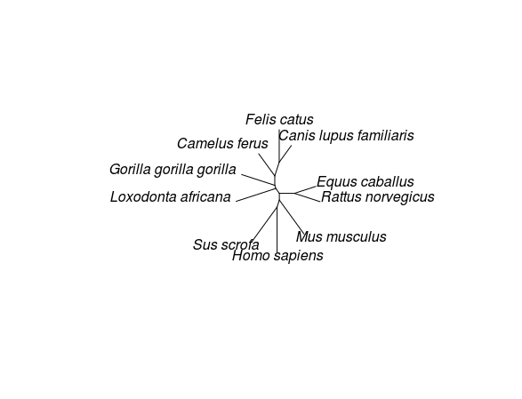


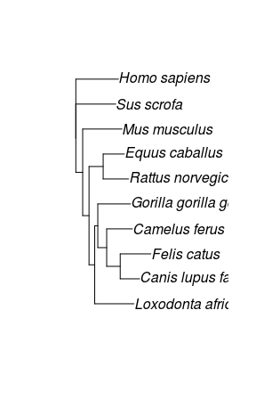


# 2D STRUCTURE PREDICTION OF snoRNA

The snoRNA sequences obtained from the search were introduced into the RNAFold server from RNAVienna to predict their 2D structures. 

## SNORD113 

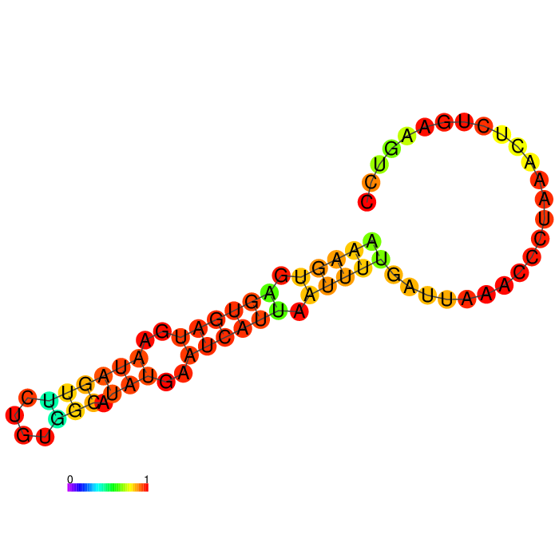 
```R
>SNORD113-1

AAAGUGAGUGAUGAAUAGUUCUGUGGCAUAUGAAUCAUUAAUUUUGAUUAAACCCUAAACUCUGAAGUCC
(((((.((((((..((((((....))).)))..)))))).))))).........................
 minimum free energy =  -7.10 kcal/mol
 ```
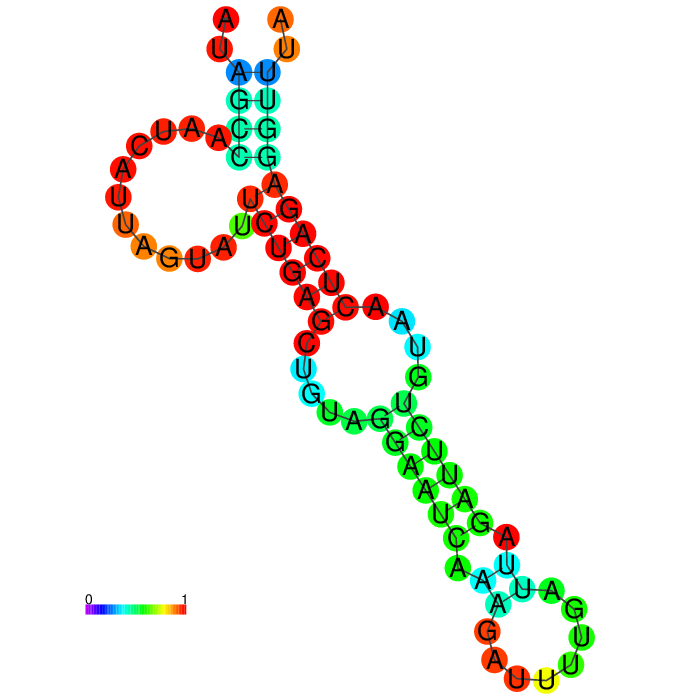 
```R
>SNORD113-2

AUAGCCAAUCAUUAGUAUUCUGAGCUGUAGGAAUCAAAGAUUUUGAUUAGAUUCUGUAACUCAGAGGUUUA
..((((............((((((.....((((((.((........)).))))))....))))))))))..
 minimum free energy = -13.50 kcal/mol
```
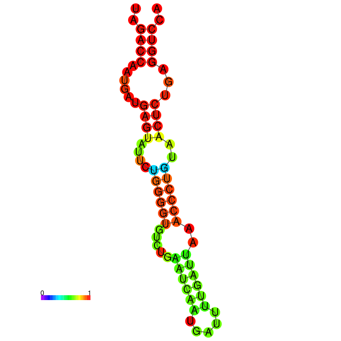 
```R
>SNORD113-3

length = 71

UAGACCAAUGAUGAGUAUUCUGGGGUGUCUGAAUCAAUGAUUUUGAUUAAACCCUGUAACUCUGAGGUCCA
..((((......((((....((((((.....((((((.....))))))..))))))..))))...))))..
```
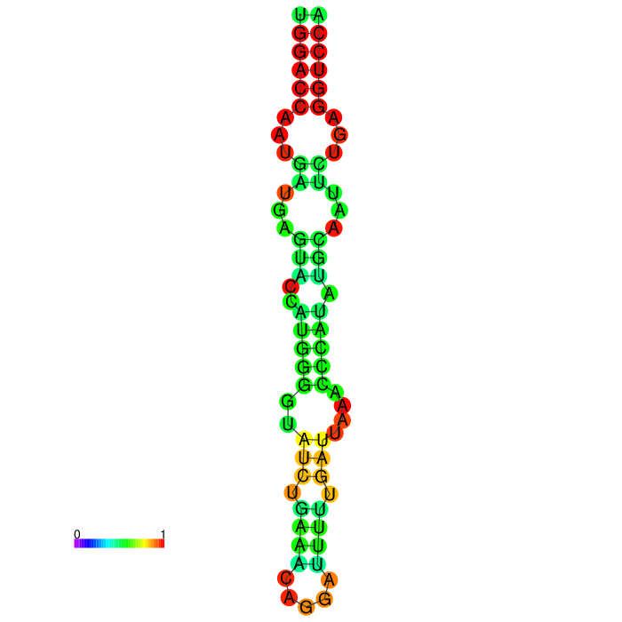
```R
>SNORD113-4
length = 74

UGGACCAAUGAUGAGUACCAUGGGGUAUCUGAAACAGGAUUUUUGAUUAAACCCAUAUGCAAUUCUGAGGUCCA
((((((...((...(((..(((((..(((.((((.....)))).)))....))))).)))...))...))))))
```
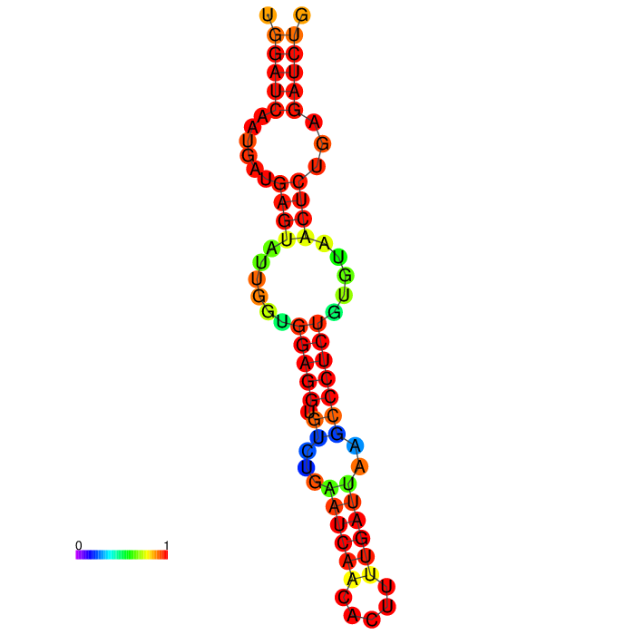
```R
>SNORD113-5

length = 77

UGGAUCAAUGAUGAGUAUUGGUGGAGGUGUCUGAAUCAACACUUUUGAUUAAGCCCUCUGUGUAACUCUGAGAUCUG
.(((((......((((......(((((.(.((.((((((.....)))))).)))))))).....))))...))))).
 minimum free energy = -17.90 kcal/mol
 ```
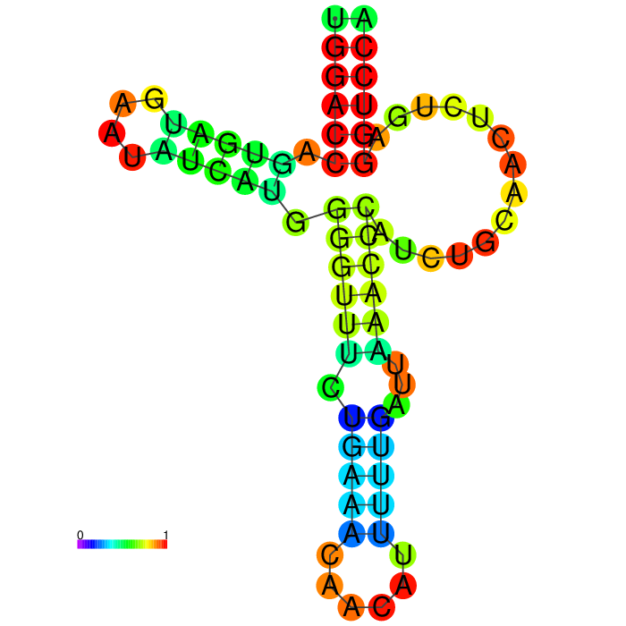
```R
>SNORD113-6

length = 74

UGGACCAGUGAUGAAUAUCAUGGGGUUUCUGAAACAACAUUUUUGAUUAAACCCAUCUGCAACUCUGAGGUCCA
((((((.(((((....))))).((((((.(((((......)))))...))))))..............))))))
 minimum free energy = -15.30 kcal/mol
 ```
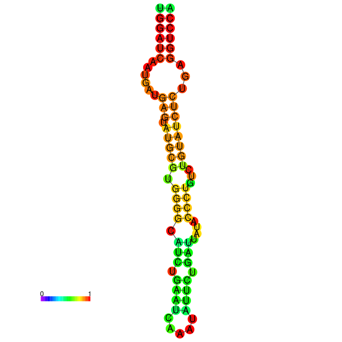 
```R
>SNORD113-7

length = 76

UGGAUCAAUGAUGAGUAUGCGUGGGGCAUCUGAAUCAAAUAUUCUGAUUAUACCCUGUCUGUAUCUCUGAGGUCCA
((((((......(((.(((((.((((.(((.((((.....)))).)))....))))...))))))))...))))))
 minimum free energy = -18.00 kcal/mol
 ```
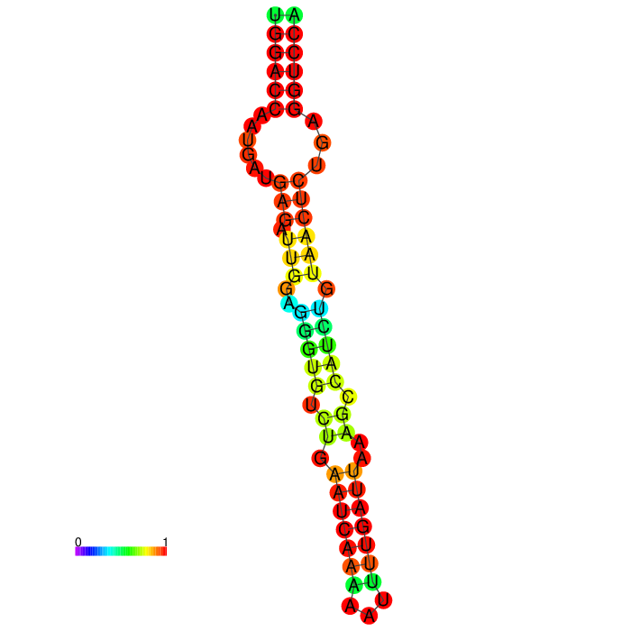
```R
>SNORD113-8

length = 73

UGGACCAAUGAUGAGAUUGGAGGGUGUCUGAAUCAAAAAUUUUGAUUAAAGCCAUCUGUAACUCUGAGGUCCA
((((((......(((.(((..(((((.((.(((((((...)))))))..)).))))).))))))...))))))
```
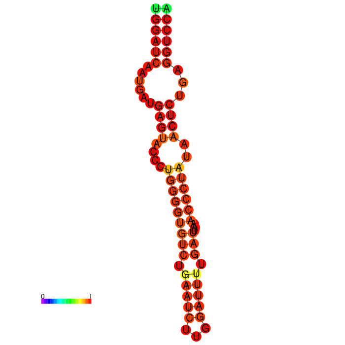
```R
length = 71

UGGAUCAAUGAUGAGUACCCUGGGGUGUCUGAAUCUUGGAUUUUGAUUAAACCCUAUAACUCUGAGGUCCA
((((((......((((....(((((((((.(((((...))))).)))...))))))..))))...))))))
 minimum free energy = -19.40 kcal/mol
```

## SNORD114

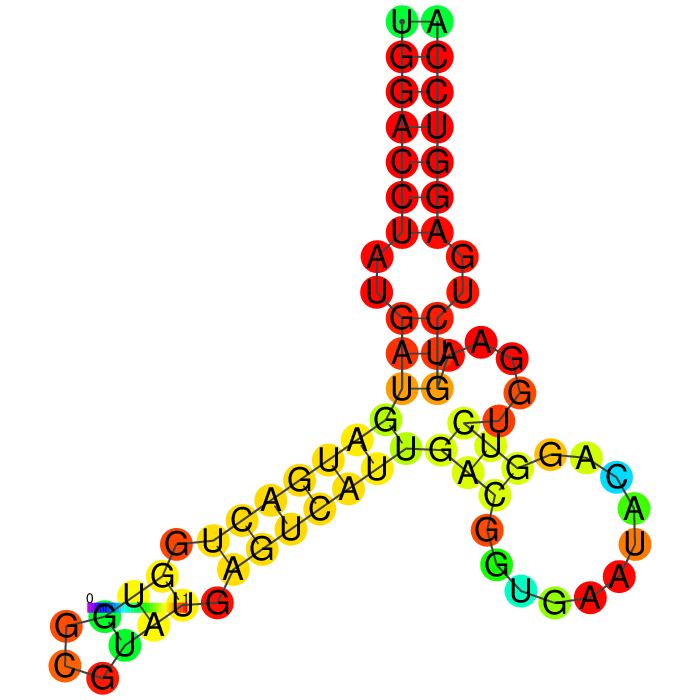 
```R
>SNORD114-1
length = 71

UGGACCUAUGAUGAUGACUGGUGGCGUAUGAGUCAUUGACGGUGAAUACAGGUCUGGAAGUCUGAGGUCCA
(((((((..((((((((((.(((...))).)))))))(((...........))).....)))..)))))))
 minimum free energy = -22.20 kcal/mol
 ```
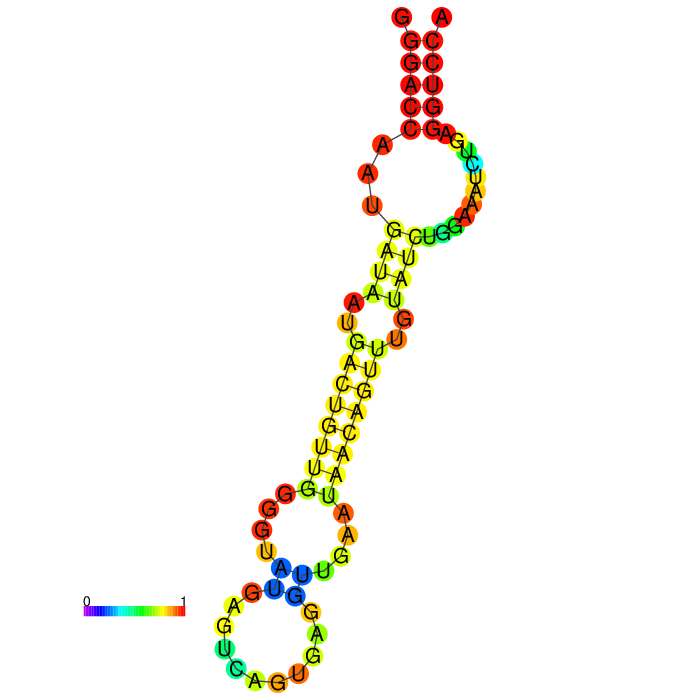
```R
>SNORD114-2

length = 77

GGGACCAAUGAUAAUGACUGUUGGGGUAUGAGUCAGUGAGGUUGAAUAACAGUUUGUAUCUGGAAAUCUGAGGUCCA
.(((((...((((..((((((((....((...........))....))))))))..))))...........))))).
 minimum free energy = -15.50 kcal/mol
 ```
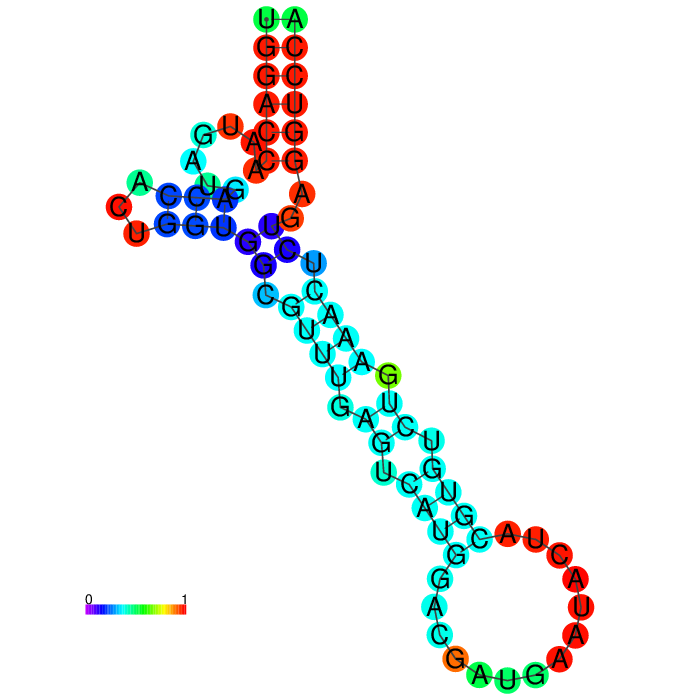
```R
>SNORD114-3

length = 74

UGGACCAAUGAUGACCACUGGUGGCGUUUGAGUCAUGGACGAUGAAUACUACGUGUCUGAAACUCUGAGGUCCA
((((((.......(((...)))((.((((.((.((((..............)))).)).)))).))..))))))
 minimum free energy = -18.80 kcal/mol
 ```
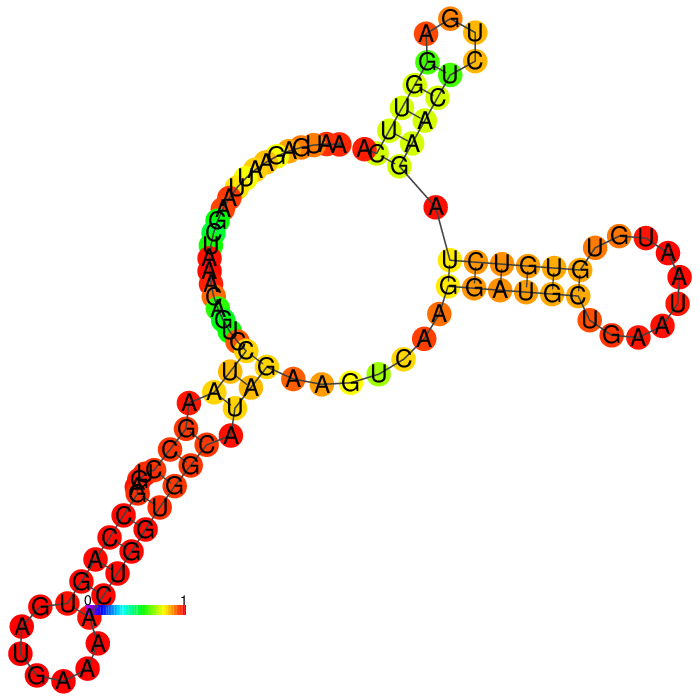
```R
>SNORD114-4

length = 104

UUCAAAUGAGAAUUAAGCUAAACAGUCCUAAGCCUGAGCCAGUGAUGAAAACUGGUGGCAUAGAAGUCAAGGAUGCUGAAUAAUGUGUGUCUAGAACUCUGAGG
((((...(((......(((....))).(((.(((...((((((.......))))))))).))).......((((((..........))))))....))))))).
 minimum free energy = -19.70 kcal/mol
 ```
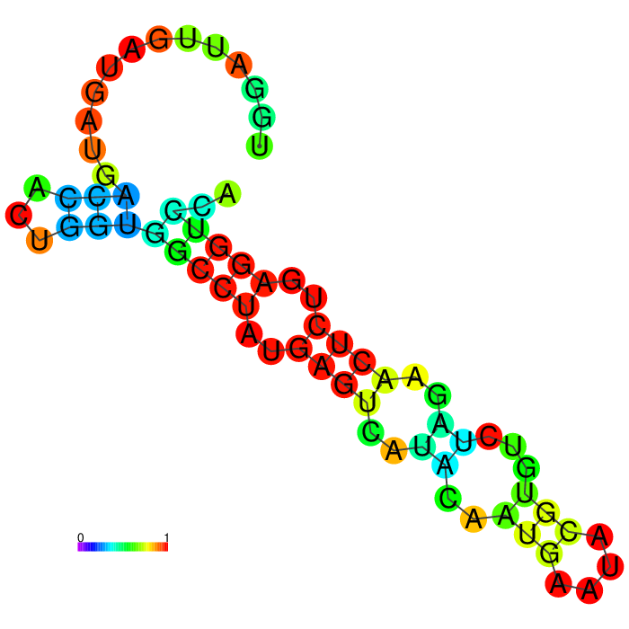 
```R
>SNORD114-5

length = 73

UUCAUGGAUUGAUGAUGACCACUGGUGGCCUAUGAGUCAUACAAUGAAUACGUGUCUAGAACUCUGAGGUCCA
.((((......))))..(((...)))(((((..((((..((..(((....)))...))..))))..)))))..
 minimum free energy = -15.10 kcal/mol
 ```
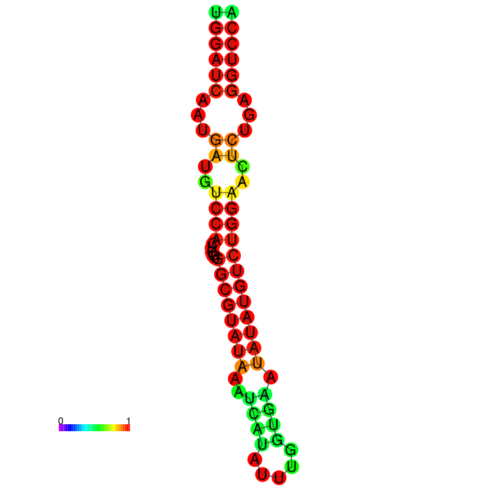
```R
>SNORD114-6

length = 71

UGGAUCAAUGAUGUCCACUGGUGGCGUAUAAAUCAUAUUUGGUGAAUAUAUGUCUGGAACUCUGAGGUCCA
((((((...((..((((.....((((((((..((((.....)))).))))))))))))..))...))))))
 minimum free energy = -19.50 kcal/mol
```
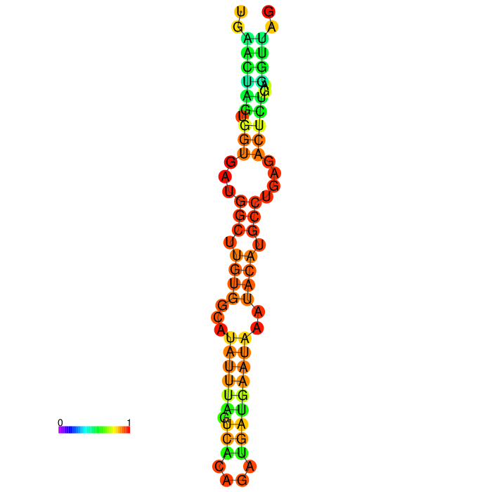 
```R
>SNORD114-7

length = 76

UGAACUAGUGGUGAUGGCUUGUGGCAUAUUUAGUCACAGAUGAUGAAUAAAUACAUGCCUGAGACUCUGAGGUUAG
..((((((.(((...(((.((((...((((((.(((....)))))))))..)))).)))....)))))..))))..
 minimum free energy = -14.50 kcal/mol
 ```
 ```R
 >SNORD114-8

>>>>
```
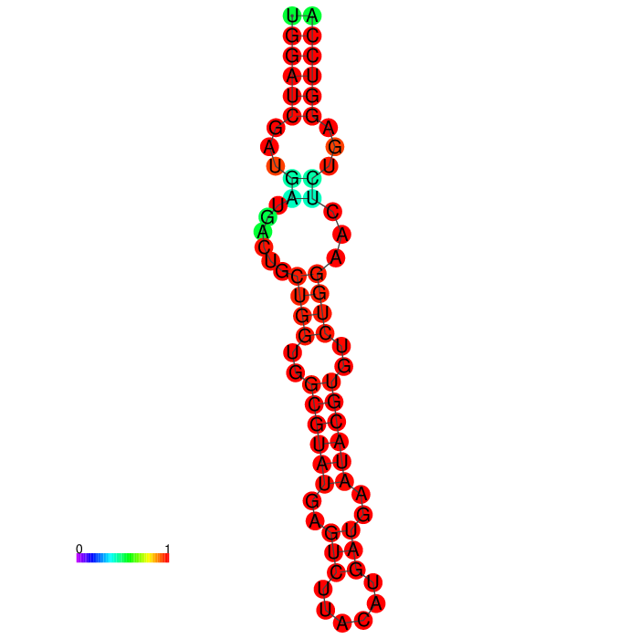
```>SNORD114-9

length = 71

UGGAUCGAUGAUGACUGCUGGUGGCGUAUGAGUCUUACAUGAUGAAUACGUGUCUGGAACUCUGAGGUCCA
((((((...((.(....((((..((((((..(((......)))..))))))..))))..)))...))))))
 minimum free energy = -20.50 kcal/mol
```
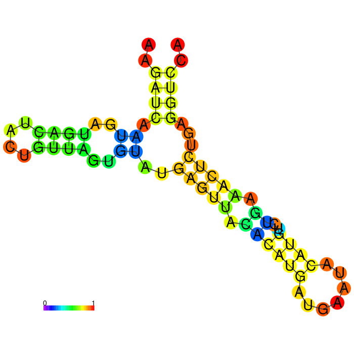
```R
>SNORD114-10

length = 71

AAGAUCAAUGAUGACUACUGUUAGUGUAUGAGUUACACAUGAUGAAUACAUGUCUGAAACUCUGAGGUCCA
..((((.((..((((....))))..))..(((((.((((((.......)))))..).)))))...))))..
 minimum free energy =  -9.50 kcal/mol
```
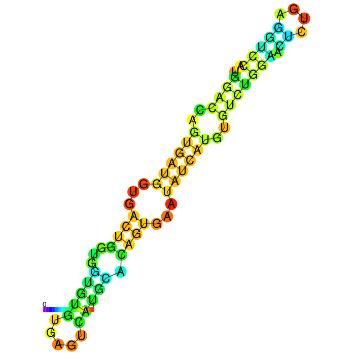
```R
>SNORD114-11

length = 74

UGGACCAGUGAUGGUGACUGGUGGUGUGUGAGUCAUGCACAGUGAAUAUCAUGUGUCUGGAACUCUGAGGUCCA
.((((..((((((.(.((((...(((((.....))))).)))).).))))))..))))(((.((....))))).
 minimum free energy = -20.50 kcal/mol
 ```
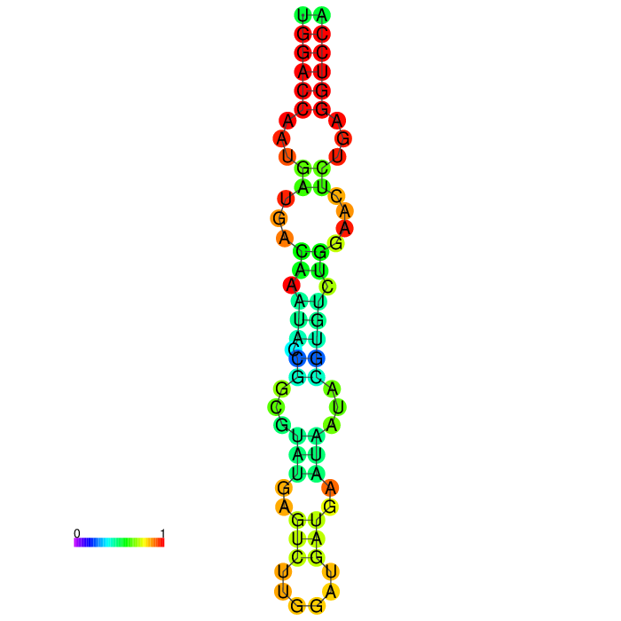
```R
>SNORD114-12

length = 74

UGGACCAAUGAUGACAAAUACCGGCGUAUGAGUCUUGGAUGAUGAAUAAUACGUGUCUGGAACUCUGAGGUCCA
((((((...(((..((.((((.(...(((..(((......)))..)))...))))).))..).))...))))))
 minimum free energy = -17.00 kcal/mol
 ```
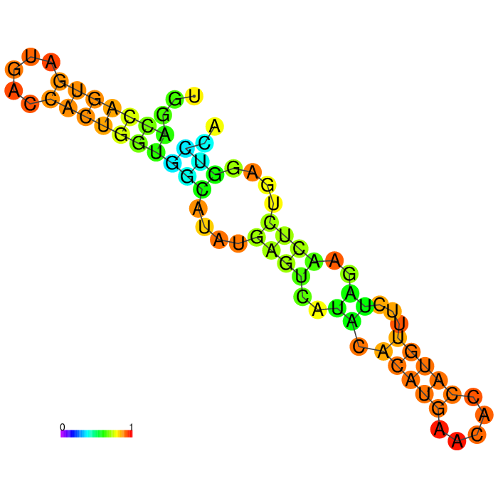
```R
>SNORD114-13

length = 73

UGGACCAGUGAUGACCACUGGUGGCAUAUGAGUCAUACACAUGAACACCAUGUUUCUAGAACUCUGAGGUCCA
...(((((((.....)))))))(((....((((..((.(((((.....)))))...))..))))....)))..
 minimum free energy = -20.90 kcal/mol
 ```
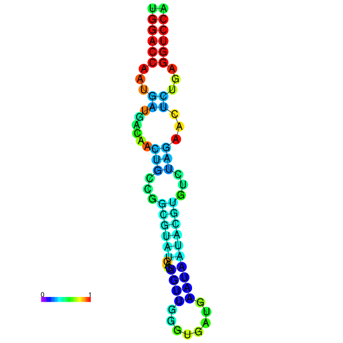 
```R
>SNORD114-14

length = 74

UGGACCAAUGAUGACAACUGCCGGCGUAUGAGUGUUGGGUGAUGAAUAAUACGUGUCUAGAACUCUGAGGUCCA
((((((...((.(....(((...((((((...((((.(....).))))))))))...)))..)))...))))))
 minimum free energy = -14.30 kcal/mol
 ```
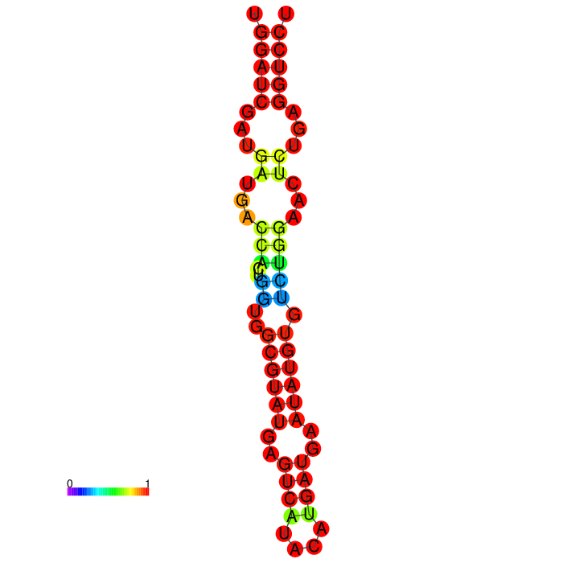
```R
>SNORD114-15

length = 71

UGGAUCGAUGAUGACCACUGGUGGCGUAUGAGUCAUACAUGAUGAAUAUGUGUCUGGAACUCUGAGGUCCU
.(((((...((...(((..((..((((((..((((....))))..)))))).)))))...))...))))).
 minimum free energy = -17.80 kcal/mol
```
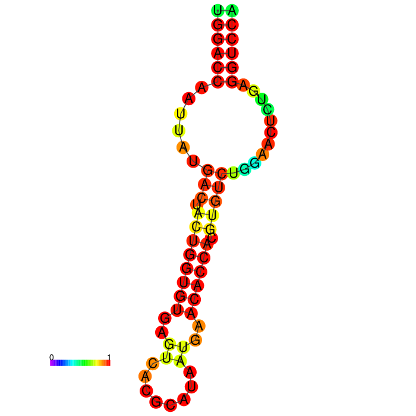
```R
>SNORD114-16

length = 69

UGGACCAAUUAUGACUACUGGUGUGAGUCACGCAUAAUGAACACCACGUGUCUGGAACUCUGAGGUCCA
((((((......(((.((((((((..((........))..)))))).)))))...........))))))
 minimum free energy = -18.30 kcal/mol
 ```
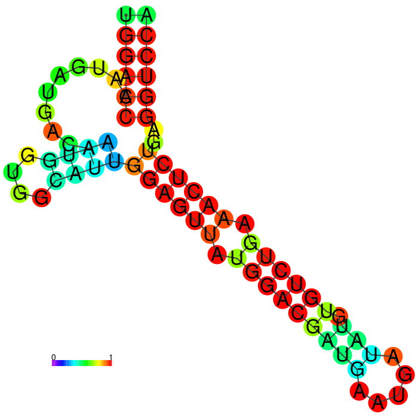
```R
>SNORD114-17

length = 74

UGGACCAAUGAUGACAAAUGGUGGCAUUGGAGUUAUGGACGAUGAAUGAUAUGUGUCUGAAACUCUGAGGUCCA
((((((((((.(.((.....)).)))))((((((.(((((((((.....))).)))))).))))))..))))))
 minimum free energy = -19.00 kcal/mol
 ```
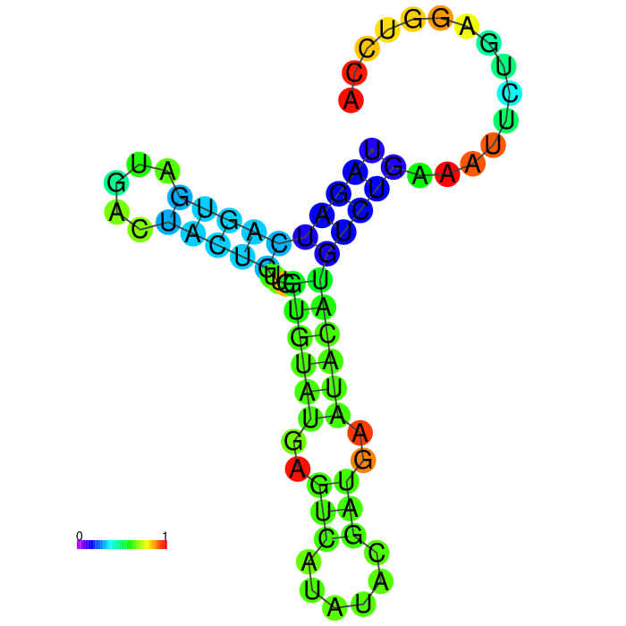
```R
>SNORD114-18

length = 71

UAGAUCAGUGAUGACUACUGUUGGUGUAUGAGUCAUAUACGAUGAAUACAUGUCUGAAAUUCUGAGGUCCA
((((((((((.....)))))...((((((..(((......)))..)))))))))))...............
 minimum free energy = -11.40 kcal/mol
 ```
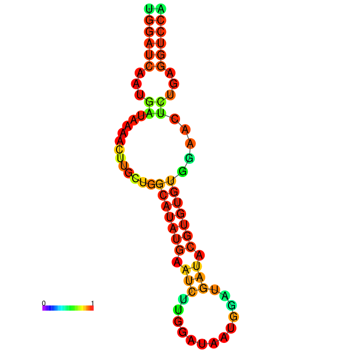
```R
>SNORD114-19

length = 74

UGGAUCAAUGAUAAAACUUGCUGGCAUAUGAAUCUUGGAUAAUGGAUGAUACGUGUGUGGAACUCUGAGGUCCA
((((((...((..........(.(((((((.(((.............))).))))))).)...))...))))))
 minimum free energy = -12.10 kcal/mol
 ```

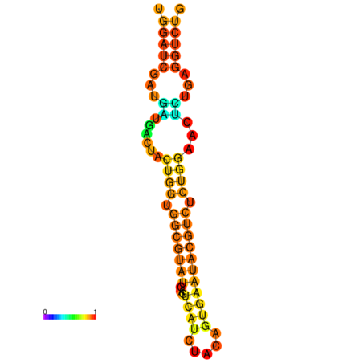
```R
>SNORD114-20

length = 71

UGGAUCGAUGAUGACUACUGGUGGCGUAUGAGUCAUCUACAGUGAAUACGUCUCUGGAACUCUGAGGUCUG
.(((((...((.(....((((.(((((((...((((.....))))))))))).))))..)))...))))).
 minimum free energy = -16.00 kcal/mol
 ```
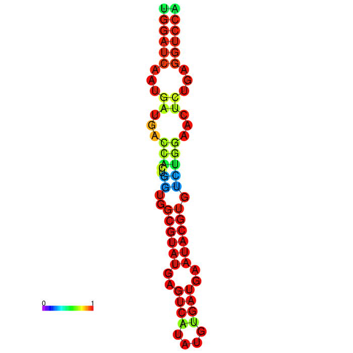
```R
>SNORD114-21

length = 71

UGGAUCAAUGAUGACCACUGGUGGCGUAUGAGUCAUAUGUGAUGAAUACGUGUCUGGAACUCUGAGGUCCA
((((((...((...(((..((..((((((..((((....))))..)))))).)))))...))...))))))
 minimum free energy = -19.00 kcal/mol
```
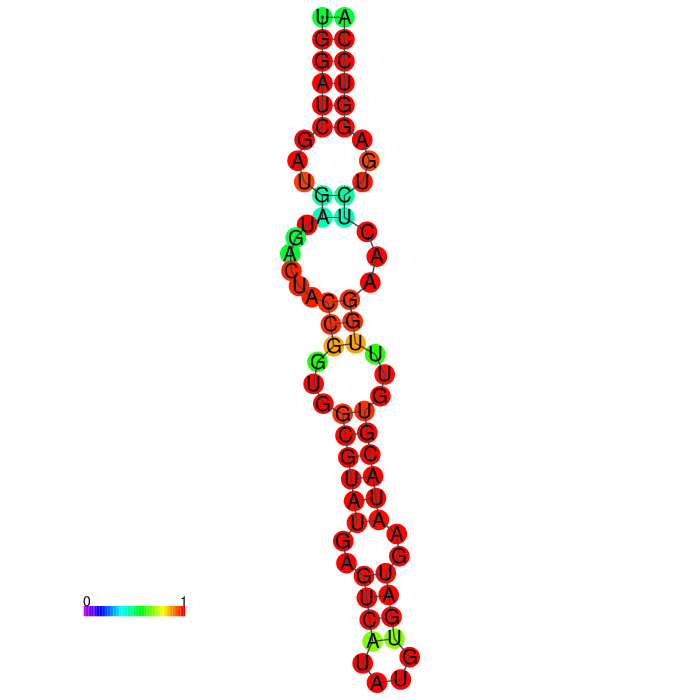
```R
>SNORD114-22

length = 71

UGGAUCGAUGAUGACUACCGGUGGCGUAUGAGUCAUAUGUGAUGAAUACGUGUUUGGAACUCUGAGGUCCA
((((((...((.(....(((...((((((..((((....))))..))))))...)))..)))...))))))
 minimum free energy = -19.10 kcal/mol
 ```
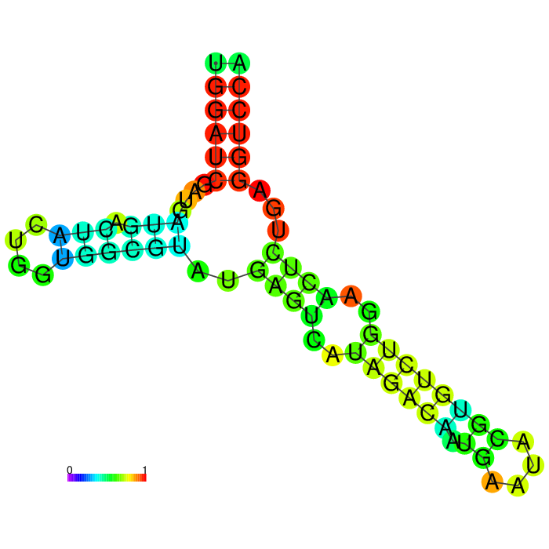
```R
>SNORD114-23

length = 71

UGGAUCGAUGAUGACUACUGGUGGCGUAUGAGUCAUAGACAAUGAAUACGUGUCUGGAACUCUGAGGUCCA
((((((.(((.(.(((...))).))))..((((..((((((.((....))))))))..))))...))))))
 minimum free energy = -16.60 kcal/mol
```
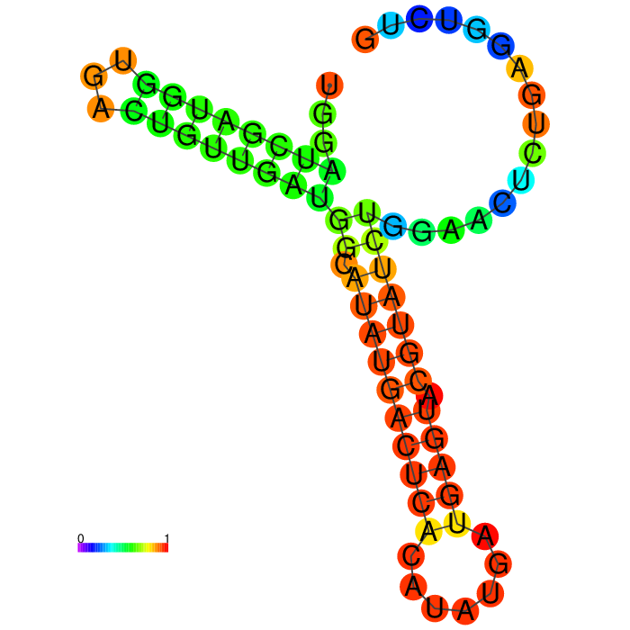
```R
>SNORD114-24

length = 71

UGGAUCGAUGGUGACUGUUGAUGGCAUAUGACUCACAUAUGAUGAGUACGUAUCUGGAACUCUGAGGUCUG
.(((((...(((..(.......((.(((((((((((....).))))).))))))))..)))....))))).
 minimum free energy = -13.00 kcal/mol
 ```
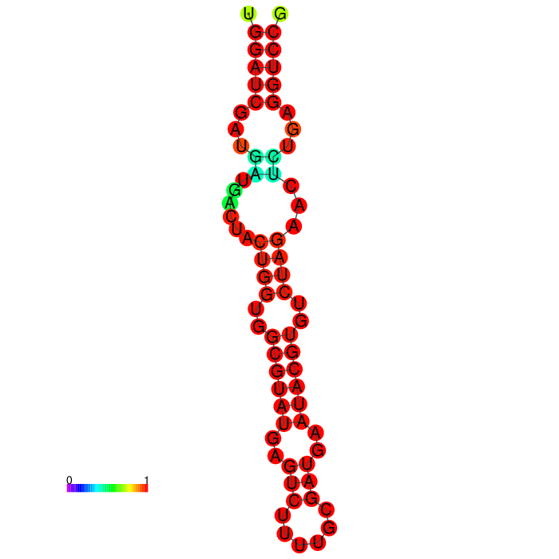
```R
>SNORD114-25

length = 71

UGGAUCGAUGAUGACUACUGGUGGCGUAUGAGUCUUUUGCGAUGAAUACGUGUCUAGAACUCUGAGGUCCG
.(((((...((.(....((((..((((((..(((......)))..))))))..))))..)))...))))).
 minimum free energy = -20.20 kcal/mol
```
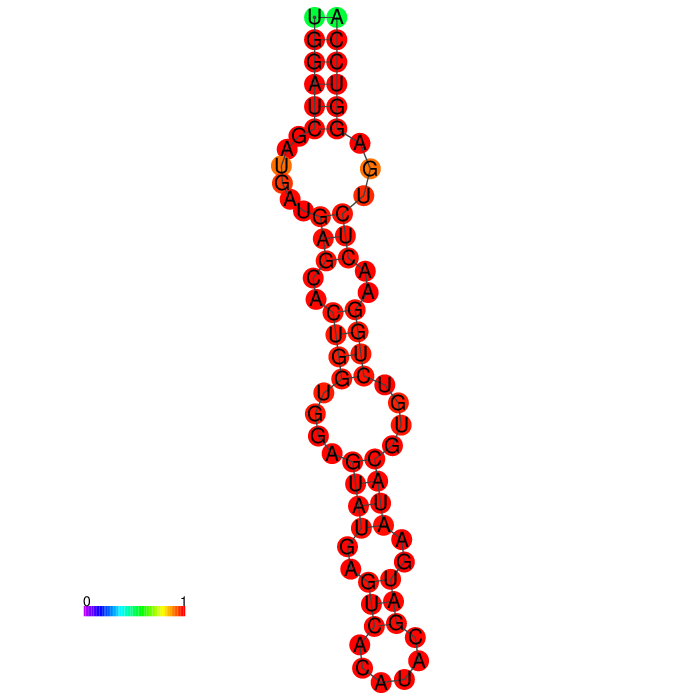
```R
>SNORD114-26

length = 71

UGGAUCGAUGAUGAGCACUGGUGGAGUAUGAGUCACAUACGAUGAAUACGUGUCUGGAACUCUGAGGUCCA
((((((......(((..((((....((((..(((......)))..))))....))))..)))...))))))
 minimum free energy = -18.20 kcal/mol
 ```
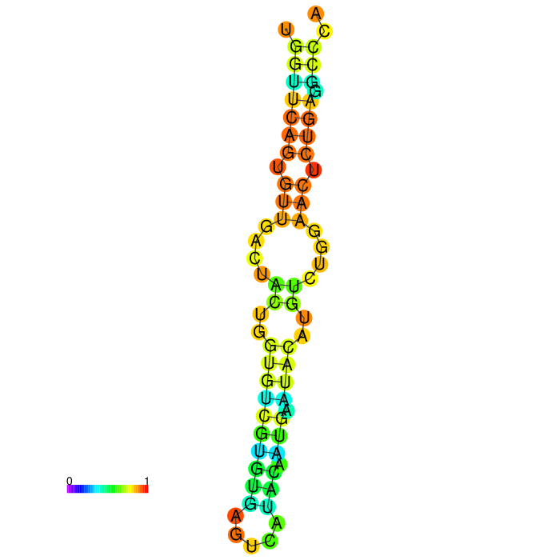
```R
>SNORD114-27

length = 69

UGGUUCAGUGUUGACUACUGGUGUCGUGUGAGUCAUACAAUGAAUACAUGUCUGGAACUCUGAGGCCCA
.(((((((.(((....((..((((((((((.....))).))).))))..))....))).)))).)))..
 minimum free energy = -14.80 kcal/mol
 ```
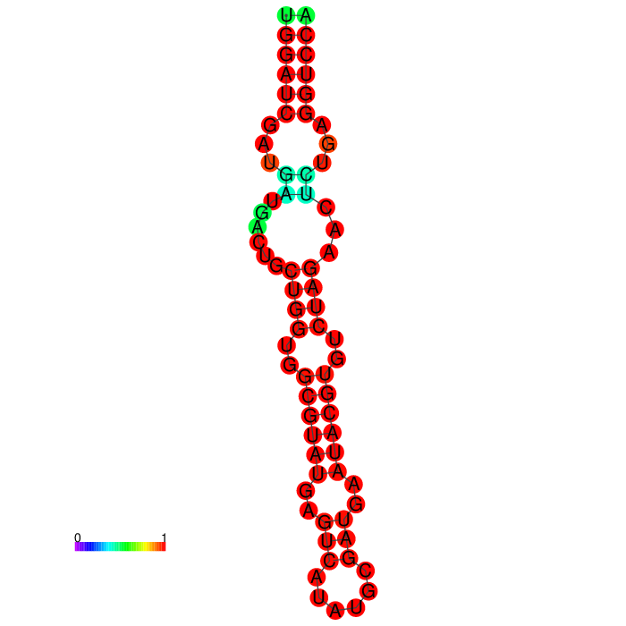
```R
>SNORD114-28

length = 71

UGGAUCGAUGAUGACUGCUGGUGGCGUAUGAGUCAUAUGCGAUGAAUACGUGUCUAGAACUCUGAGGUCCA
((((((...((.(....((((..((((((..(((......)))..))))))..))))..)))...))))))
 minimum free energy = -21.20 kcal/mol
 ```
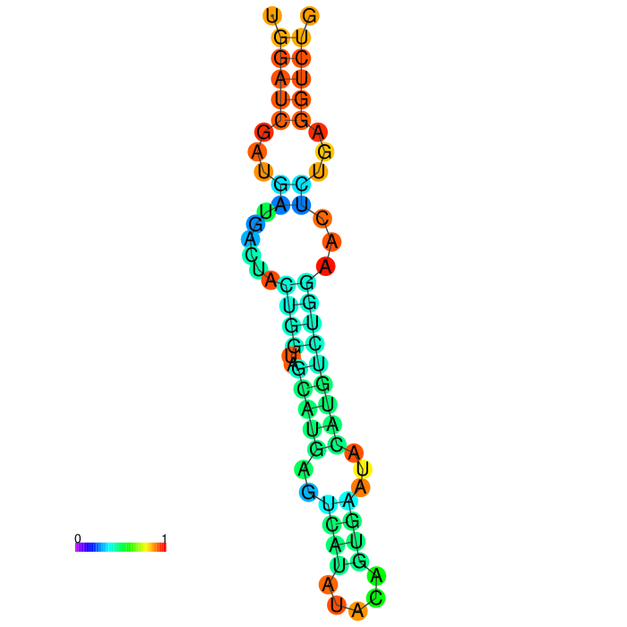
```R
>SNORD114-29

length = 69

UGGAUCGAUGAUGACUACUGGUAGCAUGAGUCAUAUACAGUGAAUACAUGUCUGGAACUCUGAGGUCUG
.(((((...((.(....((((..((((((.((((.....)))).).)))))))))..)))...))))).
 minimum free energy = -10.60 kcal/mol
 ```
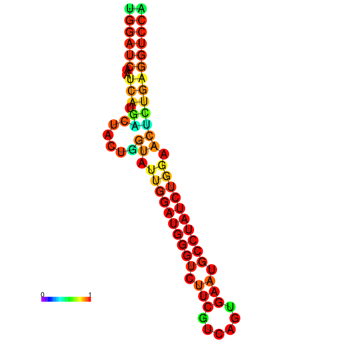 
```R
>SNORD114-30

length = 71

UGGAUCAAUCAUGACUACUGGUAUUGGAUGGGUCUUCGUCAGUGAAUGCCUAUCUGGAACUCUGAGGUCCA
((((((..(((.((......((.((((((((((.(((......))).)))))))))).)))))))))))))
 minimum free energy = -19.70 kcal/mol
 ```
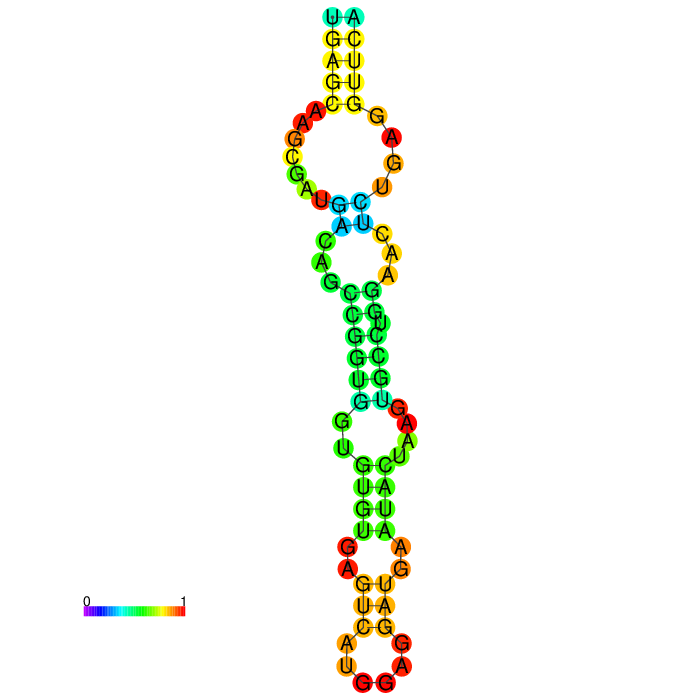
```R
>SNORD114-31

length = 74

UGAGCAAGCGAUGACAGCCGGUGGUGUGUGAGUCAUGGAGGAUGAAUACUAAGUGCCUGGAACUCUGAGGUUCA
(((((....(((..(((.((.(...((((..(((......)))..))))..).)).)))..).))....)))))
 minimum free energy = -14.10 kcal/mol
 ```

# References

Barlow, D.P., Stoger, R., Herrmann, B.G., Saito, K. and Schweifer, N. (1991) 'The mouse insulin-like growth factor type-2 receptor is imprinted and closely linked to the Tme locus', Nature, 349(6304), pp. 84-87. doi: 10.1038/349084a0 [doi].

Dawson, W.K. and Bujnicki, J.M. (2016) 'Computational modeling of RNA 3D structures and interactions', Current opinion in structural biology, 37, pp. 22-28. doi: 10.1016/j.sbi.2015.11.007 [doi].

Edwards, C.A., Mungall, A.J., Matthews, L., Ryder, E., Gray, D.J., Pask, A.J., Shaw, G., Graves, J.A., Rogers, J., SAVOIR consortium, Dunham, I., Renfree, M.B. and Ferguson-Smith, A.C. (2008) 'The evolution of the DLK1-DIO3 imprinted domain in mammals', PLoS biology, 6(6), pp. e135. doi: 10.1371/journal.pbio.0060135 [doi].

Enterina, J.R., Enfield, K.S.S., Anderson, C., Marshall, E.A., Ng, K.W. and Lam, W.L. (2017) 'DLK1-DIO3 imprinted locus deregulation in development, respiratory disease, and cancer', Expert review of respiratory medicine, 11(9), pp. 749-761. doi: 10.1080/17476348.2017.1355241 [doi].

Li, E., Beard, C. and Jaenisch, R. (1993) 'Role for DNA methylation in genomic imprinting', Nature, 366(6453), pp. 362-365. doi: 10.1038/366362a0 [doi].

Magnus, M., Boniecki, M.J., Dawson, W. and Bujnicki, J.M. (2016) 'SimRNAweb: a web server for RNA 3D structure modeling with optional restraints', Nucleic acids research, 44(W1), pp. 315. doi: 10.1093/nar/gkw279 [doi].

Samarsky, D.A., Fournier, M.J., Singer, R.H. and Bertrand, E. (1998) 'The snoRNA box C/D motif directs nucleolar targeting and also couples snoRNA synthesis and localization', The EMBO journal, 17(13), pp. 3747-3757. doi: 10.1093/emboj/17.13.3747 [doi].

Schmidt, J.V., Matteson, P.G., Jones, B.K., Guan, X.J. and Tilghman, S.M. (2000) 'The Dlk1 and Gtl2 genes are linked and reciprocally imprinted', Genes & development, 14(16), pp. 1997-2002.

Wang, J., Mao, K., Zhao, Y., Zeng, C., Xiang, J., Zhang, Y. and Xiao, Y. (2017) 'Optimization of RNA 3D structure prediction using evolutionary restraints of nucleotide-nucleotide interactions from direct coupling analysis', Nucleic acids research, 45(11), pp. 6299-6309. doi: 10.1093/nar/gkx386 [doi].
