# Brunel-Project

RNA structure in health and disease - investigation of snoRNA cluster in the imprinted Dlk1-Dio3 region

Russell Hamilton & Anne Ferguson-Smith
Department of Genetics, University of Cambridge, Downing Street, Cambridge, CB2 3EH

The epigenetic phenomenon of genomic imprinting leads to specific genes being expressed in a parent-specific manner. Imprinted genes have key roles in placenta and embryo development, as well as an emerging role in brain development and function. The Dlk1-Dio3 imprinted region contains two maternally expressed small nucleolar RNA (snoRNA) clusters, SNORD113 & SNORD114, containing 9 and 31 copies respectively (10.1016/j.tig.2008.03.011). Human patients with disruptions in this conserved region display growth retardation and facial dysmorphism (10.1038/ng.2007.56). However little is known about the mechanism of action of the snoRNAs in this region. Deletion of the related SNORD116 cluster (paternally expressed) in the SNRPN imprinted region has been shown to be a direct cause of Prader-Willi syndrome and postnatal growth retardation (10.1038/ng.158; 10.1371/journal.pgen.0030235). 

Using open source computational tools we will model the snoRNA 2D and 3D structures of the Dlk1-Dio3 region (10.7490/f1000research.1117078.1). Transcribed as a precursor long non-coding RNA, Rian/MEG8, the C/D box motif containing snoRNAs have been shown to be directed by genomic imprinting and, unusually for snoRNAs, to have brain specific expression. snoRNA have previously been shown to contain Ca2+ sensitive kink-turn (KT) motifs. In low Ca2+, the KTs are in an extended confirmation, but with increased Ca2+ develop a pronounced 60o kink, opening up the nucleotide bases for sequence specific recognition. KT motifs can therefore act as a Ca2+ sensitive switch for mediating protein or tertiary RNA interactions. The brain specific expression of these C/D snoRNAs and demonstration of the existence of calcium sensitive KT motifs would provide valuable insight into these enigmatic snoRNAs and their role in the nervous system. 

## Infernal search

In order to locate the snoRNAs in the regions of interest, Infernal ("INFERence of RNA ALignment") was employed. This program allows the user to access DNA sequence databases to study and analyse RNA structure and sequence similarities.  Infernal requires an MSA file in Stockholm format to conduct the search. Rfam was used to obatin the sto file for Small nucleolar RNA SNORD113/SNORD114 family (RF00181).
File obtained: RF00181.stockholm.txt
#The name of the sto file was changed to SNO.sto to simplify the process:

```phython
mv RF00181.stockholm.txt SNO.sto
```
From the sto file a CM is build.

```phython
cmbuild SNO.cm SNO.sto
INFERNAL1/a [1.1.1 | July 2014]
NAME     SNORD113
ACC      RF00181
DESC     Small nucleolar RNA SNORD113/SNORD114 family
STATES   229
NODES    72
CLEN     75
W        178
ALPH     RNA
RF       no
CONS     yes
MAP      yes
DATE     Tue Jul 14 16:46:28 2020
COM      [1] /usr/lib/infernal/cmbuild SNO.cm SNO.sto
COM      [2] /usr/lib/infernal/cmcalibrate SNO.cm
PBEGIN   0.05
PEND     0.05
WBETA    1e-07
QDBBETA1 1e-07
QDBBETA2 1e-15
N2OMEGA  1.52588e-05
N3OMEGA  1.52588e-05
ELSELF   -0.08926734
NSEQ     59
EFFN     9.315979
CKSUM    823253948
NULL     0.000  0.000  0.000  0.000 
GA       36.00
TC       36.00
NC       35.90
EFP7GF   -12.3635 0.71868
ECMLC    0.64608    -5.70987     3.21223     1600000      382510  0.003137
ECMGC    0.36761   -18.65720    -3.78769     1600000       94621  0.004227
ECMLI    0.60854    -4.00500     4.77592     1600000      251093  0.004779
ECMGI    0.39968   -13.69947    -0.69710     1600000       72278  0.005534
CM
                                             [ ROOT    0 ]      -      - - - - -
     S     0    -1 0     1     4     1     1   178   306  -8.579  -8.786  -0.051  -5.081                 
    IL     1     1 2     1     4     1    34   180   308  -1.686  -2.369  -1.117  -4.855                  0.000  0.000  0.000  0.000 
    IR     2     2 3     2     3     1    33   180   308  -1.442  -0.798  -4.142                          0.000  0.000  0.000  0.000 
                                             [ MATL    1 ]      1      - U - - -
    ML     3     2 3     5     3     1    34   178   307  -9.819  -0.007  -8.137                         -1.002 -1.728 -2.167  1.573 
     D     4     2 3     5     3     0    27   176   305  -6.072  -0.497  -1.855                         
    IL     5     5 3     5     3     1    31   178   307  -1.925  -0.554  -4.164                          0.000  0.000  0.000  0.000 
                                             [ MATR    2 ]      -    109 - a - -
    MR     6     5 3     8     3     1    33   177   306  -9.851  -0.007  -8.168                          0.419 -0.214 -1.036  0.393 
     D     7     5 3     8     3     0    24   175   303  -6.390  -1.568  -0.620                         
    IR     8     8 3     8     3     1    30   177   306  -1.925  -0.554  -4.164                          0.000  0.000  0.000  0.000 
                                             [ MATR    3 ]      -    108 - A - -
    MR     9     8 3    11     5     1    33   176   305  -8.526  -0.014  -8.342  -8.554  -9.446          1.572 -2.980 -0.541 -2.236 
     D    10     8 3    11     5     0    23   174   302  -5.352  -0.707  -2.978  -4.409  -2.404         
    IR    11    11 3    11     5     1    28   176   304  -2.408  -0.496  -5.920  -4.087  -5.193          0.000  0.000  0.000  0.000 
                                             [ MATP    4 ]      2    107 G C - -
    MP    12    11 3    16     6     2    32   175   304  -9.956  -9.895  -0.012  -8.672  -8.951  -9.346 -1.714 -1.037 -3.478  0.720 -3.971 -4.183  0.056 -3.999 -0.058  3.037 -4.137  0.328 -0.155 -1.862 -1.705 -1.789 
    ML    13    11 3    16     6     1    25   173   301  -6.250  -6.596  -1.310  -1.005  -6.446  -3.975  0.368 -0.385 -0.191  0.094 
    MR    14    11 3    16     6     1    25   172   301  -6.988  -5.717  -1.625  -5.695  -0.829  -3.908  0.368 -0.385 -0.191  0.094 
     D    15    11 3    16     6     0    20   168   296  -9.049  -7.747  -3.544  -4.226  -4.244  -0.319 
    IL    16    16 5    16     6     1    27   174   303  -2.579  -2.842  -0.760  -4.497  -5.274  -4.934  0.000  0.000  0.000  0.000 
    IR    17    17 6    17     5     1    27   174   302  -2.408  -0.496  -5.920  -4.087  -5.193          0.000  0.000  0.000  0.000 
                                             [ MATP    5 ]      3    106 G C - -
    MP    18    17 6    22     6     2    31   173   302  -9.956  -9.895  -0.023  -6.614  -8.951  -9.346 -4.275 -2.958 -4.119  0.986 -1.301 -4.700 -0.294 -4.772 -4.504  3.366 -4.771 -0.158 -0.563 -2.348 -2.290 -3.091 
    ML    19    17 6    22     6     1    25   171   299  -6.250  -6.596  -1.310  -1.005  -6.446  -3.975  0.368 -0.385 -0.191  0.094 
    MR    20    17 6    22     6     1    24   170   299  -6.988  -5.717  -1.625  -5.695  -0.829  -3.908  0.368 -0.385 -0.191  0.094 
     D    21    17 6    22     6     0    19   166   295  -9.049  -7.747  -3.544  -4.226  -4.244  -0.319 
    IL    22    22 5    22     6     1    26   172   301  -2.579  -2.842  -0.760  -4.497  -5.274  -4.934  0.000  0.000  0.000  0.000 
    IR    23    23 6    23     5     1    27   172   301  -2.408  -0.496  -5.920  -4.087  -5.193          0.000  0.000  0.000  0.000 
                                             [ MATP    6 ]      4    105 A U - -
    MP    24    23 6    28     6     2    30   171   300  -9.945  -9.884  -0.012  -8.660  -8.940  -9.335 -2.556 -4.570 -5.175  3.771 -6.464 -7.100 -2.463 -5.271 -5.508 -0.767 -6.081 -0.201 -2.612 -3.055 -4.222 -4.278 
    ML    25    23 6    28     6     1    24   169   298  -6.496  -6.842  -1.010  -1.251  -6.692  -4.221  0.770 -0.664 -0.381 -0.158 
    MR    26    23 6    28     6     1    23   169   297  -6.988  -5.717  -1.625  -5.695  -0.829  -3.908  0.368 -0.385 -0.191  0.094 
     D    27    23 6    28     6     0    19   165   294  -9.049  -7.747  -3.544  -4.226  -4.244  -0.319 
    IL    28    28 5    28     6     1    26   170   299  -2.579  -2.842  -0.760  -4.497  -5.274  -4.934  0.000  0.000  0.000  0.000 
    IR    29    29 6    29     5     1    26   170   299  -2.408  -0.496  -5.920  -4.087  -5.193          0.000  0.000  0.000  0.000 
                                             [ MATP    7 ]      5    104 c g - -
    MP    30    29 6    34     6     2    28   169   298  -9.956  -9.895  -0.012  -8.672  -8.951  -9.346 -2.790 -1.833 -1.545  0.383 -2.650 -3.798  2.304 -3.102 -2.977  0.744 -3.536 -1.249  1.208 -3.099  1.837 -1.579 
    ML    31    29 6    34     6     1    23   167   296  -6.250  -6.596  -1.310  -1.005  -6.446  -3.975  0.368 -0.385 -0.191  0.094 
    MR    32    29 6    34     6     1    21   167   295  -6.988  -5.717  -1.625  -5.695  -0.829  -3.908  0.368 -0.385 -0.191  0.094 
     D    33    29 6    34     6     0    18   164   293  -9.049  -7.747  -3.544  -4.226  -4.244  -0.319 
    IL    34    34 5    34     6     1    25   168   297  -2.579  -2.842  -0.760  -4.497  -5.274  -4.934  0.000  0.000  0.000  0.000 
    IR    35    35 6    35     5     1    24   168   297  -2.408  -0.496  -5.920  -4.087  -5.193          0.000  0.000  0.000  0.000 
                                             [ MATP    8 ]      6    103 c g - -
    MP    36    35 6    40     4     2    26   167   296  -8.579  -8.786  -0.017  -7.200                 -2.608 -2.760 -1.948  0.391 -1.368 -3.619  2.728 -0.788 -2.819  0.341 -2.191 -1.227  1.029 -2.927  0.968 -1.943 
    ML    37    35 6    40     4     1    22   166   295  -3.758  -3.940  -0.507  -2.670                  0.368 -0.385 -0.191  0.094 
    MR    38    35 6    40     4     1    19   165   293  -4.809  -3.838  -1.706  -0.766                  0.368 -0.385 -0.191  0.094 
     D    39    35 6    40     4     0    18   163   292  -4.568  -4.250  -2.265  -0.520                 
    IL    40    40 5    40     4     1    24   167   295  -1.686  -2.369  -1.117  -4.855                  0.000  0.000  0.000  0.000 
    IR    41    41 6    41     3     1    23   167   295  -1.442  -0.798  -4.142                          0.000  0.000  0.000  0.000 
                                             [ MATL    9 ]      7      - A - - -
    ML    42    41 6    44     3     1    24   165   294  -4.064  -0.094  -8.178                          1.290 -2.381 -0.114 -1.188 
     D    43    41 6    44     3     0    17   162   291  -6.174  -1.687  -0.566                         
    IL    44    44 3    44     3     1    23   165   294  -1.927  -0.522  -4.627                          0.000  0.000  0.000  0.000 
                                             [ MATL   10 ]      9      - a - - -
    ML    45    44 3    47     3     1    24   164   293  -9.524  -0.007  -8.178                          0.743 -1.116 -0.449  0.180 
     D    46    44 3    47     3     0    16   161   290  -6.174  -1.687  -0.566                         
    IL    47    47 3    47     3     1    22   164   293  -1.442  -0.798  -4.142                          0.000  0.000  0.000  0.000 
                                             [ MATL   11 ]     10      - U - - -
    ML    48    47 3    50     3     1    23   163   292  -9.524  -0.007  -8.178                         -3.225 -2.114 -3.965  1.847 
     D    49    47 3    50     3     0    16   160   289  -6.174  -1.687  -0.566                         
    IL    50    50 3    50     3     1    21   163   292  -1.442  -0.798  -4.142                          0.000  0.000  0.000  0.000 
                                             [ MATL   12 ]     11      - G - - -
    ML    51    50 3    53     3     1    22   162   291  -9.524  -0.007  -8.178                         -2.580 -2.386  1.809 -2.857 
     D    52    50 3    53     3     0    15   159   288  -6.174  -1.687  -0.566                         
    IL    53    53 3    53     3     1    20   162   291  -1.442  -0.798  -4.142                          0.000  0.000  0.000  0.000 
                                             [ MATL   13 ]     12      - A - - -
    ML    54    53 3    56     3     1    21   161   290  -9.524  -0.007  -8.178                          1.754 -2.967 -2.070 -1.937 
     D    55    53 3    56     3     0    14   158   287  -6.174  -1.687  -0.566                         
    IL    56    56 3    56     3     1    19   161   290  -1.442  -0.798  -4.142                          0.000  0.000  0.000  0.000 
                                             [ MATL   14 ]     13      - U - - -
    ML    57    56 3    59     3     1    20   160   289  -9.524  -0.007  -8.178                         -4.201 -3.826 -5.002  1.943 
     D    58    56 3    59     3     0    13   157   286  -6.174  -1.687  -0.566                         
    IL    59    59 3    59     3     1    18   160   289  -1.442  -0.798  -4.142                          0.000  0.000  0.000  0.000 
                                             [ MATL   15 ]     14      - G - - -
    ML    60    59 3    62     3     1    19   159   288  -9.524  -0.007  -8.178                         -1.952 -4.505  1.861 -3.943 
     D    61    59 3    62     3     0    13   156   284  -6.174  -1.687  -0.566                         
    IL    62    62 3    62     3     1    18   159   288  -1.442  -0.798  -4.142                          0.000  0.000  0.000  0.000 
                                             [ MATL   16 ]     15      - A - - -
    ML    63    62 3    65     3     1    19   158   287  -9.524  -0.007  -8.178                          1.735 -1.907 -2.252 -2.362 
     D    64    62 3    65     3     0    12   155   283  -6.174  -1.687  -0.566                         
    IL    65    65 3    65     3     1    17   158   287  -1.442  -0.798  -4.142                          0.000  0.000  0.000  0.000 
                                             [ MATL   17 ]     16      - C - - -
    ML    66    65 3    68     3     1    18   157   286  -9.524  -0.023  -6.092                         -0.907  1.046 -0.566 -0.460 
     D    67    65 3    68     3     0    12   153   281  -6.174  -1.687  -0.566                         
    IL    68    68 3    68     3     1    16   157   286  -1.442  -0.798  -4.142                          0.000  0.000  0.000  0.000 
                                             [ MATL   18 ]     17      - c - - -
    ML    69    68 3    71     3     1    18   156   285  -9.508  -0.007  -8.162                          0.268  0.361 -1.062  0.046 
     D    70    68 3    71     3     0    11   151   279  -6.559  -1.084  -0.950                         
    IL    71    71 3    71     3     1    15   156   285  -1.442  -0.798  -4.142                          0.000  0.000  0.000  0.000 
                                             [ MATL   19 ]     18      - A - - -
    ML    72    71 3    74     3     1    17   155   284  -2.464  -0.294  -8.178                          1.287 -1.250 -1.261 -0.470 
     D    73    71 3    74     3     0    10   137   265  -6.174  -1.687  -0.566                         
    IL    74    74 3    74     3     1    18   166   295  -0.207  -2.950  -7.945                          0.000  0.000  0.000  0.000 
                                             [ MATL   20 ]     34      - C - - -
    ML    75    74 3    77     3     1    16   124   218  -9.524  -0.007  -8.178                         -0.802  1.032 -0.679 -0.402 
     D    76    74 3    77     3     0     9   122   215  -6.174  -1.687  -0.566                         
    IL    77    77 3    77     3     1    14   125   218  -1.442  -0.798  -4.142                          0.000  0.000  0.000  0.000 
                                             [ MATL   21 ]     35      - U - - -
    ML    78    77 3    80     3     1    15   123   217  -9.524  -0.007  -8.178                         -2.317 -0.762 -2.455  1.598 
     D    79    77 3    80     3     0     8   120   214  -6.174  -1.687  -0.566                         
    IL    80    80 3    80     3     1    13   124   217  -1.442  -0.798  -4.142                          0.000  0.000  0.000  0.000 
                                             [ MATL   22 ]     36      - G - - -
    ML    81    80 3    83     3     1    14   122   216  -9.524  -0.020  -6.339                         -1.170 -1.994  1.534 -1.290 
     D    82    80 3    83     3     0     8   119   213  -6.174  -1.687  -0.566                         
    IL    83    83 3    83     3     1    12   123   216  -1.442  -0.798  -4.142                          0.000  0.000  0.000  0.000 
                                             [ MATL   23 ]     37      - G - - -
    ML    84    83 3    86     3     1    14   121   215  -9.511  -0.007  -8.165                         -1.383 -2.073  1.522 -0.978 
     D    85    83 3    86     3     0     7   118   212  -6.487  -2.000  -0.437                         
    IL    86    86 3    86     3     1    12   122   215  -1.442  -0.798  -4.142                          0.000  0.000  0.000  0.000 
                                             [ MATL   24 ]     38      - U - - -
    ML    87    86 3    89     3     1    14   120   214  -9.511  -0.007  -8.165                         -1.669 -1.856 -0.593  1.458 
     D    88    86 3    89     3     0     6   117   211  -6.487  -2.000  -0.437                         
    IL    89    89 3    89     3     1    11   121   214  -1.442  -0.798  -4.142                          0.000  0.000  0.000  0.000 
                                             [ MATL   25 ]     39      - G - - -
    ML    90    89 3    92     3     1    13   119   213  -9.511  -0.007  -8.165                         -0.138 -3.463  1.524 -3.005 
     D    91    89 3    92     3     0     6   116   210  -6.487  -2.000  -0.437                         
    IL    92    92 3    92     3     1    11   120   213  -1.442  -0.798  -4.142                          0.000  0.000  0.000  0.000 
                                             [ MATL   26 ]     40      - G - - -
    ML    93    92 3    95     3     1    12   118   212  -2.066  -0.400  -8.165                         -2.440 -2.670  1.793 -2.365 
     D    94    92 3    95     3     0     5   115   209  -6.487  -2.000  -0.437                         
    IL    95    95 3    95     3     1    11   118   212  -1.650  -0.590  -5.861                          0.000  0.000  0.000  0.000 
                                             [ MATL   27 ]     44      - C - - -
    ML    96    95 3    98     3     1    11   117   210  -9.511  -0.016  -6.703                         -1.966  1.435 -2.418 -0.229 
     D    97    95 3    98     3     0     5   115   208  -6.487  -1.168  -0.879                         
    IL    98    98 3    98     3     1     9   117   211  -1.442  -0.798  -4.142                          0.000  0.000  0.000  0.000 
                                             [ MATL   28 ]     45      - g - - -
    ML    99    98 3   101     3     1    11   116   209  -9.515  -0.007  -8.169                          0.259 -0.771  0.408 -0.167 
     D   100    98 3   101     3     0     3   113   207  -6.395  -1.908  -0.471                         
    IL   101   101 3   101     3     1     8   116   210  -1.442  -0.798  -4.142                          0.000  0.000  0.000  0.000 
                                             [ MATL   29 ]     46      - U - - -
    ML   102   101 3   104     3     1    10   115   208  -9.515  -0.007  -8.169                         -2.551 -1.672 -2.492  1.739 
     D   103   101 3   104     3     0     3   113   206  -6.395  -1.292  -0.786                         
    IL   104   104 3   104     3     1     8   115   209  -1.442  -0.798  -4.142                          0.000  0.000  0.000  0.000 
                                             [ MATL   30 ]     47      - a - - -
    ML   105   104 3   107     3     1     9   114   207  -9.524  -0.007  -8.178                          0.765  0.125 -0.898 -0.571 
     D   106   104 3   107     3     0     2   111   205  -6.174  -1.687  -0.566                         
    IL   107   107 3   107     3     1     7   114   208  -1.442  -0.798  -4.142                          0.000  0.000  0.000  0.000 
                                             [ MATL   31 ]     48      - U - - -
    ML   108   107 3   110     3     1     8   113   206  -9.524  -0.007  -8.178                         -2.579 -1.960 -2.306  1.754 
     D   109   107 3   110     3     0     1   110   204  -6.174  -1.687  -0.566                         
    IL   110   110 3   110     3     1     6   113   207  -1.442  -0.798  -4.142                          0.000  0.000  0.000  0.000 
                                             [ MATL   32 ]     49      - G - - -
    ML   111   110 3   113     3     1     8   112   205  -3.128  -0.181  -8.178                         -1.996 -3.796  1.813 -2.615 
     D   112   110 3   113     3     0     1   109   203  -6.174  -1.687  -0.566                         
    IL   113   113 3   113     3     1     6   112   205  -2.269  -0.395  -4.969                          0.000  0.000  0.000  0.000 
                                             [ MATL   33 ]     51      - A - - -
    ML   114   113 3   116     3     1     7   111   204  -9.524  -0.007  -8.178                          1.734 -3.618 -1.010 -3.400 
     D   115   113 3   116     3     0     0   108   202  -6.174  -1.687  -0.566                         
    IL   116   116 3   116     3     1     5   111   205  -1.442  -0.798  -4.142                          0.000  0.000  0.000  0.000 
                                             [ MATL   34 ]     52      - G - - -
    ML   117   116 3   119     3     1     6   110   203  -9.524  -0.007  -8.178                         -0.350 -1.633  1.324 -1.362 
     D   118   116 3   119     3     0     0   107   201  -6.174  -1.687  -0.566                         
    IL   119   119 3   119     3     1     4   110   204  -1.442  -0.798  -4.142                          0.000  0.000  0.000  0.000 
                                             [ MATL   35 ]     53      - U - - -
    ML   120   119 3   122     3     1     6   109   202  -9.524  -0.007  -8.178                         -0.401 -1.978 -1.662  1.419 
     D   121   119 3   122     3     0     0   106   200  -6.174  -1.687  -0.566                         
    IL   122   122 3   122     3     1     3   109   203  -1.442  -0.798  -4.142                          0.000  0.000  0.000  0.000 
                                             [ MATL   36 ]     54      - C - - -
    ML   123   122 3   125     3     1     5   108   201  -9.524  -0.007  -8.178                         -1.885  1.291 -1.695 -0.038 
     D   124   122 3   125     3     0     0   105   199  -6.174  -1.687  -0.566                         
    IL   125   125 3   125     3     1     3   108   202  -1.442  -0.798  -4.142                          0.000  0.000  0.000  0.000 
                                             [ MATL   37 ]     55      - A - - -
    ML   126   125 3   128     3     1     4   107   200  -9.524  -0.007  -8.178                          1.223 -1.985 -0.569 -0.437 
     D   127   125 3   128     3     0     0   104   198  -6.174  -1.687  -0.566                         
    IL   128   128 3   128     3     1     2   107   201  -1.442  -0.798  -4.142                          0.000  0.000  0.000  0.000 
                                             [ MATL   38 ]     56      - U - - -
    ML   129   128 3   131     3     1     3   106   199  -9.524  -0.034  -5.495                         -0.783 -1.238 -1.631  1.418 
     D   130   128 3   131     3     0     0   103   197  -6.174  -1.687  -0.566                         
    IL   131   131 3   131     3     1     2   106   200  -1.442  -0.798  -4.142                          0.000  0.000  0.000  0.000 
                                             [ MATL   39 ]     57      - a - - -
    ML   132   131 3   134     3     1     4   105   198  -9.497  -0.007  -8.151                          0.447 -0.365  0.019 -0.240 
     D   133   131 3   134     3     0     0   102   196  -6.769  -2.282  -0.349                         
    IL   134   134 3   134     3     1     1   105   199  -1.442  -0.798  -4.142                          0.000  0.000  0.000  0.000 
                                             [ MATL   40 ]     58      - c - - -
    ML   135   134 3   137     3     1     3   104   197  -9.497  -0.007  -8.151                         -0.528  0.563 -0.167 -0.091 
     D   136   134 3   137     3     0     0   102   195  -6.769  -0.880  -1.160                         
    IL   137   137 3   137     3     1     1   104   198  -1.442  -0.798  -4.142                          0.000  0.000  0.000  0.000 
                                             [ MATL   41 ]     59      - A - - -
    ML   138   137 3   140     3     1     3   103   196  -9.524  -0.007  -8.178                          1.472 -1.817 -1.767 -0.624 
     D   139   137 3   140     3     0     0   100   194  -6.174  -1.687  -0.566                         
    IL   140   140 3   140     3     1     1   103   197  -1.442  -0.798  -4.142                          0.000  0.000  0.000  0.000 
                                             [ MATL   42 ]     60      - U - - -
    ML   141   140 3   143     3     1     2   102   195  -9.524  -0.007  -8.178                         -1.982 -0.226 -1.995  1.401 
     D   142   140 3   143     3     0     0    99   193  -6.174  -1.687  -0.566                         
    IL   143   143 3   143     3     1     1   102   196  -1.442  -0.798  -4.142                          0.000  0.000  0.000  0.000 
                                             [ MATL   43 ]     61      - G - - -
    ML   144   143 3   146     3     1     1   101   194  -9.524  -0.018  -6.468                         -0.604 -1.317  1.218 -0.703 
     D   145   143 3   146     3     0     0    98   192  -6.174  -1.687  -0.566                         
    IL   146   146 3   146     3     1     1   101   195  -1.442  -0.798  -4.142                          0.000  0.000  0.000  0.000 
                                             [ MATL   44 ]     62      - A - - -
    ML   147   146 3   149     3     1     2   100   193  -9.513  -0.007  -8.167                          1.010 -0.667 -1.072 -0.184 
     D   148   146 3   149     3     0     0    98   191  -6.454  -1.211  -0.845                         
    IL   149   149 3   149     3     1     1   100   194  -1.442  -0.798  -4.142                          0.000  0.000  0.000  0.000 
                                             [ MATL   45 ]     63      - U - - -
    ML   150   149 3   152     3     1     1    99   192  -9.524  -0.007  -8.178                         -4.201 -3.826 -5.002  1.943 
     D   151   149 3   152     3     0     0    96   190  -6.174  -1.687  -0.566                         
    IL   152   152 3   152     3     1     1    99   193  -1.442  -0.798  -4.142                          0.000  0.000  0.000  0.000 
                                             [ MATL   46 ]     64      - G - - -
    ML   153   152 3   155     3     1     1    98   191  -9.524  -0.007  -8.178                         -4.174 -5.696  1.960 -4.907 
     D   154   152 3   155     3     0     0    95   189  -6.174  -1.687  -0.566                         
    IL   155   155 3   155     3     1     1    98   192  -1.442  -0.798  -4.142                          0.000  0.000  0.000  0.000 
                                             [ MATL   47 ]     65      - A - - -
    ML   156   155 3   158     3     1     1    97   190  -4.505  -0.070  -8.178                          1.588 -3.513 -0.320 -3.242 
     D   157   155 3   158     3     0     0    94   188  -6.174  -1.687  -0.566                         
    IL   158   158 3   158     3     1     1    97   190  -1.812  -0.575  -4.512                          0.000  0.000  0.000  0.000 
                                             [ MATL   48 ]     67      - a - - -
    ML   159   158 3   161     3     1     1    96   189  -9.524  -0.007  -8.178                          0.640 -0.237 -0.980  0.119 
     D   160   158 3   161     3     0     0    93   186  -6.174  -1.687  -0.566                         
    IL   161   161 3   161     3     1     1    96   190  -1.442  -0.798  -4.142                          0.000  0.000  0.000  0.000 
                                             [ MATL   49 ]     68      - U - - -
    ML   162   161 3   164     3     1     1    95   188  -9.524  -0.007  -8.178                         -1.957 -0.224 -3.031  1.467 
     D   163   161 3   164     3     0     0    92   185  -6.174  -1.687  -0.566                         
    IL   164   164 3   164     3     1     1    95   189  -1.442  -0.798  -4.142                          0.000  0.000  0.000  0.000 
                                             [ MATL   50 ]     69      - A - - -
    ML   165   164 3   167     3     1     1    94   187  -9.524  -0.007  -8.178                          1.395 -1.887 -0.387 -1.576 
     D   166   164 3   167     3     0     0    91   184  -6.174  -1.687  -0.566                         
    IL   167   167 3   167     3     1     1    94   188  -1.442  -0.798  -4.142                          0.000  0.000  0.000  0.000 
                                             [ MATL   51 ]     70      - c - - -
    ML   168   167 3   170     3     1     1    93   186  -9.524  -0.146  -3.398                         -0.085  0.840 -2.237  0.076 
     D   169   167 3   170     3     0     0    89   182  -6.174  -1.687  -0.566                         
    IL   170   170 3   170     3     1     1    93   187  -1.442  -0.798  -4.142                          0.000  0.000  0.000  0.000 
                                             [ MATL   52 ]     71      - A - - -
    ML   171   170 3   173     3     1     1    92   186  -9.386  -0.354  -2.211                          1.174 -0.467 -1.587 -0.540 
     D   172   170 3   173     3     0     0    86   180  -7.978  -3.491  -0.141                         
    IL   173   173 3   173     3     1     1    93   187  -1.442  -0.798  -4.142                          0.000  0.000  0.000  0.000 
                                             [ MATL   53 ]     72      - a - - -
    ML   174   173 3   176     3     1     1    92   185  -9.042  -0.121  -3.666                          0.952 -0.615 -1.192 -0.036 
     D   175   173 3   176     3     0     0    85   179  -9.303  -4.816  -0.055                         
    IL   176   176 3   176     3     1     1    93   186  -1.442  -0.798  -4.142                          0.000  0.000  0.000  0.000 
                                             [ MATL   54 ]     73      - c - - -
    ML   177   176 3   179     3     1     1    91   185  -2.253  -0.787  -2.246                          0.209  0.361 -1.131  0.142 
     D   178   176 3   179     3     0     0    85   178  -3.797  -1.446  -0.834                         
    IL   179   179 3   179     3     1     1    98   192  -0.284  -2.530  -7.436                          0.000  0.000  0.000  0.000 
                                             [ MATL   55 ]     87      - g - - -
    ML   180   179 3   182     3     1     1    29    48  -8.965  -0.010  -7.619                          0.254 -0.911  0.868 -1.148 
     D   181   179 3   182     3     0     0    27    46  -9.460  -1.148  -0.869                         
    IL   182   182 3   182     3     1     1    32    51  -1.442  -0.798  -4.142                          0.000  0.000  0.000  0.000 
                                             [ MATL   56 ]     88      - U - - -
    ML   183   182 3   185     3     1     1    28    46  -9.253  -0.008  -7.907                         -1.044 -1.303 -1.181  1.416 
     D   184   182 3   185     3     0     0    26    45  -8.676  -4.189  -0.085                         
    IL   185   185 3   185     3     1     1    31    50  -1.442  -0.798  -4.142                          0.000  0.000  0.000  0.000 
                                             [ MATL   57 ]     89      - G - - -
    ML   186   185 3   188     3     1     1    27    45  -9.253  -0.008  -7.907                          0.201 -1.321  1.049 -1.396 
     D   187   185 3   188     3     0     0    26    44  -8.676  -0.322  -2.338                         
    IL   188   188 3   188     3     1     1    30    49  -1.442  -0.798  -4.142                          0.000  0.000  0.000  0.000 
                                             [ MATL   58 ]     90      - U - - -
    ML   189   188 3   191     3     1     1    26    44  -9.500  -0.007  -8.154                         -0.284 -1.213 -2.332  1.350 
     D   190   188 3   191     3     0     0    25    44  -6.705  -2.218  -0.367                         
    IL   191   191 3   191     3     1     1    29    48  -1.442  -0.798  -4.142                          0.000  0.000  0.000  0.000 
                                             [ MATL   59 ]     91      - C - - -
    ML   192   191 3   194     3     1     1    24    43  -9.500  -0.007  -8.154                         -1.040  1.169 -1.661 -0.076 
     D   193   191 3   194     3     0     0    24    43  -6.705  -0.936  -1.096                         
    IL   194   194 3   194     3     1     1    28    47  -1.442  -0.798  -4.142                          0.000  0.000  0.000  0.000 
                                             [ MATL   60 ]     92      - U - - -
    ML   195   194 3   197     3     1     1    23    42  -9.524  -0.007  -8.178                         -2.547 -1.595 -2.513  1.732 
     D   196   194 3   197     3     0     0    23    42  -6.174  -1.687  -0.566                         
    IL   197   197 3   197     3     1     1    27    46  -1.442  -0.798  -4.142                          0.000  0.000  0.000  0.000 
                                             [ MATL   61 ]     93      - G - - -
    ML   198   197 3   200     3     1     1    22    41  -9.524  -0.007  -8.178                         -0.329 -3.549  1.585 -3.086 
     D   199   197 3   200     3     0     0    22    41  -6.174  -1.687  -0.566                         
    IL   200   200 3   200     3     1     1    26    45  -1.442  -0.798  -4.142                          0.000  0.000  0.000  0.000 
                                             [ MATL   62 ]     94      - G - - -
    ML   201   200 3   203     3     1     1    21    40  -9.524  -0.007  -8.178                         -0.175 -1.369  1.147 -0.966 
     D   202   200 3   203     3     0     0    21    40  -6.174  -1.687  -0.566                         
    IL   203   203 3   203     3     1     1    25    43  -1.442  -0.798  -4.142                          0.000  0.000  0.000  0.000 
                                             [ MATL   63 ]     95      - A - - -
    ML   204   203 3   206     3     1     1    20    39  -9.524  -0.007  -8.178                          1.535 -3.502 -0.143 -3.212 
     D   205   203 3   206     3     0     0    20    38  -6.174  -1.687  -0.566                         
    IL   206   206 3   206     3     1     1    24    42  -1.442  -0.798  -4.142                          0.000  0.000  0.000  0.000 
                                             [ MATL   64 ]     96      - A - - -
    ML   207   206 3   209     3     1     1    19    37  -9.524  -0.007  -8.178                          1.859 -3.590 -3.598 -2.278 
     D   208   206 3   209     3     0     0    19    37  -6.174  -1.687  -0.566                         
    IL   209   209 3   209     3     1     1    23    41  -1.442  -0.798  -4.142                          0.000  0.000  0.000  0.000 
                                             [ MATL   65 ]     97      - c - - -
    ML   210   209 3   212     3     1     1    18    36  -9.524  -0.007  -8.178                         -0.582  0.866 -0.055 -0.870 
     D   211   209 3   212     3     0     0    18    36  -6.174  -1.687  -0.566                         
    IL   212   212 3   212     3     1     1    22    40  -1.442  -0.798  -4.142                          0.000  0.000  0.000  0.000 
                                             [ MATL   66 ]     98      - U - - -
    ML   213   212 3   215     3     1     1    16    35  -9.524  -0.007  -8.178                         -2.361 -2.854 -3.732  1.845 
     D   214   212 3   215     3     0     0    17    35  -6.174  -1.687  -0.566                         
    IL   215   215 3   215     3     1     1    21    39  -1.442  -0.798  -4.142                          0.000  0.000  0.000  0.000 
                                             [ MATL   67 ]     99      - C - - -
    ML   216   215 3   218     3     1     1    15    34  -9.524  -0.007  -8.178                         -3.437  1.766 -4.295 -1.130 
     D   217   215 3   218     3     0     0    16    34  -6.174  -1.687  -0.566                         
    IL   218   218 3   218     3     1     1    20    38  -1.442  -0.798  -4.142                          0.000  0.000  0.000  0.000 
                                             [ MATL   68 ]    100      - U - - -
    ML   219   218 3   221     3     1     1    14    32  -9.524  -0.007  -8.178                         -3.180 -1.979 -3.919  1.836 
     D   220   218 3   221     3     0     0    15    33  -6.174  -1.687  -0.566                         
    IL   221   221 3   221     3     1     1    19    37  -1.442  -0.798  -4.142                          0.000  0.000  0.000  0.000 
                                             [ MATL   69 ]    101      - G - - -
    ML   222   221 3   224     3     1     1    12    30  -9.524  -0.007  -8.178                         -2.834 -5.062  1.919 -4.413 
     D   223   221 3   224     3     0     0    13    32  -6.174  -1.687  -0.566                         
    IL   224   224 3   224     3     1     1    18    36  -1.442  -0.798  -4.142                          0.000  0.000  0.000  0.000 
                                             [ MATL   70 ]    102      - A - - -
    ML   225   224 3   227     2     1     1     1     1       *   0.000                                  1.962 -5.171 -4.613 -4.874 
     D   226   224 3   227     2     0     0     0     0       *   0.000                                 
    IL   227   227 3   227     2     1     1    13    28  -1.823  -0.479                                  0.000  0.000  0.000  0.000 
                                             [ END    71 ]      -      - - - - -
     E   228   227 3    -1     0     0     0     0     0                                                 
//
HMMER3/f [i1.1.1 | July 2014]
NAME  SNORD113
ACC   RF00181
DESC  Small nucleolar RNA SNORD113/SNORD114 family
LENG  75
MAXL  228
ALPH  RNA
RF    no
MM    no
CONS  yes
CS    yes
MAP   yes
DATE  Tue Jul 14 16:46:29 2020
COM   [1] /usr/lib/infernal/cmbuild SNO.cm SNO.sto
NSEQ  59
EFFN  11.015686
CKSUM 823253948
STATS LOCAL MSV       -8.4216  0.71868
STATS LOCAL VITERBI   -9.4384  0.71868
STATS LOCAL FORWARD   -3.5659  0.71868
HMM          A        C        G        U   
            m->m     m->i     m->d     i->m     i->i     d->m     d->d
  COMPO   1.30528  1.74163  1.34747  1.22495
          1.38629  1.38629  1.38629  1.38629
          0.03693  4.98892  3.52519  1.46634  0.26236  0.00000        *
      1   2.11643  2.66678  2.96442  0.27645      1 U - - :
          1.38629  1.38629  1.38629  1.38629
          0.01404  4.96602  4.96602  1.46634  0.26236  0.38032  1.15089
      2   1.88488  2.72251  0.38132  2.30773      2 G - - <
          1.38629  1.38629  1.38629  1.38629
          0.01372  4.98892  4.98892  1.46634  0.26236  1.09861  0.40547
      3   2.01980  2.55068  0.32918  2.66251      3 G - - <
          1.38629  1.38629  1.38629  1.38629
          0.01372  4.98892  4.98892  1.46634  0.26236  1.09861  0.40547
      4   0.14954  4.38986  2.28733  3.69071      4 A - - <
          1.38629  1.38629  1.38629  1.38629
          0.01372  4.98892  4.98892  1.46634  0.26236  1.09861  0.40547
      5   2.09564  1.09055  1.99337  0.90451      5 u - - <
          1.38629  1.38629  1.38629  1.38629
          0.01372  4.98892  4.98892  1.46634  0.26236  1.09861  0.40547
      6   2.24395  0.67642  2.15375  1.31126      6 C - - <
          1.38629  1.38629  1.38629  1.38629
          0.01372  4.98892  4.98892  1.46634  0.26236  1.09861  0.40547
      7   0.47150  3.19306  1.45700  2.28325      7 A - - _
          1.38629  1.38629  1.38629  1.38629
          0.07608  2.71145  4.98892  0.19381  1.73624  1.09861  0.40547
      8   0.85700  2.20479  1.69988  1.26376      9 a - - _
          1.38629  1.38629  1.38629  1.38629
          0.01372  4.98892  4.98892  1.46634  0.26236  1.09861  0.40547
      9   3.76746  2.90215  4.27858  0.09638     10 U - - _
          1.38629  1.38629  1.38629  1.38629
          0.01372  4.98892  4.98892  1.46634  0.26236  1.09861  0.40547
     10   3.31372  3.05471  0.12186  3.46710     11 G - - _
          1.38629  1.38629  1.38629  1.38629
          0.01372  4.98892  4.98892  1.46634  0.26236  1.09861  0.40547
     11   0.15892  3.57004  2.87191  2.77752     12 A - - _
          1.38629  1.38629  1.38629  1.38629
          0.01372  4.98892  4.98892  1.46634  0.26236  1.09861  0.40547
     12   4.51131  4.23452  5.07190  0.03226     13 U - - _
          1.38629  1.38629  1.38629  1.38629
          0.01372  4.98892  4.98892  1.46634  0.26236  1.09861  0.40547
     13   2.77310  4.68498  0.08932  4.28694     14 G - - _
          1.38629  1.38629  1.38629  1.38629
          0.01372  4.98892  4.98892  1.46634  0.26236  1.09861  0.40547
     14   0.17122  2.73590  3.01797  3.13205     15 A - - _
          1.38629  1.38629  1.38629  1.38629
          0.01372  4.98892  4.98892  1.46634  0.26236  1.09861  0.40547
     15   2.08024  0.63114  1.77355  1.75224     16 C - - _
          1.38629  1.38629  1.38629  1.38629
          0.02538  4.98892  4.00387  1.46634  0.26236  1.09861  0.40547
     16   1.19814  1.11594  2.15174  1.36902     17 c - - _
          1.38629  1.38629  1.38629  1.38629
          0.01388  4.97742  4.97742  1.46634  0.26236  0.55781  0.84971
     17   0.47295  2.29453  2.29977  1.73871     18 A - - _
          1.38629  1.38629  1.38629  1.38629
          0.21949  1.65936  4.98892  2.34093  0.10119  1.09861  0.40547
     18   1.99745  0.64081  1.85649  1.70797     34 C - - _
          1.38629  1.38629  1.38629  1.38629
          0.01372  4.98892  4.98892  1.46634  0.26236  1.09861  0.40547
     19   3.15359  1.92521  3.16233  0.26250     35 U - - _
          1.38629  1.38629  1.38629  1.38629
          0.01372  4.98892  4.98892  1.46634  0.26236  1.09861  0.40547
     20   2.25344  2.81705  0.30589  2.31550     36 G - - _
          1.38629  1.38629  1.38629  1.38629
          0.02296  4.98892  4.14210  1.46634  0.26236  1.09861  0.40547
     21   2.42219  2.88220  0.31411  2.08088     37 G - - _
          1.38629  1.38629  1.38629  1.38629
          0.01385  4.97980  4.97980  1.46634  0.26236  1.46608  0.26244
     22   2.68647  2.78287  1.78789  0.35282     38 U - - _
          1.38629  1.38629  1.38629  1.38629
          0.01385  4.97980  4.97980  1.46634  0.26236  1.46608  0.26244
     23   1.48173  3.94734  0.31865  3.63754     39 G - - _
          1.38629  1.38629  1.38629  1.38629
          0.01385  4.97980  4.97980  1.46634  0.26236  1.46608  0.26244
     24   3.20101  3.27460  0.13303  3.07900     40 G - - _
          1.38629  1.38629  1.38629  1.38629
          0.29582  1.38949  4.97980  0.38605  1.13861  1.46608  0.26244
     25   2.86075  0.37269  3.12265  1.56134     44 C - - _
          1.38629  1.38629  1.38629  1.38629
          0.02019  4.97980  4.33416  1.46634  0.26236  0.61926  0.77293
     26   1.20692  1.93674  1.08374  1.52150     45 g - - _
          1.38629  1.38629  1.38629  1.38629
          0.01381  4.98272  4.98272  1.46634  0.26236  1.36282  0.29563
     27   3.30053  2.59154  3.16390  0.16727     46 U - - _
          1.38629  1.38629  1.38629  1.38629
          0.01381  4.98272  4.98272  1.46634  0.26236  0.71718  0.66968
     28   0.84181  1.27966  2.03011  1.83497     47 a - - _
          1.38629  1.38629  1.38629  1.38629
          0.01372  4.98892  4.98892  1.46634  0.26236  1.09861  0.40547
     29   3.31933  2.81102  3.01810  0.15690     48 U - - _
          1.38629  1.38629  1.38629  1.38629
          0.01372  4.98892  4.98892  1.46634  0.26236  1.09861  0.40547
     30   2.82103  4.13973  0.12159  3.24372     49 G - - _
          1.38629  1.38629  1.38629  1.38629
          0.13807  2.10248  4.98892  0.10804  2.27877  1.09861  0.40547
     31   0.17512  4.07017  2.08630  3.94117     51 A - - _
          1.38629  1.38629  1.38629  1.38629
          0.01372  4.98892  4.98892  1.46634  0.26236  1.09861  0.40547
     32   1.64676  2.56051  0.44688  2.40306     52 G - - _
          1.38629  1.38629  1.38629  1.38629
          0.01372  4.98892  4.98892  1.46634  0.26236  1.09861  0.40547
     33   1.68098  2.88861  2.59575  0.38043     53 U - - _
          1.38629  1.38629  1.38629  1.38629
          0.01372  4.98892  4.98892  1.46634  0.26236  1.09861  0.40547
     34   2.83205  0.46864  2.58821  1.42669     54 C - - _
          1.38629  1.38629  1.38629  1.38629
          0.01372  4.98892  4.98892  1.46634  0.26236  1.09861  0.40547
     35   0.51586  2.88685  1.78740  1.71555     55 A - - _
          1.38629  1.38629  1.38629  1.38629
          0.01372  4.98892  4.98892  1.46634  0.26236  1.09861  0.40547
     36   1.96401  2.29342  2.56142  0.38333     56 U - - _
          1.38629  1.38629  1.38629  1.38629
          0.03327  4.98892  3.65331  1.46634  0.26236  1.09861  0.40547
     37   1.07003  1.63598  1.36063  1.58113     57 a - - _
          1.38629  1.38629  1.38629  1.38629
          0.01399  4.96964  4.96964  1.46634  0.26236  1.75825  0.18916
     38   1.79718  0.96868  1.48991  1.47291     58 c - - _
          1.38629  1.38629  1.38629  1.38629
          0.01399  4.96964  4.96964  1.46634  0.26236  0.42265  1.06511
     39   0.34522  2.72868  2.68377  1.84313     59 A - - _
          1.38629  1.38629  1.38629  1.38629
          0.01372  4.98892  4.98892  1.46634  0.26236  1.09861  0.40547
     40   2.92097  1.54127  2.82940  0.39607     60 U - - _
          1.38629  1.38629  1.38629  1.38629
          0.01372  4.98892  4.98892  1.46634  0.26236  1.09861  0.40547
     41   1.84355  2.33250  0.51730  1.90674     61 G - - _
          1.38629  1.38629  1.38629  1.38629
          0.02186  4.98892  4.21239  1.46634  0.26236  1.09861  0.40547
     42   0.66756  1.86027  2.16086  1.53161     62 A - - _
          1.38629  1.38629  1.38629  1.38629
          0.01383  4.98089  4.98089  1.46634  0.26236  0.65233  0.73571
     43   4.51131  4.23452  5.07190  0.03226     63 U - - _
          1.38629  1.38629  1.38629  1.38629
          0.01372  4.98892  4.98892  1.46634  0.26236  1.09861  0.40547
     44   4.44621  5.52682  0.02302  4.95428     64 G - - _
          1.38629  1.38629  1.38629  1.38629
          0.01372  4.98892  4.98892  1.46634  0.26236  1.09861  0.40547
     45   0.27583  4.02221  1.59873  3.86364     65 A - - _
          1.38629  1.38629  1.38629  1.38629
          0.05888  2.98837  4.98892  0.25153  1.50331  1.09861  0.40547
     46   0.93025  1.54694  2.09322  1.31172     67 a - - _
          1.38629  1.38629  1.38629  1.38629
          0.01372  4.98892  4.98892  1.46634  0.26236  1.09861  0.40547
     47   2.85915  1.53942  3.64947  0.35358     68 U - - _
          1.38629  1.38629  1.38629  1.38629
          0.01372  4.98892  4.98892  1.46634  0.26236  1.09861  0.40547
     48   0.39917  2.77013  1.65469  2.58598     69 A - - _
          1.38629  1.38629  1.38629  1.38629
          0.01372  4.98892  4.98892  1.46634  0.26236  1.09861  0.40547
     49   1.45278  0.77713  3.07067  1.34720     70 c - - _
          1.38629  1.38629  1.38629  1.38629
          0.11300  4.98892  2.30223  1.46634  0.26236  1.09861  0.40547
     50   0.55042  1.70995  2.55864  1.80175     71 A - - _
          1.38629  1.38629  1.38629  1.38629
          0.26380  4.89106  1.49450  1.46634  0.26236  2.81439  0.06181
     51   0.70570  1.82648  2.25916  1.42371     72 a - - _
          1.38629  1.38629  1.38629  1.38629
          0.10007  4.64663  2.45771  1.46634  0.26236  2.21907  0.11509
     52   1.24182  1.11248  2.20885  1.29985     73 c - - _
          1.38629  1.38629  1.38629  1.38629
          0.56064  1.53427  1.54392  2.19927  0.11753  0.91491  0.51175
     53   1.21534  2.03578  0.74955  2.30028     87 g - - _
          1.38629  1.38629  1.38629  1.38629
          0.02047  4.59192  4.59192  1.46634  0.26236  0.77802  0.61492
     54   2.17991  2.35368  2.22463  0.38006     88 U - - _
          1.38629  1.38629  1.38629  1.38629
          0.01665  4.79704  4.79704  1.46634  0.26236  3.35430  0.03556
     55   1.25203  2.33791  0.62919  2.47073     89 G - - _
          1.38629  1.38629  1.38629  1.38629
          0.01665  4.79704  4.79704  1.46634  0.26236  0.16863  1.86318
     56   1.59327  2.28166  3.14142  0.42862     90 U - - _
          1.38629  1.38629  1.38629  1.38629
          0.01395  4.97214  4.97214  1.46634  0.26236  1.69415  0.20304
     57   2.16699  0.54982  2.57869  1.45864     91 C - - _
          1.38629  1.38629  1.38629  1.38629
          0.01395  4.97214  4.97214  1.46634  0.26236  0.45809  1.00101
     58   3.29891  2.53367  3.18093  0.17178     92 U - - _
          1.38629  1.38629  1.38629  1.38629
          0.01372  4.98892  4.98892  1.46634  0.26236  1.09861  0.40547
     59   1.61702  4.00506  0.27668  3.68917     93 G - - _
          1.38629  1.38629  1.38629  1.38629
          0.01372  4.98892  4.98892  1.46634  0.26236  1.09861  0.40547
     60   1.52177  2.37220  0.56654  2.11266     94 G - - _
          1.38629  1.38629  1.38629  1.38629
          0.01372  4.98892  4.98892  1.46634  0.26236  1.09861  0.40547
     61   0.31195  4.02337  1.47457  3.85314     95 A - - _
          1.38629  1.38629  1.38629  1.38629
          0.01372  4.98892  4.98892  1.46634  0.26236  1.09861  0.40547
     62   0.08897  4.02373  4.04598  3.00071     96 A - - _
          1.38629  1.38629  1.38629  1.38629
          0.01372  4.98892  4.98892  1.46634  0.26236  1.09861  0.40547
     63   1.83621  0.75402  1.40800  2.07563     97 c - - _
          1.38629  1.38629  1.38629  1.38629
          0.01372  4.98892  4.98892  1.46634  0.26236  1.09861  0.40547
     64   3.08610  3.49411  4.10778  0.09706     98 U - - _
          1.38629  1.38629  1.38629  1.38629
          0.01372  4.98892  4.98892  1.46634  0.26236  1.09861  0.40547
     65   3.95184  0.15159  4.53295  2.20102     99 C - - _
          1.38629  1.38629  1.38629  1.38629
          0.01372  4.98892  4.98892  1.46634  0.26236  1.09861  0.40547
     66   3.73704  2.80164  4.24772  0.10406    100 U - - _
          1.38629  1.38629  1.38629  1.38629
          0.01372  4.98892  4.98892  1.46634  0.26236  1.09861  0.40547
     67   3.41467  5.08224  0.05023  4.61606    101 G - - _
          1.38629  1.38629  1.38629  1.38629
          0.01372  4.98892  4.98892  1.46634  0.26236  1.09861  0.40547
     68   0.02127  5.17733  4.78266  4.95751    102 A - - _
          1.38629  1.38629  1.38629  1.38629
          0.01372  4.98892  4.98892  1.46634  0.26236  1.09861  0.40547
     69   1.82623  2.40512  0.51173  1.90203    103 G - - >
          1.38629  1.38629  1.38629  1.38629
          0.01372  4.98892  4.98892  1.46634  0.26236  1.09861  0.40547
     70   1.81049  2.05317  0.53903  2.08115    104 G - - >
          1.38629  1.38629  1.38629  1.38629
          0.02571  4.98892  3.98610  1.46634  0.26236  1.09861  0.40547
     71   3.72593  3.10840  4.27170  0.08634    105 U - - >
          1.38629  1.38629  1.38629  1.38629
          0.01388  4.97709  4.97709  1.46634  0.26236  0.55025  0.85992
     72   2.63333  0.38067  2.76103  1.70634    106 C - - >
          1.38629  1.38629  1.38629  1.38629
          0.01372  4.98892  4.98892  1.46634  0.26236  1.09861  0.40547
     73   1.99162  0.53151  2.52590  1.63056    107 C - - >
          1.38629  1.38629  1.38629  1.38629
          0.01372  4.98892  4.98892  1.46634  0.26236  1.09861  0.40547
     74   0.28233  3.61834  1.75938  3.05775    108 A - - :
          1.38629  1.38629  1.38629  1.38629
          0.01372  4.98892  4.98892  1.46634  0.26236  1.09861  0.40547
     75   1.08905  1.53262  2.13559  1.11072    109 a - - :
          1.38629  1.38629  1.38629  1.38629
          0.00688  4.98208        *  1.46634  0.26236  0.00000        *
//
```
This command creates a covariance model from the stockholm file. Before proceeding with the search, the cm created needs to be calibrated.

```phython
cmcalibrate SNO.cm
cmcalibrate :: fit exponential tails for CM E-values
# INFERNAL 1.1.1 (July 2014)
# Copyright (C) 2014 Howard Hughes Medical Institute.
# Freely distributed under the GNU General Public License (GPLv3).
# - - - - - - - - - - - - - - - - - - - - - - - - - - - - - - - - - - - -
# CM file:                                     SNO.cm
# number of worker threads:                    12
# - - - - - - - - - - - - - - - - - - - - - - - - - - - - - - - - - - - -
#
# Calibrating CM(s):
#
#                        predicted                                                   actual
#                       running time              percent complete                running time
# model name            (hr:min:sec)  [........25........50........75..........]  (hr:min:sec)
# --------------------  ------------  ------------------------------------------  ------------
  SNORD113                  00:04:09  [========================================]      00:04:19
#
# Calibration summary statistics:
#
#                           exponential tail fit mu        exponential tail fit lambda         total number of hits
#                       -------------------------------  -------------------------------  -------------------------------
# model name            glc cyk glc ins loc cyk loc ins  glc cyk glc ins loc cyk loc ins  glc cyk glc ins loc cyk loc ins
# --------------------  ------- ------- ------- -------  ------- ------- ------- -------  ------- ------- ------- -------
  SNORD113                -3.79   -0.70    3.21    4.78    0.368   0.400   0.646   0.609    94621   72278  382510  251093
#
# CPU time: 2956.10u 6.44s 00:49:22.54 Elapsed: 00:04:20.30
[ok]
```
Once the cm was calibrated, the sequence of interest AL132709 was introduced to proceed with the search. AL132709 is the GenBank accession for Human chromosome 14 DNA sequence BAC R-909M7 of library RPCI-11 from chromosome 14 of Homo sapiens (Human), complete sequence.

```phython
cmsearch SNO.cm AL132709.fa
```
A total of 68 CM hits were reported, of which 47 had an E-value of 0.01 or less. The hits found above the inclusion threshold were organized into a file and their coordinates were later used to extract the sequences.

|Rank  |   E-value | Score|  Bias|  Sequence  |  Start |   End  | mdl |trunc  | gc|  description                                                         |
|------|-----------|------|------|------------|--------|--------|-----|-------|---|----------------------------------------------------------------------|
| (1) !| 1.2e-21   | 93.3 |  0.0 | AL132709.5 |168250  |168176  |-  cm|  no   |0.48| Human chromosome 14 DNA sequence BAC R-909M7 of library RPCI-11 fro|
| (2) !| 1.1e-20   | 89.7 |  0.0 | AL132709.5 |139624  |139553  |-  cm|  no   |0.47| Human chromosome 14 DNA sequence BAC R-909M7 of library RPCI-11 fro|
| (3) !| 2.5e-20   | 88.3 |  0.0 | AL132709.5 | 137723 | 137652 |-  cm|  no   |0.46| Human chromosome 14 DNA sequence BAC R-909M7 of library RPCI-11 fro|
| (4) !| 2.5e-20   | 88.3 |  0.0 | AL132709.5 | 155570 |155499  |-  cm|  no   |0.47| Human chromosome 14 DNA sequence BAC R-909M7 of library RPCI-11 fro|
| (5) !| 2.6e-20   | 88.3 |  0.0 |AL132709.5  |148929  |148858  |-  cm|  no   |0.46| Human chromosome 14 DNA sequence BAC R-909M7 of library RPCI-11 fro|
| (6) !| 1.9e-19   | 85.0 |  0.0 | AL132709.5 |138673  |138602  |-  cm|  no   |0.46| Human chromosome 14 DNA sequence BAC R-909M7 of library RPCI-11 fro|
| (7) !| 4.9e-19   | 83.4 |  0.0 | AL132709.5 | 152651 | 152577 |-  cm|  no   |0.44| Human chromosome 14 DNA sequence BAC R-909M7 of library RPCI-11 fro|
| (8) !| 6.8e-19   | 82.9 |  0.0 | AL132709.5 |146793  |146719  |-  cm|  no   |0.43|  Human chromosome 14 DNA sequence BAC R-909M7 of library RPCI-11 fro|
| (9) !| 6.8e-19   | 82.9 |  0.0 | AL132709.5 |134553  |134482  |-  cm|  no   |0.47|  Human chromosome 14 DNA sequence BAC R-909M7 of library RPCI-11 fro|
|(10) !| 8.5e-19   |82.5  | 0.0  | AL132709.5 |132469  |132398  |-  cm|  no   |0.47|  Human chromosome 14 DNA sequence BAC R-909M7 of library RPCI-11 fro|
|(11) !| 1.2e-18   | 81.9 |  0.0 | AL132709.5 | 171766 |171695  | - cm|  no   |0.49|  Human chromosome 14 DNA sequence BAC R-909M7 of library RPCI-11 fro|
|(12) !| 2.7e-18   |80.6  | 0.0  | AL132709.5 |135542  | 135471 |-  cm|  no   |0.47|  Human chromosome 14 DNA sequence BAC R-909M7 of library RPCI-11 fro|
|(13) !|  3e-18    |80.4  | 0.0  | AL132709.5 |153488  |153414  |-  cm|  no   |0.49|  Human chromosome 14 DNA sequence BAC R-909M7 of library RPCI-11 fro|
|(14) !|  3.4e-18  | 80.3 |  0.0 | AL132709.5 |145774  |145703  | - cm|  no   |0.38|  Human chromosome 14 DNA sequence BAC R-909M7 of library RPCI-11 fro|
|(15) !|  3.5e-18  | 80.2 |  0.0 | AL132709.5 |151720  | 151647 |-  cm|  no   |0.46|  Human chromosome 14 DNA sequence BAC R-909M7 of library RPCI-11 fro|
|(16) !|   3.6e-18 | 80.2 |  0.0 | AL132709.5 |164433  |164362  | - cm|  no   |0.40|  Human chromosome 14 DNA sequence BAC R-909M7 of library RPCI-11 fro|
|(17) !|  4.3e-18  | 79.8 |  0.0 | AL132709.5 |149496  |149422  |-  cm|  no   |0.47|  Human chromosome 14 DNA sequence BAC R-909M7 of library RPCI-11 fro|
|(18) !|   8.8e-18 | 78.7 |  0.0 | AL132709.5 |140595  |140524  |-  cm|   no  |0.47|  Human chromosome 14 DNA sequence BAC R-909M7 of library RPCI-11 fro|
|(19) !|   1.9e-17 | 77.4 |  0.0 | AL132709.5 |166229  |166160  |-  cm|   no  |0.47|  Human chromosome 14 DNA sequence BAC R-909M7 of library RPCI-11 fro|
|(20) !|   2.1e-17 | 77.2 |  0.0 | AL132709.5 |154547  |154476  |-  cm|   no  |0.36|  Human chromosome 14 DNA sequence BAC R-909M7 of library RPCI-11 fro|
|(21) !|   9.4e-16 | 71.0 |  0.0 | AL132709.5 |131508  | 131439 |-  cm|   no  |0.43|  Human chromosome 14 DNA sequence BAC R-909M7 of library RPCI-11 fro|
|(22) !|   9.8e-16 | 70.9 |  0.0 | AL132709.5 |145122  |145048  |-  cm|   no  |0.40|  Human chromosome 14 DNA sequence BAC R-909M7 of library RPCI-11 fro|
|(23) !|   9.9e-16 | 70.9 |  0.0 | AL132709.5 |167225  |167151  |-  cm|   no  |0.43|  Human chromosome 14 DNA sequence BAC R-909M7 of library RPCI-11 fro|
|(24) !|   1.3e-15 | 70.5 |  0.0 | AL132709.5 | 148004 |147935  |-  cm|   no  |0.47|  Human chromosome 14 DNA sequence BAC R-909M7 of library RPCI-11 fro|
|(25) !|   5.2e-15 | 68.2 |  0.0 | AL132709.5 |136822  |136751  |-  cm|    no |0.44|  Human chromosome 14 DNA sequence BAC R-909M7 of library RPCI-11 fro|
|(26) !|   1.1e-14 | 67.0 |  0.0 | AL132709.5 | 128363 |128289  |-  cm|    no |0.51|  Human chromosome 14 DNA sequence BAC R-909M7 of library RPCI-11 fro|
|(27) !|   1.1e-14 |  66.9|  0.0 | AL132709.5 |133438  |133369  |-  cm|    no |0.46|  Human chromosome 14 DNA sequence BAC R-909M7 of library RPCI-11 fro|
|(28) !|   1.9e-14 |  66.0|   0.0|  AL132709.5| 180473 |180397  |-  cm|    no |0.42|  Human chromosome 14 DNA sequence BAC R-909M7 of library RPCI-11 fro|
|(29) !|   5.1e-14 |  64.5|  0.0 | AL132709.5 |142597  |142509  |-  cm|    no |0.38|  Human chromosome 14 DNA sequence BAC R-909M7 of library RPCI-11 fro|
|(30) !|   5.9e-14 |  64.2|  0.0 | AL132709.5 |178148  |178075  |-  cm|    no |0.39|  Human chromosome 14 DNA sequence BAC R-909M7 of library RPCI-11 fro|
|(31) !|   6.6e-14 |  64.0|  0.0 | AL132709.5 |156819  |156747  | - cm|    no |0.40|  Human chromosome 14 DNA sequence BAC R-909M7 of library RPCI-11 fro|
|(32) !|   6.7e-14 |  64.0|   0.0|  AL132709.5| 169743 |169666  | - cm|    no |0.42|  Human chromosome 14 DNA sequence BAC R-909M7 of library RPCI-11 fro|
|(33) !|   2.7e-13 |  61.7|  0.0 | AL132709.5 |129680  |129609  |-  cm|    no |0.46|  Human chromosome 14 DNA sequence BAC R-909M7 of library RPCI-11 fro|
|(34) !|   7.8e-13 |  60.0|   0.0|  AL132709.5| 175950 |175879  |-  cm|    no |0.42|  Human chromosome 14 DNA sequence BAC R-909M7 of library RPCI-11 fro|
|(35) !|   3.4e-12 |  57.5|   0.0|  AL132709.5| 191680 | 191609 | - cm|    no |0.39|  Human chromosome 14 DNA sequence BAC R-909M7 of library RPCI-11 fro|
|(36) !|   5.5e-12 |  56.8|   0.0|  AL132709.5| 182043 |181969  |-  cm|    no |0.40|  Human chromosome 14 DNA sequence BAC R-909M7 of library RPCI-11 fro|
|(37) !|   6.7e-12 |  56.4|   0.0|  AL132709.5| 183412 |183335  |- cm |    no |0.41|  Human chromosome 14 DNA sequence BAC R-909M7 of library RPCI-11 fro|
|(38) !|   1.4e-11 |  55.3|   0.0|  AL132709.5| 185108 |185034  |-  cm|    no |0.40|  Human chromosome 14 DNA sequence BAC R-909M7 of library RPCI-11 fro|
|(39) !|   2.1e-11 |  54.6|   0.0|  AL132709.5| 158545 |158469  |-  cm|    no |0.40|  Human chromosome 14 DNA sequence BAC R-909M7 of library RPCI-11 fro|
|(40) !|   1.4e-09 |  47.6|   0.0|  AL132709.5| 165359 |165287  |-  cm|    no |0.36|  Human chromosome 14 DNA sequence BAC R-909M7 of library RPCI-11 fro|
| (41)!|   1.5e-09 |  47.5|   0.1|  AL132709.5| 144210 |144134  |-  cm|    no |0.40|  Human chromosome 14 DNA sequence BAC R-909M7 of library RPCI-11 fro|
| (42)!|   1.8e-09 |  47.3|   0.0|  AL132709.5| 141607 |141533  |-  cm|    no |0.36|  Human chromosome 14 DNA sequence BAC R-909M7 of library RPCI-11 fro|
| (43)!|   4.3e-07 |  38.2|   0.0|  AL132709.5| 123132 |123058  |-  cm|    no |0.36|  Human chromosome 14 DNA sequence BAC R-909M7 of library RPCI-11 fro|
| (44)!|   1.2e-06 |  36.5|   0.0|  AL132709.5| 127342 |127269  |-  cm|    no |0.47|  Human chromosome 14 DNA sequence BAC R-909M7 of library RPCI-11 fro|
| (45)!|   2.6e-06 |  35.3|   0.0|  AL132709.5| 196778 |196707  |-  cm|    no |0.32|  Human chromosome 14 DNA sequence BAC R-909M7 of library RPCI-11 fro|
| (46)!|     5e-06 |  34.2|   0.0|  AL132709.5| 150469 |150399  |-  cm|    no |0.39|  Human chromosome 14 DNA sequence BAC R-909M7 of library RPCI-11 fro|
| (47)!|   0.00017 |  28.4|   0.0|  AL132709.5| 194257 |194186  |-  cm|    no |0.32|  Human chromosome 14 DNA sequence BAC R-909M7 of library RPCI-11 fro|

##### BED File

The dataset obatined from cmsearch was organized into a BED format. The sequences were ordered taking into account the coordinates, as a result the snoRNAs were listed in a successive order. 
```R 
| n | Description                                                        | Start  | End    | Sequence   | Score | Bias| trunc | Bias | mdl| gc |
|1|----------------------------------------------------------------------|--------|--------|------------|------|------|-------|------|----|----|
|2 | Human chromosome 14 DNA sequence BAC R-909M7 of library RPCI-11 fro | 123132 |123058  |  AL132709.5|  38.2|   0.0|   no  |   0.0|- cm|0.36|
|3 | Human chromosome 14 DNA sequence BAC R-909M7 of library RPCI-11 fro | 127342 |127269  |  AL132709.5|  36.5|   0.0|    no |   0.0|- cm|0.47|
|4 |  Human chromosome 14 DNA sequence BAC R-909M7 of library RPCI-11 fro | 128363 |128289  | AL132709.5 | 67.0 |  0.0 |    no |  0.0 |- cm|0.51|
|5 |Human chromosome 14 DNA sequence BAC R-909M7 of library RPCI-11 fro  |129680  |129609  | AL132709.5 |  61.7|  0.0 |    no |  0.0 |- cm|0.46|
|6 | Human chromosome 14 DNA sequence BAC R-909M7 of library RPCI-11 fro |131508  | 131439 | AL132709.5 | 71.0 |  0.0 |   no  |  0.0 |- cm|0.43|
|7 | Human chromosome 14 DNA sequence BAC R-909M7 of library RPCI-11 fro |132469  |132398  | AL132709.5 |82.5  | 0.0  |  no   | 0.0  |- cm|0.47|
|8 | Human chromosome 14 DNA sequence BAC R-909M7 of library RPCI-11 fro |133438  |133369  | AL132709.5 |  66.9|  0.0 |    no |  0.0 |- cm|0.46|
|9 | Human chromosome 14 DNA sequence BAC R-909M7 of library RPCI-11 fro |134553  |134482  | AL132709.5 | 82.9 |  0.0 |  no   |  0.0 |- cm|0.47|
|10|  Human chromosome 14 DNA sequence BAC R-909M7 of library RPCI-11 fro|135542  | 135471 | AL132709.5 |80.6  | 0.0  |  no   | 0.0  |- cm|0.47|
|11|  Human chromosome 14 DNA sequence BAC R-909M7 of library RPCI-11 fro|136822  |136751  | AL132709.5 | 68.2 |  0.0 |    no |  0.0 |- cm|0.44|
|12| Human chromosome 14 DNA sequence BAC R-909M7 of library RPCI-11 fro | 137723 | 137652 | AL132709.5 | 88.3 |  0.0 |  no   |  0.0 |- cm|0.46|
|13| Human chromosome 14 DNA sequence BAC R-909M7 of library RPCI-11 fro |138673  |138602  | AL132709.5 | 85.0 |  0.0 |  no   |  0.0 |- cm|0.46|
|14| Human chromosome 14 DNA sequence BAC R-909M7 of library RPCI-11 fro |139624  |139553  | AL132709.5 | 89.7 |  0.0 |  no   |  0.0 |- cm|0.47|
|15|  Human chromosome 14 DNA sequence BAC R-909M7 of library RPCI-11 fro|140595  |140524  | AL132709.5 | 78.7 |  0.0 |   no  |  0.0 |- cm|0.47|
|16|  Human chromosome 14 DNA sequence BAC R-909M7 of library RPCI-11 fro| 141607 |141533  |  AL132709.5|  47.3|   0.0|    no |   0.0|- cm|0.36|
|17|  Human chromosome 14 DNA sequence BAC R-909M7 of library RPCI-11 fro|142597  |142509  | AL132709.5 |  64.5|  0.0 |    no |  0.0 |- cm|0.38|
|18|  Human chromosome 14 DNA sequence BAC R-909M7 of library RPCI-11 fro| 144210 |144134  |  AL132709.5|  47.5|   0.1|    no |   0.1|- cm|0.40|
|19|  Human chromosome 14 DNA sequence BAC R-909M7 of library RPCI-11 fro|145122  |145048  | AL132709.5 | 70.9 |  0.0 |   no  |  0.0 |- cm|0.40|
|20|  Human chromosome 14 DNA sequence BAC R-909M7 of library RPCI-11 fro|145774  |145703  | AL132709.5 | 80.3 |  0.0 |  no   |  0.0 |- cm|0.38|
|21|  Human chromosome 14 DNA sequence BAC R-909M7 of library RPCI-11 fro|146793  |146719  | AL132709.5 | 82.9 |  0.0 |  no   |  0.0 |- cm|0.43|
|22|  Human chromosome 14 DNA sequence BAC R-909M7 of library RPCI-11 fro| 148004 |147935  | AL132709.5 | 70.5 |  0.0 |   no  |  0.0 |- cm|0.47|
|23| Human chromosome 14 DNA sequence BAC R-909M7 of library RPCI-11 fro |148929  |148858  |AL132709.5  | 88.3 |  0.0 |  no   |  0.0 |- cm|0.46|
|24|  Human chromosome 14 DNA sequence BAC R-909M7 of library RPCI-11 fro|149496  |149422  | AL132709.5 | 79.8 |  0.0 |  no   |  0.0 |- cm|0.47|
|25|  Human chromosome 14 DNA sequence BAC R-909M7 of library RPCI-11 fro| 150469 |150399  |  AL132709.5|  34.2|   0.0|    no |   0.0|- cm|0.39|
|26|  Human chromosome 14 DNA sequence BAC R-909M7 of library RPCI-11 fro|151720  | 151647 | AL132709.5 | 80.2 |  0.0 |  no   |  0.0 |- cm|0.46|
|27| Human chromosome 14 DNA sequence BAC R-909M7 of library RPCI-11 fro | 152651 | 152577 | AL132709.5 | 83.4 |  0.0 |  no   |  0.0 |- cm|0.44|
|28|  Human chromosome 14 DNA sequence BAC R-909M7 of library RPCI-11 fro|153488  |153414  | AL132709.5 |80.4  | 0.0  |  no   | 0.0  |- cm|0.49|
|29|  Human chromosome 14 DNA sequence BAC R-909M7 of library RPCI-11 fro|154547  |154476  | AL132709.5 | 77.2 |  0.0 |   no  |  0.0 |- cm|0.36|
|30| Human chromosome 14 DNA sequence BAC R-909M7 of library RPCI-11 fro | 155570 |155499  | AL132709.5 | 88.3 |  0.0 |  no   |  0.0 |- cm|0.47|
|31|  Human chromosome 14 DNA sequence BAC R-909M7 of library RPCI-11 fro|156819  |156747  | AL132709.5 |  64.0|  0.0 |    no |  0.0 |- cm|0.40|
|32|  Human chromosome 14 DNA sequence BAC R-909M7 of library RPCI-11 fro| 158545 |158469  |  AL132709.5|  54.6|   0.0|    no |   0.0|- cm|0.40|
|33|  Human chromosome 14 DNA sequence BAC R-909M7 of library RPCI-11 fro|164433  |164362  | AL132709.5 | 80.2 |  0.0 |  no   |  0.0 |- cm|0.40|
|34|  Human chromosome 14 DNA sequence BAC R-909M7 of library RPCI-11 fro| 165359 |165287  |  AL132709.5|  47.6|   0.0|    no |   0.0|- cm|0.36|
|35|  Human chromosome 14 DNA sequence BAC R-909M7 of library RPCI-11 fro|166229  |166160  | AL132709.5 | 77.4 |  0.0 |   no  |  0.0 |- cm|0.47|
|36|  Human chromosome 14 DNA sequence BAC R-909M7 of library RPCI-11 fro|167225  |167151  | AL132709.5 | 70.9 |  0.0 |   no  |  0.0 |- cm|0.43|
|37| Human chromosome 14 DNA sequence BAC R-909M7 of library RPCI-11 fro |168250  |168176  | AL132709.5 | 93.3 |  0.0 |  no   |  0.0 |- cm|0.48|
|38|  Human chromosome 14 DNA sequence BAC R-909M7 of library RPCI-11 fro| 169743 |169666  |  AL132709.5|  64.0|   0.0|    no |   0.0|- cm|0.42|
|39|  Human chromosome 14 DNA sequence BAC R-909M7 of library RPCI-11 fro| 171766 |171695  | AL132709.5 | 81.9 |  0.0 |  no   |  0.0 |- cm|0.49|
|40|  Human chromosome 14 DNA sequence BAC R-909M7 of library RPCI-11 fro| 175950 |175879  |  AL132709.5|  60.0|   0.0|    no |   0.0|- cm|0.42|
|41|  Human chromosome 14 DNA sequence BAC R-909M7 of library RPCI-11 fro|178148  |178075  | AL132709.5 |  64.2|  0.0 |    no |  0.0 |- cm|0.39|
|42|  Human chromosome 14 DNA sequence BAC R-909M7 of library RPCI-11 fro| 180473 |180397  |  AL132709.5|  66.0|   0.0|    no |   0.0|- cm|0.42|
|43|  Human chromosome 14 DNA sequence BAC R-909M7 of library RPCI-11 fro| 182043 |181969  |  AL132709.5|  56.8|   0.0|    no |   0.0|- cm|0.40|
|44|  Human chromosome 14 DNA sequence BAC R-909M7 of library RPCI-11 fro| 183412 |183335  |  AL132709.5|  56.4|   0.0|    no |   0.0|- cm|0.41|
|45|  Human chromosome 14 DNA sequence BAC R-909M7 of library RPCI-11 fro| 185108 |185034  |  AL132709.5|  55.3|   0.0|    no |   0.0|- cm|0.40|
|46|  Human chromosome 14 DNA sequence BAC R-909M7 of library RPCI-11 fro| 191680 | 191609 |  AL132709.5|  57.5|   0.0|    no |   0.0|- cm|0.39|
|47|  Human chromosome 14 DNA sequence BAC R-909M7 of library RPCI-11 fro| 194257 |194186  |  AL132709.5|  28.4|   0.0|    no |   0.0|- cm|0.32|
|48|  Human chromosome 14 DNA sequence BAC R-909M7 of library RPCI-11 fro| 196778 |196707  |  AL132709.5|  35.3|   0.0|    no |   0.0|- cm|0.32|
```
As can be observed above, there is more than 40 sequences. The sequences that did not correspond to the seeds available in Rfam were deleted, 7 of them were eliminated. 
```R 
| n | Description                                                        | Start  | End    | Sequence   | Score | Bias| trunc | Bias | mdl| gc |
|1|----------------------------------------------------------------------|--------|--------|------------|------|------|-------|------|----|----|
|2 |  Human chromosome 14 DNA sequence BAC R-909M7 of library RPCI-11 fro | 128363 |128289  | AL132709.5 | 67.0 |  0.0 |    no |  0.0 |- cm|0.51|
|3 |Human chromosome 14 DNA sequence BAC R-909M7 of library RPCI-11 fro  |129680  |129609  | AL132709.5 |  61.7|  0.0 |    no |  0.0 |- cm|0.46|
|4 | Human chromosome 14 DNA sequence BAC R-909M7 of library RPCI-11 fro |131508  | 131439 | AL132709.5 | 71.0 |  0.0 |   no  |  0.0 |- cm|0.43|
|5 | Human chromosome 14 DNA sequence BAC R-909M7 of library RPCI-11 fro |132469  |132398  | AL132709.5 |82.5  | 0.0  |  no   | 0.0  |- cm|0.47|
|6 | Human chromosome 14 DNA sequence BAC R-909M7 of library RPCI-11 fro |133438  |133369  | AL132709.5 |  66.9|  0.0 |    no |  0.0 |- cm|0.46|
|7 | Human chromosome 14 DNA sequence BAC R-909M7 of library RPCI-11 fro |134553  |134482  | AL132709.5 | 82.9 |  0.0 |  no   |  0.0 |- cm|0.47|
|8 |  Human chromosome 14 DNA sequence BAC R-909M7 of library RPCI-11 fro|135542  | 135471 | AL132709.5 |80.6  | 0.0  |  no   | 0.0  |- cm|0.47|
|9 |  Human chromosome 14 DNA sequence BAC R-909M7 of library RPCI-11 fro|136822  |136751  | AL132709.5 | 68.2 |  0.0 |    no |  0.0 |- cm|0.44|
|10| Human chromosome 14 DNA sequence BAC R-909M7 of library RPCI-11 fro | 137723 | 137652 | AL132709.5 | 88.3 |  0.0 |  no   |  0.0 |- cm|0.46|
|11| Human chromosome 14 DNA sequence BAC R-909M7 of library RPCI-11 fro |138673  |138602  | AL132709.5 | 85.0 |  0.0 |  no   |  0.0 |- cm|0.46|
|12| Human chromosome 14 DNA sequence BAC R-909M7 of library RPCI-11 fro |139624  |139553  | AL132709.5 | 89.7 |  0.0 |  no   |  0.0 |- cm|0.47|
|13|  Human chromosome 14 DNA sequence BAC R-909M7 of library RPCI-11 fro|140595  |140524  | AL132709.5 | 78.7 |  0.0 |   no  |  0.0 |- cm|0.47|
|14|  Human chromosome 14 DNA sequence BAC R-909M7 of library RPCI-11 fro| 141607 |141533  |  AL132709.5|  47.3|   0.0|    no |   0.0|- cm|0.36|
|15|  Human chromosome 14 DNA sequence BAC R-909M7 of library RPCI-11 fro|142597  |142509  | AL132709.5 |  64.5|  0.0 |    no |  0.0 |- cm|0.38|
|16|  Human chromosome 14 DNA sequence BAC R-909M7 of library RPCI-11 fro|145122  |145048  | AL132709.5 | 70.9 |  0.0 |   no  |  0.0 |- cm|0.40|
|17|  Human chromosome 14 DNA sequence BAC R-909M7 of library RPCI-11 fro|145774  |145703  | AL132709.5 | 80.3 |  0.0 |  no   |  0.0 |- cm|0.38|
|18|  Human chromosome 14 DNA sequence BAC R-909M7 of library RPCI-11 fro|146793  |146719  | AL132709.5 | 82.9 |  0.0 |  no   |  0.0 |- cm|0.43|
|19|  Human chromosome 14 DNA sequence BAC R-909M7 of library RPCI-11 fro| 148004 |147935  | AL132709.5 | 70.5 |  0.0 |   no  |  0.0 |- cm|0.47|
|20| Human chromosome 14 DNA sequence BAC R-909M7 of library RPCI-11 fro |148929  |148858  |AL132709.5  | 88.3 |  0.0 |  no   |  0.0 |- cm|0.46|
|21|  Human chromosome 14 DNA sequence BAC R-909M7 of library RPCI-11 fro|149496  |149422  | AL132709.5 | 79.8 |  0.0 |  no   |  0.0 |- cm|0.47|
|22|  Human chromosome 14 DNA sequence BAC R-909M7 of library RPCI-11 fro|151720  | 151647 | AL132709.5 | 80.2 |  0.0 |  no   |  0.0 |- cm|0.46|
|23| Human chromosome 14 DNA sequence BAC R-909M7 of library RPCI-11 fro | 152651 | 152577 | AL132709.5 | 83.4 |  0.0 |  no   |  0.0 |- cm|0.44|
|24|  Human chromosome 14 DNA sequence BAC R-909M7 of library RPCI-11 fro|153488  |153414  | AL132709.5 |80.4  | 0.0  |  no   | 0.0  |- cm|0.49|
|25|  Human chromosome 14 DNA sequence BAC R-909M7 of library RPCI-11 fro|154547  |154476  | AL132709.5 | 77.2 |  0.0 |   no  |  0.0 |- cm|0.36|
|26| Human chromosome 14 DNA sequence BAC R-909M7 of library RPCI-11 fro | 155570 |155499  | AL132709.5 | 88.3 |  0.0 |  no   |  0.0 |- cm|0.47|
|27|  Human chromosome 14 DNA sequence BAC R-909M7 of library RPCI-11 fro|156819  |156747  | AL132709.5 |  64.0|  0.0 |    no |  0.0 |- cm|0.40|
|28|  Human chromosome 14 DNA sequence BAC R-909M7 of library RPCI-11 fro| 158545 |158469  |  AL132709.5|  54.6|   0.0|    no |   0.0|- cm|0.40|
|29|  Human chromosome 14 DNA sequence BAC R-909M7 of library RPCI-11 fro|164433  |164362  | AL132709.5 | 80.2 |  0.0 |  no   |  0.0 |- cm|0.40|
|30|  Human chromosome 14 DNA sequence BAC R-909M7 of library RPCI-11 fro|166229  |166160  | AL132709.5 | 77.4 |  0.0 |   no  |  0.0 |- cm|0.47|
|31|  Human chromosome 14 DNA sequence BAC R-909M7 of library RPCI-11 fro|167225  |167151  | AL132709.5 | 70.9 |  0.0 |   no  |  0.0 |- cm|0.43|
|32| Human chromosome 14 DNA sequence BAC R-909M7 of library RPCI-11 fro |168250  |168176  | AL132709.5 | 93.3 |  0.0 |  no   |  0.0 |- cm|0.48|
|33|  Human chromosome 14 DNA sequence BAC R-909M7 of library RPCI-11 fro| 169743 |169666  |  AL132709.5|  64.0|   0.0|    no |   0.0|- cm|0.42|
|34|  Human chromosome 14 DNA sequence BAC R-909M7 of library RPCI-11 fro| 171766 |171695  | AL132709.5 | 81.9 |  0.0 |  no   |  0.0 |- cm|0.49|
|35|  Human chromosome 14 DNA sequence BAC R-909M7 of library RPCI-11 fro| 175950 |175879  |  AL132709.5|  60.0|   0.0|    no |   0.0|- cm|0.42|
|36|  Human chromosome 14 DNA sequence BAC R-909M7 of library RPCI-11 fro|178148  |178075  | AL132709.5 |  64.2|  0.0 |    no |  0.0 |- cm|0.39|
|37|  Human chromosome 14 DNA sequence BAC R-909M7 of library RPCI-11 fro| 182043 |181969  |  AL132709.5|  56.8|   0.0|    no |   0.0|- cm|0.40|
|38|  Human chromosome 14 DNA sequence BAC R-909M7 of library RPCI-11 fro| 183412 |183335  |  AL132709.5|  56.4|   0.0|    no |   0.0|- cm|0.41|
|39|  Human chromosome 14 DNA sequence BAC R-909M7 of library RPCI-11 fro| 185108 |185034  |  AL132709.5|  55.3|   0.0|    no |   0.0|- cm|0.40|
|40|  Human chromosome 14 DNA sequence BAC R-909M7 of library RPCI-11 fro| 191680 | 191609 |  AL132709.5|  57.5|   0.0|    no |   0.0|- cm|0.39|
|41|  Human chromosome 14 DNA sequence BAC R-909M7 of library RPCI-11 fro| 194257 |194186  |  AL132709.5|  28.4|   0.0|    no |   0.0|- cm|0.32|
```

Command used to retrieve sequences from AL132709 using coordinates:

```R
HitseqNum<- AL132709seq[start:end]
Example
H1<-AL132709seq[168250:168176]
```
These sequences correspond to all the hits found above the inclusion threshold of cmsearch. Knowing SNORD113/SNORD114 contain 9 and 31 copies a cmalign will search for similarity between the sequences, allowing to understand how this copies might differ from each other.

```R
> H1
acctggttactactggtgaccaccgcaaactcagtacctgctacttatgatgcacagactttgagactccaggtt
> H2
acctagttactactggtgaccaccgcatactcagtatacactacttatgcacagaccttgagactccaggtg
> H3
acctagctactactgatgaccaccgcatactcagtatctgttacttatgcacagaccttgagactccaggta
> H4
acctagctactactgacgaccaccgcatactcagaatgtactacttatgcacagaccttgagactccaggta
> H5
acctagctactactggtgaccaccgcatactcagtatgtactacttatacacagaccttgagactccaggaa
> H6
acctagctactactgatggccaccgcatactcagtatacactacttatgcacaaaccttgagactccaggta
> H7
acctggttactactgtttatggccgcatactcagaacctactacttattatgcacagaccttgagactccaggta
> H8
acctggttactactgtttaccaccgtaacctcaatacctgctacttactatacacagactttgagactccaggtt
> H9
acctagctactactcgtgaccacctcatactcagtgtatgctacttatgcacagaccttgagactccaggta
> H10
acctagctactactgacgaccaccgcatactcagtatacgctacttatgcacagatcttgagactccaggta
> H11
acctggatactactactgaccaccgcatactcagtaactgccacttatgtccagaccttcagactccaggtt
> H12
acctagctactactgatgaccaccgcatactcagaaaacgctacttatgcacagatcttgagactccaggca
> H13
acctggtcactaccactgaccaccacacactcagtacgtgtcacttatagtacacagaccttgagactccaggtt
> H14
atctagtcactactgatgacaaccacatactcagtatatgctacttatgtacagactttaagactccaggtt
> H15
acctggtcactactggtgaccaccgtatactcagtatgtgtacttgtggtacaaagatcttgagactccaggtt
> H16
acctagttactacaggtgaccaccgcatatttagtataaaccacttatatacagaccttgagactccaggtt
> H17
acctggttactactgttgacggccgcatactcacaacccactacttattatgcacagatcttgagactccaggtt
> H18
acctagctactactgatgaccaccgcatactcagtagatgtcacttatgcagagaccttgagactccagaca
> H19
acctaactactactggtgaccaccggatactcagtatgttacttatgcacagatcttgagactccaggta
> H20
ttctagttactactgatgacaatcacatactcaatgtgtactacttatgtacagactttgagactccaggta
> H21
acctagctactactgatgaccatcgtactcagtatatgtcacttatgtacagaccttgagactccagaca
> H22
acctagttactattttgaacgaccgtatacttagaacctattacctactatgcacacaccttgagactccaggtt
> H23
actcggtcactacttttgaccaccgtatcttcagttcctacgacttattacacacagatcttgagactccaagtt
> H24
 acctggttaatactgatgaccacactcagtgcgtattacttgtggtgcacagaccttgagactccaggtt
> H25
acctagctaccactgacaactaccgtatactgagtgtatactactcatgcatagaccttgagactccagaca
> H26
actcgttcgctactgtcggccaccacacactcagtacctcctacttatgattcacggaccttgagactccaagtt
> H27
accaagtcacaactgatgaccacagcacactcagtatgttacttatgtacagaccttgagactccgggta
> H28
acctagttactactcatacgcaccccgtagacttagtttataagactaatatgggacagacatagagactccaggta
> H29
acctgacaactactgttcaccaccgaatacaccaacatgtacgaccaacatatacttcttataatgtatagactttgaaactccaggtt
> H30
acctggttactactctaacctcccacagacttagtttttaaaactaatttcggtagacattgagactccaggta
> H31
ccctggttactattactgacaaccccatactcagtcactccaacttattgtcaaacatagacctttagactccaggtt
> H32
ccctggttactattactgacaaccccatactcagtcactccaacttattgtcaaacatagacctttagactccaggtt
> H33
acctagttagtactgatgaccataacctacccagaagcagtcacttacggatagaccttgagactccaggta
> H34
acctagttactactcatgggaccccacagacttagaacctaaaactaatttgggatattgagactccaggta
> H35
atctggttactactcataagaccccacagacttagttactaaaactaatttgggacattgagactccaggta
> H36
acctggtcactacttatagtaccccaaagactttgttgtaaaaactaatttgggtagacgttgagactccaggta
> H37
acctagttactactcataaccacctccacagacttagttgtgaaaactaattcgggagacacattgagactctagaca
> H38
acctggttactactcatggtaccccatagactttgtcctaaaaactaatttgggtatacgttaagactccaggta
> H39
acttgatcaccactaccgaacaccgtataaatcagtgtctactacttatttatgtacggactctgagactccaatca
> H40
acttagttaccactggtgaccaccgtatattcagtacctactacttatactcttcttttcttagatccaaaaa
> H41
acctggttactactactgaccaccacatactcaatttccactacttatcattcacagaaacaatcaccgttcaagtc
> H42
atcttgttgctattgtttatcatcacgtcctcagtatttgatactcattatacacacaccttgagactcgtagtt
> H43
acctggttactacacttaccttacgtagacttatttttaatactagttagtcaaaaaccttgttgactccaggtg
> H44
accgggtctctactactgagcacccatactcagttcctactactcattatcctcagtccttcaaattcgaggct
> H45
tttcactcactacttatcaagacaccgtatacttagtaattaaaactaatttgggatttgagacttcaggta
> H46
cacttttaactctggttactaccgcactcggtatatgttactcattttgtacagacctgaaactacaggtt
> H47
tatcggttagtaatcataagactcgacatccttagtttctaaaactaatctaagacattgagtctccaaata
```
The sequences corresponding to snoRNAs were gathered into a txt file that would later be aligned using cmalign. 
```R
>SNORD113-1
ttgaacctcagagttccaggcacttagtattcatcctccatgactcacacaccaccggctgtcatcgcttgctca

>SNORD113-2
atggacctcagagttccagataggcattcactgacgaagacccatccaataccagtagtcatgattgatcca

>SNORD113-3
acagacctcagagttccagacatgtattcactgtatatgactcatgctaccagtagtcatcatcgatcca

>SNORD113-4
atggacctcagagttctagacacgtattcatcgcatatgactcatacgccaccagcagtcatcatcgatcca

>SNORD113-5
atgggcctcagagttccagacatgtattcattgtatgactcacacgacaccagtagtcaacactgaacca

>SNORD113-6
atggacctcagagttccagacacgtattcatcgtatgtgactcatactccaccagtgctcatcatcgatcca

>SNORD113-7
acggacctcagagttctagacacgtattcatcgcaaaagactcatacgccaccagtagtcatcatcgatcca

>SNORD113-8
acagacctcagagttccagatacgtactcatcatatgtgagtcatatgccatcaacagtcaccatcgatcca

>SNORD113-9
atggacctcagagttccagacacgtattcattgtctatgactcatacgccaccagtagtcatcatcgatcca

>SNORD114-1
atggacctcagagttccaaacacgtattcatcacatatgactcatacgccaccggtagtcatcatcgatcca

>SNORD114-2
gtggacctcagagttccagacacgtattcatcacatatgactcatacgccaccagtggtcatcattgatcca

>SNORD114-3
acagacctcagagttccagagacgtattcactgtagatgactcatacgccaccagtagtcatcatcgatcca

>SNORD114-4
ttgatgctcagagttccacacacatattactcatagtttatgactcctgcactactatttgttatcgttgttcta

>SNORD114-5
ttggacctcaaagtttcagatatgtaatattcttcatatacaaccagcatgtacaaccacataagccaccacttgtcatcaacagtcca

>SNORD114-6
ttggacctcagagttccacacacgtatcatccattatccaagattcatatgccagcaagttttatcattgatcca

>SNORD114-7
ttggacctcagaatttcagacatgtattcatcgtatatgactcatacaccaacagtagtcatcactgatcta

>SNORD114-8
ttggacctcagagtttcagacacatatcattcatcgtccataactccaatgccaccatttgtcatcattggtcca

>SNORD114-9
ttggacctcagagttccagacacgtggtgttcattatgcgtgactcacaccagtagtcataattggtcca

>SNORD114-10
aaggacctcagagttccagacacatattcatcatgtatgactcatacgccaccagtggtcatcatcgatcca

>SNORD114-11
ttggacctcagagttctagacacgtattattcatcacccaacactcatacgccggcagttgtcatcattggtcca

>SNORD114-12
ttggacctcagagttctagaaacatggtgttcatgtgtatgactcatatgccaccagtggtcatcactggtcca

>SNORD114-13
atggacctcagagttccagacacgtattattcatcatccaagactcatacgccggtatttgtcatcattggtcca

>SNORD114-14
ttggacctcagagttccagacacatgatattcactgtgcatgactcacacaccaccagtcaccatcactggtcca

>SNORD114-15
atggacctcagagtttcagacatgtattcatcatgtgtaactcatacactaacagtagtcatcattgatctt

>SNORD114-16
atggacctcagagttccagacacgtattcatcatgtaagactcatacgccaccagcagtcatcatcgatcca

>SNORD114-17
acagacctcagagtttcaaacatgtattcactgtataagactcataagccaccagtggccatcatatcatcaa

>SNORD114-18
ttggacctcagagttctagacacgtattattcatcacccaacactcatacgccggcagttgtcatcattggtcca

>SNORD114-19
ttggacctcagagttccagacatatattcaccaaatatgatttatacgccaccagtggacatcattgatcca

>SNORD114-20
atggacctcagagttctagacacgtattcattgtatgactcataggccaccagtggtcatcatcaatcca

>SNORD114-21
ttgaacctcagagttctagacacacattattcagcatccttgacttctatgccaccagttttcatcactggctca

>SNORD114-22
ttggacctcagagtttcagacacgtagtattcatcgtccatgactcaaacgccaccagtggtcatcattggtcca

>SNORD114-23
ttggacctcagatttccagatacaaactgttattcaacctcactgactcataccccaacagtcattatcattggtccc

>SNORD114-24
ttggacctcagacttccagacctgtattcaccgtcaatgactcatacgccaccagtcatcatcataggtcca

>SNORD114-25
atggacctcagagttatagggtttaatcaaaatccaagattcagacaccccagggtactcatcattgatcca

>SNORD114-26
atggacctcagagttacagatggctttaatcaaaatttttgattcagacaccctccaatctcatcattggtcca

>SNORD114-27
atggacctcagagttgcagatgggtttaatcaaaaatgttgtttcagaaaccccatgatattcatcactggtcca

>SNORD114-28
acagatctcagagttacacagagggcttaatcaaaagtgttgattcagacacctccaccaatactcatcattgatcca

>SNORD114-29
atggacctcagaattgcatatgggtttaatcaaaaatcctgtttcagataccccatggtactcatcattggtcca

>SNORD114-30
atggacctcagagttacagggtttaatcaaaatcattgattcagacaccccagaatactcatcattggtcta

>SNORD114-31
ataaacctctgagttacagaatctaatcaaaatctttgattcctacagctcagaatactaatgattggctat
```
In order to perform a cmalign a fasta file containing the list of sequences is required. Both lists were saved into fasta files: all_SNO.fa, and snoRNA_ord.txt, respectively. The first contains all the hits of the cmsearch, and the second only those sequences corresponding to snoRNAs.
##### cmalign with hit list
```phython
cmaling SNO.cm all_SNO.fa
 STOCKHOLM 1.0
#=GF AU Infernal 1.1.1

H1           ------AcCUGGUUACUACUGGUG-------.----------------------..----------------accaccgcaaacucaguaccugcuac...........................uuaugaugcacagacuuugagacuccaGGUU---
#=GR H1  PP  ......345777777777777776................................................55778888999999999999999999...........................999999999999999************5558...
H2           -------.-------------------ACCU.AGUUACUACUGG----------..----------------ugaccaccgcauacucaguauacacuac........................uuaugcacagaccuugagacuccaggug-------
#=GR H2  PP  ...........................2222.444444444444............................4455566677778889999999999999........................999999999999999999******7776.......
H3           -------.-------------------ACCU.AGCUACUACUGAUGACCACC--..----------------gcauacucaguaucuguuacuuau................................gcacagaccuugagacuccaggua-------
#=GR H3  PP  ...........................2222.55555555566666655555....................444455555555555667777999................................999999999999999999*97777.......
H4           -------.-----------------------.-----------------AC---..----------------cuagcuacuacugacgaccaccgcauacucagaau..........guacuacuuaugcacagaccuugagacuccaggua-------
#=GR H4  PP  .................................................22.....................23456667777888888888888999999999999..........99999999999999999999999999999997777.......
H5           -------.-----------------------.-----------------AC---..----------------cuagcuacuacuggugaccaccgcauacucaguau..........guacuacuuauacacagaccuugagacuccaggaa-------
#=GR H5  PP  .................................................11.....................22344455555666667778888888899999999..........99999999999999999999999999999999998.......
H6           -------.------ACC--------------.----------------------..----------------uagcuacuacugauggccaccgcauacucaguau...........acacuacuuaugcacaaaccuugagacuccaggua-------
#=GR H6  PP  ..............222.......................................................2334444455555556677888888999999999...........99999999999999999999999999999997766.......
H7           -------.-----------------------.---------ACCUGGUUACUAC..-UG-------------uuuauggccgcauacucagaaccuacuacu....................uauuaugcacagaccuugagacuccaggua-------
#=GR H7  PP  .........................................4455555555554...33.............44567789999999****************....................**************************8888.......
H8           -------.-----------------------.---------ACCUGGUUACUA-..----------------cuguuuaccaccguaaccucaauaccugc.....................uacuuacuauacacagacuuugagacuccaGGUU---
#=GR H8  PP  .........................................334444444443...................44455678999999999999999999999.....................99****************************7777...
H9           -------.-----------------------.-----------------AC---..----------------cuagcuacuacucgugaccaccucauacucagugu..........augcuacuuaugcacagaccuugagacuccaggua-------
#=GR H9  PP  .................................................22.....................23345556666677778888888888888888888..........88899999999999999999999999999997777.......
H10          -------.-----------------------.-----------------AC---..----------------cuagcuacuacugacgaccaccgcauacucaguau..........acgcuacuuaugcacagaucuugagacuccaggua-------
#=GR H10 PP  .................................................22.....................23456667777888888888999999999999999..........99999999999999999999999999999997777.......
H11          -------.-----------------------.---------ACCUGGA------..----------------uacuacuacugaccaccgcauacucaguaa...................cugccacuuauguccagaccuucagacuccaGGUU---
#=GR H11 PP  .........................................3333333........................445556667777888888888888888888...................9999999999999******************7777...
H12          -------.-------------------ACCU.AGCUACUACUGAUG--------..----------------accaccgcauacucagaaaacgcuacu..........................uaugcacagaucuugagacuccaggca-------
#=GR H12 PP  ...........................2222.44444444445555..........................555555666666777777899999999..........................999999999999999999999999999.......
H13          -------.--------ACCU-----------.----------------------..----------------ggucacuaccacugaccaccacacacucaguac.............gugucacuuauaguacacagaccuugagacuccaGGUU---
#=GR H13 PP  ................2222....................................................233555566666777788888888899999999.............99999999999999999999999999999999997777...
H14          -------.--------------------AUCuAGUCACUACUGAUGACAACCACau--A-------------cucaguauaugcuacuuaugu.....................................acagacuuuaagacuccagguu-------
#=GR H14 PP  ............................66669**************999988844..2.............445555666677888899999.....................................999***************6555.......
H15          ------AcCUGGUCACUACUGGUG-------.----------------------..----------------accaccguauacucaguauguguacu............................ugugguacaaagaucuugagacuccaGGUU---
#=GR H15 PP  ......334666666666666665................................................44566777778888889999999999............................9999999999999999999*******5668...
H16          -------.-------------------ACCU.AGUUACU---------------..----------------acaggugaccaccgcauauuuaguauaa.......................accacuuauauacagaccuugagacuccaGGUU---
#=GR H16 PP  ...........................2222.3444444.................................4445555555566666666667789999.......................999999999999999999999*******97777...
H17          ------AcCUGGUUACUACUG----------.----------------------..----------------uugacggccgcauacucacaacccacua........................cuuauuaugcacagaucuugagacuccaGGUU---
#=GR H17 PP  ......223444444444444...................................................45577888999999999999********........................****************************6667...
H18          -------.-------------------AC--.----------------------..----------------cuagcuacuacugaugaccaccgcauacucaguag..........augucacuuaugcagagaccuugagacuccagaca-------
#=GR H18 PP  ...........................11...........................................22334444455555556666677777788888888..........99999999999999999999999999999999999.......
H19          -------.------ACC--------------.----------------------..-U--------------aacuacuacuggugaccaccggauacucaguau..............guuacuuaugcacagaucuugagacuccaggua-------
#=GR H19 PP  ..............221........................................2..............233344455566667788888889999999999..............999999999999999999999999999997776.......
H20          -------.-------------------UUCU.AGUUACUACUGAUGACAAUCAC.a-U--------------acucaauguguacuacuuaugu....................................acagacuuugagacuccaggua-------
#=GR H20 PP  ...........................6666.9999999999999998888777.3.3..............4556666677778888888888....................................89999999999999999*7777.......
H21          -------.-----------------------.-----------------AC---..----------------cuagcuacuacugaugaccaucguacucaguaua............ugucacuuauguacagaccuugagacuccagaca-------
#=GR H21 PP  .................................................11.....................2233444455555556666667777777778888............8888889999999999999999999999999999.......
H22          -------.-----------------------.-----------------ACC--..----------------uaguuacuauuuugaacgaccguauacuuagaac............cuauuaccuacuaugcacacaccuugagacuccaGGUU---
#=GR H22 PP  .................................................222....................2334455566667777888888888899999999............99999999999999999999999999999999997777...
H23          -------.-------------------ACUC.GGUCACUACUUUUGACCACC--..----------------guaucuucaguuccuacgacuuauu.............................acacacagaucuugagacuccaaguu-------
#=GR H23 PP  ...........................4444.56666666666666666555....................4455568888999999999999999.............................99999999999999999999998776.......
H24          -------.------------------ACCUG.-GUUAAUACUGAUGACCACACU..----------------cagugcguauuacuuguggugc....................................acagaccuugagacuccagguu-------
#=GR H24 PP  ..........................66665..445555567888888887755..................4555666777888899999999....................................999999999999999***6555.......
H25          -------.-----------------------.-----------------AC---..----------------cuagcuaccacugacaacuaccguauacugagugu..........auacuacucaugcauagaccuugagacuccagaca-------
#=GR H25 PP  .................................................11.....................23455666777777778888888888888888888..........88888888888888889999999999999999988.......
H26          -------.-----------------------.----------------------..---------ACU----cguucgcuacugucggccaccacacacucaguaccu........ccuacuuaugauucacggaccuugagacuccaaguu-------
#=GR H26 PP  .................................................................332....356677778888888899999999999999999999........999999999999999999999999999999998777.......
H27          -------.-------------------ACCA.AGUCACAACUGAUGACCACAGC..----------------acacucaguauguuacuuaugu....................................acagaccuugagacuccgggua-------
#=GR H27 PP  ...........................6666.***************9999865..................4555566666677788888899....................................9999999999999999997777.......
H28          -------.-----------------------.-----------------ACC--..----------------uaguuacuacucauacgcaccccguagacuuaguuua......uaagacuaauaugggacagacauagagacuccaggua-------
#=GR H28 PP  .................................................332....................2344555667788888888888888888888899999......9999999999999999999999999999999997777.......
H29          ------AcCUG--------------------.----------------------..----------------acaacuacuguucaccaccgaauacaccaacauguacgaccaacauauacuucuuauaauguauagacuuugaaacuccaGGUU---
#=GR H29 PP  ......11122.............................................................333444555677899999999999999999999999999999999999999999999999999999999999999999995558...
H30          -------.-----------------------.---------ACCUGGUUACU--..----------------acucuaaccucccacagacuuaguuuuuaaa.................acuaauuucgguagacauugagacuccaggua-------
#=GR H30 PP  .........................................33444444444....................3445567777888888888888888888888.................8889************************8888.......
H31          -------.-----------------------.---------CCCUGGUUACUA-..----------------uuacugacaaccccauacucagucacuccaa..................cuuauugucaaacauagaccuuuagacuccaGGUU---
#=GR H31 PP  .........................................666666666653...................3455567888999999999999999999999..................*******************************7777...
H32          -------.-----------------------.---------CCCUGGUUACUA-..----------------uuacugacaaccccauacucagucacuccaa..................cuuauugucaaacauagaccuuuagacuccaGGUU---
#=GR H32 PP  .........................................666666666653...................3455567888999999999999999999999..................*******************************7777...
H33          -------.-------------------ACCU.AGUUAGUACUGAUGACCAUAAC..CUACCCAGAA------gcagucacuuacggauag............................................accuugagacuccaggua-------
#=GR H33 PP  ...........................4444.999***************9999..8887777776......69****************............................................**************8877.......
H34          -------.-----------------------.-----------------ACCU-..----------------aguuacuacucaugggaccccacagacuuagaac............cuaaaacuaauuugggauauugagacuccaggua-------
#=GR H34 PP  .................................................3322...................3344555677778888888899999999999999............9999999999999999999999999999997777.......
H35          -------.-----------------------.---------AUCUG--------..----------------guuacuacucauaagaccccacagacuuaguua.............cuaaaacuaauuugggacauugagacuccaggua-------
#=GR H35 PP  .........................................22333..........................345556667777888888888888888888888.............88888899**********************8888.......
H36          -------.-----------------------.---------ACCU---------..----------------ggucacuacuuauaguaccccaaagacuuuguugu.........aaaaacuaauuuggguagacguugagacuccaggua-------
#=GR H36 PP  .........................................1122...........................23455556667778888899999999999999999.........999999999999999999999999999999997777.......
H37          -------.-----------------------.-----------------ACCU-..----------------aguuacuacucauaaccaccuccacagacuuaguugu......gaaaacuaauucgggagacacauugagacucuagaca-------
#=GR H37 PP  .................................................3332...................3345556778888899999999999999999999999......9999999999999999999999999999999999999.......
H38          -------.-----------------------.---------ACCUGG-------..----------------uuacuacucaugguaccccauagacuuuguccua...........aaaacuaauuuggguauacguuaagacuccaggua-------
#=GR H38 PP  .........................................222333.........................3344455667777888999999999999999999...........99999999999999*****************7777.......
H39          -------.-----------------------.------A---CUUGAUCACC--..----------------acuaccgaacaccguauaaaucagugucuacua..............cuuauuuauguacggacucugagacuccaauca-------
#=GR H39 PP  ......................................3...3333333333....................334455556666666666677777777778888..............889999999999999999999999999988887.......
H40          -------.-------------------ACUU.AGUUACCACUGGUGACCACCGU..AUA-------------uucaguaccuacuacuuauacu....................................cuucuuuucuuagauccaaaaa-------
#=GR H40 PP  ...........................7888.9999999999999999998755..444.............4677889999************....................................*********************9.......
H41          -------.-----------------------.------AC---CUG--------..----------------guuacuacuacugaccaccacauacucaauuucc............acuacuuaucauucacagaaacaaucaccguucaAGUC---
#=GR H41 PP  ......................................11...122..........................2234444555666777888888899999999999............**********************************9999...
H42          -------.--------AUCU-----------.----------------------..----------------uguugcuauuguuuaucaucacguccucaguauu............ugauacucauuauacacacaccuugagacucguaGUU----
#=GR H42 PP  ................2222....................................................2234455566677777778888888888888888............8888888999********************9995445....
H43          -------.-----------------------.------ACC---UG--------..----------------guuacuacacuuaccuuacguagacuuauuuuu..............aauacuaguuagucaaaaaccuuguugacuccaGGUG---
#=GR H43 PP  ......................................222...22..........................234444556667777788888888888889999..............999999999999999999***************6666...
H44          -------.-------------------ACCG.G---------------------..----------------gucucuacuacugagcacccauacucaguuccu..............acuacucauuauccucaguccuucaaauucgagGCU----
#=GR H44 PP  ...........................2222.2.......................................233345666777777778888889999999999..............999999999999999999999999999999998777....
H45          -------.-------------------UUU-.----------------------..----------------cacucacuacuuaucaagacaccguauacuuagu...........aauuaaaacuaauuugggauuugagacuucaggua-------
#=GR H45 PP  ...........................222..........................................3444555566666667777777777777888888...........88888888889999999999999999999998877.......
H46          -------.-----------------------.CA--------------------..---CUUUUAACUCU--gguuacuaccgcacucgguauauguua..........................cucauuuuguacagaccugaaacuacaGGUU---
#=GR H46 PP  ................................11.........................22223333333..356666666666677777777777777..........................778999999999999999999999***7777...
H47          -------.-------------------UAUC.----------------------..----------------gguuaguaaucauaagacucgacauccuuaguuu............cuaaaacuaaucuaagacauugagucuccaaaua-------
#=GR H47 PP  ...........................2222.........................................2333444455556667777777777777777777............7888888899999999999999999999999999.......
#=GC SS_cons :<<<<<_._______________________.______________________..________________~~~~~~~~~~~~~~~~~~~~~~~~~~~~~~~~~~~~~~~~~~~~~~~~~~~~~~~~~~~~~~~~~~~~~~~~~~~~~~~~>>>>>::
#=GC RF      UGGAccA.aUGAUGACcACUGGUGGCgUaUG.AGUCAUacAUGAUGAaUAcAac..gUGUCUGGAAcUCUGA~~~~~~~~~~~~~~~~~~~~~~~~~~~~~~~~~~~~~~~~~~~~~~~~~~~~~~~~~~~~~~~~~~~~~~~~~~~~~~~~ggUCCAa
//
```
##### cmalign with snoRNA list
```R
STOCKHOLM 1.0
#=GF AU Infernal 1.1.1

SNORD113-1          -----------------...................-------.-----------------UUGAA----------------------ccucagaguuccaggcacuuaguauucauccucca......ugacucacacaccaccggcugucaucgcuugcuca-------
#=GR SNORD113-1  PP .............................................................33332......................34456677778888888888888888999999999......999999999999999999***********977777.......
SNORD113-2          -----------------...................---AUGGaCCUCAGAGU-----------------------------------uccagauaggcauucacugacgaaga........................cccauccaauaccaguagucaugauuGAUCCA-
#=GR SNORD113-2  PP .......................................66666666666665...................................566677789*****************........................********************************.
SNORD113-3          -------------AC--...................-----A-.--------------------------------------------gaccucagaguuccagacauguauucacug...............uauaugacucaugcuaccaguagucaucaucGAUCCA-
#=GR SNORD113-3  PP .............22..........................2..............................................223333444444555555555555555555...............6666666677888899999999999999999******.
SNORD113-4          -----------------...................---AUGGaCCUCAGAGUUCUAG------------------------------acacguauucaucgcauaugacu.............................cauacgccaccagcagucaucaucGAUCCA-
#=GR SNORD113-4  PP .......................................5555555555555554444..............................45677777777777777777777.............................7788899***********************.
SNORD113-5          -----------------...................---AUGGgCCUCAGAGUU----------------------------------ccagacauguauucauuguaugacuca.....................cacgacaccaguagucaacacugaacca-------
#=GR SNORD113-5  PP .......................................444446666666665..................................56666677778888888888899999*.....................**********************888887.......
SNORD113-6          -----------------...................---AUGGaCCUCAGAGU-----------------------------------uccagacacguauucaucguauguga........................cucauacuccaccagugcucaucaucGAUCCA-
#=GR SNORD113-6  PP .......................................55555555555554...................................56667778888888888888888888........................889999999***********************.
SNORD113-7          -----------------...................---ACGGaCCUCAGAGUUCU--------------------------------agacacguauucaucgcaaaagac...........................ucauacgccaccaguagucaucaucGAUCCA-
#=GR SNORD113-7  PP .......................................44555666666665555................................556789999999999999999999...........................9999999999999999999999999******.
SNORD113-8          -------------ACA-...................-------.--------------------------------------------gaccucagaguuccagauacguacucaucau.............augugagucauaugccaucaacagucaccaucGAUCCA-
#=GR SNORD113-8  PP .............222........................................................................2333444444455555556666666666666.............66666666666778888899999999999999888888.
SNORD113-9          -----------------...................---AUGGaCCUCAGAGUU----------------------------------ccagacacguauucauugucuauga.........................cucauacgccaccaguagucaucaucGAUCCA-
#=GR SNORD113-9  PP .......................................555555555555554..................................4555556666666666666666666.........................67799999************************.
SNORD114-1          -----------------...................---AUGGaCCUCAGAG------------------------------------uuccaaacacguauucaucacauaug.......................acucauacgccaccgguagucaucaucGAUCCA-
#=GR SNORD114-1  PP .......................................5555555555544....................................56777888999999999999999999.......................99999999*************************.
SNORD114-2          -----------------...................---GUGGaCCUCAGAGUU----------------------------------ccagacacguauucaucacauauga.........................cucauacgccaccaguggucaucauuGAUCCA-
#=GR SNORD114-2  PP .......................................999999999999886..................................66677899*****************.........................********************************.
SNORD114-3          -------------AC--...................-------.--------------------------------------------agaccucagaguuccagagacguauucacugu............agaugacucauacgccaccaguagucaucaucGAUCCA-
#=GR SNORD114-3  PP .............22.........................................................................23344455555566666677777777777788............88888888899999999999999999999999******.
SNORD114-4          -------UUGAUGCUCAgaguuccacacacauauuaCUCAUAG.UUUAUGACUCCUGCA-----------------------------cuacuauuu..........................................................guuaucguuGUUCUA-
#=GR SNORD114-4  PP .......**********99998888887777777776666666.666666666666655.............................567888999..........................................................99******8888888.
SNORD114-5          -----------------...................---UUGGaCC------------------------------------------ucaaaguuucagauauguaauauucuucauauacaaccagcauguacaaccacauaagccaccacuugucaucaacAGUCCA-
#=GR SNORD114-5  PP .......................................3333333..........................................34555555666677888899999999999999**************************************************.
SNORD114-6          -----------------...................---UUGGaCCUCAGAGUU----------------------------------ccacacacguaucauccauuauccaag......................auucauaugccagcaaguuuuaucauuGAUCCA-
#=GR SNORD114-6  PP .......................................777777777777765..................................66667889999999*************......................*********************************.
SNORD114-7          -----------------...................---UUGGaCCUCAGAAUUUCAGACA-UGUAUUCAU-----------------cguauaugacucauaca.........................................ccaacaguagucaucacuGAUCUA-
#=GR SNORD114-7  PP .......................................6666677777766666655543.555555554.................44444555788899999.........................................9*****************777777.
SNORD114-8          -----------------...................---UUGGaCCUCAGAGUUUC--------------------------------agacacauaucauucaucguccauaa........................cuccaaugccaccauuugucaucauuGGUCCA-
#=GR SNORD114-8  PP .......................................77777888888777665................................55678899999999999999999999........................999*****************************.
SNORD114-9          -----------------...................---UUGGaCCUCAGAGU-----------------------------------uccagacacgugguguucauuaugc..........................gugacucacaccaguagucauaauuGGUCCA-
#=GR SNORD114-9  PP .......................................66666666666665...................................5677778999999999999999***..........................*******************************.
SNORD114-10         -----------------...................---AAGGaCC------------------------------------------ucagaguuccagacacauauucaucaugu.................augacucauacgccaccaguggucaucaucGAUCCA-
#=GR SNORD114-10 PP .......................................2222333..........................................34444455666777778888888888888.................888888889999999999999999999999******.
SNORD114-11         -----------------...................---UUGGaCCUCAGAGUUCUAGA-----------------------------cacguauuauucaucacccaacac...........................ucauacgccggcaguugucaucauuGGUCCA-
#=GR SNORD114-11 PP .......................................88888888888888777665.............................68999*******************...........................*******************************.
SNORD114-12         -----------------...................---UUGGaCCUCAGAGUUCUAG------------------------------aaacaugguguucauguguaugac...........................ucauaugccaccaguggucaucacuGGUCCA-
#=GR SNORD114-12 PP .......................................7777888888877765554..............................456666667777777777777788...........................99*****************************.
SNORD114-13         -----------------...................---AUGGaCCUCAGAG------------------------------------uuccagacacguauuauucaucauccaa....................gacucauacgccgguauuugucaucauuGGUCCA-
#=GR SNORD114-13 PP .......................................5555555555555....................................5677778899999999999999999999....................9*********************************.
SNORD114-14         -----------------...................---UUGGaCCUCAGAGUU----------------------------------ccagacacaugauauucacugugcaug......................acucacacaccaccagucaccaucacuGGUCCA-
#=GR SNORD114-14 PP .......................................777777777777765..................................566667778888888888888889999......................9999*****************************.
SNORD114-15         -----------------...................---AUGGaCCUCAGAGUUUCAGACA-UGUAUUCAUC----------------auguguaacucauacac..........................................uaacaguagucaucauuGAUCUU-
#=GR SNORD114-15 PP .......................................8888899999999888777764.6666666644................344444556679*****..........................................*****************555555.
SNORD114-16         -----------------...................---AUGGaCCUCAGAG------------------------------------uuccagacacguauucaucauguaag.......................acucauacgccaccagcagucaucaucGAUCCA-
#=GR SNORD114-16 PP .......................................5555555555555....................................56777888999999999999******.......................*********************************.
SNORD114-17         -----------------...................---ACAGaCCUCAG--------------------------------------aguuucaaacauguauucacuguauaagacu..............cauaagccaccaguggccaucauaucaucaa-------
#=GR SNORD114-17 PP .......................................22223333333......................................3344445555555555666666666666666..............7999999999999999999999999777777.......
SNORD114-18         -----------------...................---UUGGaCCUCAGAGUUCUAGA-----------------------------cacguauuauucaucacccaacac...........................ucauacgccggcaguugucaucauuGGUCCA-
#=GR SNORD114-18 PP .......................................88888888888888777665.............................68999*******************...........................*******************************.
SNORD114-19         -----------------...................---UUGGaCCUCAGAGU-----------------------------------uccagacauauauucaccaaauauga........................uuuauacgccaccaguggacaucauuGAUCCA-
#=GR SNORD114-19 PP .......................................66666666666666...................................56777789999999************........................********************************.
SNORD114-20         -----------------...................---AUGGaCCUCAGAGUUCUAG------------------------------acacguauucauuguaugacuc...............................auaggccaccaguggucaucaucAAUCCA-
#=GR SNORD114-20 PP .......................................6666677777776665555..............................578999999999999999****...............................***********************777777.
SNORD114-21         -----------------...................-------.-----------------UUGAAC---------------------cucagaguucuagacacacauuauucagcauccu.......ugacuucuaugccaccaguuuucaucacuggcuca-------
#=GR SNORD114-21 PP .............................................................444443.....................344555556666779999999999**********.......*****************************877766.......
SNORD114-22         -----------------...................---UUGGaCCUCAGAGUUU---------------------------------cagacacguaguauucaucguccaug.......................acucaaacgccaccaguggucaucauuGGUCCA-
#=GR SNORD114-22 PP .......................................7777777777777765.................................55567889999999999999999999.......................9999*****************************.
SNORD114-23         -----------------...................---UUGGaCC------------------------------------------ucagauuuccagauacaaacuguuauucaacc...........ucacugacucauaccccaacagucauuaucauuGGUCCC-
#=GR SNORD114-23 PP .......................................3333333..........................................34556667777888999999999999******...........*********************************999998.
SNORD114-24         -----------------...................---UUGG.--------------------------------------------accucagacuuccagaccuguauucaccguc..............aaugacucauacgccaccagucaucaucauaGGUCCA-
#=GR SNORD114-24 PP .......................................3333.............................................2344566777888899999999999999999..............9999999******************************.
SNORD114-25         -----------------...................---AUGGaCCUCAGAGUUAUAGGGUUU-------------------------aaucaaaauccaagauucaga..................................caccccaggguacucaucauuGAUCCA-
#=GR SNORD114-25 PP .......................................999999999999999998765555.........................55555556677777888899*..................................*********************999999.
SNORD114-26         -----------------...................---AUGGaCCUCAGAGUUACAGAUG---------------------------gcuuuaaucaaaauuuuugauuc..............................agacacccuccaaucucaucauuGGUCCA-
#=GR SNORD114-26 PP .......................................9999999999999999988775...........................6778888888888889999999*..............................*****************************.
SNORD114-27         -----------------...................---AUGGaCCUCAGAGUUGCAGAUG---------------------------gguuuaaucaaaaauguuguuuc.............................agaaaccccaugauauucaucacuGGUCCA-
#=GR SNORD114-27 PP .......................................8888888888888888777765...........................67777777788888888899999.............................999999************************.
SNORD114-28         -------------ACA-...................-------.--------------------------------------------gaucucagaguuacacagagggcuuaaucaaaag.......uguugauucagacaccuccaccaauacucaucauuGAUCCA-
#=GR SNORD114-28 PP .............221........................................................................2223344455566666777777777777777777.......77777788889999999999999999999999999888888.
SNORD114-29         -----------------...................---AUGGaCCUCAGAAUUGCAUAU----------------------------ggguuuaaucaaaaauccuguuuc............................agauaccccaugguacucaucauuGGUCCA-
#=GR SNORD114-29 PP .......................................666666666666666555554............................57888888899999999999****............................******************************.
SNORD114-30         -----------------...................---AUGGaCCUCAGAGUUACA-------------------------------ggguuuaaucaaaaucauugauuc............................agacaccccagaauacucaucauuGGUCUA-
#=GR SNORD114-30 PP .......................................777778888888877655...............................566666777777777888889999............................9***********************999999.
SNORD114-31         -----------------...................---AUAAaCCUCUGAGUUACAGAAUCUAAUCAAAA-----------------ucuuugauuccuacagcuca....................................gaauacuaaugauuggcuau-------
#=GR SNORD114-31 PP .......................................55556888888888887777777766666664.................4455667889999999****....................................*************9988777.......
#=GC SS_cons        :<<<<<___________..................._______.____________________________________________~~~~~~~~~~~~~~~~~~~~~~~~~~~~~~~~~~~~~~~~~~~~~~~~~~~~~~~~~~~~~~~~~~~~~~~~~~~~>>>>>::
#=GC RF             UGGAccAaUGAUGACcA...................CUGGUGG.CgUaUGAGUCAUacAUGAUGAaUAcAacgUGUCUGGAAcUCUGA~~~~~~~~~~~~~~~~~~~~~~~~~~~~~~~~~~~~~~~~~~~~~~~~~~~~~~~~~~~~~~~~~~~~~~~~~~~~ggUCCAa
//
```
## UCSC Genome Browser snoRNA sequence retrieval 

UCSC Genome Browser Gateway is a graphical viewer that allows access to genome sequence data from a variety of vertebrate and invertebrate species and major model organisms, integrated with a large collection of aligned annotations. The snoRNA clusters were found by entering the position 14q32 of GRCh38 and extracted manually by accessing each copy and downloading the sequence. The sequences were then gathered into two files taking into account the cluster they belonged to. 

#### SNORD113
```R
>SNORD113-1=hg38_refGene_NR_003229 range=chr14:100924821-100924890 5'pad=0 3'pad=0 strand=+ repeatMasking=none

AAAGTGAGTGATGAATAGTTCTGTGGCATATGAATCATTAATTTTGATTAAACCCTAAACTCTGAAGTCC

>SNORD113-2=hg38_refGene_NR_003230 range=chr14:100927342-100927412 5'pad=0 3'pad=0 strand=+ repeatMasking=none

ATAGCCAATCATTAGTATTCTGAGCTGTAGGAATCAAAGATTTTGATTAGATTCTGTAACTCAGAGGTTTA
 
>SNORD113-3=hg38_refGene_NR_003231 range=chr14:100929919-100929989 5'pad=0 3'pad=0 strand=+ repeatMasking=none

TAGACCAATGATGAGTATTCTGGGGTGTCTGAATCAATGATTTTGATTAAACCCTGTAACTCTGAGGTCCA

>SNORD113-4=hg38_refGene_NR_003232 range=chr14:100936491-100936564 5'pad=0 3'pad=0 strand=+ repeatMasking=none

TGGACCAATGATGAGTACCATGGGGTATCTGAAACAGGATTTTTGATTAAACCCATATGCAATTCTGAGGTCCA

>SNORD113-5=hg38_refGene_NR_003233 range=chr14:100938187-100938263 5'pad=0 3'pad=0 strand=+ repeatMasking=none

TGGATCAATGATGAGTATTGGTGGAGGTGTCTGAATCAACACTTTTGATTAAGCCCTCTGTGTAACTCTGAGATCTG

>SNORD113-6=hg38_refGene_NR_003234 range=chr14:100939556-100939629 5'pad=0 3'pad=0 strand=+ repeatMasking=none

TGGACCAGTGATGAATATCATGGGGTTTCTGAAACAACATTTTTGATTAAACCCATCTGCAACTCTGAGGTCCA
	
>SNORD113-7=hg38_refGene_NR_003235 range=chr14:100941126-100941201 5'pad=0 3'pad=0 strand=+ repeatMasking=none

TGGATCAATGATGAGTATGCGTGGGGCATCTGAATCAAATATTCTGATTATACCCTGTCTGTATCTCTGAGGTCCA
 	
>SNORD113-8=hg38_refGene_NR_003236 range=chr14:100943451-100943523 5'pad=0 3'pad=0 strand=+ repeatMasking=none

TGGACCAATGATGAGATTGGAGGGTGTCTGAATCAAAAATTTTGATTAAAGCCATCTGTAACTCTGAGGTCCA
 	
>SNORD113-9=hg38_refGene_NR_003237 range=chr14:100945649-100945719 5'pad=0 3'pad=0 strand=+ repeatMasking=none

TGGATCAATGATGAGTACCCTGGGGTGTCTGAATCTTGGATTTTGATTAAACCCTATAACTCTGAGGTCCA
```

#### SNORD114

```R 
>SNORD114-1=NR_003193. hg38_refGene_NR_003193 range=chr14:100949833-100949903 5'pad=0 3'pad=0 strand=+ repeatMasking=none

TGGACCTATGATGATGACTGGTGGCGTATGAGTCATTGACGGTGAATACAGGTCTGGAAGTCTGAGGTCCA

	
>SNORD114-2=NR_003194. hg38_refGene_NR_003194 range=chr14:100951856-100951932 5'pad=0 3'pad=0 strand=+ repeatMasking=none

GGGACCAATGATAATGACTGTTGGGGTATGAGTCAGTGAGGTTGAATAACAGTTTGTATCTGGAAATCTGAGGTCCA

 	
>SNORD114-3=NR_003195. hg38_refGene_NR_003195 range=chr14:100953349-100953422 5'pad=0 3'pad=0 strand=+ repeatMasking=none

TGGACCAATGATGACCACTGGTGGCGTTTGAGTCATGGACGATGAATACTACGTGTCTGAAACTCTGAGGTCCA

 	
>SNORD114-4=NR_003196. hg38_refGene_NR_003196 range=chr14:100954344-100954447 5'pad=0 3'pad=0 strand=+ repeatMasking=none

AATGAGAATTAAGCTAAACAGTCCTAAGCCTGAGCCAGTGATGAAAACTGGTGGCATAGAAGTCAAGGATGCTGAATAATGTGTGTCTAGAACTCTGAGG
TTCA

 	
>SNORD114-5=NR_003197. hg38_refGene_NR_003197 range=chr14:100955370-100955438 5'pad=0 3'pad=0 strand=+ repeatMasking=none

TGGATTGATGATGACCACTGGTGGCCTATGAGTCATACAATGAATACGTGTCTAGAACTCTGAGGTCCA
 	
>SNORD114-6=NR_003198. hg38_refGene_NR_003198 range=chr14:100957166-100957236 5'pad=0 3'pad=0 strand=+ repeatMasking=none

TGGATCAATGATGTCCACTGGTGGCGTATAAATCATATTTGGTGAATATATGTCTGGAACTCTGAGGTCCA

>SNORD114-7=NR_003199. hg38_refGene_NR_003199 range=chr14:100963054-100963129 5'pad=0 3'pad=0 strand=+ repeatMasking=none

TGAACTAGTGGTGATGGCTTGTGGCATATTTAGTCACAGATGATGAATAAATACATGCCTGAGACTCTGAGGTTAG

>>>>>

 	
>SNORD114-9=NR_003201. hg38_refGene_NR_003201 range=chr14:100966029-100966099 5'pad=0 3'pad=0 strand=+ repeatMasking=none

TGGATCGATGATGACTGCTGGTGGCGTATGAGTCTTACATGATGAATACGTGTCTGGAACTCTGAGGTCCA

 	
>SNORD114-10=NR_003203. hg38_refGene_NR_003203 range=chr14:100967052-100967122 5'pad=0 3'pad=0 strand=+ repeatMasking=none

AAGATCAATGATGACTACTGTTAGTGTATGAGTTACACATGATGAATACATGTCTGAAACTCTGAGGTCCA

 	
>SNORD114-11=NR_003204. hg38_refGene_NR_003204 range=chr14:100968111-100968184 5'pad=0 3'pad=0 strand=+ repeatMasking=none

TGGACCAGTGATGGTGACTGGTGGTGTGTGAGTCATGCACAGTGAATATCATGTGTCTGGAACTCTGAGGTCCA
 	
>SNORD114-12=NR_003205. hg38_refGene_NR_003205 range=chr14:100968948-100969021 5'pad=0 3'pad=0 strand=+ repeatMasking=none

TGGACCAATGATGACAAATACCGGCGTATGAGTCTTGGATGATGAATAATACGTGTCTGGAACTCTGAGGTCCA
 	
>SNORD114-13=NR_003206. hg38_refGene_NR_003206 range=chr14:100969879-100969951 5'pad=0 3'pad=0 strand=+ repeatMasking=none

TGGACCAGTGATGACCACTGGTGGCATATGAGTCATACACATGAACACCATGTTTCTAGAACTCTGAGGTCCA
	
>SNORD114-14=NR_003207. hg38_refGene_NR_003207 range=chr14:100972103-100972176 5'pad=0 3'pad=0 strand=+ repeatMasking=none

TGGACCAATGATGACAACTGCCGGCGTATGAGTGTTGGGTGATGAATAATACGTGTCTAGAACTCTGAGGTCCA

>SNORD114-15=NR_003208. hg38_refGene_NR_003208 range=chr14:100972670-100972740 5'pad=0 3'pad=0 strand=+ repeatMasking=none

TGGATCGATGATGACCACTGGTGGCGTATGAGTCATACATGATGAATATGTGTCTGGAACTCTGAGGTCCT
 	
>SNORD114-16=NR_003209. hg38_refGene_NR_003209 range=chr14:100973595-100973663 5'pad=0 3'pad=0 strand=+ repeatMasking=none

TGGACCAATTATGACTACTGGTGTGAGTCACGCATAATGAACACCACGTGTCTGGAACTCTGAGGTCCA
	
>SNORD114-17=hg38_refGene_NR_003210 range=chr14:100974806-100974879 5'pad=0 3'pad=0 strand=+ repeatMasking=none

TGGACCAATGATGACAAATGGTGGCATTGGAGTTATGGACGATGAATGATATGTGTCTGAAACTCTGAGGTCCA
	
>SNORD114-18=hg38_refGene_NR_003211 range=chr14:100975825-100975895 5'pad=0 3'pad=0 strand=+ repeatMasking=none

TAGATCAGTGATGACTACTGTTGGTGTATGAGTCATATACGATGAATACATGTCTGAAATTCTGAGGTCCA
 	
>SNORD114-19=hg38_refGene_NR_003212 range=chr14:100976477-100976550 5'pad=0 3'pad=0 strand=+ repeatMasking=none

TGGATCAATGATAAAACTTGCTGGCATATGAATCTTGGATAATGGATGATACGTGTGTGGAACTCTGAGGTCCA
 	
>SNORD114-20=hg38_refGene_NR_003213 range=chr14:100981004-100981074 5'pad=0 3'pad=0 strand=+ repeatMasking=none

TGGATCGATGATGACTACTGGTGGCGTATGAGTCATCTACAGTGAATACGTCTCTGGAACTCTGAGGTCTG
 	
>SNORD114-21=hg38_refGene_NR_003214 range=chr14:100981975-100982045 5'pad=0 3'pad=0 strand=+ repeatMasking=none

TGGATCAATGATGACCACTGGTGGCGTATGAGTCATATGTGATGAATACGTGTCTGGAACTCTGAGGTCCA

>SNORD114-22=hg38_refGene_NR_003215 range=chr14:100982926-100982996 5'pad=0 3'pad=0 strand=+ repeatMasking=none

TGGATCGATGATGACTACCGGTGGCGTATGAGTCATATGTGATGAATACGTGTTTGGAACTCTGAGGTCCA
 	
>SNORD114-23=hg38_refGene_NR_003216 range=chr14:100983876-100983946 5'pad=0 3'pad=0 strand=+ repeatMasking=none

TGGATCGATGATGACTACTGGTGGCGTATGAGTCATAGACAATGAATACGTGTCTGGAACTCTGAGGTCCA
	
>SNORD114-24=hg38_refGene_NR_003217 range=chr14:100984777-100984847 5'pad=0 3'pad=0 strand=+ repeatMasking=none

TGGATCGATGGTGACTGTTGATGGCATATGACTCACATATGATGAGTACGTATCTGGAACTCTGAGGTCTG
 	
>SNORD114-25=hg38_refGene_NR_003218 range=chr14:100986057-100986127 5'pad=0 3'pad=0 strand=+ repeatMasking=none

TGGATCGATGATGACTACTGGTGGCGTATGAGTCTTTTGCGATGAATACGTGTCTAGAACTCTGAGGTCCG

>SNORD114-26=hg38_refGene_NR_003219 range=chr14:100987046-100987116 5'pad=0 3'pad=0 strand=+ repeatMasking=none

TGGATCGATGATGAGCACTGGTGGAGTATGAGTCACATACGATGAATACGTGTCTGGAACTCTGAGGTCCA

>SNORD114-27=hg38_refGene_NR_003220 range=chr14:100988161-100988229 5'pad=0 3'pad=0 strand=+ repeatMasking=none

TGGTTCAGTGTTGACTACTGGTGTCGTGTGAGTCATACAATGAATACATGTCTGGAACTCTGAGGCCCA

>SNORD114-28=hg38_refGene_NR_003221 range=chr14:100989130-100989200 5'pad=0 3'pad=0 strand=+ repeatMasking=none

TGGATCGATGATGACTGCTGGTGGCGTATGAGTCATATGCGATGAATACGTGTCTAGAACTCTGAGGTCCA
 	
>SNORD114-29=hg38_refGene_NR_003222 range=chr14:100990091-100990159 5'pad=0 3'pad=0 strand=+ repeatMasking=none

TGGATCGATGATGACTACTGGTAGCATGAGTCATATACAGTGAATACATGTCTGGAACTCTGAGGTCTG

>SNORD114-30=hg38_refGene_NR_003223 range=chr14:100991919-100991989 5'pad=0 3'pad=0 strand=+ repeatMasking=none

TGGATCAATCATGACTACTGGTATTGGATGGGTCTTCGTCAGTGAATGCCTATCTGGAACTCTGAGGTCCA
 	
>SNORD114-31=hg38_refGene_NR_003224 range=chr14:100993236-100993309 5'pad=0 3'pad=0 strand=+ repeatMasking=none

TGAGCAAGCGATGACAGCCGGTGGTGTGTGAGTCATGGAGGATGAATACTAAGTGCCTGGAACTCTGAGGTTCA
```
## Mus musculus SNORD113/114 Family sequence analysis
### Rfam/Infernal sequence retrieval 
```R
|rank| E-value |score|bias |sequence  |start|end| mdl|trunc| gc|description|
|----|---------|-----|-----|----------|------|------| ---| ----- |----|-----------|
|(1) !| 2e-16| 71.6| 0.0|AC121784.2|50161|50232 +|cm|no | 0.46|Mus musculus BAC clone RP23-378G4 from 12, complete sequence. |
|(2) !| 3.1e-16| 70.9| 0.0|AC121784.2|46958|47030 +|cm|no | 0.48|Mus musculus BAC clone RP23-378G4 from 12, complete sequence. |
|(3) !| 4.4e-16| 70.3| 0.0|AC121784.2|51879|51950 +|cm|no |0.54|Mus musculus BAC clone RP23-378G4 from 12, complete sequence. |
|(4) !| 4.4e-14| 62.7| 0.0|AC121784.2|45151|45222 +|cm|no |0.46|Mus musculus BAC clone RP23-378G4 from 12, complete sequence. |
|(5) !| 1.2e-11| 53.5| 0.0|AC121784.2|52659|52730 +|cm|no |0.50|Mus musculus BAC clone RP23-378G4 from 12, complete sequence. |
|(6) !| 6.3e-11| 50.8| 0.0|AC121784.2|48567|48638 +|cm|no |0.47|Mus musculus BAC clone RP23-378G4 from 12, complete sequence. |
|(7) !| 1.8e-09| 45.3| 0.0|AC121784.2|41663|41736 +|cm|no |0.51|Mus musculus BAC clone RP23-378G4 from 12, complete sequence. |
|(8) !| 7.5e-09| 42.9| 0.0|AC121784.2|38372|38441 +|cm|no |0.37|Mus musculus BAC clone RP23-378G4 from 12, complete sequence. |
|(9) !| 9.9e-08| 38.7| 0.0|AC121784.2|46201|46274 +|cm|no |0.35|Mus musculus BAC clone RP23-378G4 from 12, complete sequence. |
|(10) !| 1.5e-07| 38.0| 0.0|AC121784.2|49348|49419 +|cm|no |0.44|Mus musculus BAC clone RP23-378G4 from 12, complete sequence. |
|(11) !| 4.9e-07| 36.1| 0.0|AC121784.2|26608|26682 +|cm|no |0.44|Mus musculus BAC clone RP23-378G4 from 12, complete sequence. |
|(12) !| 1.5e-05| 30.4| 0.0|AC121784.2|36556|36628 +|cm|no |0.53|Mus musculus BAC clone RP23-378G4 from 12, complete sequence. |
|(13) !| 4.3e-05| 28.7| 0.0|AC121784.2|29302|29376 +|cm|no |0.41|Mus musculus BAC clone RP23-378G4 from 12, complete sequence. |
|(14) !|0.0002| 26.2| 0.0|AC121784.2|39282|39352 +|cm|no |0.49|Mus musculus BAC clone RP23-378G4 from 12, complete sequence. |
|(15) !| 0.00029| 25.5| 0.0|AC121784.2|53941|54012 +|cm|no |0.54|Mus musculus BAC clone RP23-378G4 from 12, complete sequence. |
|(16) !| 0.00029| 25.5| 0.0|AC121784.2|31546|31618 +|cm|no |0.45|Mus musculus BAC clone RP23-378G4 from 12, complete sequence. |
|(17) !| 0.00032| 25.4| 0.0|AC121784.2|43341|43423 +|cm|no |0.45|Mus musculus BAC clone RP23-378G4 from 12, complete sequence. |
|(18) !|0.0012| 23.2| 0.0|AC121784.2|30305|30380 +|cm|no |0.53|Mus musculus BAC clone RP23-378G4 from 12, complete sequence. |
|(19) ?| 0.081| 16.3| 0.0|AC121784.2|47774|47857 +|cm|no |0.43|Mus musculus BAC clone RP23-378G4 from 12, complete sequence. |
|(20) ?|0.13| 15.5| 0.0|AC121784.2|21710|21761 +|cm|no |0.35|Mus musculus BAC clone RP23-378G4 from 12, complete sequence. |
|(21) ?|0.16| 15.2| 0.0|AC121784.2|44015|44055 +|cm|no |0.49|Mus musculus BAC clone RP23-378G4 from 12, complete sequence. |
|(22) ?|0.23| 14.6| 0.0|AC121784.2|49355|49266 -|cm|no |0.36|Mus musculus BAC clone RP23-378G4 from 12, complete sequence. |
|(23) ?|0.67| 12.8| 0.0|AC121784.2|28902|28922 +|cm|no |0.57|Mus musculus BAC clone RP23-378G4 from 12, complete sequence. |
|(24) ?| 1.8| 11.2| 0.0|AC121784.2|35025|35049 +|cm|no |0.44|Mus musculus BAC clone RP23-378G4 from 12, complete sequence. |
|(25) ?| 2| 11.0| 0.0|AC121784.2|51005|51045 +|cm|no |0.37|Mus musculus BAC clone RP23-378G4 from 12, complete sequence. |
```
The coordinates were then used to retrieve sequences in R from AC121784, which was summoned using the ```read.GenBank()``` command. A fasta file was created and accessed by [start-end] coordinates.
```R
>SNORD113/114-1|AC121784: 26608-26682 Mus_musculus BAC clone RP23-378G4 from 12, complete sequence
ctgaccaatgatgagaattctggggtgtctgaatcaatgattatgattaaccctgtcgctctgagtgaggtccat
>SNORD113/114-2|AC121784: 29302-29376 Mus_musculus BAC clone RP23-378G4 from 12, complete sequence
tggatcagtgaggagaacttgggggatctgaactaagatattgtaactaaacccatgtatgtctctgaggtcttt
>SNORD113/114-3|AC121784: 30305-30380 Mus_musculus BAC clone RP23-378G4 from 12, complete sequence
tgggtgtctgatgcctgttggtggccctgtctgagtcaacacttttggcaacgcctgggtaaagtctgaggtcatt
>SNORD113/114-4|AC121784: 31546-31618 Mus_musculus BAC clone RP23-378G4 from 12, complete sequence
taggccaatgatgaggagcatggggtttctgaccgaggacagtgattaaacccttatgaaatctgaggactat
>SNORD113/114-5|AC121784: 36556-36628 Mus_musculus BAC clone RP23-378G4 from 12, complete sequence
tggatcactgatgagtaccctggggtgtctgaatggagggctttgactaagccctgtcactcaggaggtccat
>SNORD113/114-6|AC121784: 38372-38441 Mus_musculus BAC clone RP23-378G4 from 12, complete sequence
tggaccaatgatgaccttgtctatattataagtcatagacgatgacaacatactggattctgaggttcat
>SNORD113/114-7|AC121784: 39282-39352 Mus_musculus BAC clone RP23-378G4 from 12, complete sequence
tgagtcaatgatggccagtgatgatgtatgaatcgggatcatagctacaggtctggtcgtcagaggtccac
>SNORD113/114-8|AC121784: 41663-41736 Mus_musculus BAC clone RP23-378G4 from 12, complete sequence
cgggccaatgatgacgaggtttcgggattataagtcacggacgatgactacgtcactagaggtctgaggtccat
>SNORD113/114-9|AC121784: 43341-41736 Mus_musculus BAC clone RP23-378G4 from 12, complete sequence
tggataaatgataacccctgtcgcatatgaatcaaggaccatgactcctgggctgctcttacatcttaaagcctgtggttcat
>SNORD113/114-10|AC121784: 45151-45222 Mus_musculus BAC clone RP23-378G4 from 12, complete sequence
tggatcaatgatgactgtgggtgctgtatgagtcgtgtattatgactatgcgtctgagagtctgaggttcac
>SNORD113/114-11|AC121784: 46201-46274 Mus_musculus BAC clone RP23-378G4 from 12, complete sequence
tggatcaatgatgaatgtctgtgagcattcttagagtcatgaatcatgacgacaaatttaattctgagatcaac
>SNORD113/114-12|AC121784: 46958-47030 Mus_musculus BAC clone RP23-378G4 from 12, complete sequence
tggatcaatgatgaccagcggtagccgtatgattcatggatcatgactacagatctgggagtctgagttccac
>SNORD113/114-13|AC121784: 48567-48638 Mus_musculus BAC clone RP23-378G4 from 12, complete sequence
agggttagtcttgacctctggtagcacacgatttgtggatgatgggtacaggtctggaagtctgaagtctat
>SNORD113/114-14|AC121784: 49348-49419 Mus_musculus BAC clone RP23-378G4 from 12, complete sequence
tggattaatgatggccgctagtgctgcatgcatagtggattgtgactataagtctgggaagctgatattcac
>SNORD113/114-15|AC121784: 50161-50232 Mus_musculus BAC clone RP23-378G4 from 12, complete sequence
tggatctgtgatgacaaagggtggcgtatgagttgtggatcatgagtacatgtctggaagtctgagattcac
>SNORD113/114-16|AC121784: 51879-51950 Mus_musculus BAC clone RP23-378G4 from 12, complete sequence
tggatctatgatgacctctggtgccgtatgagtcggggatcatgatcacaggtctgggagtctgaggtccac
>SNORD113/114-17|AC121784: 52659-52730 Mus_musculus BAC clone RP23-378G4 from 12, complete sequence
tgtatttgtgatgatcactggtgccagatgagttatgcatcatggtcacaggtctgcgagtccgaggtccac
>SNORD113/114-18|AC121784: 53941-54012 Mus_musculus BAC clone RP23-378G4 from 12, complete sequence
tggatcagtggtgacatcttgttggaggtgagcagtggagcaggagaacaggtccggaagtctgagtcccat
```
### cmalign with hit list of snoRNAs
```R
# STOCKHOLM 1.0
#=GF AU Infernal 1.1.1

#=GS SNORD113/114-1|AC121784:  DE 26608-26682 Mus_musculus BAC clone RP23-378G4 from 12, complete sequence
#=GS SNORD113/114-2|AC121784:  DE 29302-29376 Mus_musculus BAC clone RP23-378G4 from 12, complete sequence
#=GS SNORD113/114-3|AC121784:  DE 30305-30380 Mus_musculus BAC clone RP23-378G4 from 12, complete sequence
#=GS SNORD113/114-4|AC121784:  DE 31546-31618 Mus_musculus BAC clone RP23-378G4 from 12, complete sequence
#=GS SNORD113/114-5|AC121784:  DE 36556-36628 Mus_musculus BAC clone RP23-378G4 from 12, complete sequence
#=GS SNORD113/114-6|AC121784:  DE 38372-38441 Mus_musculus BAC clone RP23-378G4 from 12, complete sequence
#=GS SNORD113/114-7|AC121784:  DE 39282-39352 Mus_musculus BAC clone RP23-378G4 from 12, complete sequence
#=GS SNORD113/114-8|AC121784:  DE 41663-41736 Mus_musculus BAC clone RP23-378G4 from 12, complete sequence
#=GS SNORD113/114-9|AC121784:  DE 43341-41736 Mus_musculus BAC clone RP23-378G4 from 12, complete sequence
#=GS SNORD113/114-10|AC121784: DE 45151-45222 Mus_musculus BAC clone RP23-378G4 from 12, complete sequence
#=GS SNORD113/114-11|AC121784: DE 46201-46274 Mus_musculus BAC clone RP23-378G4 from 12, complete sequence
#=GS SNORD113/114-12|AC121784: DE 46958-47030 Mus_musculus BAC clone RP23-378G4 from 12, complete sequence
#=GS SNORD113/114-13|AC121784: DE 48567-48638 Mus_musculus BAC clone RP23-378G4 from 12, complete sequence
#=GS SNORD113/114-14|AC121784: DE 49348-49419 Mus_musculus BAC clone RP23-378G4 from 12, complete sequence
#=GS SNORD113/114-15|AC121784: DE 50161-50232 Mus_musculus BAC clone RP23-378G4 from 12, complete sequence
#=GS SNORD113/114-16|AC121784: DE 51879-51950 Mus_musculus BAC clone RP23-378G4 from 12, complete sequence
#=GS SNORD113/114-17|AC121784: DE 52659-52730 Mus_musculus BAC clone RP23-378G4 from 12, complete sequence
#=GS SNORD113/114-18|AC121784: DE 53941-54012 Mus_musculus BAC clone RP23-378G4 from 12, complete sequence

SNORD113/114-1|AC121784:          CUGACCAAUGAUGAGAA..UUCUGGG..gUGUCUG.AAUCAAUGAUUAUGAUUAACCCu.......g---U------------cgcucugagugaGGUCCAU
#=GR SNORD113/114-1|AC121784:  PP *****************..7777777..7******.******************98664.......3...2............344455555566*******
SNORD113/114-2|AC121784:          UGGAUCAGUGAGGAGAA..CUUGGGG...GAUCUGaACUAAGAUAUUGUAACUAAACC.........-CAUGUAUGUCUCUGA............GGUCUUU
#=GR SNORD113/114-2|AC121784:  PP *****************..*******...******99999999999999999999987..........888888889******............*******
SNORD113/114-3|AC121784:          UGGGUGUCUGAUGCCUG..UUGGUGGcccUGUCUG.AGUCAACACUUUUGGCAACGCC.........-UGGGU-AAAGUCUGA............GGUCAUU
#=GR SNORD113/114-3|AC121784:  PP *****************..*********99*****.***************9999854..........33333.489******............*******
SNORD113/114-4|AC121784:          UAGGCCAAUGAUGAGGA..GCAUGGG..gUUUCUG.AC-CGAGGACAGUGAUUAAACC.........--CUUAUGAAAUCUGA............GGACUAU
#=GR SNORD113/114-4|AC121784:  PP *****************..5555555..5******.85.78899************76...........455557899*****............*******
SNORD113/114-5|AC121784:          UGGAUCACUGAUGAGUA.cCCUGGGG...UGUCUG.AAUGGAGGGCUUUGACUAAGCC.........CU----GU--------cacu...caggaGGUCCAU
#=GR SNORD113/114-5|AC121784:  PP *****************.65555666...******.*****************99665.........44....44........4566...66677*******
SNORD113/114-6|AC121784:          UGGACCAAUGAUGACCU..UGUCUAU...AUUAUA.AGUCAUAGACGAUGACAACA--.........---UACUGGAUUCUGA............GGUUCAU
#=GR SNORD113/114-6|AC121784:  PP *****************..9999999...9*****.*******************9..............55666789*****............*******
SNORD113/114-7|AC121784:          UGAGUCAAUGAUGGCCA..GUGAUGA...UGUAUG.AAUCGG-GAUCAUAGCUACA--.........-GGUCUGGUCGUCAGA............GGUCCAC
#=GR SNORD113/114-7|AC121784:  PP *****************..*******...******.****86.7999999999997............88*************............*******
SNORD113/114-8|AC121784:          CGGGCCAAUGAUGACGAggUUUCGGG...AUUAUA.AGUCACGGACGAUGACUAC---.........GUCACUAGAGGUCUGA............GGUCCAU
#=GR SNORD113/114-8|AC121784:  PP *****************987777888...******.*******************............688*************............*******
SNORD113/114-9|AC121784:          UGGAUAAAUGAUAACCC..CUG-UCG...CAUAUG.AAUCAAGGACCAUGACUCCUGGgcugcucuuACAUCUUAAAGCCUGU............GGUUCAU
#=GR SNORD113/114-9|AC121784:  PP ***************99..987.889...******.***************99887547777777777777777777777777............*******
SNORD113/114-10|AC121784:         UGGAUCAAUGAUGACUG..UGGGUGC...UGUAUG.AGUCGUGUAUUAUGACUAU---.........GCGUCUGAGAGUCUGA............GGUUCAC
#=GR SNORD113/114-10|AC121784: PP *****************..*******...******.*******************............799*************............*******
SNORD113/114-11|AC121784:         UGGAUCAAUGAUGAAUG.uCUGUGAGcauUCUUAG.AGUCAUGAAUCAUGACGACAAA.........-----UUUAAUUCUGA............GAUCAAC
#=GR SNORD113/114-11|AC121784: PP **************999.67777777876667778.********************55..............7789*******............*******
SNORD113/114-12|AC121784:         UGGAUCAAUGAUGACCA..GCGGUAG..cCGUAUG.AUUCAUGGAUCAUGACUACA--.........-GAUCUGGGAGUCUGA............GUUCCAC
#=GR SNORD113/114-12|AC121784: PP *****************..*******..*******.*******************9............55*************............*******
SNORD113/114-13|AC121784:         AGGGUUAGUCUUGACCU..CUGGUAG...CACACG.AUUUGUGGAUGAUGGGUACA--.........-GGUCUGGAAGUCUGA............AGUCUAU
#=GR SNORD113/114-13|AC121784: PP *****************..*******...******.*******************8............88*************............*******
SNORD113/114-14|AC121784:         UGGAUUAAUGAUGGCCG..CUAGUGC...UGCAUG.CAUAGUGGAUUGUGACUAUA--.........-AGUCUGGGAAGCUGA............UAUUCAC
#=GR SNORD113/114-14|AC121784: PP *****************..*******...******.*******************9............56*************............*******
SNORD113/114-15|AC121784:         UGGAUCUGUGAUGACAA..AGGGUGG...CGUAUG.AGUUGUGGAUCAUGAGUACA--.........-UGUCUGGAAGUCUGA............GAUUCAC
#=GR SNORD113/114-15|AC121784: PP *****************..*******...******.*******************8............99*************............*******
SNORD113/114-16|AC121784:         UGGAUCUAUGAUGACCU..CUGGUGC...CGUAUG.AGUCGGGGAUCAUGAUCACA--.........-GGUCUGGGAGUCUGA............GGUCCAC
#=GR SNORD113/114-16|AC121784: PP *****************..*******...******.*******************8............88*************............*******
SNORD113/114-17|AC121784:         UGUAUUUGUGAUGAUCA..CUGGUGC...CAGAUG.AGUUAUGCAUCAUGGUCACA--.........-GGUCUGCGAGUCCGA............GGUCCAC
#=GR SNORD113/114-17|AC121784: PP *****************..*******...******.*******************8............88*************............*******
SNORD113/114-18|AC121784:         UGGAUCAGUGGUGACAU..CUUGUUG...GAGGUG.AGCAGUGGAGCAGGAGAACA--.........-GGUCCGGAAGUCUGA............GUCCCAU
#=GR SNORD113/114-18|AC121784: PP *****************..*******...9*****.****************9997............88*************............*******
#=GC SS_cons                      :<<<<<___________.._______...______.______________________.........________________~~~~~~~~~~~~>>>>>::
#=GC RF                           UGGAccAaUGAUGACcA..CUGGUGG...CgUaUG.AGUCAUacAUGAUGAaUAcAac.........gUGUCUGGAAcUCUGA~~~~~~~~~~~~ggUCCAa
//
```

## Phylogenetic analysis

A group of ten species was selected from the RF00181 Rfam entry, corresponding to sequences from the Small nucleolar RNQ SNORD113/SNORD114 family, to explore the conservation of the snoRNAs.
- Species: Homo sapiens, Mus musculus, Rattus norvegigus, Equus caballus, Sus scrofa, Loxodonta africana, Gorilla gorilla gorilla, Camelus ferus Canis lupus familiaris, and Felis catus.
Each sequence was extracted individually, all ten were later gathered in a fasta file that was converted into Clustal format using Clustal Omega. 
Before plotting the phylogenetic trees, the CLustal alig. file was uploaded to R to conduct a multiple sequence alignment. The installation of package ```seqinr``` was required. 
```R
> sno.alig <- read.alignment("Clustal_MSA.txt",format ="clustal")
> head(sno.alig)
$nb
[1] 10

$nam
 [1] "Sus_scrofa"              "Homo_sapiens"            "Mus_musculus"            "Rattus_norvegicus"      
 [5] "Equus_caballus"          "Gorilla_gorilla_gorilla" "Loxodonta_africana"      "Camelus_ferus"          
 [9] "Canis_lupus_familiaris"  "Felis_catus"            

$seq
$seq[[1]]
[1] "------------------------------------------------------------\t------------------------------------------------------------\t------------------------------------------------------------\t------------------------------------------------------------\t------------------------------------------------------------\t------------------------------------------------------------\t------------------------------------------------------------\t------------------------------------------------------------\t------------------------------------------------------------\t------------------------------------------------------------\t------------------------------------------------------------\t------------------------------------------------------------\taaaggatgagtga-----------gctgagagtccgaccgtggt---cagaagattgcca\tggttaacgctgaaggaagcctc---aaatccaggctctctccttgaggccacgtcgtctc\tagaggtgaagacgacatggt-tgcagttcttggatgct---tgcagtctaatcccagct-\t-tttggagaagaaatgaactcactgatcaatatgatcaggaggga----gtatcacatgt\tccttcatgaccaaacatcaaaacccccagtccctaaactctcgctgatcaact--gcctg\tccccatgcccccgcccttttctcctccctgctaagcagaggagagggcccg----ggcct\tggcagaaagccctccccttgcccgtttccccg-c---atc-----------------tct\tgtactttgaagagaggggccctcctgcctgaactgaggttccaga-----atcaaagcaa\tcttgagccgtgagatttgaaaaccccctcatcaga------ggcggcaagtgtgtgtgtg\tatcat-gtgtggtgtggcgggagatgcccttt--cagcccagcccacatagtc-------\t-----cagg---gaggctgcagcagctcaccgccctgagggactgaaagg----gg----\t--caggagggctgg------------------tcctgagctccc----------------\t--ct--gggggagggtgttggcccatg-gttttgt----gctgatctgttgacctg-aga\taacaatgaatgtgggacaccaactttgcttaagactcttccctgggttactttctgaggg\ttt-taacctgga--agaaaggaccagactg-gaagaaagaggggcctctggtgcctacat\tgggaggcccattaatagactatagaaccagaagcaaccttggagatttagtcaactcacc\tctctcagcttacgcgtaaagagacta-aggcccggaggaggggcat----g----cctac\tgaccacacagccagctaacgtggggacccga-ctctcttagcggcagttcaacac---tc\ttttctcccacatcaagaca-ctgcacaatgcattacagccgtgacgggaagtgaggagcc\tcgaggcagccgtgaaaccccagaccctcttcgcagatgccaagtcctccccttcccagcc\ttggaggagtgacttaatgcgtcagcatccctgcaaagaagacccgcgtgttgt--tcaca\ttctgtgc------cttggccagtcctgcttctctcctgtcaa---gcatcacgcccttcg\tgggaatggggaatg-----g-gtgctgcggccgtgggttgctatgatgggcccagtatga\ttgagttaactgagcaaatgaaaagtgaaagaataa-------atgaataaa---ttgcct\ta--tatttactgtttacaactt-----aaactaatatcctccctaactcataaaatgagt\tgagcctttaaaag-ataaacagaagaaaaaatttgcatctgttcactcttataatgatac\tataactgt----tttcatgtattca--gattgttttgtatatccttaaatattcctg---\t----------------------tatccttgttcataaaagccctatattttagttaaatt\ttattcctaagtatctttcccaattaaaaa------------------------------a\tatttcaaagcc-------------------------------------------------\t------------------------------------------------------------\t------------------------------------------------------------\t------------------------------------------------------------\t------------------------------------------------------------\t-------------------\t"

$seq[[2]]
[1] "------------------------------------------------------------\t------------------------------------------------------------\t------------------------------------------------------------\t------------------------------------------------------------\t------------------------------------------------------------\t------------------------------------------------------------\t------------------------------------------------------------\t------------------------------------------------------------\t------------------------------------------------------------\t------------------------------------------------------------\t------------------------------------------------------------\t------------------------------------------------------------\t------------------------------------------------------------\t------------------------------------------------------------\t------------------------------------------------------------\t------------------------------------------------------------\t------------------------------------------------------gaattc\taatcatttg-tcaaggggaggggattctcaatcagctcacttaggattctctgctaaaat\ttgagttcagcaggccgtggtggagtctcgtggagaagagctcagagagaagggcccaact\tgaagggca----------------gccagggaggga--tccctgt----------tcagc\tcacacggagggccccttgtcctgaacttcctctcg--------------gattcactgct\tcgctt-cagcccag-ttgccctcgttggctcccctagcacagctgacgtagccctgagac\tt--tcctcaa--acccgtttaaaagctgggggacaaaggggaaggaaacgcagtgagcac\taccagcaggcttct----gtccccagccagggcccgttcctctgggtggccctggctcgg\tgcctccggtggagcctcctgctctgcggatcttctggtttctcatctgccctcccctgag\tccctgggaggacggcgctcac-----cgacacactggagctgcgcagtttcaggccactg\tt---tcccaga-----------cttgcact--gact-ccatgatgatcaactctgcccag\tgaagttgtctcagagggtcacca------ggaagtgcacggtccaggtggg-cat---tg\tggtcatcccagccccagaaaggcttc-agcatcagagggctgca--------------aa\taatctgtgtcccctggcccccacgggacacagttctgcagatacagggcttccc------\t---agcagggccccagttc----cagccctccttgcttccaggcacaggcacaagct---\t--tcttctc---------aaaaagactgtgagtggaagggaagtgggccacttccgggct\tgaggtttctgagata-gggctgggccatccccctggcc--actttccttcttt-----gc\tcagctgcac----acagagggctctgactctccctgaacagca--gagccacaggggtcc\tctgagtcagccaggaagagggccacctgcccaccagaagcaccacatgga--------gc\ttgttcaggaagcaagaattaacggtgttacatgaa-------gccactgaa---------\t-----------------at----------------gcggaggt-tttgcttgttaga---\t------------------------------------------------------------\t---------------------------tgctattataagttccctaatatggcatgttat\ta----------aatcatctctggctgcctctgaatacagtgtgttttcta-aaccaa--a\tagtcgcagagtttattcccgccttctttaaacctccgcagtgcatggctttccctcctgg\tatgtcacgcac--ctgccggtcccc-------tgagctttgagtac---tgtctccctga\tgccg--cacgggat---ggtcacgcagggtcagggcccgtctggc--c--atcgctgtgt\ttcttgggcccagcacaggctgtcccccggtggctgtttag--------------------\t--aagagggg---cagg-----gctaatagatcctaattgtctctgccatgctcctcctg\t-------tc------tgt-----tctgggatcagtggacgcctcgttcctct--t---gt\tttttcattc--g-------\t"

$seq[[3]]
[1] "------------------------------------------------------------\t------------------------------------------------------------\t------------------------------------------------------------\t------------------------------------------------------------\t------------------------------------------------------------\t------------------------------------------------------------\t------------------------------------------------------------\t------------------------------------------------------------\t------------------------------------------------------------\t------------------------------------------------------------\t------------------------------------------------------------\t-----------------------gaattcagaggaaaacaaaggaaaagagccaaacagg\taaagcagcgttgggaaagttgccccctccctgtccccccaccctcccacccagggtgggt\tggtgttttcctgaggcaactttagcttttttatggggatgtcttcaggctgtttcgacct\tggaagtaaccctaaactgcagggcaagcacagggagtgtccatctgaatattgcttttta\ttttttttaaaaaaatcatatacattatatatgtcataaaaatattttgcatttgtgaaat\tccttgcctgttccccaaggtcttcgcaggtacaggagcccactcc--acaaatcgtgtgg\tgctaaagagctgaacctcaagtgattacagaccagccataaaggcaacaca----gtgct\ttaatgctcctca----ggttttattttcccctgcctaaagtcatggcaggagactagtct\tgcatttcttcagagaagacagttacccagtaaatgaaacagcagctttgcaacggcagaa\taaaggtggatgagtcttcagac-----tgctgagtttagaaagggttaattttttttttg\tgttct-gagggtctctgagcatcaagtgcttct-ctgaagacgtgggtgtaatcatatta\ttctttgtcacacactcagccct---atgcgcagtctgagatcctgacagcccctgacagc\ttgcagagggactcactagctaggtctgaagctcaggatgcaagccagacttgg-gg---t\taccttgaagagaaaggggtcttctgag-gagtcc-------------agtgtgcagtgcg\tctacttggatgatttagt-----------gatgctgatgccaggaccctctgcgttag--\t----accct----------------gaagg--taca-cagtaatagtgtgggttgctcaa\tgagtcaagctgtcagggcacgta------gcatggcctcggctcgttaccagcaa----g\tcaggctgcacagttgagacacataccacttctgtgtttatttctctagaggaccgtgtcc\tcctgtgccag-catctatctcaagtcacattcccctggagttcccattccatac----ag\tctaatcccctagaacacgg----gccagcgcattagct--------ttct-gggcct---\t--cttaagg---------accaaagaggaaaatgttcccccatgggtacattgcagacgt\ttgagggtcggat-tg-gaagtgaaatcacagcctaggc--tcacacctgctagctgcatg\ttcactgacag-gctgagcggactgcggcgtcagcgcagaagcacagaaaataaaaattaa\tatttaaaaaaaaaaaa-----aaaggaagagaaaaaaatataaaccttga-ct-----cc\tccttttgagtccctttgtgctgagaatttgttttgggcacccacaactttaatcgaattt\tgttttttgattattccctttgcttgtttatttgtttgtttgtttgttgtttggccagtaa\taatcctccaaaagaataaacaacaaccataacaa-agagccattaaaaaaaaaaccccat\tgcaaaatatttattgtaattgtacagcaaaagt---------actgctaattaatttggt\tg----gttggtaaaa--------gtccatgtggttgtagg-----------actgag--c\tccctccctcatctatagccccctcctcaatttagctgctgtggtcctcctgggctcctgc\tatttttctgtacatttgcacacctctataaacacacctttccagagtccctgactttttt\ttctttcgtgcggaggctgtttcagagctagcgttcttcctttagcattttgtatcagctt\tgttttcctcccctccagaatt-----gcttggccataacaaagatccattgcctttctga\ttgacacccagcacctcggattctgtatacacgggaggtgatttaagcatcttactgccac\tcctgaaatctg----gggtcctttatcctggcaggtgtaagtaattgctgagtgccttgg\tatctggggagagagctccc\t"

$seq[[4]]
[1] "------------------------------------------------------------\t------------------------------------------------------------\t------------------------------------------------------------\t------------------------------------------------------------\t------------------------------------------------------------\t------------------------------------------------------------\t------------------------------------------------------------\t------------------------------------------------------------\t------------------------------------------------------------\t------------------------------------------------------------\t------------------------------------------------------------\t------------------------------------------------------------\t------------------------------------------------------------\t------------------------------------------------------------\t------------------------------------------------------------\t------------------------------------------------------------\t------------------------------------------------------------\t-----------------------------------------------------ggatcat\ttgatgaccataaaagatgtgggagtcgtctga----------------------------\t---------------------------------aac-----atgc------atgatgacc\tacaacattgcgagtctgaggtccaca----tcataatctatgcactgcatgctgggatcc\ttggtg--agagatgttaggaacagtgtact----ttgagcatggagtttacat-----gt\tagattaatta--atatttggaaatcgtgtctactgacacataatcccata-agtag----\t---agtgcaaatcattttgaccggggagg------tctgagcca----------gaaacg\tatgacagaagaatccccataagtcatg-gaaaat-------------catt---------\t------gtctatactcct--g-----gatgacgtcagaatcatgggttttgatgtgtc--\ta--ggaagacccatccaatgggattgatag-----------ctcaagca-----------\t---------agggattggatag--------------------------------------\t-------------aggagaagtgatcaaggcagata-------gat----g------taa\tattatggatg-------agta-aagagaaagtttatctttttgtcatttt---------t\ttttctacattttactctcagaa-------tagatacctccaaggtgatctccaagtt---\t--cttcctc---------agtcttgaggtttgggatttccgg----tttttgtccgtaga\tattgt---------g-agagtgtgagttcatcctattt--tctcaagaacgat-----tt\tttt------------------ttcttgcatgtattccctct----tccggtatgaattta\tgtatcttgggagag--------caactgtag-acagtagttcaataagga-ac---gcat\tacgaaaaaaaaatatgttcaaaacgattcctatga-------agagtatgc---aatgat\ta----------------------------------caggtagt-taccactgccaaa-ga\ttgctctagagttt-aaagtcc--actcaagcatc--tggtagttaatgttagttttaaat\t------------ggaaatctaaccag-cactactagtgatcagcggctcaataaat--gc\ta----gcacaatttagaacctggggggatgatgttggatcattgatgaccaaa-------\t----------------------------aaaaa------------------a-a--aaac\tatctgggagtcctctgagacatcca--tga---------tgac----------------c\tacaa---cattg------------ggagtctgaggtccacatcat--a--atctatacac\ttgcatg-ctgggatactggttagagatgttagatatagtccaatttcaa-caaggag--t\tttacatgtag---atta-----attaatatttggaaatcgtgtctactgacacataatcc\tcataagtagagtgcaaatcattttgaccggggagatctgagcc-----------------\t-------------------\t"

$seq[[5]]
[1] "------------------------------------------------------------\t------------------------------------------------------------\t------------------------------------------------------------\t------------------------------------------------------------\t------------------------------------------------------------\t------------------------------------------------------------\t------------------------------------------------------------\t------------------------------------------------------------\t------------------------------------------------------------\t------------------------------------------------------------\t------------------------------------------------------------\t------------------------------------------------------------\t------------------------------------------------------------\t------------------------------------------------------------\t------------------------------------------------------------\t------------------------------------------------------------\t------------------------------------------------------------\t------------------------------------------------------------\t--atctcccaaagatgggtatcattcctgtgt----------------------------\t---------------------------------ggccatatcaga------aagcattcc\tcccaggttgtaatgattgggtcatgt-ttctattagcaaataagatgcagtctcagtgct\ttttct--tgaactattgagaaaagtcttttttttttcctaatagagtttctga-----g-\t-----agtac--agatgtggaactcctc--------ataatcttaccatg-agtgg----\t---agaaagcctgattgaaaagggaaccaagacaaaatgaagcagaggcaactgacaagc\tagaagaaagggattctcataatagaat-tccaactgtagaattcacccatttccaa-act\tttcttactgtgttttatt--t-----gatgcattttatattattgccttttacattta--\tt--ttaaataatataatgaatatttgtaagcttactactatcccaagatggtatctacat\taccattgccaataattgaatcaa------tttttaaccttctccatctcct--------g\tccccctgcctcaccctaaagataatcaataccctgattttttaatt----g------tac\taattatcttg----cttcctaaaaacatatctttatcacatacgtatttttttag---tt\ttttcctggttctgaacttagcgtactatctgcagacttctaggaattgtttttattt---\t--tttcatc---------cacattaatgttactaactt---------ttatatcagttgt\ttgaat---------a-tagttgtagattcatgttcact--tgtataatactct-----at\ttgtgtgataa---tttcaaaattttttcatccattatcctc----tcaat-tagtatttc\tcctactatggatag--------taattatga-acatttt-taaacacgtc-ct---ctag\taaatgtaattgatatgttccaggatgtggcaatat-------tcaacttta---caagat\taatgtaata-tatttccacaaggagtccagaaattgcagtcta-aaccaaaaaaggagag\tgactggaatattt-ataaaca--gatcaaaaaac--taatgatgagtgaag-gattaagt\t------------agatgaatgttctg-tactgttttaattaagaacatgaataaatttgt\ta----atacacaaaacaacctgggtttatatttt-ttagcatgaatttaaaaatgtc--a\tattctcagcaactttatctatatcacactggga------------------ata--aaat\tttttgtacgctaaaatggactcacg--tcc---------tgtg----------------a\taagg---aagagagtttctttgaggcaggaagacgtccctttagt--t--atcaattatc\tacta-----acatatgtggtttagaaagttagatatgagg----tttat-gattatg--c\tttatattaat---gaga-----agcatatttataaaaagatttccatatactcctacata\tcctacattaattgaagataagttgcaggggtcaagagtggcatggcaatgaagaagttaa\tgagtattgcatgacatcat\t"

$seq[[6]]
[1] "------------------------------------------------------------\t------------------------------------------------------------\t------------------------------------------------------------\t------------------------------------------------------------\t------------------------------------------------------------\t------------------------------------------------------------\t------------------------------------------------------------\t------------------------------------------------------------\t------------------------------------------------------------\t------------------------------------------------------------\t------------------------------------------------------------\t------------------------------------------------------------\t------------------------------------------------------------\t------------------------------------------------------------\t------------------------------------------------------------\t---------------------------------------------------ttgtggcag\taattccttt--aaagaaaaacat-ccatttacagataactttttaaccaaaatatacctt\ttctgtctctctaacatgctcatgcttctaaatcggcctctggggtgtcctggaatataat\ttcttctacgtgaaatcttt--tagctatttaaagatagaatcaagtcc---------atc\tcaagttcc-----------tctgttccattttatgcattttctat---tctcaactataa\tctcacgtgatacggcttcaattcactcttctctgaatata----ctccagta-----gat\tca-----ttcattttcaaaatgtgacacccagaattaaacataatccaccaca-----ta\ttgttttacagggaatagaggatatcacttcctttgtgatatgatcaatgtttgcatt---\tatgagtttaagggatttttgtcagggggtgttttgttt---gtttttgc-----aac--c\tacatcacact--gtcacctattttaag--tttac-----agtcaaca--gtacccctaag\tatgttaccgcatgtgcta--c-----attatacattatg-cacgggtttgttgatggttg\tttgtttagtcacctaaaaaaaaagaaaaag--aaaaagaaagaaaagaaaaaagcagca-\t--ctttaactctagtggtcaaaa-------aatttcattctcttaaatttagccttctat\ttcctgttccagctaatcaggatcacttagattttaatgctatcatct---g-acatatta\tgctatgtctcccagcttcatcatttgccaatttaatgagtatgtcattttaacaa-----\t---aataattttaaaatgttgaacccaacttttcaaag---acacattactagagat---\t--atacctt---------aggcactatttgaatactgcct--------------------\ttcaaa---------c-taggtacaaatccag--ttcct--gcatttttaatgt-----ac\ttatgcctt----gaaagcat-gtttatattttagtgtgaaa----gctttaaaagatcaa\taa--gcctgcaagg--------ccaatagaaattaatttctaaagatgaaatt---tttg\tagttgtgagagaaagtgttctgccaggagagttct-------tctattgta---ggtgt-\t-----------------ctgac-------tgttctgtctatat-agccagtata------\t-agcctatactgg-ctaatca--catccttacct--aggtttttaatttcttctttccac\taatggtgattgaattgtgctga------aaatttattaaaagtattgtcttgagtgaaat\ttgatctggagagata-------tgacctgctgatttc--------------ttttaa--a\taataaattctaatatatatcatttctcatgcaaatatccgtggtg------aacagctcc\tatgtaaacagtctcaaagggttccaggtaa---------tcaagagcactgtaacaatac\taata---ttaaaat---gat------------ttattcatgtaaa---atctagaagaag\ttcagagcttccaga------------tattaggcttgatt--tttagcatgcacaagtta\tctatgatcat---cttca----tttcagattcagcaattttatttccatttttacaactc\ttcctatgtcattgaatcttccctggaatctacagccctgactcagtgaaaacaaa-----\t--gtgaatcacaa------\t"

$seq[[7]]
[1] "------------------------------------------------------------\t------------------------------------------------------------\t------------------------------------------------------------\t------------------------------------------------------------\t------------------------------------------------------------\t------------------------------------------------------------\t------------------------------------------------------------\t------------------------------------------------------------\t------------------------------------------------------------\t------------------------------------------------------------\t------------------------------------------------------------\t------------------------------------------------------------\t------------------------------------------------------------\t------------------------------------------------------------\t------------------------------------------------------------\t------------------------------------------------------------\t------------------------------------------------------------\t------------------------------------------------------------\t------------------------------------------------------------\t------------------------------------------------------------\t-------------------------ttttgtacttataatatataataacattctctact\ttataa-tattctctacttataatattacataatattctataatgataatataa-----ta\t-------------tattatagtatagtgtagagtagtatagtataatataatatata--t\taaaaatagtatagtataatag--agtataatataatatcctagaatttaatat-tct--g\tgcat----------gtaatattctatg-ctatgc-----tatactataatattgtatact\tacactacactactgtaca--------ctatactatagtacactacactactctatgct--\t----atact-----------------attc--tata-ccattctatactatactattct-\tatattatagtatactacactgca------ctatactattctattctatactgcactacac\ttgagctgcactatactatattatactacgctatacgacactaca-c----t--------a\ttgttacacta--cactatactgtagta-----ta---------ctatggtttaatatcgt\tttaatacagtttaatataaca--taccataccatacca---tgccatgccatgccat---\t----gccat---------agca----tgccatgccatgccat----gccatgcca-----\ttacca---------t-actacactataatatactctag--tatagtatactat-----aa\ttatactatcatataatacaatattttactacacta-taata----ta-------------\t----ctattc---t--------ataatagaatattctataatatactaga--------gt\tataatagactagactagac--------taatctat-------actatacta---ttgtat\tattatacta-taatataatatcta---a-ggagttggacagct-tccttttgcaggagaa\tgtttaggtaaagg-ttgga----caccattgtag--agctgttactggggaaattcaagc\taacaga------tggaggctggcctcctatagttatcattagacaggtcaccaatgttct\tgcttctctaactggacacactgtataatcgtactttccaccctctttgaagttaggc--a\tccaacatgtgattggttttgactaaagaaacattaagc-------------agaagtgac\tatgtgtcacttcctagtagaagctataagagctattgtgtgatttgcaccttccctttcc\tgctg---ctttcatcatcatggaagtaacatggaggttatgcctc------tgtcagcct\tgacacagtagcccctctgctgacacacgttagacatgtagtgtgagaaataagtttt--g\tttgtgttaag---cta------gtgagatctggtgattgttttcacaatataaccctatc\tttgactggaactgctactatgctcccatcctaagtcgtgattctgtgcctct--c-----\t---taaagata--------\t"

$seq[[8]]
[1] "------------------------------------------------------------\t------------------------------------------------------------\t------------------------------------------------------------\t------------------------------------------------------------\t------------------------------------------------------------\t------------------------------------------------------------\t------------------------------------------------------------\t------------------------------------------------------------\t------------------------------------------------------------\t------------------------------------------------------------\t------------------------------------------------------------\t------------------------------------------------------------\t------------------------------------------------------------\t------------------------------------------------------------\t------------------------------------------------------------\t---------------------------------------------------ttgtggtag\tctcacagag--aaaaaa-aaggt-gacgatgaatatatctatgtt-catgtat--aactg\taaaaattg--tgctctacg----ctggaatttgacacgacattgtaaaatg----attat\taactcaataaaaaaaaggttaaaattttttaaaa---aaatgtaaaacaaca--acaaca\taaaaaccaacaagaaagaaccagaccaaaaaaaaaaaaaaacaaa----aaacccaaaca\tcatagataaatggaatagaata-----gagaatccagaaataggcacaaatatatgtgat\tca-----attaatttatgacaaaggagccaagactacacaacggggaaaggag---agtc\ttcttcaataaa-cggtgctgggaaaagctggac---agccacatgcaaaagagtaca---\t---actcaaccagtatcttacaacagacactaaaattaactcaaattgg-----------\t--actaaaga--tctgaat--gttaag-acctgc-----aatcatcaaatttctgg-aag\taaaatagaaccagtgact--c-----cttga---------catggagttggtgatgattt\ttt-aaaaatcatgccaa---------aagc--aaaa-gcaagaaaagcaaaaataaaca-\t---ggtgggactacatcaaacta------aaaagctccttcacagtaaagg--------c\taaccat-gcacagaatgagaaagcaacctactgaacggaggaaa----------------\ttatttggaaa--ccatatatctgataaagggttaatatccaaaatatatgaagaattcat\tataacccaatagccaaaatac-aaataacctgatccaa----aaataggcagaggac---\t--ctgaata---------cacgtttttcccgaagaagactca----gagatgacc-----\tgacag---------g-cacgtgaaaaaagtgctcgacg--tcactcttcatct-----ag\tgacttgtaaatcaaaaccactgtgaggtatcgcctcatacc----tgttaggatggtta-\t----gtatc----a--------aaagacaagagacaagtcttggcaagga--------tg\ttgaagggaatccttgtgcactgttggtgagaattt-------attttttta---tttttt\tatcatagta-tagttgatttac-------aatgttgtgttagt-ttccaatgtacagcaa\tagtgatttgattatacata----tacacatatgt--gtatttttcagactattttccatt\tataggttattataagatagtaag----------------------tgtagttccttgtgc\tt------atacacta-------ggtccttgtttatc----------ta---ttttat--a\ttatagtgatgtatctatttcaatccacactcct--------------------------a\tatttatccttccccaactctttcccctttggtaacagtaagtt-----------------\t--------t--------cttttctatgtctgtgaatctatctctggttt-gtaaataagt\ttcatttgtaccatgtctttta-----gattccacgtataagagaagtcataggatgtttt\tttctgtctga---ctta-----cttcacttaatatgataatttctccatccatccatgtt\tgctgcaaatgg---catta---tttcattcttatttgtggctaagtaata-t--t-----\t---tca--tt-g-------\t"

$seq[[9]]
[1] "-nnnnnnnnnnnnnnnnnnnnnnnnnnnnnnnnnnnnnnnnnnnnnnnnnnnnnnnnnnn\tnnnnnnnnnnnnnnnnnnnnnnnnnnnnnnnnnnnnnnnnncgaaaagaattgaatcaaa\ttcaaatcgcattgtaacg-------aatcga-aaagaat-gaaatca-aaaagaa-taga\tatc-gaatcaaaa-agaatcg-aatagaata-gcatcgata-agaatcatat-cgaatcg\tagaa-gatcgaatc-gaatcgaatca-atttgaaaag-aatagaatc-gaattgaaa-aa\tatcgaa-tcgaatcta-atcgaatcga-caagaatcc-aatcgaatc-aaatcgaa-tcg\taaaaga-atccaatc-gaatcaaa-tcgaatcga-aaagaat-cgaatcga-atcgaaag\tg-aatcgaat-cgaataaaa-aaaat----------------------------------\t------------------------------------------------------------\t------------------------------------------------------------\t------------------------------------------------------------\t------------------------------------------------------------\t--------------------------------------------------------gaat\tcga-atcgaatcaaaaagaatc-a-aattgtatcgaaaaaatttgaatcga-atcaaatc\ttaaaagaatcgaatggaa-t-tgaatcgaattgaatcgaaaataa-tcaaatcgaatcg-\t--atttgaatcgaatcgaatcaa-atcgaatgaaatcgaaa-agaatcgaattgaaaaga\tatc--agat--tgaaaa-gaata-gaat-tgaataaaaacaattgaattgaat---agaa\ttcgaatcgaaaagaat-ca----aatcgaatcgagaagatcgaatcaaatc-----gaat\tgaatttgaagagaatcgaatcgaatt-gaaaagaatcaaatcaaatcg-aaa--tcaatc\tgaatcgaatcgaaa-agaatcgaatcgaaacgaaaag-aatcgaatcgaatcgaatcgaa\taagaatcaaatcgaattgaatcgagttgagtcgaaaagaatcgaatcgagaagatcgaat\tcaaatcgaatccatttgaagagaatcgaatcaaattgaaaaaatcgaatcgaatttaatc\ttaattgacaagaatccaatcgaatcaaatcgaattgaaaagaatcaaatagaattga--a\taggaatcgaattgaatcgaaaagaaaccaattgaattgaatcgaaatgaatcg-aat--c\tgaatcgaaaagaatcgaatcgaatcag-gacgaa-----aagaatcaaattgaaacgaaa\tagaatcgaatcgaatcga--------atagaaaagaatcgaatcgaattgaattgaatcg\taa-aagaatcaaatcgaacagtatcgaatc--aaat-cgaaaagaatcgaatctaatcaa\tatcgaaaagaatcgaagtgaaaa------gaatggaatcgaaacgaaaaca--------a\ttcgaatacaatctaatggaatagaaaagaattgaatcgaatcgaaa--------------\t----------------agaattgaatcgaatctaattgaaaagaa-tcgtatcgaatcga\tatcgaaaagaatcgaatgaatcgaatcac-----atcg---aaaagagtcgaaacga---\t--atcgaaa---------agaatcgaatcgaatcatatcgaa------------------\ttaaaa---------a-gaa-tcgaatcgaatataatcg--aaaagaatcgaat-----ag\taatcgaatca---aaaacaa----tcgaatcgaatcgaaat----ga-------------\t-------------------------atcgagtagaatcaaatcgaatgga--------ag\tggaaaagaatcaaatcgaaaagaatagaaatgaat-------agaattgaa---tcgaat\tcgaattgaa-tagaaaagaataga---a-tcaaatcgaataga-attgaatcgaaaagat\tatgaatcgaattg-atcgaaa--caagaaaaaac--gaatcgaatcgaaaagaatcaaat\tcaaaatgaatcgaaaataatcgaatcgaatcgattcgaatcgaatcgtatcgaattgaat\tc--aaaaaggatcga-------a-tcgaattgagtctaatcgaatcgaaa-agaatc--a\taatagattcgaatcgaattgaatcgaaaagaat------------------------caa\tatcgaacagtatcgaatcgaatccaaaagaatcgaattgaatcaa--------------a\ttcga---aaagaatcg-aatcgaaacgaaaa-gaatcga-atcga-atc-gaatcgaaa-\tagaatc-----aaatcaattc-----gaatggagttgaaaagaattgaatcgaaaag--a\tatcgaattga---att------gaaaa--gaatcgaatcgaaagt--atcgaatcgaatc\tc--aaaagaat----tgaa----tc--gaatcaa--atgg--aaa--at--a--a-----\t---t----c--a-------\t"

$seq[[10]]
[1] "acaagacacataatgacaatgatctcatatctgtgagtactcactgtaaacgtcaatggc\ta--tagatgctccaatcaaaagacacaaggtaacagggtggggaaaaaaaaaaaaaaaaa\taaaaaaaaaaaaaaaaaaaaaaaaaaaaaaaaaaaaaaaaaaaaaaaaaaaaaaaaaaaa\taaaaaaaaaaaaaaaaaaaaaaaaaaaaaaaaaaaaaaaaaaaaaaaaaaaaaaaaaaaa\taaaaaaaaaaaaaaaaaaaaaaaaaaaaaaaaaaaaaaaaaaaaaaaaaaaaaaaaaaaa\taaaaaaaaaaaaaaaaaaaaaaaaaaaaaaaaaaaaaaaaaaaaaaaaaaaaaaaaaaaa\taaaaaaaaaaaaaaaaaaaaaaaaaaaaaaaaaaaaaaaaaaaaaaaaaaaaaaaaaaaa\taaaaaaaaaaaaaaaaaaaaaaaaaaaaaaaaaaaaaaaaaaaaaaaaaaaaaaaaaaaa\taaaaaaaaaaaaaaaaaaaaaaaaaaaaaaaaaaaaaaaaaaaaaaaaaaaaaaaaaaaa\taaaaaaaaaaaaaaaaaaaaaaaaaaaaaaaaaaaaaaaaaaaaaaaaaaaaaaaaaaaa\taaaaaaaaaaaaaaaaaaaaaaaaaaaaaaaaaaaaaaaaaaaaaaaaaaaaaaaaaaaa\taaaaaaaaaaaaaaaaaaaaaaaaaaaaaaaaaaaaaaaaaaaaaaaaaaaaaaaaaaaa\taaaaaaaaaaaaaaaaaaaaaaaaaaaaaaaaaaaaaaaaaaaaaaaaaaaaaaaaaaaa\taaaaaaaaaaaaaaaaaaaaaaaa-aaaaaaaaaaaaaaaaaaaaaaaaaaaaaaaaaaa\taaaaaaaaaaaaaaaaaa-aaaaaaaaaaaaaaaaaaaaaaaaaaaaaaaaaaaaaaaa-\t--aaaaaaaaaaaaaaaaaaaaaaaaaaaaaaaaaaaaaaaaaaaaaaaaaaaaaaaaaa\taaaa-aaaa--aaaaaa-aaaaa-aaaaaaaaaaaaaaaaaaaaaaaaaaaaa--aaaaa\taaaaaaaaaaaaaaaaaaa----aaaaaaaaaaaaaaaaaaaaaaaaaaaa----aaaaa\taaaaaaaaaaaaaaaaaaaaaaaaaaaaaaaaaaaaaaaaaaaaaaaaaaaa--aaaaaa\taaaaaaaaaaaaaaaaaaaaaaaaaaaaaaaaaaaaaaaaaaaaaaaaaaaaaaaaaaaa\taaaaaaaaaaaaaaaaaaaaaaaaaaaaaaaaaaaaaaaaaaaaaaaaaaaaaaaaaaaa\taaaaaaaaaaaaaaaaaaaaaaaaaaaaaaaaaaaaaaaaaaaaaaaaaaaaaaaaaaaa\taaaaaaaaaaaaaaaaaaaaaaaaaaaaaaaaaaaaaaaaaaaaaaaaaaaaaaaaa--a\taaaaaaaaaaaaaaaaaaaaaaaaaaaaaaaaaaaaaaaaaaaaaaaaaaaaa-aaa--a\taaaaaaaaaaaaaaaaaaaaaaaaaaa-aaaaaa-----aaaaaaaaaaaaaaaaaaaaa\taaaaaaaaaaaaaaaaaa--a-----aaaaaaaaaaaaaaaaaaaaaaaaaaaaaaaaaa\taa-aaaaaaaaaaaaaaaaaaaaaaaaaaa--aaaa-aaaaaaaaaaaaaaaaaaaaaaa\taaaaaaaggaatgaatgggtgaa------ccaagaagttaaagagaaaattaaaa----a\tgtacatggaagccaatgaaacggataacaccacacccctaaacctct---g--------g\tgattcagcaa--aggtagtcataagaggaagtttatagcaatccaggccttccaaaagag\tgtaagaaggtctcagatacacagcccaactttatacct---taaagagctggaaaaa---\t---gaacaa---------caaataaaaccaaaaccagcagaa------------------\tgacaa---------g-aaa-tgataaagattacagcaa--aaatcaatgctat-----tg\taaactgaaaa-caaaaacaaaaacacacacagaaaaaaaaa----aaaaaaaaaaaaaaa\taaaaaaaaaaaaaa--------aaaaaaaaaaaaaaaaaaaaacaatgga--------ag\ta---atggataaagaagatatatatatatatatat-------atatatata---tatat-\tatatatata-tatatatatatata---t-atatatatatatat-atatatatatatatat\tatatatatatatatatatata--tatatatatat--atatatatatatatatatatatat\tatatatatatatatatatatatatatatatatatatatatatatatatatatatatatat\ta--tatatatatata-------tatatatatatatatatatatatatatatatatat--a\ttatatatatatatatatatatatatatatatat-----------------------atat\tatatatatatatatatatatatatatatatatatatatatatatat-------------a\ttata---tatatatatatatatatatatatatatatatatatatatatatatatatatat\tatatat-----atatatatat-----atatatatatatatatatatatatatatata--t\tatatatatat---ata------tatatatatatatatatatatatatatatatatatata\ttatatatatat---atata----tatatatatatatatatatatatatatatata-----\t-tatatatatat-------\t"


$com
[1] NA

> sno.alig$seq
[[1]]
[1] "------------------------------------------------------------\t------------------------------------------------------------\t------------------------------------------------------------\t------------------------------------------------------------\t------------------------------------------------------------\t------------------------------------------------------------\t------------------------------------------------------------\t------------------------------------------------------------\t------------------------------------------------------------\t------------------------------------------------------------\t------------------------------------------------------------\t------------------------------------------------------------\taaaggatgagtga-----------gctgagagtccgaccgtggt---cagaagattgcca\tggttaacgctgaaggaagcctc---aaatccaggctctctccttgaggccacgtcgtctc\tagaggtgaagacgacatggt-tgcagttcttggatgct---tgcagtctaatcccagct-\t-tttggagaagaaatgaactcactgatcaatatgatcaggaggga----gtatcacatgt\tccttcatgaccaaacatcaaaacccccagtccctaaactctcgctgatcaact--gcctg\tccccatgcccccgcccttttctcctccctgctaagcagaggagagggcccg----ggcct\tggcagaaagccctccccttgcccgtttccccg-c---atc-----------------tct\tgtactttgaagagaggggccctcctgcctgaactgaggttccaga-----atcaaagcaa\tcttgagccgtgagatttgaaaaccccctcatcaga------ggcggcaagtgtgtgtgtg\tatcat-gtgtggtgtggcgggagatgcccttt--cagcccagcccacatagtc-------\t-----cagg---gaggctgcagcagctcaccgccctgagggactgaaagg----gg----\t--caggagggctgg------------------tcctgagctccc----------------\t--ct--gggggagggtgttggcccatg-gttttgt----gctgatctgttgacctg-aga\taacaatgaatgtgggacaccaactttgcttaagactcttccctgggttactttctgaggg\ttt-taacctgga--agaaaggaccagactg-gaagaaagaggggcctctggtgcctacat\tgggaggcccattaatagactatagaaccagaagcaaccttggagatttagtcaactcacc\tctctcagcttacgcgtaaagagacta-aggcccggaggaggggcat----g----cctac\tgaccacacagccagctaacgtggggacccga-ctctcttagcggcagttcaacac---tc\ttttctcccacatcaagaca-ctgcacaatgcattacagccgtgacgggaagtgaggagcc\tcgaggcagccgtgaaaccccagaccctcttcgcagatgccaagtcctccccttcccagcc\ttggaggagtgacttaatgcgtcagcatccctgcaaagaagacccgcgtgttgt--tcaca\ttctgtgc------cttggccagtcctgcttctctcctgtcaa---gcatcacgcccttcg\tgggaatggggaatg-----g-gtgctgcggccgtgggttgctatgatgggcccagtatga\ttgagttaactgagcaaatgaaaagtgaaagaataa-------atgaataaa---ttgcct\ta--tatttactgtttacaactt-----aaactaatatcctccctaactcataaaatgagt\tgagcctttaaaag-ataaacagaagaaaaaatttgcatctgttcactcttataatgatac\tataactgt----tttcatgtattca--gattgttttgtatatccttaaatattcctg---\t----------------------tatccttgttcataaaagccctatattttagttaaatt\ttattcctaagtatctttcccaattaaaaa------------------------------a\tatttcaaagcc-------------------------------------------------\t------------------------------------------------------------\t------------------------------------------------------------\t------------------------------------------------------------\t------------------------------------------------------------\t-------------------\t"

[[2]]
[1] "------------------------------------------------------------\t------------------------------------------------------------\t------------------------------------------------------------\t------------------------------------------------------------\t------------------------------------------------------------\t------------------------------------------------------------\t------------------------------------------------------------\t------------------------------------------------------------\t------------------------------------------------------------\t------------------------------------------------------------\t------------------------------------------------------------\t------------------------------------------------------------\t------------------------------------------------------------\t------------------------------------------------------------\t------------------------------------------------------------\t------------------------------------------------------------\t------------------------------------------------------gaattc\taatcatttg-tcaaggggaggggattctcaatcagctcacttaggattctctgctaaaat\ttgagttcagcaggccgtggtggagtctcgtggagaagagctcagagagaagggcccaact\tgaagggca----------------gccagggaggga--tccctgt----------tcagc\tcacacggagggccccttgtcctgaacttcctctcg--------------gattcactgct\tcgctt-cagcccag-ttgccctcgttggctcccctagcacagctgacgtagccctgagac\tt--tcctcaa--acccgtttaaaagctgggggacaaaggggaaggaaacgcagtgagcac\taccagcaggcttct----gtccccagccagggcccgttcctctgggtggccctggctcgg\tgcctccggtggagcctcctgctctgcggatcttctggtttctcatctgccctcccctgag\tccctgggaggacggcgctcac-----cgacacactggagctgcgcagtttcaggccactg\tt---tcccaga-----------cttgcact--gact-ccatgatgatcaactctgcccag\tgaagttgtctcagagggtcacca------ggaagtgcacggtccaggtggg-cat---tg\tggtcatcccagccccagaaaggcttc-agcatcagagggctgca--------------aa\taatctgtgtcccctggcccccacgggacacagttctgcagatacagggcttccc------\t---agcagggccccagttc----cagccctccttgcttccaggcacaggcacaagct---\t--tcttctc---------aaaaagactgtgagtggaagggaagtgggccacttccgggct\tgaggtttctgagata-gggctgggccatccccctggcc--actttccttcttt-----gc\tcagctgcac----acagagggctctgactctccctgaacagca--gagccacaggggtcc\tctgagtcagccaggaagagggccacctgcccaccagaagcaccacatgga--------gc\ttgttcaggaagcaagaattaacggtgttacatgaa-------gccactgaa---------\t-----------------at----------------gcggaggt-tttgcttgttaga---\t------------------------------------------------------------\t---------------------------tgctattataagttccctaatatggcatgttat\ta----------aatcatctctggctgcctctgaatacagtgtgttttcta-aaccaa--a\tagtcgcagagtttattcccgccttctttaaacctccgcagtgcatggctttccctcctgg\tatgtcacgcac--ctgccggtcccc-------tgagctttgagtac---tgtctccctga\tgccg--cacgggat---ggtcacgcagggtcagggcccgtctggc--c--atcgctgtgt\ttcttgggcccagcacaggctgtcccccggtggctgtttag--------------------\t--aagagggg---cagg-----gctaatagatcctaattgtctctgccatgctcctcctg\t-------tc------tgt-----tctgggatcagtggacgcctcgttcctct--t---gt\tttttcattc--g-------\t"

[[3]]
[1] "------------------------------------------------------------\t------------------------------------------------------------\t------------------------------------------------------------\t------------------------------------------------------------\t------------------------------------------------------------\t------------------------------------------------------------\t------------------------------------------------------------\t------------------------------------------------------------\t------------------------------------------------------------\t------------------------------------------------------------\t------------------------------------------------------------\t-----------------------gaattcagaggaaaacaaaggaaaagagccaaacagg\taaagcagcgttgggaaagttgccccctccctgtccccccaccctcccacccagggtgggt\tggtgttttcctgaggcaactttagcttttttatggggatgtcttcaggctgtttcgacct\tggaagtaaccctaaactgcagggcaagcacagggagtgtccatctgaatattgcttttta\ttttttttaaaaaaatcatatacattatatatgtcataaaaatattttgcatttgtgaaat\tccttgcctgttccccaaggtcttcgcaggtacaggagcccactcc--acaaatcgtgtgg\tgctaaagagctgaacctcaagtgattacagaccagccataaaggcaacaca----gtgct\ttaatgctcctca----ggttttattttcccctgcctaaagtcatggcaggagactagtct\tgcatttcttcagagaagacagttacccagtaaatgaaacagcagctttgcaacggcagaa\taaaggtggatgagtcttcagac-----tgctgagtttagaaagggttaattttttttttg\tgttct-gagggtctctgagcatcaagtgcttct-ctgaagacgtgggtgtaatcatatta\ttctttgtcacacactcagccct---atgcgcagtctgagatcctgacagcccctgacagc\ttgcagagggactcactagctaggtctgaagctcaggatgcaagccagacttgg-gg---t\taccttgaagagaaaggggtcttctgag-gagtcc-------------agtgtgcagtgcg\tctacttggatgatttagt-----------gatgctgatgccaggaccctctgcgttag--\t----accct----------------gaagg--taca-cagtaatagtgtgggttgctcaa\tgagtcaagctgtcagggcacgta------gcatggcctcggctcgttaccagcaa----g\tcaggctgcacagttgagacacataccacttctgtgtttatttctctagaggaccgtgtcc\tcctgtgccag-catctatctcaagtcacattcccctggagttcccattccatac----ag\tctaatcccctagaacacgg----gccagcgcattagct--------ttct-gggcct---\t--cttaagg---------accaaagaggaaaatgttcccccatgggtacattgcagacgt\ttgagggtcggat-tg-gaagtgaaatcacagcctaggc--tcacacctgctagctgcatg\ttcactgacag-gctgagcggactgcggcgtcagcgcagaagcacagaaaataaaaattaa\tatttaaaaaaaaaaaa-----aaaggaagagaaaaaaatataaaccttga-ct-----cc\tccttttgagtccctttgtgctgagaatttgttttgggcacccacaactttaatcgaattt\tgttttttgattattccctttgcttgtttatttgtttgtttgtttgttgtttggccagtaa\taatcctccaaaagaataaacaacaaccataacaa-agagccattaaaaaaaaaaccccat\tgcaaaatatttattgtaattgtacagcaaaagt---------actgctaattaatttggt\tg----gttggtaaaa--------gtccatgtggttgtagg-----------actgag--c\tccctccctcatctatagccccctcctcaatttagctgctgtggtcctcctgggctcctgc\tatttttctgtacatttgcacacctctataaacacacctttccagagtccctgactttttt\ttctttcgtgcggaggctgtttcagagctagcgttcttcctttagcattttgtatcagctt\tgttttcctcccctccagaatt-----gcttggccataacaaagatccattgcctttctga\ttgacacccagcacctcggattctgtatacacgggaggtgatttaagcatcttactgccac\tcctgaaatctg----gggtcctttatcctggcaggtgtaagtaattgctgagtgccttgg\tatctggggagagagctccc\t"

[[4]]
[1] "------------------------------------------------------------\t------------------------------------------------------------\t------------------------------------------------------------\t------------------------------------------------------------\t------------------------------------------------------------\t------------------------------------------------------------\t------------------------------------------------------------\t------------------------------------------------------------\t------------------------------------------------------------\t------------------------------------------------------------\t------------------------------------------------------------\t------------------------------------------------------------\t------------------------------------------------------------\t------------------------------------------------------------\t------------------------------------------------------------\t------------------------------------------------------------\t------------------------------------------------------------\t-----------------------------------------------------ggatcat\ttgatgaccataaaagatgtgggagtcgtctga----------------------------\t---------------------------------aac-----atgc------atgatgacc\tacaacattgcgagtctgaggtccaca----tcataatctatgcactgcatgctgggatcc\ttggtg--agagatgttaggaacagtgtact----ttgagcatggagtttacat-----gt\tagattaatta--atatttggaaatcgtgtctactgacacataatcccata-agtag----\t---agtgcaaatcattttgaccggggagg------tctgagcca----------gaaacg\tatgacagaagaatccccataagtcatg-gaaaat-------------catt---------\t------gtctatactcct--g-----gatgacgtcagaatcatgggttttgatgtgtc--\ta--ggaagacccatccaatgggattgatag-----------ctcaagca-----------\t---------agggattggatag--------------------------------------\t-------------aggagaagtgatcaaggcagata-------gat----g------taa\tattatggatg-------agta-aagagaaagtttatctttttgtcatttt---------t\ttttctacattttactctcagaa-------tagatacctccaaggtgatctccaagtt---\t--cttcctc---------agtcttgaggtttgggatttccgg----tttttgtccgtaga\tattgt---------g-agagtgtgagttcatcctattt--tctcaagaacgat-----tt\tttt------------------ttcttgcatgtattccctct----tccggtatgaattta\tgtatcttgggagag--------caactgtag-acagtagttcaataagga-ac---gcat\tacgaaaaaaaaatatgttcaaaacgattcctatga-------agagtatgc---aatgat\ta----------------------------------caggtagt-taccactgccaaa-ga\ttgctctagagttt-aaagtcc--actcaagcatc--tggtagttaatgttagttttaaat\t------------ggaaatctaaccag-cactactagtgatcagcggctcaataaat--gc\ta----gcacaatttagaacctggggggatgatgttggatcattgatgaccaaa-------\t----------------------------aaaaa------------------a-a--aaac\tatctgggagtcctctgagacatcca--tga---------tgac----------------c\tacaa---cattg------------ggagtctgaggtccacatcat--a--atctatacac\ttgcatg-ctgggatactggttagagatgttagatatagtccaatttcaa-caaggag--t\tttacatgtag---atta-----attaatatttggaaatcgtgtctactgacacataatcc\tcataagtagagtgcaaatcattttgaccggggagatctgagcc-----------------\t-------------------\t"

[[5]]
[1] "------------------------------------------------------------\t------------------------------------------------------------\t------------------------------------------------------------\t------------------------------------------------------------\t------------------------------------------------------------\t------------------------------------------------------------\t------------------------------------------------------------\t------------------------------------------------------------\t------------------------------------------------------------\t------------------------------------------------------------\t------------------------------------------------------------\t------------------------------------------------------------\t------------------------------------------------------------\t------------------------------------------------------------\t------------------------------------------------------------\t------------------------------------------------------------\t------------------------------------------------------------\t------------------------------------------------------------\t--atctcccaaagatgggtatcattcctgtgt----------------------------\t---------------------------------ggccatatcaga------aagcattcc\tcccaggttgtaatgattgggtcatgt-ttctattagcaaataagatgcagtctcagtgct\ttttct--tgaactattgagaaaagtcttttttttttcctaatagagtttctga-----g-\t-----agtac--agatgtggaactcctc--------ataatcttaccatg-agtgg----\t---agaaagcctgattgaaaagggaaccaagacaaaatgaagcagaggcaactgacaagc\tagaagaaagggattctcataatagaat-tccaactgtagaattcacccatttccaa-act\tttcttactgtgttttatt--t-----gatgcattttatattattgccttttacattta--\tt--ttaaataatataatgaatatttgtaagcttactactatcccaagatggtatctacat\taccattgccaataattgaatcaa------tttttaaccttctccatctcct--------g\tccccctgcctcaccctaaagataatcaataccctgattttttaatt----g------tac\taattatcttg----cttcctaaaaacatatctttatcacatacgtatttttttag---tt\ttttcctggttctgaacttagcgtactatctgcagacttctaggaattgtttttattt---\t--tttcatc---------cacattaatgttactaactt---------ttatatcagttgt\ttgaat---------a-tagttgtagattcatgttcact--tgtataatactct-----at\ttgtgtgataa---tttcaaaattttttcatccattatcctc----tcaat-tagtatttc\tcctactatggatag--------taattatga-acatttt-taaacacgtc-ct---ctag\taaatgtaattgatatgttccaggatgtggcaatat-------tcaacttta---caagat\taatgtaata-tatttccacaaggagtccagaaattgcagtcta-aaccaaaaaaggagag\tgactggaatattt-ataaaca--gatcaaaaaac--taatgatgagtgaag-gattaagt\t------------agatgaatgttctg-tactgttttaattaagaacatgaataaatttgt\ta----atacacaaaacaacctgggtttatatttt-ttagcatgaatttaaaaatgtc--a\tattctcagcaactttatctatatcacactggga------------------ata--aaat\tttttgtacgctaaaatggactcacg--tcc---------tgtg----------------a\taagg---aagagagtttctttgaggcaggaagacgtccctttagt--t--atcaattatc\tacta-----acatatgtggtttagaaagttagatatgagg----tttat-gattatg--c\tttatattaat---gaga-----agcatatttataaaaagatttccatatactcctacata\tcctacattaattgaagataagttgcaggggtcaagagtggcatggcaatgaagaagttaa\tgagtattgcatgacatcat\t"

[[6]]
[1] "------------------------------------------------------------\t------------------------------------------------------------\t------------------------------------------------------------\t------------------------------------------------------------\t------------------------------------------------------------\t------------------------------------------------------------\t------------------------------------------------------------\t------------------------------------------------------------\t------------------------------------------------------------\t------------------------------------------------------------\t------------------------------------------------------------\t------------------------------------------------------------\t------------------------------------------------------------\t------------------------------------------------------------\t------------------------------------------------------------\t---------------------------------------------------ttgtggcag\taattccttt--aaagaaaaacat-ccatttacagataactttttaaccaaaatatacctt\ttctgtctctctaacatgctcatgcttctaaatcggcctctggggtgtcctggaatataat\ttcttctacgtgaaatcttt--tagctatttaaagatagaatcaagtcc---------atc\tcaagttcc-----------tctgttccattttatgcattttctat---tctcaactataa\tctcacgtgatacggcttcaattcactcttctctgaatata----ctccagta-----gat\tca-----ttcattttcaaaatgtgacacccagaattaaacataatccaccaca-----ta\ttgttttacagggaatagaggatatcacttcctttgtgatatgatcaatgtttgcatt---\tatgagtttaagggatttttgtcagggggtgttttgttt---gtttttgc-----aac--c\tacatcacact--gtcacctattttaag--tttac-----agtcaaca--gtacccctaag\tatgttaccgcatgtgcta--c-----attatacattatg-cacgggtttgttgatggttg\tttgtttagtcacctaaaaaaaaagaaaaag--aaaaagaaagaaaagaaaaaagcagca-\t--ctttaactctagtggtcaaaa-------aatttcattctcttaaatttagccttctat\ttcctgttccagctaatcaggatcacttagattttaatgctatcatct---g-acatatta\tgctatgtctcccagcttcatcatttgccaatttaatgagtatgtcattttaacaa-----\t---aataattttaaaatgttgaacccaacttttcaaag---acacattactagagat---\t--atacctt---------aggcactatttgaatactgcct--------------------\ttcaaa---------c-taggtacaaatccag--ttcct--gcatttttaatgt-----ac\ttatgcctt----gaaagcat-gtttatattttagtgtgaaa----gctttaaaagatcaa\taa--gcctgcaagg--------ccaatagaaattaatttctaaagatgaaatt---tttg\tagttgtgagagaaagtgttctgccaggagagttct-------tctattgta---ggtgt-\t-----------------ctgac-------tgttctgtctatat-agccagtata------\t-agcctatactgg-ctaatca--catccttacct--aggtttttaatttcttctttccac\taatggtgattgaattgtgctga------aaatttattaaaagtattgtcttgagtgaaat\ttgatctggagagata-------tgacctgctgatttc--------------ttttaa--a\taataaattctaatatatatcatttctcatgcaaatatccgtggtg------aacagctcc\tatgtaaacagtctcaaagggttccaggtaa---------tcaagagcactgtaacaatac\taata---ttaaaat---gat------------ttattcatgtaaa---atctagaagaag\ttcagagcttccaga------------tattaggcttgatt--tttagcatgcacaagtta\tctatgatcat---cttca----tttcagattcagcaattttatttccatttttacaactc\ttcctatgtcattgaatcttccctggaatctacagccctgactcagtgaaaacaaa-----\t--gtgaatcacaa------\t"

[[7]]
[1] "------------------------------------------------------------\t------------------------------------------------------------\t------------------------------------------------------------\t------------------------------------------------------------\t------------------------------------------------------------\t------------------------------------------------------------\t------------------------------------------------------------\t------------------------------------------------------------\t------------------------------------------------------------\t------------------------------------------------------------\t------------------------------------------------------------\t------------------------------------------------------------\t------------------------------------------------------------\t------------------------------------------------------------\t------------------------------------------------------------\t------------------------------------------------------------\t------------------------------------------------------------\t------------------------------------------------------------\t------------------------------------------------------------\t------------------------------------------------------------\t-------------------------ttttgtacttataatatataataacattctctact\ttataa-tattctctacttataatattacataatattctataatgataatataa-----ta\t-------------tattatagtatagtgtagagtagtatagtataatataatatata--t\taaaaatagtatagtataatag--agtataatataatatcctagaatttaatat-tct--g\tgcat----------gtaatattctatg-ctatgc-----tatactataatattgtatact\tacactacactactgtaca--------ctatactatagtacactacactactctatgct--\t----atact-----------------attc--tata-ccattctatactatactattct-\tatattatagtatactacactgca------ctatactattctattctatactgcactacac\ttgagctgcactatactatattatactacgctatacgacactaca-c----t--------a\ttgttacacta--cactatactgtagta-----ta---------ctatggtttaatatcgt\tttaatacagtttaatataaca--taccataccatacca---tgccatgccatgccat---\t----gccat---------agca----tgccatgccatgccat----gccatgcca-----\ttacca---------t-actacactataatatactctag--tatagtatactat-----aa\ttatactatcatataatacaatattttactacacta-taata----ta-------------\t----ctattc---t--------ataatagaatattctataatatactaga--------gt\tataatagactagactagac--------taatctat-------actatacta---ttgtat\tattatacta-taatataatatcta---a-ggagttggacagct-tccttttgcaggagaa\tgtttaggtaaagg-ttgga----caccattgtag--agctgttactggggaaattcaagc\taacaga------tggaggctggcctcctatagttatcattagacaggtcaccaatgttct\tgcttctctaactggacacactgtataatcgtactttccaccctctttgaagttaggc--a\tccaacatgtgattggttttgactaaagaaacattaagc-------------agaagtgac\tatgtgtcacttcctagtagaagctataagagctattgtgtgatttgcaccttccctttcc\tgctg---ctttcatcatcatggaagtaacatggaggttatgcctc------tgtcagcct\tgacacagtagcccctctgctgacacacgttagacatgtagtgtgagaaataagtttt--g\tttgtgttaag---cta------gtgagatctggtgattgttttcacaatataaccctatc\tttgactggaactgctactatgctcccatcctaagtcgtgattctgtgcctct--c-----\t---taaagata--------\t"

[[8]]
[1] "------------------------------------------------------------\t------------------------------------------------------------\t------------------------------------------------------------\t------------------------------------------------------------\t------------------------------------------------------------\t------------------------------------------------------------\t------------------------------------------------------------\t------------------------------------------------------------\t------------------------------------------------------------\t------------------------------------------------------------\t------------------------------------------------------------\t------------------------------------------------------------\t------------------------------------------------------------\t------------------------------------------------------------\t------------------------------------------------------------\t---------------------------------------------------ttgtggtag\tctcacagag--aaaaaa-aaggt-gacgatgaatatatctatgtt-catgtat--aactg\taaaaattg--tgctctacg----ctggaatttgacacgacattgtaaaatg----attat\taactcaataaaaaaaaggttaaaattttttaaaa---aaatgtaaaacaaca--acaaca\taaaaaccaacaagaaagaaccagaccaaaaaaaaaaaaaaacaaa----aaacccaaaca\tcatagataaatggaatagaata-----gagaatccagaaataggcacaaatatatgtgat\tca-----attaatttatgacaaaggagccaagactacacaacggggaaaggag---agtc\ttcttcaataaa-cggtgctgggaaaagctggac---agccacatgcaaaagagtaca---\t---actcaaccagtatcttacaacagacactaaaattaactcaaattgg-----------\t--actaaaga--tctgaat--gttaag-acctgc-----aatcatcaaatttctgg-aag\taaaatagaaccagtgact--c-----cttga---------catggagttggtgatgattt\ttt-aaaaatcatgccaa---------aagc--aaaa-gcaagaaaagcaaaaataaaca-\t---ggtgggactacatcaaacta------aaaagctccttcacagtaaagg--------c\taaccat-gcacagaatgagaaagcaacctactgaacggaggaaa----------------\ttatttggaaa--ccatatatctgataaagggttaatatccaaaatatatgaagaattcat\tataacccaatagccaaaatac-aaataacctgatccaa----aaataggcagaggac---\t--ctgaata---------cacgtttttcccgaagaagactca----gagatgacc-----\tgacag---------g-cacgtgaaaaaagtgctcgacg--tcactcttcatct-----ag\tgacttgtaaatcaaaaccactgtgaggtatcgcctcatacc----tgttaggatggtta-\t----gtatc----a--------aaagacaagagacaagtcttggcaagga--------tg\ttgaagggaatccttgtgcactgttggtgagaattt-------attttttta---tttttt\tatcatagta-tagttgatttac-------aatgttgtgttagt-ttccaatgtacagcaa\tagtgatttgattatacata----tacacatatgt--gtatttttcagactattttccatt\tataggttattataagatagtaag----------------------tgtagttccttgtgc\tt------atacacta-------ggtccttgtttatc----------ta---ttttat--a\ttatagtgatgtatctatttcaatccacactcct--------------------------a\tatttatccttccccaactctttcccctttggtaacagtaagtt-----------------\t--------t--------cttttctatgtctgtgaatctatctctggttt-gtaaataagt\ttcatttgtaccatgtctttta-----gattccacgtataagagaagtcataggatgtttt\tttctgtctga---ctta-----cttcacttaatatgataatttctccatccatccatgtt\tgctgcaaatgg---catta---tttcattcttatttgtggctaagtaata-t--t-----\t---tca--tt-g-------\t"

[[9]]
[1] "-nnnnnnnnnnnnnnnnnnnnnnnnnnnnnnnnnnnnnnnnnnnnnnnnnnnnnnnnnnn\tnnnnnnnnnnnnnnnnnnnnnnnnnnnnnnnnnnnnnnnnncgaaaagaattgaatcaaa\ttcaaatcgcattgtaacg-------aatcga-aaagaat-gaaatca-aaaagaa-taga\tatc-gaatcaaaa-agaatcg-aatagaata-gcatcgata-agaatcatat-cgaatcg\tagaa-gatcgaatc-gaatcgaatca-atttgaaaag-aatagaatc-gaattgaaa-aa\tatcgaa-tcgaatcta-atcgaatcga-caagaatcc-aatcgaatc-aaatcgaa-tcg\taaaaga-atccaatc-gaatcaaa-tcgaatcga-aaagaat-cgaatcga-atcgaaag\tg-aatcgaat-cgaataaaa-aaaat----------------------------------\t------------------------------------------------------------\t------------------------------------------------------------\t------------------------------------------------------------\t------------------------------------------------------------\t--------------------------------------------------------gaat\tcga-atcgaatcaaaaagaatc-a-aattgtatcgaaaaaatttgaatcga-atcaaatc\ttaaaagaatcgaatggaa-t-tgaatcgaattgaatcgaaaataa-tcaaatcgaatcg-\t--atttgaatcgaatcgaatcaa-atcgaatgaaatcgaaa-agaatcgaattgaaaaga\tatc--agat--tgaaaa-gaata-gaat-tgaataaaaacaattgaattgaat---agaa\ttcgaatcgaaaagaat-ca----aatcgaatcgagaagatcgaatcaaatc-----gaat\tgaatttgaagagaatcgaatcgaatt-gaaaagaatcaaatcaaatcg-aaa--tcaatc\tgaatcgaatcgaaa-agaatcgaatcgaaacgaaaag-aatcgaatcgaatcgaatcgaa\taagaatcaaatcgaattgaatcgagttgagtcgaaaagaatcgaatcgagaagatcgaat\tcaaatcgaatccatttgaagagaatcgaatcaaattgaaaaaatcgaatcgaatttaatc\ttaattgacaagaatccaatcgaatcaaatcgaattgaaaagaatcaaatagaattga--a\taggaatcgaattgaatcgaaaagaaaccaattgaattgaatcgaaatgaatcg-aat--c\tgaatcgaaaagaatcgaatcgaatcag-gacgaa-----aagaatcaaattgaaacgaaa\tagaatcgaatcgaatcga--------atagaaaagaatcgaatcgaattgaattgaatcg\taa-aagaatcaaatcgaacagtatcgaatc--aaat-cgaaaagaatcgaatctaatcaa\tatcgaaaagaatcgaagtgaaaa------gaatggaatcgaaacgaaaaca--------a\ttcgaatacaatctaatggaatagaaaagaattgaatcgaatcgaaa--------------\t----------------agaattgaatcgaatctaattgaaaagaa-tcgtatcgaatcga\tatcgaaaagaatcgaatgaatcgaatcac-----atcg---aaaagagtcgaaacga---\t--atcgaaa---------agaatcgaatcgaatcatatcgaa------------------\ttaaaa---------a-gaa-tcgaatcgaatataatcg--aaaagaatcgaat-----ag\taatcgaatca---aaaacaa----tcgaatcgaatcgaaat----ga-------------\t-------------------------atcgagtagaatcaaatcgaatgga--------ag\tggaaaagaatcaaatcgaaaagaatagaaatgaat-------agaattgaa---tcgaat\tcgaattgaa-tagaaaagaataga---a-tcaaatcgaataga-attgaatcgaaaagat\tatgaatcgaattg-atcgaaa--caagaaaaaac--gaatcgaatcgaaaagaatcaaat\tcaaaatgaatcgaaaataatcgaatcgaatcgattcgaatcgaatcgtatcgaattgaat\tc--aaaaaggatcga-------a-tcgaattgagtctaatcgaatcgaaa-agaatc--a\taatagattcgaatcgaattgaatcgaaaagaat------------------------caa\tatcgaacagtatcgaatcgaatccaaaagaatcgaattgaatcaa--------------a\ttcga---aaagaatcg-aatcgaaacgaaaa-gaatcga-atcga-atc-gaatcgaaa-\tagaatc-----aaatcaattc-----gaatggagttgaaaagaattgaatcgaaaag--a\tatcgaattga---att------gaaaa--gaatcgaatcgaaagt--atcgaatcgaatc\tc--aaaagaat----tgaa----tc--gaatcaa--atgg--aaa--at--a--a-----\t---t----c--a-------\t"

[[10]]
[1] "acaagacacataatgacaatgatctcatatctgtgagtactcactgtaaacgtcaatggc\ta--tagatgctccaatcaaaagacacaaggtaacagggtggggaaaaaaaaaaaaaaaaa\taaaaaaaaaaaaaaaaaaaaaaaaaaaaaaaaaaaaaaaaaaaaaaaaaaaaaaaaaaaa\taaaaaaaaaaaaaaaaaaaaaaaaaaaaaaaaaaaaaaaaaaaaaaaaaaaaaaaaaaaa\taaaaaaaaaaaaaaaaaaaaaaaaaaaaaaaaaaaaaaaaaaaaaaaaaaaaaaaaaaaa\taaaaaaaaaaaaaaaaaaaaaaaaaaaaaaaaaaaaaaaaaaaaaaaaaaaaaaaaaaaa\taaaaaaaaaaaaaaaaaaaaaaaaaaaaaaaaaaaaaaaaaaaaaaaaaaaaaaaaaaaa\taaaaaaaaaaaaaaaaaaaaaaaaaaaaaaaaaaaaaaaaaaaaaaaaaaaaaaaaaaaa\taaaaaaaaaaaaaaaaaaaaaaaaaaaaaaaaaaaaaaaaaaaaaaaaaaaaaaaaaaaa\taaaaaaaaaaaaaaaaaaaaaaaaaaaaaaaaaaaaaaaaaaaaaaaaaaaaaaaaaaaa\taaaaaaaaaaaaaaaaaaaaaaaaaaaaaaaaaaaaaaaaaaaaaaaaaaaaaaaaaaaa\taaaaaaaaaaaaaaaaaaaaaaaaaaaaaaaaaaaaaaaaaaaaaaaaaaaaaaaaaaaa\taaaaaaaaaaaaaaaaaaaaaaaaaaaaaaaaaaaaaaaaaaaaaaaaaaaaaaaaaaaa\taaaaaaaaaaaaaaaaaaaaaaaa-aaaaaaaaaaaaaaaaaaaaaaaaaaaaaaaaaaa\taaaaaaaaaaaaaaaaaa-aaaaaaaaaaaaaaaaaaaaaaaaaaaaaaaaaaaaaaaa-\t--aaaaaaaaaaaaaaaaaaaaaaaaaaaaaaaaaaaaaaaaaaaaaaaaaaaaaaaaaa\taaaa-aaaa--aaaaaa-aaaaa-aaaaaaaaaaaaaaaaaaaaaaaaaaaaa--aaaaa\taaaaaaaaaaaaaaaaaaa----aaaaaaaaaaaaaaaaaaaaaaaaaaaa----aaaaa\taaaaaaaaaaaaaaaaaaaaaaaaaaaaaaaaaaaaaaaaaaaaaaaaaaaa--aaaaaa\taaaaaaaaaaaaaaaaaaaaaaaaaaaaaaaaaaaaaaaaaaaaaaaaaaaaaaaaaaaa\taaaaaaaaaaaaaaaaaaaaaaaaaaaaaaaaaaaaaaaaaaaaaaaaaaaaaaaaaaaa\taaaaaaaaaaaaaaaaaaaaaaaaaaaaaaaaaaaaaaaaaaaaaaaaaaaaaaaaaaaa\taaaaaaaaaaaaaaaaaaaaaaaaaaaaaaaaaaaaaaaaaaaaaaaaaaaaaaaaa--a\taaaaaaaaaaaaaaaaaaaaaaaaaaaaaaaaaaaaaaaaaaaaaaaaaaaaa-aaa--a\taaaaaaaaaaaaaaaaaaaaaaaaaaa-aaaaaa-----aaaaaaaaaaaaaaaaaaaaa\taaaaaaaaaaaaaaaaaa--a-----aaaaaaaaaaaaaaaaaaaaaaaaaaaaaaaaaa\taa-aaaaaaaaaaaaaaaaaaaaaaaaaaa--aaaa-aaaaaaaaaaaaaaaaaaaaaaa\taaaaaaaggaatgaatgggtgaa------ccaagaagttaaagagaaaattaaaa----a\tgtacatggaagccaatgaaacggataacaccacacccctaaacctct---g--------g\tgattcagcaa--aggtagtcataagaggaagtttatagcaatccaggccttccaaaagag\tgtaagaaggtctcagatacacagcccaactttatacct---taaagagctggaaaaa---\t---gaacaa---------caaataaaaccaaaaccagcagaa------------------\tgacaa---------g-aaa-tgataaagattacagcaa--aaatcaatgctat-----tg\taaactgaaaa-caaaaacaaaaacacacacagaaaaaaaaa----aaaaaaaaaaaaaaa\taaaaaaaaaaaaaa--------aaaaaaaaaaaaaaaaaaaaacaatgga--------ag\ta---atggataaagaagatatatatatatatatat-------atatatata---tatat-\tatatatata-tatatatatatata---t-atatatatatatat-atatatatatatatat\tatatatatatatatatatata--tatatatatat--atatatatatatatatatatatat\tatatatatatatatatatatatatatatatatatatatatatatatatatatatatatat\ta--tatatatatata-------tatatatatatatatatatatatatatatatatat--a\ttatatatatatatatatatatatatatatatat-----------------------atat\tatatatatatatatatatatatatatatatatatatatatatatat-------------a\ttata---tatatatatatatatatatatatatatatatatatatatatatatatatatat\tatatat-----atatatatat-----atatatatatatatatatatatatatatata--t\tatatatatat---ata------tatatatatatatatatatatatatatatatatatata\ttatatatatat---atata----tatatatatatatatatatatatatatatata-----\t-tatatatatat-------\t"
```
As the output is a long alignment, the function found below was employed to faciliatate the visualization of the alignment by dividing it into smaller readable chunks of 60 that were printed in a more organized manner.
```R
> printMultipleAlignment <- function(alignment, chunksize=60) 
+ {
+   # this function requires the Biostrings package
+   require("Biostrings")
+   # find the number of sequences in the alignment 
+   numseqs <- alignment$nb
+   # find the length of the alignment
+   alignmentlen <- nchar(alignment$seq[[1]]) 
+   starts <- seq(1, alignmentlen, by=chunksize)
+   n <- length(starts)
+   # get the alignment for each of the sequences: 
+   aln <- vector()
+   lettersprinted <- vector()
+   for (j in 1:numseqs) {
+     alignmentj <- alignment$seq[[j]] 
+     aln[j] <- alignmentj 
+     lettersprinted[j] <- 0
+   }
+   # print out the alignment in blocks of 'chunksize' columns: 
+   for (i in 1:n) { # for each of n chunks
+     for (j in 1:numseqs) {
+       alnj <- aln[j]
+       chunkseqjaln <- substring(alnj, starts[i], starts[i]+chunksize-1) 
+       chunkseqjaln <- toupper(chunkseqjaln)
+       # Find out how many gaps there are in chunkseqjaln:
+       gapsj <- countPattern("-",chunkseqjaln) # countPattern() is from ,!Biostrings package
+       # Calculate how many residues of the first sequence we have printed so,!far in the alignment:
+       lettersprinted[j] <- lettersprinted[j] + chunksize - gapsj 
+       print(paste(chunkseqjaln,lettersprinted[j]))
+     }
+     print(paste(' '))
+   }
+ }
> printMultipleAlignment(sno.alig,60)
[1] "------------------------------------------------------------ 0"
[1] "------------------------------------------------------------ 0"
[1] "------------------------------------------------------------ 0"
[1] "------------------------------------------------------------ 0"
[1] "------------------------------------------------------------ 0"
[1] "------------------------------------------------------------ 0"
[1] "------------------------------------------------------------ 0"
[1] "------------------------------------------------------------ 0"
[1] "-NNNNNNNNNNNNNNNNNNNNNNNNNNNNNNNNNNNNNNNNNNNNNNNNNNNNNNNNNNN 59"
[1] "ACAAGACACATAATGACAATGATCTCATATCTGTGAGTACTCACTGTAAACGTCAATGGC 60"
[1] " "
[1] "\t----------------------------------------------------------- 1"
[1] "\t----------------------------------------------------------- 1"
[1] "\t----------------------------------------------------------- 1"
[1] "\t----------------------------------------------------------- 1"
[1] "\t----------------------------------------------------------- 1"
[1] "\t----------------------------------------------------------- 1"
[1] "\t----------------------------------------------------------- 1"
[1] "\t----------------------------------------------------------- 1"
[1] "\tNNNNNNNNNNNNNNNNNNNNNNNNNNNNNNNNNNNNNNNNNCGAAAAGAATTGAATCAA 119"
[1] "\tA--TAGATGCTCCAATCAAAAGACACAAGGTAACAGGGTGGGGAAAAAAAAAAAAAAAA 118"
[1] " "
[1] "-\t---------------------------------------------------------- 2"
[1] "-\t---------------------------------------------------------- 2"
[1] "-\t---------------------------------------------------------- 2"
[1] "-\t---------------------------------------------------------- 2"
[1] "-\t---------------------------------------------------------- 2"
[1] "-\t---------------------------------------------------------- 2"
[1] "-\t---------------------------------------------------------- 2"
[1] "-\t---------------------------------------------------------- 2"
[1] "A\tTCAAATCGCATTGTAACG-------AATCGA-AAAGAAT-GAAATCA-AAAAGAA-TA 168"
[1] "A\tAAAAAAAAAAAAAAAAAAAAAAAAAAAAAAAAAAAAAAAAAAAAAAAAAAAAAAAAAA 178"
[1] " "
[1] "--\t--------------------------------------------------------- 3"
[1] "--\t--------------------------------------------------------- 3"
[1] "--\t--------------------------------------------------------- 3"
[1] "--\t--------------------------------------------------------- 3"
[1] "--\t--------------------------------------------------------- 3"
[1] "--\t--------------------------------------------------------- 3"
[1] "--\t--------------------------------------------------------- 3"
[1] "--\t--------------------------------------------------------- 3"
[1] "GA\tATC-GAATCAAAA-AGAATCG-AATAGAATA-GCATCGATA-AGAATCATAT-CGAA 222"
[1] "AA\tAAAAAAAAAAAAAAAAAAAAAAAAAAAAAAAAAAAAAAAAAAAAAAAAAAAAAAAAA 238"
[1] " "
[1] "---\t-------------------------------------------------------- 4"
[1] "---\t-------------------------------------------------------- 4"
[1] "---\t-------------------------------------------------------- 4"
[1] "---\t-------------------------------------------------------- 4"
[1] "---\t-------------------------------------------------------- 4"
[1] "---\t-------------------------------------------------------- 4"
[1] "---\t-------------------------------------------------------- 4"
[1] "---\t-------------------------------------------------------- 4"
[1] "TCG\tAGAA-GATCGAATC-GAATCGAATCA-ATTTGAAAAG-AATAGAATC-GAATTGAA 277"
[1] "AAA\tAAAAAAAAAAAAAAAAAAAAAAAAAAAAAAAAAAAAAAAAAAAAAAAAAAAAAAAA 298"
[1] " "
[1] "----\t------------------------------------------------------- 5"
[1] "----\t------------------------------------------------------- 5"
[1] "----\t------------------------------------------------------- 5"
[1] "----\t------------------------------------------------------- 5"
[1] "----\t------------------------------------------------------- 5"
[1] "----\t------------------------------------------------------- 5"
[1] "----\t------------------------------------------------------- 5"
[1] "----\t------------------------------------------------------- 5"
[1] "A-AA\tATCGAA-TCGAATCTA-ATCGAATCGA-CAAGAATCC-AATCGAATC-AAATCGA 331"
[1] "AAAA\tAAAAAAAAAAAAAAAAAAAAAAAAAAAAAAAAAAAAAAAAAAAAAAAAAAAAAAA 358"
[1] " "
[1] "-----\t------------------------------------------------------ 6"
[1] "-----\t------------------------------------------------------ 6"
[1] "-----\t------------------------------------------------------ 6"
[1] "-----\t------------------------------------------------------ 6"
[1] "-----\t------------------------------------------------------ 6"
[1] "-----\t------------------------------------------------------ 6"
[1] "-----\t------------------------------------------------------ 6"
[1] "-----\t------------------------------------------------------ 6"
[1] "A-TCG\tAAAAGA-ATCCAATC-GAATCAAA-TCGAATCGA-AAAGAAT-CGAATCGA-AT 384"
[1] "AAAAA\tAAAAAAAAAAAAAAAAAAAAAAAAAAAAAAAAAAAAAAAAAAAAAAAAAAAAAA 418"
[1] " "
[1] "------\t----------------------------------------------------- 7"
[1] "------\t----------------------------------------------------- 7"
[1] "------\t----------------------------------------------------- 7"
[1] "------\t----------------------------------------------------- 7"
[1] "------\t----------------------------------------------------- 7"
[1] "------\t----------------------------------------------------- 7"
[1] "------\t----------------------------------------------------- 7"
[1] "------\t----------------------------------------------------- 7"
[1] "CGAAAG\tG-AATCGAAT-CGAATAAAA-AAAAT--------------------------- 414"
[1] "AAAAAA\tAAAAAAAAAAAAAAAAAAAAAAAAAAAAAAAAAAAAAAAAAAAAAAAAAAAAA 478"
[1] " "
[1] "-------\t---------------------------------------------------- 8"
[1] "-------\t---------------------------------------------------- 8"
[1] "-------\t---------------------------------------------------- 8"
[1] "-------\t---------------------------------------------------- 8"
[1] "-------\t---------------------------------------------------- 8"
[1] "-------\t---------------------------------------------------- 8"
[1] "-------\t---------------------------------------------------- 8"
[1] "-------\t---------------------------------------------------- 8"
[1] "-------\t---------------------------------------------------- 415"
[1] "AAAAAAA\tAAAAAAAAAAAAAAAAAAAAAAAAAAAAAAAAAAAAAAAAAAAAAAAAAAAA 538"
[1] " "
[1] "--------\t--------------------------------------------------- 9"
[1] "--------\t--------------------------------------------------- 9"
[1] "--------\t--------------------------------------------------- 9"
[1] "--------\t--------------------------------------------------- 9"
[1] "--------\t--------------------------------------------------- 9"
[1] "--------\t--------------------------------------------------- 9"
[1] "--------\t--------------------------------------------------- 9"
[1] "--------\t--------------------------------------------------- 9"
[1] "--------\t--------------------------------------------------- 416"
[1] "AAAAAAAA\tAAAAAAAAAAAAAAAAAAAAAAAAAAAAAAAAAAAAAAAAAAAAAAAAAAA 598"
[1] " "
[1] "---------\t-------------------------------------------------- 10"
[1] "---------\t-------------------------------------------------- 10"
[1] "---------\t-------------------------------------------------- 10"
[1] "---------\t-------------------------------------------------- 10"
[1] "---------\t-------------------------------------------------- 10"
[1] "---------\t-------------------------------------------------- 10"
[1] "---------\t-------------------------------------------------- 10"
[1] "---------\t-------------------------------------------------- 10"
[1] "---------\t-------------------------------------------------- 417"
[1] "AAAAAAAAA\tAAAAAAAAAAAAAAAAAAAAAAAAAAAAAAAAAAAAAAAAAAAAAAAAAA 658"
[1] " "
[1] "----------\t------------------------------------------------- 11"
[1] "----------\t------------------------------------------------- 11"
[1] "----------\t-----------------------GAATTCAGAGGAAAACAAAGGAAAAG 37"
[1] "----------\t------------------------------------------------- 11"
[1] "----------\t------------------------------------------------- 11"
[1] "----------\t------------------------------------------------- 11"
[1] "----------\t------------------------------------------------- 11"
[1] "----------\t------------------------------------------------- 11"
[1] "----------\t------------------------------------------------- 418"
[1] "AAAAAAAAAA\tAAAAAAAAAAAAAAAAAAAAAAAAAAAAAAAAAAAAAAAAAAAAAAAAA 718"
[1] " "
[1] "-----------\tAAAGGATGAGTGA-----------GCTGAGAGTCCGACCGTGGT---C 46"
[1] "-----------\t------------------------------------------------ 12"
[1] "AGCCAAACAGG\tAAAGCAGCGTTGGGAAAGTTGCCCCCTCCCTGTCCCCCCACCCTCCCA 97"
[1] "-----------\t------------------------------------------------ 12"
[1] "-----------\t------------------------------------------------ 12"
[1] "-----------\t------------------------------------------------ 12"
[1] "-----------\t------------------------------------------------ 12"
[1] "-----------\t------------------------------------------------ 12"
[1] "-----------\t------------------------------------------------ 419"
[1] "AAAAAAAAAAA\tAAAAAAAAAAAAAAAAAAAAAAAAAAAAAAAAAAAAAAAAAAAAAAAA 778"
[1] " "
[1] "AGAAGATTGCCA\tGGTTAACGCTGAAGGAAGCCTC---AAATCCAGGCTCTCTCCTTGAG 103"
[1] "------------\t----------------------------------------------- 13"
[1] "CCCAGGGTGGGT\tGGTGTTTTCCTGAGGCAACTTTAGCTTTTTTATGGGGATGTCTTCAG 157"
[1] "------------\t----------------------------------------------- 13"
[1] "------------\t----------------------------------------------- 13"
[1] "------------\t----------------------------------------------- 13"
[1] "------------\t----------------------------------------------- 13"
[1] "------------\t----------------------------------------------- 13"
[1] "--------GAAT\tCGA-ATCGAATCAAAAAGAATC-A-AATTGTATCGAAAAAATTTGAA 468"
[1] "AAAAAAAAAAAA\tAAAAAAAAAAAAAAAAAAAAAAAA-AAAAAAAAAAAAAAAAAAAAAA 837"
[1] " "
[1] "GCCACGTCGTCTC\tAGAGGTGAAGACGACATGGT-TGCAGTTCTTGGATGCT---TGCAG 159"
[1] "-------------\t---------------------------------------------- 14"
[1] "GCTGTTTCGACCT\tGGAAGTAACCCTAAACTGCAGGGCAAGCACAGGGAGTGTCCATCTG 217"
[1] "-------------\t---------------------------------------------- 14"
[1] "-------------\t---------------------------------------------- 14"
[1] "-------------\t---------------------------------------------- 14"
[1] "-------------\t---------------------------------------------- 14"
[1] "-------------\t---------------------------------------------- 14"
[1] "TCGA-ATCAAATC\tTAAAAGAATCGAATGGAA-T-TGAATCGAATTGAATCGAAAATAA- 524"
[1] "AAAAAAAAAAAAA\tAAAAAAAAAAAAAAAAAA-AAAAAAAAAAAAAAAAAAAAAAAAAAA 896"
[1] " "
[1] "TCTAATCCCAGCT-\t-TTTGGAGAAGAAATGAACTCACTGATCAATATGATCAGGAGGGA 217"
[1] "--------------\t--------------------------------------------- 15"
[1] "AATATTGCTTTTTA\tTTTTTTTAAAAAAATCATATACATTATATATGTCATAAAAATATT 277"
[1] "--------------\t--------------------------------------------- 15"
[1] "--------------\t--------------------------------------------- 15"
[1] "--------------\t--------------------------------------------- 15"
[1] "--------------\t--------------------------------------------- 15"
[1] "--------------\t--------------------------------------------- 15"
[1] "TCAAATCGAATCG-\t--ATTTGAATCGAATCGAATCAA-ATCGAATGAAATCGAAA-AGA 579"
[1] "AAAAAAAAAAAAA-\t--AAAAAAAAAAAAAAAAAAAAAAAAAAAAAAAAAAAAAAAAAAA 953"
[1] " "
[1] "----GTATCACATGT\tCCTTCATGACCAAACATCAAAACCCCCAGTCCCTAAACTCTCGC 273"
[1] "---------------\t-------------------------------------------- 16"
[1] "TTGCATTTGTGAAAT\tCCTTGCCTGTTCCCCAAGGTCTTCGCAGGTACAGGAGCCCACTC 337"
[1] "---------------\t-------------------------------------------- 16"
[1] "---------------\t-------------------------------------------- 16"
[1] "------TTGTGGCAG\tAATTCCTTT--AAAGAAAAACAT-CCATTTACAGATAACTTTTT 66"
[1] "---------------\t-------------------------------------------- 16"
[1] "------TTGTGGTAG\tCTCACAGAG--AAAAAA-AAGGT-GACGATGAATATATCTATGT 65"
[1] "ATCGAATTGAAAAGA\tATC--AGAT--TGAAAA-GAATA-GAAT-TGAATAAAAACAATT 632"
[1] "AAAAAAAAAAAAAAA\tAAAA-AAAA--AAAAAA-AAAAA-AAAAAAAAAAAAAAAAAAAA 1008"
[1] " "
[1] "TGATCAACT--GCCTG\tCCCCATGCCCCCGCCCTTTTCTCCTCCCTGCTAAGCAGAGGAG 331"
[1] "----------GAATTC\tAATCATTTG-TCAAGGGGAGGGGATTCTCAATCAGCTCACTTA 65"
[1] "C--ACAAATCGTGTGG\tGCTAAAGAGCTGAACCTCAAGTGATTACAGACCAGCCATAAAG 395"
[1] "----------------\t------------------------------------------- 17"
[1] "----------------\t------------------------------------------- 17"
[1] "AACCAAAATATACCTT\tTCTGTCTCTCTAACATGCTCATGCTTCTAAATCGGCCTCTGGG 126"
[1] "----------------\t------------------------------------------- 17"
[1] "T-CATGTAT--AACTG\tAAAAATTG--TGCTCTACG----CTGGAATTTGACACGACATT 116"
[1] "GAATTGAAT---AGAA\tTCGAATCGAAAAGAAT-CA----AATCGAATCGAGAAGATCGA 684"
[1] "AAAAAAAAA--AAAAA\tAAAAAAAAAAAAAAAAAAA----AAAAAAAAAAAAAAAAAAAA 1062"
[1] " "
[1] "AGGGCCCG----GGCCT\tGGCAGAAAGCCCTCCCCTTGCCCGTTTCCCCG-C---ATC-- 381"
[1] "GGATTCTCTGCTAAAAT\tTGAGTTCAGCAGGCCGTGGTGGAGTCTCGTGGAGAAGAGCTC 125"
[1] "GCAACACA----GTGCT\tTAATGCTCCTCA----GGTTTTATTTTCCCCTGCCTAAAGTC 447"
[1] "----------GGATCAT\tTGATGACCATAAAAGATGTGGGAGTCGTCTGA---------- 57"
[1] "-----------------\t--ATCTCCCAAAGATGGGTATCATTCCTGTGT---------- 48"
[1] "GTGTCCTGGAATATAAT\tTCTTCTACGTGAAATCTTT--TAGCTATTTAAAGATAGAATC 184"
[1] "-----------------\t------------------------------------------ 18"
[1] "GTAAAATG----ATTAT\tAACTCAATAAAAAAAAGGTTAAAATTTTTTAAAA---AAATG 169"
[1] "ATCAAATC-----GAAT\tGAATTTGAAGAGAATCGAATCGAATT-GAAAAGAATCAAATC 738"
[1] "AAAAAAAA----AAAAA\tAAAAAAAAAAAAAAAAAAAAAAAAAAAAAAAAAAAAAAAAAA 1118"
[1] " "
[1] "---------------TCT\tGTACTTTGAAGAGAGGGGCCCTCCTGCCTGAACTGAGGTTC 426"
[1] "AGAGAGAAGGGCCCAACT\tGAAGGGCA----------------GCCAGGGAGGGA--TCC 167"
[1] "ATGGCAGGAGACTAGTCT\tGCATTTCTTCAGAGAAGACAGTTACCCAGTAAATGAAACAG 507"
[1] "------------------\t---------------------------------AAC----- 61"
[1] "------------------\t---------------------------------GGCCATAT 57"
[1] "AAGTCC---------ATC\tCAAGTTCC-----------TCTGTTCCATTTTATGCATTTT 224"
[1] "------------------\t----------------------------------------- 19"
[1] "TAAAACAACA--ACAACA\tAAAAACCAACAAGAAAGAACCAGACCAAAAAAAAAAAAAAA 227"
[1] "AAATCG-AAA--TCAATC\tGAATCGAATCGAAA-AGAATCGAATCGAAACGAAAAG-AAT 793"
[1] "AAAAAAAAAA--AAAAAA\tAAAAAAAAAAAAAAAAAAAAAAAAAAAAAAAAAAAAAAAAA 1176"
[1] " "
[1] "CAGA-----ATCAAAGCAA\tCTTGAGCCGTGAGATTTGAAAACCCCCTCATCAGA----- 476"
[1] "CTGT----------TCAGC\tCACACGGAGGGCCCCTTGTCCTGAACTTCCTCTCG----- 212"
[1] "CAGCTTTGCAACGGCAGAA\tAAAGGTGGATGAGTCTTCAGAC-----TGCTGAGTTTAGA 562"
[1] "ATGC------ATGATGACC\tACAACATTGCGAGTCTGAGGTCCACA----TCATAATCTA 111"
[1] "CAGA------AAGCATTCC\tCCCAGGTTGTAATGATTGGGTCATGT-TTCTATTAGCAAA 110"
[1] "CTAT---TCTCAACTATAA\tCTCACGTGATACGGCTTCAATTCACTCTTCTCTGAATATA 281"
[1] "-------------------\t-------------------------TTTTGTACTTATAAT 35"
[1] "CAAA----AAACCCAAACA\tCATAGATAAATGGAATAGAATA-----GAGAATCCAGAAA 278"
[1] "CGAATCGAATCGAATCGAA\tAAGAATCAAATCGAATTGAATCGAGTTGAGTCGAAAAGAA 853"
[1] "AAAAAAAAAAAAAAAAAAA\tAAAAAAAAAAAAAAAAAAAAAAAAAAAAAAAAAAAAAAAA 1236"
[1] " "
[1] "-GGCGGCAAGTGTGTGTGTG\tATCAT-GTGTGGTGTGGCGGGAGATGCCCTTT--CAGCC 532"
[1] "---------GATTCACTGCT\tCGCTT-CAGCCCAG-TTGCCCTCGTTGGCTCCCCTAGCA 261"
[1] "AAGGGTTAATTTTTTTTTTG\tGTTCT-GAGGGTCTCTGAGCATCAAGTGCTTCT-CTGAA 620"
[1] "TGCACTGCATGCTGGGATCC\tTGGTG--AGAGATGTTAGGAACAGTGTACT----TTGAG 165"
[1] "TAAGATGCAGTCTCAGTGCT\tTTTCT--TGAACTATTGAGAAAAGTCTTTTTTTTTTCCT 168"
[1] "----CTCCAGTA-----GAT\tCA-----TTCATTTTCAAAATGTGACACCCAGAATTAAA 327"
[1] "ATATAATAACATTCTCTACT\tTATAA-TATTCTCTACTTATAATATTACATAATATTCTA 94"
[1] "TAGGCACAAATATATGTGAT\tCA-----ATTAATTTATGACAAAGGAGCCAAGACTACAC 333"
[1] "TCGAATCGAGAAGATCGAAT\tCAAATCGAATCCATTTGAAGAGAATCGAATCAAATTGAA 913"
[1] "AAAAAAAAAAAAAAAAAAAA\tAAAAAAAAAAAAAAAAAAAAAAAAAAAAAAAAAAAAAAA 1296"
[1] " "
[1] "CAGCCCACATAGTC-------\t-----CAGG---GAGGCTGCAGCAGCTCACCGCCCTGA 577"
[1] "CAGCTGACGTAGCCCTGAGAC\tT--TCCTCAA--ACCCGTTTAAAAGCTGGGGGACAAAG 317"
[1] "GACGTGGGTGTAATCATATTA\tTCTTTGTCACACACTCAGCCCT---ATGCGCAGTCTGA 677"
[1] "CATGGAGTTTACAT-----GT\tAGATTAATTA--ATATTTGGAAATCGTGTCTACTGACA 218"
[1] "AATAGAGTTTCTGA-----G-\t-----AGTAC--AGATGTGGAACTCCTC--------AT 207"
[1] "CATAATCCACCACA-----TA\tTGTTTTACAGGGAATAGAGGATATCACTTCCTTTGTGA 382"
[1] "TAATGATAATATAA-----TA\t-------------TATTATAGTATAGTGTAGAGTAGTA 136"
[1] "AACGGGGAAAGGAG---AGTC\tTCTTCAATAAA-CGGTGCTGGGAAAAGCTGGAC---AG 386"
[1] "AAAATCGAATCGAATTTAATC\tTAATTGACAAGAATCCAATCGAATCAAATCGAATTGAA 973"
[1] "AAAAAAAAAAAAAAAAAAAAA\tAAAAAAAAAAAAAAAAAAAAAAAAAAAAAAAAAAAAAA 1356"
[1] " "
[1] "GGGACTGAAAGG----GG----\t--CAGGAGGGCTGG------------------TCCTG 609"
[1] "GGGAAGGAAACGCAGTGAGCAC\tACCAGCAGGCTTCT----GTCCCCAGCCAGGGCCCGT 373"
[1] "GATCCTGACAGCCCCTGACAGC\tTGCAGAGGGACTCACTAGCTAGGTCTGAAGCTCAGGA 737"
[1] "CATAATCCCATA-AGTAG----\t---AGTGCAAATCATTTTGACCGGGGAGG------TC 264"
[1] "AATCTTACCATG-AGTGG----\t---AGAAAGCCTGATTGAAAAGGGAACCAAGACAAAA 259"
[1] "TATGATCAATGTTTGCATT---\tATGAGTTTAAGGGATTTTTGTCAGGGGGTGTTTTGTT 439"
[1] "TAGTATAATATAATATATA--T\tAAAAATAGTATAGTATAATAG--AGTATAATATAATA 192"
[1] "CCACATGCAAAAGAGTACA---\t---ACTCAACCAGTATCTTACAACAGACACTAAAATT 440"
[1] "AAGAATCAAATAGAATTGA--A\tAGGAATCGAATTGAATCGAAAAGAAACCAATTGAATT 1031"
[1] "AAAAAAAAAAAAAAAAAAA--A\tAAAAAAAAAAAAAAAAAAAAAAAAAAAAAAAAAAAAA 1414"
[1] " "
[1] "AGCTCCC----------------\t--CT--GGGGGAGGGTGTTGGCCCATG-GTTTTGT- 647"
[1] "TCCTCTGGGTGGCCCTGGCTCGG\tGCCTCCGGTGGAGCCTCCTGCTCTGCGGATCTTCTG 433"
[1] "TGCAAGCCAGACTTGG-GG---T\tACCTTGAAGAGAAAGGGGTCTTCTGAG-GAGTCC-- 790"
[1] "TGAGCCA----------GAAACG\tATGACAGAAGAATCCCCATAAGTCATG-GAAAAT-- 311"
[1] "TGAAGCAGAGGCAACTGACAAGC\tAGAAGAAAGGGATTCTCATAATAGAAT-TCCAACTG 318"
[1] "T---GTTTTTGC-----AAC--C\tACATCACACT--GTCACCTATTTTAAG--TTTAC-- 483"
[1] "TCCTAGAATTTAATAT-TCT--G\tGCAT----------GTAATATTCTATG-CTATGC-- 236"
[1] "AACTCAAATTGG-----------\t--ACTAAAGA--TCTGAAT--GTTAAG-ACCTGC-- 480"
[1] "GAATCGAAATGAATCG-AAT--C\tGAATCGAAAAGAATCGAATCGAATCAG-GACGAA-- 1085"
[1] "AAAAAAAAAAAAAAAA-AAA--A\tAAAAAAAAAAAAAAAAAAAAAAAAAAA-AAAAAA-- 1468"
[1] " "
[1] "---GCTGATCTGTTGACCTG-AGA\tAACAATGAATGTGGGACACCAACTTTGCTTAAGAC 703"
[1] "GTTTCTCATCTGCCCTCCCCTGAG\tCCCTGGGAGGACGGCGCTCAC-----CGACACACT 488"
[1] "-----------AGTGTGCAGTGCG\tCTACTTGGATGATTTAGT-----------GATGCT 828"
[1] "-----------CATT---------\t------GTCTATACTCCT--G-----GATGACGTC 338"
[1] "TAGAATTCACCCATTTCCAA-ACT\tTTCTTACTGTGTTTTATT--T-----GATGCATTT 370"
[1] "---AGTCAACA--GTACCCCTAAG\tATGTTACCGCATGTGCTA--C-----ATTATACAT 531"
[1] "---TATACTATAATATTGTATACT\tACACTACACTACTGTACA--------CTATACTAT 285"
[1] "---AATCATCAAATTTCTGG-AAG\tAAAATAGAACCAGTGACT--C-----CTTGA---- 525"
[1] "---AAGAATCAAATTGAAACGAAA\tAGAATCGAATCGAATCGA--------ATAGAAAAG 1134"
[1] "---AAAAAAAAAAAAAAAAAAAAA\tAAAAAAAAAAAAAAAAAA--A-----AAAAAAAAA 1518"
[1] " "
[1] "TCTTCCCTGGGTTACTTTCTGAGGG\tTT-TAACCTGGA--AGAAAGGACCAGACTG-GAA 759"
[1] "GGAGCTGCGCAGTTTCAGGCCACTG\tT---TCCCAGA-----------CTTGCACT--GA 532"
[1] "GATGCCAGGACCCTCTGCGTTAG--\t----ACCCT----------------GAAGG--TA 864"
[1] "AGAATCATGGGTTTTGATGTGTC--\tA--GGAAGACCCATCCAATGGGATTGATAG---- 390"
[1] "TATATTATTGCCTTTTACATTTA--\tT--TTAAATAATATAATGAATATTTGTAAGCTTA 426"
[1] "TATG-CACGGGTTTGTTGATGGTTG\tTTGTTTAGTCACCTAAAAAAAAAGAAAAAG--AA 588"
[1] "AGTACACTACACTACTCTATGCT--\t----ATACT-----------------ATTC--TA 320"
[1] "-----CATGGAGTTGGTGATGATTT\tTT-AAAAATCATGCCAA---------AAGC--AA 568"
[1] "AATCGAATCGAATTGAATTGAATCG\tAA-AAGAATCAAATCGAACAGTATCGAATC--AA 1191"
[1] "AAAAAAAAAAAAAAAAAAAAAAAAA\tAA-AAAAAAAAAAAAAAAAAAAAAAAAAAA--AA 1575"
[1] " "
[1] "GAAAGAGGGGCCTCTGGTGCCTACAT\tGGGAGGCCCATTAATAGACTATAGAACCAGAAG 819"
[1] "CT-CCATGATGATCAACTCTGCCCAG\tGAAGTTGTCTCAGAGGGTCACCA------GGAA 585"
[1] "CA-CAGTAATAGTGTGGGTTGCTCAA\tGAGTCAAGCTGTCAGGGCACGTA------GCAT 917"
[1] "-------CTCAAGCA-----------\t---------AGGGATTGGATAG----------- 412"
[1] "CTACTATCCCAAGATGGTATCTACAT\tACCATTGCCAATAATTGAATCAA------TTTT 480"
[1] "AAAGAAAGAAAAGAAAAAAGCAGCA-\t--CTTTAACTCTAGTGGTCAAAA-------AAT 638"
[1] "TA-CCATTCTATACTATACTATTCT-\tATATTATAGTATACTACACTGCA------CTAT 372"
[1] "AA-GCAAGAAAAGCAAAAATAAACA-\t---GGTGGGACTACATCAAACTA------AAAA 617"
[1] "AT-CGAAAAGAATCGAATCTAATCAA\tATCGAAAAGAATCGAAGTGAAAA------GAAT 1244"
[1] "AA-AAAAAAAAAAAAAAAAAAAAAAA\tAAAAAAAGGAATGAATGGGTGAA------CCAA 1628"
[1] " "
[1] "CAACCTTGGAGATTTAGTCAACTCACC\tCTCTCAGCTTACGCGTAAAGAGACTA-AGGCC 878"
[1] "GTGCACGGTCCAGGTGGG-CAT---TG\tGGTCATCCCAGCCCCAGAAAGGCTTC-AGCAT 640"
[1] "GGCCTCGGCTCGTTACCAGCAA----G\tCAGGCTGCACAGTTGAGACACATACCACTTCT 973"
[1] "---------------------------\t-------------AGGAGAAGTGATCAAGGCA 432"
[1] "TAACCTTCTCCATCTCCT--------G\tCCCCCTGCCTCACCCTAAAGATAATCAATACC 532"
[1] "TTCATTCTCTTAAATTTAGCCTTCTAT\tTCCTGTTCCAGCTAATCAGGATCACTTAGATT 698"
[1] "ACTATTCTATTCTATACTGCACTACAC\tTGAGCTGCACTATACTATATTATACTACGCTA 432"
[1] "GCTCCTTCACAGTAAAGG--------C\tAACCAT-GCACAGAATGAGAAAGCAACCTACT 668"
[1] "GGAATCGAAACGAAAACA--------A\tTCGAATACAATCTAATGGAATAGAAAAGAATT 1296"
[1] "GAAGTTAAAGAGAAAATTAAAA----A\tGTACATGGAAGCCAATGAAACGGATAACACCA 1684"
[1] " "
[1] "CGGAGGAGGGGCAT----G----CCTAC\tGACCACACAGCCAGCTAACGTGGGGACCCGA 930"
[1] "CAGAGGGCTGCA--------------AA\tAATCTGTGTCCCCTGGCCCCCACGGGACACA 686"
[1] "GTGTTTATTTCTCTAGAGGACCGTGTCC\tCCTGTGCCAG-CATCTATCTCAAGTCACATT 1032"
[1] "GATA-------GAT----G------TAA\tATTATGGATG-------AGTA-AAGAGAAAG 467"
[1] "CTGATTTTTTAATT----G------TAC\tAATTATCTTG----CTTCCTAAAAACATATC 578"
[1] "TTAATGCTATCATCT---G-ACATATTA\tGCTATGTCTCCCAGCTTCATCATTTGCCAAT 754"
[1] "TACGACACTACA-C----T--------A\tTGTTACACTA--CACTATACTGTAGTA---- 473"
[1] "GAACGGAGGAAA----------------\tTATTTGGAAA--CCATATATCTGATAAAGGG 710"
[1] "GAATCGAATCGAAA--------------\t----------------AGAATTGAATCGAAT 1326"
[1] "CACCCCTAAACCTCT---G--------G\tGATTCAGCAA--AGGTAGTCATAAGAGGAAG 1731"
[1] " "
[1] "-CTCTCTTAGCGGCAGTTCAACAC---TC\tTTTCTCCCACATCAAGACA-CTGCACAATG 985"
[1] "GTTCTGCAGATACAGGGCTTCCC------\t---AGCAGGGCCCCAGTTC----CAGCCCT 733"
[1] "CCCCTGGAGTTCCCATTCCATAC----AG\tCTAATCCCCTAGAACACGG----GCCAGCG 1084"
[1] "TTTATCTTTTTGTCATTTT---------T\tTTTCTACATTTTACTCTCAGAA-------T 511"
[1] "TTTATCACATACGTATTTTTTTAG---TT\tTTTCCTGGTTCTGAACTTAGCGTACTATCT 635"
[1] "TTAATGAGTATGTCATTTTAACAA-----\t---AATAATTTTAAAATGTTGAACCCAACT 806"
[1] "-TA---------CTATGGTTTAATATCGT\tTTAATACAGTTTAATATAACA--TACCATA 521"
[1] "TTAATATCCAAAATATATGAAGAATTCAT\tATAACCCAATAGCCAAAATAC-AAATAACC 769"
[1] "CTAATTGAAAAGAA-TCGTATCGAATCGA\tATCGAAAAGAATCGAATGAATCGAATCAC- 1384"
[1] "TTTATAGCAATCCAGGCCTTCCAAAAGAG\tGTAAGAAGGTCTCAGATACACAGCCCAACT 1791"
[1] " "
[1] "CATTACAGCCGTGACGGGAAGTGAGGAGCC\tCGAGGCAGCCGTGAAACCCCAGACCCTCT 1045"
[1] "CCTTGCTTCCAGGCACAGGCACAAGCT---\t--TCTTCTC---------AAAAAGACTGT 779"
[1] "CATTAGCT--------TTCT-GGGCCT---\t--CTTAAGG---------ACCAAAGAGGA 1121"
[1] "AGATACCTCCAAGGTGATCTCCAAGTT---\t--CTTCCTC---------AGTCTTGAGGT 557"
[1] "GCAGACTTCTAGGAATTGTTTTTATTT---\t--TTTCATC---------CACATTAATGT 681"
[1] "TTTCAAAG---ACACATTACTAGAGAT---\t--ATACCTT---------AGGCACTATTT 849"
[1] "CCATACCA---TGCCATGCCATGCCAT---\t----GCCAT---------AGCA----TGC 558"
[1] "TGATCCAA----AAATAGGCAGAGGAC---\t--CTGAATA---------CACGTTTTTCC 811"
[1] "----ATCG---AAAAGAGTCGAAACGA---\t--ATCGAAA---------AGAATCGAATC 1423"
[1] "TTATACCT---TAAAGAGCTGGAAAAA---\t---GAACAA---------CAAATAAAACC 1833"
[1] " "
[1] "TCGCAGATGCCAAGTCCTCCCCTTCCCAGCC\tTGGAGGAGTGACTTAATGCGTCAGCATC 1105"
[1] "GAGTGGAAGGGAAGTGGGCCACTTCCGGGCT\tGAGGTTTCTGAGATA-GGGCTGGGCCAT 838"
[1] "AAATGTTCCCCCATGGGTACATTGCAGACGT\tTGAGGGTCGGAT-TG-GAAGTGAAATCA 1179"
[1] "TTGGGATTTCCGG----TTTTTGTCCGTAGA\tATTGT---------G-AGAGTGTGAGTT 603"
[1] "TACTAACTT---------TTATATCAGTTGT\tTGAAT---------A-TAGTTGTAGATT 722"
[1] "GAATACTGCCT--------------------\tTCAAA---------C-TAGGTACAAATC 879"
[1] "CATGCCATGCCAT----GCCATGCCA-----\tTACCA---------T-ACTACACTATAA 599"
[1] "CGAAGAAGACTCA----GAGATGACC-----\tGACAG---------G-CACGTGAAAAAA 852"
[1] "GAATCATATCGAA------------------\tTAAAA---------A-GAA-TCGAATCG 1454"
[1] "AAAACCAGCAGAA------------------\tGACAA---------G-AAA-TGATAAAG 1864"
[1] " "
[1] "CCTGCAAAGAAGACCCGCGTGTTGT--TCACA\tTCTGTGC------CTTGGCCAGTCCTG 1157"
[1] "CCCCCTGGCC--ACTTTCCTTCTTT-----GC\tCAGCTGCAC----ACAGAGGGCTCTGA 887"
[1] "CAGCCTAGGC--TCACACCTGCTAGCTGCATG\tTCACTGACAG-GCTGAGCGGACTGCGG 1236"
[1] "CATCCTATTT--TCTCAAGAACGAT-----TT\tTTT------------------TTCTTG 638"
[1] "CATGTTCACT--TGTATAATACTCT-----AT\tTGTGTGATAA---TTTCAAAATTTTTT 772"
[1] "CAG--TTCCT--GCATTTTTAATGT-----AC\tTATGCCTT----GAAAGCAT-GTTTAT 925"
[1] "TATACTCTAG--TATAGTATACTAT-----AA\tTATACTATCATATAATACAATATTTTA 652"
[1] "GTGCTCGACG--TCACTCTTCATCT-----AG\tGACTTGTAAATCAAAACCACTGTGAGG 905"
[1] "AATATAATCG--AAAAGAATCGAAT-----AG\tAATCGAATCA---AAAACAA----TCG 1500"
[1] "ATTACAGCAA--AAATCAATGCTAT-----TG\tAAACTGAAAA-CAAAAACAAAAACACA 1916"
[1] " "
[1] "CTTCTCTCCTGTCAA---GCATCACGCCCTTCG\tGGGAATGGGGAATG-----G-GTGCT 1208"
[1] "CTCTCCCTGAACAGCA--GAGCCACAGGGGTCC\tCTGAGTCAGCCAGGAAGAGGGCCACC 945"
[1] "CGTCAGCGCAGAAGCACAGAAAATAAAAATTAA\tATTTAAAAAAAAAAAA-----AAAGG 1291"
[1] "CATGTATTCCCTCT----TCCGGTATGAATTTA\tGTATCTTGGGAGAG--------CAAC 686"
[1] "CATCCATTATCCTC----TCAAT-TAGTATTTC\tCCTACTATGGATAG--------TAAT 819"
[1] "ATTTTAGTGTGAAA----GCTTTAAAAGATCAA\tAA--GCCTGCAAGG--------CCAA 971"
[1] "CTACACTA-TAATA----TA-------------\t----CTATTC---T--------ATAA 679"
[1] "TATCGCCTCATACC----TGTTAGGATGGTTA-\t----GTATC----A--------AAAG 944"
[1] "AATCGAATCGAAAT----GA-------------\t-------------------------A 1518"
[1] "CACAGAAAAAAAAA----AAAAAAAAAAAAAAA\tAAAAAAAAAAAAAA--------AAAA 1964"
[1] " "
[1] "GCGGCCGTGGGTTGCTATGATGGGCCCAGTATGA\tTGAGTTAACTGAGCAAATGAAAAGT 1268"
[1] "TGCCCACCAGAAGCACCACATGGA--------GC\tTGTTCAGGAAGCAAGAATTAACGGT 997"
[1] "AAGAGAAAAAAATATAAACCTTGA-CT-----CC\tCCTTTTGAGTCCCTTTGTGCTGAGA 1345"
[1] "TGTAG-ACAGTAGTTCAATAAGGA-AC---GCAT\tACGAAAAAAAAATATGTTCAAAACG 741"
[1] "TATGA-ACATTTT-TAAACACGTC-CT---CTAG\tAAATGTAATTGATATGTTCCAGGAT 873"
[1] "TAGAAATTAATTTCTAAAGATGAAATT---TTTG\tAGTTGTGAGAGAAAGTGTTCTGCCA 1028"
[1] "TAGAATATTCTATAATATACTAGA--------GT\tATAATAGACTAGACTAGAC------ 725"
[1] "ACAAGAGACAAGTCTTGGCAAGGA--------TG\tTGAAGGGAATCCTTGTGCACTGTTG 996"
[1] "TCGAGTAGAATCAAATCGAATGGA--------AG\tGGAAAAGAATCAAATCGAAAAGAAT 1570"
[1] "AAAAAAAAAAAAAAAAACAATGGA--------AG\tA---ATGGATAAAGAAGATATATAT 2013"
[1] " "
[1] "GAAAGAATAA-------ATGAATAAA---TTGCCT\tA--TATTTACTGTTTACAACTT-- 1314"
[1] "GTTACATGAA-------GCCACTGAA---------\t-----------------AT----- 1019"
[1] "ATTTGTTTTGGGCACCCACAACTTTAATCGAATTT\tGTTTTTTGATTATTCCCTTTGCTT 1405"
[1] "ATTCCTATGA-------AGAGTATGC---AATGAT\tA----------------------- 768"
[1] "GTGGCAATAT-------TCAACTTTA---CAAGAT\tAATGTAATA-TATTTCCACAAGGA 922"
[1] "GGAGAGTTCT-------TCTATTGTA---GGTGT-\t-----------------CTGAC-- 1058"
[1] "--TAATCTAT-------ACTATACTA---TTGTAT\tATTATACTA-TAATATAATATCTA 772"
[1] "GTGAGAATTT-------ATTTTTTTA---TTTTTT\tATCATAGTA-TAGTTGATTTAC-- 1043"
[1] "AGAAATGAAT-------AGAATTGAA---TCGAAT\tCGAATTGAA-TAGAAAAGAATAGA 1619"
[1] "ATATATATAT-------ATATATATA---TATAT-\tATATATATA-TATATATATATATA 2061"
[1] " "
[1] "---AAACTAATATCCTCCCTAACTCATAAAATGAGT\tGAGCCTTTAAAAG-ATAAACAGA 1370"
[1] "-----------GCGGAGGT-TTTGCTTGTTAGA---\t----------------------- 1041"
[1] "GTTTATTTGTTTGTTTGTTTGTTGTTTGGCCAGTAA\tAATCCTCCAAAAGAATAAACAAC 1465"
[1] "-----------CAGGTAGT-TACCACTGCCAAA-GA\tTGCTCTAGAGTTT-AAAGTCC-- 812"
[1] "GTCCAGAAATTGCAGTCTA-AACCAAAAAAGGAGAG\tGACTGGAATATTT-ATAAACA-- 978"
[1] "-----TGTTCTGTCTATAT-AGCCAGTATA------\t-AGCCTATACTGG-CTAATCA-- 1102"
[1] "---A-GGAGTTGGACAGCT-TCCTTTTGCAGGAGAA\tGTTTAGGTAAAGG-TTGGA---- 822"
[1] "-----AATGTTGTGTTAGT-TTCCAATGTACAGCAA\tAGTGATTTGATTATACATA---- 1093"
[1] "---A-TCAAATCGAATAGA-ATTGAATCGAAAAGAT\tATGAATCGAATTG-ATCGAAA-- 1671"
[1] "---T-ATATATATATATAT-ATATATATATATATAT\tATATATATATATATATATATA-- 2114"
[1] " "
[1] "AGAAAAAATTTGCATCTGTTCACTCTTATAATGATAC\tATAACTGT----TTTCATGTAT 1426"
[1] "-------------------------------------\t---------------------- 1042"
[1] "AACCATAACAA-AGAGCCATTAAAAAAAAAACCCCAT\tGCAAAATATTTATTGTAATTGT 1524"
[1] "ACTCAAGCATC--TGGTAGTTAATGTTAGTTTTAAAT\t------------GGAAATCTAA 858"
[1] "GATCAAAAAAC--TAATGATGAGTGAAG-GATTAAGT\t------------AGATGAATGT 1023"
[1] "CATCCTTACCT--AGGTTTTTAATTTCTTCTTTCCAC\tAATGGTGATTGAATTGTGCTGA 1160"
[1] "CACCATTGTAG--AGCTGTTACTGGGGAAATTCAAGC\tAACAGA------TGGAGGCTGG 874"
[1] "TACACATATGT--GTATTTTTCAGACTATTTTCCATT\tATAGGTTATTATAAGATAGTAA 1151"
[1] "CAAGAAAAAAC--GAATCGAATCGAAAAGAATCAAAT\tCAAAATGAATCGAAAATAATCG 1729"
[1] "TATATATATAT--ATATATATATATATATATATATAT\tATATATATATATATATATATAT 2172"
[1] " "
[1] "TCA--GATTGTTTTGTATATCCTTAAATATTCCTG---\t--------------------- 1460"
[1] "-----TGCTATTATAAGTTCCCTAATATGGCATGTTAT\tA----------AATCATCTCT 1087"
[1] "ACAGCAAAAGT---------ACTGCTAATTAATTTGGT\tG----GTTGGTAAAA------ 1565"
[1] "CCAG-CACTACTAGTGATCAGCGGCTCAATAAAT--GC\tA----GCACAATTTAGAACCT 911"
[1] "TCTG-TACTGTTTTAATTAAGAACATGAATAAATTTGT\tA----ATACACAAAACAACCT 1078"
[1] "------AAATTTATTAAAAGTATTGTCTTGAGTGAAAT\tTGATCTGGAGAGATA------ 1208"
[1] "CCTCCTATAGTTATCATTAGACAGGTCACCAATGTTCT\tGCTTCTCTAACTGGACACACT 934"
[1] "G----------------------TGTAGTTCCTTGTGC\tT------ATACACTA------ 1177"
[1] "AATCGAATCGATTCGAATCGAATCGTATCGAATTGAAT\tC--AAAAAGGATCGA------ 1781"
[1] "ATATATATATATATATATATATATATATATATATATAT\tA--TATATATATATA------ 2224"
[1] " "
[1] "-TATCCTTGTTCATAAAAGCCCTATATTTTAGTTAAATT\tTATTCCTAAGTATCTTTCCC 1519"
[1] "GGCTGCCTCTGAATACAGTGTGTTTTCTA-AACCAA--A\tAGTCGCAGAGTTTATTCCCG 1144"
[1] "--GTCCATGTGGTTGTAGG-----------ACTGAG--C\tCCCTCCCTCATCTATAGCCC 1610"
[1] "GGGGGGATGATGTTGGATCATTGATGACCAAA-------\t-------------------- 944"
[1] "GGGTTTATATTTT-TTAGCATGAATTTAAAAATGTC--A\tATTCTCAGCAACTTTATCTA 1135"
[1] "-TGACCTGCTGATTTC--------------TTTTAA--A\tAATAAATTCTAATATATATC 1251"
[1] "GTATAATCGTACTTTCCACCCTCTTTGAAGTTAGGC--A\tCCAACATGTGATTGGTTTTG 992"
[1] "-GGTCCTTGTTTATC----------TA---TTTTAT--A\tTATAGTGATGTATCTATTTC 1221"
[1] "-A-TCGAATTGAGTCTAATCGAATCGAAA-AGAATC--A\tAATAGATTCGAATCGAATTG 1836"
[1] "-TATATATATATATATATATATATATATATATATAT--A\tTATATATATATATATATATA 2281"
[1] " "
[1] "AATTAAAAA------------------------------A\tATTTCAAAGCC-------- 1541"
[1] "CCTTCTTTAAACCTCCGCAGTGCATGGCTTTCCCTCCTGG\tATGTCACGCAC--CTGCCG 1202"
[1] "CCTCCTCAATTTAGCTGCTGTGGTCCTCCTGGGCTCCTGC\tATTTTTCTGTACATTTGCA 1670"
[1] "--------AAAAA------------------A-A--AAAC\tATCTGGGAGTCCTCTGAGA 975"
[1] "TATCACACTGGGA------------------ATA--AAAT\tTTTTGTACGCTAAAATGGA 1175"
[1] "ATTTCTCATGCAAATATCCGTGGTG------AACAGCTCC\tATGTAAACAGTCTCAAAGG 1305"
[1] "ACTAAAGAAACATTAAGC-------------AGAAGTGAC\tATGTGTCACTTCCTAGTAG 1039"
[1] "AATCCACACTCCT--------------------------A\tATTTATCCTTCCCCAACTC 1255"
[1] "AATCGAAAAGAAT------------------------CAA\tATCGAACAGTATCGAATCG 1872"
[1] "TATATATATATAT-----------------------ATAT\tATATATATATATATATATA 2318"
[1] " "
[1] "-----------------------------------------\t------------------ 1542"
[1] "GTCCCC-------TGAGCTTTGAGTAC---TGTCTCCCTGA\tGCCG--CACGGGAT---G 1247"
[1] "CACCTCTATAAACACACCTTTCCAGAGTCCCTGACTTTTTT\tTCTTTCGTGCGGAGGCTG 1730"
[1] "CATCCA--TGA---------TGAC----------------C\tACAA---CATTG------ 999"
[1] "CTCACG--TCC---------TGTG----------------A\tAAGG---AAGAGAGTTTC 1205"
[1] "GTTCCAGGTAA---------TCAAGAGCACTGTAACAATAC\tAATA---TTAAAAT---G 1350"
[1] "AAGCTATAAGAGCTATTGTGTGATTTGCACCTTCCCTTTCC\tGCTG---CTTTCATCATC 1096"
[1] "TTTCCCCTTTGGTAACAGTAAGTT-----------------\t--------T--------C 1282"
[1] "AATCCAAAAGAATCGAATTGAATCAA--------------A\tTCGA---AAAGAATCG-A 1914"
[1] "TATATATATATATATATATATATATAT-------------A\tTATA---TATATATATAT 2362"
[1] " "
[1] "------------------------------------------\t----------------- 1543"
[1] "GTCACGCAGGGTCAGGGCCCGTCTGGC--C--ATCGCTGTGT\tTCTTGGGCCCAGCACAG 1303"
[1] "TTTCAGAGCTAGCGTTCTTCCTTTAGCATTTTGTATCAGCTT\tGTTTTCCTCCCCTCCAG 1790"
[1] "------GGAGTCTGAGGTCCACATCAT--A--ATCTATACAC\tTGCATG-CTGGGATACT 1048"
[1] "TTTGAGGCAGGAAGACGTCCCTTTAGT--T--ATCAATTATC\tACTA-----ACATATGT 1256"
[1] "AT------------TTATTCATGTAAA---ATCTAGAAGAAG\tTCAGAGCTTCCAGA--- 1392"
[1] "ATGGAAGTAACATGGAGGTTATGCCTC------TGTCAGCCT\tGACACAGTAGCCCCTCT 1150"
[1] "TTTTCTATGTCTGTGAATCTATCTCTGGTTT-GTAAATAAGT\tTCATTTGTACCATGTCT 1341"
[1] "ATCGAAACGAAAA-GAATCGA-ATCGA-ATC-GAATCGAAA-\tAGAATC-----AAATCA 1964"
[1] "ATATATATATATATATATATATATATATATATATATATATAT\tATATAT-----ATATAT 2417"
[1] " "
[1] "-------------------------------------------\t---------------- 1544"
[1] "GCTGTCCCCCGGTGGCTGTTTAG--------------------\t--AAGAGGGG---CAG 1338"
[1] "AATT-----GCTTGGCCATAACAAAGATCCATTGCCTTTCTGA\tTGACACCCAGCACCTC 1845"
[1] "GGTTAGAGATGTTAGATATAGTCCAATTTCAA-CAAGGAG--T\tTTACATGTAG---ATT 1102"
[1] "GGTTTAGAAAGTTAGATATGAGG----TTTAT-GATTATG--C\tTTATATTAAT---GAG 1306"
[1] "---------TATTAGGCTTGATT--TTTAGCATGCACAAGTTA\tCTATGATCAT---CTT 1438"
[1] "GCTGACACACGTTAGACATGTAGTGTGAGAAATAAGTTTT--G\tTTGTGTTAAG---CTA 1205"
[1] "TTTA-----GATTCCACGTATAAGAGAAGTCATAGGATGTTTT\tTTCTGTCTGA---CTT 1393"
[1] "ATTC-----GAATGGAGTTGAAAAGAATTGAATCGAAAAG--A\tATCGAATTGA---ATT 2014"
[1] "ATAT-----ATATATATATATATATATATATATATATATA--T\tATATATATAT---ATA 2467"
[1] " "
[1] "--------------------------------------------\t--------------- 1545"
[1] "G-----GCTAATAGATCCTAATTGTCTCTGCCATGCTCCTCCTG\t-------TC------ 1380"
[1] "GGATTCTGTATACACGGGAGGTGATTTAAGCATCTTACTGCCAC\tCCTGAAATCTG---- 1901"
[1] "A-----ATTAATATTTGGAAATCGTGTCTACTGACACATAATCC\tCATAAGTAGAGTGCA 1157"
[1] "A-----AGCATATTTATAAAAAGATTTCCATATACTCCTACATA\tCCTACATTAATTGAA 1361"
[1] "CA----TTTCAGATTCAGCAATTTTATTTCCATTTTTACAACTC\tTCCTATGTCATTGAA 1494"
[1] "------GTGAGATCTGGTGATTGTTTTCACAATATAACCCTATC\tTTGACTGGAACTGCT 1259"
[1] "A-----CTTCACTTAATATGATAATTTCTCCATCCATCCATGTT\tGCTGCAAATGG---C 1445"
[1] "------GAAAA--GAATCGAATCGAAAGT--ATCGAATCGAATC\tC--AAAAGAAT---- 2058"
[1] "------TATATATATATATATATATATATATATATATATATATA\tTATATATATAT---A 2518"
[1] " "
[1] "---------------------------------------------\t-------------- 1546"
[1] "TGT-----TCTGGGATCAGTGGACGCCTCGTTCCTCT--T---GT\tTTTTCATTC--G-- 1426"
[1] "GGGTCCTTTATCCTGGCAGGTGTAAGTAATTGCTGAGTGCCTTGG\tATCTGGGGAGAGAG 1961"
[1] "AATCATTTTGACCGGGGAGATCTGAGCC-----------------\t-------------- 1186"
[1] "GATAAGTTGCAGGGGTCAAGAGTGGCATGGCAATGAAGAAGTTAA\tGAGTATTGCATGAC 1421"
[1] "TCTTCCCTGGAATCTACAGCCCTGACTCAGTGAAAACAAA-----\t--GTGAATCACAA- 1546"
[1] "ACTATGCTCCCATCCTAAGTCGTGATTCTGTGCCTCT--C-----\t---TAAAGATA--- 1306"
[1] "ATTA---TTTCATTCTTATTTGTGGCTAAGTAATA-T--T-----\t---TCA--TT-G-- 1486"
[1] "TGAA----TC--GAATCAA--ATGG--AAA--AT--A--A-----\t---T----C--A-- 2086"
[1] "TATA----TATATATATATATATATATATATATATATATA-----\t-TATATATATAT-- 2566"
[1] " "
[1] "-----\t 1601"
[1] "-----\t 1481"
[1] "CTCCC\t 2021"
[1] "-----\t 1241"
[1] "ATCAT\t 1481"
[1] "-----\t 1601"
[1] "-----\t 1361"
[1] "-----\t 1541"
[1] "-----\t 2141"
[1] "-----\t 2621"
[1] " "
```
A common first step in performing a phylogenetic analysis is to calculate the pairwise genetic distances between sequences. The genetic distance is an estimate of the divergence between two sequences, and is usually measured in quantity of evolutionary change (an estimate of the number of mutations that have occurred since the two sequences shared a common ancestor).
We will calculate this using the dist.alignment function from seqinr. This function takes as input an DNA/RNA or protein alignment and calculates a pairwise distance between any two sequences based on their similarity using an input matrix to quantify similarity between sequences. The output score is the squared root of the pairwise distances.
The smaller the number, the less genetic distance and higher similarity.
```R
> sno.dist<-dist.alignment(sno.alig)
> sno.dist
                        Sus_scrofa Homo_sapiens Mus_musculus Rattus_norvegicus Equus_caballus
Homo_sapiens             0.8024443                                                           
Mus_musculus             0.7949366    0.8075309                                              
Rattus_norvegicus        0.8203435    0.8215838    0.8137730                                 
Equus_caballus           0.8026106    0.8116858    0.7912523         0.7292587               
Gorilla_gorilla_gorilla  0.8126671    0.8114157    0.7977240         0.7958427      0.7847474
Loxodonta_africana       0.8280003    0.8277806    0.8116550         0.8080285      0.7974788
Camelus_ferus            0.8152001    0.8145417    0.8053993         0.8121943      0.7984885
Canis_lupus_familiaris   0.8258956    0.8262420    0.8117356         0.8065624      0.8082156
Felis_catus              0.8418574    0.8558201    0.8257700         0.8161188      0.8017494
                        Gorilla_gorilla_gorilla Loxodonta_africana Camelus_ferus Canis_lupus_familiaris
Homo_sapiens                                                                                           
Mus_musculus                                                                                           
Rattus_norvegicus                                                                                      
Equus_caballus                                                                                         
Gorilla_gorilla_gorilla                                                                                
Loxodonta_africana                    0.7909951                                                        
Camelus_ferus                         0.7701661          0.7848659                                     
Canis_lupus_familiaris                0.7817090          0.7695218     0.7504673                       
Felis_catus                           0.8053042          0.7857797     0.7450924              
```
Once the Pairwise distances between the sequences were calculated, a phylogenetic tree was build using the data from the distance matrix. Homo sapiens was assigned as the ```Root``` for the phylogenetic tree. 
```R
mytree <- njs(sno.bin.dist)
> plot.phylo(mytree,type="u")
> myrootedtree <- root(mytree, "Homo_sapiens", r=TRUE)
> plot.phylo(myrootedtree)
```


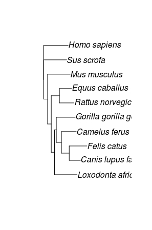

# Human/Mouse Pairwise ALignment

Conservation of MEG8/Rian was observed between mouse and human by conducting a pairwise alignment between the respective sequences. Both of the sequences were obatined from Genbank: 
- NR_146000 (Refseq): Homo sapiens maternally expressed 8, small nucleolar RNA host gene (MEG8), long non-coding RNA.
- EU43919 (Genbank): Mus musculus Meg8 noncoding RNA, complete sequence.

Rstudio was employed to carry out the first alignment. The sequences were retrieved by accessing the Genbank database with the command ```choosebank()``` and using the accession number to query each sequence. This function allows to select one of the databases structured under ACNUC and located on the web. Called without arguments, choosebank(), will return the list of available databases. 


```R
where.is.this.acc("NR_146000")
choosebank("refseq")
q1<-query("Homo sapiens","AC=NR_146000")

head(q1)
closebank()

choosebank("genbank")
q2<-query("Mus musculus","AC=EU434919")
head(q2)
closebank()
```
### Alignment 2D structure prediction with RNAalifold

RNAalifold predicts consensus secondary structures from an alignment of several related RNA or DNA sequences. It is part of RNAVienna and requires the alignment in a ClustalW format, as seen below. The two DNA sequences were entered into EMBOSS Needle, which reads two input sequences and writes their optimal global sequence alignment to ClustalW file.

```R
CLUSTAL W (1.83) multiple sequence alignment


NR_146000.1     GCACGGTGCTCGATCCCCAATGGAAGGAAATGGAGGCAGACCCATCTTGCAGGTCATCAC
EU434919.1      ------------------------------------------------------------
                                                                            

NR_146000.1     CAGGAAGGAGATGAGACTCATGTCCTGGAGACGAATACCCCACTGGAGGTGGCGTGAAGG
EU434919.1      ------------------------------------------------------------
                                                                            

NR_146000.1     GGAGATGGCTGCTTTCTCCTGGGAAGGGAGCAGATGCCTGGCCCAGGACCAAATCAAAAG
EU434919.1      ------------------------------------------------------------
                                                                            

NR_146000.1     CTGAGGCTCACTGCCCCCAGTGGGCAGTGGGTCCAGGGGGTTTCTGAGGACAGGGCATGA
EU434919.1      --------------------------------------GATTCCTGAGG-----------
                                                                            

NR_146000.1     CCCAGCCCTGCTGCCC---CCAAGATGGCACCTGGCTTGGAGGGGTGAGGGGCCCTGTT-
EU434919.1      --GAGCCCTGC--CCCCTTCCA--------------------GGGTGA------ATTTTC
                                                                            

NR_146000.1     ---AGTCTGACTTTGAAGAAGACCAGCCTTCCAGACTCGCTTGGTGCCCTGACAGCAGCT
EU434919.1      CTAAGTC--ACCATGGAGA--ACCAGCAGCCCAGAATC----AGTGCCCTGCCAG--GC-
                                                                            

NR_146000.1     TGTGTTTCTTCCTTCAAGAGTCTGCTTAGAGATAATAAAGATCAACACT--ATTCCTTAT
EU434919.1      ----------------AGAAT-TGCTTGGCCATAACAAAGATC--CATTGCCTTTCTGAT
                                                                            

NR_146000.1     AA----CAACACCTCAGTATCCTGCGAGCTGTACACACCAGAGTTTATTTAACCACCTTG
EU434919.1      GACACCCAGCACCTCGGATT--------CTGTATACACGGGAGGTGATTTAAGCATCTTA
                                                                            

NR_146000.1     CTGCTGGCATGAAAGCCTCAGGAGCCCTGGGCTCCCCCAGTGTTGCCTGGGTCTGACTTT
EU434919.1      CTGCCACCCTGAAA-----------TCTGGGGTC----------------------CTTT
                                                                            

NR_146000.1     GCCTCAGTGAAAACTGCCTCGAATTCTTTCTTGCACCGATGGGCAGATGGGCAGTGTCGG
EU434919.1      ----------------------ATCCT--------------GGCAG--------------
                                                                            

NR_146000.1     AGGATCGTGTCATCT-GTCCCGTGGCGCTGGTTGGCTTGGTCAAGTCAGTGTTCAAACTA
EU434919.1      --------GTCATCTAGACCCGTAACGC------------CCACTTCAG-----------
                                                                            

NR_146000.1     TCTCCTGCTCTTTCAAGGGGATCTGGGGCTCTAGAAGATTAGAGGACTTGGAGAGGTTAG
EU434919.1      --------------AATGGGA---GG---------------GAGGA--------------
                                                                            

NR_146000.1     TGACT--TGCTCGAGGTCGGCTAGGAAGCAAGACCC-AGGATTCCAACTCAG---GTCTG
EU434919.1      TGTCTGCTGCCC--TGTCGTCT------CCACACCCGAGGA----ATGTCCGTGTGTGTG
                                                                            

NR_146000.1     TGTGATTCCTCTGCAAAATGG---------AG---------AGGTGGAAGGATGGATGTC
EU434919.1      TGTGTGTGGTGTGCACAGCGGGCTGCACACAGCGGGCTCCACGGTGCTCGAATGGAGGCC
                                                                            

NR_146000.1     AGGTCTGATGGATGGATGGATGCCTACATCAAGATACATGCATAGATGG-AGAGATGGCT
EU434919.1      ----CTAATG--TGAATGGA-GACTA-------------GCCT-GCTGGTAGAG------
                                                                            

NR_146000.1     GGCTACCTCATGAATGCTG-GACTGTTGTGAG-AAT----------CAAACGAGATAATG
EU434919.1      ----ACCT--TG---GCAGTGACCGCTGTGGGCAATGAGCCATGGGCCAACAA-------
                                                                            

NR_146000.1     TATGCTGAGGCATGCTGTGAACACTACGT----GCTGGGTACAG---GAGAATGGAGGCT
EU434919.1      TATTC-----AATGCTGTG-----TACCTGATGGATGGTTACTGTCTGAGACT-GAGGCT
                                                                            

NR_146000.1     -------CCA-GAGTGAAATTAATGACACTTTGTCGATGAAGATCTTGATTGTGACCTCT
EU434919.1      TTTTGGGCCAGGAGTAAAA------GGACTTGGT--TTGTA---CTTGATTGCGTC--CT
                                                                            

NR_146000.1     GTGGAAAATGAGCCATGAACCAACCAA-TGATAAGTCTACTTTTCTTCC--ACGTAACAA
EU434919.1      GTGG---ATG---CTTG--CCTACCAACTGA-----------CTCATCCTGACGT----G
                                                                            

NR_146000.1     CCACAGGATAGATGACATTCATTTTCTAAGAAACAAAATCTTGGCAGTTAGATCC---GT
EU434919.1      CCAAAGG-------------------------------TCCTGGC--TT---TCCCCTGT
                                                                            

NR_146000.1     G-GGGTA----AAGAATATAGATACTAATAATGAAAACCATGTAGCTGGTCTTATTATTC
EU434919.1      GTGGGTAAGGGAAGAAGAGAG-TTCT-----------CCATGT---TTGTCCCA------
                                                                            

NR_146000.1     TCTAATCATGAAGACCATTATT--------GTTATTTGTGGACT--AAGGAGCAGAAAGA
EU434919.1      ----------CAGAGCATCACTATCAAACAGTTCACTGTGGACTCCTCGTAGCAGAAGTA
                                                                            

NR_146000.1     CTGATAGTGGACA-----------------TAGGCCAGCTGATTTAATAATTTAAGAAAG
EU434919.1      CAG-TAGGGGACAGCAAGTGTCAGCTCCATCAGGACCCCTGATTTAATTATTTACTGTGG
                                                                            

NR_146000.1     AACTGTTATCCTGAGTAAGGAGCATAGA-GACAAATATAAAATGAACGC----------A
EU434919.1      AACCATTGTCCTGAGTCAGGAGGATAGATGAGGAA---AGAATGAGAGCGTGGCTGGCAT
                                                                            

NR_146000.1     CTCTACCTGATTTAATTATAGTCTTCTGGTGAAGATCTTG-CTGTT-ATCTCTGTGAATC
EU434919.1      CGCTTCATGATTACA--------TTCTGGGAAAGATCTTGCCTGTTAACCTCT-------
                                                                            

NR_146000.1     AGGAGAGAAGAGATTGATAAGGAATAGACGAGATTGGATTTGGTCATTTCCCCAAGGTGA
EU434919.1      ---AGAGAAG--------GAGG----GACGATA---------------------------
                                                                            

NR_146000.1     AGAGCATGGCGATTTCTTCTGTGGTAAGGAGCA-ATAATGAAGACCATGGTTGATTTAAT
EU434919.1      -------------------------------CAGACAATGAAGACTATAGCAGACTGAAT
                                                                            

NR_146000.1     CAGTCTCTGCTGATGAAGATCTTGGCTGTTACCTTTG---------TGTGTAAGGAAGCT
EU434919.1      TACTCTCTG-AGATGAGGA-CTTTGCTATTGCCATTGCAGAACCACTG-GT--GGAAGTT
                                                                            

NR_146000.1     AAAGACTTAAGTAAATAACAG-------TCCA--AAAACTTGTCAATTAGGAATGAATGC
EU434919.1      GTTG--TTA-------AACAGTGGGTCTTGCATGCAAGCTCTACAGTT--------ATGC
                                                                            

NR_146000.1     GCAATGATTCAATTA-TTCTCCAGCGAGGAAGATCATGGT------------TGTTGTCT
EU434919.1      ACAGTATTTCCATGACATCCCAAGCCATGAGGTTCATGCTGCCATATCCCCCTGTT----
                                                                            

NR_146000.1     GTTTGAGTAATGAGTGTAGAAACCTATAATGGAGGCGTGATGGCTGATGCAATCATTTTC
EU434919.1      -------TAACAAGTGTGGAAACTGAT-TTGTAG-----------GAACAAACCAT----
                                                                            

NR_146000.1     CACTGATGAAGGTTTTGATGGCCACCTGTAATGAACAGCCCCA-TCTGATTTAATCACTG
EU434919.1      CCCATAT-------------GCAACCAG------ACAGCTCCATTCTGTTT---TCACCG
                                                                            

NR_146000.1     TGCAATGACC-GTGAACTGTA------CAGTTACCTCCGTG---TGTCACAGGAAGACTC
EU434919.1      ------GCCCTGTGAGATCTACACACTCAGTT--CTGGGTGAGAAGACACAGAA------
                                                                            

NR_146000.1     TTTTGACTTAAGCACCCTTCCATGGTCATG---AGGTTTCT--GGTTGCCTCTGTGTGTT
EU434919.1      --TGGACT----CACAAT----TGCTGATGTATAGG-TTCTAATGTTTTCTAT-TGTG--
                                                                            

NR_146000.1     AGA------------AG-CTTGGAG-ACCAATGCCT----TCTGCTGT-------GATCG
EU434919.1      -GACACGGGACACCCAGACT--GAGAACCAATGGCTCCAGTCTGATTTAAACATGGGTC-
                                                                            

NR_146000.1     CGTTCTC-CACA--------GTTGCCTCTGGG--TAGGAG-CCTG-GACA---CTAATAG
EU434919.1      CGTGCTCACACACTCAATACCTACCCTCTGTGCTCACAAGTCCTGTGAGAAATGTAAAAC
                                                                            

NR_146000.1     AAAATGGATGCACTTGAGCCGACCTAAGCATTCATGGTCATGAGATTTGTGGTTGCCACT
EU434919.1      TAAATGGA--CAAAT-ATCC-ACCT-----TT-----TTATTATCTTTG---------CT
                                                                            

NR_146000.1     GTTGGTTAGGAGCATAGAGATCAGTAATGGACACACCTGG------GCTGGCAGA--ACA
EU434919.1      GTTG-----------------------TGCCCTC-CCTGGATGGGTGCTGGCACATGATG
                                                                            

NR_146000.1     TCTTGCCTTGATCTGGAGCCCCATGTCTGCCCCTCTGTAGAGGTGCA-CATGGGCCAATG
EU434919.1      TCTTGCCT---GCTGG---TCCGTGGTTG-CACTCT---------CACCATGTG-----G
                                                                            

NR_146000.1     ATGGATGCAATG-AGCTGA----TCATT-TTGCTGTGATCAAGGCTATGTT-------GC
EU434919.1      ATGGA-GCTCGGCAGCTGAAAATGCATTCTTCC----ACCAAG---ATGATTTACACAGC
                                                                            

NR_146000.1     CT--CTGTGTTAGG------CCAAT-GGTTGATGTTCATGGGTGATTGATCATCCTGTAG
EU434919.1      CTAGCTGGATCAGGAGCCCCCTAATAAGCTG--CTTCA-----GATTG----TAATATAG
                                                                            

NR_146000.1     CGACGGT--GGTATTGACTGTTCCCCAGAGGACAAGGAGTGTG-------TTCTT-ATCT
EU434919.1      ACACAGTAATGTA-TGCCTG-------CAGGA-------TGAGTCCCACCTTCTTCAT-T
                                                                            

NR_146000.1     ACTCAGGAGG-CTGAG-----------------GCAGGAGAAACGCTTGAACCCGAGAG-
EU434919.1      AGTCTTGAGGTTTGAGATTCCCTGTTTGTGTCTGCAGGA-------TT----CAGATAGT
                                                                            

NR_146000.1     -GCGGAGGT--TGC-AGTGAGCT---GAGATTGCGCCATTGCACTCCAGCCTGGGCAACA
EU434919.1      AATGGATATCCTGCAAGTCGGCTTCGTAGAGT-CTCCCTTG-------------------
                                                                            

NR_146000.1     AGAGTGAAACTC--CATCTCAAAAGAAAAAAAAAAGAAAACAAAACAAAAAAAGAAAAAA
EU434919.1      AAAGTGGACCTCATGATCT---------------------------------------AG
                                                                            

NR_146000.1     CC--AATGTTC---------CA-----ATAGTTTCCC----AAATCATGCTGATGCTGCC
EU434919.1      CCTTTATGTCCGTGGATTGACACTGTGATGGATTCCCCCCAAGTTCAT------------
                                                                            

NR_146000.1     TCCTGAGAAATATTTTCAGAATCACTGAGAAAAATGT-ATGAAATAGTTAATGTCCTTGC
EU434919.1      ---TTAGATATTCTCTCTTATTC------ATAAATGTCACG-----------GTC--AGC
                                                                            

NR_146000.1     TCTGTGTCAGTGGTGGAGGCTGTCTGCAGTAGGAGCATGGAGACCAACAATGGATGCTCT
EU434919.1      TCTGT-----------------TCT----------TATAGATACC-AGAATGGATACCCC
                                                                            

NR_146000.1     TAAACTGATTTA---AGCACGCTTCC---ATGGTCAGAAGCCT--TATGGTTGCCACAGG
EU434919.1      TAAGCTGATGTATATA-CACCCTTCCTCGGTTGTGAGATTCCTGCTCTGGT--------G
                                                                            

NR_146000.1     GTATTAGGAGCATGGAGACCAATAATGGATGTCCTTGTTCTGAT--TTGAGGATGCCTCC
EU434919.1      GT----------TGTAGTC--ATAA--GATATAC--------ATCGTTGCGTA---CACC
                                                                            

NR_146000.1     AAGGT--------CACATACT-CTGT----TTGCACCACGCTTAGGAAGGAGCGTGAAGA
EU434919.1      TTGGTTGTGGGCACGCACACTACTGTTGAATT--ACCAC-CTT---------------GT
                                                                            

NR_146000.1     CCAAGGGGAGGAAGATGATAAACACAGATCATGGAGGACTGTTTTATCTGTTTGTGATCT
EU434919.1      CCAAGTGG----------------------ATGGA------------------------T
                                                                            

NR_146000.1     GCCGTCCTCTGTGAGCCTCAGGATGGATGTTTGCCAGCCGAT-TCCATGGTTACAAGCTC
EU434919.1      GC-------------CCTCA--ATGG--GATTGGCA--CTTTCTCCAT-------TGCTC
                                                                            

NR_146000.1     TATAGCTGCA-TCTATGTGTTAGGAGC--------------ATGAAGAC-CAATAATGGA
EU434919.1      -----CTGCACTC----TGTTATCAGCACTTCGGGTTCATAATGTACACACAGCAATGGA
                                                                            

NR_146000.1     TGCACTG-AGCTGATTATGAAT-TTAGCCCTGATGAAGACTTGTGTTGCTGTCATGATAT
EU434919.1      TTTTCTGCAGCTGATTTTCTATATT----CTG--------TTTTCTTCGGGT--------
                                                                            

NR_146000.1     GAAAGATTCCAGTAATGAACGCACTTGAGTTGATTCAAGCACGCTTCC---ATGGTCATG
EU434919.1      --AAG----CAGAAA------CA--------GATGC-------CTTCCTCACTGGTCACC
                                                                            

NR_146000.1     AGCTCTGTGGTTGCA---TC-----TGTGTGTTAGGAGCATGCAG--ACCAATAGTGATA
EU434919.1      A-------GGTT-CAAGGTCCCTCATATGTGTCAGGTGCAT--AGTCACCAACA-----A
                                                                            

NR_146000.1     A--------TC---TCGAGGTGATTTATGCATTCTTCCATGGC-----CACCAGCCTTAT
EU434919.1      AGGCCAACTTCACATCAATGGG-----TGGATCGTACCTCGGCCTAAGCTCCAG------
                                                                            

NR_146000.1     GATTGCATCTGTGC-------GTCACAGCTTAGAGATCAATAATGGATGCAACAAGCTCT
EU434919.1      GATTG-AT-TGTGCTGTTAGAGTCACAGC------------------TACAACCGGCTCA
                                                                            

NR_146000.1     TTGAATCATTCTGTTGGGATCAAGA----TTGTTGTGTTCCCTCTGTTTGGAAAGAGA-C
EU434919.1      GGGAACC---CAGTGG-----AAGAGGAGGTGGAGTGT----------------GAGAGC
                                                                            

NR_146000.1     CAA---GAATGG-ATACGCTCAGGTGATTTAAGCA--GTCTTCCATGGCCAC--GAGCTC
EU434919.1      CAATTGGAATGGAAGACAGTGAGG------AAACAAGGCCTTCGA--GACACAAGAGGAC
                                                                            

NR_146000.1     TGTGGTTGCCTCTGTATATTAAGAGCACAGAGATTAAAAATGGCCCCATTCCAGCTGATA
EU434919.1      TG---------CTG-------AGCTCACAAAGACTGA----GGC----------------
                                                                            

NR_146000.1     TAAGCACTCTTCCATGGCATGTGCA---CTATGGTTGGTTC--TCTG-----TGTTAGGA
EU434919.1      --AGCACCCT--CAGGACCTGCACAGGTCTAAGCTTGATGCGATCTGAGTACTGAGAGG-
                                                                            

NR_146000.1     GC------ACACAAACC---ATTG-----CGAGTATGCATTCATTTCC---------TCT
EU434919.1      GCAACTGGACACAATTCTATATTGATAACCCAG-AAGCTTTC---TCCAGTTGATAAACT
                                                                            

NR_146000.1     CTTTACAAG---AATGGGTGCACTTGAGCCGATTGAAACATTCCTCCTTGCATCTTTCTT
EU434919.1      CTTTCAAAGGAAAA-------ACTTG------TT------TTCTACCATGGA--------
                                                                            

NR_146000.1     CTGTG--ATTGCATCTATTTGTTAGTAGCATAGA---GACCAATAATAGATGGCTTGTGC
EU434919.1      --GTGACACTGGAT---------------ATAGAAACTACCGTTAACA----------GC
                                                                            

NR_146000.1     TGATGGAAGGATTCCTCCCTGGTGACATGCTGTGTCTGCCTCTTGATTGGGAGCACGCAG
EU434919.1      AGA-----------CTCCATGG---------------------------------CTCAG
                                                                            

NR_146000.1     ACCTACAAT--------------GATGCACTTTTT---ATGATTTGAGAATTC--CTTCA
EU434919.1      ACTTCCAATACAATATGAACTCAGTTGCAATTTTTTGCAAGGTTT-----TTCGAC-TCA
                                                                            

NR_146000.1     TGGTCACGTGCTCTGTTTTTATCATGGTTGGG---------AGCCTGCAGAGCAATAAGG
EU434919.1      TAGT-----------TCTTTGTC-----TGGGTACTTTTTCACCCTACAGAGAATTTCTG
                                                                            

NR_146000.1     GACAT----GCCTTTGCTGATTTGAG------GA--TTCCTCTGAGGTTGGGAGCTAAGT
EU434919.1      TATATATTATCGTTT-CTGATTCTAGTGTTTTGAATTTTCGCTG-GGT------CTAAAT
                                                                            

NR_146000.1     TTGCATC-ATG-CTTAGAAAGGAGTGTGCAG-ACCTG----TAATGATTGCACTTTG---
EU434919.1      ----ATCTCTGTCT-------CAGTGT-CAGTATGTGTTTCTCATGATTTTTCTTTGCTT
                                                                            

NR_146000.1     CTGATTGAAGGATTCCTTCAAGTC----CATGTGCTCCACTTGCACCATTTTTAGGATGG
EU434919.1      CTCTTT------TTCCT---ATTCTTTGCTTGTATTCC-CTGG-------TTTGTGTTTG
                                                                            

NR_146000.1     A--GCCTGGAGACCTATAATGAACAACTTG--TGCTG----TGTTAAGGATTCCTCC-AT
EU434919.1      AGTGTCTGG-GAACTCTGAGGGTC----TGGTTGGTGATATTGTT----GTTCTTCCTAT
                                                                            

NR_146000.1     GATCACGCGCCCCATTTGTACACCATGCTTGGGAAGGTGCATGCAGAC---CAATAATGG
EU434919.1      G-----GGG------TTGAAAACC--CCTT---CAGCT-CCTTCAGCCTTTCACTAA---
                                                                            

NR_146000.1     ACGTAC----TTGTGATGATTTAAAGATGCCTCCAAGGTCACGTGCTCTGTTTGCACCAT
EU434919.1      --GTCCTCCATTATTATGATT--------CCT--------------------------AT
                                                                            

NR_146000.1     GCTTAGGAAGGAGCGTACAGACCAAAAATGGATGAAT-TGTGCACCTTGAAAAGTTCTTC
EU434919.1      GCT--------------CAGTCC---AGTGGTTGGATGTGAGCCCC-------------C
                                                                            

NR_146000.1     CATGGTCACCTGAGGCATCTGCGTCATGATT----AGGCTCCGGATGA----CTAATAAT
EU434919.1      C-----CCCC-----CCTCTGC------ATTTGTCAGGCTCCGGCAGAGCCTCTAA----
                                                                            

NR_146000.1     GGACGTA-CTTGTTCTGATTTGAGGACTTCTTCATGGTCACATGTTCTGTTTGCACCATG
EU434919.1      GGAGATAGCT-------ATATTAGG--CTCTT----GTCA---GCTTTGTTTG-----TT
                                                                            

NR_146000.1     CTTAGGAAGGAGCATGTGTAC-CAATAATGGAAGCACAGAAGCTGGTTTTAATAGTTAAG
EU434919.1      TTT-------ATTCTGTCTTCTCTATA---------------CTGTTTATTTTAGATAA-
                                                                            

NR_146000.1     AGCTGTATGGTCCATCTCTGTGCTAGAAGCTGGAGACCAATAACAGTCACTCCCTGCACT
EU434919.1      --CTGT---GTTTAT-TCT-------------------AAT----GT-----------AT
                                                                            

NR_146000.1     GATTCTGCCATGACCACTTGCTCTATGGT-TGTTTTAAGGAACCTACAGACAAATAATGG
EU434919.1      GA-------ATGAATAATTG------GGTGTGTGTTTGGG--------------------
                                                                            

NR_146000.1     ATTATCATTGGTGAAGATCTTA------------------GCTGTTCCATAGAAGGAACA
EU434919.1      -------TGGGTGAAG----TAAGTGGGAGGGTGGGGGTGGATG-----TGGGAGGAA-A
                                                                            

NR_146000.1     CACT-TATCAC---TACAGTGATTCTGTAATGATGAAG-ACCTTTATGGGATGGGTAGAC
EU434919.1      AACTGTAACACAAATAC----ATTGTATAA-----AAGTACATT----------------
                                                                            

NR_146000.1     CAGAGCTGATTAAAT-TA-TTCTCCCATTGATGAGGAACTTTACCTTATCCCTCAGAGTA
EU434919.1      ------TTAATAAATGTATTTCTTC---------------------TATGACTAAAAAAA
                                                                            

NR_146000.1     AGGAGAATGTCATATAATGATGAAGATCTTGACTGTTACCCATGTGGCAAGGAGAGTGTA
EU434919.1      AAAAAAA----AAAAAAAAAAAA-------------------------------------
                                                                            

NR_146000.1     GAACAGG
EU434919.1      -------
```
The alignment file was then used to predict the 2D structure with RNAalifold.
- ```.``` = unpaired base
- ```(``` = open bp
- ```)``` = closed bp

Ouput

```R
2 sequences; length of alignment 5107.
__________________________________________________________________________________________________________________________________________________________________________________________________________________________GAUUCCUGAGG_____________CAGCCCUGC__CCC___CCA____________________GGGUGA______AUGUU____AGUC__ACCAUGAAGA__ACCAGCAGCCCAGAAUC____AGUGCCCUGACAG__GC_________________AGAAU_UGCUUAGACAUAACAAAGAUC__CACU__AUUCCUGAUAA____CAACACCUCAGAAU________CUGUACACACCAGAGGUGAUUUAACCACCUUACUGCCACCAUGAAA___________CCUGGGCUC______________________CUUU______________________AUCCU______________GGCAG______________________GUCAUCU_GACCCGUAACGC____________CCAAGUCAG_________________________AAGGGGA___GG_______________GAGGA______________UGACU__UGCCC__GGUCGGCU______CAACACCC_AGGA____AACUCAG___GUCUGUGUGAGUCCUCUGCAAAACGG_________AG_________AGGUGCAAGAAUGGAGGCC____CUAAUG__UGAAUGGA_GACUA_____________GCAU_GAUGG_AGAG__________ACCU__UG___GCAG_GACCGCUGUGAG_AAU__________CAAACAA_______UAUGC_____AAUGCUGUG_____UACCU____GAUGGGUACAG___GAGAAU_GAGGCU_______CCA_GAGUAAAA______ACACUUGGU__AUGAA___CUUGAUUGCGAC__CUGUGG___AUG___CAUG__CCAACCAA_UGA___________CUCAUCC__ACGU____ACCAAAGG_______________________________UCCUGGC__UU___UCC___GUG_GGGUA____AAGAAGAGAG_UACU___________CCAUGU___UGGUCCCA________________AAGACCAUCACU________GUUAACUGUGGACU__AAGGAGCAGAAAGACAG_UAGGGGACA_________________CAGGACACCUGAUUUAAUAAUUUAAGAAAGAACCAUUAUCCUGAGUAAGGAGCAUAGA_GACAAA___AAAAUGAAAGC__________ACGCUACAUGAUUAAA________UUCUGGGAAAGAUCUUG_CUGUU_ACCUCU__________AGAGAAG________AAGG____GACGAGA__________________________________________________________CA_ACAAUGAAGACCAUAGCAGACUGAAUCACUCUCUG_AGAUGAAGA_CUUGGCUAUUACCAUUG_________UG_GU__GGAAGCUAAAG__UUA_______AACAG_______UCCA__AAAACUCGACAAUU________AUGCACAAUAAUUCAAUGA_AUCCCAAGCCAGGAAGAUCAUGCU____________UGUU___________UAACAAGUGUAGAAACCGAU_AUGGAG___________GAACAAACCAU____CACAGAU_____________GCAACCAG______ACAGCCCCA_UCUGAUU___UCACCG______GACC_GUGAAAUCUA______CAGUU__CUCCGUG___AGACACAGAA________UGGACU____CACAAU____UGCUCAUG___AGG_UUCU__GGUUGCCUAU_UGUG___GA____________AG_CU__GAG_ACCAAUGCCU____UCUGAUGU_______GAUC_CGUGCUC_CACA________CUACCCUCUGGG__CACAAG_CCUG_GACA___CUAAAACAAAAUGGA__CAAAU_AGCC_ACCU_____UU_____UCAUGAGAUUUG_________CUGUUG_______________________UGCACAC_CCUGG______GCUGGCACA__ACAUCUUGCCU___GCUGG___CCCAUGGCUG_CACUCU_________CA_CAUGGG_____GAUGGA_GCAAGG_AGCUGA____GCAUU_UUCC____ACCAAG___AUGAU_______GCCU__CUGGAUCAGG______CCAAU_AGCUG__CUUCA_____GAUUG____UAAUAUAGACACAGU__GGUA_UGACUG_______CAGGA_______UGAG_______UUCUU_AU_UACUCAGGAGG_CUGAG_________________GCAGGA_______UU____CAGAGAG__ACGGAGAU__UGC_AGUCAGCU___GAGAGU_CGCCAUUG___________________AAAGUGAAACUC__CAUCU_______________________________________AACC__AAUGUCC_________CA_____AUAGAUUCCC____AAAUCAU_______________UGAGAAAUACUCUCAGAAUC______AAAAAUGU_ACG___________GUC__AGCUCUGU_________________UCU__________CAUAGAGACC_ACAAUGGAUACCCCUAAACUGAUGUA___A_CACCCUUCC___AUGGUCAGAAGCCU__UAUGGU________GGU__________UGGAGAC__AUAA__GAUAUAC________AU__UUGAGGA___CACCAAGGU________CACACACU_CUGU____UU__ACCAC_CUU_______________GACCAAGGGG______________________AUGGA________________________UGC_____________CCUCA__AUGG__GAUUGCCA__CGAU_UCCAU_______AGCUC_____CUGCA_UC____UGUUAGCAGC______________AUGAACAC_CAACAAUGGAUGCACUG_AGCUGAUUAUCAAU_UU____CUG________UUGUCUUCCGGU__________AAG____CAGAAA______CA________GAUGC_______CUUCC___AUGGUCACCA_______GGUU_CA___UC_____UAUGUGUCAGGAGCAU__AG__ACCAACA_____AA________UC___UCAAGGGG_____UGCAUCCUACCACGGC_____CACCAG______GAUUG_AU_UGUGC_______GUCACAGC__________________UACAACAAGCUCAGGGAACC___CAGUGG_____AAGA____GUGGAGUGU________________GAGA_CCAA___GAAUGG_AGACACUCAGG______AAACA__GCCUUCCA__GACAC__GAGCACUG_________CUG_______AGAGCACAAAGACUAA____GGC__________________AGCACCCU__CAGGACAUGCACA___CUAAGCUUGAUGC__UCUG_____UGAGAGG_GC______ACACAAACC___AUUG_____CCAG_AAGCAUUC___UCC_________ACUCUUUAAAAG___AA_______ACUUG______UU______UUCCACCAUGCA__________GUG__ACUGCAU_______________AUAGA___GACCAAUAACA__________GCAGA___________CUCCAUGG_________________________________CGCAGACCUACAAU______________GAUGCAAUUUUU___AAGAUUU_____UUC__C_UCAUAGU___________UCUUUAUC_____UGGG_________ACCCUACAGAGAAAUAAGGGACAU____GCCUUU_CUGAUUCGAG______GA__UUCCGCUG_GGU______CUAAAU____AUC_AUG_CU_______CAGUGU_CAG_ACCUG____UAAUGAUUGCACUUUG___CUCAUU______UUCCU___AGUC____CAUGUACUCC_CUGG_______UUUAGGAUGGA__GCCUGG_GAACUAUAAGGAAC____UG__UGCUG____UGUU____AUUCCUCC_AUG_____GCG______UUGAAAACC__CCUU___AAGCU_CAUGCAGAC___CAAUAA_____GUAC____UUAUGAUGAUU________CCU__________________________AUGCU______________CAGACC___AAUGGAUGAAU_UGAGCACC_____________CC_____CACC_____CAUCUGC______AUU____AGGCUCCGGAAGA____CUAA____GGACAUA_CU_______AUAUGAGG__CUCUU____GUCA___GCUCUGUUUG_____UGCUU_______AGCAUGUCUAC_CAAUA_______________CUGGUUAUAAUAGAUAA___CUGU___GUCCAU_UCU___________________AAU____GU___________AUGA_______AUGAACAAUUG______GGU_UGUGUUAAGG___________________________UGGGUGAAG____UA__________________GAUG_____UAGAAGGAA_AAACU_UAACAC___UAC____AUUCUAUAA_____AAG_ACAUU______________________UGAAUAAAU_UA_UUCUCC_____________________UAUCACUAAAAAAAAAAAAAA____AAAAAAAAAAAA____________________________________________
.............................................................................................................................................................................................................................((((((((...........((..(((((................................)))))..))....................((((((((....((((((.((((..((......(((((((((((((((...................(((((.((((((((......................................((((((.........................))))))((((.((((((((.(((((((((((................))))))...................................................................(((((((.....................(((((((..((((((....................................................))))))......................)))..............))))).)))))).................((((((.(((........))).)...)))))(((((.......)))))..))........)))........)))))))).))))(.((((((...........((((.((.((.(((.............(((...(((((((((...........((((......(((((((((.((((.(((............))).))))......((((((....)))))).....................))))))))).........))))))))....)))))(((((..........)))))...................(((((((.((((((...(((..........................................))).....))))))................................(((((((..((...((....((((((........(((((....))))).....................(((((((................((((((..............)))))))).)))))..........(((((((((.((((((.........................)))))).....................(((((.(((((...))))).)))))..(((((.......(((((.(((..........))))))))..................(((((((((((((..........((((.(......).))))..................................................................................................(((.(((((...........)))))..)))))))))))))))).......((((...(((((((............................)))))))....)))).......))))).................)))))))))(((((.((((((.....)))))))))))..............................((((((((((..(((((....(((((((...........................................(((((((...........((((((.((...........(((......(((..(((((((((......((((((..(((((((...((((((((...................((((((......((((((...(((....)))..))))))...))))))...............((((((..(((.........)).)))))))..........((((((.((((((.((...........(((.(((((((..(....).)))).)))....)))........)))).)))).))))))......................................))))...........................)))))))))))).....)))))......)))))))))...).)))))...(((((((.(((..............)))))))))).....)))))).))((((((((((......((((((((.......)))))..))).......))).)).)))))((((((.....)))))).....................................(((((.........))))).......((((.....((((((..................(((((.....)))))................(((((((......(((...(((........))))))))))))).((((((((..((((((..(((((((........................((((..........................................................))))................(((((((.......)))))))................((((.....))))..........................................((((((((...........................)))))))).....))))))).))))))))))))))........)))))))))).)))))))....(((......)))......................(((.(((......)))..)))....................)))))))))))).........))))))..))))........))))))...................((....)).....................((((((.......................(((((............((.......))......)))))......)))))).......((((.......(((.......)))...))))...................(((((((((((((((((((((.(((((...............................((((((((...................(((((.....(((..(((((((((.......(((........)))))))))))).))))))))................((((((((((((((...........................................))))).))))).))))....)))))))).......(((((.(((((((.....)).)))))...................))))).))))))))))))))...)).................))))))))))...............)))))))))...))(((((((((....................))))))))))))))))...(((((....................)))))...............)))................).)))).)).)))))))))).)...)).))))))..)))))...)))....)))))))).))......)).......................................................((((.............))))...................(((((((...................................................................................))))))).....................................((((..........................................................)))).....................................((((.(((((((...........................................))))))))))).................................(((((...(((((((((.......((((...............................))))...))))))))).)))))...........))..)))).)).))))....)))))))).............(((.............(((((((((((..............(((((((((...........))))..)))))....(((((((((............................................................((((..............(((((((........))))).))))))..............(((.....((((..((((((((((.....................))))))...........(((((...(((..........)))..)))))......................................................................((((.......)))).............((((((.((..........................................)).......))))))....)).))..))))........)))........................))))))))).................................)))))))))))..........))).......................(((((((((((..........................)))))))))))............................)))))))).....................................................................
 minimum free energy = -381.69 kcal/mol (-494.82 + 113.13)
 ```
This alignments was then input in RNAplot to visualize the consensus structure. 

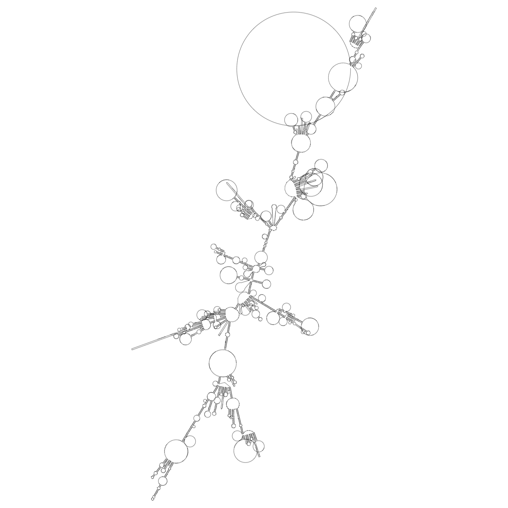

# 2D STRUCTURE PREDICTION OF snoRNA


The snoRNA sequences obtained from the search were introduced into the RNAFold server from RNAVienna to predict their 2D structures. Both the sequences retrieved from UCSC Genome Browser and Infernal were used to predict the 2D structures of the corresponding snoRNA.

## Infernal/Rfam snoRNA analysis

### SNORD113

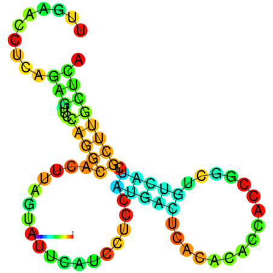

```R
>SNORD113-1
uugaaccucagaguuccaggcacuuaguauucauccuccaugacucacacaccaccggcugucaucgcuugcuca
..........(((...(((((..................(((((................))))).)))))))).
```

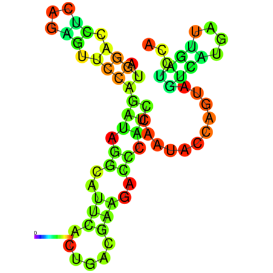

```R
>SNORD113-2
auggaccucagaguuccagauaggcauucacugacgaagacccauccaauaccaguagucaugauugaucca
.((((.((...)).))))(((.((..(((......)))..)).)))...........((((....))))...
```
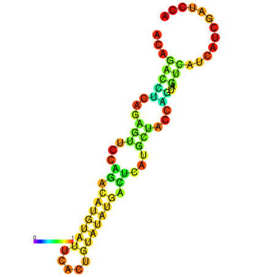
```R
>SNORD113-3
acagaccucagaguuccagacauguauucacuguauaugacucaugcuaccaguagucaucaucgaucca
...(((((...(((...((.(((((((.....))))))).))...)))...))..)))............
```
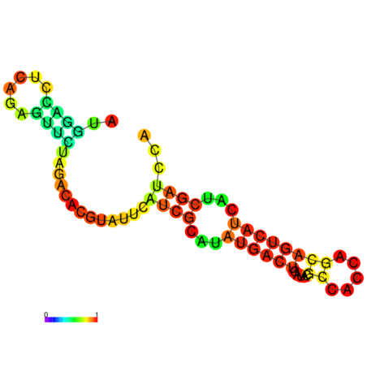
```R
>SNORD113-4
auggaccucagaguucuagacacguauucaucgcauaugacucauacgccaccagcagucaucaucgaucca
..((((......)))).............((((...((((((.....((.....))))))))...))))...
```
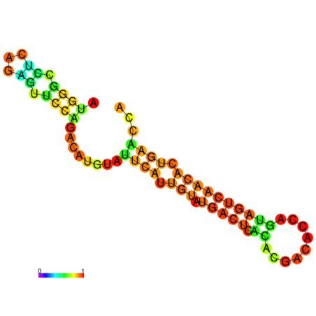
```R
>SNORD113-5
augggccucagaguuccagacauguauucauuguaugacucacacgacaccaguagucaacacugaacca
.((((.((...)).))))........((((.(((.(((((.((.........)))))))))).))))...
```
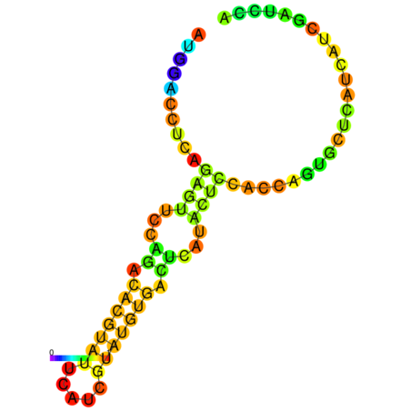
```R
>SNORD113-6
auggaccucagaguuccagacacguauucaucguaugugacucauacuccaccagugcucaucaucgaucca
..........((((...((.(((((((.....))))))).))...)))).......................
```
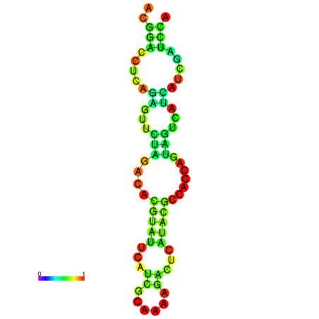
```R
>SNORD113-7
acggaccucagaguucuagacacguauucaucgcaaaagacucauacgccaccaguagucaucaucgaucca
..(((.....((...(((....(((((...((......))...))))).......)))...)).....))).
```
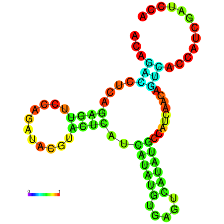
```R
>SNORD113-8
acagaccucagaguuccagauacguacucaucauaugugagucauaugccaucaacagucaccaucgaucca
...(((....((((...........))))..((((((.....)))))).........)))............
```
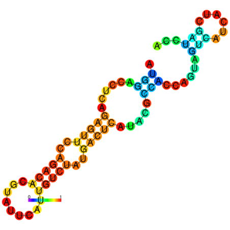
```R
>SNORD113-9
auggaccucagaguuccagacacguauucauugucuaugacucauacgccaccaguagucaucaucgaucca
.(((......(((((..(((((.........)))))..))))).....)))......(((......)))...
```
### SNORD114
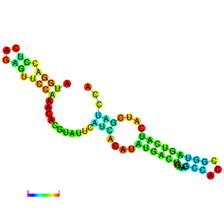
```R
>SNORD114-1
auggaccucagaguuccaaacacguauucaucacauaugacucauacgccaccgguagucaucaucgaucca
.((((.((...)).))))...........(((....((((((.....(((...)))))))))....)))...
```
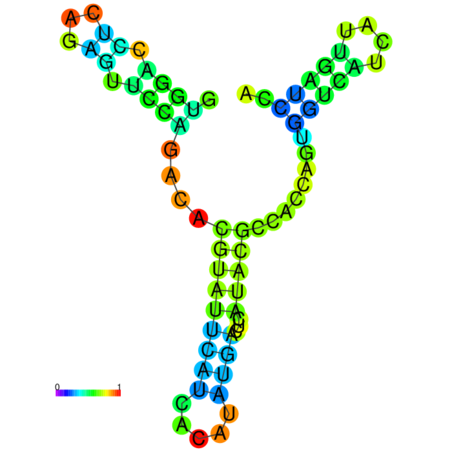
```R
>SNORD114-2
guggaccucagaguuccagacacguauucaucacauaugacucauacgccaccaguggucaucauugaucca
.((((.((...)).))))....(((((((((.....))))...)))))........(((((....)))))..
```
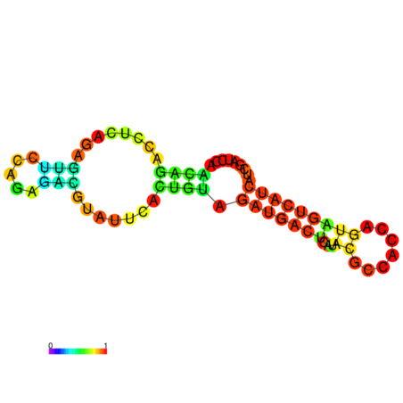
```R
>SNORD114-3
acagaccucagaguuccagagacguauucacuguagaugacucauacgccaccaguagucaucaucgaucca
(((........(((.....))).......)))).(((((((...((.......))))))))).........
```
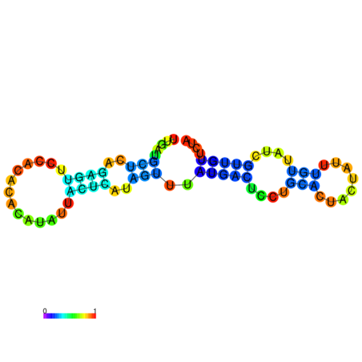
```R
>SNORD114-4
uugaugcucagaguuccacacacauauuacucauaguuuaugacuccugcacuacuauuuguuaucguuguucua
.....(((..((((..............))))..)))..(((((....(((........)))....)))))....
```
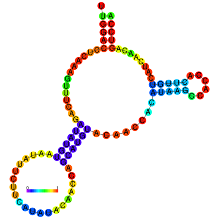
```R
>SNORD114-5
uuggaccucaaaguuucagauauguaauauucuucauauacaaccagcauguacaaccacauaagccaccacuugucaucaacagucca
.(((((.............((((((.....................))))))........(((((......)))))........)))))
```
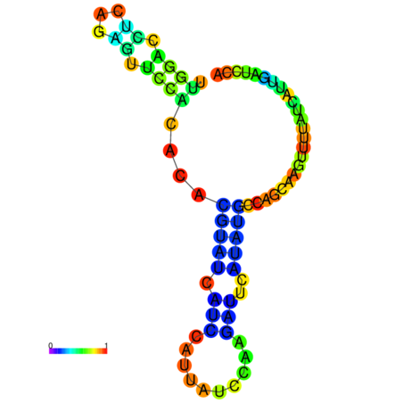
```R
>SNORD114-6
uuggaccucagaguuccacacacguaucauccauuauccaagauucauaugccagcaaguuuuaucauugaucca
.((((.((...)).))))....(((((.(((..........)))..)))))........................
```
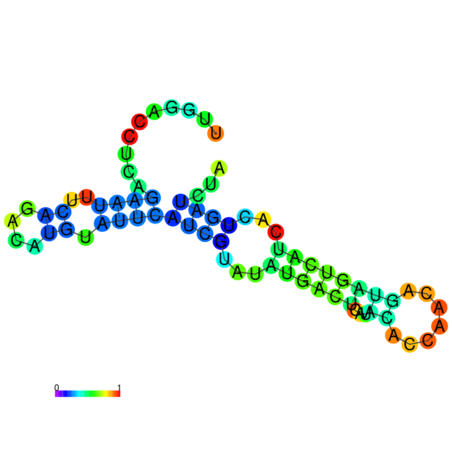
```R
>SNORD114-7
uuggaccucagaauuucagacauguauucaucguauaugacucauacaccaacaguagucaucacugaucua
..........((((..((....)).))))((((...((((((...((.......))))))))...))))...
```
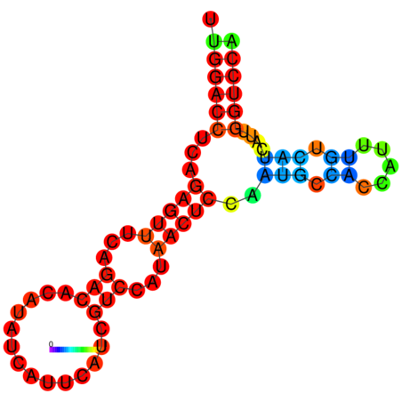
```R
>SNORD114-8
uuggaccucagaguuucagacacauaucauucaucguccauaacuccaaugccaccauuugucaucauuggucca
.((((((...(((((...(((..............)))...)))))..(((.((.....)).)))....))))))
```
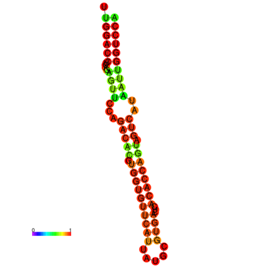
```R
>SNORD114-9
uuggaccucagaguuccagacacgugguguucauuaugcgugacucacaccaguagucauaauuggucca
.((((((....((((...(((((.((((((((((.....))))...)))))))).)))..))))))))))
```
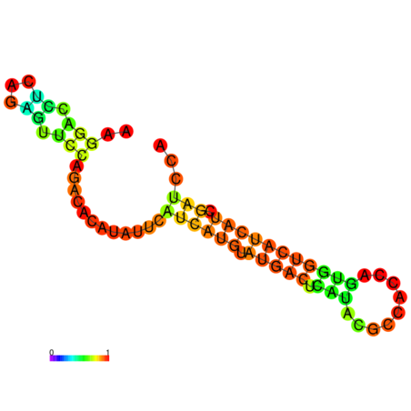
```R
>SNORD114-10
aaggaccucagaguuccagacacauauucaucauguaugacucauacgccaccaguggucaucaucgaucca
..(((.((...)).)))............((((((.(((((.(((.........))))))))))).)))...
```
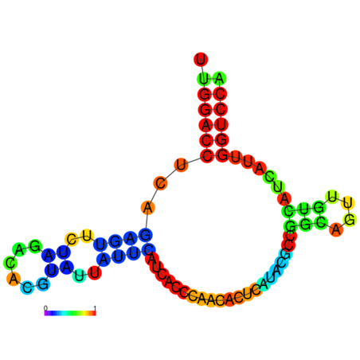
```R
>SNORD114-11
uuggaccucagaguucuagacacguauuauucaucacccaacacucauacgccggcaguugucaucauuggucca
.((((((...((((..((......))..)))).....................(((....)))......))))))
```
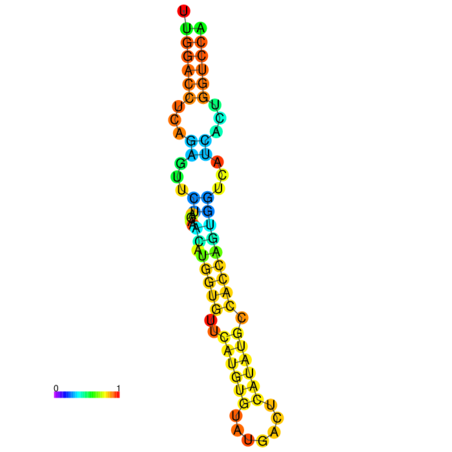
```R
>SNORD114-12
uuggaccucagaguucuagaaacaugguguucauguguaugacucauaugccaccaguggucaucacuggucca
.((((((...((...((....((.(((((..((((((.......)))))).)))))))))...))...))))))
```
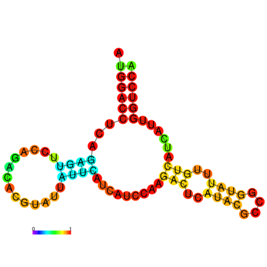
```R
>SNORD114-13
auggaccucagaguuccagacacguauuauucaucauccaagacucauacgccgguauuugucaucauuggucca
.((((((...((((..............)))).........(((..((((....))))..)))......))))))
```
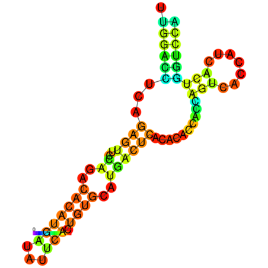
```R
>SNORD114-14
uuggaccucagaguuccagacacaugauauucacugugcaugacucacacaccaccagucaccaucacuggucca
.((((((...((((..((..(((((((...))).))))..))))))..........(((.......)))))))))
```
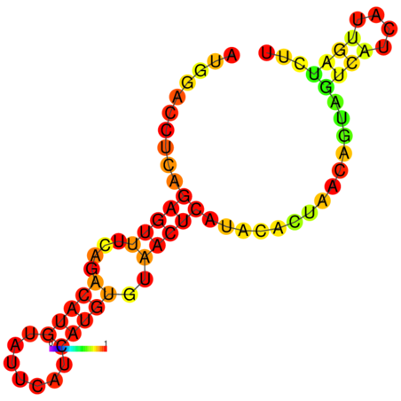
```R
>SNORD114-15
auggaccucagaguuucagacauguauucaucauguguaacucauacacuaacaguagucaucauugaucuu
..........(((((....(((((.......)))))..)))))..............((((....))))...
```
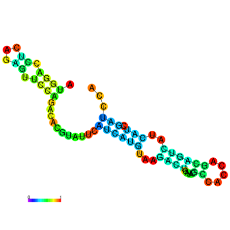
```R
>SNORD114-16
auggaccucagaguuccagacacguauucaucauguaagacucauacgccaccagcagucaucaucgaucca
.((((.((...)).))))...........((((((...((((.....((.....))))))..))).)))...
```
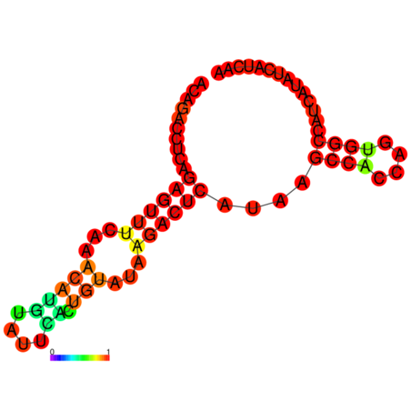
```R
>SNORD114-17
acagaccucagaguuucaaacauguauucacuguauaagacucauaagccaccaguggccaucauaucaucaa
..........((((((...(((((....)).)))...))))))....((((....))))..............
```

```R
>SNORD114-18
uuggaccucagaguucuagacacguauuauucaucacccaacacucauacgccggcaguugucaucauuggucca
.((((((...((((..((......))..)))).....................(((....)))......))))))
```
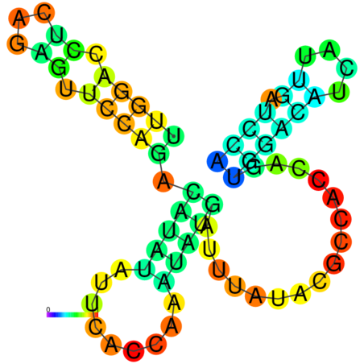
```R
>SNORD114-19
uuggaccucagaguuccagacauauauucaccaaauaugauuuauacgccaccaguggacaucauugaucca
(((((.((...)).))))).(((((.........)))))................((((((....)).))))
```
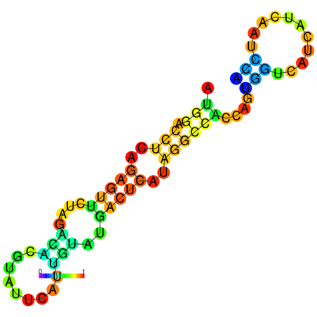
```R
>SNORD114-20
auggaccucagaguucuagacacguauucauuguaugacucauaggccaccaguggucaucaucaaucca
.(((.(((..(((((....(((.........)))..)))))..))))))....(((...........)))
```
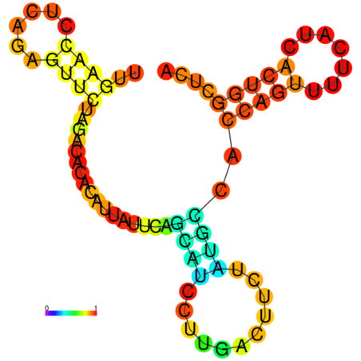

```R
>SNORD114-21
uugaaccucagaguucuagacacacauuauucagcauccuugacuucuaugccaccaguuuucaucacuggcuca
..((((......)))).................((((...........))))..(((((.......)))))....
```
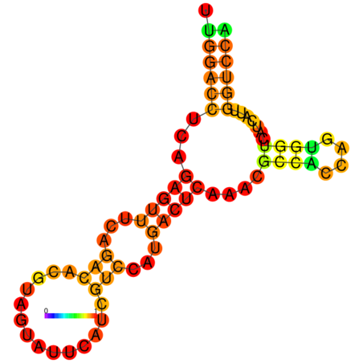

```R
>SNORD114-22
uuggaccucagaguuucagacacguaguauucaucguccaugacucaaacgccaccaguggucaucauuggucca
.((((((...(((((...(((..............)))...)))))....((((....)))).......))))))
```
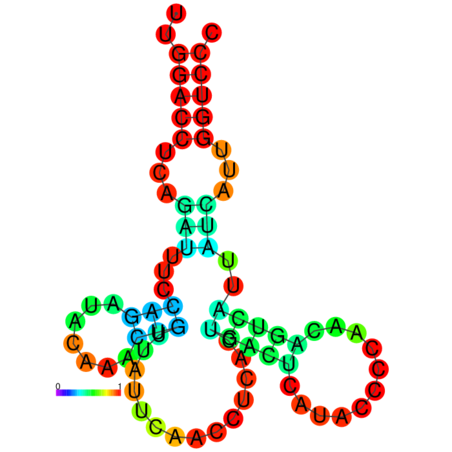
```R
>SNORD114-23
uuggaccucagauuuccagauacaaacuguuauucaaccucacugacucauaccccaacagucauuaucauugguccc
..(((((...(((...(((.......)))..............(((((...........)))))..)))...))))).
```
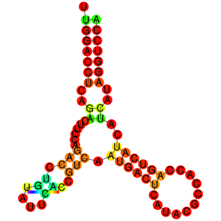
```R
>SNORD114-24
uuggaccucagacuuccagaccuguauucaccgucaaugacucauacgccaccagucaucaucauaggucca
.(((((((..((......(((.((....))..))).((((((...........))))))..))..)))))))
```
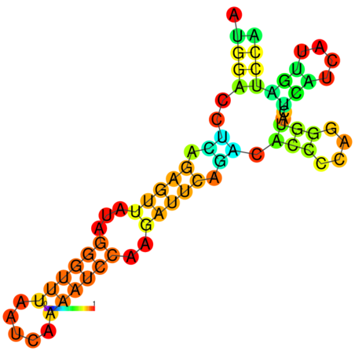
```R
>SNORD114-25
auggaccucagaguuauaggguuuaaucaaaauccaagauucagacaccccaggguacucaucauugaucca
.((((..((.(((((...((((((.....))))))..))))).)).(((....)))..(((....)))))))
```
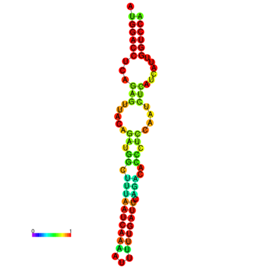
```R
>SNORD114-26
auggaccucagaguuacagauggcuuuaaucaaaauuuuugauucagacacccuccaaucucaucauuggucca
.((((((...(((.....((.((.((((((((((...))))))).)))..)).))....)))......))))))
```
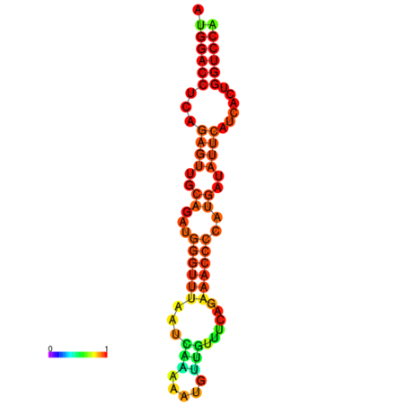
```R
>SNORD114-27
auggaccucagaguugcagauggguuuaaucaaaaauguuguuucagaaaccccaugauauucaucacuggucca
.((((((...((((..((...((((((...(((.....)))......))))))..))..))))......))))))
```
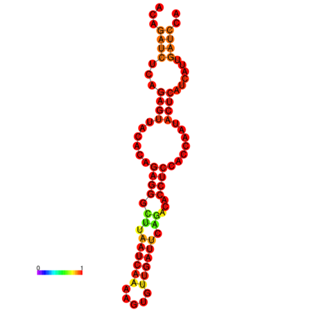
```R
>SNORD114-28
acagaucucagaguuacacagagggcuuaaucaaaaguguugauucagacaccuccaccaauacucaucauugaucca
...((((...((((......((((.((.((((((.....)))))).))...)))).......))))......))))..
```
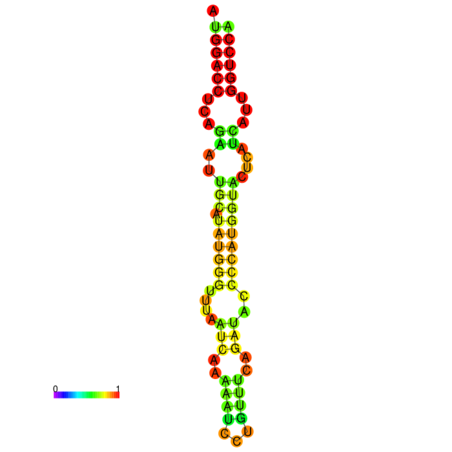
```R
>SNORD114-29
auggaccucagaauugcauauggguuuaaucaaaaauccuguuucagauaccccaugguacucaucauuggucca
.((((((...((..(((.((((((....(((..((((...))))..)))..)))))))))....))...))))))
```
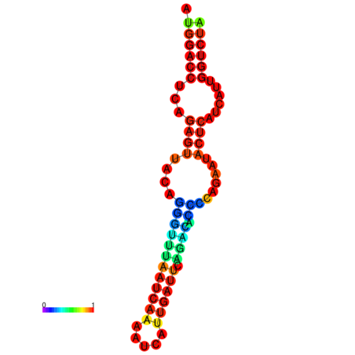
```R
>SNORD114-30
auggaccucagaguuacaggguuuaaucaaaaucauugauucagacaccccagaauacucaucauuggucua
.((((((...((((....((((((((((((.....)))))).)))).)).......))))......))))))
```
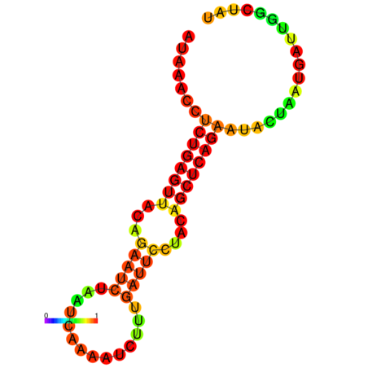
```R
>SNORD114-31
auaaaccucugaguuacagaaucuaaucaaaaucuuugauuccuacagcucagaauacuaaugauuggcuau
.......((((((((...(((((..............)))))....))))))))..................
```
## UCSC Genome Browser snoRNA sequence analysis
### SNORD113 

 
```R
>SNORD113-1

AAAGUGAGUGAUGAAUAGUUCUGUGGCAUAUGAAUCAUUAAUUUUGAUUAAACCCUAAACUCUGAAGUCC
(((((.((((((..((((((....))).)))..)))))).))))).........................
 minimum free energy =  -7.10 kcal/mol
 ```
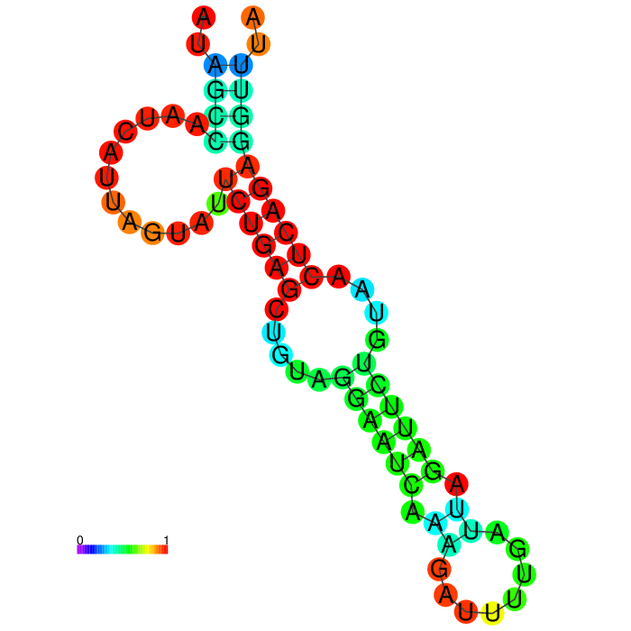 
```R
>SNORD113-2

AUAGCCAAUCAUUAGUAUUCUGAGCUGUAGGAAUCAAAGAUUUUGAUUAGAUUCUGUAACUCAGAGGUUUA
..((((............((((((.....((((((.((........)).))))))....))))))))))..
 minimum free energy = -13.50 kcal/mol
```
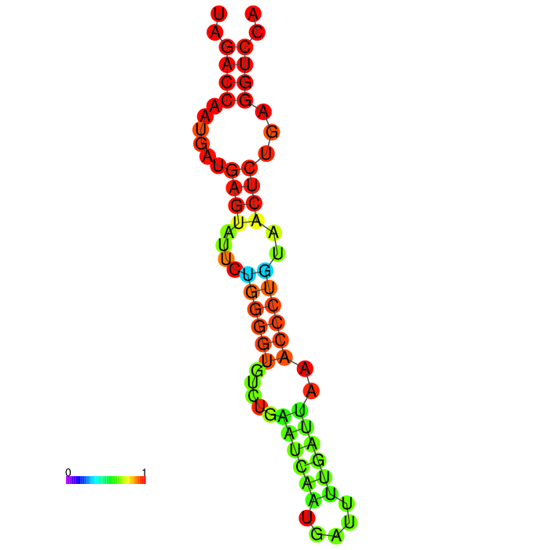 
```R
>SNORD113-3

length = 71

UAGACCAAUGAUGAGUAUUCUGGGGUGUCUGAAUCAAUGAUUUUGAUUAAACCCUGUAACUCUGAGGUCCA
..((((......((((....((((((.....((((((.....))))))..))))))..))))...))))..
```

```R
>SNORD113-4
length = 74

UGGACCAAUGAUGAGUACCAUGGGGUAUCUGAAACAGGAUUUUUGAUUAAACCCAUAUGCAAUUCUGAGGUCCA
((((((...((...(((..(((((..(((.((((.....)))).)))....))))).)))...))...))))))
```
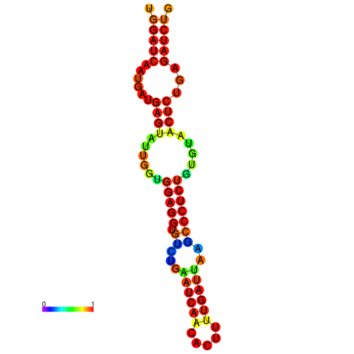
```R
>SNORD113-5

length = 77

UGGAUCAAUGAUGAGUAUUGGUGGAGGUGUCUGAAUCAACACUUUUGAUUAAGCCCUCUGUGUAACUCUGAGAUCUG
.(((((......((((......(((((.(.((.((((((.....)))))).)))))))).....))))...))))).
 minimum free energy = -17.90 kcal/mol
 ```

```R
>SNORD113-6

length = 74

UGGACCAGUGAUGAAUAUCAUGGGGUUUCUGAAACAACAUUUUUGAUUAAACCCAUCUGCAACUCUGAGGUCCA
((((((.(((((....))))).((((((.(((((......)))))...))))))..............))))))
 minimum free energy = -15.30 kcal/mol
 ```
 
```R
>SNORD113-7

length = 76

UGGAUCAAUGAUGAGUAUGCGUGGGGCAUCUGAAUCAAAUAUUCUGAUUAUACCCUGUCUGUAUCUCUGAGGUCCA
((((((......(((.(((((.((((.(((.((((.....)))).)))....))))...))))))))...))))))
 minimum free energy = -18.00 kcal/mol
 ```

```R
>SNORD113-8

length = 73

UGGACCAAUGAUGAGAUUGGAGGGUGUCUGAAUCAAAAAUUUUGAUUAAAGCCAUCUGUAACUCUGAGGUCCA
((((((......(((.(((..(((((.((.(((((((...)))))))..)).))))).))))))...))))))
```

```R
length = 71

UGGAUCAAUGAUGAGUACCCUGGGGUGUCUGAAUCUUGGAUUUUGAUUAAACCCUAUAACUCUGAGGUCCA
((((((......((((....(((((((((.(((((...))))).)))...))))))..))))...))))))
 minimum free energy = -19.40 kcal/mol
```

## SNORD114

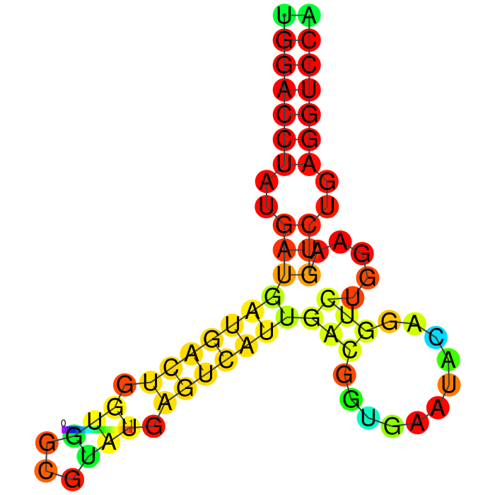 
```R
>SNORD114-1
length = 71

UGGACCUAUGAUGAUGACUGGUGGCGUAUGAGUCAUUGACGGUGAAUACAGGUCUGGAAGUCUGAGGUCCA
(((((((..((((((((((.(((...))).)))))))(((...........))).....)))..)))))))
 minimum free energy = -22.20 kcal/mol
 ```

```R
>SNORD114-2

length = 77

GGGACCAAUGAUAAUGACUGUUGGGGUAUGAGUCAGUGAGGUUGAAUAACAGUUUGUAUCUGGAAAUCUGAGGUCCA
.(((((...((((..((((((((....((...........))....))))))))..))))...........))))).
 minimum free energy = -15.50 kcal/mol
 ```
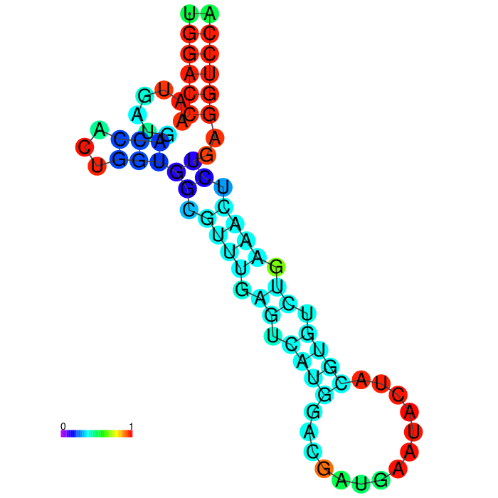
```R
>SNORD114-3

length = 74

UGGACCAAUGAUGACCACUGGUGGCGUUUGAGUCAUGGACGAUGAAUACUACGUGUCUGAAACUCUGAGGUCCA
((((((.......(((...)))((.((((.((.((((..............)))).)).)))).))..))))))
 minimum free energy = -18.80 kcal/mol
 ```
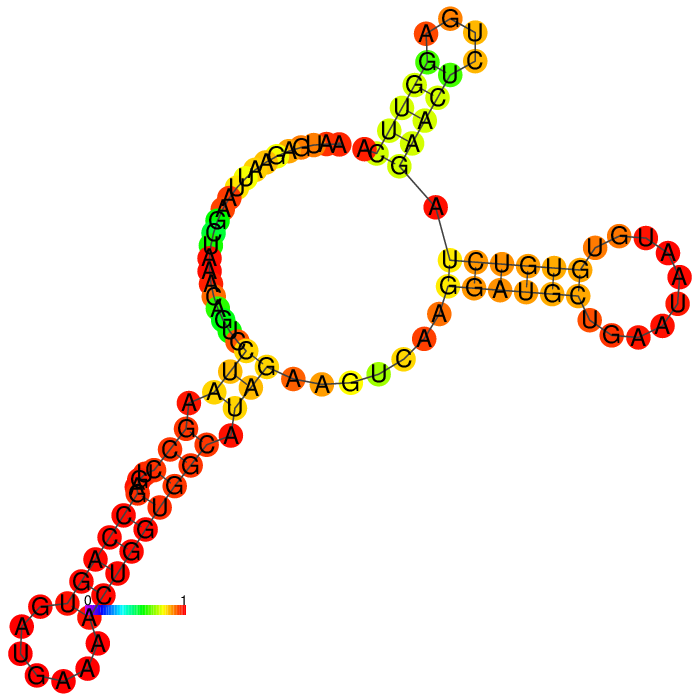
```R
>SNORD114-4

length = 104

UUCAAAUGAGAAUUAAGCUAAACAGUCCUAAGCCUGAGCCAGUGAUGAAAACUGGUGGCAUAGAAGUCAAGGAUGCUGAAUAAUGUGUGUCUAGAACUCUGAGG
((((...(((......(((....))).(((.(((...((((((.......))))))))).))).......((((((..........))))))....))))))).
 minimum free energy = -19.70 kcal/mol
 ```
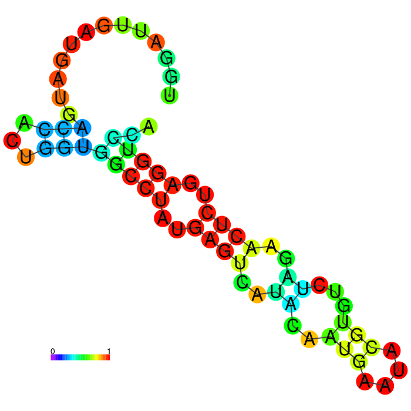 
```R
>SNORD114-5

length = 73

UUCAUGGAUUGAUGAUGACCACUGGUGGCCUAUGAGUCAUACAAUGAAUACGUGUCUAGAACUCUGAGGUCCA
.((((......))))..(((...)))(((((..((((..((..(((....)))...))..))))..)))))..
 minimum free energy = -15.10 kcal/mol
 ```
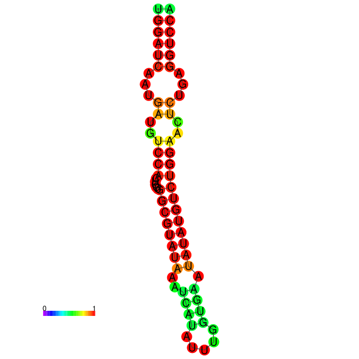
```R
>SNORD114-6

length = 71

UGGAUCAAUGAUGUCCACUGGUGGCGUAUAAAUCAUAUUUGGUGAAUAUAUGUCUGGAACUCUGAGGUCCA
((((((...((..((((.....((((((((..((((.....)))).))))))))))))..))...))))))
 minimum free energy = -19.50 kcal/mol
```
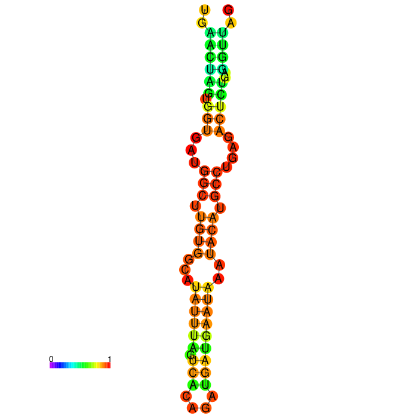 
```R
>SNORD114-7

length = 76

UGAACUAGUGGUGAUGGCUUGUGGCAUAUUUAGUCACAGAUGAUGAAUAAAUACAUGCCUGAGACUCUGAGGUUAG
..((((((.(((...(((.((((...((((((.(((....)))))))))..)))).)))....)))))..))))..
 minimum free energy = -14.50 kcal/mol
 ```
 ```R
 >SNORD114-8

>>>>
```

```>SNORD114-9

length = 71

UGGAUCGAUGAUGACUGCUGGUGGCGUAUGAGUCUUACAUGAUGAAUACGUGUCUGGAACUCUGAGGUCCA
((((((...((.(....((((..((((((..(((......)))..))))))..))))..)))...))))))
 minimum free energy = -20.50 kcal/mol
```

```R
>SNORD114-10

length = 71

AAGAUCAAUGAUGACUACUGUUAGUGUAUGAGUUACACAUGAUGAAUACAUGUCUGAAACUCUGAGGUCCA
..((((.((..((((....))))..))..(((((.((((((.......)))))..).)))))...))))..
 minimum free energy =  -9.50 kcal/mol
```

```R
>SNORD114-11

length = 74

UGGACCAGUGAUGGUGACUGGUGGUGUGUGAGUCAUGCACAGUGAAUAUCAUGUGUCUGGAACUCUGAGGUCCA
.((((..((((((.(.((((...(((((.....))))).)))).).))))))..))))(((.((....))))).
 minimum free energy = -20.50 kcal/mol
 ```

```R
>SNORD114-12

length = 74

UGGACCAAUGAUGACAAAUACCGGCGUAUGAGUCUUGGAUGAUGAAUAAUACGUGUCUGGAACUCUGAGGUCCA
((((((...(((..((.((((.(...(((..(((......)))..)))...))))).))..).))...))))))
 minimum free energy = -17.00 kcal/mol
 ```

```R
>SNORD114-13

length = 73

UGGACCAGUGAUGACCACUGGUGGCAUAUGAGUCAUACACAUGAACACCAUGUUUCUAGAACUCUGAGGUCCA
...(((((((.....)))))))(((....((((..((.(((((.....)))))...))..))))....)))..
 minimum free energy = -20.90 kcal/mol
 ```
 
```R
>SNORD114-14

length = 74

UGGACCAAUGAUGACAACUGCCGGCGUAUGAGUGUUGGGUGAUGAAUAAUACGUGUCUAGAACUCUGAGGUCCA
((((((...((.(....(((...((((((...((((.(....).))))))))))...)))..)))...))))))
 minimum free energy = -14.30 kcal/mol
 ```

```R
>SNORD114-15

length = 71

UGGAUCGAUGAUGACCACUGGUGGCGUAUGAGUCAUACAUGAUGAAUAUGUGUCUGGAACUCUGAGGUCCU
.(((((...((...(((..((..((((((..((((....))))..)))))).)))))...))...))))).
 minimum free energy = -17.80 kcal/mol
```

```R
>SNORD114-16

length = 69

UGGACCAAUUAUGACUACUGGUGUGAGUCACGCAUAAUGAACACCACGUGUCUGGAACUCUGAGGUCCA
((((((......(((.((((((((..((........))..)))))).)))))...........))))))
 minimum free energy = -18.30 kcal/mol
 ```

```R
>SNORD114-17

length = 74

UGGACCAAUGAUGACAAAUGGUGGCAUUGGAGUUAUGGACGAUGAAUGAUAUGUGUCUGAAACUCUGAGGUCCA
((((((((((.(.((.....)).)))))((((((.(((((((((.....))).)))))).))))))..))))))
 minimum free energy = -19.00 kcal/mol
 ```

```R
>SNORD114-18

length = 71

UAGAUCAGUGAUGACUACUGUUGGUGUAUGAGUCAUAUACGAUGAAUACAUGUCUGAAAUUCUGAGGUCCA
((((((((((.....)))))...((((((..(((......)))..)))))))))))...............
 minimum free energy = -11.40 kcal/mol
 ```

```R
>SNORD114-19

length = 74

UGGAUCAAUGAUAAAACUUGCUGGCAUAUGAAUCUUGGAUAAUGGAUGAUACGUGUGUGGAACUCUGAGGUCCA
((((((...((..........(.(((((((.(((.............))).))))))).)...))...))))))
 minimum free energy = -12.10 kcal/mol
 ```


```R
>SNORD114-20

length = 71

UGGAUCGAUGAUGACUACUGGUGGCGUAUGAGUCAUCUACAGUGAAUACGUCUCUGGAACUCUGAGGUCUG
.(((((...((.(....((((.(((((((...((((.....))))))))))).))))..)))...))))).
 minimum free energy = -16.00 kcal/mol
 ```

```R
>SNORD114-21

length = 71

UGGAUCAAUGAUGACCACUGGUGGCGUAUGAGUCAUAUGUGAUGAAUACGUGUCUGGAACUCUGAGGUCCA
((((((...((...(((..((..((((((..((((....))))..)))))).)))))...))...))))))
 minimum free energy = -19.00 kcal/mol
```

```R
>SNORD114-22

length = 71

UGGAUCGAUGAUGACUACCGGUGGCGUAUGAGUCAUAUGUGAUGAAUACGUGUUUGGAACUCUGAGGUCCA
((((((...((.(....(((...((((((..((((....))))..))))))...)))..)))...))))))
 minimum free energy = -19.10 kcal/mol
 ```

```R
>SNORD114-23

length = 71

UGGAUCGAUGAUGACUACUGGUGGCGUAUGAGUCAUAGACAAUGAAUACGUGUCUGGAACUCUGAGGUCCA
((((((.(((.(.(((...))).))))..((((..((((((.((....))))))))..))))...))))))
 minimum free energy = -16.60 kcal/mol
```

```R
>SNORD114-24

length = 71

UGGAUCGAUGGUGACUGUUGAUGGCAUAUGACUCACAUAUGAUGAGUACGUAUCUGGAACUCUGAGGUCUG
.(((((...(((..(.......((.(((((((((((....).))))).))))))))..)))....))))).
 minimum free energy = -13.00 kcal/mol
 ```

```R
>SNORD114-25

length = 71

UGGAUCGAUGAUGACUACUGGUGGCGUAUGAGUCUUUUGCGAUGAAUACGUGUCUAGAACUCUGAGGUCCG
.(((((...((.(....((((..((((((..(((......)))..))))))..))))..)))...))))).
 minimum free energy = -20.20 kcal/mol
```

```R
>SNORD114-26

length = 71

UGGAUCGAUGAUGAGCACUGGUGGAGUAUGAGUCACAUACGAUGAAUACGUGUCUGGAACUCUGAGGUCCA
((((((......(((..((((....((((..(((......)))..))))....))))..)))...))))))
 minimum free energy = -18.20 kcal/mol
 ```

```R
>SNORD114-27

length = 69

UGGUUCAGUGUUGACUACUGGUGUCGUGUGAGUCAUACAAUGAAUACAUGUCUGGAACUCUGAGGCCCA
.(((((((.(((....((..((((((((((.....))).))).))))..))....))).)))).)))..
 minimum free energy = -14.80 kcal/mol
 ```

```R
>SNORD114-28

length = 71

UGGAUCGAUGAUGACUGCUGGUGGCGUAUGAGUCAUAUGCGAUGAAUACGUGUCUAGAACUCUGAGGUCCA
((((((...((.(....((((..((((((..(((......)))..))))))..))))..)))...))))))
 minimum free energy = -21.20 kcal/mol
 ```

```R
>SNORD114-29

length = 69

UGGAUCGAUGAUGACUACUGGUAGCAUGAGUCAUAUACAGUGAAUACAUGUCUGGAACUCUGAGGUCUG
.(((((...((.(....((((..((((((.((((.....)))).).)))))))))..)))...))))).
 minimum free energy = -10.60 kcal/mol
 ```
 
```R
>SNORD114-30

length = 71

UGGAUCAAUCAUGACUACUGGUAUUGGAUGGGUCUUCGUCAGUGAAUGCCUAUCUGGAACUCUGAGGUCCA
((((((..(((.((......((.((((((((((.(((......))).)))))))))).)))))))))))))
 minimum free energy = -19.70 kcal/mol
 ```

```R
>SNORD114-31

length = 74

UGAGCAAGCGAUGACAGCCGGUGGUGUGUGAGUCAUGGAGGAUGAAUACUAAGUGCCUGGAACUCUGAGGUUCA
(((((....(((..(((.((.(...((((..(((......)))..))))..).)).)))..).))....)))))
 minimum free energy = -14.10 kcal/mol
 ```
# Correlation matrices for sets of snoRNAs

RNAdistance was used to calculate the distances between RNA secondary structures. This program reads RNA secondary structures from stdin and calculates one or more measures for their dissimilarity, based on a aligmnent. 
```-Xm``` is an argument that creates a distance matrix between all structures. The output is formatted as a lower triangle matrix. 
## Sequences from Rfam/Infernal retrieval
### Matrix for SNORD113
```R
..........(((...(((((..................(((((................))))).)))))))).
.((((.((...)).))))(((.((..(((......)))..)).)))...........((((....))))...
...(((((...(((...((.(((((((.....))))))).))...)))...))..)))............
..((((......)))).............((((...((((((.....((.....))))))))...))))...
.((((.((...)).))))........((((.(((.(((((.((.........)))))))))).))))...
..........((((...((.(((((((.....))))))).))...)))).......................
..(((.....((...(((....(((((...((......))...))))).......)))...)).....))).
...(((....((((...........))))..((((((.....)))))).........)))............
.(((......(((((..(((((.........)))))..))))).....)))......(((......)))...
@
> f   9
61
65 46
53 52 58
51 50 56 28
55 46 22 48 48
49 52 34 50 54 40
55 46 34 56 66 40 48
57 32 34 56 56 36 42 46
```
In order to identify which structures shared more similarity, a correlation plot was created to facilitate the visualisation of the data. ```GGcorrplot```reorders the correlation matrix and displays the significance level on the correlogram. It also includes a function for computing a matrix of correlation p-values.
```R
library("ggplot2")
library("ggcorrplot")
getwd()
baseDir <-  "/home/aurilyconstantino/Cambridge_project"
# SNORD113
# Writes a table to a file 
SNORD113.data <- "61
65 46
53 52 58
51 50 56 28
55 46 22 48 48
49 52 34 50 54 40
55 46 34 56 66 40 48
57 32 34 56 56 36 42 46"
write.table(SNORD113.data, paste0(baseDir, "SNORD113.txt"), quote=F, row.names=F, col.names=F)

# Create an empty matrix of the size of the data
SNORD113.m <- matrix(0, 8, 8)
# Read in the data to the empty matrix
SNORD113.m[row(SNORD113.m) >= col(SNORD113.m)] <- scan(paste0(baseDir, "SNORD113.txt"), sep=" ")
# Calcualte a correlation matrix from the distances
SNORD113.m.cor <- cor(SNORD113.m)
# Plot the correlations
ggcorrplot(SNORD113.m.cor, hc.order = TRUE, type = "lower", lab = TRUE)

# Add snoRNA names to rows and columns
colnames(SNORD113.m.cor)<-c("SNORD113-1","SNORD113-2", "SNORD113-3","SNORD113-4","SNORD113-5","SNORD113-6","SNORD113-7","SNORD113-8","SNORD113-9")
rownames(SNORD113.m.cor)<-c("SNORD113-1","SNORD113-2", "SNORD113-3","SNORD113-4","SNORD113-5","SNORD113-6","SNORD113-7","SNORD113-8","SNORD113-9")
```

### Matrix for SNORD114
```R
.((((.((...)).))))...........(((....((((((.....(((...)))))))))....)))...
.((((.((...)).))))....(((((((((.....))))...)))))........(((((....)))))..
(((........(((.....))).......)))).(((((((...((.......))))))))).........
.....(((..((((..............))))..)))..(((((....(((........)))....)))))....
.(((((.............((((((.....................))))))........(((((......)))))........)))))
.((((.((...)).))))....(((((.(((..........)))..)))))........................
..........((((..((....)).))))((((...((((((...((.......))))))))...))))...
.((((((...(((((...(((..............)))...)))))..(((.((.....)).)))....))))))
.((((((....((((...(((((.((((((((((.....))))...)))))))).)))..))))))))))
..(((.((...)).)))............((((((.(((((.(((.........))))))))))).)))...
.((((((...((((..((......))..)))).....................(((....)))......))))))
.((((((...((...((....((.(((((..((((((.......)))))).)))))))))...))...))))))
.((((((...((((..............)))).........(((..((((....))))..)))......))))))
.((((((...((((..((..(((((((...))).))))..))))))..........(((.......)))))))))
..........(((((....(((((.......)))))..)))))..............((((....))))...
.((((.((...)).))))...........((((((...((((.....((.....))))))..))).)))...
..........((((((...(((((....)).)))...))))))....((((....))))..............
.((((((...((((..((......))..)))).....................(((....)))......))))))
(((((.((...)).))))).(((((.........)))))................((((((....)).))))
.(((.(((..(((((....(((.........)))..)))))..))))))....(((...........)))
..((((......)))).................((((...........))))..(((((.......)))))....
.((((((...(((((...(((..............)))...)))))....((((....)))).......))))))
..(((((...(((...(((.......)))..............(((((...........)))))..)))...))))).
.(((((((..((......(((.((....))..))).((((((...........))))))..))..)))))))
.((((..((.(((((...((((((.....))))))..))))).)).(((....)))..(((....)))))))
.((((((...(((.....((.((.((((((((((...))))))).)))..)).))....)))......))))))
.((((((...((((..((...((((((...(((.....)))......))))))..))..))))......))))))
...((((...((((......((((.((.((((((.....)))))).))...)))).......))))......))))..
.((((((...((..(((.((((((....(((..((((...))))..)))..)))))))))....))...))))))
.((((((...((((....((((((((((((.....)))))).)))).)).......))))......))))))
.......((((((((...(((((..............)))))....))))))))..................
@
> f   30
44
49 55
67 57 50
49 29 46 54
34 48 41 59 47
67 55 36 34 58 57
64 66 73 75 75 58 55
26 50 49 75 47 40 67 54
41 47 58 42 52 61 42 69 57
60 66 65 63 67 56 53 24 52 63
51 59 42 36 54 55 28 57 57 28 47
63 55 60 56 60 61 40 45 65 38 43 38
50 30 45 49 33 48 49 66 54 41 54 45 45
16 44 47 71 39 36 65 62 20 45 54 49 63 50
63 39 48 48 36 45 50 65 63 54 57 54 46 25 57
41 47 58 42 52 61 42 69 57 0 63 28 38 41 45 54
48 28 57 67 31 58 65 88 56 51 84 55 61 42 50 53 51
60 56 39 63 47 58 45 54 56 59 56 53 41 42 60 49 59 62
43 43 52 48 40 51 60 87 51 48 77 56 72 43 43 48 48 41 61
63 55 40 30 54 59 10 55 67 34 53 26 40 45 67 40 34 67 45 62
50 58 53 49 59 50 43 60 50 39 50 41 49 50 50 63 39 56 56 47 43
62 60 51 53 61 40 41 52 56 49 42 47 47 60 58 59 49 66 58 59 47 32
70 50 57 57 67 60 39 52 68 45 42 51 29 40 64 43 45 60 46 65 35 58 56
62 58 77 63 65 62 53 24 60 59 24 55 35 54 64 55 59 80 60 79 53 62 50 40
57 61 64 54 64 57 36 25 63 56 29 54 34 57 59 52 56 77 47 74 36 51 45 45 27
60 54 67 59 55 54 55 38 60 61 34 59 43 46 58 45 61 70 52 65 55 56 54 44 24 33
59 71 70 66 70 61 46 27 61 60 21 50 38 61 63 58 60 83 53 80 46 59 49 41 25 30 43
60 54 69 61 61 60 45 24 62 51 24 57 33 50 62 49 51 72 54 77 45 58 46 38 16 23 16 31
62 50 37 45 37 56 41 58 54 57 48 51 47 30 54 31 57 52 30 55 37 58 58 48 54 45 48 53 46
```
```R
# SNORD114
SNORD114.data<- "44
49 55
67 57 50
49 29 46 54
34 48 41 59 47
67 55 36 34 58 57
64 66 73 75 75 58 55
26 50 49 75 47 40 67 54
41 47 58 42 52 61 42 69 57
60 66 65 63 67 56 53 24 52 63
51 59 42 36 54 55 28 57 57 28 47
63 55 60 56 60 61 40 45 65 38 43 38
50 30 45 49 33 48 49 66 54 41 54 45 45
16 44 47 71 39 36 65 62 20 45 54 49 63 50
63 39 48 48 36 45 50 65 63 54 57 54 46 25 57
41 47 58 42 52 61 42 69 57 0 63 28 38 41 45 54
48 28 57 67 31 58 65 88 56 51 84 55 61 42 50 53 51
60 56 39 63 47 58 45 54 56 59 56 53 41 42 60 49 59 62
43 43 52 48 40 51 60 87 51 48 77 56 72 43 43 48 48 41 61
63 55 40 30 54 59 10 55 67 34 53 26 40 45 67 40 34 67 45 62
50 58 53 49 59 50 43 60 50 39 50 41 49 50 50 63 39 56 56 47 43
62 60 51 53 61 40 41 52 56 49 42 47 47 60 58 59 49 66 58 59 47 32
70 50 57 57 67 60 39 52 68 45 42 51 29 40 64 43 45 60 46 65 35 58 56
62 58 77 63 65 62 53 24 60 59 24 55 35 54 64 55 59 80 60 79 53 62 50 40
57 61 64 54 64 57 36 25 63 56 29 54 34 57 59 52 56 77 47 74 36 51 45 45 27
60 54 67 59 55 54 55 38 60 61 34 59 43 46 58 45 61 70 52 65 55 56 54 44 24 33
59 71 70 66 70 61 46 27 61 60 21 50 38 61 63 58 60 83 53 80 46 59 49 41 25 30 43
60 54 69 61 61 60 45 24 62 51 24 57 33 50 62 49 51 72 54 77 45 58 46 38 16 23 16 31
62 50 37 45 37 56 41 58 54 57 48 51 47 30 54 31 57 52 30 55 37 58 58 48 54 45 48 53 46"
write.table(SNORD114.data, paste0(baseDir, "SNORD114.txt"), quote=F, row.names=F, col.names=F)

# Create an empty matrix of the size of the data
SNORD114.m <- matrix(0, 29, 29)
# Read in the data to the empty matrix
SNORD114.m[row(SNORD114.m) >= col(SNORD114.m)] <- scan(paste0(baseDir, "SNORD114.txt"), sep=" ")
# Calcualte a correlation matrix from the distances
SNORD114.m.cor <- cor(SNORD114.m)
# Plot the correlations
ggcorrplot(SNORD114.m.cor, hc.order = TRUE, type = "lower", lab = TRUE)

# Add snoRNA names to rows and columns
colnames(SNORD114.m.cor) <- c("SNORD114-1","SNORD114-2", "SNORD114-3","SNORD114-4","SNORD114-5","SNORD114-6","SNORD114-7","SNORD114-8","SNORD114-9","SNORD114-10","SNORD114-11","SNORD114-12","SNORD114-13","SNORD114-14","SNORD114-15","SNORD114-16","SNORD114-17","SNORD114-18","SNORD114-19","SNORD114-20","SNORD114-21","SNORD114-22","SNORD114-23","SNORD114-24","SNORD114-25","SNORD114-26","SNORD114-27","SNORD114-28","SNORD114-29", "SNORD114-30","SNORD114-31")
rownames(SNORD114.m.cor) <- c("SNORD114-1","SNORD114-2", "SNORD114-3","SNORD114-4","SNORD114-5","SNORD114-6","SNORD114-7","SNORD114-8","SNORD114-9","SNORD114-10","SNORD114-11","SNORD114-12","SNORD114-13","SNORD114-14","SNORD114-15","SNORD114-16","SNORD114-17","SNORD114-18","SNORD114-19","SNORD114-20","SNORD114-21","SNORD114-22","SNORD114-23","SNORD114-24","SNORD114-25","SNORD114-26","SNORD114-27","SNORD114-28","SNORD114-29", "SNORD114-30","SNORD114-31")
```


## Sequences from UCSC Genome Browser
### Matrix for SNORD113
```R
(((((.((((((..((((((....))).)))..)))))).))))).........................
..((((............((((((.....((((((.((........)).))))))....))))))))))..
..((((......((((....((((((.....((((((.....))))))..))))))..))))...))))..
((((((...((...(((..(((((..(((.((((.....)))).)))....))))).)))...))...))))))
.(((((......((((......(((((.(.((.((((((.....)))))).)))))))).....))))...))))).
((((((.(((((....))))).((((((.(((((......)))))...))))))..............))))))
((((((......(((.(((((.((((.(((.((((.....)))).)))....))))...))))))))...))))))
((((((......(((.(((..(((((.((.(((((((...)))))))..)).))))).))))))...))))))
((((((......((((....(((((((((.(((((...))))).)))...))))))..))))...))))))
@
> f   9
55
47 26
52 43 31
57 34 18 29
56 53 47 38 45
56 41 33 20 29 44
53 42 28 19 26 45 17
55 38 22 21 20 41 21 18
```


### Matrix for SNORD114
```R
(((((((..((((((((((.(((...))).)))))))(((...........))).....)))..)))))))
.(((((...((((..((((((((....((...........))....))))))))..))))...........))))).
((((((.......(((...)))((.((((.((.((((..............)))).)).)))).))..))))))
((((...(((......(((....))).(((.(((...((((((.......))))))))).))).......((((((..........))))))....))))))).
.((((......))))..(((...)))(((((..((((..((..(((....)))...))..))))..)))))..
((((((...((..((((.....((((((((..((((.....)))).))))))))))))..))...))))))
..((((((.(((...(((.((((...((((((.(((....)))))))))..)))).)))....)))))..))))..
((((((...((.(....((((..((((((..(((......)))..))))))..))))..)))...))))))
..((((.((..((((....))))..))..(((((.((((((.......)))))..).)))))...))))..
.((((..((((((.(.((((...(((((.....))))).)))).).))))))..))))(((.((....))))).
((((((...(((..((.((((.(...(((..(((......)))..)))...))))).))..).))...))))))
...(((((((.....)))))))(((....((((..((.(((((.....)))))...))..))))....)))..
((((((...((.(....(((...((((((...((((.(....).))))))))))...)))..)))...))))))
.(((((...((...(((..((..((((((..((((....))))..)))))).)))))...))...))))).
((((((......(((.((((((((..((........))..)))))).)))))...........))))))
((((((((((.(.((.....)).)))))((((((.(((((((((.....))).)))))).))))))..))))))
((((((((((.....)))))...((((((..(((......)))..)))))))))))...............
((((((...((..........(.(((((((.(((.............))).))))))).)...))...))))))
.(((((...((.(....((((.(((((((...((((.....))))))))))).))))..)))...))))).
((((((...((...(((..((..((((((..((((....))))..)))))).)))))...))...))))))
((((((...((.(....(((...((((((..((((....))))..))))))...)))..)))...))))))
((((((.(((.(.(((...))).))))..((((..((((((.((....))))))))..))))...))))))
.(((((...(((..(.......((.(((((((((((....).))))).))))))))..)))....))))).
.(((((...((.(....((((..((((((..(((......)))..))))))..))))..)))...))))).
((((((......(((..((((....((((..(((......)))..))))....))))..)))...))))))
.(((((((.(((....((..((((((((((.....))).))).))))..))....))).)))).)))..
((((((...((.(....((((..((((((..(((......)))..))))))..))))..)))...))))))
.(((((...((.(....((((..((((((.((((.....)))).).)))))))))..)))...))))).
((((((..(((.((......((.((((((((((.(((......))).)))))))))).)))))))))))))
(((((....(((..(((.((.(...((((..(((......)))..))))..).)).)))..).))....)))))
@
> f   30
52
51 45
57 65 56
66 60 41 75
44 36 35 63 58
49 45 48 66 59 31
44 36 35 61 48 18 25
50 58 39 63 44 46 51 46
57 53 54 74 59 43 38 43 53
45 31 40 66 53 23 32 17 51 42
56 58 49 73 34 56 51 48 34 55 53
45 41 38 58 59 21 30 11 49 42 26 49
44 34 41 65 48 16 27 18 42 39 25 50 23
44 20 33 51 56 26 39 24 46 51 27 58 31 24
51 53 36 66 45 35 42 33 33 50 42 39 40 39 37
60 52 51 71 52 54 59 50 38 57 57 44 57 52 46 43
47 37 26 62 57 25 46 27 43 58 30 57 28 33 27 48 57
44 36 41 65 54 18 29 14 42 37 27 50 15 16 32 35 54 31
44 38 37 63 50 12 27 14 46 43 21 52 19 4 20 35 54 29 20
42 40 37 61 52 18 27 8 46 43 23 46 7 16 30 37 54 29 16 12
42 50 35 61 42 38 41 30 28 57 45 38 37 40 38 21 46 45 38 36 34
48 38 39 59 56 22 33 26 38 39 29 52 25 24 34 39 54 27 20 28 26 40
44 32 39 63 46 22 25 4 42 39 21 46 15 14 28 37 48 31 10 18 12 34 22
44 36 33 63 48 22 29 14 48 45 15 46 21 28 24 37 50 33 28 24 18 36 34 18
36 40 41 65 54 30 23 24 46 37 29 50 25 26 34 43 54 33 26 28 24 44 28 24 30
44 36 35 61 48 18 25 0 46 43 17 48 11 18 24 33 50 27 14 14 8 30 26 4 14 24
42 34 39 65 52 18 27 12 40 37 25 46 17 14 32 37 50 31 8 18 14 36 18 8 24 24 12
46 46 35 65 58 26 29 22 48 47 29 62 27 34 36 33 54 31 26 30 30 40 24 26 34 28 22 26
45 35 38 62 55 27 32 21 47 42 14 53 28 21 25 40 55 34 23 21 25 47 27 21 13 35 21 25 35
```


## 3dRNA

3dRNA is an automated method of building 3D RNA structure based on sequence and secondary structure and it builds 3D RNA structures from the smallest secondary elements (SSEs: helix, hairpin loop, pseudoknot loop, and junction loop). 
In order to use this tool, the sequence and the secondary structure in brakcet format obtained from RNAfold were introduced individually in the 3dRNA server to predict the 3D structure for each snoRNA. 3dRNA predicted 5 possible structures for each sequence. 

### SNORD113

#### SNORD113-1


#### SNORD113-2


#### SNORD113-3


#### SNORD113-4


#### SNORD113-5


#### SNORD113-6


#### SNORD113-7


#### SNORD113-8 


#### SNORD113-9


### SNORD114

#### SNORD114-1


#### SNORD114-2


#### SNORD114-3


#### SNORD114-4


#### SNORD114-5


#### SNORD114-6


#### SNORD114-7


#### SNORD114-9


#### SNORD114-10


#### SNORD114-11


#### SNORD114-12


#### SNORD114-13


#### SNORD114-14


#### SNORD114-15


#### SNORD114-16


#### SNORD114-17


#### SNORD114-18


#### SNORD114-19


#### SNORD114-20


#### SNORD114-21


#### SNORD114-22


#### SNORD114-23


#### SNORD114-24


#### SNORD114-25


#### SNORD114-26


#### SNORD114-27


#### SNORD114-26


#### SNORD114-29


#### SNORD114-30


#### SNORD114-31


## Contact prediction 

For protein coding genes, when a residue mutates a compensatory mutation follows and these are captured in our DNA. By analising a multiple sequence alignment of homologous, protein sequences, we can measure coupling of any given residue pairs. GREMLIN (Generative REgularized Models of proteINs) is a method to learn a statistical model that simultaneously captures conservation and coevolution in a MSA. The predicted contacts obtained with GREMLIN can be used to improve the 3D prediction. 

#### Alignment of sequences of interest with Rfam seed
##### Infernal alignment
A ```cmalign``` was conducted between the covariance model built with the SNORD family Rfam seed and a list of all the snoRNAs. The aligments for each clusters were carried out independently and the obtained sequences were used in GREMLIN to predict contacts.

```R
# STOCKHOLM 1.0
#=GF AU Infernal 1.1.1

SNORD113-1         AAAGUGAGUGAUGAAUAguUCUGUGG...CAUAUGAAUCAUUAAUUUUGAUUAAA-----CCCUAAACUCUGAAGUCC--
#=GR SNORD113-1 PP 7777777**********9977899**...**************************.....77889*************..
SNORD113-2         AUAGCCAAUCAUUAGUA..UUCUGAG..cUGUAGGAAUCAAAGAUUUUGAUUAGAU----UCUGUAACUCAGAGGUUUA-
#=GR SNORD113-2 PP *****************..*******..9************************987....9******************.
SNORD113-3         UAGACCAAUGAUGAGUA..UUCUGGG..gUGUCUGAAUCAAUGAUUUUGAUUAAAC----CCUGUAACUCUGAGGUCCA-
#=GR SNORD113-3 PP *****************..7777777..7*************************87....7******************.
SNORD113-4         UGGACCAAUGAUGAGUA..CCAUGGG..gUAUCUGAAACAGGAUUUUUGAUUAAACC-CAUAUGCAAUUCUGAGGUCCA-
#=GR SNORD113-4 PP *****************..8887777..7*************************998.*********************.
SNORD113-5         UGGAUCAAUGAUGAGUA..UUGGUGGaggUGUCUGAAUCAACACUUUUGAUUAAGCCCUCUGUGUAACUCUGAGAUCUG-
#=GR SNORD113-5 PP *****************..9999999999**************************************************.
SNORD113-6         UGGACCAGUGAUGAAUA..UCAUGGG..gUUUCUGAAACAACAUUUUUGAUUAAACC-CAUCUGCAACUCUGAGGUCCA-
#=GR SNORD113-6 PP *****************..6665555..5*************************998.*********************.
SNORD113-7         UGGAUCAAUGAUGAGUA..UGCGUGGg.gCAUCUGAAUCAAAUAUUCUGAUUAUACCCUGUCUGUAUCUCUGAGGUCCA-
#=GR SNORD113-7 PP *****************..66666666.7**************************************************.
SNORD113-8         UGGACCAAUGAUGAGAU..UGGAGGG...UGUCUGAAUCAAAAAUUUUGAUUAAAGC-CAUCUGUAACUCUGAGGUCCA-
#=GR SNORD113-8 PP ***************88..7777777...**************************98.*********************.
SNORD113-9         UGGAUCAAUGAUGAGUA.cCCUGGGG...UGUCUGAAUCUUGGAUUUUGAUUAAAC----CCUAUAACUCUGAGGUCCA-
#=GR SNORD113-9 PP *****************.65555666...*************************87....7******************.
#=GC SS_cons       :<<<<<___________.._______...____________________________________________>>>>>::
#=GC RF            UGGAccAaUGAUGACcA..CUGGUGG...CgUaUGAGUCAUacAUGAUGAaUAcAacgUGUCUGGAAcUCUGAggUCCAa
//
```
Alignment of SNORD114 cluster with Rfam seed.
```R
# STOCKHOLM 1.0
#=GF AU Infernal 1.1.1

#=GS SNORD114-28=hg38_refGene_NR_003221 DE range=chr14:100989130-100989200 5'pad=0 3'pad=0 strand=+ repeatMasking=none

SNORD114-1                                 UGGACCUAUGAUGAUGA.......................................CUGGUGGCGUAUG.AGUCAUUGACGGUGAAUACA--...-GGUCUGGAAGUCUGAGGUCCA-
#=GR SNORD114-1                         PP *****************.......................................*************.*******************8......88*******************.
SNORD114-2                                 GGGACCAAUGAUAAUGA.......................................CUGUUGGGGUAUG.AGUCAGUGAGGUUGAAUAACAGuuuGUAUCUGGAAAUCUGAGGUCCA-
#=GR SNORD114-2                         PP *****************.......................................*************.*******************988*************************.
SNORD114-3                                 UGGACCAAUGAUGACCA.......................................CUGGUGGCGUUUG.AGUCAUGGACGAUGAAUACUAC...GUGUCUGAAACUCUGAGGUCCA-
#=GR SNORD114-3                         PP *****************.......................................*************.**********************...**********************.
SNORD114-4                                 ---------AAUGAGAAuuaagcuaaacaguccuaagccugagccagugaugaaaaCUGGUGGCAUAGA.AGUCAAGGAUGCUGAAUAAUGU...GUGUCUAGAACUCUGAGGUUCA-
#=GR SNORD114-4                         PP .........77888888888*************************************************.**********************...**********************.
SNORD114-5                                 UGGAUUGAUGAUGACCA.......................................CUGGUGGCCUAUG.AGUCAU--ACAAUGAAUAC---...GUGUCUAGAACUCUGAGGUCCA-
#=GR SNORD114-5                         PP *****************.......................................*************.******..778********......8*********************.
SNORD114-6                                 UGGAUCAAUGAUGUCCA.......................................CUGGUGGCGUAUA.AAUCAUAUUUGGUGAAUAUA--...-UGUCUGGAACUCUGAGGUCCA-
#=GR SNORD114-6                         PP *****************.......................................*************.*******************8......99*******************.
SNORD114-7                                 UGAACUAGUGGUGAUGG.......................................CUUGUGGCAUAUUuAGUCACAGAUGAUGAAUAAAUA..cAUGCCUGAGACUCUGAGGUUAG-
#=GR SNORD114-7                         PP *****************.......................................*********************************988..9**********************.
SNORD114-9                                 UGGAUCGAUGAUGACUG.......................................CUGGUGGCGUAUG.AGUCUUACAUGAUGAAUAC---...GUGUCUGGAACUCUGAGGUCCA-
#=GR SNORD114-9                         PP *****************.......................................*************.*******************......8*********************.
SNORD114-10                                AAGAUCAAUGAUGACUA.......................................CUGUUAGUGUAUG.AGUUACACAUGAUGAAUACA--...-UGUCUGAAACUCUGAGGUCCA-
#=GR SNORD114-10                        PP *****************.......................................*************.*******************8......99*******************.
SNORD114-11                                UGGACCAGUGAUGGUGA.......................................CUGGUGGUGUGUG.AGUCAUGCACAGUGAAUAUCAU...GUGUCUGGAACUCUGAGGUCCA-
#=GR SNORD114-11                        PP *****************.......................................*************.**********************...**********************.
SNORD114-12                                UGGACCAAUGAUGACAA.......................................AUACCGGCGUAUG.AGUCUUGGAUGAUGAAUAAUAC...GUGUCUGGAACUCUGAGGUCCA-
#=GR SNORD114-12                        PP *****************.......................................*************.**********************...**********************.
SNORD114-13                                UGGACCAGUGAUGACCA.......................................CUGGUGGCAUAUG.AGUCAUACAC-AUGAACACCAU...GUUUCUAGAACUCUGAGGUCCA-
#=GR SNORD114-13                        PP *****************.......................................*************.*********8.5**********...**********************.
SNORD114-14                                UGGACCAAUGAUGACAA.......................................CUGCCGGCGUAUG.AGUGUUGGGUGAUGAAUAAUAC...GUGUCUAGAACUCUGAGGUCCA-
#=GR SNORD114-14                        PP *****************.......................................*************.**********************...**********************.
SNORD114-15                                UGGAUCGAUGAUGACCA.......................................CUGGUGGCGUAUG.AGUCAUACAUGAUGAAUAU---...GUGUCUGGAACUCUGAGGUCCU-
#=GR SNORD114-15                        PP *****************.......................................*************.*******************......8*********************.
SNORD114-16                                UGGACCAAUUAUGACUA.......................................CUGGU-----GUG.AGUCACGCAUAAUGAACACCAC...GUGUCUGGAACUCUGAGGUCCA-
#=GR SNORD114-16                        PP *****************.......................................***65.....6**.**********************...**********************.
SNORD114-17                                UGGACCAAUGAUGACAA.......................................AUGGUGGCAUUGG.AGUUAUGGACGAUGAAUGAUAU...GUGUCUGAAACUCUGAGGUCCA-
#=GR SNORD114-17                        PP *****************.......................................*************.**********************...**********************.
SNORD114-18                                UAGAUCAGUGAUGACUA.......................................CUGUUGGUGUAUG.AGUCAUAUACGAUGAAUACA--...-UGUCUGAAAUUCUGAGGUCCA-
#=GR SNORD114-18                        PP *****************.......................................*************.*******************8......99*******************.
SNORD114-19                                UGGAUCAAUGAUAAAAC.......................................UUGCUGGCAUAUG.AAUCUUGGAUAAUGGAUGAUAC...GUGUGUGGAACUCUGAGGUCCA-
#=GR SNORD114-19                        PP *****************.......................................*************.**********************...**********************.
SNORD114-20                                UGGAUCGAUGAUGACUA.......................................CUGGUGGCGUAUG.AGUCAUCUACAGUGAAUAC---...GUCUCUGGAACUCUGAGGUCUG-
#=GR SNORD114-20                        PP *****************.......................................*************.*******************......688*******************.
SNORD114-21                                UGGAUCAAUGAUGACCA.......................................CUGGUGGCGUAUG.AGUCAUAUGUGAUGAAUAC---...GUGUCUGGAACUCUGAGGUCCA-
#=GR SNORD114-21                        PP *****************.......................................*************.*******************......8*********************.
SNORD114-22                                UGGAUCGAUGAUGACUA.......................................CCGGUGGCGUAUG.AGUCAUAUGUGAUGAAUAC---...GUGUUUGGAACUCUGAGGUCCA-
#=GR SNORD114-22                        PP *****************.......................................*************.*******************......8*********************.
SNORD114-23                                UGGAUCGAUGAUGACUA.......................................CUGGUGGCGUAUG.AGUCAUAGACAAUGAAUAC---...GUGUCUGGAACUCUGAGGUCCA-
#=GR SNORD114-23                        PP *****************.......................................*************.*******************......8*********************.
SNORD114-24                                UGGAUCGAUGGUGACUG.......................................UUGAUGGCAUAUG.ACUCACAUAUGAUGAGUAC---...GUAUCUGGAACUCUGAGGUCUG-
#=GR SNORD114-24                        PP *****************.......................................*************.*******************......799*******************.
SNORD114-25                                UGGAUCGAUGAUGACUA.......................................CUGGUGGCGUAUG.AGUCUUUUGCGAUGAAUAC---...GUGUCUAGAACUCUGAGGUCCG-
#=GR SNORD114-25                        PP *****************.......................................*************.*******************......8*********************.
SNORD114-26                                UGGAUCGAUGAUGAGCA.......................................CUGGUGGAGUAUG.AGUCACAUACGAUGAAUAC---...GUGUCUGGAACUCUGAGGUCCA-
#=GR SNORD114-26                        PP *****************.......................................*************.*******************......8*********************.
SNORD114-27                                UGGUUCAGUGUUGACUA.......................................CUGGUGUCGUGUG.AGUCAU--ACAAUGAAUACA--...-UGUCUGGAACUCUGAGGCCCA-
#=GR SNORD114-27                        PP *****************.......................................*************.******..778********8......99*******************.
SNORD114-28=hg38_refGene_NR_003221         UGGAUCGAUGAUGACUG.......................................CUGGUGGCGUAUG.AGUCAUAUGCGAUGAAUAC---...GUGUCUAGAACUCUGAGGUCCA-
#=GR SNORD114-28=hg38_refGene_NR_003221 PP *****************.......................................*************.*******************......8*********************.
SNORD114-29                                UGGAUCGAUGAUGACUA.......................................CUGGUAGC--AUG.AGUCAUAUACAGUGAAUACA--...-UGUCUGGAACUCUGAGGUCUG-
#=GR SNORD114-29                        PP *****************.......................................*******9..79*.*******************8......99*******************.
SNORD114-30                                UGGAUCAAUCAUGACUA.......................................CUGGUAUUGGAUG.GGUCUUCGUCAGUGAAUGCC--...-UAUCUGGAACUCUGAGGUCCA-
#=GR SNORD114-30                        PP *****************.......................................*************.*******************7......88*******************.
SNORD114-31                                UGAGCAAGCGAUGACAG.......................................CCGGUGGUGUGUG.AGUCAUGGAGGAUGAAUACUAA...GUGCCUGGAACUCUGAGGUUCA-
#=GR SNORD114-31                        PP *****************.......................................*************.**********************...**********************.
#=GC SS_cons                               :<<<<<___________......................................._____________.______________________...________________>>>>>::
#=GC RF                                    UGGAccAaUGAUGACcA.......................................CUGGUGGCgUaUG.AGUCAUacAUGAUGAaUAcAac...gUGUCUGGAAcUCUGAggUCCAa
//
```
##### Needle aligment
EMBOSS Needle is a pairwise sequence alignment tool from EMBLE-EBI that was used to produce the alignments of the Rfam seeds with the respective snoRNA in a FASTA format, as OPENSEQ only the latter as input for the search. Both the Infernal and Needle alignments were used for the contact prediction study, to compare the results and ensure cosnsitent results. 

##### CONTACT PREDICTION RESULTS

In order to improve the 3D structures from RNAVienna, GREMLIN was used to predict contacts for every sequence. In protein coding genes, when a residue mutates a compensatory mutation follows. These mutations accumulate in our DNA and tools like GREMLIN allow the study of this correlated mutations by analyzing homologous sequences in an MSA. 
At first, an alignment of each cluster was introduced into OPENSEQ (GREMLIN server) to predict the contacts but, as the Rfam seeds and the snoRNA sequences were too similar, GREMLIN was not able to predict correlated mutations. In consequence, the Rfam seed alignment of the SNORD113/114 family consisting of 59 sequences was used unusuccessfully to predict contacts for each snoRNA. As both the sequences found within the clusters and the Rfam seed alignment were too similar, all the sequences belonging to the Rfam SNORD113/114 family (1,426 sequence regions) were aligned using Clustal and introduced into OPENSEQ with one of the 40 snoRNA each time, obatining GREMLIN results that could be used to improve the structures. A contact map was produced for each search, illustrating the position of the residues and the coordinates of the coupling with their pair residues.

The file ```RF00181.fa``` was downloaded from Rfam, this file contains all the sequences from the SNORD113/114 family to which a snoRNA sequence was added to perform an MSA using Clustal Omega. Once there was an alignment for every snoRNA in FASTA format, these were introduced into OPENSEQ. 


```Contact predictions for SNORD113-1```
```
i	j	i_id	j_id	r_sco	s_sco	prob
25	29	25_A	29_A	0.4744	2.692	1.000
2	5	2_G	5_T	0.3547	2.013	1.000
64	67	64_T	67_C	0.3533	2.005	1.000
73	76	73_G	76_C	0.2943	1.670	0.999
59	63	59_C	63_G	0.2841	1.612	0.998
70	74	70_T	74_G	0.2755	1.564	0.997
2	11	2_G	11_A	0.2703	1.534	0.997
22	29	22_T	29_A	0.2661	1.510	0.996
44	49	44_C	49_T	0.2517	1.428	0.994
16	45	16_T	45_C	0.2514	1.427	0.994
70	73	70_T	73_G	0.2483	1.409	0.993
40	50	40_C	50_T	0.2440	1.384	0.992
42	50	42_C	50_T	0.2424	1.375	0.991
13	66	13_G	66_A	0.2356	1.337	0.989
20	25	20_G	25_A	0.2344	1.330	0.988
69	73	69_C	73_G	0.2326	1.320	0.987
37	76	37_C	76_C	0.2138	1.213	0.975
32	37	32_T	37_C	0.2134	1.211	0.974
74	77	74_G	77_C	0.2099	1.191	0.971
75	79	75_T	79_T	0.2070	1.175	0.968
10	13	10_G	13_G	0.2043	1.160	0.964
11	20	11_A	20_G	0.2005	1.138	0.959
44	56	44_C	56_A	0.1972	1.119	0.954
7	25	7_A	25_A	0.1970	1.118	0.954
3	7	3_G	7_A	0.1951	1.107	0.950
38	42	38_A	42_C	0.1936	1.099	0.948
1	5	1_T	5_T	0.1934	1.097	0.947
15	18	15_A	18_G	0.1929	1.095	0.946
69	72	69_C	72_A	0.1925	1.092	0.945
19	25	19_T	25_A	0.1923	1.092	0.945
49	79	49_T	79_T	0.1923	1.091	0.945
43	58	43_A	58_C	0.1850	1.050	0.929
5	59	5_T	59_C	0.1844	1.046	0.927
52	64	52_A	64_T	0.1797	1.020	0.915
8	15	8_A	15_A	0.1782	1.012	0.911
36	50	36_T	50_T	0.1782	1.011	0.910
68	71	68_T	71_G	0.1780	1.010	0.910
21	29	21_G	29_A	0.1779	1.010	0.910
49	52	49_T	52_A	0.1771	1.005	0.907
38	41	38_A	41_A	0.1769	1.004	0.906
10	14	10_G	14_A	0.1766	1.002	0.905
19	23	19_T	23_G	0.1754	0.996	0.902
45	48	45_C	48_T	0.1751	0.994	0.900
24	69	24_C	69_C	0.1750	0.993	0.900
63	66	63_G	66_A	0.1735	0.985	0.895
75	78	75_T	78_A	0.1699	0.964	0.881
43	46	43_A	46_C	0.1693	0.961	0.879
25	53	25_A	53_T	0.1687	0.957	0.876
51	66	51_C	66_A	0.1684	0.955	0.875
20	39	20_G	39_A	0.1671	0.948	0.870
3	6	3_G	6_C	0.1670	0.948	0.870
19	31	19_T	31_C	0.1623	0.921	0.848
56	64	56_A	64_T	0.1619	0.919	0.846
31	50	31_C	50_T	0.1615	0.917	0.845
11	79	11_A	79_T	0.1607	0.912	0.840
14	45	14_A	45_C	0.1604	0.910	0.838
52	59	52_A	59_C	0.1600	0.908	0.837
33	52	33_G	52_A	0.1598	0.907	0.836
62	65	62_T	65_G	0.1597	0.906	0.835
68	74	68_T	74_G	0.1574	0.893	0.823
48	54	48_T	54_T	0.1554	0.882	0.812
10	57	10_G	57_G	0.1550	0.880	0.810
36	41	36_T	41_A	0.1548	0.878	0.808
32	78	32_T	78_A	0.1541	0.875	0.805
22	59	22_T	59_C	0.1541	0.874	0.803
17	20	17_A	20_G	0.1517	0.861	0.790
23	30	23_G	30_T	0.1517	0.861	0.790
30	50	30_T	50_T	0.1509	0.856	0.784
15	32	15_A	32_T	0.1494	0.848	0.775
33	36	33_G	36_T	0.1487	0.844	0.770
5	69	5_T	69_C	0.1470	0.834	0.758
38	59	38_A	59_C	0.1464	0.831	0.755
5	8	5_T	8_A	0.1460	0.828	0.751
68	75	68_T	75_T	0.1452	0.824	0.746
40	46	40_C	46_C	0.1449	0.823	0.745
61	64	61_C	64_T	0.1446	0.820	0.741
56	79	56_A	79_T	0.1444	0.819	0.740
1	6	1_T	6_C	0.1442	0.819	0.740
4	31	4_A	31_C	0.1442	0.818	0.738
19	64	19_T	64_T	0.1439	0.817	0.737
70	77	70_T	77_C	0.1427	0.810	0.728
48	53	48_T	53_T	0.1425	0.809	0.727
72	75	72_A	75_T	0.1415	0.803	0.719
13	21	13_G	21_G	0.1405	0.797	0.711
52	58	52_A	58_C	0.1402	0.796	0.709
25	56	25_A	56_A	0.1402	0.795	0.708
72	77	72_A	77_C	0.1378	0.782	0.690
1	54	1_T	54_T	0.1373	0.779	0.686
20	42	20_G	42_C	0.1369	0.777	0.683
43	47	43_A	47_C	0.1355	0.769	0.671
33	67	33_G	67_C	0.1351	0.767	0.668
3	49	3_G	49_T	0.1345	0.763	0.662
24	78	24_C	78_A	0.1342	0.761	0.659
18	35	18_G	35_G	0.1336	0.758	0.655
4	15	4_A	15_A	0.1333	0.756	0.652
51	77	51_C	77_C	0.1331	0.756	0.652
6	78	6_C	78_A	0.1325	0.752	0.646
16	67	16_T	67_C	0.1319	0.749	0.641
31	49	31_C	49_T	0.1315	0.746	0.637
61	66	61_C	66_A	0.1302	0.739	0.626
16	31	16_T	31_C	0.1300	0.738	0.624
50	53	50_T	53_T	0.1299	0.737	0.623
13	53	13_G	53_T	0.1294	0.734	0.618
29	33	29_A	33_G	0.1292	0.733	0.617
58	67	58_C	67_C	0.1292	0.733	0.617
6	74	6_C	74_G	0.1281	0.727	0.607
6	10	6_C	10_G	0.1266	0.718	0.593
41	68	41_A	68_T	0.1265	0.718	0.593
65	77	65_G	77_C	0.1260	0.715	0.588
39	43	39_A	43_A	0.1250	0.709	0.578
24	40	24_C	40_C	0.1245	0.707	0.575
```
#### DCA
Direct coupling analysis (DCA) is a statistical inference framework used to infer co-evolutionary coupling among residue pairs in multiple sequence alignments, which aims at disentangling direct from indirect correlation. For RNAs, the DCA-based methods first infer physical interactions, both secondary and tertiary, between nucleotides in an RNA molecule by analysing the co-evolutionary signals of nucleotides across sequences in the RNA family.
Contratry to GREMLIN, DCA uses the Rfam database to identify which family the query sequence belongs to. Once identified, a MSA is performed with the sequences from the same family in order to calculate the direct-coupling information. The output is a list of DIs that can later be used in 3dRNA to optimize the structure. 
Every snoRNA was input into DCA to obtain restraint predictions to improve their 3D structure. The structures were then visualized with Pymol.


#### R-chie
R-chie is a web-server for plotting RNA secondary structures, trans RNA-RNA, RNA-DNA and DNA-DNA interactions and genomic interactions. This package creates arc diagrams of RNA secondary structures, allowing for easy comparison and overlap of two structures, rank and dsiplay basepairs in colour and to also visualize corresponding MSAs and co-variation information. For our study, double covariance graphs were plotted to compare snoRNAs within the sama cluster and that had showcased high similarity in the distance matrices. Double covariance plots display multiple sequence alignments for two structures for easy comparison of the structures and/or alignments. The top offers information about conservation, on top of an alignment of homologues; whereas the bottom predicts percent canonical baspairs, below the same alignment. The latter allows us to locate G:A pairs and the percentage of non-canonical baspairs taking place, which is of great importance to our study as we want to identify Kink turn motifs. K-turn motifs are charecterized by G:A pairings so being able to find those in our structures is a sign of the presence of these conformations. 
As can be seen below, all the structures appear to have G:A pairings, in higher or lower concentrations, but have them nonetheless. Taking these results into account, it could be speculated the structures contain K-turns but further assessment is necessary to confirm this hypothesis.

##### SNORD113 

In cluster 14q(I), snoRNAs 3 and 4 (SNORD113-3 and SNORD113-4) were the ones showcasing a highets correlation in the distance matrices. As both were very similar, it was of interest to assess the conservation and compare them to the rest of sequences belonging to the 14q(I) cluster. 


##### SNORD114

In cluster 14q(II), snoRNAs 19 and 20 (SNORD114-19 and SNORD114-20) were the ones showcasing a highets correlation in the distance matrices. 


# SNRPN Human/Mice Analysis

## Sequence retrieval

#### SNORD116 Homo sapiens

snoRNAs belonging to the SNORD116 cluster from chromosome 15 (Homo sapiens) were identified and localized by accessing RF00108 from Rfam with Infernal. Only the 30 hits found over the inlcusion threshold were included for the analysis, coordinates for each sequence were gathered and compared to UCSC GRCh38 sequences. 
```R
>SNORD116-1: hg38_dna range=chr15:25051477-25051571 5'pad=0 3'pad=0 strand=+ repeatMasking=none
GGATCGATGATGAGTCCCCTATAAAAACATTCCTTGGAAAAGCTGAACAAAATGAGTGAGAACTCATAACGTCATTCTCATCGGAACTGAGGTCC

>SNORD116-2: hg38_dna range=chr15:25054210-25054304 5'pad=0 3'pad=0 strand=+ repeatMasking=none
GGATCGATGATGAGTCCCCAAAAAAAACATTCCTTGGAAAAGCTGAACAAAATGAGTGAAAACTCATACCGTCATTCTCATCGGAACTGAGGTCC

>SNORD116-3: hg38_dna range=chr15:25056860-25056954 5'pad=0 3'pad=0 strand=+ repeatMasking=none
GGATCGATGATGAGTCCCCCATAAAAACATTCCTTGGAAAAGCTGAACAAAATGAGTGAGAACTCATACCGTCGTTCTCATCGGAACTGAGGTCC

>SNORD116-4: hg38_dna range=chr15:25059538-25059633 5'pad=0 3'pad=0 strand=+ repeatMasking=none
GGATCGATGATGAGTCCCCCCAAAAAAACATTCCTTGGAAAAGCTGAACAAAATGAGTGAAAACTCATACCGTCGTTCTCAGCGGAACTGAGGTCC

>SNORD116-5: hg38_dna range=chr15:25062333-25062427 5'pad=0 3'pad=0 strand=+ repeatMasking=none
GGATCGATGATGAGTCCCCCATAAAAACATTCCTTGGAAAAGCTGAACAAAATGAGTGAGAACTCATACCGTCGTTCTCATCAGAACTGAGGTCC

>SNORD116-6: hg38_dna range=chr15:25065026-25065121 5'pad=0 3'pad=0 strand=+ repeatMasking=none
GGATCGATGATGAGTCCTCCAAAAAAAACATTCCTTGGAAAAGCTGAACAAAATGAGTGAAAACTCATACCGTCATTCTCATCGGAACTGAGGTCC

>SNORD116-7: hg38_dna range=chr15:25067788-25067882 5'pad=0 3'pad=0 strand=+ repeatMasking=none
GGATCGATGATGAGTCCCCCATAAAAACATTCCTTGGAAAAGCTGAACAAAATGAGTGAGAACTCATACCGTCGTTCTCATCAGAACTGAGGTCC

>SNORD116-8: hg38_dna range=chr15:25070432-25070526 5'pad=0 3'pad=0 strand=+ repeatMasking=none
GGATCGATGATGAGTCCTCCAAAAAAACATTCCTTGGAAAAGCTGAACAAAATGAGTGAGAACTCATACCGTCGTTCTCATCGGAACTGAGGTCC

>SNORD116-9: hg38_dna range=chr15:25073107-25073201 5'pad=0 3'pad=0 strand=+ repeatMasking=none
GGATCGATGATGAGTCCCCCATAAAAACATTCCTTGGAAAAGCTGAACAAAATGAGTGAGAACTCATACCGTCGTTCTCATCGGAACTGAGGTCC

>SNORD116-10: hg38_dna range=chr15:25074114-25074215 5'pad=0 3'pad=0 strand=+ repeatMasking=none
AGGTTGATGATGACTTACATATATACGTTTTTTTTTTTTTTTTGGAAAGGTGAACAAAATGAGTGAAAACTCAGTACCATCATCCTCATCTAACTGAGGTCC

>SNORD116-11: hg38_dna range=chr15:25075929-25076020 5'pad=0 3'pad=0 strand=+ repeatMasking=none
GGATCAATGATGACTTCCATACGTGGGTTCCTTGGAAAGTTGAACAAAATGAGTGAAAACTTTATACTGTCATCCTCTTCAAACTGAGGTCC

>SNORD116-12: hg38_dna range=chr15:25077051-25077142 5'pad=0 3'pad=0 strand=+ repeatMasking=none
GGATCAATGATGACTTCCATATATACATTCCTTGGAAAGCTGAATAAAATGAATGAAAACTCTATACCATCATCCTCATTGAACTGAGGTCC

>SNORD116-13: hg38_dna range=chr15:25079058-25079149 5'pad=0 3'pad=0 strand=+ repeatMasking=none
GGACCAATGATGACTTCCATACATGCATTCCTTGGAAAGCTGAACAAAATGAGTGGGAACTCTGTACTATCATCTTAGTTGAACTGAGGTCC

>SNORD116-14: hg38_dna range=chr15:25080142-25080233 5'pad=0 3'pad=0 strand=+ repeatMasking=none
GGATCGATGATGACTTCCATATATACATTCCTTGGAAAGCTGAACAAAATGAGTGAAAACTCTATACCGTCATTCTCGTCGAACTGAGGTCC

>SNORD116-15: hg38_dna range=chr15:25081287-25081378 5'pad=0 3'pad=0 strand=+ repeatMasking=none
GGATCGATGATGACTTCCATATATACATTCCTTGGAAAGCTGAACAAAATGAGTGAAAACTCTATACCGTCATCCTCGTCAAACTGAGGTCC

>SNORD116-16: hg38_dna range=chr15:25082768-25082859 5'pad=0 3'pad=0 strand=+ repeatMasking=none
GGATCGATGATGACTTTCATACATGCATTCCTTGGAAAGCTGAACAAAATGAGTGAAAACTCTATACCGTCATCCTCGTCGAACTGAGGTCC

>SNORD116-17: hg38_dna range=chr15:25083588-25083679 5'pad=0 3'pad=0 strand=+ repeatMasking=none
GGATCGATGATGACTTCCATATATACATTCCTTGGAAAGCTGAACAAAATGAGTGAAAACTCTATACCGTCATCCTCGTCGAACTGAGGTCC

>SNORD116-18: hg38_dna range=chr15:25085385-25085476 5'pad=0 3'pad=0 strand=+ repeatMasking=none
GGATCGATGATGACTTCCTTATATACATTCCTTGGAAAGCTGAACAAAATGAGTGAAAACTCTATACCGTCATCCTCGTCGAACTGAGGTCC

>SNORD116-19: hg38_dna range=chr15:25086527-25086618 5'pad=0 3'pad=0 strand=+ repeatMasking=none
GGATCGATGATGACTTCCATATATACATTCCTTGGAAAGCTGAACAAAATGAGTGAAAACTCTATACCGTCATCCTCGTCGAACTGAGGTCC

>SNORD116-20: hg38_dna range=chr15:25087662-25087753 5'pad=0 3'pad=0 strand=+ repeatMasking=none
GGATCGATGATGACTTCCATATATACATTCCTTGGAAAGCTGAACAAAATGAGTGAAAACTCTATACTGTCATCCTCGTCGAACTGAGGTCC

>SNORD116-21: hg38_dna range=chr15:25088804-25088895 5'pad=0 3'pad=0 strand=+ repeatMasking=none
GGATCGATGATGACTTCCACATATACATTCCTTGGAAAGCTGAACAAAATGAGTGAAAACTCTATACCGTCATCCTCGTCGAACTGAGGTCC

>SNORD116-22: hg38_dna range=chr15:25089923-25090014 5'pad=0 3'pad=0 strand=+ repeatMasking=none
GGATCGATGATGACTTCCATATGTACATTCCTTGGAAAGCTGAACAAAATGAGTGAAAACTCTATACCGTCATCCTCGTCGAACTGAGGTCC

>SNORD116-23: hg38_dna range=chr15:25091786-25091877 5'pad=0 3'pad=0 strand=+ repeatMasking=none
GGATCGATGATGACCTCAATACATGCATTCCTTGGAAAGCTGAACAAAATGAGTGAAAACTCTATACCGTCGTCCTCGTCAAACTGAGGTCC

>SNORD116-24: hg38_dna range=chr15:25080142-25080233 5'pad=0 3'pad=0 strand=+ repeatMasking=none
GGATCGATGATGACTTCCATATATACATTCCTTGGAAAGCTGAACAAAATGAGTGAAAACTCTATACCGTCATTCTCGTCGAACTGAGGTCC

>SNORD116-25: hg38_dna range=chr15:25097663-25097754 5'pad=0 3'pad=0 strand=+ repeatMasking=none
GGATCGATGATGACTTTAAAATGGATCTCATCGGAATCTGAACAAAATGAGTGACCAAATCACTTCTGTGCCACTTCTGTGAGCTGAGGTCC

>SNORD116-26: hg38_dna range=chr15:25099499-25099594 5'pad=0 3'pad=0 strand=+ repeatMasking=none
GGATCGATGATGACTATAAAAAAAATGGATCTCATCGGAATCTGAACAAAATGAGTGACCAAATCATTTCTGTGCCACTTCTGTGAGCTGAGGTCC

>SNORD116-27: hg38_dna range=chr15:25101575-25101666 5'pad=0 3'pad=0 strand=+ repeatMasking=none
GGATCGATGATGACTTAAAGATTTATCTAATTTAAATCTGAACAAAATGA
GTGACCAAAACACTTCTGTACCACTTCTGTGAGCTGAGGTCC

>SNORD116-28: hg38_dna range=chr15:25101575-25101666 5'pad=0 3'pad=0 strand=+ repeatMasking=none
GGATCGATGATGACTTAAAGATTTATCTAATTTAAATCTGAACAAAATGAGTGACCAAAACACTTCTGTACCACTTCTGTGAGCTGAGGTCC

>SNORD116-29: hg38_dna range=chr15:25106521-25106603 5'pad=0 3'pad=0 strand=+ repeatMasking=none
GGATCGATGATGACTTAAAAAAATGGAAACCTTGGAAATCTGAACAAAATGAGTGACCAAGACACTTCTGTGAGCTGAGGTCC

>SNORD116-30: hg38_dna range=chr15:25108268-25108352 5'pad=0 3'pad=0 strand=+ repeatMasking=none
GGATTGACGATGACTTTAAAAAAAAAAAATCTCATTGAAATCTGAAAAAAATGAGTGACCAAACCACTTCTGTGAGCTGAGGTCC
```
Individual snoRNAs from SNORD116 were aligned with ```cmalign``` from Infernal. 
```
# STOCKHOLM 1.0
#=GF AU Infernal 1.1.1

SNORD116-1           GGAUCGAUGAUGAGUCCc........cUAUAAAAACAU.UCCUUGGAAAaGCUGAACAAAAUGAGUGAGA.AC.UCA-.UAACGUCAUUCUCAUCGgAACUGAGGUCC
#=GR SNORD116-1   PP ***************997........788899******.*******************************.**.*96..8899*************************
SNORD116-2           GGAUCGAUGAUGAGUCCc........cAAAAAAAACAU.UCCUUGGAAAaGCUGAACAAAAUGAGUGAAA.AC.UCA-.UACCGUCAUUCUCAUCGgAACUGAGGUCC
#=GR SNORD116-2   PP ***************997........6777899*****.*******************************.**.996..99***************************
SNORD116-3           GGAUCGAUGAUGAGUCCc........cCAUAAAAACAU.UCCUUGGAAAaGCUGAACAAAAUGAGUGAGA.AC.UCA-.UACCGUCGUUCUCAUCGgAACUGAGGUCC
#=GR SNORD116-3   PP **************9998........89999*******.*******************************.**.*96..99***************************
SNORD116-4           GGAUCGAUGAUGAGUCCc.......ccCAAAAAAACAU.UCCUUGGAAAaGCUGAACAAAAUGAGUGAAA.AC.UCA-.UACCGUCGUUCUCAGCGgAACUGAGGUCC
#=GR SNORD116-4   PP ***************999.......9999*********.*******************************.**.996..99***************************
SNORD116-5           GGAUCGAUGAUGAGUCCc........cCAUAAAAACAU.UCCUUGGAAAaGCUGAACAAAAUGAGUGAGA.AC.UCA-.UACCGUCGUUCUCAUCAgAACUGAGGUCC
#=GR SNORD116-5   PP **************9998........89999*******.*******************************.**.*96..99***************************
SNORD116-6           GGAUCGAUGAUGAGUCCu.......ccAAAAAAAACAU.UCCUUGGAAAaGCUGAACAAAAUGAGUGAAA.AC.UCA-.UACCGUCAUUCUCAUCGgAACUGAGGUCC
#=GR SNORD116-6   PP *************99998.......8788899******.*******************************.**.996..99***************************
SNORD116-7           GGAUCGAUGAUGAGUCCc........cCAUAAAAACAU.UCCUUGGAAAaGCUGAACAAAAUGAGUGAGA.AC.UCA-.UACCGUCGUUCUCAUCAgAACUGAGGUCC
#=GR SNORD116-7   PP **************9998........89999*******.*******************************.**.*96..99***************************
SNORD116-8           GGAUCGAUGAUGAGUCCu........cCAAAAAAACAU.UCCUUGGAAAaGCUGAACAAAAUGAGUGAGA.AC.UCA-.UACCGUCGUUCUCAUCGgAACUGAGGUCC
#=GR SNORD116-8   PP ***************998........89999*******.*******************************.**.*96..99***************************
SNORD116-9           GGAUCGAUGAUGAGUCCc........cCAUAAAAACAU.UCCUUGGAAAaGCUGAACAAAAUGAGUGAGA.AC.UCA-.UACCGUCGUUCUCAUCGgAACUGAGGUCC
#=GR SNORD116-9   PP **************9998........89999*******.*******************************.**.*96..99***************************
SNORD116-10          AGGUUGAUGAUGACUUAcauauauacgUUUUUUUUUUU.UUUUUGGAAA.GGUGAACAAAAUGAGUGAAA.AC.UCAG.UACCAUCAUCCUCAUCU.AACUGAGGUCC
#=GR SNORD116-10  PP *****************555555555544445555555.5599******.********************.**.****.*****************.***********
SNORD116-11          GGAUCAAUGAUGACUUC..........CAUACGUGGGU.UCCUUGGAAA.GUUGAACAAAAUGAGUGAAA.AC.UUUA.UACUGUCAUCCUCUUCA.AACUGAGGUCC
#=GR SNORD116-11  PP *****************..........***********.**********.********************.**.****.*****************.***********
SNORD116-12          GGAUCAAUGAUGACUUC..........CAUAUAUACAU.UCCUUGGAAA.GCUGAAUAAAAUGAAUGAAA.AC.UCUA.UACCAUCAUCCUCAUUG.AACUGAGGUCC
#=GR SNORD116-12  PP *****************..........***********.**********.********************.**.****.*****************.***********
SNORD116-13          GGACCAAUGAUGACUUC..........CAUACAUGCAU.UCCUUGGAAA.GCUGAACAAAAUGAGUGGGA.AC.UCUG.UACUAUCAUCUUAGUUG.AACUGAGGUCC
#=GR SNORD116-13  PP *****************..........***********.**********.********************.**.****.*****************.***********
SNORD116-14          GGAUCGAUGAUGACUUC..........CAUAUAUACAU.UCCUUGGAAA.GCUGAACAAAAUGAGUGAAA.AC.UCUA.UACCGUCAUUCUCGUCG.AACUGAGGUCC
#=GR SNORD116-14  PP *****************..........***********.**********.********************.**.****.*****************.***********
SNORD116-15          GGAUCGAUGAUGACUUC..........CAUAUAUACAU.UCCUUGGAAA.GCUGAACAAAAUGAGUGAAA.AC.UCUA.UACCGUCAUCCUCGUCA.AACUGAGGUCC
#=GR SNORD116-15  PP *****************..........***********.**********.********************.**.****.*****************.***********
SNORD116-16          GGAUCGAUGAUGACUUU..........CAUACAUGCAU.UCCUUGGAAA.GCUGAACAAAAUGAGUGAAA.AC.UCUA.UACCGUCAUCCUCGUCG.AACUGAGGUCC
#=GR SNORD116-16  PP *****************..........***********.**********.********************.**.****.*****************.***********
SNORD116-17          GGAUCGAUGAUGACUUC..........CAUAUAUACAU.UCCUUGGAAA.GCUGAACAAAAUGAGUGAAA.AC.UCUA.UACCGUCAUCCUCGUCG.AACUGAGGUCC
#=GR SNORD116-17  PP *****************..........***********.**********.********************.**.****.*****************.***********
SNORD116-18          GGAUCGAUGAUGACUUC..........CUUAUAUACAU.UCCUUGGAAA.GCUGAACAAAAUGAGUGAAA.AC.UCUA.UACCGUCAUCCUCGUCG.AACUGAGGUCC
#=GR SNORD116-18  PP *****************..........***********.**********.********************.**.****.*****************.***********
SNORD116-19          GGAUCGAUGAUGACUUC..........CAUAUAUACAU.UCCUUGGAAA.GCUGAACAAAAUGAGUGAAA.AC.UCUA.UACCGUCAUCCUCGUCG.AACUGAGGUCC
#=GR SNORD116-19  PP *****************..........***********.**********.********************.**.****.*****************.***********
SNORD116-20          GGAUCGAUGAUGACUUC..........CAUAUAUACAU.UCCUUGGAAA.GCUGAACAAAAUGAGUGAAA.AC.UCUA.UACUGUCAUCCUCGUCG.AACUGAGGUCC
#=GR SNORD116-20  PP *****************..........***********.**********.********************.**.****.*****************.***********
SNORD116-21          GGAUCGAUGAUGACUUC..........CACAUAUACAU.UCCUUGGAAA.GCUGAACAAAAUGAGUGAAA.AC.UCUA.UACCGUCAUCCUCGUCG.AACUGAGGUCC
#=GR SNORD116-21  PP *****************..........***********.**********.********************.**.****.*****************.***********
SNORD116-22          GGAUCGAUGAUGACUUC..........CAUAUGUACAU.UCCUUGGAAA.GCUGAACAAAAUGAGUGAAA.AC.UCUA.UACCGUCAUCCUCGUCG.AACUGAGGUCC
#=GR SNORD116-22  PP *****************..........***********.**********.********************.**.****.*****************.***********
SNORD116-23          GGAUCGAUGAUGACCUC..........AAUACAUGCAU.UCCUUGGAAA.GCUGAACAAAAUGAGUGAAA.AC.UCUA.UACCGUCGUCCUCGUCA.AACUGAGGUCC
#=GR SNORD116-23  PP *****************..........***********.**********.********************.**.****.*****************.***********
SNORD116-24          GGAUCGAUGAUGACUUC..........CAUAUAUACAU.UCCUUGGAAA.GCUGAACAAAAUGAGUGAAA.AC.UCUA.UACCGUCAUUCUCGUCG.AACUGAGGUCC
#=GR SNORD116-24  PP *****************..........***********.**********.********************.**.****.*****************.***********
SNORD116-25e         GGAUCGAUGAUGACUUU..........AAAAUGGAU-C.UCAUCGGAA-.UCUGAACAAAAUGAGUGACCaAA.UCAC.UUCUGUGCCACUUCUGUgAGCUGAGGUCC
#=GR SNORD116-25e PP **************998..........777666553.7.******987..9**************98764399.9999.******877766555545***********
SNORD116-26          GGAUCGAUGAUGACUAUa........aAAAAAAUGGAUcUCAUCGGAA-.UCUGAACAAAAUGAGUGACCaAA.UCAU.UUCUGUGCCACUUCUGUgAGCUGAGGUCC
#=GR SNORD116-26  PP ****************97........6666778888865999999987..9****************986488.8999.99***9777766555545***********
SNORD116-27          GGAUCGAUGAUGACUUA..........AAGAUUUAUCU.A-AUUU-AAA.UCUGAACAAAAUGAGUGACCaAA.ACAC.UUCUGUACCACUUCUGUgAGCUGAGGUCC
#=GR SNORD116-27  PP **************998..........77776666433.3.3333.899.**************998865377.7888.999999888866665555***********
SNORD116-28          GGAUCGAUGAUGACUUA..........AAGAUUUAUCU.A-AUUU-AAA.UCUGAACAAAAUGAGUGACCaAA.ACAC.UUCUGUACCACUUCUGUgAGCUGAGGUCC
#=GR SNORD116-28  PP **************998..........77776666433.3.3333.899.**************998865377.7888.999999888866665555***********
SNORD116-29          GGAUCGAUGAUGACUUA..........AAAAAAUGGAA.ACCUUGGAAA.UCUGAACAAAAUGAGUGACC.AAgACAC.UUCUGU----------G.AGCUGAGGUCC
#=GR SNORD116-29  PP *****************..........***********.**********.*****************987.5504444.655555..........7.***********
SNORD116-30          GGAUUGACGAUGACUUUa........aAAAAAAAAAAU.CUCAUUGAAA.UCUGAAAAAAAUGAGUGACC.AA.ACCAcUU----------CUGUG.AGCUGAGGUCC
#=GR SNORD116-30  PP ****************96........433334444444.346788****.****************9988.76.6655244..........45557.***********
#=GC SS_cons         <<<<<------------..........--------<<<.<<-<<<____.______>>>--->>>>>---.--.----.-----------------.------>>>>>
#=GC RF              GGAuCGAUGAUGACUcC..........caaAuauaCAu.UCCUUGGAAA.GCUGAACAAAAUGAgUGAaA.Ac.UCua.UacCGUCaUuCUCaUcG.aACUGAGgUCC
//
```

### SNORD115 Homo sapiens
```R
>SNORD115-1: hg38_dna range=chr15:25170723-25170804 5'pad=0 3'pad=0 strand=+ repeatMasking=none
GTGTTGATGATGAGAACCTTATATTATCCTGAAGAGAGGTGATGACTTAA
AAATCATGCTCAATAGGATTACGCTGAGGCCC

>SNORD115-2: hg38_dna range=chr15:25172635-25172716 5'pad=0 3'pad=0 strand=+ repeatMasking=none
GGGTCGATGATGAGAAGCTTCTGTTTTCTTGAAGAGAGGTGATGACTTAA
AAATCATGCTCAATAGGATTATGCTGAGGCCC

>SNORD115-3: hg38_dna range=chr15:25174927-25175008 5'pad=0 3'pad=0 strand=+ repeatMasking=none
GGGTCAATGATGAGAACCTTATATTGTCCTGAAGAGAGGTGATGACTTAA
AAATCATGCTTAGTAGGATTACGCTGAGGCCT

>SNORD115-4: hg38_dna range=chr15:25176832-25176913 5'pad=0 3'pad=0 strand=+ repeatMasking=none
GGGTCGATGATGAGAACTTTATATTGTTCTGAAGAGAGGTGATGACTTAA
AAATCATGCTCAATAGGATTACGCTGAGGCCC

>SNORD115-5: hg38_dna range=chr15:25178738-25178819 5'pad=0 3'pad=0 strand=+ repeatMasking=none
GGATCGATGATGAGAACCTTATATTGTCCTGAAGAGAGGTGATGACTTAA
AAATCATGCTCAATAGGATTACGCTGAGGCCC

>SNORD115-6: hg38_dna range=chr15:25180497-25180578 5'pad=0 3'pad=0 strand=+ repeatMasking=none
GGGTCAATGATGAGAACCTTATATTGTTCTGAAGAGAGGTGATGACTTAA
AAATCATGCTCAATAGGATTACGCTGAGGCCC

>SNORD115-7: hg38_dna range=chr15:25182385-25182466 5'pad=0 3'pad=0 strand=+ repeatMasking=none
GGGTCAATGAGAACCTTATATTGTCCTGAAGAGAGGTGATAACTTAAAAA
TCATGCTCAATAATAGGATTACGCTGAGGCCC

>SNORD115-8: hg38_dna range=chr15:25184306-25184387 5'pad=0 3'pad=0 strand=+ repeatMasking=none
GGGTCAATGATGAGAACCTTACATTGTTCTGAAGAGAGATGATGACTTAA
AAATCATGCTCAATAGGATTACGCTGAGGCCC

>SNORD115-9: hg38_dna range=chr15:25185631-25185712 5'pad=0 3'pad=0 strand=+ repeatMasking=none
GGGTCGATGATGAGAACCTTATATTGTCCTGAAGAGAGGTGATGACTTAA
AAATCATGCTCAATAGGATTACGCTGAGGCCC

>SNORD115-10: hg38_dna range=chr15:25185631-25185712 5'pad=0 3'pad=0 strand=+ repeatMasking=none
GGGTCGATGATGAGAACCTTATATTGTCCTGAAGAGAGGTGATGACTTAA
AAATCATGCTCAATAGGATTACGCTGAGGCCC

>SNORD115-11: hg38_dna range=chr15:25189414-25189495 5'pad=0 3'pad=0 strand=+ repeatMasking=none
GGGTCAATGATGAGAACCTTATATTGTCCTGAAGAGAGGTGATGACTTAA
AAATCATGCTCAATAGGATTACGCTGAGGCCC

>SNORD115-12: hg38_dna range=chr15:25191416-25191497 5'pad=0 3'pad=0 strand=+ repeatMasking=none
GGGTCGATGATGAGAACCTTATATTGTCCTGAAGAGAGGTGATGACTTAA
AAATCATGCTCAATAGGATTACGCTGAGGCCC

>SNORD115-13: hg38_dna range=chr15:25193321-25193402 5'pad=0 3'pad=0 strand=+ repeatMasking=none
GGGTCGATGATGAGAACCTTATATTATCCTGAAGAGAGGTGATGACTTAA
AAATCATGCTCAATAGGATTACGCTGAGGCCC

>SNORD115-14: hg38_dna range=chr15:25194921-25195001 5'pad=0 3'pad=0 strand=+ repeatMasking=none
GGGTCGATGATGAGAAACTTATATTGTCTGAAGAGAGGTGATGACTTAAA
AATCATGCTCAATAGGATTACGCTGAGGCCC

>SNORD115-15: hg38_dna range=chr15:25197576-25197656 5'pad=0 3'pad=0 strand=+ repeatMasking=none
GGGTCGATGATGAGAACCTTATATGTTCTGAAGAGAGGTGATGACTTAAA
AATCATGCTCAATAGGATTACGCTGAGGCCC

>SNORD115-16: hg38_dna range=chr15:25199448-25199529 5'pad=0 3'pad=0 strand=+ repeatMasking=none
GGGTCAATGATGAGAACCTTATATTATCCTGAAGAGAGGTGATGACTTAA
AAATCATGCTCAATAGGATTACGCTGAGGCCC

>SNORD115-17: hg38_dna range=chr15:25201323-25201404 5'pad=0 3'pad=0 strand=+ repeatMasking=none
GGGTCGATGATGAGAACCTTATATTGTCCTGAAGAGAGGTGATGACTTAA
AAATCATTCTCAAAAGGATTATGCTGAGGCCC

>SNORD115-18: hg38_dna range=chr15:25203227-25203308 5'pad=0 3'pad=0 strand=+ repeatMasking=none
GGGTCGATGATGAGAACCTTATATTGTCCTGAAGAGAGGTGATGACTTAA
AAATCATTCTCAAAAGGATTATGCTGAGGCCC

>SNORD115-19: hg38_dna range=chr15:25204357-25204438 5'pad=0 3'pad=0 strand=+ repeatMasking=none
GGGTCGATGATGAGAACCTTATATTGTCCTGAAGAGAGGTGATGACTTAA
AAATCATTCTCAAAAGGATTATGCTGAGGCCC

>SNORD115-20: hg38_dna range=chr15:25206262-25206343 5'pad=0 3'pad=0 strand=+ repeatMasking=none
GGGTCGATGATGAGAACCTTATATTGTCCTGAAGAGAGGTGATGACTTAA
AAATCATGCTCAATAGGATTATGCTGAGGCCC

>SNORD115-21: hg38_dna range=chr15:25208083-25208163 5'pad=0 3'pad=0 strand=+ repeatMasking=none
GGGTCGATGATGAGAACCTTATATTTTCTGAAGAGAGGTGATGACTTAAA
AATCATGCTCAATAGGATTACGCTGAGGCCC

>SNORD115-22: hg38_dna range=chr15:25209918-25209999 5'pad=0 3'pad=0 strand=+ repeatMasking=none
GGGTCAATGATGAGAACCTTATATTGTCCTGAAGAGAGGTGATGACTTAA
AAATCATGCTCAATAGGATTACGCTGAGTCCC

>SNORD115-23:hg38_dna range=chr15:25211796-25211877 5'pad=0 3'pad=0 strand=+ repeatMasking=none
GGGTCAATGATGAGAACCCTATATTGTGTTGAAGAGAGGTGATGACTTAA
AATTACCATGCTCAATGATTACGCTGAGGCCC

>SNORD115-24: hg38_dna range=chr15:25213648-25213729 5'pad=0 3'pad=0 strand=+ repeatMasking=none
CAGTCAGTGTCGAGAACCTTATATTGTTCTGAAGAGAGGTGGTGACTTAA
AAATCATGCTCAATAGGATTACGCTGAGGCCC

>SNORD115-25: hg38_dna range=chr15:25215541-25215622 5'pad=0 3'pad=0 strand=+ repeatMasking=none
AGGTCGATTATGAGAACCTTATATTGTCCTGAAGAGAGGTGATGACTTAA
AAATCATGCCCAATAGGATTACGCTGAGGCCC

>SNORD115-26: hg38_dna range=chr15:25218617-25218698 5'pad=0 3'pad=0 strand=+ repeatMasking=none
GGGTCAGTGATGAGAACCTTATATTGTCCTGAAGAGAGGTGATGACTTAA
AAATCATGCTCAATAGGATTACGCTGAGGCCC

>SNORD115-27: hg38_dna range=chr15:25220497-25220578 5'pad=0 3'pad=0 strand=+ repeatMasking=none
GGGCTGATGATGAGAACCTTATATTGTCCTGAAAAGAGGTGATGACTTAA
CAATCATGCTCAATAGGATTACATTGAAGCCC

>SNORD115-28: hg38_dna range=chr15:25222348-25222428 5'pad=0 3'pad=0 strand=+ repeatMasking=none
GGGTGGTGATGAGAACCTTGTATTCTTCTGAAGAGAGGTGATGACTTAAA
AACCATGCTCAATAGGATTACACTTAGGCCG

>SNORD115-29: hg38_dna range=chr15:25223246-25223327 5'pad=0 3'pad=0 strand=+ repeatMasking=none
GGGTCAATGATGAGAACCTTATATTGTCCTGAAGAGAGGTGATGACTTAA
AAATCATGCTCAATAGGATTACGCTGAGGCCC

>SNORD115-30: hg38_dna range=chr15:25225203-25225284 5'pad=0 3'pad=0 strand=+ repeatMasking=none
GGGTCAATGATGAGAACCTTATATTGTTCTGAAGAGAGGTGATTATTTAA
AAATCATGCTCAATAGGATTACGCTGAGGCCC

>SNORD115-31: hg38_dna range=chr15:25227109-25227190 5'pad=0 3'pad=0 strand=+ repeatMasking=none
GGGTCAGTGATGAGAACCTTATATTGTCCTGAAGAAAGGTGATGACTTAA
AAATCATGCTCAATAGGATTACACTGAGGCCC

>SNORD115-32:hg38_dna range=chr15:25228967-25229048 5'pad=0 3'pad=0 strand=+ repeatMasking=none
GGGTCAATGATGAGAACCTGATATTGCCCTGAAGAGAGATGATGACTTAA
AAATCATGTTCAATAGGATTACGCTGAGGCCT

>SNORD115-33: hg38_dna range=chr15:25230838-25230919 5'pad=0 3'pad=0 strand=+ repeatMasking=none
GGGTCAATGATGAGAACCGTATATTGTCCTGAAGAGCGGTGATGACTTAA
AAATAATGCTCAATAGGATTACGCTGAGGCCC

>SNORD115-34: hg38_dna range=chr15:25232387-25232468 5'pad=0 3'pad=0 strand=+ repeatMasking=none
GGGTCAATGATGAGAACCTTATAATGTTCTGAAGAGAGGTGATGACTTAA
AAATCATGCTCAATAGGATTACGCTGAGGCCC

>SNORD115-35: hg38_dna range=chr15:25234247-25234328 5'pad=0 3'pad=0 strand=+ repeatMasking=none
GGGTCAATGATGAGAACCTTGTATTATCTTGAAGAGAGGTGATGACTTAA
AAATCATGCTCAATAGGATTACACTGAGGCCC

>SNORD115-36: hg38_dna range=chr15:25236085-25236166 5'pad=0 3'pad=0 strand=+ repeatMasking=none
GGGTCAATGATGAGAACCTTATATTGTCCTGAAGAGAGGTGATGACTTAA
AAATCATGCTCAATAGGATTACGCTGAGGCCC

>SNORD115-37: hg38_dna range=chr15:25237986-25238067 5'pad=0 3'pad=0 strand=+ repeatMasking=none
GGGCTGATGATGAGAACCTTATATTGTCCTGAAAAAAGGTGATGACTTAA
ACATCATGCTTAATAGTATTATGCTGAAGCCC

>SNORD115-38: hg38_dna range=chr15:25239838-25239919 5'pad=0 3'pad=0 strand=+ repeatMasking=none
GGGTCAATGATGAGAACCTTACATTGTCCTGAAGAGAGATGATGACTTAA
AAATCATGCTCAATAGGATTACGCTGAGGCCC

>SNORD115-39: hg38_dna range=chr15:25241746-25241827 5'pad=0 3'pad=0 strand=+ repeatMasking=none
GGGTCAATGATGAGAATCTTATATTGTCCTGAAGAGAGGTGATGACTTAA
AAATCATGCTCAATAGGATTACGCTGAGGCCC

>SNORD115-40: hg38_dna range=chr15:25243614-25243695 5'pad=0 3'pad=0 strand=+ repeatMasking=none
GGGTCGATGATGAGAACCTTATATTTTCCTGAAGAGAGGTGATGACTTAA
AAATCATGCTCAATAGGATTACGCTGAGGCCC

>SNORD115-41: hg38_dna range=chr15:25245478-25245559 5'pad=0 3'pad=0 strand=+ repeatMasking=none
GGGTCAGTGATGAGAACCTTCTATTGTCCTGAAGAGAGGTGATGACTTAA
AAATCATGCTCAATAGGATTACGCTGAGGCCC

>SNORD115-42: hg38_dna range=chr15:25247345-25247426 5'pad=0 3'pad=0 strand=+ repeatMasking=none
GGGTCGATGATGAGAACCTTATATTGTTCTGAAGAGAGGTGATGACTTAA
AAATCATGCTCAATAGGATTACGCTGAGGCCC

>SNORD115-43: hg38_dna range=chr15:25249198-25249279 5'pad=0 3'pad=0 strand=+ repeatMasking=none
GGGTCAATGATGAGAACCTTATATTGTCCTGAAGAGAGGTGATGACTTAA
AAATCATGCTCAATAGGATTACGCTGAGGCCC

>SNORD115-44: hg38_dna range=chr15:25250859-25250940 5'pad=0 3'pad=0 strand=+ repeatMasking=none
GGGTCAATGATGAGAACCTTATATTGTCCTGAAGAGCGGTGATGACTTAA
AAATCATGCTCAATAGGATTACGCTGAGGCCC

>SNORD115-45: hg38_dna range=chr15:25264510-25264590 5'pad=0 3'pad=0 strand=+ repeatMasking=none
GGGGCAATATGGAGATGTTATATTGTCTTCGACAGGGAAGATGACATAAA
AATTATGTTCAATAGGATTATGTGGAGACTT

>SNORD115-46: hg38_dna range=chr15:25266591-25266661 5'pad=0 3'pad=0 strand=+ repeatMasking=none
TCAATAATGAAATCTTCTGATTTGGTGAGAAATAATGCCTTAAAATTACA
CTCAATAGGATTATGCTGAGG

>SNORD115-47: hg38_dna range=chr15:25268466-25268551 5'pad=0 3'pad=0 strand=+ repeatMasking=none
AAGACAACGTAAATATATGTATAAAGAGTATCTTCAGGAGACGTAATAAT
GTAAAAATCATGCTCAATAGAATTAAGCTGAGGCTC

>SNORD115-48: hg38_dna range=chr15:25269783-25269858 5'pad=0 3'pad=0 strand=+ repeatMasking=none
GGGTCAATGATGAGATGTTACCTTGAAGAGAAATGATGACGTAAAAATTA
AGTTCAGTTGGATTACGCTGAGGCCC
```
An alignment was carried out between the list of snoRNAs and the cm built from the RF00105 stockholm file from Rfam, the list includes 50 hits, all of them within the inclusion threshold. 
```R
# STOCKHOLM 1.0
#=GF AU Infernal 1.1.1

SNORD115-1          GUGUUGAUGAUGAGAACCUUAUAU....UAUCCUGAAGAGAGGUGAUGACUUAAAAAU..CAUGCUCAA...UAGGAUUACGCUGAGGCCC
#=GR SNORD115-1  PP ************************....******************************..*********...*******************
SNORD115-2          GGGUCGAUGAUGAGAAGCUUCUGU....UUUCUUGAAGAGAGGUGAUGACUUAAAAAU..CAUGCUCAA...UAGGAUUAUGCUGAGGCCC
#=GR SNORD115-2  PP ************************....******************************..*********...*******************
SNORD115-3          GGGUCAAUGAUGAGAACCUUAUAU....UGUCCUGAAGAGAGGUGAUGACUUAAAAAU..CAUGCUUAG...UAGGAUUACGCUGAGGCCU
#=GR SNORD115-3  PP ************************....******************************..*********...*******************
SNORD115-4          GGGUCGAUGAUGAGAACUUUAUAU....UGUUCUGAAGAGAGGUGAUGACUUAAAAAU..CAUGCUCAA...UAGGAUUACGCUGAGGCCC
#=GR SNORD115-4  PP ************************....******************************..*********...*******************
SNORD115-5          GGAUCGAUGAUGAGAACCUUAUAU....UGUCCUGAAGAGAGGUGAUGACUUAAAAAU..CAUGCUCAA...UAGGAUUACGCUGAGGCCC
#=GR SNORD115-5  PP ************************....******************************..*********...*******************
SNORD115-6          GGGUCAAUGAUGAGAACCUUAUAU....UGUUCUGAAGAGAGGUGAUGACUUAAAAAU..CAUGCUCAA...UAGGAUUACGCUGAGGCCC
#=GR SNORD115-6  PP ************************....******************************..*********...*******************
SNORD115-7          GGGUCAAUG---AGAACCUUAUAU....UGUCCUGAAGAGAGGUGAUAACUUAAAAAU..CAUGCUCAAuaaUAGGAUUACGCUGAGGCCC
#=GR SNORD115-7  PP *******99...79**********....******************************..*******8622268*****************
SNORD115-8          GGGUCAAUGAUGAGAACCUUACAU....UGUUCUGAAGAGAGAUGAUGACUUAAAAAU..CAUGCUCAA...UAGGAUUACGCUGAGGCCC
#=GR SNORD115-8  PP ************************....******************************..*********...*******************
SNORD115-9          GGGUCGAUGAUGAGAACCUUAUAU....UGUCCUGAAGAGAGGUGAUGACUUAAAAAU..CAUGCUCAA...UAGGAUUACGCUGAGGCCC
#=GR SNORD115-9  PP ************************....******************************..*********...*******************
SNORD115-10         GGGUCGAUGAUGAGAACCUUAUAU....UGUCCUGAAGAGAGGUGAUGACUUAAAAAU..CAUGCUCAA...UAGGAUUACGCUGAGGCCC
#=GR SNORD115-10 PP ************************....******************************..*********...*******************
SNORD115-11         GGGUCAAUGAUGAGAACCUUAUAU....UGUCCUGAAGAGAGGUGAUGACUUAAAAAU..CAUGCUCAA...UAGGAUUACGCUGAGGCCC
#=GR SNORD115-11 PP ************************....******************************..*********...*******************
SNORD115-12         GGGUCGAUGAUGAGAACCUUAUAU....UGUCCUGAAGAGAGGUGAUGACUUAAAAAU..CAUGCUCAA...UAGGAUUACGCUGAGGCCC
#=GR SNORD115-12 PP ************************....******************************..*********...*******************
SNORD115-13         GGGUCGAUGAUGAGAACCUUAUAU....UAUCCUGAAGAGAGGUGAUGACUUAAAAAU..CAUGCUCAA...UAGGAUUACGCUGAGGCCC
#=GR SNORD115-13 PP ************************....******************************..*********...*******************
SNORD115-14         GGGUCGAUGAUGAGAAACUUAUAU....UGU-CUGAAGAGAGGUGAUGACUUAAAAAU..CAUGCUCAA...UAGGAUUACGCUGAGGCCC
#=GR SNORD115-14 PP ************************....**5.79************************..*********...*******************
SNORD115-15         GGGUCGAUGAUGAGAACCUUAUAU....-GUUCUGAAGAGAGGUGAUGACUUAAAAAU..CAUGCUCAA...UAGGAUUACGCUGAGGCCC
#=GR SNORD115-15 PP *********************985.....8899*************************..*********...*******************
SNORD115-16         GGGUCAAUGAUGAGAACCUUAUAU....UAUCCUGAAGAGAGGUGAUGACUUAAAAAU..CAUGCUCAA...UAGGAUUACGCUGAGGCCC
#=GR SNORD115-16 PP ************************....******************************..*********...*******************
SNORD115-17         GGGUCGAUGAUGAGAACCUUAUAU....UGUCCUGAAGAGAGGUGAUGACUUAAAAAU..CAUUCUCAA...AAGGAUUAUGCUGAGGCCC
#=GR SNORD115-17 PP ************************....******************************..*********...*******************
SNORD115-18         GGGUCGAUGAUGAGAACCUUAUAU....UGUCCUGAAGAGAGGUGAUGACUUAAAAAU..CAUUCUCAA...AAGGAUUAUGCUGAGGCCC
#=GR SNORD115-18 PP ************************....******************************..*********...*******************
SNORD115-19         GGGUCGAUGAUGAGAACCUUAUAU....UGUCCUGAAGAGAGGUGAUGACUUAAAAAU..CAUUCUCAA...AAGGAUUAUGCUGAGGCCC
#=GR SNORD115-19 PP ************************....******************************..*********...*******************
SNORD115-20         GGGUCGAUGAUGAGAACCUUAUAU....UGUCCUGAAGAGAGGUGAUGACUUAAAAAU..CAUGCUCAA...UAGGAUUAUGCUGAGGCCC
#=GR SNORD115-20 PP ************************....******************************..*********...*******************
SNORD115-21         GGGUCGAUGAUGAGAACCUUAUAU....UU-UCUGAAGAGAGGUGAUGACUUAAAAAU..CAUGCUCAA...UAGGAUUACGCUGAGGCCC
#=GR SNORD115-21 PP ***********************9....96.789************************..*********...*******************
SNORD115-22         GGGUCAAUGAUGAGAACCUUAUAU....UGUCCUGAAGAGAGGUGAUGACUUAAAAAU..CAUGCUCAA...UAGGAUUACGCUGAGUCCC
#=GR SNORD115-22 PP ************************....******************************..*********...*******************
SNORD115-23         GGGUCAAUGAUGAGAACCCUAUAU....UGUGUUGAAGAGAGGUGAUGACUUAAAAUUacCAUGCUCAA...U--GAUUACGCUGAGGCCC
#=GR SNORD115-23 PP ************************....****************************9999*******98...7..9***************
SNORD115-24         CAGUCAGUGUCGAGAACCUUAUAU....UGUUCUGAAGAGAGGUGGUGACUUAAAAAU..CAUGCUCAA...UAGGAUUACGCUGAGGCCC
#=GR SNORD115-24 PP ************************....******************************..*********...*******************
SNORD115-25         AGGUCGAUUAUGAGAACCUUAUAU....UGUCCUGAAGAGAGGUGAUGACUUAAAAAU..CAUGCCCAA...UAGGAUUACGCUGAGGCCC
#=GR SNORD115-25 PP ************************....******************************..*********...*******************
SNORD115-26         GGGUCAGUGAUGAGAACCUUAUAU....UGUCCUGAAGAGAGGUGAUGACUUAAAAAU..CAUGCUCAA...UAGGAUUACGCUGAGGCCC
#=GR SNORD115-26 PP ************************....******************************..*********...*******************
SNORD115-27         GGGCUGAUGAUGAGAACCUUAUAU....UGUCCUGAAAAGAGGUGAUGACUUAACAAU..CAUGCUCAA...UAGGAUUACAUUGAAGCCC
#=GR SNORD115-27 PP ************************....******************************..*********...*******************
SNORD115-28         -GGGUGGUGAUGAGAACCUUGUAU....UCUUCUGAAGAGAGGUGAUGACUUAAAAAC..CAUGCUCAA...UAGGAUUACACUUAGGCCG
#=GR SNORD115-28 PP .***********************....******************************..*********...*******************
SNORD115-29         GGGUCAAUGAUGAGAACCUUAUAU....UGUCCUGAAGAGAGGUGAUGACUUAAAAAU..CAUGCUCAA...UAGGAUUACGCUGAGGCCC
#=GR SNORD115-29 PP ************************....******************************..*********...*******************
SNORD115-30         GGGUCAAUGAUGAGAACCUUAUAU....UGUUCUGAAGAGAGGUGAUUAUUUAAAAAU..CAUGCUCAA...UAGGAUUACGCUGAGGCCC
#=GR SNORD115-30 PP ************************....******************************..*********...*******************
SNORD115-31         GGGUCAGUGAUGAGAACCUUAUAU....UGUCCUGAAGAAAGGUGAUGACUUAAAAAU..CAUGCUCAA...UAGGAUUACACUGAGGCCC
#=GR SNORD115-31 PP ************************....******************************..*********...*******************
SNORD115-32         GGGUCAAUGAUGAGAACCUGAUAU....UGCCCUGAAGAGAGAUGAUGACUUAAAAAU..CAUGUUCAA...UAGGAUUACGCUGAGGCCU
#=GR SNORD115-32 PP ************************....******************************..*********...*******************
SNORD115-33         GGGUCAAUGAUGAGAACCGUAUAU....UGUCCUGAAGAGCGGUGAUGACUUAAAAAU..AAUGCUCAA...UAGGAUUACGCUGAGGCCC
#=GR SNORD115-33 PP ************************....******************************..*********...*******************
SNORD115-34         GGGUCAAUGAUGAGAACCUUAUAA....UGUUCUGAAGAGAGGUGAUGACUUAAAAAU..CAUGCUCAA...UAGGAUUACGCUGAGGCCC
#=GR SNORD115-34 PP ************************....******************************..*********...*******************
SNORD115-35         GGGUCAAUGAUGAGAACCUUGUAU....UAUCUUGAAGAGAGGUGAUGACUUAAAAAU..CAUGCUCAA...UAGGAUUACACUGAGGCCC
#=GR SNORD115-35 PP ************************....******************************..*********...*******************
SNORD115-36         GGGUCAAUGAUGAGAACCUUAUAU....UGUCCUGAAGAGAGGUGAUGACUUAAAAAU..CAUGCUCAA...UAGGAUUACGCUGAGGCCC
#=GR SNORD115-36 PP ************************....******************************..*********...*******************
SNORD115-37         GGGCUGAUGAUGAGAACCUUAUAU....UGUCCUGAAAAAAGGUGAUGACUUAAACAU..CAUGCUUAA...UAGUAUUAUGCUGAAGCCC
#=GR SNORD115-37 PP ************************....******************************..*********...*******************
SNORD115-38         GGGUCAAUGAUGAGAACCUUACAU....UGUCCUGAAGAGAGAUGAUGACUUAAAAAU..CAUGCUCAA...UAGGAUUACGCUGAGGCCC
#=GR SNORD115-38 PP ************************....******************************..*********...*******************
SNORD115-39         GGGUCAAUGAUGAGAAUCUUAUAU....UGUCCUGAAGAGAGGUGAUGACUUAAAAAU..CAUGCUCAA...UAGGAUUACGCUGAGGCCC
#=GR SNORD115-39 PP ************************....******************************..*********...*******************
SNORD115-40         GGGUCGAUGAUGAGAACCUUAUAU....UUUCCUGAAGAGAGGUGAUGACUUAAAAAU..CAUGCUCAA...UAGGAUUACGCUGAGGCCC
#=GR SNORD115-40 PP ************************....******************************..*********...*******************
SNORD115-41         GGGUCAGUGAUGAGAACCUUCUAU....UGUCCUGAAGAGAGGUGAUGACUUAAAAAU..CAUGCUCAA...UAGGAUUACGCUGAGGCCC
#=GR SNORD115-41 PP ************************....******************************..*********...*******************
SNORD115-42         GGGUCGAUGAUGAGAACCUUAUAU....UGUUCUGAAGAGAGGUGAUGACUUAAAAAU..CAUGCUCAA...UAGGAUUACGCUGAGGCCC
#=GR SNORD115-42 PP ************************....******************************..*********...*******************
SNORD115-43         GGGUCAAUGAUGAGAACCUUAUAU....UGUCCUGAAGAGAGGUGAUGACUUAAAAAU..CAUGCUCAA...UAGGAUUACGCUGAGGCCC
#=GR SNORD115-43 PP ************************....******************************..*********...*******************
SNORD115-44         GGGUCAAUGAUGAGAACCUUAUAU....UGUCCUGAAGAGCGGUGAUGACUUAAAAAU..CAUGCUCAA...UAGGAUUACGCUGAGGCCC
#=GR SNORD115-44 PP ************************....******************************..*********...*******************
SNORD115-45         GGGGCAAUAUGGAGA-UGUUAUAU....UGUCUUCGACAGGGAAGAUGACAUAAAAAU..UAUGUUCAA...UAGGAUUAUGUGGAGACUU
#=GR SNORD115-45 PP ***************.9*******....******************************..*********...*******************
SNORD115-46         ---UCAAUAAUGAAA-UC---UUC....UGAUUUGGUGAGAAAUAAUGCCUUAA-AAU..UACACUCAA...UAGGAUUAUGCUGAGG---
#=GR SNORD115-46 PP ...**********99.44...677....888999999***********999986.568..899******...****************...
SNORD115-47         AAGACAACGUAAAUAUAUGUAUAAagagUAUCUUCAGGAGACGUAAUAAUGUAAAAAU..CAUGCUCAA...UAGAAUUAAGCUGAGGCUC
#=GR SNORD115-47 PP *********99999999888886522227799**************************..*********...*******************
SNORD115-48         GGGUCAAUGAUGAGA------UGU....UACCUUGAAGAGAAAUGAUGACGUAAAAAU..UAAGUUCAG...UUGGAUUACGCUGAGGCCC
#=GR SNORD115-48 PP ***************......9**....******************************..*********...*******************
#=GC SS_cons        <<<<<<-<<_______________....______________________________.._________...________>>->>-->>>>
#=GC RF             GGGuCaAuGAUGAGAAccUUAUAU....UGUcuUGAAGAGAGgUGAUGACuUAAAAAU..cAUGCUCAA...UAGGAUUACgCuGAGgCCC
//
```
## Mus musculus SNORD115 sequence analysis
### Rfam/Infernal sequence retrieval
```R
| rank| E-value|score|bias|sequence| start|end| mdl| trunc| gc|description|
|----| ---------|------|-----|-----------------------|------|------|---|-----|----|-----------|
|(1) !| 6.1e-22| 94.4| 0.0|ENA AC221015 AC221015.2|140| 62 -|cm|no|0.43|Mus musculus BAC clone RP23-410L1 from chromosome 7, c|
|(2) !| 6.1e-22| 94.4| 0.0|ENA AC221015 AC221015.2| 3883| 3805 -|cm|no|0.43|Mus musculus BAC clone RP23-410L1 from chromosome 7, c|
|(3) !| 6.1e-22| 94.4| 0.0|ENA AC221015 AC221015.2| 5754| 5676 -|cm|no|0.43|Mus musculus BAC clone RP23-410L1 from chromosome 7, c|
|(4) !| 6.1e-22| 94.4| 0.0|ENA AC221015 AC221015.2| 7622| 7544 -|cm|no|0.43|Mus musculus BAC clone RP23-410L1 from chromosome 7, c|
|(5) !| 6.1e-22| 94.4| 0.0|ENA AC221015 AC221015.2| 9490| 9412 -|cm|no|0.43|Mus musculus BAC clone RP23-410L1 from chromosome 7, c|
|(6) !| 2.8e-20| 88.0| 0.0|ENA AC221015 AC221015.2|10895|10817 -|cm|no|0.43|Mus musculus BAC clone RP23-410L1 from chromosome 7, c|
|(7) !| 3.8e-18| 79.7| 0.0|ENA AC221015 AC221015.2| 2011| 1933 -|cm|no|0.42|Mus musculus BAC clone RP23-410L1 from chromosome 7, c|
|(8) ?| 5.2|9.8| 0.0|ENA AC221015 AC221015.2|34420|34394 -|cm|no|0.22|Mus musculus BAC clone RP23-410L1 from chromosome 7, c|
|(9) ?| 6.4|9.5| 0.2|ENA AC221015 AC221015.2|17901|17876 -|cm|no|0.12|Mus musculus BAC clone RP23-410L1 from chromosome 7, c|
```
The coordinates were then used to retrieve sequences in R from AC221015.2, which was summoned using the ```read.GenBank()``` command. A fasta file was created and accessed by [start-end] coordinates.
```R
>SNORD115-1|AC221015|AC221015.2:140-62 Mus musculus BAC clone RP23-410L1 from chromosome 7, complete sequence.
cccagttactactgttgggttacagtacttctttccactactgtattttaagtacgagttatcctaatgcgactccggg
>SNORD115-2|AC221015|AC221015.2:2011-1933 Mus musculus BAC clone RP23-410L1 from chromosome 7, complete sequence.
cccagttactactgttgggttacagtacttctttccactactgtattttaagtacgagttatcctaatgggactcctgg
>SNORD115-3|AC221015|AC221015.2:3883-3895 Mus musculus BAC clone RP23-410L1 from chromosome 7, complete sequence.
cccagttactactgttgggttacagtacttctttccactactgtattttaagtacgagttatcctaatgcgactccggg
>SNORD115-4|AC221015|AC221015.2:5754-5676 Mus musculus BAC clone RP23-410L1 from chromosome 7, complete sequence.
cccagttactactgttgggttacagtacttctttccactactgtattttaagtacgagttatcctaatgcgactccggg
>SNORD115-5|AC221015|AC221015.2:7622-7544 Mus musculus BAC clone RP23-410L1 from chromosome 7, complete sequence.
cccagttactactgttgggttacagtacttctttccactactgtattttaagtacgagttatcctaatgcgactccggg
>SNORD115-6|AC221015|AC221015.2:9490-9412 Mus musculus BAC clone RP23-410L1 from chromosome 7, complete sequence.
cccagttactactgttgggttacagtacttctttccactactgtattttaagtacgagttatcctaatgcgactccggg
>SNORD115-7|AC221015|AC221015.2:10895-10817 Mus musculus BAC clone RP23-410L1 from chromosome 7, complete sequence.
cccagttactactgttgggttacagtacttctccccactactttattttaagtacgagttatcctaatacgactccggg
```
### cmalign with hit list
```R
# STOCKHOLM 1.0
#=GF AU Infernal 1.1.1

#=GS SNORD115-1|AC221015|AC221015.2:140-62      DE Mus musculus BAC clone RP23-410L1 from chromosome 7, complete sequence.
#=GS SNORD115-2|AC221015|AC221015.2:2011-1933   DE Mus musculus BAC clone RP23-410L1 from chromosome 7, complete sequence.
#=GS SNORD115-3|AC221015|AC221015.2:3883-3895   DE Mus musculus BAC clone RP23-410L1 from chromosome 7, complete sequence.
#=GS SNORD115-4|AC221015|AC221015.2:5754-5676   DE Mus musculus BAC clone RP23-410L1 from chromosome 7, complete sequence.
#=GS SNORD115-5|AC221015|AC221015.2:7622-7544   DE Mus musculus BAC clone RP23-410L1 from chromosome 7, complete sequence.
#=GS SNORD115-6|AC221015|AC221015.2:9490-9412   DE Mus musculus BAC clone RP23-410L1 from chromosome 7, complete sequence.
#=GS SNORD115-7|AC221015|AC221015.2:10895-10817 DE Mus musculus BAC clone RP23-410L1 from chromosome 7, complete sequence.

SNORD115-1|AC221015|AC221015.2:140-62              ----------------------------------------------------------CCC----------aguuacuacuguuggguuacaguacuucuuuccacuacuguauuuuaaguacgaguuauccuaaugcgacuccggg-----------
#=GR SNORD115-1|AC221015|AC221015.2:140-62      PP ..........................................................322..........2445666777777788888888888888888888888888888888888888888888888888888886666655...........
SNORD115-2|AC221015|AC221015.2:2011-1933           ----------------------------------------------------------CCC----------aguuacuacuguuggguuacaguacuucuuuccacuacuguauuuuaaguacgaguuauccuaaugggacuccugg-----------
#=GR SNORD115-2|AC221015|AC221015.2:2011-1933   PP ..........................................................333..........3445667777777788888888888888888888888888888888888888888888888888888888777666...........
SNORD115-3|AC221015|AC221015.2:3883-3895           ----------------------------------------------------------CCC----------aguuacuacuguuggguuacaguacuucuuuccacuacuguauuuuaaguacgaguuauccuaaugcgacuccggg-----------
#=GR SNORD115-3|AC221015|AC221015.2:3883-3895   PP ..........................................................322..........2445666777777788888888888888888888888888888888888888888888888888888886666655...........
SNORD115-4|AC221015|AC221015.2:5754-5676           ----------------------------------------------------------CCC----------aguuacuacuguuggguuacaguacuucuuuccacuacuguauuuuaaguacgaguuauccuaaugcgacuccggg-----------
#=GR SNORD115-4|AC221015|AC221015.2:5754-5676   PP ..........................................................322..........2445666777777788888888888888888888888888888888888888888888888888888886666655...........
SNORD115-5|AC221015|AC221015.2:7622-7544           ----------------------------------------------------------CCC----------aguuacuacuguuggguuacaguacuucuuuccacuacuguauuuuaaguacgaguuauccuaaugcgacuccggg-----------
#=GR SNORD115-5|AC221015|AC221015.2:7622-7544   PP ..........................................................322..........2445666777777788888888888888888888888888888888888888888888888888888886666655...........
SNORD115-6|AC221015|AC221015.2:9490-9412           ----------------------------------------------------------CCC----------aguuacuacuguuggguuacaguacuucuuuccacuacuguauuuuaaguacgaguuauccuaaugcgacuccggg-----------
#=GR SNORD115-6|AC221015|AC221015.2:9490-9412   PP ..........................................................322..........2445666777777788888888888888888888888888888888888888888888888888888886666655...........
SNORD115-7|AC221015|AC221015.2:10895-10817         ----------------------------------------------------------CCC----------aguuacuacuguuggguuacaguacuucuccccacuacuuuauuuuaaguacgaguuauccuaauacgacuccggg-----------
#=GR SNORD115-7|AC221015|AC221015.2:10895-10817 PP ..........................................................322..........2445666777777788888888888888888888888888888888888888888888888888888886666655...........
#=GC SS_cons                                       <<<<<<-<<______________________________________________________________~~~~~~~~~~~~~~~~~~~~~~~~~~~~~~~~~~~~~~~~~~~~~~~~~~~~~~~~~~~~~~~~~~~~~~~~~~~~>>->>-->>>>
#=GC RF                                            GGGuCaAuGAUGAGAAccUUAUAUUGUcuUGAAGAGAGgUGAUGACuUAAAAAUcAUGCUCAAUAGGAUUA~~~~~~~~~~~~~~~~~~~~~~~~~~~~~~~~~~~~~~~~~~~~~~~~~~~~~~~~~~~~~~~~~~~~~~~~~~~~CgCuGAGgCCC
//
```


# 2D RNA STRUCTURES
## SNORD115


```R
>SNORD115-1

GUGUUGAUGAUGAGAACCUUAUAUUAUCCUGAAGAGAGGUGAUGACUUAAAAAUCAUGCUCAAUAGGAUUACGCUGAGGCCC

................(((((....((((((..(((..(((((.........))))).)))..)))))).....)))))...
```


```R
>SNORD115-2

GGGUCGAUGAUGAGAAGCUUCUGUUUUCUUGAAGAGAGGUGAUGACUUAAAAAUCAUGCUCAAUAGGAUUAUGCUGAGGCCC

((((.(((..((((..((((((.(((....))).)))))).....))))...)))...((((.((......)).))))))))
```


```R
>SNORD115-3

GGGUCAAUGAUGAGAACCUUAUAUUGUCCUGAAGAGAGGUGAUGACUUAAAAAUCAUGCUUAGUAGGAUUACGCUGAGGCCU

(((.(((((.((((...))))))))).)))........(((((.........))))).((((((........))))))....
```


```R
>SNORD115-4

GGGUCGAUGAUGAGAACUUUAUAUUGUUCUGAAGAGAGGUGAUGACUUAAAAAUCAUGCUCAAUAGGAUUACGCUGAGGCCC

(((((.......(((((........)))))...(((..(((((.........))))).)))................)))))
```


```R
>SNORD115-5

GGAUCGAUGAUGAGAACCUUAUAUUGUCCUGAAGAGAGGUGAUGACUUAAAAAUCAUGCUCAAUAGGAUUACGCUGAGGCCC

................(((((....((((((..(((..(((((.........))))).)))..)))))).....)))))...
```


```R
>SNORD115-6

GGGUCAAUGAUGAGAACCUUAUAUUGUUCUGAAGAGAGGUGAUGACUUAAAAAUCAUGCUCAAUAGGAUUACGCUGAGGCCC

(((((....(((((...)))))...((((((..(((..(((((.........))))).)))..))))))........)))))
```


```R
>SNORD115-7

GGGUCAAUGAGAACCUUAUAUUGUCCUGAAGAGAGGUGAUAACUUAAAAAUCAUGCUCAAUAAUAGGAUUACGCUGAGGCCC

(((((.(((((...)))))...((((((....((((((((.........))))).))).....))))))........)))))
```


```R
>SNORD115-8

GGGUCAAUGAUGAGAACCUUACAUUGUUCUGAAGAGAGAUGAUGACUUAAAAAUCAUGCUCAAUAGGAUUACGCUGAGGCCC

(((((((((.((((...))))))))((((((..(((..(((((.........))))).)))..))))))........)))))
```


```R
>SNORD115-9

GGGUCGAUGAUGAGAACCUUAUAUUGUCCUGAAGAGAGGUGAUGACUUAAAAAUCAUGCUCAAUAGGAUUACGCUGAGGCCC

(((((....(((((...)))))...((((((..(((..(((((.........))))).)))..))))))........)))))
```


```R
>SNORD115-10

GGGUCGAUGAUGAGAACCUUAUAUUGUCCUGAAGAGAGGUGAUGACUUAAAAAUCAUGCUCAAUAGGAUUACGCUGAGGCCC

(((((....(((((...)))))...((((((..(((..(((((.........))))).)))..))))))........)))))
```


```R
>SNORD115-11

GGGUCAAUGAUGAGAACCUUAUAUUGUCCUGAAGAGAGGUGAUGACUUAAAAAUCAUGCUCAAUAGGAUUACGCUGAGGCCC

(((((....(((((...)))))...((((((..(((..(((((.........))))).)))..))))))........)))))
```


```R
>SNORD115-12

GGGUCGAUGAUGAGAACCUUAUAUUGUCCUGAAGAGAGGUGAUGACUUAAAAAUCAUGCUCAAUAGGAUUACGCUGAGGCCC

(((((....(((((...)))))...((((((..(((..(((((.........))))).)))..))))))........)))))
```


```R
>SNORD115-13

GGGUCGAUGAUGAGAACCUUAUAUUAUCCUGAAGAGAGGUGAUGACUUAAAAAUCAUGCUCAAUAGGAUUACGCUGAGGCCC

(((((....(((((...)))))...((((((..(((..(((((.........))))).)))..))))))........)))))
```


```R
>SNORD115-14

GGGUCGAUGAUGAGAAACUUAUAUUGUCUGAAGAGAGGUGAUGACUUAAAAAUCAUGCUCAAUAGGAUUACGCUGAGGCCC

(((((....(((((...)))))...((((...(((..(((((.........))))).)))....))))........)))))
```


```R
>SNORD115-15

GGGUCGAUGAUGAGAACCUUAUAUGUUCUGAAGAGAGGUGAUGACUUAAAAAUCAUGCUCAAUAGGAUUACGCUGAGGCCC

(((((....(((((...)))))..((((((..(((..(((((.........))))).)))..))))))........)))))
```


```R
>SNORD115-16

GGGUCAAUGAUGAGAACCUUAUAUUAUCCUGAAGAGAGGUGAUGACUUAAAAAUCAUGCUCAAUAGGAUUACGCUGAGGCCC

(((((....(((((...)))))...((((((..(((..(((((.........))))).)))..))))))........)))))
```


```R
>SNORD115-17

GGGUCGAUGAUGAGAACCUUAUAUUGUCCUGAAGAGAGGUGAUGACUUAAAAAUCAUUCUCAAAAGGAUUAUGCUGAGGCCC

(((((........)).((((((((.(((((...(((((.((((.........)))))))))...))))).))).))))))))
```


```R
>SNORD115-18

GGGUCGAUGAUGAGAACCUUAUAUUGUCCUGAAGAGAGGUGAUGACUUAAAAAUCAUUCUCAAAAGGAUUAUGCUGAGGCCC

(((((........)).((((((((.(((((...(((((.((((.........)))))))))...))))).))).))))))))
```


```R
>SNORD115-19

GGGUCGAUGAUGAGAACCUUAUAUUGUCCUGAAGAGAGGUGAUGACUUAAAAAUCAUUCUCAAAAGGAUUAUGCUGAGGCCC

(((((........)).((((((((.(((((...(((((.((((.........)))))))))...))))).))).))))))))
```


```R
>SNORD115-20

GGGUCGAUGAUGAGAACCUUAUAUUGUCCUGAAGAGAGGUGAUGACUUAAAAAUCAUGCUCAAUAGGAUUAUGCUGAGGCCC

(((((........)).((((((((.((((((..(((..(((((.........))))).)))..)))))).))).))))))))
```


```R
>SNORD115-21

GGGUCGAUGAUGAGAACCUUAUAUUUUCUGAAGAGAGGUGAUGACUUAAAAAUCAUGCUCAAUAGGAUUACGCUGAGGCCC

(((((....(((((...)))))...(((((..(((..(((((.........))))).)))..))))).........)))))
```


```R
>SNORD115-22

GGGUCAAUGAUGAGAACCUUAUAUUGUCCUGAAGAGAGGUGAUGACUUAAAAAUCAUGCUCAAUAGGAUUACGCUGAGUCCC

(((.(((((.((((...))))))))).)))...(((..(((((.........))))).)))....(((((......))))).
```


```R
>SNORD115-23

GGGUCAAUGAUGAGAACCCUAUAUUGUGUUGAAGAGAGGUGAUGACUUAAAAUUACCAUGCUCAAUGAUUACGCUGAGGCCC

(((((.((((((((....)).))))))((((.((...((((((........))))))...))))))...........)))))
```


```R
>SNORD115-24

CAGUCAGUGUCGAGAACCUUAUAUUGUUCUGAAGAGAGGUGGUGACUUAAAAAUCAUGCUCAAUAGGAUUACGCUGAGGCCC

...(((((((..(((((........)))))...(((..(((((.........))))).))).........))))))).....
```


```R
>SNORD115-25

AGGUCGAUUAUGAGAACCUUAUAUUGUCCUGAAGAGAGGUGAUGACUUAAAAAUCAUGCCCAAUAGGAUUACGCUGAGGCCC

(((.((((.(((((...))))))))).)))........(((((.........)))))(((...(((.......))).)))..
```


```R
>SNORD115-26

GGGUCAGUGAUGAGAACCUUAUAUUGUCCUGAAGAGAGGUGAUGACUUAAAAAUCAUGCUCAAUAGGAUUACGCUGAGGCCC

((((((((((((((...)))))...((((((..(((..(((((.........))))).)))..))))))..)))))..))))
```


```R
>SNORD115-27

GGGCUGAUGAUGAGAACCUUAUAUUGUCCUGAAAAGAGGUGAUGACUUAACAAUCAUGCUCAAUAGGAUUACAUUGAAGCCC

((((((((((((((...)))))...((((((....((((((((.........))))).)))..))))))..))))..)))))
```


```R
>SNORD115-28

GGGUGGUGAUGAGAACCUUGUAUUCUUCUGAAGAGAGGUGAUGACUUAAAAACCAUGCUCAAUAGGAUUACACUUAGGCCG

..(((((..((((.(((((...(((....)))..))))).....))))...)))))(((...((((......)))))))..
```


```R
>SNORD115-29

GGGUCAAUGAUGAGAACCUUAUAUUGUCCUGAAGAGAGGUGAUGACUUAAAAAUCAUGCUCAAUAGGAUUACGCUGAGGCCC

(((((....(((((...)))))...((((((..(((..(((((.........))))).)))..))))))........)))))
```


```R
>SNORD115-30

GGGUCAAUGAUGAGAACCUUAUAUUGUUCUGAAGAGAGGUGAUUAUUUAAAAAUCAUGCUCAAUAGGAUUACGCUGAGGCCC

(((((....(((((...)))))...((((((..(((..((((((.......)))))).)))..))))))........)))))
```


```R
>SNORD115-31

GGGUCAGUGAUGAGAACCUUAUAUUGUCCUGAAGAAAGGUGAUGACUUAAAAAUCAUGCUCAAUAGGAUUACACUGAGGCCC

((((((((((((((...)))))...((((((..((...(((((.........)))))..))..))))))..)))))..))))
```


```R
>SNORD115-32

GGGUCAAUGAUGAGAACCUGAUAUUGCCCUGAAGAGAGAUGAUGACUUAAAAAUCAUGUUCAAUAGGAUUACGCUGAGGCCU

(((.((((.((.((...)).)))))))))......((.(((((.........))))).))......................
```


```R
>SNORD115-33

GGGUCAAUGAUGAGAACCGUAUAUUGUCCUGAAGAGCGGUGAUGACUUAAAAAUAAUGCUCAAUAGGAUUACGCUGAGGCCC

(((((............((((....((((((..(((((..................)))))..))))))))))....)))))
```


```R
>SNORD115-34

GGGUCAAUGAUGAGAACCUUAUAAUGUUCUGAAGAGAGGUGAUGACUUAAAAAUCAUGCUCAAUAGGAUUACGCUGAGGCCC

(((((....(((((...)))))...((((((..(((..(((((.........))))).)))..))))))........)))))
```


```R
>SNORD115-35

GGGUCAAUGAUGAGAACCUUGUAUUAUCUUGAAGAGAGGUGAUGACUUAAAAAUCAUGCUCAAUAGGAUUACACUGAGGCCC

(((((..............((((..((((((..(((..(((((.........))))).)))..))))))))))....)))))
```


```R
>SNORD115-36

GGGUCAAUGAUGAGAACCUUAUAUUGUCCUGAAGAGAGGUGAUGACUUAAAAAUCAUGCUCAAUAGGAUUACGCUGAGGCCC

(((((....(((((...)))))...((((((..(((..(((((.........))))).)))..))))))........)))))
```


```R
>SNORD115-37

GGGCUGAUGAUGAGAACCUUAUAUUGUCCUGAAAAAAGGUGAUGACUUAAACAUCAUGCUUAAUAGUAUUAUGCUGAAGCCC

(((((.((((((.........(((((.(((......)))))))).......))))))((.((((...)))).))...)))))
```


```R
>SNORD115-38

GGGUCAAUGAUGAGAACCUUACAUUGUCCUGAAGAGAGAUGAUGACUUAAAAAUCAUGCUCAAUAGGAUUACGCUGAGGCCC

(((((((((.((((...))))))))((((((..(((..(((((.........))))).)))..))))))........)))))
```


```R
>SNORD115-39

GGGUCAAUGAUGAGAAUCUUAUAUUGUCCUGAAGAGAGGUGAUGACUUAAAAAUCAUGCUCAAUAGGAUUACGCUGAGGCCC

(((((....(((((...)))))...((((((..(((..(((((.........))))).)))..))))))........)))))
```


```R
>SNORD115-40

GGGUCGAUGAUGAGAACCUUAUAUUUUCCUGAAGAGAGGUGAUGACUUAAAAAUCAUGCUCAAUAGGAUUACGCUGAGGCCC

(((((((..(((((...)))))..))(((((..(((..(((((.........))))).)))..))))).........)))))
```


```R
>SNORD115-41

GGGUCAGUGAUGAGAACCUUCUAUUGUCCUGAAGAGAGGUGAUGACUUAAAAAUCAUGCUCAAUAGGAUUACGCUGAGGCCC

(((((((((...(((....)))...((((((..(((..(((((.........))))).)))..))))))..)))))..))))
```


```R
>SNORD115-42

GGGUCGAUGAUGAGAACCUUAUAUUGUUCUGAAGAGAGGUGAUGACUUAAAAAUCAUGCUCAAUAGGAUUACGCUGAGGCCC

(((((....(((((...)))))...((((((..(((..(((((.........))))).)))..))))))........)))))
```


```R
>SNORD115-43

GGGUCAAUGAUGAGAACCUUAUAUUGUCCUGAAGAGAGGUGAUGACUUAAAAAUCAUGCUCAAUAGGAUUACGCUGAGGCCC

(((((....(((((...)))))...((((((..(((..(((((.........))))).)))..))))))........)))))
```


```R
>SNORD115-44

GGGUCAAUGAUGAGAACCUUAUAUUGUCCUGAAGAGCGGUGAUGACUUAAAAAUCAUGCUCAAUAGGAUUACGCUGAGGCCC

(((((....(((((...)))))...((((((..(((((.((((.........)))))))))..))))))........)))))
```


```R
>SNORD115-45

GGGGCAAUAUGGAGAUGUUAUAUUGUCUUCGACAGGGAAGAUGACAUAAAAAUUAUGUUCAAUAGGAUUAUGUGGAGACUU

.(((((((((((.....)))))))))))((.(((.......((((((((...))))).))).........))).)).....
```


```R
>SNORD115-46

UCAAUAAUGAAAUCUUCUGAUUUGGUGAGAAAUAAUGCCUUAAAAUUACACUCAAUAGGAUUAUGCUGAGG

......((.(((((....))))).)).((..(((((.(((................)))))))).))....
```


```R
>SNORD115-47 

AAGACAACGUAAAUAUAUGUAUAAAGAGUAUCUUCAGGAGACGUAAUAAUGUAAAAAUCAUGCUCAAUAGAAUUAAGCUGAGGCUC

......(((((....))))).....((((((.........((((....)))).......))))))..........(((....))).
```

```R
>SNORD115-48

GGGUCAAUGAUGAGAUGUUACCUUGAAGAGAAAUGAUGACGUAAAAAUUAAGUUCAGUUGGAUUACGCUGAGGCCC

(((((..((((...((((((................))))))....))))...(((((........))))))))))
```

## SNORD116


```R
>SNORD116-1

GGAUCGAUGAUGAGUCCCCUAUAAAAACAUUCCUUGGAAAAGCUGAACAAAAUGAGUGAGAACUCAUAACGUCAUUCUCAUCGGAACUGAGGUCC

(((((..(((((((...((................))......(((.....((((((....))))))....)))..))))))).......)))))
```


```R
>SNORD116-2 

GGAUCGAUGAUGAGUCCCCAAAAAAAACAUUCCUUGGAAAAGCUGAACAAAAUGAGUGAAAACUCAUACCGUCAUUCUCAUCGGAACUGAGGUCC

(((((..(((((((...((((............))))......(((.....((((((....))))))....)))..))))))).......)))))
```


```R
>SNORD116-3

GGAUCGAUGAUGAGUCCCCCAUAAAAACAUUCCUUGGAAAAGCUGAACAAAAUGAGUGAGAACUCAUACCGUCGUUCUCAUCGGAACUGAGGUCC

(((((..(((((((....(((.............)))...(((.((.....((((((....))))))....)))))))))))).......)))))
```


```R
>SNORD116-4

GGAUCGAUGAUGAGUCCCCCCAAAAAAACAUUCCUUGGAAAAGCUGAACAAAAUGAGUGAAAACUCAUACCGUCGUUCUCAGCGGAACUGAGGUCC

(((((......)).)))...............((((((....(((((((...((((((....))))))...)).....)))))....))))))...
```


```R
>SNORD116-5

GGAUCGAUGAUGAGUCCCCCAUAAAAACAUUCCUUGGAAAAGCUGAACAAAAUGAGUGAGAACUCAUACCGUCGUUCUCAUCAGAACUGAGGUCC

(((((..(((((((....(((.............)))...(((.((.....((((((....))))))....)))))))))))).......)))))
```


```R
>SNORD116-6

GGAUCGAUGAUGAGUCCUCCAAAAAAAACAUUCCUUGGAAAAGCUGAACAAAAUGAGUGAAAACUCAUACCGUCAUUCUCAUCGGAACUGAGGUCC

(((((..(((((((...(((((............))))).....(((.....((((((....))))))....)))..))))))).......)))))
```


```R
>SNORD116-7

GGAUCGAUGAUGAGUCCCCCAUAAAAACAUUCCUUGGAAAAGCUGAACAAAAUGAGUGAGAACUCAUACCGUCGUUCUCAUCAGAACUGAGGUCC

(((((..(((((((....(((.............)))...(((.((.....((((((....))))))....)))))))))))).......)))))
```


```R
>SNORD116-8

GGAUCGAUGAUGAGUCCUCCAAAAAAACAUUCCUUGGAAAAGCUGAACAAAAUGAGUGAGAACUCAUACCGUCGUUCUCAUCGGAACUGAGGUCC

(((((..(((((((...(((((...........)))))..(((.((.....((((((....))))))....)))))))))))).......)))))
```


```R
>SNORD116-9

GGAUCGAUGAUGAGUCCCCCAUAAAAACAUUCCUUGGAAAAGCUGAACAAAAUGAGUGAGAACUCAUACCGUCGUUCUCAUCGGAACUGAGGUCC

(((((..(((((((....(((.............)))...(((.((.....((((((....))))))....)))))))))))).......)))))
```


```R
>SNORD116-10

AGGUUGAUGAUGACUUACAUAUAUACGUUUUUUUUUUUUUUUUGGAAAGGUGAACAAAAUGAGUGAAAACUCAGUACCAUCAUCCUCAUCUAACUGAGGUCC

.....(((((((...(((........((((.(((((((.....))))))).))))....(((((....)))))))).)))))))((((......))))....
```


```R
>SNORD116-11

GGAUCAAUGAUGACUUCCAUACGUGGGUUCCUUGGAAAGUUGAACAAAAUGAGUGAAAACUUUAUACUGUCAUCCUCUUCAAACUGAGGUCC

(((((.((((((.....))).))).))))).....((((((..((.......))...))))))..........((((........))))...
```


```R
>SNORD116-12

 GGAUCAAUGAUGACUUCCAUAUAUACAUUCCUUGGAAAGCUGAAUAAAAUGAAUGAAAACUCUAUACCAUCAUCCUCAUUGAACUGAGGUCC

......((((((..(((((.............))))).............((........)).....))))))(((((......)))))...
```


```R
>SNORD116-13

GGACCAAUGAUGACUUCCAUACAUGCAUUCCUUGGAAAGCUGAACAAAAUGAGUGGGAACUCUGUACUAUCAUCUUAGUUGAACUGAGGUCC

(((((...(((((.(((((.............))))).............((((....)))).......)))))(((((...))))))))))
```


```R
>SNORD116-14

GGAUCGAUGAUGACUUCCAUAUAUACAUUCCUUGGAAAGCUGAACAAAAUGAGUGAAAACUCUAUACCGUCAUUCUCGUCGAACUGAGGUCC

((.((((((((((((((((.............))))).............((((....))))......))))...))))))).)).......
```


```R
>SNORD116-15

GGAUCGAUGAUGACUUCCAUAUAUACAUUCCUUGGAAAGCUGAACAAAAUGAGUGAAAACUCUAUACCGUCAUCCUCGUCAAACUGAGGUCC

.((.(((.(((((((((((.............))))).............((((....))))......)))))).)))))............
```


```R
>SNORD116-16

GGAUCGAUGAUGACUUUCAUACAUGCAUUCCUUGGAAAGCUGAACAAAAUGAGUGAAAACUCUAUACCGUCAUCCUCGUCGAACUGAGGUCC

.((.(((.((((((.......((.((.(((....))).))))........((((....))))......)))))).)))))............
```


```R
>SNORD116-17

GGAUCGAUGAUGACUUCCAUAUAUACAUUCCUUGGAAAGCUGAACAAAAUGAGUGAAAACUCUAUACCGUCAUCCUCGUCGAACUGAGGUCC

.((.(((.(((((((((((.............))))).............((((....))))......)))))).)))))............
```


```R
>SNORD116-18

GGAUCGAUGAUGACUUCCUUAUAUACAUUCCUUGGAAAGCUGAACAAAAUGAGUGAAAACUCUAUACCGUCAUCCUCGUCGAACUGAGGUCC

.((.(((.((((((((((...............)))).............((((....))))......)))))).)))))............
```


```R
>SNORD116-19

 GGAUCGAUGAUGACUUCCAUAUAUACAUUCCUUGGAAAGCUGAACAAAAUGAGUGAAAACUCUAUACCGUCAUCCUCGUCGAACUGAGGUCC

.((.(((.(((((((((((.............))))).............((((....))))......)))))).)))))............
```


```R
>SNORD116-20

GGAUCGAUGAUGACUUCCAUAUAUACAUUCCUUGGAAAGCUGAACAAAAUGAGUGAAAACUCUAUACUGUCAUCCUCGUCGAACUGAGGUCC

.((.(((.(((((((((((.............))))).............((((....))))......)))))).)))))............
```


```R
>SNORD116-21

GGAUCGAUGAUGACUUCCACAUAUACAUUCCUUGGAAAGCUGAACAAAAUGAGUGAAAACUCUAUACCGUCAUCCUCGUCGAACUGAGGUCC

.((.(((.(((((((((((.............))))).............((((....))))......)))))).)))))............
```


```R
>SNORD116-22

GGAUCGAUGAUGACUUCCAUAUGUACAUUCCUUGGAAAGCUGAACAAAAUGAGUGAAAACUCUAUACCGUCAUCCUCGUCGAACUGAGGUCC

.((.(((.(((((((((((.............))))).............((((....))))......)))))).)))))............
```


```R
>SNORD116-23

GGAUCGAUGAUGACCUCAAUACAUGCAUUCCUUGGAAAGCUGAACAAAAUGAGUGAAAACUCUAUACCGUCGUCCUCGUCAAACUGAGGUCC

...........(((((((...((.((.(((....))).))))......(((((.((..((........))..))))))).....))))))).
```


```R
>SNORD116-24

GGAUCGAUGAUGACUUCCAUAUAUACAUUCCUUGGAAAGCUGAACAAAAUGAGUGAAAACUCUAUACCGUCAUUCUCGUCGAACUGAGGUCC

((.((((((((((((((((.............))))).............((((....))))......))))...))))))).)).......
```


```R
>SNORD116-25
 GGAUCGAUGAUGACUUUAAAAUGGAUCUCAUCGGAAUCUGAACAAAAUGAGUGACCAAAUCACUUCUGUGCCACUUCUGUGAGCUGAGGUCC

((((((((((.((((.......)).))))))))...............((((((.....))))))((..(((((....))).))..))))))
```


```R
>SNORD116-26
 GGAUCGAUGAUGACUAUAAAAAAAAUGGAUCUCAUCGGAAUCUGAACAAAAUGAGUGACCAAAUCAUUUCUGUGCCACUUCUGUGAGCUGAGGUCC

((((((((((.((((((.......)))).))))))).........(((((((((.........)))))).)))(((((....))).))...)))))
```


```R
>SNORD116-27

GGAUCGAUGAUGACUUAAAGAUUUAUCUAAUUUAAAUCUGAACAAAAUGAGUGACCAAAACACUUCUGUACCACUUCUGUGAGCUGAGGUCC

((.(((...((.......(((((((.......))))))).......))...))))).....(((((.((..(((....))).)).)))))..
```


```R
>SNORD116-28

GGAUCGAUGAUGACUUAAAGAUUUAUCUAAUUUAAAUCUGAACAAAAUGAGUGACCAAAACACUUCUGUACCACUUCUGUGAGCUGAGGUCC

((.(((...((.......(((((((.......))))))).......))...))))).....(((((.((..(((....))).)).)))))..
```


```R
>SNORD116-29

GGAUCGAUGAUGACUUAAAAAAAUGGAAACCUUGGAAAUCUGAACAAAAUGAGUGACCAAGACACUUCUGUGAGCUGAGGUCC

...........(((((......((((((..(((((...((..........))....)))))....))))))......))))).
```


```R
>SNORD116-30

GGAUUGACGAUGACUUUAAAAAAAAAAAAUCUCAUUGAAAUCUGAAAAAAAUGAGUGACCAAACCACUUCUGUGAGCUGAGGUCC

(((((..((((((..((..........))..)))))).))))).............((((....(((....)))......)))).
```
## Clinker and Clustermap

Clinker is a Python-based gene cluster comparison pipeline, and clustermap.js, a companion visualisation JavaScript library, which can automatically generate interactive, to-scale gene cluster comparison figures directly from sequence files. The clinker workflow is detailed in Figure 1a. clinker accepts GenBank files as input; multi-record GenBank files are treated as gene clusters with multiple loci.

``` pip3 install clinker``` command to install clinker. As previously stated, Genbank files for each cluster had to be curated into a folder called ```Clusters```. In total, 146 snoRNA sequences were aligned: 9 from Homo sapiens SNORD113, 31 from Homo sapiens SNORD114, 18 from Mus musculus RIAN/SNORD113-114 family, 48 from Homo sapiens SNORD115, 30 from Homo sapiens SNORD116, 7 from Mus musculus SNORD115, and 1 from Mus musculus SNORD116.

```clinker Clusters/* -p``` to plot alignments. 
-p [PLOT], --plot [PLOT]
                        Plot cluster alignments using clustermap.js. If a path
                        is given, clinker will generate a portable HTML file
                        at that path. Otherwise, the plot will be served
                        dynamically using Python's HTTP server.
			
## CONSERVATION ANALYSIS Dlk-Dio/SNRPN


```R			
install.packages("ComplexHeatmap")
install.packages("circlize")
library("Biostrings")
library("ComplexHeatmap")
library("circlize")

sequences <- data.frame("Headers"=c("SNORD113-1_HS","SNORD113-2_HS","SNORD113-3_HS","SNORD113-4_HS","SNORD113-5_HS","SNORD113-6_HS","SNORD113-7_HS","SNORD113-8_HS","SNORD113-9_HS", "SNORD114-1_HS", "SNORD114-2_HS","SNORD114-3_HS","SNORD114-4_HS","SNORD114-5_HS",
                                    "SNORD114-6_HS","SNORD114-7_HS","SNORD114-8_HS","SNORD114-9_HS","SNORD114-10_HS","SNORD114-11_HS","SNORD114-12_HS","SNORD114-13_HS","SNORD114-14_HS","SNORD114-15_HS","SNORD114-16_HS","SNORD114-17_HS","SNORD114-18_HS","SNORD114-19_HS",
                                    "SNORD114-20_HS","SNORD114-21_HS","SNORD114-22_HS","SNORD114-23_HS","SNORD114-24_HS","SNORD114-25_HS","SNORD114-26_HS","SNORD114-27_HS","SNORD114-28_HS","SNORD114-29_HS","SNORD114-30_HS","SNORD114-31_HS","SNORD115-1_HS","SNORD115-2_HS",
                                    "SNORD115-3_HS","SNORD115-4_HS","SNORD115-5_HS","SNORD115-6_HS","SNORD115-7_HS","SNORD115-8_HS","SNORD115-9_HS","SNORD115-10_HS","SNORD115-11_HS","SNORD115-12_HS","SNORD115-13_HS","SNORD115-14_HS","SNORD115-15_HS","SNORD115-16_HS",
                                    "SNORD115-17_HS","SNORD115-18_HS","SNORD115-19_HS","SNORD115-20_HS","SNORD115-21_HS","SNORD115-22_HS","SNORD115-23_HS","SNORD115-24_HS","SNORD115-25_HS","SNORD115-26_HS","SNORD115-27_HS","SNORD115-28_HS","SNORD115-29_HS","SNORD115-30_HS",
                                    "SNORD115-31_HS","SNORD115-32_HS","SNORD115-33_HS","SNORD115-34_HS","SNORD115-35_HS","SNORD115-36_HS","SNORD115-37_HS","SNORD115-38_HS","SNORD115-39_HS","SNORD115-40_HS","SNORD115-41_HS","SNORD115-42_HS","SNORD115-43_HS","SNORD115-44_HS",
                                    "SNORD115-45_HS","SNORD115-46_HS","SNORD115-47_HS","SNORD115-48_HS","SNORD116-1_HS","SNORD116-2_HS","SNORD116-3_HS","SNORD116-4_HS","SNORD116-5_HS","SNORD116-6_HS","SNORD116-7_HS","SNORD116-8_HS","SNORD116-9_HS","SNORD116-10_HS",
                                    "SNORD116-11_HS","SNORD116-12_HS","SNORD116-13_HS","SNORD116-14_HS","SNORD116-15_HS","SNORD116-16_HS","SNORD116-17_HS","SNORD116-18_HS","SNORD116-19_HS","SNORD116-20_HS","SNORD116-21_HS","SNORD116-22_HS","SNORD116-23_HS","SNORD116-24_HS",
                                    "SNORD116-25_HS","SNORD116-26_HS","SNORD116-27_HS","SNORD116-28_HS","SNORD116-29_HS","SNORD116-30_HS","SNORD113/114-1_MM","SNORD113/114-2_MM","SNORD113/114-3_MM","SNORD113/114-4_MM","SNORD113/114-5_MM","SNORD113/114-6_MM","SNORD113/114-7_MM",
                                    "SNORD113/114-8_MM","SNORD113/114-9_MM","SNORD113/114-10_MM","SNORD113/114-11_MM","SNORD113/114-12_MM","SNORD113/114-13_MM","SNORD113/114-14_MM","SNORD113/114-15_MM","SNORD113/114-16_MM","SNORD113/114-17_MM","SNORD113/114-18_MM","SNORD115-1_MM",
                                    "SNORD115-2_MM","SNORD115-3_MM","SNORD115-4_MM","SNORD115-5_MM","SNORD115-6_MM","SNORD115-7_MM","SNORD116-1_MM","SNORD116-2_MM","SNORD116-3_MM","SNORD116-4_MM","SNORD116-5_MM","SNORD116-6_MM","SNORD116-7_MM","SNORD116-8_MM"),
                        "Sequences"=c("AAAGTGAGTGATGAATAGTTCTGTGGCATATGAATCATTAATTTTGATTAAACCCTAAACTCTGAAGTCC", 
                                      "AAAGTGAGTGATGAATAGTTCTGTGGCATATGAATCATTAATTTTGATTAAACCCTAAACTCTGAAGTCC",
                                      "TAGACCAATGATGAGTATTCTGGGGTGTCTGAATCAATGATTTTGATTAAACCCTGTAACTCTGAGGTCCA", 
                                      "TAGACCAATGATGAGTATTCTGGGGTGTCTGAATCAATGATTTTGATTAAACCCTGTAACTCTGAGGTCCA",
                                      "TGGATCAATGATGAGTATTGGTGGAGGTGTCTGAATCAACACTTTTGATTAAGCCCTCTGTGTAACTCTGAGATCTG", 
                                      "TGGACCAGTGATGAATATCATGGGGTTTCTGAAACAACATTTTTGATTAAACCCATCTGCAACTCTGAGGTCCA",
                                      "TGGATCAATGATGAGTATGCGTGGGGCATCTGAATCAAATATTCTGATTATACCCTGTCTGTATCTCTGAGGTCCA",
                                      "TGGACCAATGATGAGATTGGAGGGTGTCTGAATCAAAAATTTTGATTAAAGCCATCTGTAACTCTGAGGTCCA",
                                      "TGGATCAATGATGAGTACCCTGGGGTGTCTGAATCTTGGATTTTGATTAAACCCTATAACTCTGAGGTCCA",
                                      "TGGACCTATGATGATGACTGGTGGCGTATGAGTCATTGACGGTGAATACAGGTCTGGAAGTCTGAGGTCCA",
                                      "GGGACCAATGATAATGACTGTTGGGGTATGAGTCAGTGAGGTTGAATAACAGTTTGTATCTGGAAATCTGAGGTCCA", 
                                      "TGGACCAATGATGACCACTGGTGGCGTTTGAGTCATGGACGATGAATACTACGTGTCTGAAACTCTGAGGTCCA",
                                      "AATGAGAATTAAGCTAAACAGTCCTAAGCCTGAGCCAGTGATGAAAACTGGTGGCATAGAAGTCAAGGATGCTGAATAATGTGTGTCTAGAACTCTGAGGTTCA",
                                      "TGGATTGATGATGACCACTGGTGGCCTATGAGTCATACAATGAATACGTGTCTAGAACTCTGAGGTCCA",
                                      "TGGATCAATGATGTCCACTGGTGGCGTATAAATCATATTTGGTGAATATATGTCTGGAACTCTGAGGTCCA",
                                      "TGAACTAGTGGTGATGGCTTGTGGCATATTTAGTCACAGATGATGAATAAATACATGCCTGAGACTCTGAGGTTAG",
                                      "TGATGATATGATGGCCACTGGTGGCTTATGAGTCTTATACAGTGAATACATGTTTGAAACTCTGAGGTCTG",
                                      "TGGATCGATGATGACTGCTGGTGGCGTATGAGTCTTACATGATGAATACGTGTCTGGAACTCTGAGGTCCA",
                                      "AAGATCAATGATGACTACTGTTAGTGTATGAGTTACACATGATGAATACATGTCTGAAACTCTGAGGTCCA",
                                      "TGGACCAGTGATGGTGACTGGTGGTGTGTGAGTCATGCACAGTGAATATCATGTGTCTGGAACTCTGAGGTCCA",
                                      "TGGACCAATGATGACAAATACCGGCGTATGAGTCTTGGATGATGAATAATACGTGTCTGGAACTCTGAGGTCCA",
                                      "TGGACCAGTGATGACCACTGGTGGCATATGAGTCATACACATGAACACCATGTTTCTAGAACTCTGAGGTCCA",
                                      "TGGACCAATGATGACAACTGCCGGCGTATGAGTGTTGGGTGATGAATAATACGTGTCTAGAACTCTGAGGTCCA",
                                      "TGGATCGATGATGACCACTGGTGGCGTATGAGTCATACATGATGAATATGTGTCTGGAACTCTGAGGTCCT",
                                      "TGGACCAATTATGACTACTGGTGTGAGTCACGCATAATGAACACCACGTGTCTGGAACTCTGAGGTCCA",
                                      "TGGACCAATGATGACAAATGGTGGCATTGGAGTTATGGACGATGAATGATATGTGTCTGAAACTCTGAGGTCCA",
                                      "TAGATCAGTGATGACTACTGTTGGTGTATGAGTCATATACGATGAATACATGTCTGAAATTCTGAGGTCCA",
                                      "TGGATCAATGATAAAACTTGCTGGCATATGAATCTTGGATAATGGATGATACGTGTGTGGAACTCTGAGGTCCA",
                                      "TGGATCGATGATGACTACTGGTGGCGTATGAGTCATCTACAGTGAATACGTCTCTGGAACTCTGAGGTCTG",
                                      "TGGATCAATGATGACCACTGGTGGCGTATGAGTCATATGTGATGAATACGTGTCTGGAACTCTGAGGTCCA",
                                      "TGGATCGATGATGACTACCGGTGGCGTATGAGTCATATGTGATGAATACGTGTTTGGAACTCTGAGGTCCA",
                                      "TGGATCGATGATGACTACTGGTGGCGTATGAGTCATAGACAATGAATACGTGTCTGGAACTCTGAGGTCCA",
                                      "TGGATCGATGGTGACTGTTGATGGCATATGACTCACATATGATGAGTACGTATCTGGAACTCTGAGGTCTG",
                                      "TGGATCGATGATGACTACTGGTGGCGTATGAGTCTTTTGCGATGAATACGTGTCTAGAACTCTGAGGTCCG",
                                      "TGGATCGATGATGAGCACTGGTGGAGTATGAGTCACATACGATGAATACGTGTCTGGAACTCTGAGGTCCA",
                                      "TGGTTCAGTGTTGACTACTGGTGTCGTGTGAGTCATACAATGAATACATGTCTGGAACTCTGAGGCCCA",
                                      "TGGATCGATGATGACTGCTGGTGGCGTATGAGTCATATGCGATGAATACGTGTCTAGAACTCTGAGGTCCA",
                                      "TGGATCGATGATGACTACTGGTAGCATGAGTCATATACAGTGAATACATGTCTGGAACTCTGAGGTCTG",
                                      "TGGATCAATCATGACTACTGGTATTGGATGGGTCTTCGTCAGTGAATGCCTATCTGGAACTCTGAGGTCCA",
                                      "TGAGCAAGCGATGACAGCCGGTGGTGTGTGAGTCATGGAGGATGAATACTAAGTGCCTGGAACTCTGAGGTTCA",
                                      "GTGTTGATGATGAGAACCTTATATTATCCTGAAGAGAGGTGATGACTTAAAAATCATGCTCAATAGGATTACGCTGAGGCCC",
                                      "GGGTCGATGATGAGAAGCTTCTGTTTTCTTGAAGAGAGGTGATGACTTAAAAATCATGCTCAATAGGATTATGCTGAGGCCC",
                                      "GGGTCAATGATGAGAACCTTATATTGTCCTGAAGAGAGGTGATGACTTAAAAATCATGCTTAGTAGGATTACGCTGAGGCCT",
                                      "GGGTCGATGATGAGAACTTTATATTGTTCTGAAGAGAGGTGATGACTTAAAAATCATGCTCAATAGGATTACGCTGAGGCCC",
                                      "GGATCGATGATGAGAACCTTATATTGTCCTGAAGAGAGGTGATGACTTAAAAATCATGCTCAATAGGATTACGCTGAGGCCC",
                                      "GGGTCAATGATGAGAACCTTATATTGTTCTGAAGAGAGGTGATGACTTAAAAATCATGCTCAATAGGATTACGCTGAGGCCC",
                                      "GGGTCAATGAGAACCTTATATTGTCCTGAAGAGAGGTGATAACTTAAAAATCATGCTCAATAATAGGATTACGCTGAGGCCC",
                                      "GGGTCAATGATGAGAACCTTACATTGTTCTGAAGAGAGATGATGACTTAAAAATCATGCTCAATAGGATTACGCTGAGGCCC",
                                      "GGGTCGATGATGAGAACCTTATATTGTCCTGAAGAGAGGTGATGACTTAAAAATCATGCTCAATAGGATTACGCTGAGGCCC",
                                      "GGGTCGATGATGAGAACCTTATATTGTCCTGAAGAGAGGTGATGACTTAAAAATCATGCTCAATAGGATTACGCTGAGGCCC",
                                      "GGGTCAATGATGAGAACCTTATATTGTCCTGAAGAGAGGTGATGACTTAAAAATCATGCTCAATAGGATTACGCTGAGGCCC",
                                      "GGGTCGATGATGAGAACCTTATATTGTCCTGAAGAGAGGTGATGACTTAAAAATCATGCTCAATAGGATTACGCTGAGGCCC",
                                      "GGGTCGATGATGAGAACCTTATATTATCCTGAAGAGAGGTGATGACTTAAAAATCATGCTCAATAGGATTACGCTGAGGCCC",
                                      "GGGTCGATGATGAGAAACTTATATTGTCTGAAGAGAGGTGATGACTTAAAAATCATGCTCAATAGGATTACGCTGAGGCCC",
                                      "GGGTCGATGATGAGAACCTTATATGTTCTGAAGAGAGGTGATGACTTAAAAATCATGCTCAATAGGATTACGCTGAGGCCC",
                                      "GGGTCAATGATGAGAACCTTATATTATCCTGAAGAGAGGTGATGACTTAAAAATCATGCTCAATAGGATTACGCTGAGGCCC",
                                      "GGGTCGATGATGAGAACCTTATATTGTCCTGAAGAGAGGTGATGACTTAAAAATCATTCTCAAAAGGATTATGCTGAGGCCC",
                                      "GGGTCGATGATGAGAACCTTATATTGTCCTGAAGAGAGGTGATGACTTAAAAATCATTCTCAAAAGGATTATGCTGAGGCCC",
                                      "GGGTCGATGATGAGAACCTTATATTGTCCTGAAGAGAGGTGATGACTTAAAAATCATTCTCAAAAGGATTATGCTGAGGCCC",
                                      "GGGTCGATGATGAGAACCTTATATTGTCCTGAAGAGAGGTGATGACTTAAAAATCATGCTCAATAGGATTATGCTGAGGCCC",
                                      "GGGTCGATGATGAGAACCTTATATTTTCTGAAGAGAGGTGATGACTTAAAAATCATGCTCAATAGGATTACGCTGAGGCCC",
                                      "GGGTCAATGATGAGAACCTTATATTGTCCTGAAGAGAGGTGATGACTTAAAAATCATGCTCAATAGGATTACGCTGAGTCCC",
                                      "GGGTCAATGATGAGAACCCTATATTGTGTTGAAGAGAGGTGATGACTTAAAATTACCATGCTCAATGATTACGCTGAGGCCC",
                                      "CAGTCAGTGTCGAGAACCTTATATTGTTCTGAAGAGAGGTGGTGACTTAAAAATCATGCTCAATAGGATTACGCTGAGGCCC",
                                      "AGGTCGATTATGAGAACCTTATATTGTCCTGAAGAGAGGTGATGACTTAAAAATCATGCCCAATAGGATTACGCTGAGGCCC",
                                      "GGGTCAGTGATGAGAACCTTATATTGTCCTGAAGAGAGGTGATGACTTAAAAATCATGCTCAATAGGATTACGCTGAGGCCC",
                                      "GGGCTGATGATGAGAACCTTATATTGTCCTGAAAAGAGGTGATGACTTAACAATCATGCTCAATAGGATTACATTGAAGCCC",
                                      "GGGTGGTGATGAGAACCTTGTATTCTTCTGAAGAGAGGTGATGACTTAAAAACCATGCTCAATAGGATTACACTTAGGCCG",
                                      "GGGTCAATGATGAGAACCTTATATTGTCCTGAAGAGAGGTGATGACTTAAAAATCATGCTCAATAGGATTACGCTGAGGCCC",
                                      "GGGTCAATGATGAGAACCTTATATTGTTCTGAAGAGAGGTGATTATTTAAAAATCATGCTCAATAGGATTACGCTGAGGCCC",
                                      "GGGTCAGTGATGAGAACCTTATATTGTCCTGAAGAAAGGTGATGACTTAAAAATCATGCTCAATAGGATTACACTGAGGCCC",
                                      "GGGTCAATGATGAGAACCTGATATTGCCCTGAAGAGAGATGATGACTTAAAAATCATGTTCAATAGGATTACGCTGAGGCCT",
                                      "GGGTCAATGATGAGAACCGTATATTGTCCTGAAGAGCGGTGATGACTTAAAAATAATGCTCAATAGGATTACGCTGAGGCCC",
                                      "GGGTCAATGATGAGAACCTTATAATGTTCTGAAGAGAGGTGATGACTTAAAAATCATGCTCAATAGGATTACGCTGAGGCCC",
                                      "GGGTCAATGATGAGAACCTTGTATTATCTTGAAGAGAGGTGATGACTTAAAAATCATGCTCAATAGGATTACACTGAGGCCC",
                                      "GGGTCAATGATGAGAACCTTATATTGTCCTGAAGAGAGGTGATGACTTAAAAATCATGCTCAATAGGATTACGCTGAGGCCC",
                                      "GGGCTGATGATGAGAACCTTATATTGTCCTGAAAAAAGGTGATGACTTAAACATCATGCTTAATAGTATTATGCTGAAGCCC",
                                      "GGGTCAATGATGAGAACCTTACATTGTCCTGAAGAGAGATGATGACTTAAAAATCATGCTCAATAGGATTACGCTGAGGCCC",
                                      "GGGTCAATGATGAGAATCTTATATTGTCCTGAAGAGAGGTGATGACTTAAAAATCATGCTCAATAGGATTACGCTGAGGCCC",
                                      "GGGTCGATGATGAGAACCTTATATTTTCCTGAAGAGAGGTGATGACTTAAAAATCATGCTCAATAGGATTACGCTGAGGCCC",
                                      "GGGTCAGTGATGAGAACCTTCTATTGTCCTGAAGAGAGGTGATGACTTAAAAATCATGCTCAATAGGATTACGCTGAGGCCC",
                                      "GGGTCGATGATGAGAACCTTATATTGTTCTGAAGAGAGGTGATGACTTAAAAATCATGCTCAATAGGATTACGCTGAGGCCC",
                                      "GGGTCAATGATGAGAACCTTATATTGTCCTGAAGAGAGGTGATGACTTAAAAATCATGCTCAATAGGATTACGCTGAGGCCC",
                                      "GGGTCAATGATGAGAACCTTATATTGTCCTGAAGAGCGGTGATGACTTAAAAATCATGCTCAATAGGATTACGCTGAGGCCC",
                                      "GGGGCAATATGGAGATGTTATATTGTCTTCGACAGGGAAGATGACATAAAAATTATGTTCAATAGGATTATGTGGAGACTT",
                                      "TCAATAATGAAATCTTCTGATTTGGTGAGAAATAATGCCTTAAAATTACACTCAATAGGATTATGCTGAGG",
                                      "AAGACAACGTAAATATATGTATAAAGAGTATCTTCAGGAGACGTAATAATGTAAAAATCATGCTCAATAGAATTAAGCTGAGGCTC",
                                      "GGGTCAATGATGAGATGTTACCTTGAAGAGAAATGATGACGTAAAAATTAAGTTCAGTTGGATTACGCTGAGGCCC",
                                      "GGATCGATGATGAGTCCCCTATAAAAACATTCCTTGGAAAAGCTGAACAAAATGAGTGAGAACTCATAACGTCATTCTCATCGGAACTGAGGTCC",
                                      "GGATCGATGATGAGTCCCCAAAAAAAACATTCCTTGGAAAAGCTGAACAAAATGAGTGAAAACTCATACCGTCATTCTCATCGGAACTGAGGTCC",
                                      "GGATCGATGATGAGTCCCCCATAAAAACATTCCTTGGAAAAGCTGAACAAAATGAGTGAGAACTCATACCGTCGTTCTCATCGGAACTGAGGTCC",
                                      "GGATCGATGATGAGTCCCCCCAAAAAAACATTCCTTGGAAAAGCTGAACAAAATGAGTGAAAACTCATACCGTCGTTCTCAGCGGAACTGAGGTCC",
                                      "GGATCGATGATGAGTCCCCCATAAAAACATTCCTTGGAAAAGCTGAACAAAATGAGTGAGAACTCATACCGTCGTTCTCATCAGAACTGAGGTCC",
                                      "GGATCGATGATGAGTCCTCCAAAAAAAACATTCCTTGGAAAAGCTGAACAAAATGAGTGAAAACTCATACCGTCATTCTCATCGGAACTGAGGTCC",
                                      "GGATCGATGATGAGTCCCCCATAAAAACATTCCTTGGAAAAGCTGAACAAAATGAGTGAGAACTCATACCGTCGTTCTCATCAGAACTGAGGTCC",
                                      "GGATCGATGATGAGTCCTCCAAAAAAACATTCCTTGGAAAAGCTGAACAAAATGAGTGAGAACTCATACCGTCGTTCTCATCGGAACTGAGGTCC",
                                      "GGATCGATGATGAGTCCCCCATAAAAACATTCCTTGGAAAAGCTGAACAAAATGAGTGAGAACTCATACCGTCGTTCTCATCGGAACTGAGGTCC",
                                      "AGGTTGATGATGACTTACATATATACGTTTTTTTTTTTTTTTTGGAAAGGTGAACAAAATGAGTGAAAACTCAGTACCATCATCCTCATCTAACTGAGGTCC",
                                      "GGATCAATGATGACTTCCATACGTGGGTTCCTTGGAAAGTTGAACAAAATGAGTGAAAACTTTATACTGTCATCCTCTTCAAACTGAGGTCC",
                                      "GGATCAATGATGACTTCCATATATACATTCCTTGGAAAGCTGAATAAAATGAATGAAAACTCTATACCATCATCCTCATTGAACTGAGGTCC",
                                      "GGACCAATGATGACTTCCATACATGCATTCCTTGGAAAGCTGAACAAAATGAGTGGGAACTCTGTACTATCATCTTAGTTGAACTGAGGTCC",
                                      "GGATCGATGATGACTTCCATATATACATTCCTTGGAAAGCTGAACAAAATGAGTGAAAACTCTATACCGTCATTCTCGTCGAACTGAGGTCC",
                                      "GGATCGATGATGACTTCCATATATACATTCCTTGGAAAGCTGAACAAAATGAGTGAAAACTCTATACCGTCATCCTCGTCAAACTGAGGTCC",
                                      "GGATCGATGATGACTTTCATACATGCATTCCTTGGAAAGCTGAACAAAATGAGTGAAAACTCTATACCGTCATCCTCGTCGAACTGAGGTCC",
                                      "GGATCGATGATGACTTCCATATATACATTCCTTGGAAAGCTGAACAAAATGAGTGAAAACTCTATACCGTCATCCTCGTCGAACTGAGGTCC",
                                      "GGATCGATGATGACTTCCTTATATACATTCCTTGGAAAGCTGAACAAAATGAGTGAAAACTCTATACCGTCATCCTCGTCGAACTGAGGTCC",
                                      "GGATCGATGATGACTTCCATATATACATTCCTTGGAAAGCTGAACAAAATGAGTGAAAACTCTATACCGTCATCCTCGTCGAACTGAGGTCC",
                                      "GGATCGATGATGACTTCCATATATACATTCCTTGGAAAGCTGAACAAAATGAGTGAAAACTCTATACTGTCATCCTCGTCGAACTGAGGTCC",
                                      "GGATCGATGATGACTTCCACATATACATTCCTTGGAAAGCTGAACAAAATGAGTGAAAACTCTATACCGTCATCCTCGTCGAACTGAGGTCC",
                                      "GGATCGATGATGACTTCCATATGTACATTCCTTGGAAAGCTGAACAAAATGAGTGAAAACTCTATACCGTCATCCTCGTCGAACTGAGGTCC",
                                      "GGATCGATGATGACCTCAATACATGCATTCCTTGGAAAGCTGAACAAAATGAGTGAAAACTCTATACCGTCGTCCTCGTCAAACTGAGGTCC",
                                      "GGATCGATGATGACTTCCATATATACATTCCTTGGAAAGCTGAACAAAATGAGTGAAAACTCTATACCGTCATTCTCGTCGAACTGAGGTCC",
                                      "GGATCGATGATGACTTTAAAATGGATCTCATCGGAATCTGAACAAAATGAGTGACCAAATCACTTCTGTGCCACTTCTGTGAGCTGAGGTCC",
                                      "GGATCGATGATGACTATAAAAAAAATGGATCTCATCGGAATCTGAACAAAATGAGTGACCAAATCATTTCTGTGCCACTTCTGTGAGCTGAGGTCC",
                                      "GGATCGATGATGACTTAAAGATTTATCTAATTTAAATCTGAACAAAATGAGTGACCAAAACACTTCTGTACCACTTCTGTGAGCTGAGGTCC",
                                      "GGATCGATGATGACTTAAAGATTTATCTAATTTAAATCTGAACAAAATGAGTGACCAAAACACTTCTGTACCACTTCTGTGAGCTGAGGTCC",
                                      "GGATCGATGATGACTTAAAAAAATGGAAACCTTGGAAATCTGAACAAAATGAGTGACCAAGACACTTCTGTGAGCTGAGGTCC", 
                                      "GGATTGACGATGACTTTAAAAAAAAAAAATCTCATTGAAATCTGAAAAAAATGAGTGACCAAACCACTTCTGTGAGCTGAGGTCC",
                                      "ctgaccaatgatgagaattctggggtgtctgaatcaatgattatgattaaccctgtcgctctgagtgaggtccat",
                                      "tggatcagtgaggagaacttgggggatctgaactaagatattgtaactaaacccatgtatgtctctgaggtcttt",
                                      "tgggtgtctgatgcctgttggtggccctgtctgagtcaacacttttggcaacgcctgggtaaagtctgaggtcatt",
                                      "taggccaatgatgaggagcatggggtttctgaccgaggacagtgattaaacccttatgaaatctgaggactat",
                                      "tggatcactgatgagtaccctggggtgtctgaatggagggctttgactaagccctgtcactcaggaggtccat",
                                      "tggaccaatgatgaccttgtctatattataagtcatagacgatgacaacatactggattctgaggttcat",
                                      "tgagtcaatgatggccagtgatgatgtatgaatcgggatcatagctacaggtctggtcgtcagaggtccac",
                                      "cgggccaatgatgacgaggtttcgggattataagtcacggacgatgactacgtcactagaggtctgaggtccat",
                                      "tggataaatgataacccctgtcgcatatgaatcaaggaccatgactcctgggctgctcttacatcttaaagcctgtggttcat",
                                      "tggatcaatgatgactgtgggtgctgtatgagtcgtgtattatgactatgcgtctgagagtctgaggttcac",
                                      "tggatcaatgatgaatgtctgtgagcattcttagagtcatgaatcatgacgacaaatttaattctgagatcaac",
                                      "tggatcaatgatgaccagcggtagccgtatgattcatggatcatgactacagatctgggagtctgagttccac",
                                      "agggttagtcttgacctctggtagcacacgatttgtggatgatgggtacaggtctggaagtctgaagtctat",
                                      "tggattaatgatggccgctagtgctgcatgcatagtggattgtgactataagtctgggaagctgatattcac",
                                      "tggatctgtgatgacaaagggtggcgtatgagttgtggatcatgagtacatgtctggaagtctgagattcac",
                                      "tggatctatgatgacctctggtgccgtatgagtcggggatcatgatcacaggtctgggagtctgaggtccac",
                                      "tgtatttgtgatgatcactggtgccagatgagttatgcatcatggtcacaggtctgcgagtccgaggtccac",
                                      "tggatcagtggtgacatcttgttggaggtgagcagtggagcaggagaacaggtccggaagtctgagtcccat",
                                      "cccagttactactgttgggttacagtacttctttccactactgtattttaagtacgagttatcctaatgcgactccggg",
                                      "cccagttactactgttgggttacagtacttctttccactactgtattttaagtacgagttatcctaatgggactcctgg",
                                      "cccagttactactgttgggttacagtacttctttccactactgtattttaagtacgagttatcctaatgcgactccggg",
                                      "cccagttactactgttgggttacagtacttctttccactactgtattttaagtacgagttatcctaatgcgactccggg",
                                      "cccagttactactgttgggttacagtacttctttccactactgtattttaagtacgagttatcctaatgcgactccggg",
                                      "cccagttactactgttgggttacagtacttctttccactactgtattttaagtacgagttatcctaatgcgactccggg",
                                      "cccagttactactgttgggttacagtacttctccccactactttattttaagtacgagttatcctaatacgactccggg",
                                      "ATCTATGATGATTCCCAGTCAAACATTCCTTGGAAAAGCTGAACAAAATGAGTGAAAACTCTGTACCGCCACTCTCATCGGAACTGAGGT",
                                      "ATCTATGATGATTCCCAGTCAAACATTCCTTGGAAAAGCTGAACAAAATGAGTGAAAACTCTGTACCGCCACTCTCATCGGAACTGAGGT",
                                      "GGATCTATGATGATTCCCAGTCAAACATTCCTTGGAAAAGCTGAACAAAATGAGTGAAAACTCTGTACCGCCACTCTCATCGGAACTGAGGTCC",
                                      "GGATCTATGATGATTCCCAGTCAAACATTCCTTGGAAAAGCTGAACAAAATGAGTGAAAACTCTGTACCGCCACTCTCATCGGAACTGAGGTCC",
                                      "GGATCTATGATGATTCCCAGTCAAACATTCCTTGGAAAAGCTGAACAAAATGAGTGAAAACTCTGTACCGCCACTCTCATCGGAACTGAGGTCC",
                                      "GGATCTATGATGATTCCCAGTCAAACATTCCTTGGAAAAGCTGAACAAAATGAGTGAAAACTCTGTACCGCCACTCTCATCGGAACTGAGGTCC",
                                      "GGATCTATGATGATTCCCAGTCAAACATTCCTTGGAAAAGCTGAACAAAATGAGTGAAAACTCTGTACCGCCACTCTCATCGGAACTGAGGTCC",
                                      "GGATCTATGATGATTCCCAGTCAAACATTCCTTGGAAAAGCTGAACAAAATGAGTGAAAACTCTGTACCGCCACTCTCATCGGAACTGAGGTCC"))
identities           <- matrix(,nrow=nrow(sequences),ncol=nrow(sequences))
colnames(identities) <- sequences$Headers
rownames(identities) <- sequences$Headers

for (iseq in c(1:nrow(sequences)))
{
  for (jseq in c(1:nrow(sequences)))
  {
    aln <- pairwiseAlignment(pattern = sequences[iseq,]$Sequences, subject = sequences[jseq,]$Sequences, type="global")
    identities[iseq,jseq] <- pid(aln)
  }
}


col_fun = colorRamp2(c(min(identities),mean(identities),100), c("blue", "green", "purple"))
col_fun = colorRamp2(c(-1, 0, 1), c("green", "white", "red"))
col_fun(c(-2, -1, -0.5, 0, 0.5, 1, 2))
min(identities)

Heatmap(identities,cluster_rows=T,cluster_columns=T,column_km = 2,row_km = 2,col=col_fun)
```


# References

Barlow, D.P., Stoger, R., Herrmann, B.G., Saito, K. and Schweifer, N. (1991) 'The mouse insulin-like growth factor type-2 receptor is imprinted and closely linked to the Tme locus', Nature, 349(6304), pp. 84-87. doi: 10.1038/349084a0 [doi].

Bartolomei, M.S., Webber, A.L., Brunkow, M.E. and Tilghman, S.M. (1993) 'Epigenetic mechanisms underlying the imprinting of the mouse H19 gene', Genes & development, 7(9), pp. 1663-1673. doi: 10.1101/gad.7.9.1663 [doi].

Cavaille, J., Seitz, H., Paulsen, M., Ferguson-Smith, A.C. and Bachellerie, J.P. (2002) 'Identification of tandemly-repeated C/D snoRNA genes at the imprinted human 14q32 domain reminiscent of those at the Prader-Willi/Angelman syndrome region', Human molecular genetics, 11(13), pp. 1527-1538. doi: 10.1093/hmg/11.13.1527 [doi].

Coan, P.M., Burton, G.J. and Ferguson-Smith, A.C. (2005) 'Imprinted genes in the placenta--a review', Placenta, 26 Suppl A, pp. 10. doi: S0143-4004(05)00009-3 [pii].

Cooper, D.W., VandeBerg, J.L., Sharman, G.B. and Poole, W.E. (1971) 'Phosphoglycerate kinase polymorphism in kangaroos provides further evidence for paternal X inactivation', Nature: New ogy, 230(13), pp. 155-157. doi: 10.1038/newbio230155a0 [doi].

Dawson, W.K. and Bujnicki, J.M. (2016) 'Computational modeling of RNA 3D structures and interactions', Current opinion in structural biology, 37, pp. 22-28. doi: 10.1016/j.sbi.2015.11.007 [doi].

Edwards, C.A. and Ferguson-Smith, A.C. (2007) 'Mechanisms regulating imprinted genes in clusters', Current opinion in cell biology, 19(3), pp. 281-289. doi: S0955-0674(07)00065-8 [pii].

Edwards, C.A., Mungall, A.J., Matthews, L., Ryder, E., Gray, D.J., Pask, A.J., Shaw, G., Graves, J.A., Rogers, J., SAVOIR consortium, Dunham, I., Renfree, M.B. and Ferguson-Smith, A.C. (2008) 'The evolution of the DLK1-DIO3 imprinted domain in mammals', PLoS biology, 6(6), pp. e135. doi: 10.1371/journal.pbio.0060135 [doi].

Enterina, J.R., Enfield, K.S.S., Anderson, C., Marshall, E.A., Ng, K.W. and Lam, W.L. (2017) 'DLK1-DIO3 imprinted locus deregulation in development, respiratory disease, and cancer', Expert review of respiratory medicine, 11(9), pp. 749-761. doi: 10.1080/17476348.2017.1355241 [doi].

Ferguson-Smith, A.C., Sasaki, H., Cattanach, B.M. and Surani, M.A. (1993) 'Parental-origin-specific epigenetic modification of the mouse H19 gene', Nature, 362(6422), pp. 751-755. doi: 10.1038/362751a0 [doi].

Gilchrist, C.L.M., Chooi, Y.-H., 2020. clinker & clustermap.js: Automatic generation of gene cluster comparison figures. bioRxiv 2020.11.08.370650. https://doi.org/10.1101/2020.11.08.370650

Griffiths-Jones, S., Bateman, A., Marshall, M., Khanna, A. and Eddy, S.R. (2003) 'Rfam: an RNA family database', Nucleic acids research, 31(1), pp. 439-441. doi: 10.1093/nar/gkg006 [doi].

Kalvari, I., Nawrocki, E.P., Argasinska, J., Quinones-Olvera, N., Finn, R.D., Bateman, A. and Petrov, A.I. (2018) 'Non-Coding RNA Analysis Using the Rfam Database', Current protocols in bioinformatics, 62(1), pp. e51. doi: 10.1002/cpbi.51 [doi].

Kamisetty, H., Ovchinnikov, S. and Baker, D. (2013) 'Assessing the utility of coevolution-based residue-residue contact predictions in a sequence- and structure-rich era', Proceedings of the National Academy of Sciences of the United States of America, 110(39), pp. 15674-15679. doi: 10.1073/pnas.1314045110 [doi].

Klein, D.J., Schmeing, T.M., Moore, P.B. and Steitz, T.A. (2001) 'The kink-turn: a new RNA secondary structure motif', The EMBO journal, 20(15), pp. 4214-4221. doi: 10.1093/emboj/20.15.4214 [doi].

Lai, D., Proctor, J.R., Zhu, J.Y. and Meyer, I.M. (2012) 'R-CHIE: a web server and R package for visualizing RNA secondary structures', Nucleic acids research, 40(12), pp. e95. doi: 10.1093/nar/gks241 [doi].

Li, E., Beard, C. and Jaenisch, R. (1993) 'Role for DNA methylation in genomic imprinting', Nature, 366(6453), pp. 362-365. doi: 10.1038/366362a0 [doi].

Lorenz, R., Bernhart, S.H., Honer Zu Siederdissen, C., Tafer, H., Flamm, C., Stadler, P.F. and Hofacker, I.L. (2011) 'ViennaRNA Package 2.0', Algorithms for molecular biology : AMB, 6, pp. 26-26. doi: 10.1186/1748-7188-6-26 [doi].

Madeira, F., Park, Y.M., Lee, J., Buso, N., Gur, T., Madhusoodanan, N., Basutkar, P., Tivey, A.R.N., Potter, S.C., Finn, R.D. and Lopez, R. (2019) 'The EMBL-EBI search and sequence analysis tools APIs in 2019', Nucleic acids research, 47(W1), pp. W636-W641. doi: 10.1093/nar/gkz268 [doi].

Magnus, M., Boniecki, M.J., Dawson, W. and Bujnicki, J.M. (2016) 'SimRNAweb: a web server for RNA 3D structure modeling with optional restraints', Nucleic acids research, 44(W1), pp. 315. doi: 10.1093/nar/gkw279 [doi].

Moon, Y.S., Smas, C.M., Lee, K., Villena, J.A., Kim, K.H., Yun, E.J. and Sul, H.S. (2002) 'Mice lacking paternally expressed Pref-1/Dlk1 display growth retardation and accelerated adiposity', Molecular and cellular biology, 22(15), pp. 5585-5592. doi: 10.1128/mcb.22.15.5585-5592.2002 [doi].

Nawrocki, E.P. and Eddy, S.R. (2013) 'Infernal 1.1: 100-fold faster RNA homology searches', Bioinformatics (Oxford, England), 29(22), pp. 2933-2935. doi: 10.1093/bioinformatics/btt509 [doi].

Needleman, S.B. and Wunsch, C.D. (1970) 'A general method applicable to the search for similarities in the amino acid sequence of two proteins', Journal of Molecular Biology, 48(3), pp. 443-453. doi: 0022-2836(70)90057-4 [pii].

Nicholls, R.D., Saitoh, S. and Horsthemke, B. (1998) 'Imprinting in Prader-Willi and Angelman syndromes', Trends in genetics : TIG, 14(5), pp. 194-200. doi: S0168-9525(98)01432-2 [pii].

Ohta, T., Gray, T.A., Rogan, P.K., Buiting, K., Gabriel, J.M., Saitoh, S., Muralidhar, B., Bilienska, B., Krajewska-Walasek, M., Driscoll, D.J., Horsthemke, B., Butler, M.G. and Nicholls, R.D. (1999) 'Imprinting-mutation mechanisms in Prader-Willi syndrome', American Journal of Human Genetics, 64(2), pp. 397-413. doi: S0002-9297(07)61746-7 [pii].

Ovchinnikov, S., Kamisetty, H. and Baker, D. (2014) 'Robust and accurate prediction of residue-residue interactions across protein interfaces using evolutionary information', eLife, 3, pp. e02030. doi: 10.7554/eLife.02030 [doi].

Samarsky, D.A., Fournier, M.J., Singer, R.H. and Bertrand, E. (1998) 'The snoRNA box C/D motif directs nucleolar targeting and also couples snoRNA synthesis and localization', The EMBO journal, 17(13), pp. 3747-3757. doi: 10.1093/emboj/17.13.3747 [doi].

Schmidt, J.V., Matteson, P.G., Jones, B.K., Guan, X.J. and Tilghman, S.M. (2000) 'The Dlk1 and Gtl2 genes are linked and reciprocally imprinted', Genes & development, 14(16), pp. 1997-2002.

Sievers, F., Wilm, A., Dineen, D., Gibson, T.J., Karplus, K., Li, W., Lopez, R., McWilliam, H., Remmert, M., Soding, J., Thompson, J.D. and Higgins, D.G. (2011) 'Fast, scalable generation of high-quality protein multiple sequence alignments using Clustal Omega', Molecular systems biology, 7, pp. 539. doi: 10.1038/msb.2011.75 [doi].

Wang, J., Mao, K., Zhao, Y., Zeng, C., Xiang, J., Zhang, Y. and Xiao, Y. (2017) 'Optimization of RNA 3D structure prediction using evolutionary restraints of nucleotide-nucleotide interactions from direct coupling analysis', Nucleic acids research, 45(11), pp. 6299-6309. doi: 10.1093/nar/gkx386 [doi].

Wang, J., Zhao, Y., Zhu, C. and Xiao, Y. (2015) '3dRNAscore: a distance and torsion angle dependent evaluation function of 3D RNA structures', Nucleic acids research, 43(10), pp. e63. doi: 10.1093/nar/gkv141 [doi].

Zhao, Y., Huang, Y., Gong, Z., Wang, Y., Man, J. and Xiao, Y. (2012) 'Automated and fast building of three-dimensional RNA structures', Scientific reports, 2, pp. 734. doi: 10.1038/srep00734 [doi].
