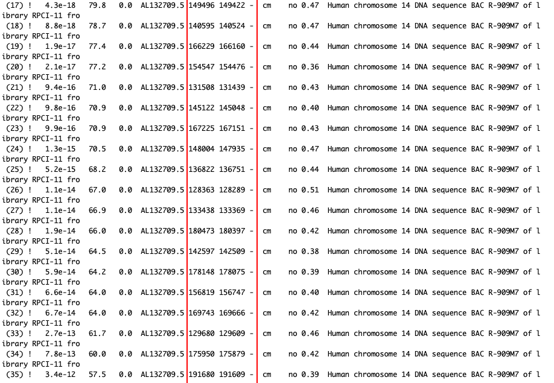

# Brunel-Project

RNA structure in health and disease - investigation of snoRNA cluster in the imprinted Dlk1-Dio3 region

Russell Hamilton & Anne Ferguson-Smith
Department of Genetics, University of Cambridge, Downing Street, Cambridge, CB2 3EH

The epigenetic phenomenon of genomic imprinting leads to specific genes being expressed in a parent-specific manner. Imprinted genes have key roles in placenta and embryo development, as well as an emerging role in brain development and function. The Dlk1-Dio3 imprinted region contains two maternally expressed small nucleolar RNA (snoRNA) clusters, SNORD113 & SNORD114, containing 9 and 31 copies respectively (10.1016/j.tig.2008.03.011). Human patients with disruptions in this conserved region display growth retardation and facial dysmorphism (10.1038/ng.2007.56). However little is known about the mechanism of action of the snoRNAs in this region. Deletion of the related SNORD116 cluster (paternally expressed) in the SNRPN imprinted region has been shown to be a direct cause of Prader-Willi syndrome and postnatal growth retardation (10.1038/ng.158; 10.1371/journal.pgen.0030235). 

Using open source computational tools we will model the snoRNA 2D and 3D structures of the Dlk1-Dio3 region (10.7490/f1000research.1117078.1). Transcribed as a precursor long non-coding RNA, Rian/MEG8, the C/D box motif containing snoRNAs have been shown to be directed by genomic imprinting and, unusually for snoRNAs, to have brain specific expression. snoRNA have previously been shown to contain Ca2+ sensitive kink-turn (KT) motifs. In low Ca2+, the KTs are in an extended confirmation, but with increased Ca2+ develop a pronounced 60o kink, opening up the nucleotide bases for sequence specific recognition. KT motifs can therefore act as a Ca2+ sensitive switch for mediating protein or tertiary RNA interactions. The brain specific expression of these C/D snoRNAs and demonstration of the existence of calcium sensitive KT motifs would provide valuable insight into these enigmatic snoRNAs and their role in the nervous system. 

Infernal search

##Please note: although the covariation model and its subsequent calibration ran smoothly, the cmsearch using Dlk1 and the .sto file of the SNORD113/114 family did not find similarities between the codes. Have to check Dlk1 file and run search again. 

15.07.2020 Second cmsearch

A second cmsearch was carried out using Human chromosome 14 DNA sequence BAC R-566J3 of library RPCI-11 from chromosome 14 of Homo sapiens (Human). 
GenBank: AL132711.5

A third cmsearch was carried out using Human chromosome 14 DNA sequence BAC R-909M7 of library RPCI-11 from chromosome 14 of Homo sapiens (Human), complete sequence. GeneBank:AL132709.

A total of 68 CM hits were reported, of which 47 had an E-value of 0.01 or less. The coordinates for each sequence are found in the columns within the red box.

#17.07.2020
The coordinates obatined in cmsearch were used to extract the sequences. 

 AL132709seq[168250:168176]
 [1] "a" "c" "c" "t" "g" "g" "t" "t" "a" "c" "t" "a" "c" "t" "g" "g" "t"
[18] "g" "a" "c" "c" "a" "c" "c" "g" "c" "a" "a" "a" "c" "t" "c" "a" "g"
[35] "t" "a" "c" "c" "t" "g" "c" "t" "a" "c" "t" "t" "a" "t" "g" "a" "t"
[52] "g" "c" "a" "c" "a" "g" "a" "c" "t" "t" "t" "g" "a" "g" "a" "c" "t"
[69] "c" "c" "a" "g" "g" "t" "t"
> H1<-AL132709seq[168250:168176]
> length(H1)
[1] 75
> AL132709seq[139624:139553]
 [1] "a" "c" "c" "t" "a" "g" "t" "t" "a" "c" "t" "a" "c" "t" "g" "g" "t"
[18] "g" "a" "c" "c" "a" "c" "c" "g" "c" "a" "t" "a" "c" "t" "c" "a" "g"
[35] "t" "a" "t" "a" "c" "a" "c" "t" "a" "c" "t" "t" "a" "t" "g" "c" "a"
[52] "c" "a" "g" "a" "c" "c" "t" "t" "g" "a" "g" "a" "c" "t" "c" "c" "a"
[69] "g" "g" "t" "g"
> H2<-AL132709seq[139624:139553]
> length(H2)
[1] 72
> AL132709seq[137723:137652]
 [1] "a" "c" "c" "t" "a" "g" "c" "t" "a" "c" "t" "a" "c" "t" "g" "a" "t"
[18] "g" "a" "c" "c" "a" "c" "c" "g" "c" "a" "t" "a" "c" "t" "c" "a" "g"
[35] "t" "a" "t" "c" "t" "g" "t" "t" "a" "c" "t" "t" "a" "t" "g" "c" "a"
[52] "c" "a" "g" "a" "c" "c" "t" "t" "g" "a" "g" "a" "c" "t" "c" "c" "a"
[69] "g" "g" "t" "a"
> H3<-AL132709seq[137723:137652]
> AL132709seq[155570:155499]
 [1] "a" "c" "c" "t" "a" "g" "c" "t" "a" "c" "t" "a" "c" "t" "g" "a" "c"
[18] "g" "a" "c" "c" "a" "c" "c" "g" "c" "a" "t" "a" "c" "t" "c" "a" "g"
[35] "a" "a" "t" "g" "t" "a" "c" "t" "a" "c" "t" "t" "a" "t" "g" "c" "a"
[52] "c" "a" "g" "a" "c" "c" "t" "t" "g" "a" "g" "a" "c" "t" "c" "c" "a"
[69] "g" "g" "t" "a"
> H4<-AL132709seq[155570:155499]
> length(H4)
[1] 72
> AL132709seq[148929:148858]
 [1] "a" "c" "c" "t" "a" "g" "c" "t" "a" "c" "t" "a" "c" "t" "g" "g" "t"
[18] "g" "a" "c" "c" "a" "c" "c" "g" "c" "a" "t" "a" "c" "t" "c" "a" "g"
[35] "t" "a" "t" "g" "t" "a" "c" "t" "a" "c" "t" "t" "a" "t" "a" "c" "a"
[52] "c" "a" "g" "a" "c" "c" "t" "t" "g" "a" "g" "a" "c" "t" "c" "c" "a"
[69] "g" "g" "a" "a"
> H5<-AL132709seq[148929:148858]
> length(H5)
[1] 72
> AL132709seq[138673:138602]
 [1] "a" "c" "c" "t" "a" "g" "c" "t" "a" "c" "t" "a" "c" "t" "g" "a" "t"
[18] "g" "g" "c" "c" "a" "c" "c" "g" "c" "a" "t" "a" "c" "t" "c" "a" "g"
[35] "t" "a" "t" "a" "c" "a" "c" "t" "a" "c" "t" "t" "a" "t" "g" "c" "a"
[52] "c" "a" "a" "a" "c" "c" "t" "t" "g" "a" "g" "a" "c" "t" "c" "c" "a"
[69] "g" "g" "t" "a"
> H6<-AL132709seq[138673:138602]
> length(H6)
[1] 72
> AL132709seq[152651:152577]
 [1] "a" "c" "c" "t" "g" "g" "t" "t" "a" "c" "t" "a" "c" "t" "g" "t" "t" "t"
[19] "a" "t" "g" "g" "c" "c" "g" "c" "a" "t" "a" "c" "t" "c" "a" "g" "a" "a"
[37] "c" "c" "t" "a" "c" "t" "a" "c" "t" "t" "a" "t" "t" "a" "t" "g" "c" "a"
[55] "c" "a" "g" "a" "c" "c" "t" "t" "g" "a" "g" "a" "c" "t" "c" "c" "a" "g"
[73] "g" "t" "a"
> H7<-AL132709seq[152651:152577]
> length(H7)
[1] 75
> AL132709seq[146793:146719]
 [1] "a" "c" "c" "t" "g" "g" "t" "t" "a" "c" "t" "a" "c" "t" "g" "t" "t" "t"
[19] "a" "c" "c" "a" "c" "c" "g" "t" "a" "a" "c" "c" "t" "c" "a" "a" "t" "a"
[37] "c" "c" "t" "g" "c" "t" "a" "c" "t" "t" "a" "c" "t" "a" "t" "a" "c" "a"
[55] "c" "a" "g" "a" "c" "t" "t" "t" "g" "a" "g" "a" "c" "t" "c" "c" "a" "g"
[73] "g" "t" "t"
> H8<-AL132709seq[146793:146719]
> length(H8)
[1] 75
> AL132709seq[134553:134482]
 [1] "a" "c" "c" "t" "a" "g" "c" "t" "a" "c" "t" "a" "c" "t" "c" "g" "t" "g"
[19] "a" "c" "c" "a" "c" "c" "t" "c" "a" "t" "a" "c" "t" "c" "a" "g" "t" "g"
[37] "t" "a" "t" "g" "c" "t" "a" "c" "t" "t" "a" "t" "g" "c" "a" "c" "a" "g"
[55] "a" "c" "c" "t" "t" "g" "a" "g" "a" "c" "t" "c" "c" "a" "g" "g" "t" "a"
> H9<-AL132709seq[134553:134482]
> length(H9)
[1] 72
> AL132709seq[132469:132398]
 [1] "a" "c" "c" "t" "a" "g" "c" "t" "a" "c" "t" "a" "c" "t" "g" "a" "c" "g"
[19] "a" "c" "c" "a" "c" "c" "g" "c" "a" "t" "a" "c" "t" "c" "a" "g" "t" "a"
[37] "t" "a" "c" "g" "c" "t" "a" "c" "t" "t" "a" "t" "g" "c" "a" "c" "a" "g"
[55] "a" "t" "c" "t" "t" "g" "a" "g" "a" "c" "t" "c" "c" "a" "g" "g" "t" "a"
> H10<-AL132709seq[132469:132398]
> length(H10)
[1] 72
> AL132709seq[171766:171695]
 [1] "a" "c" "c" "t" "g" "g" "a" "t" "a" "c" "t" "a" "c" "t" "a" "c" "t" "g"
[19] "a" "c" "c" "a" "c" "c" "g" "c" "a" "t" "a" "c" "t" "c" "a" "g" "t" "a"
[37] "a" "c" "t" "g" "c" "c" "a" "c" "t" "t" "a" "t" "g" "t" "c" "c" "a" "g"
[55] "a" "c" "c" "t" "t" "c" "a" "g" "a" "c" "t" "c" "c" "a" "g" "g" "t" "t"
> H11<-AL132709seq[171766:171695]
> length(H11)
[1] 72
> AL132709seq[135542:135471]
 [1] "a" "c" "c" "t" "a" "g" "c" "t" "a" "c" "t" "a" "c" "t" "g" "a" "t" "g"
[19] "a" "c" "c" "a" "c" "c" "g" "c" "a" "t" "a" "c" "t" "c" "a" "g" "a" "a"
[37] "a" "a" "c" "g" "c" "t" "a" "c" "t" "t" "a" "t" "g" "c" "a" "c" "a" "g"
[55] "a" "t" "c" "t" "t" "g" "a" "g" "a" "c" "t" "c" "c" "a" "g" "g" "c" "a"
> H12<-AL132709seq[135542:135471]
> length(H12)
[1] 72
> AL132709seq[153488:153414]
 [1] "a" "c" "c" "t" "g" "g" "t" "c" "a" "c" "t" "a" "c" "c" "a" "c" "t" "g"
[19] "a" "c" "c" "a" "c" "c" "a" "c" "a" "c" "a" "c" "t" "c" "a" "g" "t" "a"
[37] "c" "g" "t" "g" "t" "c" "a" "c" "t" "t" "a" "t" "a" "g" "t" "a" "c" "a"
[55] "c" "a" "g" "a" "c" "c" "t" "t" "g" "a" "g" "a" "c" "t" "c" "c" "a" "g"
[73] "g" "t" "t"
> H13<-AL132709seq[153488:153414]
> length(H13)
[1] 75
> AL132709seq[145774:145703]
 [1] "a" "t" "c" "t" "a" "g" "t" "c" "a" "c" "t" "a" "c" "t" "g" "a" "t" "g"
[19] "a" "c" "a" "a" "c" "c" "a" "c" "a" "t" "a" "c" "t" "c" "a" "g" "t" "a"
[37] "t" "a" "t" "g" "c" "t" "a" "c" "t" "t" "a" "t" "g" "t" "a" "c" "a" "g"
[55] "a" "c" "t" "t" "t" "a" "a" "g" "a" "c" "t" "c" "c" "a" "g" "g" "t" "t"
> H14<-AL132709seq[145774:145703]
> length(H14)
[1] 72
> AL132709seq[151720:151647]
 [1] "a" "c" "c" "t" "g" "g" "t" "c" "a" "c" "t" "a" "c" "t" "g" "g" "t" "g"
[19] "a" "c" "c" "a" "c" "c" "g" "t" "a" "t" "a" "c" "t" "c" "a" "g" "t" "a"
[37] "t" "g" "t" "g" "t" "a" "c" "t" "t" "g" "t" "g" "g" "t" "a" "c" "a" "a"
[55] "a" "g" "a" "t" "c" "t" "t" "g" "a" "g" "a" "c" "t" "c" "c" "a" "g" "g"
[73] "t" "t"
> H15<-AL132709seq[151720:151647]
> length(H15)
[1] 74
[1] 72
> AL132709seq[164433:164362]
 [1] "a" "c" "c" "t" "a" "g" "t" "t" "a" "c" "t" "a" "c" "a" "g" "g" "t" "g"
[19] "a" "c" "c" "a" "c" "c" "g" "c" "a" "t" "a" "t" "t" "t" "a" "g" "t" "a"
[37] "t" "a" "a" "a" "c" "c" "a" "c" "t" "t" "a" "t" "a" "t" "a" "c" "a" "g"
[55] "a" "c" "c" "t" "t" "g" "a" "g" "a" "c" "t" "c" "c" "a" "g" "g" "t" "t"
> H16<-AL132709seq[164433:164362]
> length(H16)
[1] 72
> AL132709seq[149496:149422]
 [1] "a" "c" "c" "t" "g" "g" "t" "t" "a" "c" "t" "a" "c" "t" "g" "t" "t" "g"
[19] "a" "c" "g" "g" "c" "c" "g" "c" "a" "t" "a" "c" "t" "c" "a" "c" "a" "a"
[37] "c" "c" "c" "a" "c" "t" "a" "c" "t" "t" "a" "t" "t" "a" "t" "g" "c" "a"
[55] "c" "a" "g" "a" "t" "c" "t" "t" "g" "a" "g" "a" "c" "t" "c" "c" "a" "g"
[73] "g" "t" "t"
> H17<-AL132709seq[149496:149422]
> length(H17)
[1] 75
> AL132709seq[140595:140524]
 [1] "a" "c" "c" "t" "a" "g" "c" "t" "a" "c" "t" "a" "c" "t" "g" "a" "t" "g"
[19] "a" "c" "c" "a" "c" "c" "g" "c" "a" "t" "a" "c" "t" "c" "a" "g" "t" "a"
[37] "g" "a" "t" "g" "t" "c" "a" "c" "t" "t" "a" "t" "g" "c" "a" "g" "a" "g"
[55] "a" "c" "c" "t" "t" "g" "a" "g" "a" "c" "t" "c" "c" "a" "g" "a" "c" "a"
> H18<-AL132709seq[140595:140524]
> length(H18)
[1] 72
> AL132709seq[166229:166160]
 [1] "a" "c" "c" "t" "a" "a" "c" "t" "a" "c" "t" "a" "c" "t" "g" "g" "t" "g"
[19] "a" "c" "c" "a" "c" "c" "g" "g" "a" "t" "a" "c" "t" "c" "a" "g" "t" "a"
[37] "t" "g" "t" "t" "a" "c" "t" "t" "a" "t" "g" "c" "a" "c" "a" "g" "a" "t"
[55] "c" "t" "t" "g" "a" "g" "a" "c" "t" "c" "c" "a" "g" "g" "t" "a"
> H19<-AL132709seq[166229:166160]
> length(H19)
[1] 70
> AL132709seq[154547:154476]
 [1] "t" "t" "c" "t" "a" "g" "t" "t" "a" "c" "t" "a" "c" "t" "g" "a" "t" "g"
[19] "a" "c" "a" "a" "t" "c" "a" "c" "a" "t" "a" "c" "t" "c" "a" "a" "t" "g"
[37] "t" "g" "t" "a" "c" "t" "a" "c" "t" "t" "a" "t" "g" "t" "a" "c" "a" "g"
[55] "a" "c" "t" "t" "t" "g" "a" "g" "a" "c" "t" "c" "c" "a" "g" "g" "t" "a"
> H20<-AL132709seq[154547:154476]
> length(H20)
[1] 72
> AL132709seq[131508:131439]
 [1] "a" "c" "c" "t" "a" "g" "c" "t" "a" "c" "t" "a" "c" "t" "g" "a" "t" "g"
[19] "a" "c" "c" "a" "t" "c" "g" "t" "a" "c" "t" "c" "a" "g" "t" "a" "t" "a"
[37] "t" "g" "t" "c" "a" "c" "t" "t" "a" "t" "g" "t" "a" "c" "a" "g" "a" "c"
[55] "c" "t" "t" "g" "a" "g" "a" "c" "t" "c" "c" "a" "g" "a" "c" "a"
> H21<-AL132709seq[131508:131439]
> length(H21)
[1] 70
> AL132709seq[145122:145048]
 [1] "a" "c" "c" "t" "a" "g" "t" "t" "a" "c" "t" "a" "t" "t" "t" "t" "g" "a"
[19] "a" "c" "g" "a" "c" "c" "g" "t" "a" "t" "a" "c" "t" "t" "a" "g" "a" "a"
[37] "c" "c" "t" "a" "t" "t" "a" "c" "c" "t" "a" "c" "t" "a" "t" "g" "c" "a"
[55] "c" "a" "c" "a" "c" "c" "t" "t" "g" "a" "g" "a" "c" "t" "c" "c" "a" "g"
[73] "g" "t" "t"
> H22<-AL132709seq[145122:145048]
> length(H22)
[1] 75
> AL132709seq[167225:167151]
 [1] "a" "c" "t" "c" "g" "g" "t" "c" "a" "c" "t" "a" "c" "t" "t" "t" "t" "g"
[19] "a" "c" "c" "a" "c" "c" "g" "t" "a" "t" "c" "t" "t" "c" "a" "g" "t" "t"
[37] "c" "c" "t" "a" "c" "g" "a" "c" "t" "t" "a" "t" "t" "a" "c" "a" "c" "a"
[55] "c" "a" "g" "a" "t" "c" "t" "t" "g" "a" "g" "a" "c" "t" "c" "c" "a" "a"
[73] "g" "t" "t"
> H23<-AL132709seq[167225:167151]
> length(H23)
[1] 75
> AL132709seq[148004:147935]
 [1] "a" "c" "c" "t" "g" "g" "t" "t" "a" "a" "t" "a" "c" "t" "g" "a" "t" "g"
[19] "a" "c" "c" "a" "c" "a" "c" "t" "c" "a" "g" "t" "g" "c" "g" "t" "a" "t"
[37] "t" "a" "c" "t" "t" "g" "t" "g" "g" "t" "g" "c" "a" "c" "a" "g" "a" "c"
[55] "c" "t" "t" "g" "a" "g" "a" "c" "t" "c" "c" "a" "g" "g" "t" "t"
> H24<-AL132709seq[148004:147935]
> length(H24)
[1] 70
> AL132709seq[136822:136751]
 [1] "a" "c" "c" "t" "a" "g" "c" "t" "a" "c" "c" "a" "c" "t" "g" "a" "c" "a"
[19] "a" "c" "t" "a" "c" "c" "g" "t" "a" "t" "a" "c" "t" "g" "a" "g" "t" "g"
[37] "t" "a" "t" "a" "c" "t" "a" "c" "t" "c" "a" "t" "g" "c" "a" "t" "a" "g"
[55] "a" "c" "c" "t" "t" "g" "a" "g" "a" "c" "t" "c" "c" "a" "g" "a" "c" "a"
> H25<-AL132709seq[136822:136751]
> length(H25)
[1] 72
> AL132709seq[128363:128289]
 [1] "a" "c" "t" "c" "g" "t" "t" "c" "g" "c" "t" "a" "c" "t" "g" "t" "c" "g"
[19] "g" "c" "c" "a" "c" "c" "a" "c" "a" "c" "a" "c" "t" "c" "a" "g" "t" "a"
[37] "c" "c" "t" "c" "c" "t" "a" "c" "t" "t" "a" "t" "g" "a" "t" "t" "c" "a"
[55] "c" "g" "g" "a" "c" "c" "t" "t" "g" "a" "g" "a" "c" "t" "c" "c" "a" "a"
[73] "g" "t" "t"
> H26<-AL132709seq[128363:128289]
> length(H26)
[1] 75
> AL132709seq[133438:133369]
 [1] "a" "c" "c" "a" "a" "g" "t" "c" "a" "c" "a" "a" "c" "t" "g" "a" "t" "g"
[19] "a" "c" "c" "a" "c" "a" "g" "c" "a" "c" "a" "c" "t" "c" "a" "g" "t" "a"
[37] "t" "g" "t" "t" "a" "c" "t" "t" "a" "t" "g" "t" "a" "c" "a" "g" "a" "c"
[55] "c" "t" "t" "g" "a" "g" "a" "c" "t" "c" "c" "g" "g" "g" "t" "a"
> H27<-AL132709seq[133438:133369]
> length(H27)
[1] 70
> AL132709seq[180473:180397]
 [1] "a" "c" "c" "t" "a" "g" "t" "t" "a" "c" "t" "a" "c" "t" "c" "a" "t" "a"
[19] "c" "g" "c" "a" "c" "c" "c" "c" "g" "t" "a" "g" "a" "c" "t" "t" "a" "g"
[37] "t" "t" "t" "a" "t" "a" "a" "g" "a" "c" "t" "a" "a" "t" "a" "t" "g" "g"
[55] "g" "a" "c" "a" "g" "a" "c" "a" "t" "a" "g" "a" "g" "a" "c" "t" "c" "c"
[73] "a" "g" "g" "t" "a"
> H28<-AL132709seq[180473:180397]
> length(H28)
[1] 77
> AL132709seq[142597:142509]
 [1] "a" "c" "c" "t" "g" "a" "c" "a" "a" "c" "t" "a" "c" "t" "g" "t" "t" "c"
[19] "a" "c" "c" "a" "c" "c" "g" "a" "a" "t" "a" "c" "a" "c" "c" "a" "a" "c"
[37] "a" "t" "g" "t" "a" "c" "g" "a" "c" "c" "a" "a" "c" "a" "t" "a" "t" "a"
[55] "c" "t" "t" "c" "t" "t" "a" "t" "a" "a" "t" "g" "t" "a" "t" "a" "g" "a"
[73] "c" "t" "t" "t" "g" "a" "a" "a" "c" "t" "c" "c" "a" "g" "g" "t" "t"
> H29<-AL132709seq[142597:142509]
> length(H29)
[1] 89
> AL132709seq[178148:178075]
 [1] "a" "c" "c" "t" "g" "g" "t" "t" "a" "c" "t" "a" "c" "t" "c" "t" "a" "a"
[19] "c" "c" "t" "c" "c" "c" "a" "c" "a" "g" "a" "c" "t" "t" "a" "g" "t" "t"
[37] "t" "t" "t" "a" "a" "a" "a" "c" "t" "a" "a" "t" "t" "t" "c" "g" "g" "t"
[55] "a" "g" "a" "c" "a" "t" "t" "g" "a" "g" "a" "c" "t" "c" "c" "a" "g" "g"
[73] "t" "a"
> H30<-AL132709seq[178148:178075]
> length(H30)
[1] 74
> AL132709seq[156819:156747]
 [1] "a" "a" "c" "t" "a" "c" "t" "a" "t" "a" "c" "t" "a" "c" "c" "g" "g" "t"
[19] "g" "a" "c" "c" "a" "c" "c" "g" "a" "a" "t" "a" "c" "t" "c" "a" "g" "a"
[37] "a" "t" "a" "t" "g" "t" "c" "a" "c" "t" "t" "a" "t" "g" "t" "a" "c" "a"
[55] "a" "a" "c" "t" "t" "t" "g" "a" "g" "a" "c" "t" "c" "c" "a" "g" "a" "c"
[73] "a"
> H31<-AL132709seq[156819:156747]
> length(H31)
[1] 73
> AL132709seq[169743:169666]
 [1] "c" "c" "c" "t" "g" "g" "t" "t" "a" "c" "t" "a" "t" "t" "a" "c" "t" "g"
[19] "a" "c" "a" "a" "c" "c" "c" "c" "a" "t" "a" "c" "t" "c" "a" "g" "t" "c"
[37] "a" "c" "t" "c" "c" "a" "a" "c" "t" "t" "a" "t" "t" "g" "t" "c" "a" "a"
[55] "a" "c" "a" "t" "a" "g" "a" "c" "c" "t" "t" "t" "a" "g" "a" "c" "t" "c"
[73] "c" "a" "g" "g" "t" "t"
> H32<-AL132709seq[169743:169666]
> length(H32)
[1] 78
> AL132709seq[129680:129609]
 [1] "a" "c" "c" "t" "a" "g" "t" "t" "a" "g" "t" "a" "c" "t" "g" "a" "t" "g"
[19] "a" "c" "c" "a" "t" "a" "a" "c" "c" "t" "a" "c" "c" "c" "a" "g" "a" "a"
[37] "g" "c" "a" "g" "t" "c" "a" "c" "t" "t" "a" "c" "g" "g" "a" "t" "a" "g"
[55] "a" "c" "c" "t" "t" "g" "a" "g" "a" "c" "t" "c" "c" "a" "g" "g" "t" "a"
> H33<-AL132709seq[129680:129609]
> length(H33)
[1] 72
> AL132709seq[175950:175879]
 [1] "a" "c" "c" "t" "a" "g" "t" "t" "a" "c" "t" "a" "c" "t" "c" "a" "t" "g"
[19] "g" "g" "a" "c" "c" "c" "c" "a" "c" "a" "g" "a" "c" "t" "t" "a" "g" "a"
[37] "a" "c" "c" "t" "a" "a" "a" "a" "c" "t" "a" "a" "t" "t" "t" "g" "g" "g"
[55] "a" "t" "a" "t" "t" "g" "a" "g" "a" "c" "t" "c" "c" "a" "g" "g" "t" "a"
> H34<-AL132709seq[175950:175879]
> length(H34)
[1] 72
> AL132709seq[191680:191609]
 [1] "a" "t" "c" "t" "g" "g" "t" "t" "a" "c" "t" "a" "c" "t" "c" "a" "t" "a"
[19] "a" "g" "a" "c" "c" "c" "c" "a" "c" "a" "g" "a" "c" "t" "t" "a" "g" "t"
[37] "t" "a" "c" "t" "a" "a" "a" "a" "c" "t" "a" "a" "t" "t" "t" "g" "g" "g"
[55] "a" "c" "a" "t" "t" "g" "a" "g" "a" "c" "t" "c" "c" "a" "g" "g" "t" "a"
> H35<-AL132709seq[191680:191609]
> length(H35)
[1] 72
> AL132709seq[182043:181969]
 [1] "a" "c" "c" "t" "g" "g" "t" "c" "a" "c" "t" "a" "c" "t" "t" "a" "t" "a"
[19] "g" "t" "a" "c" "c" "c" "c" "a" "a" "a" "g" "a" "c" "t" "t" "t" "g" "t"
[37] "t" "g" "t" "a" "a" "a" "a" "a" "c" "t" "a" "a" "t" "t" "t" "g" "g" "g"
[55] "t" "a" "g" "a" "c" "g" "t" "t" "g" "a" "g" "a" "c" "t" "c" "c" "a" "g"
[73] "g" "t" "a"
> H36<-AL132709seq[182043:181969]
> length(H36)
[1] 75
> AL132709seq[183412:183335]
 [1] "a" "c" "c" "t" "a" "g" "t" "t" "a" "c" "t" "a" "c" "t" "c" "a" "t" "a"
[19] "a" "c" "c" "a" "c" "c" "t" "c" "c" "a" "c" "a" "g" "a" "c" "t" "t" "a"
[37] "g" "t" "t" "g" "t" "g" "a" "a" "a" "a" "c" "t" "a" "a" "t" "t" "c" "g"
[55] "g" "g" "a" "g" "a" "c" "a" "c" "a" "t" "t" "g" "a" "g" "a" "c" "t" "c"
[73] "t" "a" "g" "a" "c" "a"
> H37<-AL132709seq[183412:183335]
> length(H37)
[1] 78
> AL132709seq[185108:185034]
 [1] "a" "c" "c" "t" "g" "g" "t" "t" "a" "c" "t" "a" "c" "t" "c" "a" "t" "g"
[19] "g" "t" "a" "c" "c" "c" "c" "a" "t" "a" "g" "a" "c" "t" "t" "t" "g" "t"
[37] "c" "c" "t" "a" "a" "a" "a" "a" "c" "t" "a" "a" "t" "t" "t" "g" "g" "g"
[55] "t" "a" "t" "a" "c" "g" "t" "t" "a" "a" "g" "a" "c" "t" "c" "c" "a" "g"
[73] "g" "t" "a"
> H38<-AL132709seq[185108:185034]
> length(H38)
[1] 75
> AL132709seq[158545:158469]
 [1] "a" "c" "t" "t" "g" "a" "t" "c" "a" "c" "c" "a" "c" "t" "a" "c" "c" "g"
[19] "a" "a" "c" "a" "c" "c" "g" "t" "a" "t" "a" "a" "a" "t" "c" "a" "g" "t"
[37] "g" "t" "c" "t" "a" "c" "t" "a" "c" "t" "t" "a" "t" "t" "t" "a" "t" "g"
[55] "t" "a" "c" "g" "g" "a" "c" "t" "c" "t" "g" "a" "g" "a" "c" "t" "c" "c"
[73] "a" "a" "t" "c" "a"
> H39<-AL132709seq[158545:158469]
> length(H39)
[1] 77
> AL132709seq[165359:165287]
 [1] "a" "c" "t" "t" "a" "g" "t" "t" "a" "c" "c" "a" "c" "t" "g" "g" "t" "g"
[19] "a" "c" "c" "a" "c" "c" "g" "t" "a" "t" "a" "t" "t" "c" "a" "g" "t" "a"
[37] "c" "c" "t" "a" "c" "t" "a" "c" "t" "t" "a" "t" "a" "c" "t" "c" "t" "t"
[55] "c" "t" "t" "t" "t" "c" "t" "t" "a" "g" "a" "t" "c" "c" "a" "a" "a" "a"
[73] "a"
> H40<-AL132709seq[165359:165287]
> length(H40)
[1] 73
> AL132709seq[144210:144134]
 [1] "a" "c" "c" "t" "g" "g" "t" "t" "a" "c" "t" "a" "c" "t" "a" "c" "t" "g"
[19] "a" "c" "c" "a" "c" "c" "a" "c" "a" "t" "a" "c" "t" "c" "a" "a" "t" "t"
[37] "t" "c" "c" "a" "c" "t" "a" "c" "t" "t" "a" "t" "c" "a" "t" "t" "c" "a"
[55] "c" "a" "g" "a" "a" "a" "c" "a" "a" "t" "c" "a" "c" "c" "g" "t" "t" "c"
[73] "a" "a" "g" "t" "c"
> H41<-AL132709seq[144210:144134]
> length(H41)
[1] 77
> AL132709seq[141607:141533]
 [1] "a" "t" "c" "t" "t" "g" "t" "t" "g" "c" "t" "a" "t" "t" "g" "t" "t" "t"
[19] "a" "t" "c" "a" "t" "c" "a" "c" "g" "t" "c" "c" "t" "c" "a" "g" "t" "a"
[37] "t" "t" "t" "g" "a" "t" "a" "c" "t" "c" "a" "t" "t" "a" "t" "a" "c" "a"
[55] "c" "a" "c" "a" "c" "c" "t" "t" "g" "a" "g" "a" "c" "t" "c" "g" "t" "a"
[73] "g" "t" "t"
> H42<-AL132709seq[141607:141533]
> length(H42)
[1] 75
> AL132709seq[123132:123058]
 [1] "a" "c" "c" "t" "g" "g" "t" "t" "a" "c" "t" "a" "c" "a" "c" "t" "t" "a"
[19] "c" "c" "t" "t" "a" "c" "g" "t" "a" "g" "a" "c" "t" "t" "a" "t" "t" "t"
[37] "t" "t" "a" "a" "t" "a" "c" "t" "a" "g" "t" "t" "a" "g" "t" "c" "a" "a"
[55] "a" "a" "a" "c" "c" "t" "t" "g" "t" "t" "g" "a" "c" "t" "c" "c" "a" "g"
[73] "g" "t" "g"
> H43<-AL132709seq[123132:123058]
> length(H43)
[1] 75
> AL132709seq[127342:127269]
 [1] "a" "c" "c" "g" "g" "g" "t" "c" "t" "c" "t" "a" "c" "t" "a" "c" "t" "g"
[19] "a" "g" "c" "a" "c" "c" "c" "a" "t" "a" "c" "t" "c" "a" "g" "t" "t" "c"
[37] "c" "t" "a" "c" "t" "a" "c" "t" "c" "a" "t" "t" "a" "t" "c" "c" "t" "c"
[55] "a" "g" "t" "c" "c" "t" "t" "c" "a" "a" "a" "t" "t" "c" "g" "a" "g" "g"
[73] "c" "t"
> H44<-AL132709seq[127342:127269]
> length(H44)
[1] 74
> AL132709seq[196778:196707]
 [1] "t" "t" "t" "c" "a" "c" "t" "c" "a" "c" "t" "a" "c" "t" "t" "a" "t" "c"
[19] "a" "a" "g" "a" "c" "a" "c" "c" "g" "t" "a" "t" "a" "c" "t" "t" "a" "g"
[37] "t" "a" "a" "t" "t" "a" "a" "a" "a" "c" "t" "a" "a" "t" "t" "t" "g" "g"
[55] "g" "a" "t" "t" "t" "g" "a" "g" "a" "c" "t" "t" "c" "a" "g" "g" "t" "a"
> H45<-AL132709seq[196778:196707]
> length(H45)
[1] 72
> AL132709seq[150469:150399]
 [1] "c" "a" "c" "t" "t" "t" "t" "a" "a" "c" "t" "c" "t" "g" "g" "t" "t" "a"
[19] "c" "t" "a" "c" "c" "g" "c" "a" "c" "t" "c" "g" "g" "t" "a" "t" "a" "t"
[37] "g" "t" "t" "a" "c" "t" "c" "a" "t" "t" "t" "t" "g" "t" "a" "c" "a" "g"
[55] "a" "c" "c" "t" "g" "a" "a" "a" "c" "t" "a" "c" "a" "g" "g" "t" "t"
> H46<-AL132709seq[150469:150399]
> length(H46)
[1] 71
> AL132709seq[194257:194186]
 [1] "t" "a" "t" "c" "g" "g" "t" "t" "a" "g" "t" "a" "a" "t" "c" "a" "t" "a"
[19] "a" "g" "a" "c" "t" "c" "g" "a" "c" "a" "t" "c" "c" "t" "t" "a" "g" "t"
[37] "t" "t" "c" "t" "a" "a" "a" "a" "c" "t" "a" "a" "t" "c" "t" "a" "a" "g"
[55] "a" "c" "a" "t" "t" "g" "a" "g" "t" "c" "t" "c" "c" "a" "a" "a" "t" "a"
> H47<-AL132709seq[194257:194186]
> length(H47)
[1] 72

TO DO: in order to carry out the MSA a FASTA file containing the 47 sequences is rquired. This will allow us to compare the sequences and find out how the copies that make up each snoRNA might differ. 

References

Barlow, D.P., Stoger, R., Herrmann, B.G., Saito, K. and Schweifer, N. (1991) 'The mouse insulin-like growth factor type-2 receptor is imprinted and closely linked to the Tme locus', Nature, 349(6304), pp. 84-87. doi: 10.1038/349084a0 [doi].

Dawson, W.K. and Bujnicki, J.M. (2016) 'Computational modeling of RNA 3D structures and interactions', Current opinion in structural biology, 37, pp. 22-28. doi: 10.1016/j.sbi.2015.11.007 [doi].

Edwards, C.A., Mungall, A.J., Matthews, L., Ryder, E., Gray, D.J., Pask, A.J., Shaw, G., Graves, J.A., Rogers, J., SAVOIR consortium, Dunham, I., Renfree, M.B. and Ferguson-Smith, A.C. (2008) 'The evolution of the DLK1-DIO3 imprinted domain in mammals', PLoS biology, 6(6), pp. e135. doi: 10.1371/journal.pbio.0060135 [doi].

Enterina, J.R., Enfield, K.S.S., Anderson, C., Marshall, E.A., Ng, K.W. and Lam, W.L. (2017) 'DLK1-DIO3 imprinted locus deregulation in development, respiratory disease, and cancer', Expert review of respiratory medicine, 11(9), pp. 749-761. doi: 10.1080/17476348.2017.1355241 [doi].

Li, E., Beard, C. and Jaenisch, R. (1993) 'Role for DNA methylation in genomic imprinting', Nature, 366(6453), pp. 362-365. doi: 10.1038/366362a0 [doi].

Magnus, M., Boniecki, M.J., Dawson, W. and Bujnicki, J.M. (2016) 'SimRNAweb: a web server for RNA 3D structure modeling with optional restraints', Nucleic acids research, 44(W1), pp. 315. doi: 10.1093/nar/gkw279 [doi].

Samarsky, D.A., Fournier, M.J., Singer, R.H. and Bertrand, E. (1998) 'The snoRNA box C/D motif directs nucleolar targeting and also couples snoRNA synthesis and localization', The EMBO journal, 17(13), pp. 3747-3757. doi: 10.1093/emboj/17.13.3747 [doi].

Schmidt, J.V., Matteson, P.G., Jones, B.K., Guan, X.J. and Tilghman, S.M. (2000) 'The Dlk1 and Gtl2 genes are linked and reciprocally imprinted', Genes & development, 14(16), pp. 1997-2002.

Wang, J., Mao, K., Zhao, Y., Zeng, C., Xiang, J., Zhang, Y. and Xiao, Y. (2017) 'Optimization of RNA 3D structure prediction using evolutionary restraints of nucleotide-nucleotide interactions from direct coupling analysis', Nucleic acids research, 45(11), pp. 6299-6309. doi: 10.1093/nar/gkx386 [doi].
